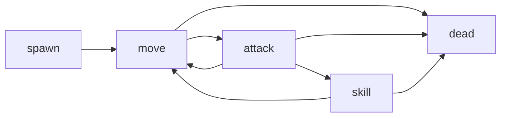

# [SYS-004] 레인 전투 시스템 기획서

## 1. 목표
- 2개 레인에서 유닛 충돌, 타깃팅, 승패 판정을 명확히 정의한다.

## 2. 입력/출력
| 구분 | 내용 |
|---|---|
| 입력 | 유닛 스폰 이벤트, 유닛 스탯, 스킬 발동 |
| 출력 | 피해, 사망, 타워 HP 변화, 승패 상태 |

## 3. 전투 규칙
| 항목 | 규칙 |
|---|---|
| 레인 수 | 2 |
| 타깃 우선순위 | 전방 근접 > 원거리 > 타워 |
| 피해 공식 | `max(1, ATK - DEF)` |
| 종료 조건 | 적 타워 HP 0 또는 제한시간 종료 |

### 3-1. 전투 수치 파라미터
| 파라미터 | 기본값 | 범위 | 비고 |
|---|---|---|---|
| match_time_sec | 240 | 120~300 | 제한시간 |
| tower_hp | 3000 | 2000~5000 | 레인 공통 |
| aggro_scan_interval | 0.2 | 0.1~0.5 | 타깃 재탐색 |
| projectile_speed | 900 | 600~1400 | 원거리 전용 |

### 3-2. 상태 전이 플로우

## 4. 상태
| 상태 | 설명 |
|---|---|
| spawn | 전장 진입 |
| move | 목표 향해 이동 |
| attack | 기본 공격 |
| skill | 스킬 사용 |
| dead | 사망 |

## 5. 예외 처리
| 예외 | 처리 |
|---|---|
| 동시 사망 | 프레임 우선순위 룰 적용 |
| 타깃 소실 | 즉시 재타깃 |
| 무한 전투 | 제한시간 강제 종료 |

### 5-1. 예외 코드
| 코드 | 의미 | UI 반영 |
|---|---|---|
| `E_BTL_001` | 타깃 없음 | 레인 경고 아이콘 숨김 |
| `E_BTL_002` | 배치 거부 | HUD 토스트 표시 |
| `E_BTL_003` | 동점 종료 | 결과 화면 DRAW 표시 |

## 6. 구현 연결
- `scripts/battle/lane_controller.gd`
- `scripts/entities/minion.gd`
- `scripts/minion_states/`

## 7. 검수 기준
- 상태 전이 불능/루프 0건.
- 승패 판정 누락 0건.
- 50판 시뮬레이션에서 평균 프레임 55fps 이상.
- 동시 사망 케이스 결과 불일치 0건.
