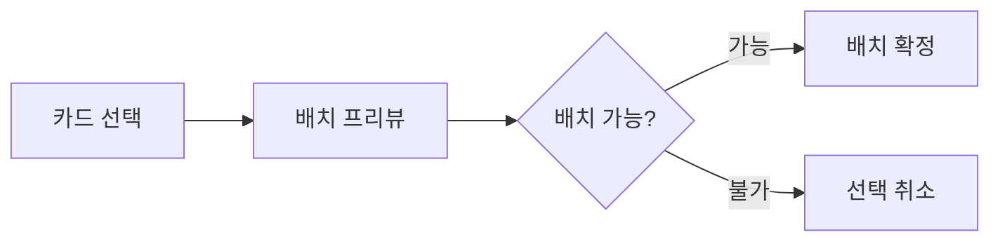
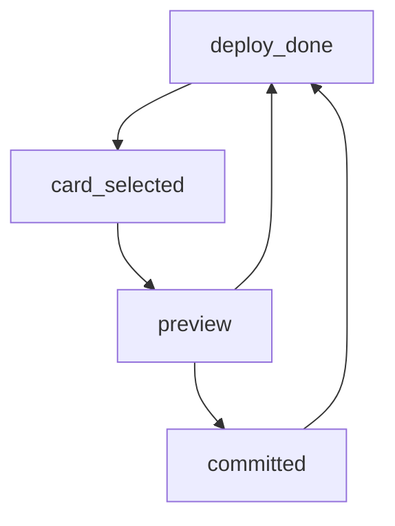

# [UI-003] 전투 HUD UI 기획서

## 1. 목표
- 전투 중 핵심 정보(마나, 손패, 타이머, 레인 상태)를 즉시 읽을 수 있게 한다.

## 2. 화면 레퍼런스

## 3. 사용자 플로우

## 4. 컴포넌트 명세
| 컴포넌트 ID | 타입 | 상태 | 이벤트 | 데이터 |
|---|---|---|---|---|
| HUD-HAND | 카드핸드 | idle/select/locked | select_card | hand_cards |
| HUD-MANA | 게이지 | normal/warn/full | mana_tick | mana_value |
| HUD-TIMER | 텍스트 | running/end | time_update | remain_time |
| HUD-CANCEL | 버튼 | visible/hidden | cancel_deploy | selection_state |
| HUD-LANE-HINT | 오버레이 | on/off | lane_focus | lane_state |

### 4-1. HUD 레이아웃 규칙
| 구역 | 요소 | 규칙 |
|---|---|---|
| 상단 | 타이머/스코어 | 항상 고정 노출 |
| 중앙 | 레인 전장 | 입력 우선권 최고 |
| 하단 | 카드핸드/마나 | 카드 선택 시 확대 |
| 우상단 | 일시정지/옵션 | 전투 중 1클릭 접근 |

### 4-2. 상태 전이

## 5. 예외 처리
| 예외 | 처리 |
|---|---|
| 코스트 부족 | 카드 비활성 + 경고 SFX |
| 잘못된 레인 클릭 | 프리뷰 제거 + 에러 토스트 |
| 입력 중복 | 첫 입력만 처리, 나머지 무시 |

### 5-1. 접근성/가독성 규칙
| 항목 | 기준 |
|---|---|
| 기본 폰트 크기 | 16px 이상 |
| 버튼 최소 터치 영역 | 44px x 44px |
| 경고 색상 대비 | WCAG AA 이상 |
| 입력 피드백 지연 | 150ms 이하 |

## 6. 검수 기준
- 카드 선택 피드백 150ms 이하.
- 배치 불가 케이스 오배치 0건.
- 30분 플레이 시 HUD 요소 겹침 0건.
- 1920x1080 / 1280x720 해상도에서 주요 요소 잘림 0건.
