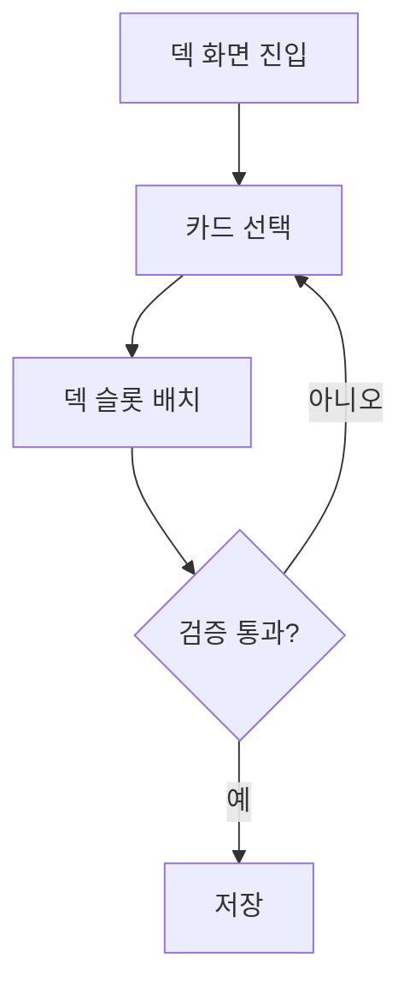

# [UI-002] 덱 빌더 UI 기획서

## 1. 목표
- 카드 편성 규칙을 위반하지 않고 덱 저장을 완료할 수 있게 한다.

## 2. 화면 레퍼런스

## 3. 사용자 플로우

## 4. 컴포넌트 명세
| 컴포넌트 ID | 타입 | 상태 | 이벤트 | 데이터 |
|---|---|---|---|---|
| DECK-CARD-LIST | 리스트 | scroll/select | card_select | owned_cards |
| DECK-SLOT | 슬롯그룹 | empty/filled | slot_assign | draft_deck |
| DECK-CURVE | 차트 | normal/warn | curve_update | mana_curve |
| DECK-SAVE | 버튼 | enabled/disabled | save_deck | deck_validation |

## 5. 예외 처리
| 예외 | 처리 |
|---|---|
| 카드 중복 제한 초과 | 해당 슬롯/카드 빨간 표시 |
| 덱 크기 부족 | 저장 불가 + 부족 수량 표시 |
| 저장 실패 | 재시도/취소 선택 제공 |

## 6. 검수 기준
- 저장 성공 후 로비/전투에서 동일 덱 로딩 100%.
- 규칙 위반 덱 저장 0건.

