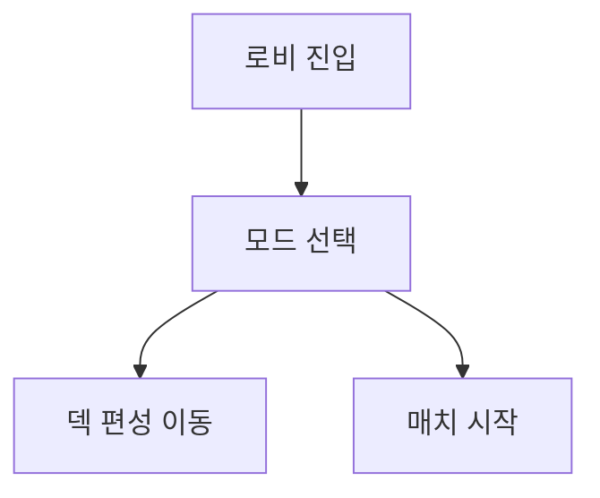

# [UI-001] 메인 로비 UI 기획서

## 1. 목표
- 유저가 2클릭 이내에 `덱 편성` 또는 `매치 시작`으로 이동하게 한다.

## 2. 화면 레퍼런스

## 3. 사용자 플로우

## 4. 컴포넌트 명세
| 컴포넌트 ID | 타입 | 상태 | 이벤트 | 데이터 |
|---|---|---|---|---|
| LOBBY-MODE | 탭 | default/selected | mode_change | mode_state |
| LOBBY-DECK | 버튼 | enabled/disabled | go_deck_builder | deck_valid |
| LOBBY-START | 버튼 | enabled/disabled | start_match | match_state |
| LOBBY-CURRENCY | 라벨 | normal | refresh_currency | wallet |

## 5. 예외 처리
| 예외 | 처리 |
|---|---|
| 덱 미완성 | 시작 버튼 비활성 + 안내 토스트 |
| 네트워크 지연 | 로딩 상태 + 재시도 버튼 |

## 6. 검수 기준
- 로비 -> 덱/매치 전환 시간 300ms 이하.
- 덱 미완성 상태에서 매치 진입 0건.

