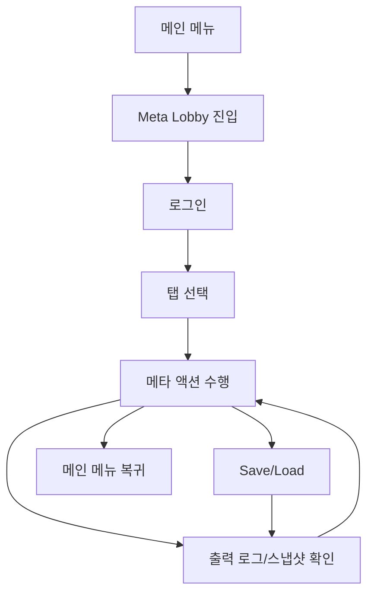

# [UI-META-001] 메타 로비 UI 기획서

## 1. 목표
- 메타 시스템(로그인/상점/채팅/친구/파티/길드/스킬/우편/인벤/로그) 기능을 탭 단위로 분리해 운영성과 가독성을 높인다.
- 영속 저장/복원 버튼으로 상태 회귀 검증 진입점을 제공한다.

## 2. 화면 목록/목표
| 화면 ID | 화면명 | 목표 |
|---|---|---|
| UI-META-01 | Meta Lobby | 메타 시스템 수동 검증, 상태 스냅샷 확인 |

## 3. 사용자 흐름

## 4. 탭 구조
| 탭 | 포함 기능 |
|---|---|
| Economy | 구매, 스냅샷 갱신 |
| Social | 채팅, 친구요청, 파티, 길드 |
| LiveOps | 우편 발송/수령 |
| Combat | 스킬 시전 |

## 5. 컴포넌트/상태/이벤트
| 컴포넌트 ID | 타입 | 상태 | 이벤트 | 연동 서비스 |
|---|---|---|---|---|
| META-LOGIN | Button | enabled/disabled | pressed | AuthService |
| META-SAVE | Button | enabled/disabled | pressed | MetaPersistenceService |
| META-LOAD | Button | enabled/disabled | pressed | MetaPersistenceService |
| META-BUY-STARTER | Button | enabled/disabled | pressed | ShopService |
| META-SEND-CHAT | Button | enabled/disabled | pressed | ChatService |
| META-ADD-FRIEND | Button | enabled/disabled | pressed | SocialService |
| META-CREATE-PARTY | Button | enabled/disabled | pressed | SocialService |
| META-CREATE-GUILD | Button | enabled/disabled | pressed | SocialService |
| META-CAST-SKILL | Button | enabled/disabled | pressed | SkillService |
| META-SEND-MAIL | Button | enabled/disabled | pressed | MailService |
| META-CLAIM-MAIL | Button | enabled/disabled | pressed | MailService |
| META-REFRESH | Button | enabled/disabled | pressed | InventoryService |
| META-OUTPUT | RichTextLabel | append | log_update | LogService |

## 6. 예외 처리
| 케이스 | 처리 |
|---|---|
| 로그인 전 구매 시도 | 실패 로그 출력 |
| 로그인 전 스킬 시도 | 블록 메시지 출력 |
| 수령 가능한 우편 없음 | 안내 메시지 출력 |
| 저장 파일 없음 | load 실패 로그 출력 |

## 7. QA 수용 기준
- Save 클릭 후 `save_all=true` 로그가 출력된다.
- Load 클릭 후 `load_all=true/false`가 명시적으로 출력된다.
- 탭 전환 시 버튼 경로 에러 없이 각 액션이 호출된다.
