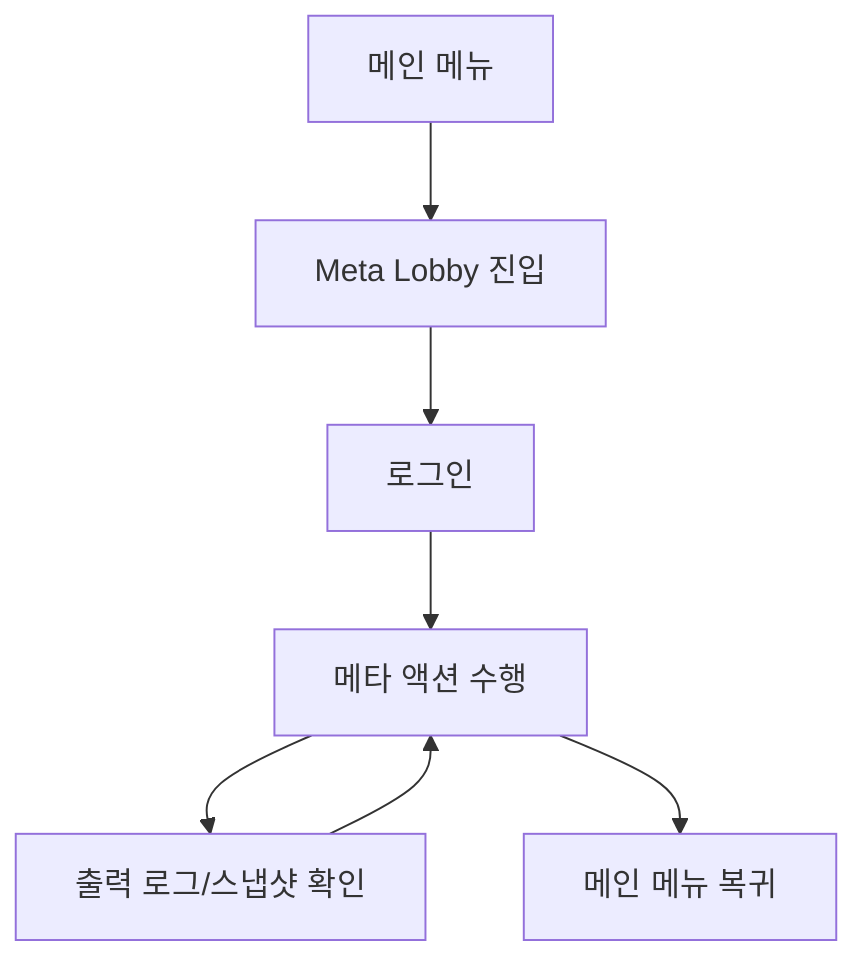

# [UI-META-001] 메타 로비 UI 기획서

## 1. 목표
- 메타 시스템(로그인/상점/채팅/친구/파티/길드/스킬/우편/인벤/로그) 기능을 하나의 테스트 허브 화면에서 호출 가능하게 한다.

## 2. 화면 목록/목표
| 화면 ID | 화면명 | 목표 |
|---|---|---|
| UI-META-01 | Meta Lobby | 메타 시스템 수동 검증, 상태 스냅샷 확인 |

## 3. 사용자 흐름

## 4. 컴포넌트/상태/이벤트
| 컴포넌트 ID | 타입 | 상태 | 이벤트 | 연동 서비스 |
|---|---|---|---|---|
| META-USER-ID | LineEdit | idle/input | text_changed | AuthService |
| META-PASSWORD | LineEdit | idle/input | text_changed | AuthService |
| META-LOGIN | Button | enabled/disabled | pressed | AuthService |
| META-BUY-STARTER | Button | enabled/disabled | pressed | ShopService |
| META-SEND-CHAT | Button | enabled/disabled | pressed | ChatService |
| META-ADD-FRIEND | Button | enabled/disabled | pressed | SocialService |
| META-CREATE-PARTY | Button | enabled/disabled | pressed | SocialService |
| META-CREATE-GUILD | Button | enabled/disabled | pressed | SocialService |
| META-CAST-SKILL | Button | enabled/disabled | pressed | SkillService |
| META-SEND-MAIL | Button | enabled/disabled | pressed | MailService |
| META-CLAIM-MAIL | Button | enabled/disabled | pressed | MailService |
| META-REFRESH | Button | enabled/disabled | pressed | Auth/Inventory |
| META-OUTPUT | RichTextLabel | append | log_update | LogService |

## 5. 예외 처리
| 케이스 | 처리 |
|---|---|
| 로그인 전 구매 시도 | 실패 로그 출력 |
| 로그인 전 스킬 시도 | 블록 메시지 출력 |
| 수령 가능한 우편 없음 | 안내 메시지 출력 |

## 6. QA 수용 기준
- 로그인 -> 구매 -> 인벤 스냅샷 반영 문구가 1초 내 출력된다.
- 우편 수령 후 동일 우편 재수령 시 `false` 결과를 출력한다.
- 메인 메뉴 복귀 버튼으로 `scenes/main.tscn` 전환이 가능하다.
