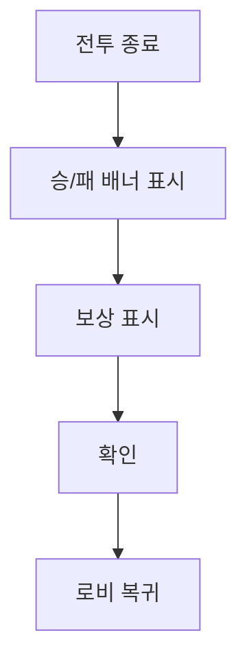

# [UI-004] 결과 UI 기획서

## 1. 목표
- 승패 인지와 보상 수령을 1화면에서 완료한다.

## 2. 화면 레퍼런스

## 3. 사용자 플로우

## 4. 컴포넌트 명세
| 컴포넌트 ID | 타입 | 상태 | 이벤트 | 데이터 |
|---|---|---|---|---|
| RESULT-BANNER | 패널 | victory/defeat/draw | show_result | match_result |
| RESULT-REWARD | 리스트 | loading/ready | load_reward | reward_payload |
| RESULT-CONFIRM | 버튼 | enabled | confirm_result | result_state |
| RESULT-RETRY | 버튼 | enabled/disabled | retry_match | queue_state |

## 5. 예외 처리
| 예외 | 처리 |
|---|---|
| 보상 데이터 지연 | 스켈레톤 로딩 표시 |
| 보상 데이터 누락 | 기본 보상 규칙 적용 + 로그 |
| 중복 확인 입력 | 1회만 처리 |

## 6. 검수 기준
- 결과 화면 진입 실패 0건.
- 보상 노출/지급 데이터 불일치 0건.

