# 랄프 방식 통합 기획서 (100회 반복 실행)

- 문서 버전: v1.0
- 작성일: 2026-02-13 17:29:33
- 작성 언어: 한국어
- 작업 모드: 레퍼런스 수집 -> 기획 -> 그래픽(ComfyUI 우선, KayKit 보조) -> 개발 -> 리뷰 -> QA -> 재검증
- 반복 횟수: 100회
- 이미지 정책: 외부 URL 직접 링크 금지, 로컬 파일 링크만 사용

## 1. 기획 목표

- 장르: 실시간 2레인 카드 배틀
- 핵심 경험: 짧은 전투(3~5분), 높은 선택 밀도, 명확한 카운터플레이
- 개발 방향: 기획 데이터 표준화, 상태머신 안정화, QA 반복 기반 개선

## 2. 레퍼런스 샘플

### 2.1 웹 레퍼런스 + 생성 이미지 샘플

### 2.2 레퍼런스 적용 기준

| 항목 | 체크 기준 | 개발 반영 |
|---|---|---|
| 전장 가독성 | 유닛 실루엣, 팀 색상 구분 | 타일 명도 대비와 이펙트 상한선 적용 |
| 카드 UX | 선택, 취소, 배치 피드백 | 핸드 하이라이트 및 배치 오버레이 |
| 전투 속도 | 마나 순환, TTK, 역전 타이밍 | 전투 공식과 코스트 커브 동시 조정 |
| 승패 전달 | 결과 인지 속도 | 승리/실패 연출과 결과 UI 고정 |

## 3. 시스템 상세 기획

### 3.1 카드 덱 구성 규칙

| 항목 | 규칙 | 검증 로직 |
|---|---|---|
| 덱 크기 | 8장 고정 | 저장 시 8장 검증 |
| 코스트 분포 | 1~2코 2장 이상, 5코 이상 2장 이하 | 덱 컴파일 단계 검증 |
| 역할 분포 | 탱커/딜러/유틸/스펠 최소 1종 | 태그 누락 검사 |
| 중복 제한 | 동일 카드 최대 2장 | 카드 ID 카운트 검사 |

### 3.2 카드 룰 및 전투 공식

| 항목 | 공식 또는 규칙 | 설명 |
|---|---|---|
| 최종 피해량 | `final_damage = (base_attack * skill_coeff) * (1 - armor_reduction)` | 최소값 1 보정 |
| DPS | `dps = final_damage / attack_interval` | 밸런스 비교 지표 |
| 마나 회복 | `mana_next = min(max_mana, mana_now + regen * dt)` | 기본 regen 1.0/s |
| 오버타임 | 120초 이후 타워 피해 1.25배 | 장기전 억제 |
| 서든데스 | 180초 이후 타워 피해 1.5배, 힐 50% | 강제 결판 |

### 3.3 맵/승패/애니메이션

| 요소 | 기획 | 구현 포인트 |
|---|---|---|
| 맵 | 좌/우 2레인, 중앙 시야 확보 | 배치 가능 영역 시각화 |
| 승리 | 상대 본진 HP 0 또는 시간 종료 시 우위 | 종료 판정 단일 모듈 |
| 실패 | 내 본진 HP 0 또는 열세 | 결과 화면 전환 고정 |
| 애니메이션 | 소환/피격/사망/스킬 4상태 | 상태 전이 로그 |

### 3.4 카드 인벤토리/캐릭터 설명

| 데이터 | 필드 | 목적 |
|---|---|---|
| CardInventory | card_id, rarity, owned, level, tags | 보유/성장 추적 |
| CharacterProfile | unit_id, role, strengths, weaknesses, countered_by | 역할과 상성 문서화 |
| BalanceLog | patch_ver, target, before, after, reason | 밸런스 변경 근거 |

## 4. UI 흐름

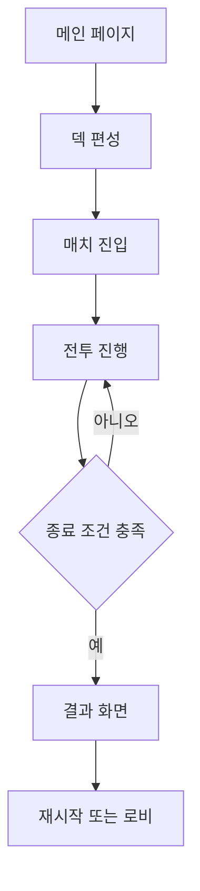

| 화면 | 필수 요소 | QA 체크 |
|---|---|---|
| 메인 | 시작, 덱, 설정 | 해상도별 배치 확인 |
| 전투 HUD | 마나, 핸드, HP, 타이머 | 선택/취소 입력 정확도 |
| 결과 | 승패 문구, 보상, 재시작 | 중복 입력 방지 |

## 5. 랄프 100회 반복 사이클

| 사이클 | 레퍼런스 이미지 | 기획 초점 | 그래픽 샘플 | 개발 초점 | 리뷰 초점 | QA 초점 |
|---|---|---|---|---|---|---|
| 1 |  | 메인 UI 가독성 |  | 상태머신 이벤트 연결 | Null 접근과 전이 누락 | 재미도 4점 척도 |
| 2 |  | 카드핸드 조작성 |  | 카드 데이터 검증기 | 코스트 대비 성능 역전 | 입력 정확도 |
| 3 |  | 레인 배치 규칙 |  | 전투 공식 파라미터 | 과도한 이펙트 중첩 | 프레임 안정성 |
| 4 |  | 마나 템포 밸런스 |  | 맵 충돌 및 배치 영역 | 승패 판정 경계값 | 튜토리얼 없이 플레이 가능성 |
| 5 |  | 소환 이펙트 일관성 |  | 결과 화면 흐름 | Null 접근과 전이 누락 | 재미도 4점 척도 |
| 6 |  | 승리 연출 명확성 |  | 상태머신 이벤트 연결 | 코스트 대비 성능 역전 | 입력 정확도 |
| 7 |  | 실패 연출 명확성 |  | 카드 데이터 검증기 | 과도한 이펙트 중첩 | 프레임 안정성 |
| 8 |  | 카운터플레이 유도 |  | 전투 공식 파라미터 | 승패 판정 경계값 | 튜토리얼 없이 플레이 가능성 |
| 9 |  | 덱 다양성 보장 |  | 맵 충돌 및 배치 영역 | Null 접근과 전이 누락 | 재미도 4점 척도 |
| 10 | 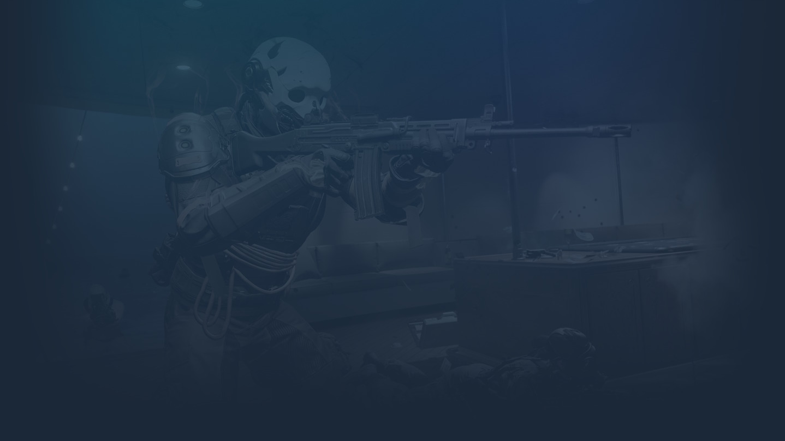 | 오버타임 안정화 |  | 결과 화면 흐름 | 코스트 대비 성능 역전 | 입력 정확도 |
| 11 |  | 메인 UI 가독성 |  | 상태머신 이벤트 연결 | 과도한 이펙트 중첩 | 프레임 안정성 |
| 12 |  | 카드핸드 조작성 |  | 카드 데이터 검증기 | 승패 판정 경계값 | 튜토리얼 없이 플레이 가능성 |
| 13 |  | 레인 배치 규칙 |  | 전투 공식 파라미터 | Null 접근과 전이 누락 | 재미도 4점 척도 |
| 14 |  | 마나 템포 밸런스 |  | 맵 충돌 및 배치 영역 | 코스트 대비 성능 역전 | 입력 정확도 |
| 15 |  | 소환 이펙트 일관성 |  | 결과 화면 흐름 | 과도한 이펙트 중첩 | 프레임 안정성 |
| 16 |  | 승리 연출 명확성 |  | 상태머신 이벤트 연결 | 승패 판정 경계값 | 튜토리얼 없이 플레이 가능성 |
| 17 |  | 실패 연출 명확성 |  | 카드 데이터 검증기 | Null 접근과 전이 누락 | 재미도 4점 척도 |
| 18 |  | 카운터플레이 유도 |  | 전투 공식 파라미터 | 코스트 대비 성능 역전 | 입력 정확도 |
| 19 |  | 덱 다양성 보장 |  | 맵 충돌 및 배치 영역 | 과도한 이펙트 중첩 | 프레임 안정성 |
| 20 |  | 오버타임 안정화 |  | 결과 화면 흐름 | 승패 판정 경계값 | 튜토리얼 없이 플레이 가능성 |
| 21 |  | 메인 UI 가독성 |  | 상태머신 이벤트 연결 | Null 접근과 전이 누락 | 재미도 4점 척도 |
| 22 | 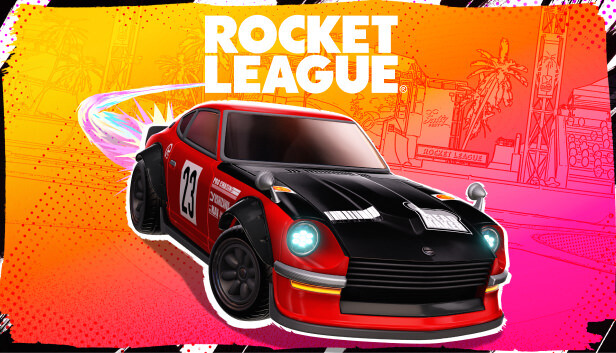 | 카드핸드 조작성 |  | 카드 데이터 검증기 | 코스트 대비 성능 역전 | 입력 정확도 |
| 23 | 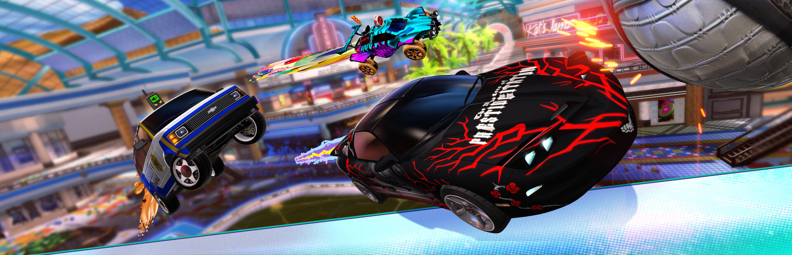 | 레인 배치 규칙 |  | 전투 공식 파라미터 | 과도한 이펙트 중첩 | 프레임 안정성 |
| 24 |  | 마나 템포 밸런스 |  | 맵 충돌 및 배치 영역 | 승패 판정 경계값 | 튜토리얼 없이 플레이 가능성 |
| 25 |  | 소환 이펙트 일관성 |  | 결과 화면 흐름 | Null 접근과 전이 누락 | 재미도 4점 척도 |
| 26 |  | 승리 연출 명확성 |  | 상태머신 이벤트 연결 | 코스트 대비 성능 역전 | 입력 정확도 |
| 27 |  | 실패 연출 명확성 |  | 카드 데이터 검증기 | 과도한 이펙트 중첩 | 프레임 안정성 |
| 28 | 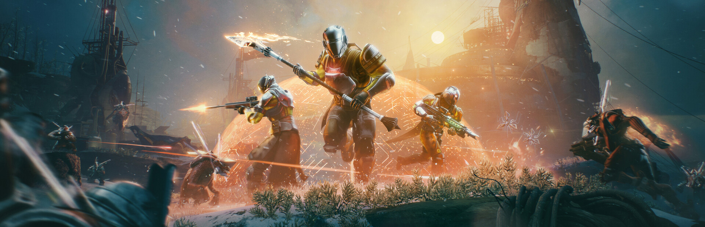 | 카운터플레이 유도 |  | 전투 공식 파라미터 | 승패 판정 경계값 | 튜토리얼 없이 플레이 가능성 |
| 29 |  | 덱 다양성 보장 |  | 맵 충돌 및 배치 영역 | Null 접근과 전이 누락 | 재미도 4점 척도 |
| 30 |  | 오버타임 안정화 |  | 결과 화면 흐름 | 코스트 대비 성능 역전 | 입력 정확도 |
| 31 |  | 메인 UI 가독성 | 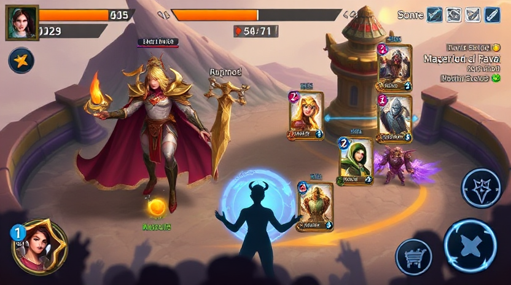 | 상태머신 이벤트 연결 | 과도한 이펙트 중첩 | 프레임 안정성 |
| 32 |  | 카드핸드 조작성 | 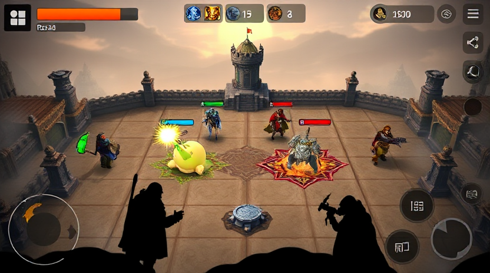 | 카드 데이터 검증기 | 승패 판정 경계값 | 튜토리얼 없이 플레이 가능성 |
| 33 |  | 레인 배치 규칙 |  | 전투 공식 파라미터 | Null 접근과 전이 누락 | 재미도 4점 척도 |
| 34 |  | 마나 템포 밸런스 | 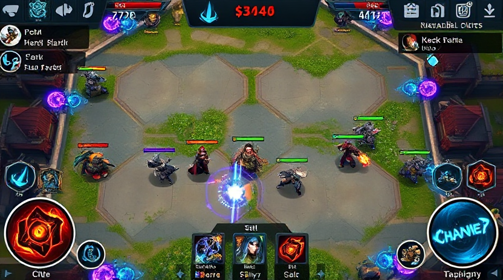 | 맵 충돌 및 배치 영역 | 코스트 대비 성능 역전 | 입력 정확도 |
| 35 |  | 소환 이펙트 일관성 |  | 결과 화면 흐름 | 과도한 이펙트 중첩 | 프레임 안정성 |
| 36 |  | 승리 연출 명확성 |  | 상태머신 이벤트 연결 | 승패 판정 경계값 | 튜토리얼 없이 플레이 가능성 |
| 37 |  | 실패 연출 명확성 | 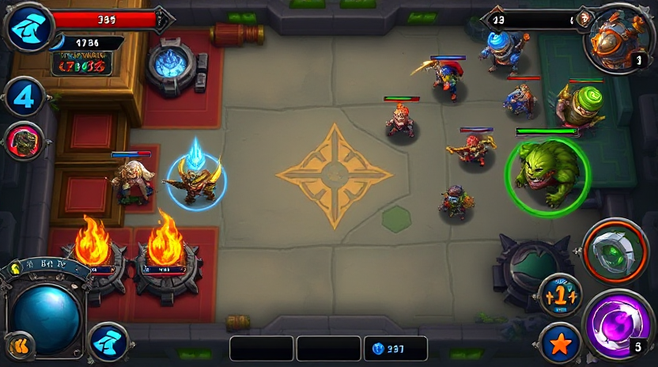 | 카드 데이터 검증기 | Null 접근과 전이 누락 | 재미도 4점 척도 |
| 38 | 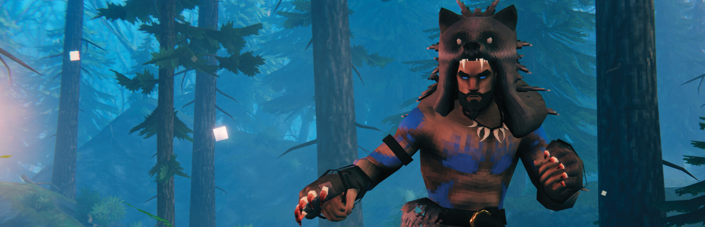 | 카운터플레이 유도 | 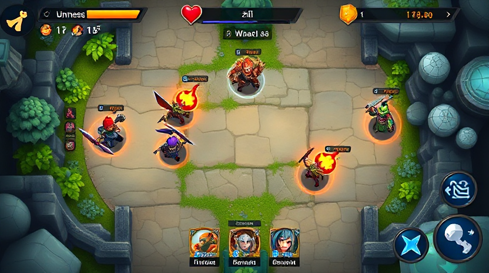 | 전투 공식 파라미터 | 코스트 대비 성능 역전 | 입력 정확도 |
| 39 |  | 덱 다양성 보장 | 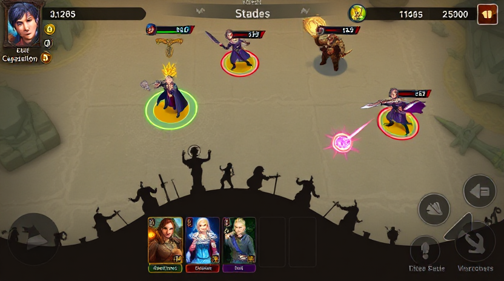 | 맵 충돌 및 배치 영역 | 과도한 이펙트 중첩 | 프레임 안정성 |
| 40 |  | 오버타임 안정화 | 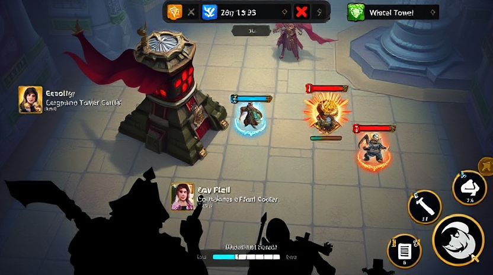 | 결과 화면 흐름 | 승패 판정 경계값 | 튜토리얼 없이 플레이 가능성 |
| 41 |  | 메인 UI 가독성 |  | 상태머신 이벤트 연결 | Null 접근과 전이 누락 | 재미도 4점 척도 |
| 42 |  | 카드핸드 조작성 |  | 카드 데이터 검증기 | 코스트 대비 성능 역전 | 입력 정확도 |
| 43 |  | 레인 배치 규칙 |  | 전투 공식 파라미터 | 과도한 이펙트 중첩 | 프레임 안정성 |
| 44 |  | 마나 템포 밸런스 |  | 맵 충돌 및 배치 영역 | 승패 판정 경계값 | 튜토리얼 없이 플레이 가능성 |
| 45 |  | 소환 이펙트 일관성 |  | 결과 화면 흐름 | Null 접근과 전이 누락 | 재미도 4점 척도 |
| 46 |  | 승리 연출 명확성 |  | 상태머신 이벤트 연결 | 코스트 대비 성능 역전 | 입력 정확도 |
| 47 | 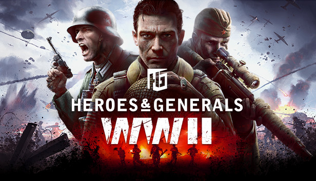 | 실패 연출 명확성 |  | 카드 데이터 검증기 | 과도한 이펙트 중첩 | 프레임 안정성 |
| 48 | 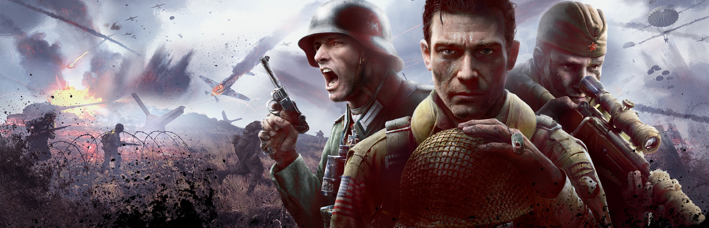 | 카운터플레이 유도 |  | 전투 공식 파라미터 | 승패 판정 경계값 | 튜토리얼 없이 플레이 가능성 |
| 49 |  | 덱 다양성 보장 |  | 맵 충돌 및 배치 영역 | Null 접근과 전이 누락 | 재미도 4점 척도 |
| 50 |  | 오버타임 안정화 |  | 결과 화면 흐름 | 코스트 대비 성능 역전 | 입력 정확도 |
| 51 |  | 메인 UI 가독성 |  | 상태머신 이벤트 연결 | 과도한 이펙트 중첩 | 프레임 안정성 |
| 52 | 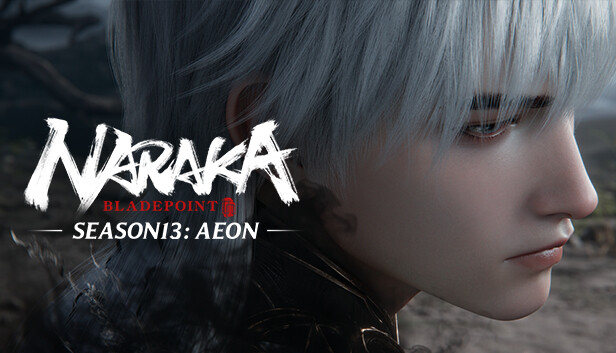 | 카드핸드 조작성 |  | 카드 데이터 검증기 | 승패 판정 경계값 | 튜토리얼 없이 플레이 가능성 |
| 53 |  | 레인 배치 규칙 |  | 전투 공식 파라미터 | Null 접근과 전이 누락 | 재미도 4점 척도 |
| 54 |  | 마나 템포 밸런스 |  | 맵 충돌 및 배치 영역 | 코스트 대비 성능 역전 | 입력 정확도 |
| 55 |  | 소환 이펙트 일관성 |  | 결과 화면 흐름 | 과도한 이펙트 중첩 | 프레임 안정성 |
| 56 |  | 승리 연출 명확성 |  | 상태머신 이벤트 연결 | 승패 판정 경계값 | 튜토리얼 없이 플레이 가능성 |
| 57 |  | 실패 연출 명확성 |  | 카드 데이터 검증기 | Null 접근과 전이 누락 | 재미도 4점 척도 |
| 58 |  | 카운터플레이 유도 |  | 전투 공식 파라미터 | 코스트 대비 성능 역전 | 입력 정확도 |
| 59 |  | 덱 다양성 보장 |  | 맵 충돌 및 배치 영역 | 과도한 이펙트 중첩 | 프레임 안정성 |
| 60 |  | 오버타임 안정화 |  | 결과 화면 흐름 | 승패 판정 경계값 | 튜토리얼 없이 플레이 가능성 |
| 61 |  | 메인 UI 가독성 |  | 상태머신 이벤트 연결 | Null 접근과 전이 누락 | 재미도 4점 척도 |
| 62 | 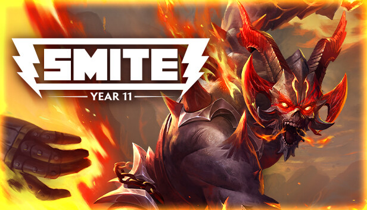 | 카드핸드 조작성 |  | 카드 데이터 검증기 | 코스트 대비 성능 역전 | 입력 정확도 |
| 63 | 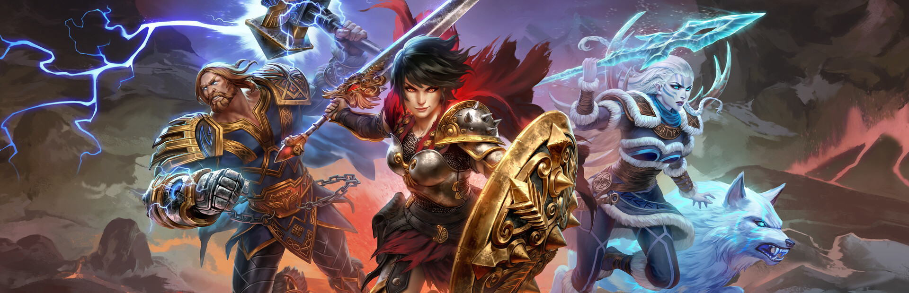 | 레인 배치 규칙 |  | 전투 공식 파라미터 | 과도한 이펙트 중첩 | 프레임 안정성 |
| 64 |  | 마나 템포 밸런스 |  | 맵 충돌 및 배치 영역 | 승패 판정 경계값 | 튜토리얼 없이 플레이 가능성 |
| 65 |  | 소환 이펙트 일관성 |  | 결과 화면 흐름 | Null 접근과 전이 누락 | 재미도 4점 척도 |
| 66 |  | 승리 연출 명확성 |  | 상태머신 이벤트 연결 | 코스트 대비 성능 역전 | 입력 정확도 |
| 67 |  | 실패 연출 명확성 |  | 카드 데이터 검증기 | 과도한 이펙트 중첩 | 프레임 안정성 |
| 68 |  | 카운터플레이 유도 |  | 전투 공식 파라미터 | 승패 판정 경계값 | 튜토리얼 없이 플레이 가능성 |
| 69 |  | 덱 다양성 보장 |  | 맵 충돌 및 배치 영역 | Null 접근과 전이 누락 | 재미도 4점 척도 |
| 70 | 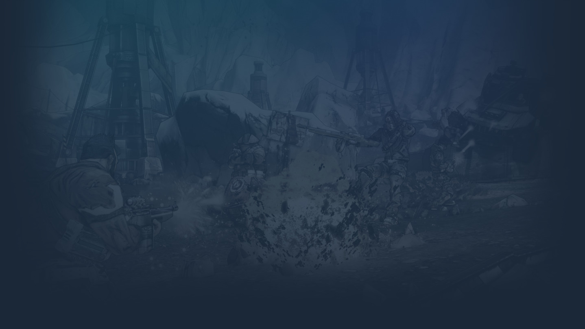 | 오버타임 안정화 |  | 결과 화면 흐름 | 코스트 대비 성능 역전 | 입력 정확도 |
| 71 |  | 메인 UI 가독성 |  | 상태머신 이벤트 연결 | 과도한 이펙트 중첩 | 프레임 안정성 |
| 72 |  | 카드핸드 조작성 |  | 카드 데이터 검증기 | 승패 판정 경계값 | 튜토리얼 없이 플레이 가능성 |
| 73 |  | 레인 배치 규칙 |  | 전투 공식 파라미터 | Null 접근과 전이 누락 | 재미도 4점 척도 |
| 74 |  | 마나 템포 밸런스 |  | 맵 충돌 및 배치 영역 | 코스트 대비 성능 역전 | 입력 정확도 |
| 75 |  | 소환 이펙트 일관성 |  | 결과 화면 흐름 | 과도한 이펙트 중첩 | 프레임 안정성 |
| 76 |  | 승리 연출 명확성 |  | 상태머신 이벤트 연결 | 승패 판정 경계값 | 튜토리얼 없이 플레이 가능성 |
| 77 | 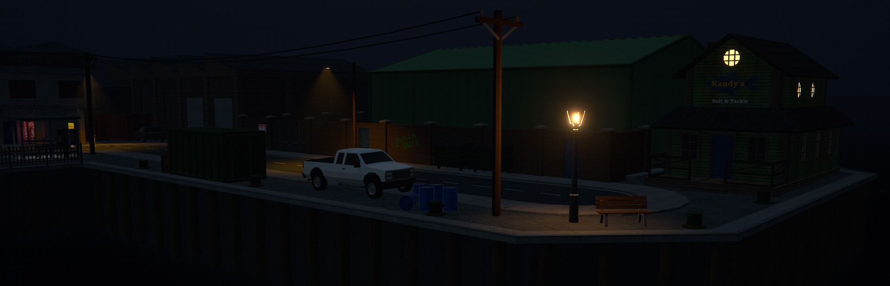 | 실패 연출 명확성 |  | 카드 데이터 검증기 | Null 접근과 전이 누락 | 재미도 4점 척도 |
| 78 |  | 카운터플레이 유도 |  | 전투 공식 파라미터 | 코스트 대비 성능 역전 | 입력 정확도 |
| 79 |  | 덱 다양성 보장 |  | 맵 충돌 및 배치 영역 | 과도한 이펙트 중첩 | 프레임 안정성 |
| 80 | 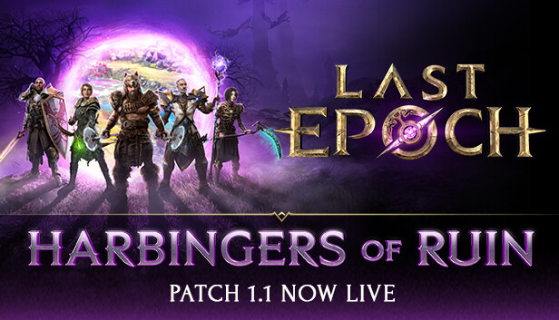 | 오버타임 안정화 |  | 결과 화면 흐름 | 승패 판정 경계값 | 튜토리얼 없이 플레이 가능성 |
| 81 |  | 메인 UI 가독성 |  | 상태머신 이벤트 연결 | Null 접근과 전이 누락 | 재미도 4점 척도 |
| 82 |  | 카드핸드 조작성 |  | 카드 데이터 검증기 | 코스트 대비 성능 역전 | 입력 정확도 |
| 83 |  | 레인 배치 규칙 |  | 전투 공식 파라미터 | 과도한 이펙트 중첩 | 프레임 안정성 |
| 84 |  | 마나 템포 밸런스 |  | 맵 충돌 및 배치 영역 | 승패 판정 경계값 | 튜토리얼 없이 플레이 가능성 |
| 85 |  | 소환 이펙트 일관성 |  | 결과 화면 흐름 | Null 접근과 전이 누락 | 재미도 4점 척도 |
| 86 |  | 승리 연출 명확성 |  | 상태머신 이벤트 연결 | 코스트 대비 성능 역전 | 입력 정확도 |
| 87 |  | 실패 연출 명확성 |  | 카드 데이터 검증기 | 과도한 이펙트 중첩 | 프레임 안정성 |
| 88 |  | 카운터플레이 유도 |  | 전투 공식 파라미터 | 승패 판정 경계값 | 튜토리얼 없이 플레이 가능성 |
| 89 |  | 덱 다양성 보장 |  | 맵 충돌 및 배치 영역 | Null 접근과 전이 누락 | 재미도 4점 척도 |
| 90 |  | 오버타임 안정화 |  | 결과 화면 흐름 | 코스트 대비 성능 역전 | 입력 정확도 |
| 91 |  | 메인 UI 가독성 |  | 상태머신 이벤트 연결 | 과도한 이펙트 중첩 | 프레임 안정성 |
| 92 |  | 카드핸드 조작성 |  | 카드 데이터 검증기 | 승패 판정 경계값 | 튜토리얼 없이 플레이 가능성 |
| 93 | 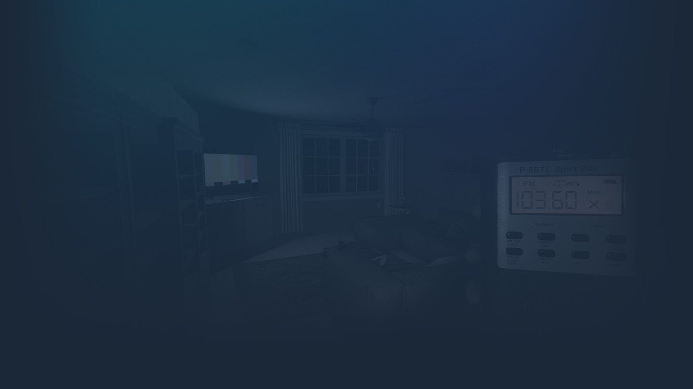 | 레인 배치 규칙 |  | 전투 공식 파라미터 | Null 접근과 전이 누락 | 재미도 4점 척도 |
| 94 |  | 마나 템포 밸런스 |  | 맵 충돌 및 배치 영역 | 코스트 대비 성능 역전 | 입력 정확도 |
| 95 |  | 소환 이펙트 일관성 |  | 결과 화면 흐름 | 과도한 이펙트 중첩 | 프레임 안정성 |
| 96 |  | 승리 연출 명확성 |  | 상태머신 이벤트 연결 | 승패 판정 경계값 | 튜토리얼 없이 플레이 가능성 |
| 97 |  | 실패 연출 명확성 |  | 카드 데이터 검증기 | Null 접근과 전이 누락 | 재미도 4점 척도 |
| 98 |  | 카운터플레이 유도 |  | 전투 공식 파라미터 | 코스트 대비 성능 역전 | 입력 정확도 |
| 99 |  | 덱 다양성 보장 |  | 맵 충돌 및 배치 영역 | 과도한 이펙트 중첩 | 프레임 안정성 |
| 100 |  | 오버타임 안정화 |  | 결과 화면 흐름 | 승패 판정 경계값 | 튜토리얼 없이 플레이 가능성 |

## 6. 품질 게이트

| 게이트 | 통과 기준 | 실패 시 조치 |
|---|---|---|
| 레퍼런스 적합성 | 목표와 직접 관련된 이미지 2장 이상 | 재수집 후 재기획 |
| 리뷰 | 치명/높음 이슈 0건 | 수정 후 동일 케이스 재검증 |
| QA 기능 | 배치, 전투, 승패, 재시작 정상 | 실패 로그 첨부 후 수정 |
| QA 재미 | 평균 3.0/4.0 이상 | 카드 룰과 수치 재조정 |

## 7. 산출물 링크

- 반복 데이터: `docs/plans/data/ralph_cycle_100.csv`
- 페이지 데이터: `docs/plans/data/master_plan_pages.csv`
- 웹 레퍼런스 소스: `docs/plans/data/web_reference_sources.csv`
- ComfyUI 매니페스트: `docs/plans/data/game_screenshot_generated_manifest.csv`

## 8. 개발 착수 항목

1. `scripts/battle/` 전투 공식 파라미터 테이블 적용
2. `scripts/ui/` 카드 선택/취소 피드백 통일
3. `resources/cards/` 카드 태그 표준화와 덱 검증 훅 추가
4. 사이클별 헤드리스 스모크와 수동 QA 병행 실행