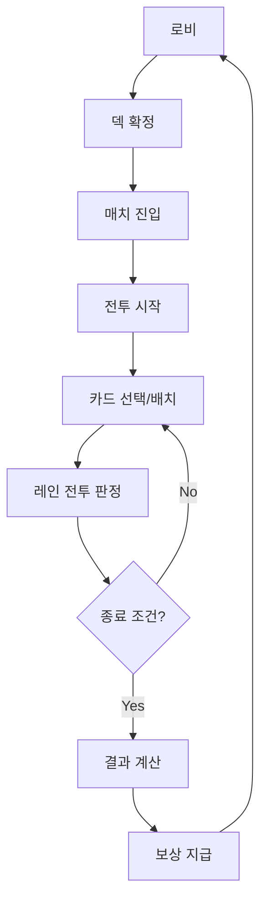
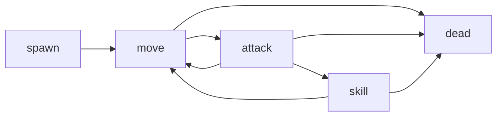
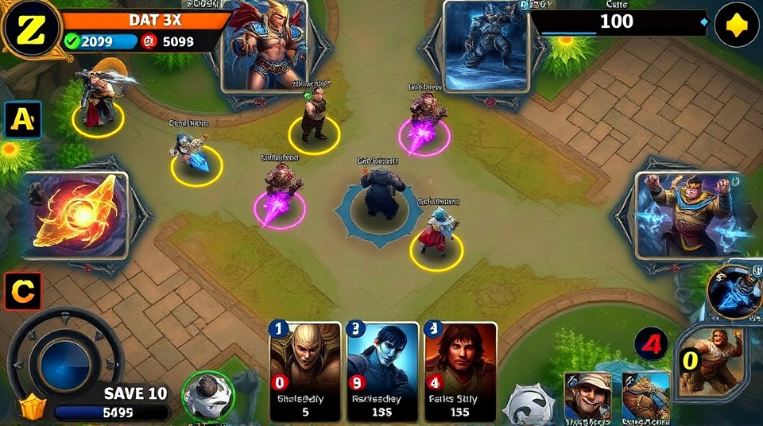

# godot-001-card-battle 실행 기획서 (개발/그래픽/QA 동시 전달본)

## 0. 문서 메타
| 항목 | 내용 |
|---|---|
| 문서명 | `docs/plans/latest_plan.md` |
| 버전 | v4.0 |
| 작성일 | 2026-02-13 |
| 목적 | 개발자/그래퍼/QA가 즉시 작업 가능한 실행 명세 |
| 범위 | 전투 1세션 루프, 카드/덱/마나/레인전투, HUD/결과 UI |

## 1. 이번 스코프(락다운)
- 포함:
  - 2레인 실시간 전투
  - 카드 24종(Starter Set)
  - 덱 편성/저장/검증
  - 전투 HUD/결과 UI
  - 보상 지급(골드/조각/랭크 포인트)
- 제외:
  - 길드/친구/채팅
  - BM 상점 실구매
  - 시즌 패스 진행

## 2. 세션 기준값 (게임 핵심 수치)
| 항목 | 값 | 비고 |
|---|---|---|
| 평균 세션 길이 | 240초 | 180~300초 허용 |
| 초기 마나 | 3 | 전투 시작값 |
| 최대 마나 | 10 | clamp |
| 마나 회복 | 0.8/sec | 1프레임 누적 |
| 초기 손패 | 5장 | 시작 즉시 지급 |
| 최대 손패 | 8장 | 초과 드로우 금지 |
| 덱 크기 | 20장 | 동일 카드 최대 2장 |
| 타워 HP | 3000 | 양 팀 동일 |

## 3. 메인 루프 (개발 기준)

### 3-1. 종료 조건
| 조건 ID | 조건 | 우선순위 |
|---|---|---|
| END-01 | 적 타워 HP <= 0 | 1 |
| END-02 | 시간 0초 도달 | 2 |
| END-03 | 강제 종료(디버그) | 3 |

### 3-2. 동점 판정
- END-02에서 양 타워 HP 동일 시 `DRAW`.
- 결과 화면 배너: `무승부`.
- 랭크 포인트: `0`.

## 4. 시스템 상세 (개발자 전달)

## 4.1 카드 시스템
| 규칙 ID | 규칙 | 실패 처리 |
|---|---|---|
| CARD-01 | 카드 사용 전 `mana >= cost` 검증 | `E_CARD_COST` 반환 |
| CARD-02 | 카드 선택 후 3초 내 미배치 시 자동 취소 | 선택 상태 해제 |
| CARD-03 | 배치 성공 시 즉시 마나 차감 | HUD 갱신 이벤트 발행 |
| CARD-04 | 잘못된 레인 클릭 시 배치 거절 | 붉은 프리뷰 + 토스트 |

이벤트 계약:
| 이벤트 | 발행 | 구독 | payload |
|---|---|---|---|
| `ui.card_select` | UI | CARD | `card_id, hand_idx` |
| `battle.deploy_request` | UI | BATTLE | `card_id, lane_id, pos` |
| `battle.deploy_result` | BATTLE | UI | `ok, reason_code` |

구현 경로:
- `scripts/ui/card_ui.gd`
- `scripts/battle/deck_manager.gd`

## 4.2 마나 시스템
공식:
- `mana_next = clamp(mana_now + regen_rate * delta - spend, 0, max_mana)`

상태:
| 상태 | 조건 |
|---|---|
| normal | 0 < mana < max |
| low | mana < 2 |
| full | mana == max |

예외:
| 코드 | 조건 | 처리 |
|---|---|---|
| E_MANA_NEG | 0 미만 계산 | 0으로 보정 + 로그 |
| E_MANA_OVER | max 초과 계산 | max로 보정 |

구현 경로:
- `scripts/battle/mana_system.gd`
- `scripts/ui/battle_hud.gd`

## 4.3 레인 전투 시스템
타깃 우선순위:
1. 레인 내 전방 근접 유닛
2. 레인 내 원거리 유닛
3. 레인 타워

피해 공식:
- 기본: `damage = max(1, ATK - DEF)`
- 치명: `crit_damage = floor(damage * crit_multiplier)`

상태 전이:

예외:
| 코드 | 조건 | 처리 |
|---|---|---|
| E_BTL_TARGET_LOST | 타깃 소실 | 즉시 재탐색 |
| E_BTL_SIMUL_KILL | 동시 사망 | 프레임 순서 고정 |
| E_BTL_TIMEOUT | 시간 종료 | END-02 처리 |

구현 경로:
- `scripts/battle/lane_controller.gd`
- `scripts/entities/minion.gd`
- `scripts/minion_states/`

## 4.4 보상 시스템
| 결과 | 골드 | 카드 조각 | 랭크 포인트 |
|---|---|---|---|
| 승리 | 120 | 3 | +15 |
| 패배 | 60 | 1 | -8 |
| 무승부 | 80 | 2 | 0 |

중복 지급 방지:
- `result_id` 단위 idempotency 적용.
- 동일 `result_id` 재요청은 `already_granted=true` 반환.

구현 경로:
- `scripts/autoload/GameManager.gd`
- `scripts/ui/result_screen.gd`

## 5. UI 실행 명세 (그래퍼 + 클라이언트 공통)

## 5.1 화면 목록
| 화면 ID | 이름 | 목표 |
|---|---|---|
| UI-01 | 로비 | 모드 선택/진입 허브 |
| UI-02 | 덱 빌더 | 덱 편성/검증/저장 |
| UI-03 | 전투 HUD | 실시간 카드 조작 |
| UI-04 | 결과 | 승패/보상 확인 |

## 5.2 UI-03 전투 HUD 상세
레이아웃:
- 상단: 타이머, 양측 타워 HP
- 중앙: 2레인 전장
- 하단: 카드핸드 5슬롯, 마나바, 취소 버튼

컴포넌트:
| ID | 타입 | 크기/배치 | 상태 | 상호작용 |
|---|---|---|---|---|
| HUD-TIMER | Text | Top-Center | running/end | none |
| HUD-TOWER-ALLY | HPBar | Top-Left | normal/danger | none |
| HUD-TOWER-ENEMY | HPBar | Top-Right | normal/danger | none |
| HUD-HAND | CardList(5) | Bottom-Center | idle/select/locked | click/drag |
| HUD-MANA | Gauge | Bottom-Left | low/normal/full | none |
| HUD-CANCEL | Button | Bottom-Right | hidden/visible | click |

상태 규칙:
| 상태 | 진입 조건 | 이탈 조건 |
|---|---|---|
| select | 카드 클릭 | 배치/취소 |
| preview | 유효 레인 호버 | 확정/무효 클릭 |
| committed | 배치 확정 | 스폰 완료 |

UI 레퍼런스:

## 5.3 UI-04 결과 상세
필수 컴포넌트:
| ID | 타입 | 노출 규칙 |
|---|---|---|
| RESULT-BANNER | Panel | 승/패/무승부별 테마 |
| RESULT-REWARD | List | 보상 payload 수신 후 |
| RESULT-CONFIRM | Button | 항상 노출 |
| RESULT-RETRY | Button | 매치 가능 상태만 |

UI 레퍼런스:

## 6. 그래퍼 작업 지시서 (실제 제작 단위)
에셋 목록은 `docs/plans/data/asset_production_list_v1.csv`를 기준으로 제작.

스타일 고정:
- 톤: 판타지 + 클린 HUD
- 컬러: 아군 `#39A0ED`, 적군 `#E94F37`, 중립 `#F1C40F`
- 카드 프레임 3종: Common/Rare/Epic

산출 규격:
| 분류 | 포맷 | 기준 해상도 | 네이밍 규칙 |
|---|---|---|---|
| UI 아이콘 | PNG | 256x256 | `ui_icon_<name>_v01.png` |
| 카드 프레임 | PNG | 1024x1536 | `card_frame_<rarity>_v01.png` |
| HUD 파츠 | PNG | 1920 기준 | `hud_<part>_v01.png` |
| 이펙트 시트 | PNG 시트 | 2048x2048 | `fx_<skill>_sheet_v01.png` |

납품 규칙:
- 경로: `assets/ui/`, `assets/vfx/`, `assets/cards/`
- alpha 프리멀티 금지.
- PSD 원본 동시 제출.

## 7. QA 판정 기준 (맞다/틀리다 명확화)
전체 케이스: `docs/plans/data/qa_acceptance_matrix_v2.csv`

P0 케이스:
| TC ID | 시나리오 | 합격 조건 | 불합격 조건 |
|---|---|---|---|
| TC-P0-01 | 마나 부족 배치 | 배치 100% 차단 | 1회라도 스폰 |
| TC-P0-02 | 카드 선택-취소 반복 100회 | 상태 누수 0 | 입력 잠김 발생 |
| TC-P0-03 | 동시 타워 파괴 | DRAW 일관 | 결과 불일치 |
| TC-P0-04 | 보상 중복 요청 | 1회만 지급 | 중복 지급 |

P1 케이스:
| TC ID | 시나리오 | 합격 조건 |
|---|---|---|
| TC-P1-01 | 해상도 1280/1920 HUD | 잘림 0건 |
| TC-P1-02 | 덱 규칙 위반 저장 | 저장 차단 100% |

## 8. 개발 착수 체크리스트
| 항목 | 담당 | 완료 기준 |
|---|---|---|
| 카드/덱 데이터 로더 | 개발 | 24장 로드 성공 |
| 마나 tick + HUD 반영 | 개발 | 오차 1% 이내 |
| 레인 전투 판정 | 개발 | 50판 무중단 |
| HUD/결과 UI 아트 적용 | 그래퍼+개발 | 레이아웃 깨짐 0 |
| P0 QA 통과 | QA | 전 케이스 pass |

## 9. 분리 문서/데이터 경로
- 기능 문서 인덱스: `docs/plans/features/`
- 카드 밸런스: `docs/plans/data/card_balance_spec_v1.csv`
- 에셋 제작 목록: `docs/plans/data/asset_production_list_v1.csv`
- QA 판정 매트릭스: `docs/plans/data/qa_acceptance_matrix_v2.csv`
