# 마스터 기획서 (300+ 페이지)

## 문서 성격
- 본 문서는 게임 기획서이며, 텍스트 단독 기술을 금지한다
- 모든 페이지는 이미지, 표, 흐름도, UI 제안을 포함한다

## 목차
1. 개요
2. 목적
3. 문서범위
4. 이력
5. 페이지별 상세 설계

## 개요
- reference/docs 형식을 참고한 통합 기획 문서

## 목적
- 카드 덱/룰/전투공식/맵/승패/애니메이션/인벤토리/캐릭터 설계와 개발요구사항을 연결

## 문서범위
- 메인 페이지, 전투 맵, 카드 UX, 승패 연출, QA 루프, 밸런싱

## 이력
| 날짜 | 작성자 | 변경 내용 |
|---|---|---|
| 2026-02-13 | Ralph Agent | 이미지/표/흐름/UI 포함 300+ 페이지 생성 |

- 생성시각: 2026-02-13 14:32:33
- 정책: 300페이지 이상 기획서가 없으면 개발 시작 금지
- 목표 페이지 수: 320
- 워크플로우: 레퍼런스 -> 기획 -> 그래픽(ComfyUI/KayKit) -> 개발 -> 리뷰 -> QA
- 웹 레퍼런스: docs/references/web_reference_pack.md
- 이미지 폴더: docs/plans/images
- 기획 데이터 CSV: docs/plans/data/master_plan_pages.csv

## Page 1

### 페이지 주제
- 메인 페이지 UX (ComfyUI 우선)

### 레퍼런스 체크 이미지
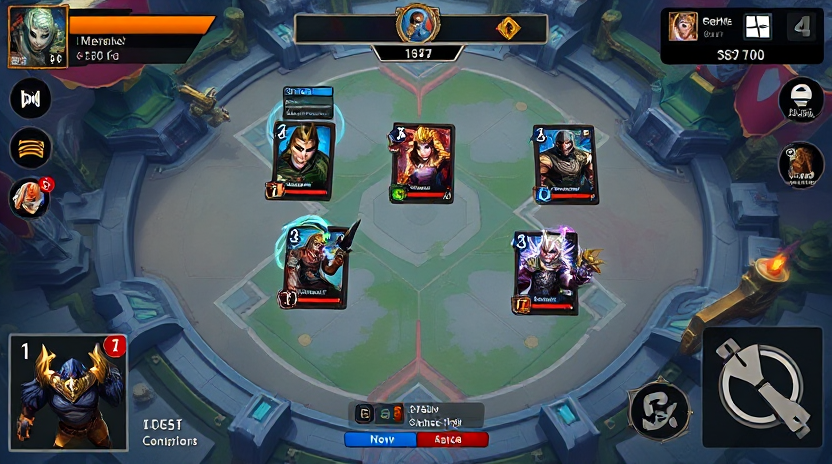
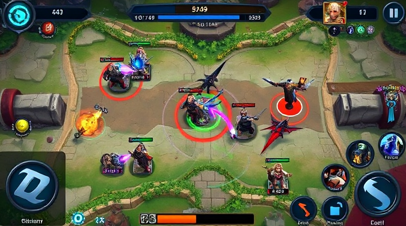

### 핵심 기획 표
| 항목 | 기획 내용 | 개발 필요사항 |
|---|---|---|
| 목표 | 체감이 분명한 전투/UX 개선 | 상태머신, 전투공식, UI 이벤트 연동 구현 |
| 카드 룰 | 코스트/역할/카운터 관계 유지 | 카드 데이터 검증기, 덱 구성 제약 로직 |
| 전투 공식 | 기본 피해량 + 오버타임/서든데스 스케일 | 서버/클라 동일 수식 적용 |
| 승패 연출 | 승리/패배 전환 즉시 인지 | 결과 패널, 애니메이션, 사운드 큐 |
| QA 재미도 | pace/variety/combo/counterplay 점검 | QA 설문 + 로그 기반 스코어 산출 |

### 흐름도 (Markdown Mermaid)
~~~mermaid
flowchart LR
A[레퍼런스 분석] --> B[기획 정리]
B --> C[UI 와이어 설계]
C --> D[카드 룰/전투 공식]
D --> E[구현]
E --> F[리뷰 에이전트]
F --> G{QA 통과?}
G -- 아니오 --> A
G -- 예 --> H[완료]
~~~

### UI 제안 (Markdown)
| UI 구역 | 구성 요소 | 상호작용 |
|---|---|---|
| 상단바 | 타워 HP, 페이즈 타이머 | 실시간 수치 업데이트 |
| 중앙 전장 | 좌/우 레인, 타워, 미니언 | 카드 배치 결과 시각화 |
| 하단 카드핸드 | 4장 핸드, 다음 카드 프리뷰, 마나바 | 선택/취소/레인 선택 |
| 결과 오버레이 | 승리/패배, 재시작, 메뉴 | 게임 종료 후 전환 |

~~~text
+----------------------------------------------------+
| Player HP | Phase Timer | Enemy HP                 |
+---------------------- BATTLE FIELD ----------------+
| Left Lane                | Right Lane               |
| [Deploy Zone]            | [Deploy Zone]            |
+----------------------------------------------------+
| Mana Bar | Card1 Card2 Card3 Card4 | Next Card     |
+----------------------------------------------------+
~~~

### 개발 제안
1. 레퍼런스 이미지 기반으로 맵 가독성 기준선을 먼저 고정한다
2. 카드 룰/전투 공식 수치를 CSV 단일 소스로 관리한다
3. UI 이벤트(선택/취소/승패)를 상태머신과 연결해 회귀를 줄인다
4. 리뷰 반려 시 즉시 레퍼런스 재수집 후 기획 diff를 기록한다

## Page 2

### 페이지 주제
- 로비 및 맵 가독성

### 레퍼런스 체크 이미지

### 핵심 기획 표
| 항목 | 기획 내용 | 개발 필요사항 |
|---|---|---|
| 목표 | 체감이 분명한 전투/UX 개선 | 상태머신, 전투공식, UI 이벤트 연동 구현 |
| 카드 룰 | 코스트/역할/카운터 관계 유지 | 카드 데이터 검증기, 덱 구성 제약 로직 |
| 전투 공식 | 기본 피해량 + 오버타임/서든데스 스케일 | 서버/클라 동일 수식 적용 |
| 승패 연출 | 승리/패배 전환 즉시 인지 | 결과 패널, 애니메이션, 사운드 큐 |
| QA 재미도 | pace/variety/combo/counterplay 점검 | QA 설문 + 로그 기반 스코어 산출 |

### 흐름도 (Markdown Mermaid)
~~~mermaid
flowchart LR
A[레퍼런스 분석] --> B[기획 정리]
B --> C[UI 와이어 설계]
C --> D[카드 룰/전투 공식]
D --> E[구현]
E --> F[리뷰 에이전트]
F --> G{QA 통과?}
G -- 아니오 --> A
G -- 예 --> H[완료]
~~~

### UI 제안 (Markdown)
| UI 구역 | 구성 요소 | 상호작용 |
|---|---|---|
| 상단바 | 타워 HP, 페이즈 타이머 | 실시간 수치 업데이트 |
| 중앙 전장 | 좌/우 레인, 타워, 미니언 | 카드 배치 결과 시각화 |
| 하단 카드핸드 | 4장 핸드, 다음 카드 프리뷰, 마나바 | 선택/취소/레인 선택 |
| 결과 오버레이 | 승리/패배, 재시작, 메뉴 | 게임 종료 후 전환 |

~~~text
+----------------------------------------------------+
| Player HP | Phase Timer | Enemy HP                 |
+---------------------- BATTLE FIELD ----------------+
| Left Lane                | Right Lane               |
| [Deploy Zone]            | [Deploy Zone]            |
+----------------------------------------------------+
| Mana Bar | Card1 Card2 Card3 Card4 | Next Card     |
+----------------------------------------------------+
~~~

### 개발 제안
1. 레퍼런스 이미지 기반으로 맵 가독성 기준선을 먼저 고정한다
2. 카드 룰/전투 공식 수치를 CSV 단일 소스로 관리한다
3. UI 이벤트(선택/취소/승패)를 상태머신과 연결해 회귀를 줄인다
4. 리뷰 반려 시 즉시 레퍼런스 재수집 후 기획 diff를 기록한다

## Page 3

### 페이지 주제
- 전투 루프

### 레퍼런스 체크 이미지

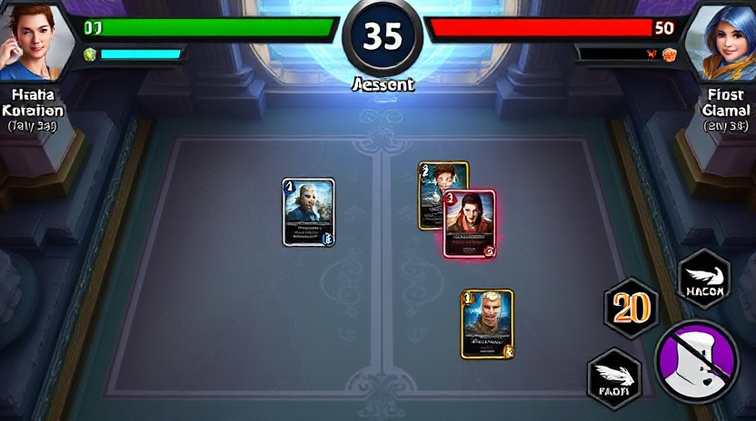

### 핵심 기획 표
| 항목 | 기획 내용 | 개발 필요사항 |
|---|---|---|
| 목표 | 체감이 분명한 전투/UX 개선 | 상태머신, 전투공식, UI 이벤트 연동 구현 |
| 카드 룰 | 코스트/역할/카운터 관계 유지 | 카드 데이터 검증기, 덱 구성 제약 로직 |
| 전투 공식 | 기본 피해량 + 오버타임/서든데스 스케일 | 서버/클라 동일 수식 적용 |
| 승패 연출 | 승리/패배 전환 즉시 인지 | 결과 패널, 애니메이션, 사운드 큐 |
| QA 재미도 | pace/variety/combo/counterplay 점검 | QA 설문 + 로그 기반 스코어 산출 |

### 흐름도 (Markdown Mermaid)
~~~mermaid
flowchart LR
A[레퍼런스 분석] --> B[기획 정리]
B --> C[UI 와이어 설계]
C --> D[카드 룰/전투 공식]
D --> E[구현]
E --> F[리뷰 에이전트]
F --> G{QA 통과?}
G -- 아니오 --> A
G -- 예 --> H[완료]
~~~

### UI 제안 (Markdown)
| UI 구역 | 구성 요소 | 상호작용 |
|---|---|---|
| 상단바 | 타워 HP, 페이즈 타이머 | 실시간 수치 업데이트 |
| 중앙 전장 | 좌/우 레인, 타워, 미니언 | 카드 배치 결과 시각화 |
| 하단 카드핸드 | 4장 핸드, 다음 카드 프리뷰, 마나바 | 선택/취소/레인 선택 |
| 결과 오버레이 | 승리/패배, 재시작, 메뉴 | 게임 종료 후 전환 |

~~~text
+----------------------------------------------------+
| Player HP | Phase Timer | Enemy HP                 |
+---------------------- BATTLE FIELD ----------------+
| Left Lane                | Right Lane               |
| [Deploy Zone]            | [Deploy Zone]            |
+----------------------------------------------------+
| Mana Bar | Card1 Card2 Card3 Card4 | Next Card     |
+----------------------------------------------------+
~~~

### 개발 제안
1. 레퍼런스 이미지 기반으로 맵 가독성 기준선을 먼저 고정한다
2. 카드 룰/전투 공식 수치를 CSV 단일 소스로 관리한다
3. UI 이벤트(선택/취소/승패)를 상태머신과 연결해 회귀를 줄인다
4. 리뷰 반려 시 즉시 레퍼런스 재수집 후 기획 diff를 기록한다

## Page 4

### 페이지 주제
- 승리 및 패배 흐름

### 레퍼런스 체크 이미지

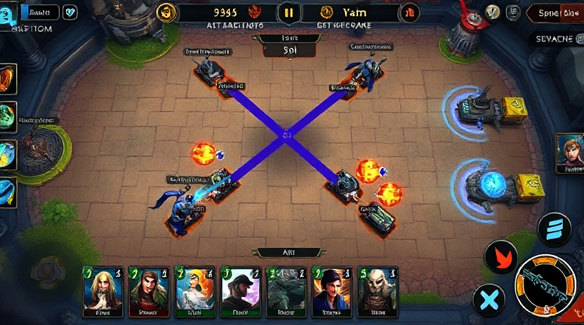

### 핵심 기획 표
| 항목 | 기획 내용 | 개발 필요사항 |
|---|---|---|
| 목표 | 체감이 분명한 전투/UX 개선 | 상태머신, 전투공식, UI 이벤트 연동 구현 |
| 카드 룰 | 코스트/역할/카운터 관계 유지 | 카드 데이터 검증기, 덱 구성 제약 로직 |
| 전투 공식 | 기본 피해량 + 오버타임/서든데스 스케일 | 서버/클라 동일 수식 적용 |
| 승패 연출 | 승리/패배 전환 즉시 인지 | 결과 패널, 애니메이션, 사운드 큐 |
| QA 재미도 | pace/variety/combo/counterplay 점검 | QA 설문 + 로그 기반 스코어 산출 |

### 흐름도 (Markdown Mermaid)
~~~mermaid
flowchart LR
A[레퍼런스 분석] --> B[기획 정리]
B --> C[UI 와이어 설계]
C --> D[카드 룰/전투 공식]
D --> E[구현]
E --> F[리뷰 에이전트]
F --> G{QA 통과?}
G -- 아니오 --> A
G -- 예 --> H[완료]
~~~

### UI 제안 (Markdown)
| UI 구역 | 구성 요소 | 상호작용 |
|---|---|---|
| 상단바 | 타워 HP, 페이즈 타이머 | 실시간 수치 업데이트 |
| 중앙 전장 | 좌/우 레인, 타워, 미니언 | 카드 배치 결과 시각화 |
| 하단 카드핸드 | 4장 핸드, 다음 카드 프리뷰, 마나바 | 선택/취소/레인 선택 |
| 결과 오버레이 | 승리/패배, 재시작, 메뉴 | 게임 종료 후 전환 |

~~~text
+----------------------------------------------------+
| Player HP | Phase Timer | Enemy HP                 |
+---------------------- BATTLE FIELD ----------------+
| Left Lane                | Right Lane               |
| [Deploy Zone]            | [Deploy Zone]            |
+----------------------------------------------------+
| Mana Bar | Card1 Card2 Card3 Card4 | Next Card     |
+----------------------------------------------------+
~~~

### 개발 제안
1. 레퍼런스 이미지 기반으로 맵 가독성 기준선을 먼저 고정한다
2. 카드 룰/전투 공식 수치를 CSV 단일 소스로 관리한다
3. UI 이벤트(선택/취소/승패)를 상태머신과 연결해 회귀를 줄인다
4. 리뷰 반려 시 즉시 레퍼런스 재수집 후 기획 diff를 기록한다

## Page 5

### 페이지 주제
- 애니메이션 연출

### 레퍼런스 체크 이미지

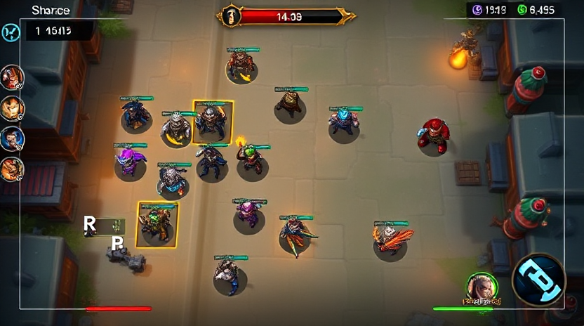

### 핵심 기획 표
| 항목 | 기획 내용 | 개발 필요사항 |
|---|---|---|
| 목표 | 체감이 분명한 전투/UX 개선 | 상태머신, 전투공식, UI 이벤트 연동 구현 |
| 카드 룰 | 코스트/역할/카운터 관계 유지 | 카드 데이터 검증기, 덱 구성 제약 로직 |
| 전투 공식 | 기본 피해량 + 오버타임/서든데스 스케일 | 서버/클라 동일 수식 적용 |
| 승패 연출 | 승리/패배 전환 즉시 인지 | 결과 패널, 애니메이션, 사운드 큐 |
| QA 재미도 | pace/variety/combo/counterplay 점검 | QA 설문 + 로그 기반 스코어 산출 |

### 흐름도 (Markdown Mermaid)
~~~mermaid
flowchart LR
A[레퍼런스 분석] --> B[기획 정리]
B --> C[UI 와이어 설계]
C --> D[카드 룰/전투 공식]
D --> E[구현]
E --> F[리뷰 에이전트]
F --> G{QA 통과?}
G -- 아니오 --> A
G -- 예 --> H[완료]
~~~

### UI 제안 (Markdown)
| UI 구역 | 구성 요소 | 상호작용 |
|---|---|---|
| 상단바 | 타워 HP, 페이즈 타이머 | 실시간 수치 업데이트 |
| 중앙 전장 | 좌/우 레인, 타워, 미니언 | 카드 배치 결과 시각화 |
| 하단 카드핸드 | 4장 핸드, 다음 카드 프리뷰, 마나바 | 선택/취소/레인 선택 |
| 결과 오버레이 | 승리/패배, 재시작, 메뉴 | 게임 종료 후 전환 |

~~~text
+----------------------------------------------------+
| Player HP | Phase Timer | Enemy HP                 |
+---------------------- BATTLE FIELD ----------------+
| Left Lane                | Right Lane               |
| [Deploy Zone]            | [Deploy Zone]            |
+----------------------------------------------------+
| Mana Bar | Card1 Card2 Card3 Card4 | Next Card     |
+----------------------------------------------------+
~~~

### 개발 제안
1. 레퍼런스 이미지 기반으로 맵 가독성 기준선을 먼저 고정한다
2. 카드 룰/전투 공식 수치를 CSV 단일 소스로 관리한다
3. UI 이벤트(선택/취소/승패)를 상태머신과 연결해 회귀를 줄인다
4. 리뷰 반려 시 즉시 레퍼런스 재수집 후 기획 diff를 기록한다

## Page 6

### 페이지 주제
- 카드 덱 구성 규칙

### 레퍼런스 체크 이미지

### 핵심 기획 표
| 항목 | 기획 내용 | 개발 필요사항 |
|---|---|---|
| 목표 | 체감이 분명한 전투/UX 개선 | 상태머신, 전투공식, UI 이벤트 연동 구현 |
| 카드 룰 | 코스트/역할/카운터 관계 유지 | 카드 데이터 검증기, 덱 구성 제약 로직 |
| 전투 공식 | 기본 피해량 + 오버타임/서든데스 스케일 | 서버/클라 동일 수식 적용 |
| 승패 연출 | 승리/패배 전환 즉시 인지 | 결과 패널, 애니메이션, 사운드 큐 |
| QA 재미도 | pace/variety/combo/counterplay 점검 | QA 설문 + 로그 기반 스코어 산출 |

### 흐름도 (Markdown Mermaid)
~~~mermaid
flowchart LR
A[레퍼런스 분석] --> B[기획 정리]
B --> C[UI 와이어 설계]
C --> D[카드 룰/전투 공식]
D --> E[구현]
E --> F[리뷰 에이전트]
F --> G{QA 통과?}
G -- 아니오 --> A
G -- 예 --> H[완료]
~~~

### UI 제안 (Markdown)
| UI 구역 | 구성 요소 | 상호작용 |
|---|---|---|
| 상단바 | 타워 HP, 페이즈 타이머 | 실시간 수치 업데이트 |
| 중앙 전장 | 좌/우 레인, 타워, 미니언 | 카드 배치 결과 시각화 |
| 하단 카드핸드 | 4장 핸드, 다음 카드 프리뷰, 마나바 | 선택/취소/레인 선택 |
| 결과 오버레이 | 승리/패배, 재시작, 메뉴 | 게임 종료 후 전환 |

~~~text
+----------------------------------------------------+
| Player HP | Phase Timer | Enemy HP                 |
+---------------------- BATTLE FIELD ----------------+
| Left Lane                | Right Lane               |
| [Deploy Zone]            | [Deploy Zone]            |
+----------------------------------------------------+
| Mana Bar | Card1 Card2 Card3 Card4 | Next Card     |
+----------------------------------------------------+
~~~

### 개발 제안
1. 레퍼런스 이미지 기반으로 맵 가독성 기준선을 먼저 고정한다
2. 카드 룰/전투 공식 수치를 CSV 단일 소스로 관리한다
3. UI 이벤트(선택/취소/승패)를 상태머신과 연결해 회귀를 줄인다
4. 리뷰 반려 시 즉시 레퍼런스 재수집 후 기획 diff를 기록한다

## Page 7

### 페이지 주제
- 카드 룰 시스템

### 레퍼런스 체크 이미지

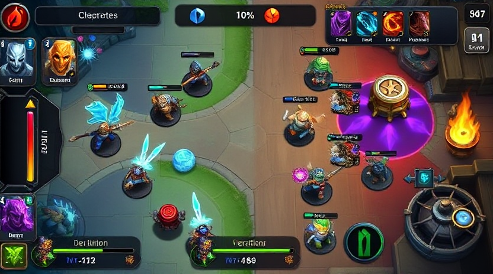

### 핵심 기획 표
| 항목 | 기획 내용 | 개발 필요사항 |
|---|---|---|
| 목표 | 체감이 분명한 전투/UX 개선 | 상태머신, 전투공식, UI 이벤트 연동 구현 |
| 카드 룰 | 코스트/역할/카운터 관계 유지 | 카드 데이터 검증기, 덱 구성 제약 로직 |
| 전투 공식 | 기본 피해량 + 오버타임/서든데스 스케일 | 서버/클라 동일 수식 적용 |
| 승패 연출 | 승리/패배 전환 즉시 인지 | 결과 패널, 애니메이션, 사운드 큐 |
| QA 재미도 | pace/variety/combo/counterplay 점검 | QA 설문 + 로그 기반 스코어 산출 |

### 흐름도 (Markdown Mermaid)
~~~mermaid
flowchart LR
A[레퍼런스 분석] --> B[기획 정리]
B --> C[UI 와이어 설계]
C --> D[카드 룰/전투 공식]
D --> E[구현]
E --> F[리뷰 에이전트]
F --> G{QA 통과?}
G -- 아니오 --> A
G -- 예 --> H[완료]
~~~

### UI 제안 (Markdown)
| UI 구역 | 구성 요소 | 상호작용 |
|---|---|---|
| 상단바 | 타워 HP, 페이즈 타이머 | 실시간 수치 업데이트 |
| 중앙 전장 | 좌/우 레인, 타워, 미니언 | 카드 배치 결과 시각화 |
| 하단 카드핸드 | 4장 핸드, 다음 카드 프리뷰, 마나바 | 선택/취소/레인 선택 |
| 결과 오버레이 | 승리/패배, 재시작, 메뉴 | 게임 종료 후 전환 |

~~~text
+----------------------------------------------------+
| Player HP | Phase Timer | Enemy HP                 |
+---------------------- BATTLE FIELD ----------------+
| Left Lane                | Right Lane               |
| [Deploy Zone]            | [Deploy Zone]            |
+----------------------------------------------------+
| Mana Bar | Card1 Card2 Card3 Card4 | Next Card     |
+----------------------------------------------------+
~~~

### 개발 제안
1. 레퍼런스 이미지 기반으로 맵 가독성 기준선을 먼저 고정한다
2. 카드 룰/전투 공식 수치를 CSV 단일 소스로 관리한다
3. UI 이벤트(선택/취소/승패)를 상태머신과 연결해 회귀를 줄인다
4. 리뷰 반려 시 즉시 레퍼런스 재수집 후 기획 diff를 기록한다

## Page 8

### 페이지 주제
- 전투 공식

### 레퍼런스 체크 이미지

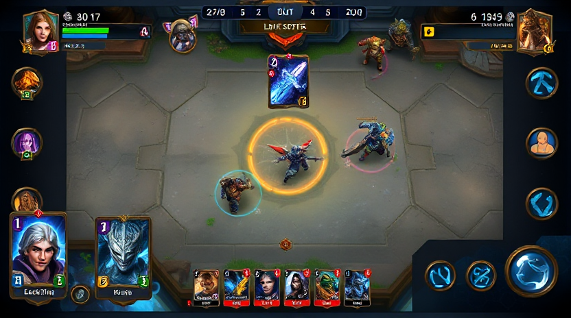

### 핵심 기획 표
| 항목 | 기획 내용 | 개발 필요사항 |
|---|---|---|
| 목표 | 체감이 분명한 전투/UX 개선 | 상태머신, 전투공식, UI 이벤트 연동 구현 |
| 카드 룰 | 코스트/역할/카운터 관계 유지 | 카드 데이터 검증기, 덱 구성 제약 로직 |
| 전투 공식 | 기본 피해량 + 오버타임/서든데스 스케일 | 서버/클라 동일 수식 적용 |
| 승패 연출 | 승리/패배 전환 즉시 인지 | 결과 패널, 애니메이션, 사운드 큐 |
| QA 재미도 | pace/variety/combo/counterplay 점검 | QA 설문 + 로그 기반 스코어 산출 |

### 흐름도 (Markdown Mermaid)
~~~mermaid
flowchart LR
A[레퍼런스 분석] --> B[기획 정리]
B --> C[UI 와이어 설계]
C --> D[카드 룰/전투 공식]
D --> E[구현]
E --> F[리뷰 에이전트]
F --> G{QA 통과?}
G -- 아니오 --> A
G -- 예 --> H[완료]
~~~

### UI 제안 (Markdown)
| UI 구역 | 구성 요소 | 상호작용 |
|---|---|---|
| 상단바 | 타워 HP, 페이즈 타이머 | 실시간 수치 업데이트 |
| 중앙 전장 | 좌/우 레인, 타워, 미니언 | 카드 배치 결과 시각화 |
| 하단 카드핸드 | 4장 핸드, 다음 카드 프리뷰, 마나바 | 선택/취소/레인 선택 |
| 결과 오버레이 | 승리/패배, 재시작, 메뉴 | 게임 종료 후 전환 |

~~~text
+----------------------------------------------------+
| Player HP | Phase Timer | Enemy HP                 |
+---------------------- BATTLE FIELD ----------------+
| Left Lane                | Right Lane               |
| [Deploy Zone]            | [Deploy Zone]            |
+----------------------------------------------------+
| Mana Bar | Card1 Card2 Card3 Card4 | Next Card     |
+----------------------------------------------------+
~~~

### 개발 제안
1. 레퍼런스 이미지 기반으로 맵 가독성 기준선을 먼저 고정한다
2. 카드 룰/전투 공식 수치를 CSV 단일 소스로 관리한다
3. UI 이벤트(선택/취소/승패)를 상태머신과 연결해 회귀를 줄인다
4. 리뷰 반려 시 즉시 레퍼런스 재수집 후 기획 diff를 기록한다

## Page 9

### 페이지 주제
- 카드 인벤토리

### 레퍼런스 체크 이미지

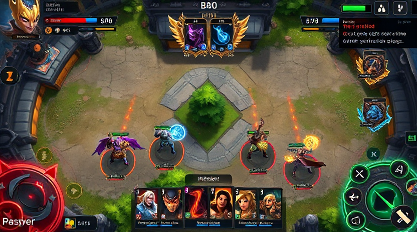

### 핵심 기획 표
| 항목 | 기획 내용 | 개발 필요사항 |
|---|---|---|
| 목표 | 체감이 분명한 전투/UX 개선 | 상태머신, 전투공식, UI 이벤트 연동 구현 |
| 카드 룰 | 코스트/역할/카운터 관계 유지 | 카드 데이터 검증기, 덱 구성 제약 로직 |
| 전투 공식 | 기본 피해량 + 오버타임/서든데스 스케일 | 서버/클라 동일 수식 적용 |
| 승패 연출 | 승리/패배 전환 즉시 인지 | 결과 패널, 애니메이션, 사운드 큐 |
| QA 재미도 | pace/variety/combo/counterplay 점검 | QA 설문 + 로그 기반 스코어 산출 |

### 흐름도 (Markdown Mermaid)
~~~mermaid
flowchart LR
A[레퍼런스 분석] --> B[기획 정리]
B --> C[UI 와이어 설계]
C --> D[카드 룰/전투 공식]
D --> E[구현]
E --> F[리뷰 에이전트]
F --> G{QA 통과?}
G -- 아니오 --> A
G -- 예 --> H[완료]
~~~

### UI 제안 (Markdown)
| UI 구역 | 구성 요소 | 상호작용 |
|---|---|---|
| 상단바 | 타워 HP, 페이즈 타이머 | 실시간 수치 업데이트 |
| 중앙 전장 | 좌/우 레인, 타워, 미니언 | 카드 배치 결과 시각화 |
| 하단 카드핸드 | 4장 핸드, 다음 카드 프리뷰, 마나바 | 선택/취소/레인 선택 |
| 결과 오버레이 | 승리/패배, 재시작, 메뉴 | 게임 종료 후 전환 |

~~~text
+----------------------------------------------------+
| Player HP | Phase Timer | Enemy HP                 |
+---------------------- BATTLE FIELD ----------------+
| Left Lane                | Right Lane               |
| [Deploy Zone]            | [Deploy Zone]            |
+----------------------------------------------------+
| Mana Bar | Card1 Card2 Card3 Card4 | Next Card     |
+----------------------------------------------------+
~~~

### 개발 제안
1. 레퍼런스 이미지 기반으로 맵 가독성 기준선을 먼저 고정한다
2. 카드 룰/전투 공식 수치를 CSV 단일 소스로 관리한다
3. UI 이벤트(선택/취소/승패)를 상태머신과 연결해 회귀를 줄인다
4. 리뷰 반려 시 즉시 레퍼런스 재수집 후 기획 diff를 기록한다

## Page 10

### 페이지 주제
- 캐릭터 설정/설명

### 레퍼런스 체크 이미지

### 핵심 기획 표
| 항목 | 기획 내용 | 개발 필요사항 |
|---|---|---|
| 목표 | 체감이 분명한 전투/UX 개선 | 상태머신, 전투공식, UI 이벤트 연동 구현 |
| 카드 룰 | 코스트/역할/카운터 관계 유지 | 카드 데이터 검증기, 덱 구성 제약 로직 |
| 전투 공식 | 기본 피해량 + 오버타임/서든데스 스케일 | 서버/클라 동일 수식 적용 |
| 승패 연출 | 승리/패배 전환 즉시 인지 | 결과 패널, 애니메이션, 사운드 큐 |
| QA 재미도 | pace/variety/combo/counterplay 점검 | QA 설문 + 로그 기반 스코어 산출 |

### 흐름도 (Markdown Mermaid)
~~~mermaid
flowchart LR
A[레퍼런스 분석] --> B[기획 정리]
B --> C[UI 와이어 설계]
C --> D[카드 룰/전투 공식]
D --> E[구현]
E --> F[리뷰 에이전트]
F --> G{QA 통과?}
G -- 아니오 --> A
G -- 예 --> H[완료]
~~~

### UI 제안 (Markdown)
| UI 구역 | 구성 요소 | 상호작용 |
|---|---|---|
| 상단바 | 타워 HP, 페이즈 타이머 | 실시간 수치 업데이트 |
| 중앙 전장 | 좌/우 레인, 타워, 미니언 | 카드 배치 결과 시각화 |
| 하단 카드핸드 | 4장 핸드, 다음 카드 프리뷰, 마나바 | 선택/취소/레인 선택 |
| 결과 오버레이 | 승리/패배, 재시작, 메뉴 | 게임 종료 후 전환 |

~~~text
+----------------------------------------------------+
| Player HP | Phase Timer | Enemy HP                 |
+---------------------- BATTLE FIELD ----------------+
| Left Lane                | Right Lane               |
| [Deploy Zone]            | [Deploy Zone]            |
+----------------------------------------------------+
| Mana Bar | Card1 Card2 Card3 Card4 | Next Card     |
+----------------------------------------------------+
~~~

### 개발 제안
1. 레퍼런스 이미지 기반으로 맵 가독성 기준선을 먼저 고정한다
2. 카드 룰/전투 공식 수치를 CSV 단일 소스로 관리한다
3. UI 이벤트(선택/취소/승패)를 상태머신과 연결해 회귀를 줄인다
4. 리뷰 반려 시 즉시 레퍼런스 재수집 후 기획 diff를 기록한다

## Page 11

### 페이지 주제
- QA 시나리오

### 레퍼런스 체크 이미지

### 핵심 기획 표
| 항목 | 기획 내용 | 개발 필요사항 |
|---|---|---|
| 목표 | 체감이 분명한 전투/UX 개선 | 상태머신, 전투공식, UI 이벤트 연동 구현 |
| 카드 룰 | 코스트/역할/카운터 관계 유지 | 카드 데이터 검증기, 덱 구성 제약 로직 |
| 전투 공식 | 기본 피해량 + 오버타임/서든데스 스케일 | 서버/클라 동일 수식 적용 |
| 승패 연출 | 승리/패배 전환 즉시 인지 | 결과 패널, 애니메이션, 사운드 큐 |
| QA 재미도 | pace/variety/combo/counterplay 점검 | QA 설문 + 로그 기반 스코어 산출 |

### 흐름도 (Markdown Mermaid)
~~~mermaid
flowchart LR
A[레퍼런스 분석] --> B[기획 정리]
B --> C[UI 와이어 설계]
C --> D[카드 룰/전투 공식]
D --> E[구현]
E --> F[리뷰 에이전트]
F --> G{QA 통과?}
G -- 아니오 --> A
G -- 예 --> H[완료]
~~~

### UI 제안 (Markdown)
| UI 구역 | 구성 요소 | 상호작용 |
|---|---|---|
| 상단바 | 타워 HP, 페이즈 타이머 | 실시간 수치 업데이트 |
| 중앙 전장 | 좌/우 레인, 타워, 미니언 | 카드 배치 결과 시각화 |
| 하단 카드핸드 | 4장 핸드, 다음 카드 프리뷰, 마나바 | 선택/취소/레인 선택 |
| 결과 오버레이 | 승리/패배, 재시작, 메뉴 | 게임 종료 후 전환 |

~~~text
+----------------------------------------------------+
| Player HP | Phase Timer | Enemy HP                 |
+---------------------- BATTLE FIELD ----------------+
| Left Lane                | Right Lane               |
| [Deploy Zone]            | [Deploy Zone]            |
+----------------------------------------------------+
| Mana Bar | Card1 Card2 Card3 Card4 | Next Card     |
+----------------------------------------------------+
~~~

### 개발 제안
1. 레퍼런스 이미지 기반으로 맵 가독성 기준선을 먼저 고정한다
2. 카드 룰/전투 공식 수치를 CSV 단일 소스로 관리한다
3. UI 이벤트(선택/취소/승패)를 상태머신과 연결해 회귀를 줄인다
4. 리뷰 반려 시 즉시 레퍼런스 재수집 후 기획 diff를 기록한다

## Page 12

### 페이지 주제
- 라이브 밸런싱

### 레퍼런스 체크 이미지

### 핵심 기획 표
| 항목 | 기획 내용 | 개발 필요사항 |
|---|---|---|
| 목표 | 체감이 분명한 전투/UX 개선 | 상태머신, 전투공식, UI 이벤트 연동 구현 |
| 카드 룰 | 코스트/역할/카운터 관계 유지 | 카드 데이터 검증기, 덱 구성 제약 로직 |
| 전투 공식 | 기본 피해량 + 오버타임/서든데스 스케일 | 서버/클라 동일 수식 적용 |
| 승패 연출 | 승리/패배 전환 즉시 인지 | 결과 패널, 애니메이션, 사운드 큐 |
| QA 재미도 | pace/variety/combo/counterplay 점검 | QA 설문 + 로그 기반 스코어 산출 |

### 흐름도 (Markdown Mermaid)
~~~mermaid
flowchart LR
A[레퍼런스 분석] --> B[기획 정리]
B --> C[UI 와이어 설계]
C --> D[카드 룰/전투 공식]
D --> E[구현]
E --> F[리뷰 에이전트]
F --> G{QA 통과?}
G -- 아니오 --> A
G -- 예 --> H[완료]
~~~

### UI 제안 (Markdown)
| UI 구역 | 구성 요소 | 상호작용 |
|---|---|---|
| 상단바 | 타워 HP, 페이즈 타이머 | 실시간 수치 업데이트 |
| 중앙 전장 | 좌/우 레인, 타워, 미니언 | 카드 배치 결과 시각화 |
| 하단 카드핸드 | 4장 핸드, 다음 카드 프리뷰, 마나바 | 선택/취소/레인 선택 |
| 결과 오버레이 | 승리/패배, 재시작, 메뉴 | 게임 종료 후 전환 |

~~~text
+----------------------------------------------------+
| Player HP | Phase Timer | Enemy HP                 |
+---------------------- BATTLE FIELD ----------------+
| Left Lane                | Right Lane               |
| [Deploy Zone]            | [Deploy Zone]            |
+----------------------------------------------------+
| Mana Bar | Card1 Card2 Card3 Card4 | Next Card     |
+----------------------------------------------------+
~~~

### 개발 제안
1. 레퍼런스 이미지 기반으로 맵 가독성 기준선을 먼저 고정한다
2. 카드 룰/전투 공식 수치를 CSV 단일 소스로 관리한다
3. UI 이벤트(선택/취소/승패)를 상태머신과 연결해 회귀를 줄인다
4. 리뷰 반려 시 즉시 레퍼런스 재수집 후 기획 diff를 기록한다

## Page 13

### 페이지 주제
- 메인 페이지 UX (ComfyUI 우선)

### 레퍼런스 체크 이미지

### 핵심 기획 표
| 항목 | 기획 내용 | 개발 필요사항 |
|---|---|---|
| 목표 | 체감이 분명한 전투/UX 개선 | 상태머신, 전투공식, UI 이벤트 연동 구현 |
| 카드 룰 | 코스트/역할/카운터 관계 유지 | 카드 데이터 검증기, 덱 구성 제약 로직 |
| 전투 공식 | 기본 피해량 + 오버타임/서든데스 스케일 | 서버/클라 동일 수식 적용 |
| 승패 연출 | 승리/패배 전환 즉시 인지 | 결과 패널, 애니메이션, 사운드 큐 |
| QA 재미도 | pace/variety/combo/counterplay 점검 | QA 설문 + 로그 기반 스코어 산출 |

### 흐름도 (Markdown Mermaid)
~~~mermaid
flowchart LR
A[레퍼런스 분석] --> B[기획 정리]
B --> C[UI 와이어 설계]
C --> D[카드 룰/전투 공식]
D --> E[구현]
E --> F[리뷰 에이전트]
F --> G{QA 통과?}
G -- 아니오 --> A
G -- 예 --> H[완료]
~~~

### UI 제안 (Markdown)
| UI 구역 | 구성 요소 | 상호작용 |
|---|---|---|
| 상단바 | 타워 HP, 페이즈 타이머 | 실시간 수치 업데이트 |
| 중앙 전장 | 좌/우 레인, 타워, 미니언 | 카드 배치 결과 시각화 |
| 하단 카드핸드 | 4장 핸드, 다음 카드 프리뷰, 마나바 | 선택/취소/레인 선택 |
| 결과 오버레이 | 승리/패배, 재시작, 메뉴 | 게임 종료 후 전환 |

~~~text
+----------------------------------------------------+
| Player HP | Phase Timer | Enemy HP                 |
+---------------------- BATTLE FIELD ----------------+
| Left Lane                | Right Lane               |
| [Deploy Zone]            | [Deploy Zone]            |
+----------------------------------------------------+
| Mana Bar | Card1 Card2 Card3 Card4 | Next Card     |
+----------------------------------------------------+
~~~

### 개발 제안
1. 레퍼런스 이미지 기반으로 맵 가독성 기준선을 먼저 고정한다
2. 카드 룰/전투 공식 수치를 CSV 단일 소스로 관리한다
3. UI 이벤트(선택/취소/승패)를 상태머신과 연결해 회귀를 줄인다
4. 리뷰 반려 시 즉시 레퍼런스 재수집 후 기획 diff를 기록한다

## Page 14

### 페이지 주제
- 로비 및 맵 가독성

### 레퍼런스 체크 이미지

### 핵심 기획 표
| 항목 | 기획 내용 | 개발 필요사항 |
|---|---|---|
| 목표 | 체감이 분명한 전투/UX 개선 | 상태머신, 전투공식, UI 이벤트 연동 구현 |
| 카드 룰 | 코스트/역할/카운터 관계 유지 | 카드 데이터 검증기, 덱 구성 제약 로직 |
| 전투 공식 | 기본 피해량 + 오버타임/서든데스 스케일 | 서버/클라 동일 수식 적용 |
| 승패 연출 | 승리/패배 전환 즉시 인지 | 결과 패널, 애니메이션, 사운드 큐 |
| QA 재미도 | pace/variety/combo/counterplay 점검 | QA 설문 + 로그 기반 스코어 산출 |

### 흐름도 (Markdown Mermaid)
~~~mermaid
flowchart LR
A[레퍼런스 분석] --> B[기획 정리]
B --> C[UI 와이어 설계]
C --> D[카드 룰/전투 공식]
D --> E[구현]
E --> F[리뷰 에이전트]
F --> G{QA 통과?}
G -- 아니오 --> A
G -- 예 --> H[완료]
~~~

### UI 제안 (Markdown)
| UI 구역 | 구성 요소 | 상호작용 |
|---|---|---|
| 상단바 | 타워 HP, 페이즈 타이머 | 실시간 수치 업데이트 |
| 중앙 전장 | 좌/우 레인, 타워, 미니언 | 카드 배치 결과 시각화 |
| 하단 카드핸드 | 4장 핸드, 다음 카드 프리뷰, 마나바 | 선택/취소/레인 선택 |
| 결과 오버레이 | 승리/패배, 재시작, 메뉴 | 게임 종료 후 전환 |

~~~text
+----------------------------------------------------+
| Player HP | Phase Timer | Enemy HP                 |
+---------------------- BATTLE FIELD ----------------+
| Left Lane                | Right Lane               |
| [Deploy Zone]            | [Deploy Zone]            |
+----------------------------------------------------+
| Mana Bar | Card1 Card2 Card3 Card4 | Next Card     |
+----------------------------------------------------+
~~~

### 개발 제안
1. 레퍼런스 이미지 기반으로 맵 가독성 기준선을 먼저 고정한다
2. 카드 룰/전투 공식 수치를 CSV 단일 소스로 관리한다
3. UI 이벤트(선택/취소/승패)를 상태머신과 연결해 회귀를 줄인다
4. 리뷰 반려 시 즉시 레퍼런스 재수집 후 기획 diff를 기록한다

## Page 15

### 페이지 주제
- 전투 루프

### 레퍼런스 체크 이미지

### 핵심 기획 표
| 항목 | 기획 내용 | 개발 필요사항 |
|---|---|---|
| 목표 | 체감이 분명한 전투/UX 개선 | 상태머신, 전투공식, UI 이벤트 연동 구현 |
| 카드 룰 | 코스트/역할/카운터 관계 유지 | 카드 데이터 검증기, 덱 구성 제약 로직 |
| 전투 공식 | 기본 피해량 + 오버타임/서든데스 스케일 | 서버/클라 동일 수식 적용 |
| 승패 연출 | 승리/패배 전환 즉시 인지 | 결과 패널, 애니메이션, 사운드 큐 |
| QA 재미도 | pace/variety/combo/counterplay 점검 | QA 설문 + 로그 기반 스코어 산출 |

### 흐름도 (Markdown Mermaid)
~~~mermaid
flowchart LR
A[레퍼런스 분석] --> B[기획 정리]
B --> C[UI 와이어 설계]
C --> D[카드 룰/전투 공식]
D --> E[구현]
E --> F[리뷰 에이전트]
F --> G{QA 통과?}
G -- 아니오 --> A
G -- 예 --> H[완료]
~~~

### UI 제안 (Markdown)
| UI 구역 | 구성 요소 | 상호작용 |
|---|---|---|
| 상단바 | 타워 HP, 페이즈 타이머 | 실시간 수치 업데이트 |
| 중앙 전장 | 좌/우 레인, 타워, 미니언 | 카드 배치 결과 시각화 |
| 하단 카드핸드 | 4장 핸드, 다음 카드 프리뷰, 마나바 | 선택/취소/레인 선택 |
| 결과 오버레이 | 승리/패배, 재시작, 메뉴 | 게임 종료 후 전환 |

~~~text
+----------------------------------------------------+
| Player HP | Phase Timer | Enemy HP                 |
+---------------------- BATTLE FIELD ----------------+
| Left Lane                | Right Lane               |
| [Deploy Zone]            | [Deploy Zone]            |
+----------------------------------------------------+
| Mana Bar | Card1 Card2 Card3 Card4 | Next Card     |
+----------------------------------------------------+
~~~

### 개발 제안
1. 레퍼런스 이미지 기반으로 맵 가독성 기준선을 먼저 고정한다
2. 카드 룰/전투 공식 수치를 CSV 단일 소스로 관리한다
3. UI 이벤트(선택/취소/승패)를 상태머신과 연결해 회귀를 줄인다
4. 리뷰 반려 시 즉시 레퍼런스 재수집 후 기획 diff를 기록한다

## Page 16

### 페이지 주제
- 승리 및 패배 흐름

### 레퍼런스 체크 이미지

### 핵심 기획 표
| 항목 | 기획 내용 | 개발 필요사항 |
|---|---|---|
| 목표 | 체감이 분명한 전투/UX 개선 | 상태머신, 전투공식, UI 이벤트 연동 구현 |
| 카드 룰 | 코스트/역할/카운터 관계 유지 | 카드 데이터 검증기, 덱 구성 제약 로직 |
| 전투 공식 | 기본 피해량 + 오버타임/서든데스 스케일 | 서버/클라 동일 수식 적용 |
| 승패 연출 | 승리/패배 전환 즉시 인지 | 결과 패널, 애니메이션, 사운드 큐 |
| QA 재미도 | pace/variety/combo/counterplay 점검 | QA 설문 + 로그 기반 스코어 산출 |

### 흐름도 (Markdown Mermaid)
~~~mermaid
flowchart LR
A[레퍼런스 분석] --> B[기획 정리]
B --> C[UI 와이어 설계]
C --> D[카드 룰/전투 공식]
D --> E[구현]
E --> F[리뷰 에이전트]
F --> G{QA 통과?}
G -- 아니오 --> A
G -- 예 --> H[완료]
~~~

### UI 제안 (Markdown)
| UI 구역 | 구성 요소 | 상호작용 |
|---|---|---|
| 상단바 | 타워 HP, 페이즈 타이머 | 실시간 수치 업데이트 |
| 중앙 전장 | 좌/우 레인, 타워, 미니언 | 카드 배치 결과 시각화 |
| 하단 카드핸드 | 4장 핸드, 다음 카드 프리뷰, 마나바 | 선택/취소/레인 선택 |
| 결과 오버레이 | 승리/패배, 재시작, 메뉴 | 게임 종료 후 전환 |

~~~text
+----------------------------------------------------+
| Player HP | Phase Timer | Enemy HP                 |
+---------------------- BATTLE FIELD ----------------+
| Left Lane                | Right Lane               |
| [Deploy Zone]            | [Deploy Zone]            |
+----------------------------------------------------+
| Mana Bar | Card1 Card2 Card3 Card4 | Next Card     |
+----------------------------------------------------+
~~~

### 개발 제안
1. 레퍼런스 이미지 기반으로 맵 가독성 기준선을 먼저 고정한다
2. 카드 룰/전투 공식 수치를 CSV 단일 소스로 관리한다
3. UI 이벤트(선택/취소/승패)를 상태머신과 연결해 회귀를 줄인다
4. 리뷰 반려 시 즉시 레퍼런스 재수집 후 기획 diff를 기록한다

## Page 17

### 페이지 주제
- 애니메이션 연출

### 레퍼런스 체크 이미지

### 핵심 기획 표
| 항목 | 기획 내용 | 개발 필요사항 |
|---|---|---|
| 목표 | 체감이 분명한 전투/UX 개선 | 상태머신, 전투공식, UI 이벤트 연동 구현 |
| 카드 룰 | 코스트/역할/카운터 관계 유지 | 카드 데이터 검증기, 덱 구성 제약 로직 |
| 전투 공식 | 기본 피해량 + 오버타임/서든데스 스케일 | 서버/클라 동일 수식 적용 |
| 승패 연출 | 승리/패배 전환 즉시 인지 | 결과 패널, 애니메이션, 사운드 큐 |
| QA 재미도 | pace/variety/combo/counterplay 점검 | QA 설문 + 로그 기반 스코어 산출 |

### 흐름도 (Markdown Mermaid)
~~~mermaid
flowchart LR
A[레퍼런스 분석] --> B[기획 정리]
B --> C[UI 와이어 설계]
C --> D[카드 룰/전투 공식]
D --> E[구현]
E --> F[리뷰 에이전트]
F --> G{QA 통과?}
G -- 아니오 --> A
G -- 예 --> H[완료]
~~~

### UI 제안 (Markdown)
| UI 구역 | 구성 요소 | 상호작용 |
|---|---|---|
| 상단바 | 타워 HP, 페이즈 타이머 | 실시간 수치 업데이트 |
| 중앙 전장 | 좌/우 레인, 타워, 미니언 | 카드 배치 결과 시각화 |
| 하단 카드핸드 | 4장 핸드, 다음 카드 프리뷰, 마나바 | 선택/취소/레인 선택 |
| 결과 오버레이 | 승리/패배, 재시작, 메뉴 | 게임 종료 후 전환 |

~~~text
+----------------------------------------------------+
| Player HP | Phase Timer | Enemy HP                 |
+---------------------- BATTLE FIELD ----------------+
| Left Lane                | Right Lane               |
| [Deploy Zone]            | [Deploy Zone]            |
+----------------------------------------------------+
| Mana Bar | Card1 Card2 Card3 Card4 | Next Card     |
+----------------------------------------------------+
~~~

### 개발 제안
1. 레퍼런스 이미지 기반으로 맵 가독성 기준선을 먼저 고정한다
2. 카드 룰/전투 공식 수치를 CSV 단일 소스로 관리한다
3. UI 이벤트(선택/취소/승패)를 상태머신과 연결해 회귀를 줄인다
4. 리뷰 반려 시 즉시 레퍼런스 재수집 후 기획 diff를 기록한다

## Page 18

### 페이지 주제
- 카드 덱 구성 규칙

### 레퍼런스 체크 이미지

### 핵심 기획 표
| 항목 | 기획 내용 | 개발 필요사항 |
|---|---|---|
| 목표 | 체감이 분명한 전투/UX 개선 | 상태머신, 전투공식, UI 이벤트 연동 구현 |
| 카드 룰 | 코스트/역할/카운터 관계 유지 | 카드 데이터 검증기, 덱 구성 제약 로직 |
| 전투 공식 | 기본 피해량 + 오버타임/서든데스 스케일 | 서버/클라 동일 수식 적용 |
| 승패 연출 | 승리/패배 전환 즉시 인지 | 결과 패널, 애니메이션, 사운드 큐 |
| QA 재미도 | pace/variety/combo/counterplay 점검 | QA 설문 + 로그 기반 스코어 산출 |

### 흐름도 (Markdown Mermaid)
~~~mermaid
flowchart LR
A[레퍼런스 분석] --> B[기획 정리]
B --> C[UI 와이어 설계]
C --> D[카드 룰/전투 공식]
D --> E[구현]
E --> F[리뷰 에이전트]
F --> G{QA 통과?}
G -- 아니오 --> A
G -- 예 --> H[완료]
~~~

### UI 제안 (Markdown)
| UI 구역 | 구성 요소 | 상호작용 |
|---|---|---|
| 상단바 | 타워 HP, 페이즈 타이머 | 실시간 수치 업데이트 |
| 중앙 전장 | 좌/우 레인, 타워, 미니언 | 카드 배치 결과 시각화 |
| 하단 카드핸드 | 4장 핸드, 다음 카드 프리뷰, 마나바 | 선택/취소/레인 선택 |
| 결과 오버레이 | 승리/패배, 재시작, 메뉴 | 게임 종료 후 전환 |

~~~text
+----------------------------------------------------+
| Player HP | Phase Timer | Enemy HP                 |
+---------------------- BATTLE FIELD ----------------+
| Left Lane                | Right Lane               |
| [Deploy Zone]            | [Deploy Zone]            |
+----------------------------------------------------+
| Mana Bar | Card1 Card2 Card3 Card4 | Next Card     |
+----------------------------------------------------+
~~~

### 개발 제안
1. 레퍼런스 이미지 기반으로 맵 가독성 기준선을 먼저 고정한다
2. 카드 룰/전투 공식 수치를 CSV 단일 소스로 관리한다
3. UI 이벤트(선택/취소/승패)를 상태머신과 연결해 회귀를 줄인다
4. 리뷰 반려 시 즉시 레퍼런스 재수집 후 기획 diff를 기록한다

## Page 19

### 페이지 주제
- 카드 룰 시스템

### 레퍼런스 체크 이미지

### 핵심 기획 표
| 항목 | 기획 내용 | 개발 필요사항 |
|---|---|---|
| 목표 | 체감이 분명한 전투/UX 개선 | 상태머신, 전투공식, UI 이벤트 연동 구현 |
| 카드 룰 | 코스트/역할/카운터 관계 유지 | 카드 데이터 검증기, 덱 구성 제약 로직 |
| 전투 공식 | 기본 피해량 + 오버타임/서든데스 스케일 | 서버/클라 동일 수식 적용 |
| 승패 연출 | 승리/패배 전환 즉시 인지 | 결과 패널, 애니메이션, 사운드 큐 |
| QA 재미도 | pace/variety/combo/counterplay 점검 | QA 설문 + 로그 기반 스코어 산출 |

### 흐름도 (Markdown Mermaid)
~~~mermaid
flowchart LR
A[레퍼런스 분석] --> B[기획 정리]
B --> C[UI 와이어 설계]
C --> D[카드 룰/전투 공식]
D --> E[구현]
E --> F[리뷰 에이전트]
F --> G{QA 통과?}
G -- 아니오 --> A
G -- 예 --> H[완료]
~~~

### UI 제안 (Markdown)
| UI 구역 | 구성 요소 | 상호작용 |
|---|---|---|
| 상단바 | 타워 HP, 페이즈 타이머 | 실시간 수치 업데이트 |
| 중앙 전장 | 좌/우 레인, 타워, 미니언 | 카드 배치 결과 시각화 |
| 하단 카드핸드 | 4장 핸드, 다음 카드 프리뷰, 마나바 | 선택/취소/레인 선택 |
| 결과 오버레이 | 승리/패배, 재시작, 메뉴 | 게임 종료 후 전환 |

~~~text
+----------------------------------------------------+
| Player HP | Phase Timer | Enemy HP                 |
+---------------------- BATTLE FIELD ----------------+
| Left Lane                | Right Lane               |
| [Deploy Zone]            | [Deploy Zone]            |
+----------------------------------------------------+
| Mana Bar | Card1 Card2 Card3 Card4 | Next Card     |
+----------------------------------------------------+
~~~

### 개발 제안
1. 레퍼런스 이미지 기반으로 맵 가독성 기준선을 먼저 고정한다
2. 카드 룰/전투 공식 수치를 CSV 단일 소스로 관리한다
3. UI 이벤트(선택/취소/승패)를 상태머신과 연결해 회귀를 줄인다
4. 리뷰 반려 시 즉시 레퍼런스 재수집 후 기획 diff를 기록한다

## Page 20

### 페이지 주제
- 전투 공식

### 레퍼런스 체크 이미지

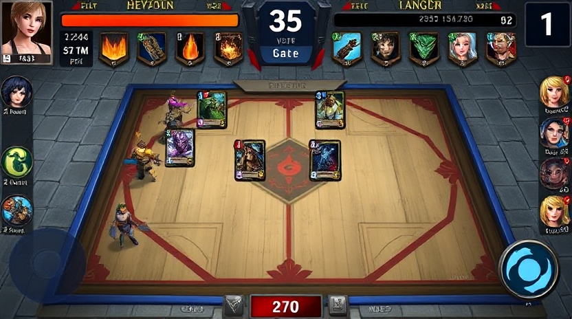

### 핵심 기획 표
| 항목 | 기획 내용 | 개발 필요사항 |
|---|---|---|
| 목표 | 체감이 분명한 전투/UX 개선 | 상태머신, 전투공식, UI 이벤트 연동 구현 |
| 카드 룰 | 코스트/역할/카운터 관계 유지 | 카드 데이터 검증기, 덱 구성 제약 로직 |
| 전투 공식 | 기본 피해량 + 오버타임/서든데스 스케일 | 서버/클라 동일 수식 적용 |
| 승패 연출 | 승리/패배 전환 즉시 인지 | 결과 패널, 애니메이션, 사운드 큐 |
| QA 재미도 | pace/variety/combo/counterplay 점검 | QA 설문 + 로그 기반 스코어 산출 |

### 흐름도 (Markdown Mermaid)
~~~mermaid
flowchart LR
A[레퍼런스 분석] --> B[기획 정리]
B --> C[UI 와이어 설계]
C --> D[카드 룰/전투 공식]
D --> E[구현]
E --> F[리뷰 에이전트]
F --> G{QA 통과?}
G -- 아니오 --> A
G -- 예 --> H[완료]
~~~

### UI 제안 (Markdown)
| UI 구역 | 구성 요소 | 상호작용 |
|---|---|---|
| 상단바 | 타워 HP, 페이즈 타이머 | 실시간 수치 업데이트 |
| 중앙 전장 | 좌/우 레인, 타워, 미니언 | 카드 배치 결과 시각화 |
| 하단 카드핸드 | 4장 핸드, 다음 카드 프리뷰, 마나바 | 선택/취소/레인 선택 |
| 결과 오버레이 | 승리/패배, 재시작, 메뉴 | 게임 종료 후 전환 |

~~~text
+----------------------------------------------------+
| Player HP | Phase Timer | Enemy HP                 |
+---------------------- BATTLE FIELD ----------------+
| Left Lane                | Right Lane               |
| [Deploy Zone]            | [Deploy Zone]            |
+----------------------------------------------------+
| Mana Bar | Card1 Card2 Card3 Card4 | Next Card     |
+----------------------------------------------------+
~~~

### 개발 제안
1. 레퍼런스 이미지 기반으로 맵 가독성 기준선을 먼저 고정한다
2. 카드 룰/전투 공식 수치를 CSV 단일 소스로 관리한다
3. UI 이벤트(선택/취소/승패)를 상태머신과 연결해 회귀를 줄인다
4. 리뷰 반려 시 즉시 레퍼런스 재수집 후 기획 diff를 기록한다

## Page 21

### 페이지 주제
- 카드 인벤토리

### 레퍼런스 체크 이미지

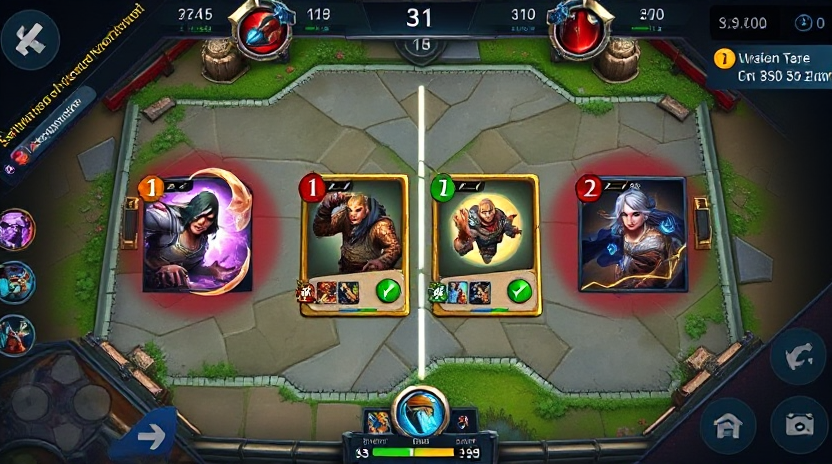

### 핵심 기획 표
| 항목 | 기획 내용 | 개발 필요사항 |
|---|---|---|
| 목표 | 체감이 분명한 전투/UX 개선 | 상태머신, 전투공식, UI 이벤트 연동 구현 |
| 카드 룰 | 코스트/역할/카운터 관계 유지 | 카드 데이터 검증기, 덱 구성 제약 로직 |
| 전투 공식 | 기본 피해량 + 오버타임/서든데스 스케일 | 서버/클라 동일 수식 적용 |
| 승패 연출 | 승리/패배 전환 즉시 인지 | 결과 패널, 애니메이션, 사운드 큐 |
| QA 재미도 | pace/variety/combo/counterplay 점검 | QA 설문 + 로그 기반 스코어 산출 |

### 흐름도 (Markdown Mermaid)
~~~mermaid
flowchart LR
A[레퍼런스 분석] --> B[기획 정리]
B --> C[UI 와이어 설계]
C --> D[카드 룰/전투 공식]
D --> E[구현]
E --> F[리뷰 에이전트]
F --> G{QA 통과?}
G -- 아니오 --> A
G -- 예 --> H[완료]
~~~

### UI 제안 (Markdown)
| UI 구역 | 구성 요소 | 상호작용 |
|---|---|---|
| 상단바 | 타워 HP, 페이즈 타이머 | 실시간 수치 업데이트 |
| 중앙 전장 | 좌/우 레인, 타워, 미니언 | 카드 배치 결과 시각화 |
| 하단 카드핸드 | 4장 핸드, 다음 카드 프리뷰, 마나바 | 선택/취소/레인 선택 |
| 결과 오버레이 | 승리/패배, 재시작, 메뉴 | 게임 종료 후 전환 |

~~~text
+----------------------------------------------------+
| Player HP | Phase Timer | Enemy HP                 |
+---------------------- BATTLE FIELD ----------------+
| Left Lane                | Right Lane               |
| [Deploy Zone]            | [Deploy Zone]            |
+----------------------------------------------------+
| Mana Bar | Card1 Card2 Card3 Card4 | Next Card     |
+----------------------------------------------------+
~~~

### 개발 제안
1. 레퍼런스 이미지 기반으로 맵 가독성 기준선을 먼저 고정한다
2. 카드 룰/전투 공식 수치를 CSV 단일 소스로 관리한다
3. UI 이벤트(선택/취소/승패)를 상태머신과 연결해 회귀를 줄인다
4. 리뷰 반려 시 즉시 레퍼런스 재수집 후 기획 diff를 기록한다

## Page 22

### 페이지 주제
- 캐릭터 설정/설명

### 레퍼런스 체크 이미지

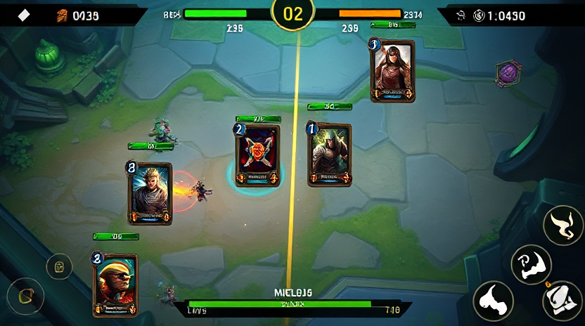

### 핵심 기획 표
| 항목 | 기획 내용 | 개발 필요사항 |
|---|---|---|
| 목표 | 체감이 분명한 전투/UX 개선 | 상태머신, 전투공식, UI 이벤트 연동 구현 |
| 카드 룰 | 코스트/역할/카운터 관계 유지 | 카드 데이터 검증기, 덱 구성 제약 로직 |
| 전투 공식 | 기본 피해량 + 오버타임/서든데스 스케일 | 서버/클라 동일 수식 적용 |
| 승패 연출 | 승리/패배 전환 즉시 인지 | 결과 패널, 애니메이션, 사운드 큐 |
| QA 재미도 | pace/variety/combo/counterplay 점검 | QA 설문 + 로그 기반 스코어 산출 |

### 흐름도 (Markdown Mermaid)
~~~mermaid
flowchart LR
A[레퍼런스 분석] --> B[기획 정리]
B --> C[UI 와이어 설계]
C --> D[카드 룰/전투 공식]
D --> E[구현]
E --> F[리뷰 에이전트]
F --> G{QA 통과?}
G -- 아니오 --> A
G -- 예 --> H[완료]
~~~

### UI 제안 (Markdown)
| UI 구역 | 구성 요소 | 상호작용 |
|---|---|---|
| 상단바 | 타워 HP, 페이즈 타이머 | 실시간 수치 업데이트 |
| 중앙 전장 | 좌/우 레인, 타워, 미니언 | 카드 배치 결과 시각화 |
| 하단 카드핸드 | 4장 핸드, 다음 카드 프리뷰, 마나바 | 선택/취소/레인 선택 |
| 결과 오버레이 | 승리/패배, 재시작, 메뉴 | 게임 종료 후 전환 |

~~~text
+----------------------------------------------------+
| Player HP | Phase Timer | Enemy HP                 |
+---------------------- BATTLE FIELD ----------------+
| Left Lane                | Right Lane               |
| [Deploy Zone]            | [Deploy Zone]            |
+----------------------------------------------------+
| Mana Bar | Card1 Card2 Card3 Card4 | Next Card     |
+----------------------------------------------------+
~~~

### 개발 제안
1. 레퍼런스 이미지 기반으로 맵 가독성 기준선을 먼저 고정한다
2. 카드 룰/전투 공식 수치를 CSV 단일 소스로 관리한다
3. UI 이벤트(선택/취소/승패)를 상태머신과 연결해 회귀를 줄인다
4. 리뷰 반려 시 즉시 레퍼런스 재수집 후 기획 diff를 기록한다

## Page 23

### 페이지 주제
- QA 시나리오

### 레퍼런스 체크 이미지

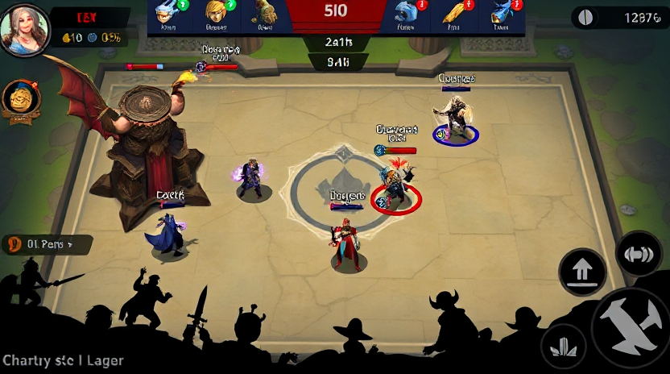

### 핵심 기획 표
| 항목 | 기획 내용 | 개발 필요사항 |
|---|---|---|
| 목표 | 체감이 분명한 전투/UX 개선 | 상태머신, 전투공식, UI 이벤트 연동 구현 |
| 카드 룰 | 코스트/역할/카운터 관계 유지 | 카드 데이터 검증기, 덱 구성 제약 로직 |
| 전투 공식 | 기본 피해량 + 오버타임/서든데스 스케일 | 서버/클라 동일 수식 적용 |
| 승패 연출 | 승리/패배 전환 즉시 인지 | 결과 패널, 애니메이션, 사운드 큐 |
| QA 재미도 | pace/variety/combo/counterplay 점검 | QA 설문 + 로그 기반 스코어 산출 |

### 흐름도 (Markdown Mermaid)
~~~mermaid
flowchart LR
A[레퍼런스 분석] --> B[기획 정리]
B --> C[UI 와이어 설계]
C --> D[카드 룰/전투 공식]
D --> E[구현]
E --> F[리뷰 에이전트]
F --> G{QA 통과?}
G -- 아니오 --> A
G -- 예 --> H[완료]
~~~

### UI 제안 (Markdown)
| UI 구역 | 구성 요소 | 상호작용 |
|---|---|---|
| 상단바 | 타워 HP, 페이즈 타이머 | 실시간 수치 업데이트 |
| 중앙 전장 | 좌/우 레인, 타워, 미니언 | 카드 배치 결과 시각화 |
| 하단 카드핸드 | 4장 핸드, 다음 카드 프리뷰, 마나바 | 선택/취소/레인 선택 |
| 결과 오버레이 | 승리/패배, 재시작, 메뉴 | 게임 종료 후 전환 |

~~~text
+----------------------------------------------------+
| Player HP | Phase Timer | Enemy HP                 |
+---------------------- BATTLE FIELD ----------------+
| Left Lane                | Right Lane               |
| [Deploy Zone]            | [Deploy Zone]            |
+----------------------------------------------------+
| Mana Bar | Card1 Card2 Card3 Card4 | Next Card     |
+----------------------------------------------------+
~~~

### 개발 제안
1. 레퍼런스 이미지 기반으로 맵 가독성 기준선을 먼저 고정한다
2. 카드 룰/전투 공식 수치를 CSV 단일 소스로 관리한다
3. UI 이벤트(선택/취소/승패)를 상태머신과 연결해 회귀를 줄인다
4. 리뷰 반려 시 즉시 레퍼런스 재수집 후 기획 diff를 기록한다

## Page 24

### 페이지 주제
- 라이브 밸런싱

### 레퍼런스 체크 이미지

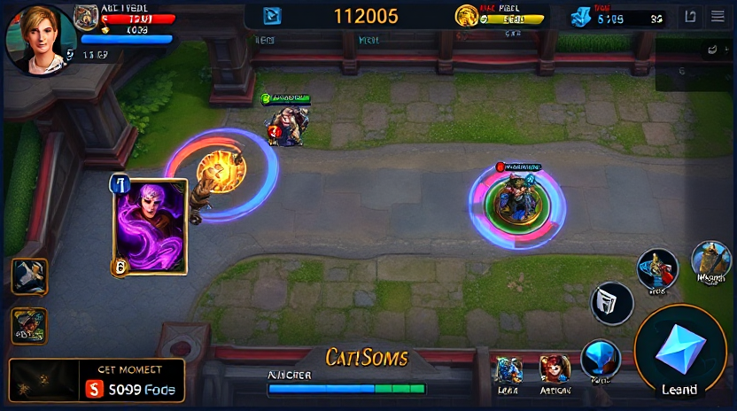

### 핵심 기획 표
| 항목 | 기획 내용 | 개발 필요사항 |
|---|---|---|
| 목표 | 체감이 분명한 전투/UX 개선 | 상태머신, 전투공식, UI 이벤트 연동 구현 |
| 카드 룰 | 코스트/역할/카운터 관계 유지 | 카드 데이터 검증기, 덱 구성 제약 로직 |
| 전투 공식 | 기본 피해량 + 오버타임/서든데스 스케일 | 서버/클라 동일 수식 적용 |
| 승패 연출 | 승리/패배 전환 즉시 인지 | 결과 패널, 애니메이션, 사운드 큐 |
| QA 재미도 | pace/variety/combo/counterplay 점검 | QA 설문 + 로그 기반 스코어 산출 |

### 흐름도 (Markdown Mermaid)
~~~mermaid
flowchart LR
A[레퍼런스 분석] --> B[기획 정리]
B --> C[UI 와이어 설계]
C --> D[카드 룰/전투 공식]
D --> E[구현]
E --> F[리뷰 에이전트]
F --> G{QA 통과?}
G -- 아니오 --> A
G -- 예 --> H[완료]
~~~

### UI 제안 (Markdown)
| UI 구역 | 구성 요소 | 상호작용 |
|---|---|---|
| 상단바 | 타워 HP, 페이즈 타이머 | 실시간 수치 업데이트 |
| 중앙 전장 | 좌/우 레인, 타워, 미니언 | 카드 배치 결과 시각화 |
| 하단 카드핸드 | 4장 핸드, 다음 카드 프리뷰, 마나바 | 선택/취소/레인 선택 |
| 결과 오버레이 | 승리/패배, 재시작, 메뉴 | 게임 종료 후 전환 |

~~~text
+----------------------------------------------------+
| Player HP | Phase Timer | Enemy HP                 |
+---------------------- BATTLE FIELD ----------------+
| Left Lane                | Right Lane               |
| [Deploy Zone]            | [Deploy Zone]            |
+----------------------------------------------------+
| Mana Bar | Card1 Card2 Card3 Card4 | Next Card     |
+----------------------------------------------------+
~~~

### 개발 제안
1. 레퍼런스 이미지 기반으로 맵 가독성 기준선을 먼저 고정한다
2. 카드 룰/전투 공식 수치를 CSV 단일 소스로 관리한다
3. UI 이벤트(선택/취소/승패)를 상태머신과 연결해 회귀를 줄인다
4. 리뷰 반려 시 즉시 레퍼런스 재수집 후 기획 diff를 기록한다

## Page 25

### 페이지 주제
- 메인 페이지 UX (ComfyUI 우선)

### 레퍼런스 체크 이미지

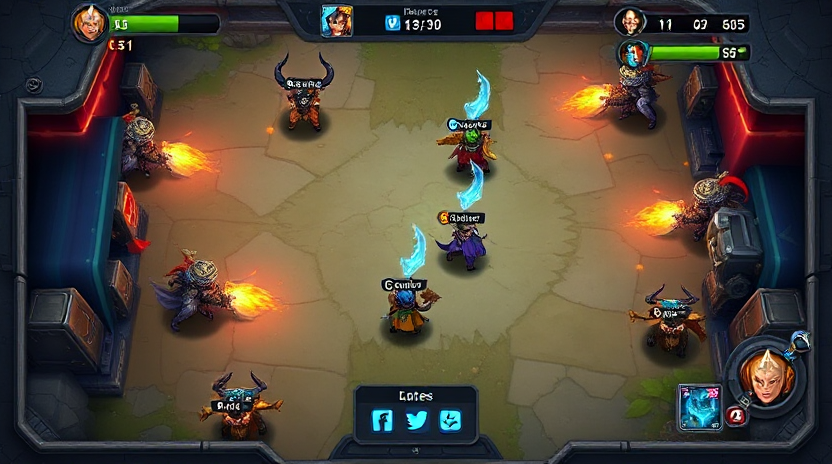

### 핵심 기획 표
| 항목 | 기획 내용 | 개발 필요사항 |
|---|---|---|
| 목표 | 체감이 분명한 전투/UX 개선 | 상태머신, 전투공식, UI 이벤트 연동 구현 |
| 카드 룰 | 코스트/역할/카운터 관계 유지 | 카드 데이터 검증기, 덱 구성 제약 로직 |
| 전투 공식 | 기본 피해량 + 오버타임/서든데스 스케일 | 서버/클라 동일 수식 적용 |
| 승패 연출 | 승리/패배 전환 즉시 인지 | 결과 패널, 애니메이션, 사운드 큐 |
| QA 재미도 | pace/variety/combo/counterplay 점검 | QA 설문 + 로그 기반 스코어 산출 |

### 흐름도 (Markdown Mermaid)
~~~mermaid
flowchart LR
A[레퍼런스 분석] --> B[기획 정리]
B --> C[UI 와이어 설계]
C --> D[카드 룰/전투 공식]
D --> E[구현]
E --> F[리뷰 에이전트]
F --> G{QA 통과?}
G -- 아니오 --> A
G -- 예 --> H[완료]
~~~

### UI 제안 (Markdown)
| UI 구역 | 구성 요소 | 상호작용 |
|---|---|---|
| 상단바 | 타워 HP, 페이즈 타이머 | 실시간 수치 업데이트 |
| 중앙 전장 | 좌/우 레인, 타워, 미니언 | 카드 배치 결과 시각화 |
| 하단 카드핸드 | 4장 핸드, 다음 카드 프리뷰, 마나바 | 선택/취소/레인 선택 |
| 결과 오버레이 | 승리/패배, 재시작, 메뉴 | 게임 종료 후 전환 |

~~~text
+----------------------------------------------------+
| Player HP | Phase Timer | Enemy HP                 |
+---------------------- BATTLE FIELD ----------------+
| Left Lane                | Right Lane               |
| [Deploy Zone]            | [Deploy Zone]            |
+----------------------------------------------------+
| Mana Bar | Card1 Card2 Card3 Card4 | Next Card     |
+----------------------------------------------------+
~~~

### 개발 제안
1. 레퍼런스 이미지 기반으로 맵 가독성 기준선을 먼저 고정한다
2. 카드 룰/전투 공식 수치를 CSV 단일 소스로 관리한다
3. UI 이벤트(선택/취소/승패)를 상태머신과 연결해 회귀를 줄인다
4. 리뷰 반려 시 즉시 레퍼런스 재수집 후 기획 diff를 기록한다

## Page 26

### 페이지 주제
- 로비 및 맵 가독성

### 레퍼런스 체크 이미지

### 핵심 기획 표
| 항목 | 기획 내용 | 개발 필요사항 |
|---|---|---|
| 목표 | 체감이 분명한 전투/UX 개선 | 상태머신, 전투공식, UI 이벤트 연동 구현 |
| 카드 룰 | 코스트/역할/카운터 관계 유지 | 카드 데이터 검증기, 덱 구성 제약 로직 |
| 전투 공식 | 기본 피해량 + 오버타임/서든데스 스케일 | 서버/클라 동일 수식 적용 |
| 승패 연출 | 승리/패배 전환 즉시 인지 | 결과 패널, 애니메이션, 사운드 큐 |
| QA 재미도 | pace/variety/combo/counterplay 점검 | QA 설문 + 로그 기반 스코어 산출 |

### 흐름도 (Markdown Mermaid)
~~~mermaid
flowchart LR
A[레퍼런스 분석] --> B[기획 정리]
B --> C[UI 와이어 설계]
C --> D[카드 룰/전투 공식]
D --> E[구현]
E --> F[리뷰 에이전트]
F --> G{QA 통과?}
G -- 아니오 --> A
G -- 예 --> H[완료]
~~~

### UI 제안 (Markdown)
| UI 구역 | 구성 요소 | 상호작용 |
|---|---|---|
| 상단바 | 타워 HP, 페이즈 타이머 | 실시간 수치 업데이트 |
| 중앙 전장 | 좌/우 레인, 타워, 미니언 | 카드 배치 결과 시각화 |
| 하단 카드핸드 | 4장 핸드, 다음 카드 프리뷰, 마나바 | 선택/취소/레인 선택 |
| 결과 오버레이 | 승리/패배, 재시작, 메뉴 | 게임 종료 후 전환 |

~~~text
+----------------------------------------------------+
| Player HP | Phase Timer | Enemy HP                 |
+---------------------- BATTLE FIELD ----------------+
| Left Lane                | Right Lane               |
| [Deploy Zone]            | [Deploy Zone]            |
+----------------------------------------------------+
| Mana Bar | Card1 Card2 Card3 Card4 | Next Card     |
+----------------------------------------------------+
~~~

### 개발 제안
1. 레퍼런스 이미지 기반으로 맵 가독성 기준선을 먼저 고정한다
2. 카드 룰/전투 공식 수치를 CSV 단일 소스로 관리한다
3. UI 이벤트(선택/취소/승패)를 상태머신과 연결해 회귀를 줄인다
4. 리뷰 반려 시 즉시 레퍼런스 재수집 후 기획 diff를 기록한다

## Page 27

### 페이지 주제
- 전투 루프

### 레퍼런스 체크 이미지

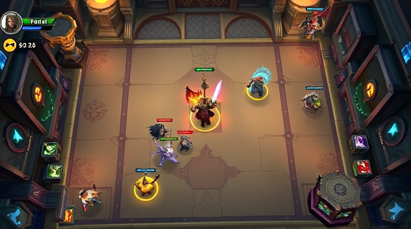

### 핵심 기획 표
| 항목 | 기획 내용 | 개발 필요사항 |
|---|---|---|
| 목표 | 체감이 분명한 전투/UX 개선 | 상태머신, 전투공식, UI 이벤트 연동 구현 |
| 카드 룰 | 코스트/역할/카운터 관계 유지 | 카드 데이터 검증기, 덱 구성 제약 로직 |
| 전투 공식 | 기본 피해량 + 오버타임/서든데스 스케일 | 서버/클라 동일 수식 적용 |
| 승패 연출 | 승리/패배 전환 즉시 인지 | 결과 패널, 애니메이션, 사운드 큐 |
| QA 재미도 | pace/variety/combo/counterplay 점검 | QA 설문 + 로그 기반 스코어 산출 |

### 흐름도 (Markdown Mermaid)
~~~mermaid
flowchart LR
A[레퍼런스 분석] --> B[기획 정리]
B --> C[UI 와이어 설계]
C --> D[카드 룰/전투 공식]
D --> E[구현]
E --> F[리뷰 에이전트]
F --> G{QA 통과?}
G -- 아니오 --> A
G -- 예 --> H[완료]
~~~

### UI 제안 (Markdown)
| UI 구역 | 구성 요소 | 상호작용 |
|---|---|---|
| 상단바 | 타워 HP, 페이즈 타이머 | 실시간 수치 업데이트 |
| 중앙 전장 | 좌/우 레인, 타워, 미니언 | 카드 배치 결과 시각화 |
| 하단 카드핸드 | 4장 핸드, 다음 카드 프리뷰, 마나바 | 선택/취소/레인 선택 |
| 결과 오버레이 | 승리/패배, 재시작, 메뉴 | 게임 종료 후 전환 |

~~~text
+----------------------------------------------------+
| Player HP | Phase Timer | Enemy HP                 |
+---------------------- BATTLE FIELD ----------------+
| Left Lane                | Right Lane               |
| [Deploy Zone]            | [Deploy Zone]            |
+----------------------------------------------------+
| Mana Bar | Card1 Card2 Card3 Card4 | Next Card     |
+----------------------------------------------------+
~~~

### 개발 제안
1. 레퍼런스 이미지 기반으로 맵 가독성 기준선을 먼저 고정한다
2. 카드 룰/전투 공식 수치를 CSV 단일 소스로 관리한다
3. UI 이벤트(선택/취소/승패)를 상태머신과 연결해 회귀를 줄인다
4. 리뷰 반려 시 즉시 레퍼런스 재수집 후 기획 diff를 기록한다

## Page 28

### 페이지 주제
- 승리 및 패배 흐름

### 레퍼런스 체크 이미지

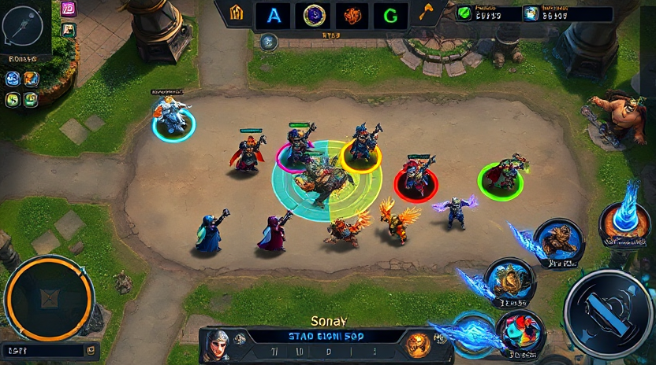

### 핵심 기획 표
| 항목 | 기획 내용 | 개발 필요사항 |
|---|---|---|
| 목표 | 체감이 분명한 전투/UX 개선 | 상태머신, 전투공식, UI 이벤트 연동 구현 |
| 카드 룰 | 코스트/역할/카운터 관계 유지 | 카드 데이터 검증기, 덱 구성 제약 로직 |
| 전투 공식 | 기본 피해량 + 오버타임/서든데스 스케일 | 서버/클라 동일 수식 적용 |
| 승패 연출 | 승리/패배 전환 즉시 인지 | 결과 패널, 애니메이션, 사운드 큐 |
| QA 재미도 | pace/variety/combo/counterplay 점검 | QA 설문 + 로그 기반 스코어 산출 |

### 흐름도 (Markdown Mermaid)
~~~mermaid
flowchart LR
A[레퍼런스 분석] --> B[기획 정리]
B --> C[UI 와이어 설계]
C --> D[카드 룰/전투 공식]
D --> E[구현]
E --> F[리뷰 에이전트]
F --> G{QA 통과?}
G -- 아니오 --> A
G -- 예 --> H[완료]
~~~

### UI 제안 (Markdown)
| UI 구역 | 구성 요소 | 상호작용 |
|---|---|---|
| 상단바 | 타워 HP, 페이즈 타이머 | 실시간 수치 업데이트 |
| 중앙 전장 | 좌/우 레인, 타워, 미니언 | 카드 배치 결과 시각화 |
| 하단 카드핸드 | 4장 핸드, 다음 카드 프리뷰, 마나바 | 선택/취소/레인 선택 |
| 결과 오버레이 | 승리/패배, 재시작, 메뉴 | 게임 종료 후 전환 |

~~~text
+----------------------------------------------------+
| Player HP | Phase Timer | Enemy HP                 |
+---------------------- BATTLE FIELD ----------------+
| Left Lane                | Right Lane               |
| [Deploy Zone]            | [Deploy Zone]            |
+----------------------------------------------------+
| Mana Bar | Card1 Card2 Card3 Card4 | Next Card     |
+----------------------------------------------------+
~~~

### 개발 제안
1. 레퍼런스 이미지 기반으로 맵 가독성 기준선을 먼저 고정한다
2. 카드 룰/전투 공식 수치를 CSV 단일 소스로 관리한다
3. UI 이벤트(선택/취소/승패)를 상태머신과 연결해 회귀를 줄인다
4. 리뷰 반려 시 즉시 레퍼런스 재수집 후 기획 diff를 기록한다

## Page 29

### 페이지 주제
- 애니메이션 연출

### 레퍼런스 체크 이미지

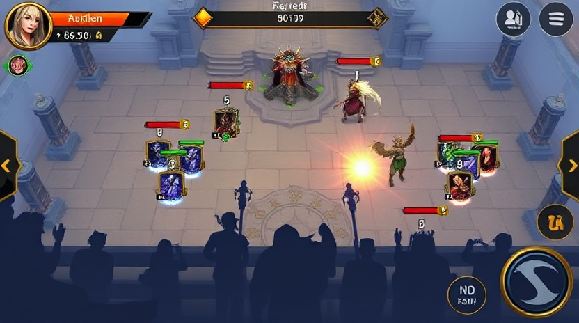

### 핵심 기획 표
| 항목 | 기획 내용 | 개발 필요사항 |
|---|---|---|
| 목표 | 체감이 분명한 전투/UX 개선 | 상태머신, 전투공식, UI 이벤트 연동 구현 |
| 카드 룰 | 코스트/역할/카운터 관계 유지 | 카드 데이터 검증기, 덱 구성 제약 로직 |
| 전투 공식 | 기본 피해량 + 오버타임/서든데스 스케일 | 서버/클라 동일 수식 적용 |
| 승패 연출 | 승리/패배 전환 즉시 인지 | 결과 패널, 애니메이션, 사운드 큐 |
| QA 재미도 | pace/variety/combo/counterplay 점검 | QA 설문 + 로그 기반 스코어 산출 |

### 흐름도 (Markdown Mermaid)
~~~mermaid
flowchart LR
A[레퍼런스 분석] --> B[기획 정리]
B --> C[UI 와이어 설계]
C --> D[카드 룰/전투 공식]
D --> E[구현]
E --> F[리뷰 에이전트]
F --> G{QA 통과?}
G -- 아니오 --> A
G -- 예 --> H[완료]
~~~

### UI 제안 (Markdown)
| UI 구역 | 구성 요소 | 상호작용 |
|---|---|---|
| 상단바 | 타워 HP, 페이즈 타이머 | 실시간 수치 업데이트 |
| 중앙 전장 | 좌/우 레인, 타워, 미니언 | 카드 배치 결과 시각화 |
| 하단 카드핸드 | 4장 핸드, 다음 카드 프리뷰, 마나바 | 선택/취소/레인 선택 |
| 결과 오버레이 | 승리/패배, 재시작, 메뉴 | 게임 종료 후 전환 |

~~~text
+----------------------------------------------------+
| Player HP | Phase Timer | Enemy HP                 |
+---------------------- BATTLE FIELD ----------------+
| Left Lane                | Right Lane               |
| [Deploy Zone]            | [Deploy Zone]            |
+----------------------------------------------------+
| Mana Bar | Card1 Card2 Card3 Card4 | Next Card     |
+----------------------------------------------------+
~~~

### 개발 제안
1. 레퍼런스 이미지 기반으로 맵 가독성 기준선을 먼저 고정한다
2. 카드 룰/전투 공식 수치를 CSV 단일 소스로 관리한다
3. UI 이벤트(선택/취소/승패)를 상태머신과 연결해 회귀를 줄인다
4. 리뷰 반려 시 즉시 레퍼런스 재수집 후 기획 diff를 기록한다

## Page 30

### 페이지 주제
- 카드 덱 구성 규칙

### 레퍼런스 체크 이미지

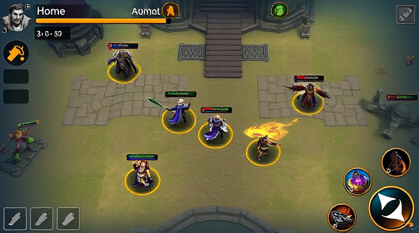

### 핵심 기획 표
| 항목 | 기획 내용 | 개발 필요사항 |
|---|---|---|
| 목표 | 체감이 분명한 전투/UX 개선 | 상태머신, 전투공식, UI 이벤트 연동 구현 |
| 카드 룰 | 코스트/역할/카운터 관계 유지 | 카드 데이터 검증기, 덱 구성 제약 로직 |
| 전투 공식 | 기본 피해량 + 오버타임/서든데스 스케일 | 서버/클라 동일 수식 적용 |
| 승패 연출 | 승리/패배 전환 즉시 인지 | 결과 패널, 애니메이션, 사운드 큐 |
| QA 재미도 | pace/variety/combo/counterplay 점검 | QA 설문 + 로그 기반 스코어 산출 |

### 흐름도 (Markdown Mermaid)
~~~mermaid
flowchart LR
A[레퍼런스 분석] --> B[기획 정리]
B --> C[UI 와이어 설계]
C --> D[카드 룰/전투 공식]
D --> E[구현]
E --> F[리뷰 에이전트]
F --> G{QA 통과?}
G -- 아니오 --> A
G -- 예 --> H[완료]
~~~

### UI 제안 (Markdown)
| UI 구역 | 구성 요소 | 상호작용 |
|---|---|---|
| 상단바 | 타워 HP, 페이즈 타이머 | 실시간 수치 업데이트 |
| 중앙 전장 | 좌/우 레인, 타워, 미니언 | 카드 배치 결과 시각화 |
| 하단 카드핸드 | 4장 핸드, 다음 카드 프리뷰, 마나바 | 선택/취소/레인 선택 |
| 결과 오버레이 | 승리/패배, 재시작, 메뉴 | 게임 종료 후 전환 |

~~~text
+----------------------------------------------------+
| Player HP | Phase Timer | Enemy HP                 |
+---------------------- BATTLE FIELD ----------------+
| Left Lane                | Right Lane               |
| [Deploy Zone]            | [Deploy Zone]            |
+----------------------------------------------------+
| Mana Bar | Card1 Card2 Card3 Card4 | Next Card     |
+----------------------------------------------------+
~~~

### 개발 제안
1. 레퍼런스 이미지 기반으로 맵 가독성 기준선을 먼저 고정한다
2. 카드 룰/전투 공식 수치를 CSV 단일 소스로 관리한다
3. UI 이벤트(선택/취소/승패)를 상태머신과 연결해 회귀를 줄인다
4. 리뷰 반려 시 즉시 레퍼런스 재수집 후 기획 diff를 기록한다

## Page 31

### 페이지 주제
- 카드 룰 시스템

### 레퍼런스 체크 이미지

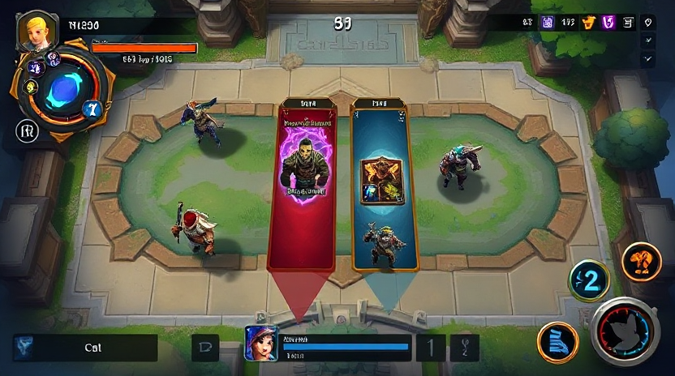

### 핵심 기획 표
| 항목 | 기획 내용 | 개발 필요사항 |
|---|---|---|
| 목표 | 체감이 분명한 전투/UX 개선 | 상태머신, 전투공식, UI 이벤트 연동 구현 |
| 카드 룰 | 코스트/역할/카운터 관계 유지 | 카드 데이터 검증기, 덱 구성 제약 로직 |
| 전투 공식 | 기본 피해량 + 오버타임/서든데스 스케일 | 서버/클라 동일 수식 적용 |
| 승패 연출 | 승리/패배 전환 즉시 인지 | 결과 패널, 애니메이션, 사운드 큐 |
| QA 재미도 | pace/variety/combo/counterplay 점검 | QA 설문 + 로그 기반 스코어 산출 |

### 흐름도 (Markdown Mermaid)
~~~mermaid
flowchart LR
A[레퍼런스 분석] --> B[기획 정리]
B --> C[UI 와이어 설계]
C --> D[카드 룰/전투 공식]
D --> E[구현]
E --> F[리뷰 에이전트]
F --> G{QA 통과?}
G -- 아니오 --> A
G -- 예 --> H[완료]
~~~

### UI 제안 (Markdown)
| UI 구역 | 구성 요소 | 상호작용 |
|---|---|---|
| 상단바 | 타워 HP, 페이즈 타이머 | 실시간 수치 업데이트 |
| 중앙 전장 | 좌/우 레인, 타워, 미니언 | 카드 배치 결과 시각화 |
| 하단 카드핸드 | 4장 핸드, 다음 카드 프리뷰, 마나바 | 선택/취소/레인 선택 |
| 결과 오버레이 | 승리/패배, 재시작, 메뉴 | 게임 종료 후 전환 |

~~~text
+----------------------------------------------------+
| Player HP | Phase Timer | Enemy HP                 |
+---------------------- BATTLE FIELD ----------------+
| Left Lane                | Right Lane               |
| [Deploy Zone]            | [Deploy Zone]            |
+----------------------------------------------------+
| Mana Bar | Card1 Card2 Card3 Card4 | Next Card     |
+----------------------------------------------------+
~~~

### 개발 제안
1. 레퍼런스 이미지 기반으로 맵 가독성 기준선을 먼저 고정한다
2. 카드 룰/전투 공식 수치를 CSV 단일 소스로 관리한다
3. UI 이벤트(선택/취소/승패)를 상태머신과 연결해 회귀를 줄인다
4. 리뷰 반려 시 즉시 레퍼런스 재수집 후 기획 diff를 기록한다

## Page 32

### 페이지 주제
- 전투 공식

### 레퍼런스 체크 이미지

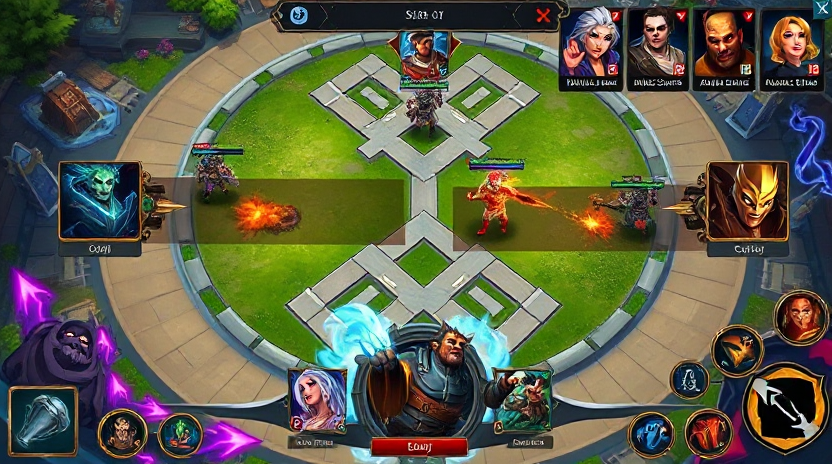

### 핵심 기획 표
| 항목 | 기획 내용 | 개발 필요사항 |
|---|---|---|
| 목표 | 체감이 분명한 전투/UX 개선 | 상태머신, 전투공식, UI 이벤트 연동 구현 |
| 카드 룰 | 코스트/역할/카운터 관계 유지 | 카드 데이터 검증기, 덱 구성 제약 로직 |
| 전투 공식 | 기본 피해량 + 오버타임/서든데스 스케일 | 서버/클라 동일 수식 적용 |
| 승패 연출 | 승리/패배 전환 즉시 인지 | 결과 패널, 애니메이션, 사운드 큐 |
| QA 재미도 | pace/variety/combo/counterplay 점검 | QA 설문 + 로그 기반 스코어 산출 |

### 흐름도 (Markdown Mermaid)
~~~mermaid
flowchart LR
A[레퍼런스 분석] --> B[기획 정리]
B --> C[UI 와이어 설계]
C --> D[카드 룰/전투 공식]
D --> E[구현]
E --> F[리뷰 에이전트]
F --> G{QA 통과?}
G -- 아니오 --> A
G -- 예 --> H[완료]
~~~

### UI 제안 (Markdown)
| UI 구역 | 구성 요소 | 상호작용 |
|---|---|---|
| 상단바 | 타워 HP, 페이즈 타이머 | 실시간 수치 업데이트 |
| 중앙 전장 | 좌/우 레인, 타워, 미니언 | 카드 배치 결과 시각화 |
| 하단 카드핸드 | 4장 핸드, 다음 카드 프리뷰, 마나바 | 선택/취소/레인 선택 |
| 결과 오버레이 | 승리/패배, 재시작, 메뉴 | 게임 종료 후 전환 |

~~~text
+----------------------------------------------------+
| Player HP | Phase Timer | Enemy HP                 |
+---------------------- BATTLE FIELD ----------------+
| Left Lane                | Right Lane               |
| [Deploy Zone]            | [Deploy Zone]            |
+----------------------------------------------------+
| Mana Bar | Card1 Card2 Card3 Card4 | Next Card     |
+----------------------------------------------------+
~~~

### 개발 제안
1. 레퍼런스 이미지 기반으로 맵 가독성 기준선을 먼저 고정한다
2. 카드 룰/전투 공식 수치를 CSV 단일 소스로 관리한다
3. UI 이벤트(선택/취소/승패)를 상태머신과 연결해 회귀를 줄인다
4. 리뷰 반려 시 즉시 레퍼런스 재수집 후 기획 diff를 기록한다

## Page 33

### 페이지 주제
- 카드 인벤토리

### 레퍼런스 체크 이미지

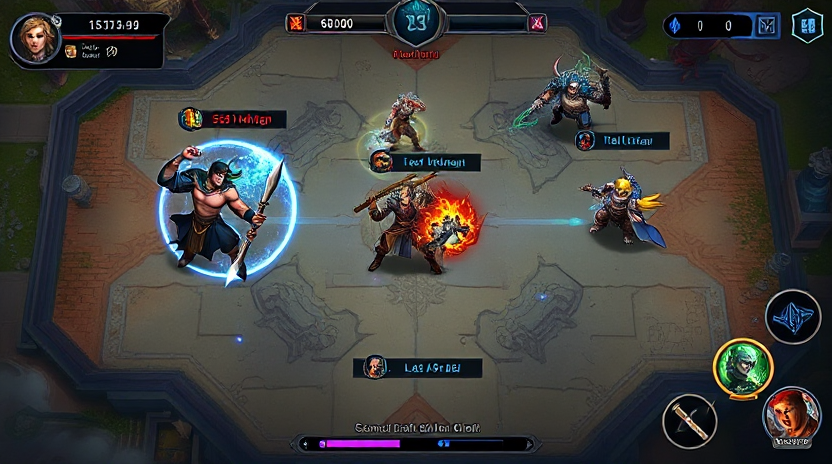

### 핵심 기획 표
| 항목 | 기획 내용 | 개발 필요사항 |
|---|---|---|
| 목표 | 체감이 분명한 전투/UX 개선 | 상태머신, 전투공식, UI 이벤트 연동 구현 |
| 카드 룰 | 코스트/역할/카운터 관계 유지 | 카드 데이터 검증기, 덱 구성 제약 로직 |
| 전투 공식 | 기본 피해량 + 오버타임/서든데스 스케일 | 서버/클라 동일 수식 적용 |
| 승패 연출 | 승리/패배 전환 즉시 인지 | 결과 패널, 애니메이션, 사운드 큐 |
| QA 재미도 | pace/variety/combo/counterplay 점검 | QA 설문 + 로그 기반 스코어 산출 |

### 흐름도 (Markdown Mermaid)
~~~mermaid
flowchart LR
A[레퍼런스 분석] --> B[기획 정리]
B --> C[UI 와이어 설계]
C --> D[카드 룰/전투 공식]
D --> E[구현]
E --> F[리뷰 에이전트]
F --> G{QA 통과?}
G -- 아니오 --> A
G -- 예 --> H[완료]
~~~

### UI 제안 (Markdown)
| UI 구역 | 구성 요소 | 상호작용 |
|---|---|---|
| 상단바 | 타워 HP, 페이즈 타이머 | 실시간 수치 업데이트 |
| 중앙 전장 | 좌/우 레인, 타워, 미니언 | 카드 배치 결과 시각화 |
| 하단 카드핸드 | 4장 핸드, 다음 카드 프리뷰, 마나바 | 선택/취소/레인 선택 |
| 결과 오버레이 | 승리/패배, 재시작, 메뉴 | 게임 종료 후 전환 |

~~~text
+----------------------------------------------------+
| Player HP | Phase Timer | Enemy HP                 |
+---------------------- BATTLE FIELD ----------------+
| Left Lane                | Right Lane               |
| [Deploy Zone]            | [Deploy Zone]            |
+----------------------------------------------------+
| Mana Bar | Card1 Card2 Card3 Card4 | Next Card     |
+----------------------------------------------------+
~~~

### 개발 제안
1. 레퍼런스 이미지 기반으로 맵 가독성 기준선을 먼저 고정한다
2. 카드 룰/전투 공식 수치를 CSV 단일 소스로 관리한다
3. UI 이벤트(선택/취소/승패)를 상태머신과 연결해 회귀를 줄인다
4. 리뷰 반려 시 즉시 레퍼런스 재수집 후 기획 diff를 기록한다

## Page 34

### 페이지 주제
- 캐릭터 설정/설명

### 레퍼런스 체크 이미지

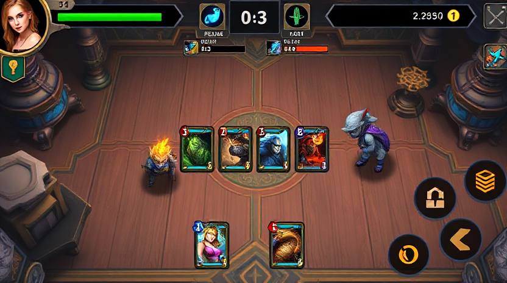

### 핵심 기획 표
| 항목 | 기획 내용 | 개발 필요사항 |
|---|---|---|
| 목표 | 체감이 분명한 전투/UX 개선 | 상태머신, 전투공식, UI 이벤트 연동 구현 |
| 카드 룰 | 코스트/역할/카운터 관계 유지 | 카드 데이터 검증기, 덱 구성 제약 로직 |
| 전투 공식 | 기본 피해량 + 오버타임/서든데스 스케일 | 서버/클라 동일 수식 적용 |
| 승패 연출 | 승리/패배 전환 즉시 인지 | 결과 패널, 애니메이션, 사운드 큐 |
| QA 재미도 | pace/variety/combo/counterplay 점검 | QA 설문 + 로그 기반 스코어 산출 |

### 흐름도 (Markdown Mermaid)
~~~mermaid
flowchart LR
A[레퍼런스 분석] --> B[기획 정리]
B --> C[UI 와이어 설계]
C --> D[카드 룰/전투 공식]
D --> E[구현]
E --> F[리뷰 에이전트]
F --> G{QA 통과?}
G -- 아니오 --> A
G -- 예 --> H[완료]
~~~

### UI 제안 (Markdown)
| UI 구역 | 구성 요소 | 상호작용 |
|---|---|---|
| 상단바 | 타워 HP, 페이즈 타이머 | 실시간 수치 업데이트 |
| 중앙 전장 | 좌/우 레인, 타워, 미니언 | 카드 배치 결과 시각화 |
| 하단 카드핸드 | 4장 핸드, 다음 카드 프리뷰, 마나바 | 선택/취소/레인 선택 |
| 결과 오버레이 | 승리/패배, 재시작, 메뉴 | 게임 종료 후 전환 |

~~~text
+----------------------------------------------------+
| Player HP | Phase Timer | Enemy HP                 |
+---------------------- BATTLE FIELD ----------------+
| Left Lane                | Right Lane               |
| [Deploy Zone]            | [Deploy Zone]            |
+----------------------------------------------------+
| Mana Bar | Card1 Card2 Card3 Card4 | Next Card     |
+----------------------------------------------------+
~~~

### 개발 제안
1. 레퍼런스 이미지 기반으로 맵 가독성 기준선을 먼저 고정한다
2. 카드 룰/전투 공식 수치를 CSV 단일 소스로 관리한다
3. UI 이벤트(선택/취소/승패)를 상태머신과 연결해 회귀를 줄인다
4. 리뷰 반려 시 즉시 레퍼런스 재수집 후 기획 diff를 기록한다

## Page 35

### 페이지 주제
- QA 시나리오

### 레퍼런스 체크 이미지

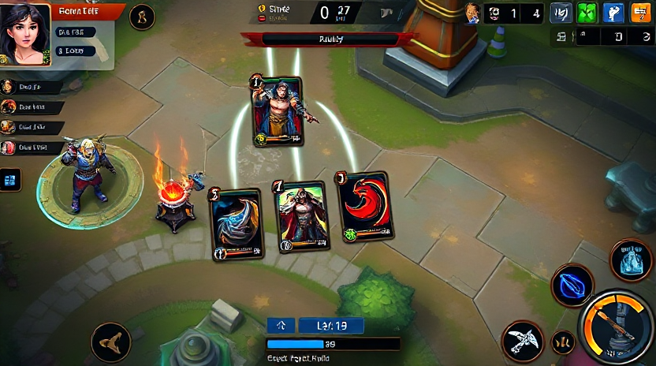

### 핵심 기획 표
| 항목 | 기획 내용 | 개발 필요사항 |
|---|---|---|
| 목표 | 체감이 분명한 전투/UX 개선 | 상태머신, 전투공식, UI 이벤트 연동 구현 |
| 카드 룰 | 코스트/역할/카운터 관계 유지 | 카드 데이터 검증기, 덱 구성 제약 로직 |
| 전투 공식 | 기본 피해량 + 오버타임/서든데스 스케일 | 서버/클라 동일 수식 적용 |
| 승패 연출 | 승리/패배 전환 즉시 인지 | 결과 패널, 애니메이션, 사운드 큐 |
| QA 재미도 | pace/variety/combo/counterplay 점검 | QA 설문 + 로그 기반 스코어 산출 |

### 흐름도 (Markdown Mermaid)
~~~mermaid
flowchart LR
A[레퍼런스 분석] --> B[기획 정리]
B --> C[UI 와이어 설계]
C --> D[카드 룰/전투 공식]
D --> E[구현]
E --> F[리뷰 에이전트]
F --> G{QA 통과?}
G -- 아니오 --> A
G -- 예 --> H[완료]
~~~

### UI 제안 (Markdown)
| UI 구역 | 구성 요소 | 상호작용 |
|---|---|---|
| 상단바 | 타워 HP, 페이즈 타이머 | 실시간 수치 업데이트 |
| 중앙 전장 | 좌/우 레인, 타워, 미니언 | 카드 배치 결과 시각화 |
| 하단 카드핸드 | 4장 핸드, 다음 카드 프리뷰, 마나바 | 선택/취소/레인 선택 |
| 결과 오버레이 | 승리/패배, 재시작, 메뉴 | 게임 종료 후 전환 |

~~~text
+----------------------------------------------------+
| Player HP | Phase Timer | Enemy HP                 |
+---------------------- BATTLE FIELD ----------------+
| Left Lane                | Right Lane               |
| [Deploy Zone]            | [Deploy Zone]            |
+----------------------------------------------------+
| Mana Bar | Card1 Card2 Card3 Card4 | Next Card     |
+----------------------------------------------------+
~~~

### 개발 제안
1. 레퍼런스 이미지 기반으로 맵 가독성 기준선을 먼저 고정한다
2. 카드 룰/전투 공식 수치를 CSV 단일 소스로 관리한다
3. UI 이벤트(선택/취소/승패)를 상태머신과 연결해 회귀를 줄인다
4. 리뷰 반려 시 즉시 레퍼런스 재수집 후 기획 diff를 기록한다

## Page 36

### 페이지 주제
- 라이브 밸런싱

### 레퍼런스 체크 이미지

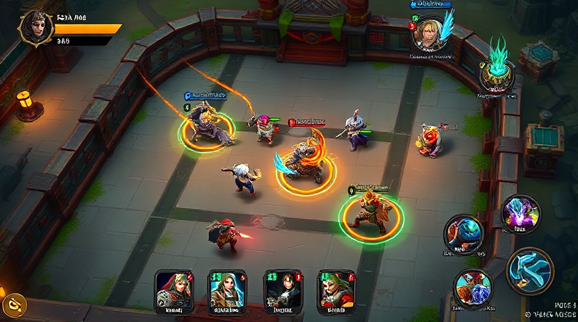

### 핵심 기획 표
| 항목 | 기획 내용 | 개발 필요사항 |
|---|---|---|
| 목표 | 체감이 분명한 전투/UX 개선 | 상태머신, 전투공식, UI 이벤트 연동 구현 |
| 카드 룰 | 코스트/역할/카운터 관계 유지 | 카드 데이터 검증기, 덱 구성 제약 로직 |
| 전투 공식 | 기본 피해량 + 오버타임/서든데스 스케일 | 서버/클라 동일 수식 적용 |
| 승패 연출 | 승리/패배 전환 즉시 인지 | 결과 패널, 애니메이션, 사운드 큐 |
| QA 재미도 | pace/variety/combo/counterplay 점검 | QA 설문 + 로그 기반 스코어 산출 |

### 흐름도 (Markdown Mermaid)
~~~mermaid
flowchart LR
A[레퍼런스 분석] --> B[기획 정리]
B --> C[UI 와이어 설계]
C --> D[카드 룰/전투 공식]
D --> E[구현]
E --> F[리뷰 에이전트]
F --> G{QA 통과?}
G -- 아니오 --> A
G -- 예 --> H[완료]
~~~

### UI 제안 (Markdown)
| UI 구역 | 구성 요소 | 상호작용 |
|---|---|---|
| 상단바 | 타워 HP, 페이즈 타이머 | 실시간 수치 업데이트 |
| 중앙 전장 | 좌/우 레인, 타워, 미니언 | 카드 배치 결과 시각화 |
| 하단 카드핸드 | 4장 핸드, 다음 카드 프리뷰, 마나바 | 선택/취소/레인 선택 |
| 결과 오버레이 | 승리/패배, 재시작, 메뉴 | 게임 종료 후 전환 |

~~~text
+----------------------------------------------------+
| Player HP | Phase Timer | Enemy HP                 |
+---------------------- BATTLE FIELD ----------------+
| Left Lane                | Right Lane               |
| [Deploy Zone]            | [Deploy Zone]            |
+----------------------------------------------------+
| Mana Bar | Card1 Card2 Card3 Card4 | Next Card     |
+----------------------------------------------------+
~~~

### 개발 제안
1. 레퍼런스 이미지 기반으로 맵 가독성 기준선을 먼저 고정한다
2. 카드 룰/전투 공식 수치를 CSV 단일 소스로 관리한다
3. UI 이벤트(선택/취소/승패)를 상태머신과 연결해 회귀를 줄인다
4. 리뷰 반려 시 즉시 레퍼런스 재수집 후 기획 diff를 기록한다

## Page 37

### 페이지 주제
- 메인 페이지 UX (ComfyUI 우선)

### 레퍼런스 체크 이미지

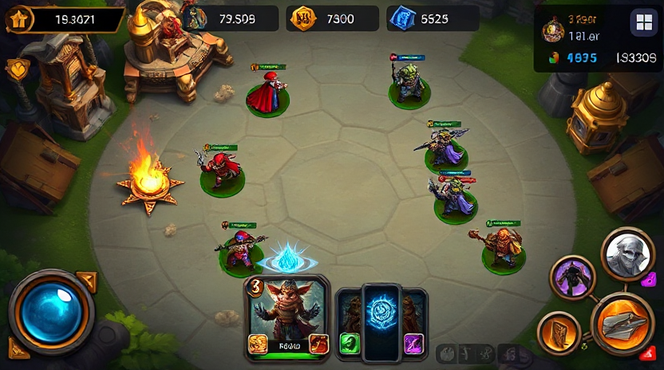

### 핵심 기획 표
| 항목 | 기획 내용 | 개발 필요사항 |
|---|---|---|
| 목표 | 체감이 분명한 전투/UX 개선 | 상태머신, 전투공식, UI 이벤트 연동 구현 |
| 카드 룰 | 코스트/역할/카운터 관계 유지 | 카드 데이터 검증기, 덱 구성 제약 로직 |
| 전투 공식 | 기본 피해량 + 오버타임/서든데스 스케일 | 서버/클라 동일 수식 적용 |
| 승패 연출 | 승리/패배 전환 즉시 인지 | 결과 패널, 애니메이션, 사운드 큐 |
| QA 재미도 | pace/variety/combo/counterplay 점검 | QA 설문 + 로그 기반 스코어 산출 |

### 흐름도 (Markdown Mermaid)
~~~mermaid
flowchart LR
A[레퍼런스 분석] --> B[기획 정리]
B --> C[UI 와이어 설계]
C --> D[카드 룰/전투 공식]
D --> E[구현]
E --> F[리뷰 에이전트]
F --> G{QA 통과?}
G -- 아니오 --> A
G -- 예 --> H[완료]
~~~

### UI 제안 (Markdown)
| UI 구역 | 구성 요소 | 상호작용 |
|---|---|---|
| 상단바 | 타워 HP, 페이즈 타이머 | 실시간 수치 업데이트 |
| 중앙 전장 | 좌/우 레인, 타워, 미니언 | 카드 배치 결과 시각화 |
| 하단 카드핸드 | 4장 핸드, 다음 카드 프리뷰, 마나바 | 선택/취소/레인 선택 |
| 결과 오버레이 | 승리/패배, 재시작, 메뉴 | 게임 종료 후 전환 |

~~~text
+----------------------------------------------------+
| Player HP | Phase Timer | Enemy HP                 |
+---------------------- BATTLE FIELD ----------------+
| Left Lane                | Right Lane               |
| [Deploy Zone]            | [Deploy Zone]            |
+----------------------------------------------------+
| Mana Bar | Card1 Card2 Card3 Card4 | Next Card     |
+----------------------------------------------------+
~~~

### 개발 제안
1. 레퍼런스 이미지 기반으로 맵 가독성 기준선을 먼저 고정한다
2. 카드 룰/전투 공식 수치를 CSV 단일 소스로 관리한다
3. UI 이벤트(선택/취소/승패)를 상태머신과 연결해 회귀를 줄인다
4. 리뷰 반려 시 즉시 레퍼런스 재수집 후 기획 diff를 기록한다

## Page 38

### 페이지 주제
- 로비 및 맵 가독성

### 레퍼런스 체크 이미지

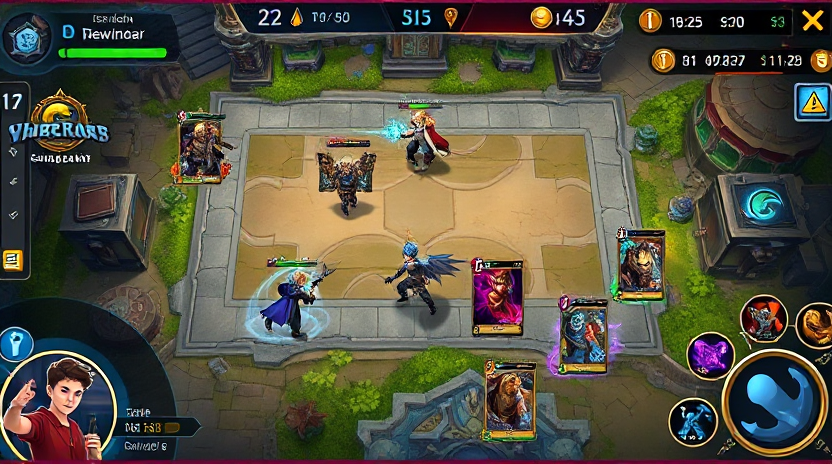

### 핵심 기획 표
| 항목 | 기획 내용 | 개발 필요사항 |
|---|---|---|
| 목표 | 체감이 분명한 전투/UX 개선 | 상태머신, 전투공식, UI 이벤트 연동 구현 |
| 카드 룰 | 코스트/역할/카운터 관계 유지 | 카드 데이터 검증기, 덱 구성 제약 로직 |
| 전투 공식 | 기본 피해량 + 오버타임/서든데스 스케일 | 서버/클라 동일 수식 적용 |
| 승패 연출 | 승리/패배 전환 즉시 인지 | 결과 패널, 애니메이션, 사운드 큐 |
| QA 재미도 | pace/variety/combo/counterplay 점검 | QA 설문 + 로그 기반 스코어 산출 |

### 흐름도 (Markdown Mermaid)
~~~mermaid
flowchart LR
A[레퍼런스 분석] --> B[기획 정리]
B --> C[UI 와이어 설계]
C --> D[카드 룰/전투 공식]
D --> E[구현]
E --> F[리뷰 에이전트]
F --> G{QA 통과?}
G -- 아니오 --> A
G -- 예 --> H[완료]
~~~

### UI 제안 (Markdown)
| UI 구역 | 구성 요소 | 상호작용 |
|---|---|---|
| 상단바 | 타워 HP, 페이즈 타이머 | 실시간 수치 업데이트 |
| 중앙 전장 | 좌/우 레인, 타워, 미니언 | 카드 배치 결과 시각화 |
| 하단 카드핸드 | 4장 핸드, 다음 카드 프리뷰, 마나바 | 선택/취소/레인 선택 |
| 결과 오버레이 | 승리/패배, 재시작, 메뉴 | 게임 종료 후 전환 |

~~~text
+----------------------------------------------------+
| Player HP | Phase Timer | Enemy HP                 |
+---------------------- BATTLE FIELD ----------------+
| Left Lane                | Right Lane               |
| [Deploy Zone]            | [Deploy Zone]            |
+----------------------------------------------------+
| Mana Bar | Card1 Card2 Card3 Card4 | Next Card     |
+----------------------------------------------------+
~~~

### 개발 제안
1. 레퍼런스 이미지 기반으로 맵 가독성 기준선을 먼저 고정한다
2. 카드 룰/전투 공식 수치를 CSV 단일 소스로 관리한다
3. UI 이벤트(선택/취소/승패)를 상태머신과 연결해 회귀를 줄인다
4. 리뷰 반려 시 즉시 레퍼런스 재수집 후 기획 diff를 기록한다

## Page 39

### 페이지 주제
- 전투 루프

### 레퍼런스 체크 이미지

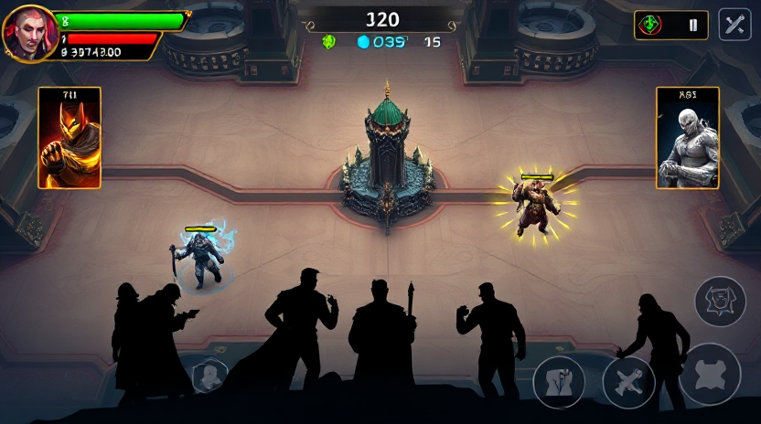

### 핵심 기획 표
| 항목 | 기획 내용 | 개발 필요사항 |
|---|---|---|
| 목표 | 체감이 분명한 전투/UX 개선 | 상태머신, 전투공식, UI 이벤트 연동 구현 |
| 카드 룰 | 코스트/역할/카운터 관계 유지 | 카드 데이터 검증기, 덱 구성 제약 로직 |
| 전투 공식 | 기본 피해량 + 오버타임/서든데스 스케일 | 서버/클라 동일 수식 적용 |
| 승패 연출 | 승리/패배 전환 즉시 인지 | 결과 패널, 애니메이션, 사운드 큐 |
| QA 재미도 | pace/variety/combo/counterplay 점검 | QA 설문 + 로그 기반 스코어 산출 |

### 흐름도 (Markdown Mermaid)
~~~mermaid
flowchart LR
A[레퍼런스 분석] --> B[기획 정리]
B --> C[UI 와이어 설계]
C --> D[카드 룰/전투 공식]
D --> E[구현]
E --> F[리뷰 에이전트]
F --> G{QA 통과?}
G -- 아니오 --> A
G -- 예 --> H[완료]
~~~

### UI 제안 (Markdown)
| UI 구역 | 구성 요소 | 상호작용 |
|---|---|---|
| 상단바 | 타워 HP, 페이즈 타이머 | 실시간 수치 업데이트 |
| 중앙 전장 | 좌/우 레인, 타워, 미니언 | 카드 배치 결과 시각화 |
| 하단 카드핸드 | 4장 핸드, 다음 카드 프리뷰, 마나바 | 선택/취소/레인 선택 |
| 결과 오버레이 | 승리/패배, 재시작, 메뉴 | 게임 종료 후 전환 |

~~~text
+----------------------------------------------------+
| Player HP | Phase Timer | Enemy HP                 |
+---------------------- BATTLE FIELD ----------------+
| Left Lane                | Right Lane               |
| [Deploy Zone]            | [Deploy Zone]            |
+----------------------------------------------------+
| Mana Bar | Card1 Card2 Card3 Card4 | Next Card     |
+----------------------------------------------------+
~~~

### 개발 제안
1. 레퍼런스 이미지 기반으로 맵 가독성 기준선을 먼저 고정한다
2. 카드 룰/전투 공식 수치를 CSV 단일 소스로 관리한다
3. UI 이벤트(선택/취소/승패)를 상태머신과 연결해 회귀를 줄인다
4. 리뷰 반려 시 즉시 레퍼런스 재수집 후 기획 diff를 기록한다

## Page 40

### 페이지 주제
- 승리 및 패배 흐름

### 레퍼런스 체크 이미지

### 핵심 기획 표
| 항목 | 기획 내용 | 개발 필요사항 |
|---|---|---|
| 목표 | 체감이 분명한 전투/UX 개선 | 상태머신, 전투공식, UI 이벤트 연동 구현 |
| 카드 룰 | 코스트/역할/카운터 관계 유지 | 카드 데이터 검증기, 덱 구성 제약 로직 |
| 전투 공식 | 기본 피해량 + 오버타임/서든데스 스케일 | 서버/클라 동일 수식 적용 |
| 승패 연출 | 승리/패배 전환 즉시 인지 | 결과 패널, 애니메이션, 사운드 큐 |
| QA 재미도 | pace/variety/combo/counterplay 점검 | QA 설문 + 로그 기반 스코어 산출 |

### 흐름도 (Markdown Mermaid)
~~~mermaid
flowchart LR
A[레퍼런스 분석] --> B[기획 정리]
B --> C[UI 와이어 설계]
C --> D[카드 룰/전투 공식]
D --> E[구현]
E --> F[리뷰 에이전트]
F --> G{QA 통과?}
G -- 아니오 --> A
G -- 예 --> H[완료]
~~~

### UI 제안 (Markdown)
| UI 구역 | 구성 요소 | 상호작용 |
|---|---|---|
| 상단바 | 타워 HP, 페이즈 타이머 | 실시간 수치 업데이트 |
| 중앙 전장 | 좌/우 레인, 타워, 미니언 | 카드 배치 결과 시각화 |
| 하단 카드핸드 | 4장 핸드, 다음 카드 프리뷰, 마나바 | 선택/취소/레인 선택 |
| 결과 오버레이 | 승리/패배, 재시작, 메뉴 | 게임 종료 후 전환 |

~~~text
+----------------------------------------------------+
| Player HP | Phase Timer | Enemy HP                 |
+---------------------- BATTLE FIELD ----------------+
| Left Lane                | Right Lane               |
| [Deploy Zone]            | [Deploy Zone]            |
+----------------------------------------------------+
| Mana Bar | Card1 Card2 Card3 Card4 | Next Card     |
+----------------------------------------------------+
~~~

### 개발 제안
1. 레퍼런스 이미지 기반으로 맵 가독성 기준선을 먼저 고정한다
2. 카드 룰/전투 공식 수치를 CSV 단일 소스로 관리한다
3. UI 이벤트(선택/취소/승패)를 상태머신과 연결해 회귀를 줄인다
4. 리뷰 반려 시 즉시 레퍼런스 재수집 후 기획 diff를 기록한다

## Page 41

### 페이지 주제
- 애니메이션 연출

### 레퍼런스 체크 이미지

### 핵심 기획 표
| 항목 | 기획 내용 | 개발 필요사항 |
|---|---|---|
| 목표 | 체감이 분명한 전투/UX 개선 | 상태머신, 전투공식, UI 이벤트 연동 구현 |
| 카드 룰 | 코스트/역할/카운터 관계 유지 | 카드 데이터 검증기, 덱 구성 제약 로직 |
| 전투 공식 | 기본 피해량 + 오버타임/서든데스 스케일 | 서버/클라 동일 수식 적용 |
| 승패 연출 | 승리/패배 전환 즉시 인지 | 결과 패널, 애니메이션, 사운드 큐 |
| QA 재미도 | pace/variety/combo/counterplay 점검 | QA 설문 + 로그 기반 스코어 산출 |

### 흐름도 (Markdown Mermaid)
~~~mermaid
flowchart LR
A[레퍼런스 분석] --> B[기획 정리]
B --> C[UI 와이어 설계]
C --> D[카드 룰/전투 공식]
D --> E[구현]
E --> F[리뷰 에이전트]
F --> G{QA 통과?}
G -- 아니오 --> A
G -- 예 --> H[완료]
~~~

### UI 제안 (Markdown)
| UI 구역 | 구성 요소 | 상호작용 |
|---|---|---|
| 상단바 | 타워 HP, 페이즈 타이머 | 실시간 수치 업데이트 |
| 중앙 전장 | 좌/우 레인, 타워, 미니언 | 카드 배치 결과 시각화 |
| 하단 카드핸드 | 4장 핸드, 다음 카드 프리뷰, 마나바 | 선택/취소/레인 선택 |
| 결과 오버레이 | 승리/패배, 재시작, 메뉴 | 게임 종료 후 전환 |

~~~text
+----------------------------------------------------+
| Player HP | Phase Timer | Enemy HP                 |
+---------------------- BATTLE FIELD ----------------+
| Left Lane                | Right Lane               |
| [Deploy Zone]            | [Deploy Zone]            |
+----------------------------------------------------+
| Mana Bar | Card1 Card2 Card3 Card4 | Next Card     |
+----------------------------------------------------+
~~~

### 개발 제안
1. 레퍼런스 이미지 기반으로 맵 가독성 기준선을 먼저 고정한다
2. 카드 룰/전투 공식 수치를 CSV 단일 소스로 관리한다
3. UI 이벤트(선택/취소/승패)를 상태머신과 연결해 회귀를 줄인다
4. 리뷰 반려 시 즉시 레퍼런스 재수집 후 기획 diff를 기록한다

## Page 42

### 페이지 주제
- 카드 덱 구성 규칙

### 레퍼런스 체크 이미지

### 핵심 기획 표
| 항목 | 기획 내용 | 개발 필요사항 |
|---|---|---|
| 목표 | 체감이 분명한 전투/UX 개선 | 상태머신, 전투공식, UI 이벤트 연동 구현 |
| 카드 룰 | 코스트/역할/카운터 관계 유지 | 카드 데이터 검증기, 덱 구성 제약 로직 |
| 전투 공식 | 기본 피해량 + 오버타임/서든데스 스케일 | 서버/클라 동일 수식 적용 |
| 승패 연출 | 승리/패배 전환 즉시 인지 | 결과 패널, 애니메이션, 사운드 큐 |
| QA 재미도 | pace/variety/combo/counterplay 점검 | QA 설문 + 로그 기반 스코어 산출 |

### 흐름도 (Markdown Mermaid)
~~~mermaid
flowchart LR
A[레퍼런스 분석] --> B[기획 정리]
B --> C[UI 와이어 설계]
C --> D[카드 룰/전투 공식]
D --> E[구현]
E --> F[리뷰 에이전트]
F --> G{QA 통과?}
G -- 아니오 --> A
G -- 예 --> H[완료]
~~~

### UI 제안 (Markdown)
| UI 구역 | 구성 요소 | 상호작용 |
|---|---|---|
| 상단바 | 타워 HP, 페이즈 타이머 | 실시간 수치 업데이트 |
| 중앙 전장 | 좌/우 레인, 타워, 미니언 | 카드 배치 결과 시각화 |
| 하단 카드핸드 | 4장 핸드, 다음 카드 프리뷰, 마나바 | 선택/취소/레인 선택 |
| 결과 오버레이 | 승리/패배, 재시작, 메뉴 | 게임 종료 후 전환 |

~~~text
+----------------------------------------------------+
| Player HP | Phase Timer | Enemy HP                 |
+---------------------- BATTLE FIELD ----------------+
| Left Lane                | Right Lane               |
| [Deploy Zone]            | [Deploy Zone]            |
+----------------------------------------------------+
| Mana Bar | Card1 Card2 Card3 Card4 | Next Card     |
+----------------------------------------------------+
~~~

### 개발 제안
1. 레퍼런스 이미지 기반으로 맵 가독성 기준선을 먼저 고정한다
2. 카드 룰/전투 공식 수치를 CSV 단일 소스로 관리한다
3. UI 이벤트(선택/취소/승패)를 상태머신과 연결해 회귀를 줄인다
4. 리뷰 반려 시 즉시 레퍼런스 재수집 후 기획 diff를 기록한다

## Page 43

### 페이지 주제
- 카드 룰 시스템

### 레퍼런스 체크 이미지

### 핵심 기획 표
| 항목 | 기획 내용 | 개발 필요사항 |
|---|---|---|
| 목표 | 체감이 분명한 전투/UX 개선 | 상태머신, 전투공식, UI 이벤트 연동 구현 |
| 카드 룰 | 코스트/역할/카운터 관계 유지 | 카드 데이터 검증기, 덱 구성 제약 로직 |
| 전투 공식 | 기본 피해량 + 오버타임/서든데스 스케일 | 서버/클라 동일 수식 적용 |
| 승패 연출 | 승리/패배 전환 즉시 인지 | 결과 패널, 애니메이션, 사운드 큐 |
| QA 재미도 | pace/variety/combo/counterplay 점검 | QA 설문 + 로그 기반 스코어 산출 |

### 흐름도 (Markdown Mermaid)
~~~mermaid
flowchart LR
A[레퍼런스 분석] --> B[기획 정리]
B --> C[UI 와이어 설계]
C --> D[카드 룰/전투 공식]
D --> E[구현]
E --> F[리뷰 에이전트]
F --> G{QA 통과?}
G -- 아니오 --> A
G -- 예 --> H[완료]
~~~

### UI 제안 (Markdown)
| UI 구역 | 구성 요소 | 상호작용 |
|---|---|---|
| 상단바 | 타워 HP, 페이즈 타이머 | 실시간 수치 업데이트 |
| 중앙 전장 | 좌/우 레인, 타워, 미니언 | 카드 배치 결과 시각화 |
| 하단 카드핸드 | 4장 핸드, 다음 카드 프리뷰, 마나바 | 선택/취소/레인 선택 |
| 결과 오버레이 | 승리/패배, 재시작, 메뉴 | 게임 종료 후 전환 |

~~~text
+----------------------------------------------------+
| Player HP | Phase Timer | Enemy HP                 |
+---------------------- BATTLE FIELD ----------------+
| Left Lane                | Right Lane               |
| [Deploy Zone]            | [Deploy Zone]            |
+----------------------------------------------------+
| Mana Bar | Card1 Card2 Card3 Card4 | Next Card     |
+----------------------------------------------------+
~~~

### 개발 제안
1. 레퍼런스 이미지 기반으로 맵 가독성 기준선을 먼저 고정한다
2. 카드 룰/전투 공식 수치를 CSV 단일 소스로 관리한다
3. UI 이벤트(선택/취소/승패)를 상태머신과 연결해 회귀를 줄인다
4. 리뷰 반려 시 즉시 레퍼런스 재수집 후 기획 diff를 기록한다

## Page 44

### 페이지 주제
- 전투 공식

### 레퍼런스 체크 이미지

### 핵심 기획 표
| 항목 | 기획 내용 | 개발 필요사항 |
|---|---|---|
| 목표 | 체감이 분명한 전투/UX 개선 | 상태머신, 전투공식, UI 이벤트 연동 구현 |
| 카드 룰 | 코스트/역할/카운터 관계 유지 | 카드 데이터 검증기, 덱 구성 제약 로직 |
| 전투 공식 | 기본 피해량 + 오버타임/서든데스 스케일 | 서버/클라 동일 수식 적용 |
| 승패 연출 | 승리/패배 전환 즉시 인지 | 결과 패널, 애니메이션, 사운드 큐 |
| QA 재미도 | pace/variety/combo/counterplay 점검 | QA 설문 + 로그 기반 스코어 산출 |

### 흐름도 (Markdown Mermaid)
~~~mermaid
flowchart LR
A[레퍼런스 분석] --> B[기획 정리]
B --> C[UI 와이어 설계]
C --> D[카드 룰/전투 공식]
D --> E[구현]
E --> F[리뷰 에이전트]
F --> G{QA 통과?}
G -- 아니오 --> A
G -- 예 --> H[완료]
~~~

### UI 제안 (Markdown)
| UI 구역 | 구성 요소 | 상호작용 |
|---|---|---|
| 상단바 | 타워 HP, 페이즈 타이머 | 실시간 수치 업데이트 |
| 중앙 전장 | 좌/우 레인, 타워, 미니언 | 카드 배치 결과 시각화 |
| 하단 카드핸드 | 4장 핸드, 다음 카드 프리뷰, 마나바 | 선택/취소/레인 선택 |
| 결과 오버레이 | 승리/패배, 재시작, 메뉴 | 게임 종료 후 전환 |

~~~text
+----------------------------------------------------+
| Player HP | Phase Timer | Enemy HP                 |
+---------------------- BATTLE FIELD ----------------+
| Left Lane                | Right Lane               |
| [Deploy Zone]            | [Deploy Zone]            |
+----------------------------------------------------+
| Mana Bar | Card1 Card2 Card3 Card4 | Next Card     |
+----------------------------------------------------+
~~~

### 개발 제안
1. 레퍼런스 이미지 기반으로 맵 가독성 기준선을 먼저 고정한다
2. 카드 룰/전투 공식 수치를 CSV 단일 소스로 관리한다
3. UI 이벤트(선택/취소/승패)를 상태머신과 연결해 회귀를 줄인다
4. 리뷰 반려 시 즉시 레퍼런스 재수집 후 기획 diff를 기록한다

## Page 45

### 페이지 주제
- 카드 인벤토리

### 레퍼런스 체크 이미지

### 핵심 기획 표
| 항목 | 기획 내용 | 개발 필요사항 |
|---|---|---|
| 목표 | 체감이 분명한 전투/UX 개선 | 상태머신, 전투공식, UI 이벤트 연동 구현 |
| 카드 룰 | 코스트/역할/카운터 관계 유지 | 카드 데이터 검증기, 덱 구성 제약 로직 |
| 전투 공식 | 기본 피해량 + 오버타임/서든데스 스케일 | 서버/클라 동일 수식 적용 |
| 승패 연출 | 승리/패배 전환 즉시 인지 | 결과 패널, 애니메이션, 사운드 큐 |
| QA 재미도 | pace/variety/combo/counterplay 점검 | QA 설문 + 로그 기반 스코어 산출 |

### 흐름도 (Markdown Mermaid)
~~~mermaid
flowchart LR
A[레퍼런스 분석] --> B[기획 정리]
B --> C[UI 와이어 설계]
C --> D[카드 룰/전투 공식]
D --> E[구현]
E --> F[리뷰 에이전트]
F --> G{QA 통과?}
G -- 아니오 --> A
G -- 예 --> H[완료]
~~~

### UI 제안 (Markdown)
| UI 구역 | 구성 요소 | 상호작용 |
|---|---|---|
| 상단바 | 타워 HP, 페이즈 타이머 | 실시간 수치 업데이트 |
| 중앙 전장 | 좌/우 레인, 타워, 미니언 | 카드 배치 결과 시각화 |
| 하단 카드핸드 | 4장 핸드, 다음 카드 프리뷰, 마나바 | 선택/취소/레인 선택 |
| 결과 오버레이 | 승리/패배, 재시작, 메뉴 | 게임 종료 후 전환 |

~~~text
+----------------------------------------------------+
| Player HP | Phase Timer | Enemy HP                 |
+---------------------- BATTLE FIELD ----------------+
| Left Lane                | Right Lane               |
| [Deploy Zone]            | [Deploy Zone]            |
+----------------------------------------------------+
| Mana Bar | Card1 Card2 Card3 Card4 | Next Card     |
+----------------------------------------------------+
~~~

### 개발 제안
1. 레퍼런스 이미지 기반으로 맵 가독성 기준선을 먼저 고정한다
2. 카드 룰/전투 공식 수치를 CSV 단일 소스로 관리한다
3. UI 이벤트(선택/취소/승패)를 상태머신과 연결해 회귀를 줄인다
4. 리뷰 반려 시 즉시 레퍼런스 재수집 후 기획 diff를 기록한다

## Page 46

### 페이지 주제
- 캐릭터 설정/설명

### 레퍼런스 체크 이미지

### 핵심 기획 표
| 항목 | 기획 내용 | 개발 필요사항 |
|---|---|---|
| 목표 | 체감이 분명한 전투/UX 개선 | 상태머신, 전투공식, UI 이벤트 연동 구현 |
| 카드 룰 | 코스트/역할/카운터 관계 유지 | 카드 데이터 검증기, 덱 구성 제약 로직 |
| 전투 공식 | 기본 피해량 + 오버타임/서든데스 스케일 | 서버/클라 동일 수식 적용 |
| 승패 연출 | 승리/패배 전환 즉시 인지 | 결과 패널, 애니메이션, 사운드 큐 |
| QA 재미도 | pace/variety/combo/counterplay 점검 | QA 설문 + 로그 기반 스코어 산출 |

### 흐름도 (Markdown Mermaid)
~~~mermaid
flowchart LR
A[레퍼런스 분석] --> B[기획 정리]
B --> C[UI 와이어 설계]
C --> D[카드 룰/전투 공식]
D --> E[구현]
E --> F[리뷰 에이전트]
F --> G{QA 통과?}
G -- 아니오 --> A
G -- 예 --> H[완료]
~~~

### UI 제안 (Markdown)
| UI 구역 | 구성 요소 | 상호작용 |
|---|---|---|
| 상단바 | 타워 HP, 페이즈 타이머 | 실시간 수치 업데이트 |
| 중앙 전장 | 좌/우 레인, 타워, 미니언 | 카드 배치 결과 시각화 |
| 하단 카드핸드 | 4장 핸드, 다음 카드 프리뷰, 마나바 | 선택/취소/레인 선택 |
| 결과 오버레이 | 승리/패배, 재시작, 메뉴 | 게임 종료 후 전환 |

~~~text
+----------------------------------------------------+
| Player HP | Phase Timer | Enemy HP                 |
+---------------------- BATTLE FIELD ----------------+
| Left Lane                | Right Lane               |
| [Deploy Zone]            | [Deploy Zone]            |
+----------------------------------------------------+
| Mana Bar | Card1 Card2 Card3 Card4 | Next Card     |
+----------------------------------------------------+
~~~

### 개발 제안
1. 레퍼런스 이미지 기반으로 맵 가독성 기준선을 먼저 고정한다
2. 카드 룰/전투 공식 수치를 CSV 단일 소스로 관리한다
3. UI 이벤트(선택/취소/승패)를 상태머신과 연결해 회귀를 줄인다
4. 리뷰 반려 시 즉시 레퍼런스 재수집 후 기획 diff를 기록한다

## Page 47

### 페이지 주제
- QA 시나리오

### 레퍼런스 체크 이미지

### 핵심 기획 표
| 항목 | 기획 내용 | 개발 필요사항 |
|---|---|---|
| 목표 | 체감이 분명한 전투/UX 개선 | 상태머신, 전투공식, UI 이벤트 연동 구현 |
| 카드 룰 | 코스트/역할/카운터 관계 유지 | 카드 데이터 검증기, 덱 구성 제약 로직 |
| 전투 공식 | 기본 피해량 + 오버타임/서든데스 스케일 | 서버/클라 동일 수식 적용 |
| 승패 연출 | 승리/패배 전환 즉시 인지 | 결과 패널, 애니메이션, 사운드 큐 |
| QA 재미도 | pace/variety/combo/counterplay 점검 | QA 설문 + 로그 기반 스코어 산출 |

### 흐름도 (Markdown Mermaid)
~~~mermaid
flowchart LR
A[레퍼런스 분석] --> B[기획 정리]
B --> C[UI 와이어 설계]
C --> D[카드 룰/전투 공식]
D --> E[구현]
E --> F[리뷰 에이전트]
F --> G{QA 통과?}
G -- 아니오 --> A
G -- 예 --> H[완료]
~~~

### UI 제안 (Markdown)
| UI 구역 | 구성 요소 | 상호작용 |
|---|---|---|
| 상단바 | 타워 HP, 페이즈 타이머 | 실시간 수치 업데이트 |
| 중앙 전장 | 좌/우 레인, 타워, 미니언 | 카드 배치 결과 시각화 |
| 하단 카드핸드 | 4장 핸드, 다음 카드 프리뷰, 마나바 | 선택/취소/레인 선택 |
| 결과 오버레이 | 승리/패배, 재시작, 메뉴 | 게임 종료 후 전환 |

~~~text
+----------------------------------------------------+
| Player HP | Phase Timer | Enemy HP                 |
+---------------------- BATTLE FIELD ----------------+
| Left Lane                | Right Lane               |
| [Deploy Zone]            | [Deploy Zone]            |
+----------------------------------------------------+
| Mana Bar | Card1 Card2 Card3 Card4 | Next Card     |
+----------------------------------------------------+
~~~

### 개발 제안
1. 레퍼런스 이미지 기반으로 맵 가독성 기준선을 먼저 고정한다
2. 카드 룰/전투 공식 수치를 CSV 단일 소스로 관리한다
3. UI 이벤트(선택/취소/승패)를 상태머신과 연결해 회귀를 줄인다
4. 리뷰 반려 시 즉시 레퍼런스 재수집 후 기획 diff를 기록한다

## Page 48

### 페이지 주제
- 라이브 밸런싱

### 레퍼런스 체크 이미지

### 핵심 기획 표
| 항목 | 기획 내용 | 개발 필요사항 |
|---|---|---|
| 목표 | 체감이 분명한 전투/UX 개선 | 상태머신, 전투공식, UI 이벤트 연동 구현 |
| 카드 룰 | 코스트/역할/카운터 관계 유지 | 카드 데이터 검증기, 덱 구성 제약 로직 |
| 전투 공식 | 기본 피해량 + 오버타임/서든데스 스케일 | 서버/클라 동일 수식 적용 |
| 승패 연출 | 승리/패배 전환 즉시 인지 | 결과 패널, 애니메이션, 사운드 큐 |
| QA 재미도 | pace/variety/combo/counterplay 점검 | QA 설문 + 로그 기반 스코어 산출 |

### 흐름도 (Markdown Mermaid)
~~~mermaid
flowchart LR
A[레퍼런스 분석] --> B[기획 정리]
B --> C[UI 와이어 설계]
C --> D[카드 룰/전투 공식]
D --> E[구현]
E --> F[리뷰 에이전트]
F --> G{QA 통과?}
G -- 아니오 --> A
G -- 예 --> H[완료]
~~~

### UI 제안 (Markdown)
| UI 구역 | 구성 요소 | 상호작용 |
|---|---|---|
| 상단바 | 타워 HP, 페이즈 타이머 | 실시간 수치 업데이트 |
| 중앙 전장 | 좌/우 레인, 타워, 미니언 | 카드 배치 결과 시각화 |
| 하단 카드핸드 | 4장 핸드, 다음 카드 프리뷰, 마나바 | 선택/취소/레인 선택 |
| 결과 오버레이 | 승리/패배, 재시작, 메뉴 | 게임 종료 후 전환 |

~~~text
+----------------------------------------------------+
| Player HP | Phase Timer | Enemy HP                 |
+---------------------- BATTLE FIELD ----------------+
| Left Lane                | Right Lane               |
| [Deploy Zone]            | [Deploy Zone]            |
+----------------------------------------------------+
| Mana Bar | Card1 Card2 Card3 Card4 | Next Card     |
+----------------------------------------------------+
~~~

### 개발 제안
1. 레퍼런스 이미지 기반으로 맵 가독성 기준선을 먼저 고정한다
2. 카드 룰/전투 공식 수치를 CSV 단일 소스로 관리한다
3. UI 이벤트(선택/취소/승패)를 상태머신과 연결해 회귀를 줄인다
4. 리뷰 반려 시 즉시 레퍼런스 재수집 후 기획 diff를 기록한다

## Page 49

### 페이지 주제
- 메인 페이지 UX (ComfyUI 우선)

### 레퍼런스 체크 이미지

### 핵심 기획 표
| 항목 | 기획 내용 | 개발 필요사항 |
|---|---|---|
| 목표 | 체감이 분명한 전투/UX 개선 | 상태머신, 전투공식, UI 이벤트 연동 구현 |
| 카드 룰 | 코스트/역할/카운터 관계 유지 | 카드 데이터 검증기, 덱 구성 제약 로직 |
| 전투 공식 | 기본 피해량 + 오버타임/서든데스 스케일 | 서버/클라 동일 수식 적용 |
| 승패 연출 | 승리/패배 전환 즉시 인지 | 결과 패널, 애니메이션, 사운드 큐 |
| QA 재미도 | pace/variety/combo/counterplay 점검 | QA 설문 + 로그 기반 스코어 산출 |

### 흐름도 (Markdown Mermaid)
~~~mermaid
flowchart LR
A[레퍼런스 분석] --> B[기획 정리]
B --> C[UI 와이어 설계]
C --> D[카드 룰/전투 공식]
D --> E[구현]
E --> F[리뷰 에이전트]
F --> G{QA 통과?}
G -- 아니오 --> A
G -- 예 --> H[완료]
~~~

### UI 제안 (Markdown)
| UI 구역 | 구성 요소 | 상호작용 |
|---|---|---|
| 상단바 | 타워 HP, 페이즈 타이머 | 실시간 수치 업데이트 |
| 중앙 전장 | 좌/우 레인, 타워, 미니언 | 카드 배치 결과 시각화 |
| 하단 카드핸드 | 4장 핸드, 다음 카드 프리뷰, 마나바 | 선택/취소/레인 선택 |
| 결과 오버레이 | 승리/패배, 재시작, 메뉴 | 게임 종료 후 전환 |

~~~text
+----------------------------------------------------+
| Player HP | Phase Timer | Enemy HP                 |
+---------------------- BATTLE FIELD ----------------+
| Left Lane                | Right Lane               |
| [Deploy Zone]            | [Deploy Zone]            |
+----------------------------------------------------+
| Mana Bar | Card1 Card2 Card3 Card4 | Next Card     |
+----------------------------------------------------+
~~~

### 개발 제안
1. 레퍼런스 이미지 기반으로 맵 가독성 기준선을 먼저 고정한다
2. 카드 룰/전투 공식 수치를 CSV 단일 소스로 관리한다
3. UI 이벤트(선택/취소/승패)를 상태머신과 연결해 회귀를 줄인다
4. 리뷰 반려 시 즉시 레퍼런스 재수집 후 기획 diff를 기록한다

## Page 50

### 페이지 주제
- 로비 및 맵 가독성

### 레퍼런스 체크 이미지

### 핵심 기획 표
| 항목 | 기획 내용 | 개발 필요사항 |
|---|---|---|
| 목표 | 체감이 분명한 전투/UX 개선 | 상태머신, 전투공식, UI 이벤트 연동 구현 |
| 카드 룰 | 코스트/역할/카운터 관계 유지 | 카드 데이터 검증기, 덱 구성 제약 로직 |
| 전투 공식 | 기본 피해량 + 오버타임/서든데스 스케일 | 서버/클라 동일 수식 적용 |
| 승패 연출 | 승리/패배 전환 즉시 인지 | 결과 패널, 애니메이션, 사운드 큐 |
| QA 재미도 | pace/variety/combo/counterplay 점검 | QA 설문 + 로그 기반 스코어 산출 |

### 흐름도 (Markdown Mermaid)
~~~mermaid
flowchart LR
A[레퍼런스 분석] --> B[기획 정리]
B --> C[UI 와이어 설계]
C --> D[카드 룰/전투 공식]
D --> E[구현]
E --> F[리뷰 에이전트]
F --> G{QA 통과?}
G -- 아니오 --> A
G -- 예 --> H[완료]
~~~

### UI 제안 (Markdown)
| UI 구역 | 구성 요소 | 상호작용 |
|---|---|---|
| 상단바 | 타워 HP, 페이즈 타이머 | 실시간 수치 업데이트 |
| 중앙 전장 | 좌/우 레인, 타워, 미니언 | 카드 배치 결과 시각화 |
| 하단 카드핸드 | 4장 핸드, 다음 카드 프리뷰, 마나바 | 선택/취소/레인 선택 |
| 결과 오버레이 | 승리/패배, 재시작, 메뉴 | 게임 종료 후 전환 |

~~~text
+----------------------------------------------------+
| Player HP | Phase Timer | Enemy HP                 |
+---------------------- BATTLE FIELD ----------------+
| Left Lane                | Right Lane               |
| [Deploy Zone]            | [Deploy Zone]            |
+----------------------------------------------------+
| Mana Bar | Card1 Card2 Card3 Card4 | Next Card     |
+----------------------------------------------------+
~~~

### 개발 제안
1. 레퍼런스 이미지 기반으로 맵 가독성 기준선을 먼저 고정한다
2. 카드 룰/전투 공식 수치를 CSV 단일 소스로 관리한다
3. UI 이벤트(선택/취소/승패)를 상태머신과 연결해 회귀를 줄인다
4. 리뷰 반려 시 즉시 레퍼런스 재수집 후 기획 diff를 기록한다

## Page 51

### 페이지 주제
- 전투 루프

### 레퍼런스 체크 이미지

### 핵심 기획 표
| 항목 | 기획 내용 | 개발 필요사항 |
|---|---|---|
| 목표 | 체감이 분명한 전투/UX 개선 | 상태머신, 전투공식, UI 이벤트 연동 구현 |
| 카드 룰 | 코스트/역할/카운터 관계 유지 | 카드 데이터 검증기, 덱 구성 제약 로직 |
| 전투 공식 | 기본 피해량 + 오버타임/서든데스 스케일 | 서버/클라 동일 수식 적용 |
| 승패 연출 | 승리/패배 전환 즉시 인지 | 결과 패널, 애니메이션, 사운드 큐 |
| QA 재미도 | pace/variety/combo/counterplay 점검 | QA 설문 + 로그 기반 스코어 산출 |

### 흐름도 (Markdown Mermaid)
~~~mermaid
flowchart LR
A[레퍼런스 분석] --> B[기획 정리]
B --> C[UI 와이어 설계]
C --> D[카드 룰/전투 공식]
D --> E[구현]
E --> F[리뷰 에이전트]
F --> G{QA 통과?}
G -- 아니오 --> A
G -- 예 --> H[완료]
~~~

### UI 제안 (Markdown)
| UI 구역 | 구성 요소 | 상호작용 |
|---|---|---|
| 상단바 | 타워 HP, 페이즈 타이머 | 실시간 수치 업데이트 |
| 중앙 전장 | 좌/우 레인, 타워, 미니언 | 카드 배치 결과 시각화 |
| 하단 카드핸드 | 4장 핸드, 다음 카드 프리뷰, 마나바 | 선택/취소/레인 선택 |
| 결과 오버레이 | 승리/패배, 재시작, 메뉴 | 게임 종료 후 전환 |

~~~text
+----------------------------------------------------+
| Player HP | Phase Timer | Enemy HP                 |
+---------------------- BATTLE FIELD ----------------+
| Left Lane                | Right Lane               |
| [Deploy Zone]            | [Deploy Zone]            |
+----------------------------------------------------+
| Mana Bar | Card1 Card2 Card3 Card4 | Next Card     |
+----------------------------------------------------+
~~~

### 개발 제안
1. 레퍼런스 이미지 기반으로 맵 가독성 기준선을 먼저 고정한다
2. 카드 룰/전투 공식 수치를 CSV 단일 소스로 관리한다
3. UI 이벤트(선택/취소/승패)를 상태머신과 연결해 회귀를 줄인다
4. 리뷰 반려 시 즉시 레퍼런스 재수집 후 기획 diff를 기록한다

## Page 52

### 페이지 주제
- 승리 및 패배 흐름

### 레퍼런스 체크 이미지

### 핵심 기획 표
| 항목 | 기획 내용 | 개발 필요사항 |
|---|---|---|
| 목표 | 체감이 분명한 전투/UX 개선 | 상태머신, 전투공식, UI 이벤트 연동 구현 |
| 카드 룰 | 코스트/역할/카운터 관계 유지 | 카드 데이터 검증기, 덱 구성 제약 로직 |
| 전투 공식 | 기본 피해량 + 오버타임/서든데스 스케일 | 서버/클라 동일 수식 적용 |
| 승패 연출 | 승리/패배 전환 즉시 인지 | 결과 패널, 애니메이션, 사운드 큐 |
| QA 재미도 | pace/variety/combo/counterplay 점검 | QA 설문 + 로그 기반 스코어 산출 |

### 흐름도 (Markdown Mermaid)
~~~mermaid
flowchart LR
A[레퍼런스 분석] --> B[기획 정리]
B --> C[UI 와이어 설계]
C --> D[카드 룰/전투 공식]
D --> E[구현]
E --> F[리뷰 에이전트]
F --> G{QA 통과?}
G -- 아니오 --> A
G -- 예 --> H[완료]
~~~

### UI 제안 (Markdown)
| UI 구역 | 구성 요소 | 상호작용 |
|---|---|---|
| 상단바 | 타워 HP, 페이즈 타이머 | 실시간 수치 업데이트 |
| 중앙 전장 | 좌/우 레인, 타워, 미니언 | 카드 배치 결과 시각화 |
| 하단 카드핸드 | 4장 핸드, 다음 카드 프리뷰, 마나바 | 선택/취소/레인 선택 |
| 결과 오버레이 | 승리/패배, 재시작, 메뉴 | 게임 종료 후 전환 |

~~~text
+----------------------------------------------------+
| Player HP | Phase Timer | Enemy HP                 |
+---------------------- BATTLE FIELD ----------------+
| Left Lane                | Right Lane               |
| [Deploy Zone]            | [Deploy Zone]            |
+----------------------------------------------------+
| Mana Bar | Card1 Card2 Card3 Card4 | Next Card     |
+----------------------------------------------------+
~~~

### 개발 제안
1. 레퍼런스 이미지 기반으로 맵 가독성 기준선을 먼저 고정한다
2. 카드 룰/전투 공식 수치를 CSV 단일 소스로 관리한다
3. UI 이벤트(선택/취소/승패)를 상태머신과 연결해 회귀를 줄인다
4. 리뷰 반려 시 즉시 레퍼런스 재수집 후 기획 diff를 기록한다

## Page 53

### 페이지 주제
- 애니메이션 연출

### 레퍼런스 체크 이미지

### 핵심 기획 표
| 항목 | 기획 내용 | 개발 필요사항 |
|---|---|---|
| 목표 | 체감이 분명한 전투/UX 개선 | 상태머신, 전투공식, UI 이벤트 연동 구현 |
| 카드 룰 | 코스트/역할/카운터 관계 유지 | 카드 데이터 검증기, 덱 구성 제약 로직 |
| 전투 공식 | 기본 피해량 + 오버타임/서든데스 스케일 | 서버/클라 동일 수식 적용 |
| 승패 연출 | 승리/패배 전환 즉시 인지 | 결과 패널, 애니메이션, 사운드 큐 |
| QA 재미도 | pace/variety/combo/counterplay 점검 | QA 설문 + 로그 기반 스코어 산출 |

### 흐름도 (Markdown Mermaid)
~~~mermaid
flowchart LR
A[레퍼런스 분석] --> B[기획 정리]
B --> C[UI 와이어 설계]
C --> D[카드 룰/전투 공식]
D --> E[구현]
E --> F[리뷰 에이전트]
F --> G{QA 통과?}
G -- 아니오 --> A
G -- 예 --> H[완료]
~~~

### UI 제안 (Markdown)
| UI 구역 | 구성 요소 | 상호작용 |
|---|---|---|
| 상단바 | 타워 HP, 페이즈 타이머 | 실시간 수치 업데이트 |
| 중앙 전장 | 좌/우 레인, 타워, 미니언 | 카드 배치 결과 시각화 |
| 하단 카드핸드 | 4장 핸드, 다음 카드 프리뷰, 마나바 | 선택/취소/레인 선택 |
| 결과 오버레이 | 승리/패배, 재시작, 메뉴 | 게임 종료 후 전환 |

~~~text
+----------------------------------------------------+
| Player HP | Phase Timer | Enemy HP                 |
+---------------------- BATTLE FIELD ----------------+
| Left Lane                | Right Lane               |
| [Deploy Zone]            | [Deploy Zone]            |
+----------------------------------------------------+
| Mana Bar | Card1 Card2 Card3 Card4 | Next Card     |
+----------------------------------------------------+
~~~

### 개발 제안
1. 레퍼런스 이미지 기반으로 맵 가독성 기준선을 먼저 고정한다
2. 카드 룰/전투 공식 수치를 CSV 단일 소스로 관리한다
3. UI 이벤트(선택/취소/승패)를 상태머신과 연결해 회귀를 줄인다
4. 리뷰 반려 시 즉시 레퍼런스 재수집 후 기획 diff를 기록한다

## Page 54

### 페이지 주제
- 카드 덱 구성 규칙

### 레퍼런스 체크 이미지

### 핵심 기획 표
| 항목 | 기획 내용 | 개발 필요사항 |
|---|---|---|
| 목표 | 체감이 분명한 전투/UX 개선 | 상태머신, 전투공식, UI 이벤트 연동 구현 |
| 카드 룰 | 코스트/역할/카운터 관계 유지 | 카드 데이터 검증기, 덱 구성 제약 로직 |
| 전투 공식 | 기본 피해량 + 오버타임/서든데스 스케일 | 서버/클라 동일 수식 적용 |
| 승패 연출 | 승리/패배 전환 즉시 인지 | 결과 패널, 애니메이션, 사운드 큐 |
| QA 재미도 | pace/variety/combo/counterplay 점검 | QA 설문 + 로그 기반 스코어 산출 |

### 흐름도 (Markdown Mermaid)
~~~mermaid
flowchart LR
A[레퍼런스 분석] --> B[기획 정리]
B --> C[UI 와이어 설계]
C --> D[카드 룰/전투 공식]
D --> E[구현]
E --> F[리뷰 에이전트]
F --> G{QA 통과?}
G -- 아니오 --> A
G -- 예 --> H[완료]
~~~

### UI 제안 (Markdown)
| UI 구역 | 구성 요소 | 상호작용 |
|---|---|---|
| 상단바 | 타워 HP, 페이즈 타이머 | 실시간 수치 업데이트 |
| 중앙 전장 | 좌/우 레인, 타워, 미니언 | 카드 배치 결과 시각화 |
| 하단 카드핸드 | 4장 핸드, 다음 카드 프리뷰, 마나바 | 선택/취소/레인 선택 |
| 결과 오버레이 | 승리/패배, 재시작, 메뉴 | 게임 종료 후 전환 |

~~~text
+----------------------------------------------------+
| Player HP | Phase Timer | Enemy HP                 |
+---------------------- BATTLE FIELD ----------------+
| Left Lane                | Right Lane               |
| [Deploy Zone]            | [Deploy Zone]            |
+----------------------------------------------------+
| Mana Bar | Card1 Card2 Card3 Card4 | Next Card     |
+----------------------------------------------------+
~~~

### 개발 제안
1. 레퍼런스 이미지 기반으로 맵 가독성 기준선을 먼저 고정한다
2. 카드 룰/전투 공식 수치를 CSV 단일 소스로 관리한다
3. UI 이벤트(선택/취소/승패)를 상태머신과 연결해 회귀를 줄인다
4. 리뷰 반려 시 즉시 레퍼런스 재수집 후 기획 diff를 기록한다

## Page 55

### 페이지 주제
- 카드 룰 시스템

### 레퍼런스 체크 이미지

### 핵심 기획 표
| 항목 | 기획 내용 | 개발 필요사항 |
|---|---|---|
| 목표 | 체감이 분명한 전투/UX 개선 | 상태머신, 전투공식, UI 이벤트 연동 구현 |
| 카드 룰 | 코스트/역할/카운터 관계 유지 | 카드 데이터 검증기, 덱 구성 제약 로직 |
| 전투 공식 | 기본 피해량 + 오버타임/서든데스 스케일 | 서버/클라 동일 수식 적용 |
| 승패 연출 | 승리/패배 전환 즉시 인지 | 결과 패널, 애니메이션, 사운드 큐 |
| QA 재미도 | pace/variety/combo/counterplay 점검 | QA 설문 + 로그 기반 스코어 산출 |

### 흐름도 (Markdown Mermaid)
~~~mermaid
flowchart LR
A[레퍼런스 분석] --> B[기획 정리]
B --> C[UI 와이어 설계]
C --> D[카드 룰/전투 공식]
D --> E[구현]
E --> F[리뷰 에이전트]
F --> G{QA 통과?}
G -- 아니오 --> A
G -- 예 --> H[완료]
~~~

### UI 제안 (Markdown)
| UI 구역 | 구성 요소 | 상호작용 |
|---|---|---|
| 상단바 | 타워 HP, 페이즈 타이머 | 실시간 수치 업데이트 |
| 중앙 전장 | 좌/우 레인, 타워, 미니언 | 카드 배치 결과 시각화 |
| 하단 카드핸드 | 4장 핸드, 다음 카드 프리뷰, 마나바 | 선택/취소/레인 선택 |
| 결과 오버레이 | 승리/패배, 재시작, 메뉴 | 게임 종료 후 전환 |

~~~text
+----------------------------------------------------+
| Player HP | Phase Timer | Enemy HP                 |
+---------------------- BATTLE FIELD ----------------+
| Left Lane                | Right Lane               |
| [Deploy Zone]            | [Deploy Zone]            |
+----------------------------------------------------+
| Mana Bar | Card1 Card2 Card3 Card4 | Next Card     |
+----------------------------------------------------+
~~~

### 개발 제안
1. 레퍼런스 이미지 기반으로 맵 가독성 기준선을 먼저 고정한다
2. 카드 룰/전투 공식 수치를 CSV 단일 소스로 관리한다
3. UI 이벤트(선택/취소/승패)를 상태머신과 연결해 회귀를 줄인다
4. 리뷰 반려 시 즉시 레퍼런스 재수집 후 기획 diff를 기록한다

## Page 56

### 페이지 주제
- 전투 공식

### 레퍼런스 체크 이미지

### 핵심 기획 표
| 항목 | 기획 내용 | 개발 필요사항 |
|---|---|---|
| 목표 | 체감이 분명한 전투/UX 개선 | 상태머신, 전투공식, UI 이벤트 연동 구현 |
| 카드 룰 | 코스트/역할/카운터 관계 유지 | 카드 데이터 검증기, 덱 구성 제약 로직 |
| 전투 공식 | 기본 피해량 + 오버타임/서든데스 스케일 | 서버/클라 동일 수식 적용 |
| 승패 연출 | 승리/패배 전환 즉시 인지 | 결과 패널, 애니메이션, 사운드 큐 |
| QA 재미도 | pace/variety/combo/counterplay 점검 | QA 설문 + 로그 기반 스코어 산출 |

### 흐름도 (Markdown Mermaid)
~~~mermaid
flowchart LR
A[레퍼런스 분석] --> B[기획 정리]
B --> C[UI 와이어 설계]
C --> D[카드 룰/전투 공식]
D --> E[구현]
E --> F[리뷰 에이전트]
F --> G{QA 통과?}
G -- 아니오 --> A
G -- 예 --> H[완료]
~~~

### UI 제안 (Markdown)
| UI 구역 | 구성 요소 | 상호작용 |
|---|---|---|
| 상단바 | 타워 HP, 페이즈 타이머 | 실시간 수치 업데이트 |
| 중앙 전장 | 좌/우 레인, 타워, 미니언 | 카드 배치 결과 시각화 |
| 하단 카드핸드 | 4장 핸드, 다음 카드 프리뷰, 마나바 | 선택/취소/레인 선택 |
| 결과 오버레이 | 승리/패배, 재시작, 메뉴 | 게임 종료 후 전환 |

~~~text
+----------------------------------------------------+
| Player HP | Phase Timer | Enemy HP                 |
+---------------------- BATTLE FIELD ----------------+
| Left Lane                | Right Lane               |
| [Deploy Zone]            | [Deploy Zone]            |
+----------------------------------------------------+
| Mana Bar | Card1 Card2 Card3 Card4 | Next Card     |
+----------------------------------------------------+
~~~

### 개발 제안
1. 레퍼런스 이미지 기반으로 맵 가독성 기준선을 먼저 고정한다
2. 카드 룰/전투 공식 수치를 CSV 단일 소스로 관리한다
3. UI 이벤트(선택/취소/승패)를 상태머신과 연결해 회귀를 줄인다
4. 리뷰 반려 시 즉시 레퍼런스 재수집 후 기획 diff를 기록한다

## Page 57

### 페이지 주제
- 카드 인벤토리

### 레퍼런스 체크 이미지

### 핵심 기획 표
| 항목 | 기획 내용 | 개발 필요사항 |
|---|---|---|
| 목표 | 체감이 분명한 전투/UX 개선 | 상태머신, 전투공식, UI 이벤트 연동 구현 |
| 카드 룰 | 코스트/역할/카운터 관계 유지 | 카드 데이터 검증기, 덱 구성 제약 로직 |
| 전투 공식 | 기본 피해량 + 오버타임/서든데스 스케일 | 서버/클라 동일 수식 적용 |
| 승패 연출 | 승리/패배 전환 즉시 인지 | 결과 패널, 애니메이션, 사운드 큐 |
| QA 재미도 | pace/variety/combo/counterplay 점검 | QA 설문 + 로그 기반 스코어 산출 |

### 흐름도 (Markdown Mermaid)
~~~mermaid
flowchart LR
A[레퍼런스 분석] --> B[기획 정리]
B --> C[UI 와이어 설계]
C --> D[카드 룰/전투 공식]
D --> E[구현]
E --> F[리뷰 에이전트]
F --> G{QA 통과?}
G -- 아니오 --> A
G -- 예 --> H[완료]
~~~

### UI 제안 (Markdown)
| UI 구역 | 구성 요소 | 상호작용 |
|---|---|---|
| 상단바 | 타워 HP, 페이즈 타이머 | 실시간 수치 업데이트 |
| 중앙 전장 | 좌/우 레인, 타워, 미니언 | 카드 배치 결과 시각화 |
| 하단 카드핸드 | 4장 핸드, 다음 카드 프리뷰, 마나바 | 선택/취소/레인 선택 |
| 결과 오버레이 | 승리/패배, 재시작, 메뉴 | 게임 종료 후 전환 |

~~~text
+----------------------------------------------------+
| Player HP | Phase Timer | Enemy HP                 |
+---------------------- BATTLE FIELD ----------------+
| Left Lane                | Right Lane               |
| [Deploy Zone]            | [Deploy Zone]            |
+----------------------------------------------------+
| Mana Bar | Card1 Card2 Card3 Card4 | Next Card     |
+----------------------------------------------------+
~~~

### 개발 제안
1. 레퍼런스 이미지 기반으로 맵 가독성 기준선을 먼저 고정한다
2. 카드 룰/전투 공식 수치를 CSV 단일 소스로 관리한다
3. UI 이벤트(선택/취소/승패)를 상태머신과 연결해 회귀를 줄인다
4. 리뷰 반려 시 즉시 레퍼런스 재수집 후 기획 diff를 기록한다

## Page 58

### 페이지 주제
- 캐릭터 설정/설명

### 레퍼런스 체크 이미지

### 핵심 기획 표
| 항목 | 기획 내용 | 개발 필요사항 |
|---|---|---|
| 목표 | 체감이 분명한 전투/UX 개선 | 상태머신, 전투공식, UI 이벤트 연동 구현 |
| 카드 룰 | 코스트/역할/카운터 관계 유지 | 카드 데이터 검증기, 덱 구성 제약 로직 |
| 전투 공식 | 기본 피해량 + 오버타임/서든데스 스케일 | 서버/클라 동일 수식 적용 |
| 승패 연출 | 승리/패배 전환 즉시 인지 | 결과 패널, 애니메이션, 사운드 큐 |
| QA 재미도 | pace/variety/combo/counterplay 점검 | QA 설문 + 로그 기반 스코어 산출 |

### 흐름도 (Markdown Mermaid)
~~~mermaid
flowchart LR
A[레퍼런스 분석] --> B[기획 정리]
B --> C[UI 와이어 설계]
C --> D[카드 룰/전투 공식]
D --> E[구현]
E --> F[리뷰 에이전트]
F --> G{QA 통과?}
G -- 아니오 --> A
G -- 예 --> H[완료]
~~~

### UI 제안 (Markdown)
| UI 구역 | 구성 요소 | 상호작용 |
|---|---|---|
| 상단바 | 타워 HP, 페이즈 타이머 | 실시간 수치 업데이트 |
| 중앙 전장 | 좌/우 레인, 타워, 미니언 | 카드 배치 결과 시각화 |
| 하단 카드핸드 | 4장 핸드, 다음 카드 프리뷰, 마나바 | 선택/취소/레인 선택 |
| 결과 오버레이 | 승리/패배, 재시작, 메뉴 | 게임 종료 후 전환 |

~~~text
+----------------------------------------------------+
| Player HP | Phase Timer | Enemy HP                 |
+---------------------- BATTLE FIELD ----------------+
| Left Lane                | Right Lane               |
| [Deploy Zone]            | [Deploy Zone]            |
+----------------------------------------------------+
| Mana Bar | Card1 Card2 Card3 Card4 | Next Card     |
+----------------------------------------------------+
~~~

### 개발 제안
1. 레퍼런스 이미지 기반으로 맵 가독성 기준선을 먼저 고정한다
2. 카드 룰/전투 공식 수치를 CSV 단일 소스로 관리한다
3. UI 이벤트(선택/취소/승패)를 상태머신과 연결해 회귀를 줄인다
4. 리뷰 반려 시 즉시 레퍼런스 재수집 후 기획 diff를 기록한다

## Page 59

### 페이지 주제
- QA 시나리오

### 레퍼런스 체크 이미지

### 핵심 기획 표
| 항목 | 기획 내용 | 개발 필요사항 |
|---|---|---|
| 목표 | 체감이 분명한 전투/UX 개선 | 상태머신, 전투공식, UI 이벤트 연동 구현 |
| 카드 룰 | 코스트/역할/카운터 관계 유지 | 카드 데이터 검증기, 덱 구성 제약 로직 |
| 전투 공식 | 기본 피해량 + 오버타임/서든데스 스케일 | 서버/클라 동일 수식 적용 |
| 승패 연출 | 승리/패배 전환 즉시 인지 | 결과 패널, 애니메이션, 사운드 큐 |
| QA 재미도 | pace/variety/combo/counterplay 점검 | QA 설문 + 로그 기반 스코어 산출 |

### 흐름도 (Markdown Mermaid)
~~~mermaid
flowchart LR
A[레퍼런스 분석] --> B[기획 정리]
B --> C[UI 와이어 설계]
C --> D[카드 룰/전투 공식]
D --> E[구현]
E --> F[리뷰 에이전트]
F --> G{QA 통과?}
G -- 아니오 --> A
G -- 예 --> H[완료]
~~~

### UI 제안 (Markdown)
| UI 구역 | 구성 요소 | 상호작용 |
|---|---|---|
| 상단바 | 타워 HP, 페이즈 타이머 | 실시간 수치 업데이트 |
| 중앙 전장 | 좌/우 레인, 타워, 미니언 | 카드 배치 결과 시각화 |
| 하단 카드핸드 | 4장 핸드, 다음 카드 프리뷰, 마나바 | 선택/취소/레인 선택 |
| 결과 오버레이 | 승리/패배, 재시작, 메뉴 | 게임 종료 후 전환 |

~~~text
+----------------------------------------------------+
| Player HP | Phase Timer | Enemy HP                 |
+---------------------- BATTLE FIELD ----------------+
| Left Lane                | Right Lane               |
| [Deploy Zone]            | [Deploy Zone]            |
+----------------------------------------------------+
| Mana Bar | Card1 Card2 Card3 Card4 | Next Card     |
+----------------------------------------------------+
~~~

### 개발 제안
1. 레퍼런스 이미지 기반으로 맵 가독성 기준선을 먼저 고정한다
2. 카드 룰/전투 공식 수치를 CSV 단일 소스로 관리한다
3. UI 이벤트(선택/취소/승패)를 상태머신과 연결해 회귀를 줄인다
4. 리뷰 반려 시 즉시 레퍼런스 재수집 후 기획 diff를 기록한다

## Page 60

### 페이지 주제
- 라이브 밸런싱

### 레퍼런스 체크 이미지

### 핵심 기획 표
| 항목 | 기획 내용 | 개발 필요사항 |
|---|---|---|
| 목표 | 체감이 분명한 전투/UX 개선 | 상태머신, 전투공식, UI 이벤트 연동 구현 |
| 카드 룰 | 코스트/역할/카운터 관계 유지 | 카드 데이터 검증기, 덱 구성 제약 로직 |
| 전투 공식 | 기본 피해량 + 오버타임/서든데스 스케일 | 서버/클라 동일 수식 적용 |
| 승패 연출 | 승리/패배 전환 즉시 인지 | 결과 패널, 애니메이션, 사운드 큐 |
| QA 재미도 | pace/variety/combo/counterplay 점검 | QA 설문 + 로그 기반 스코어 산출 |

### 흐름도 (Markdown Mermaid)
~~~mermaid
flowchart LR
A[레퍼런스 분석] --> B[기획 정리]
B --> C[UI 와이어 설계]
C --> D[카드 룰/전투 공식]
D --> E[구현]
E --> F[리뷰 에이전트]
F --> G{QA 통과?}
G -- 아니오 --> A
G -- 예 --> H[완료]
~~~

### UI 제안 (Markdown)
| UI 구역 | 구성 요소 | 상호작용 |
|---|---|---|
| 상단바 | 타워 HP, 페이즈 타이머 | 실시간 수치 업데이트 |
| 중앙 전장 | 좌/우 레인, 타워, 미니언 | 카드 배치 결과 시각화 |
| 하단 카드핸드 | 4장 핸드, 다음 카드 프리뷰, 마나바 | 선택/취소/레인 선택 |
| 결과 오버레이 | 승리/패배, 재시작, 메뉴 | 게임 종료 후 전환 |

~~~text
+----------------------------------------------------+
| Player HP | Phase Timer | Enemy HP                 |
+---------------------- BATTLE FIELD ----------------+
| Left Lane                | Right Lane               |
| [Deploy Zone]            | [Deploy Zone]            |
+----------------------------------------------------+
| Mana Bar | Card1 Card2 Card3 Card4 | Next Card     |
+----------------------------------------------------+
~~~

### 개발 제안
1. 레퍼런스 이미지 기반으로 맵 가독성 기준선을 먼저 고정한다
2. 카드 룰/전투 공식 수치를 CSV 단일 소스로 관리한다
3. UI 이벤트(선택/취소/승패)를 상태머신과 연결해 회귀를 줄인다
4. 리뷰 반려 시 즉시 레퍼런스 재수집 후 기획 diff를 기록한다

## Page 61

### 페이지 주제
- 메인 페이지 UX (ComfyUI 우선)

### 레퍼런스 체크 이미지

### 핵심 기획 표
| 항목 | 기획 내용 | 개발 필요사항 |
|---|---|---|
| 목표 | 체감이 분명한 전투/UX 개선 | 상태머신, 전투공식, UI 이벤트 연동 구현 |
| 카드 룰 | 코스트/역할/카운터 관계 유지 | 카드 데이터 검증기, 덱 구성 제약 로직 |
| 전투 공식 | 기본 피해량 + 오버타임/서든데스 스케일 | 서버/클라 동일 수식 적용 |
| 승패 연출 | 승리/패배 전환 즉시 인지 | 결과 패널, 애니메이션, 사운드 큐 |
| QA 재미도 | pace/variety/combo/counterplay 점검 | QA 설문 + 로그 기반 스코어 산출 |

### 흐름도 (Markdown Mermaid)
~~~mermaid
flowchart LR
A[레퍼런스 분석] --> B[기획 정리]
B --> C[UI 와이어 설계]
C --> D[카드 룰/전투 공식]
D --> E[구현]
E --> F[리뷰 에이전트]
F --> G{QA 통과?}
G -- 아니오 --> A
G -- 예 --> H[완료]
~~~

### UI 제안 (Markdown)
| UI 구역 | 구성 요소 | 상호작용 |
|---|---|---|
| 상단바 | 타워 HP, 페이즈 타이머 | 실시간 수치 업데이트 |
| 중앙 전장 | 좌/우 레인, 타워, 미니언 | 카드 배치 결과 시각화 |
| 하단 카드핸드 | 4장 핸드, 다음 카드 프리뷰, 마나바 | 선택/취소/레인 선택 |
| 결과 오버레이 | 승리/패배, 재시작, 메뉴 | 게임 종료 후 전환 |

~~~text
+----------------------------------------------------+
| Player HP | Phase Timer | Enemy HP                 |
+---------------------- BATTLE FIELD ----------------+
| Left Lane                | Right Lane               |
| [Deploy Zone]            | [Deploy Zone]            |
+----------------------------------------------------+
| Mana Bar | Card1 Card2 Card3 Card4 | Next Card     |
+----------------------------------------------------+
~~~

### 개발 제안
1. 레퍼런스 이미지 기반으로 맵 가독성 기준선을 먼저 고정한다
2. 카드 룰/전투 공식 수치를 CSV 단일 소스로 관리한다
3. UI 이벤트(선택/취소/승패)를 상태머신과 연결해 회귀를 줄인다
4. 리뷰 반려 시 즉시 레퍼런스 재수집 후 기획 diff를 기록한다

## Page 62

### 페이지 주제
- 로비 및 맵 가독성

### 레퍼런스 체크 이미지

### 핵심 기획 표
| 항목 | 기획 내용 | 개발 필요사항 |
|---|---|---|
| 목표 | 체감이 분명한 전투/UX 개선 | 상태머신, 전투공식, UI 이벤트 연동 구현 |
| 카드 룰 | 코스트/역할/카운터 관계 유지 | 카드 데이터 검증기, 덱 구성 제약 로직 |
| 전투 공식 | 기본 피해량 + 오버타임/서든데스 스케일 | 서버/클라 동일 수식 적용 |
| 승패 연출 | 승리/패배 전환 즉시 인지 | 결과 패널, 애니메이션, 사운드 큐 |
| QA 재미도 | pace/variety/combo/counterplay 점검 | QA 설문 + 로그 기반 스코어 산출 |

### 흐름도 (Markdown Mermaid)
~~~mermaid
flowchart LR
A[레퍼런스 분석] --> B[기획 정리]
B --> C[UI 와이어 설계]
C --> D[카드 룰/전투 공식]
D --> E[구현]
E --> F[리뷰 에이전트]
F --> G{QA 통과?}
G -- 아니오 --> A
G -- 예 --> H[완료]
~~~

### UI 제안 (Markdown)
| UI 구역 | 구성 요소 | 상호작용 |
|---|---|---|
| 상단바 | 타워 HP, 페이즈 타이머 | 실시간 수치 업데이트 |
| 중앙 전장 | 좌/우 레인, 타워, 미니언 | 카드 배치 결과 시각화 |
| 하단 카드핸드 | 4장 핸드, 다음 카드 프리뷰, 마나바 | 선택/취소/레인 선택 |
| 결과 오버레이 | 승리/패배, 재시작, 메뉴 | 게임 종료 후 전환 |

~~~text
+----------------------------------------------------+
| Player HP | Phase Timer | Enemy HP                 |
+---------------------- BATTLE FIELD ----------------+
| Left Lane                | Right Lane               |
| [Deploy Zone]            | [Deploy Zone]            |
+----------------------------------------------------+
| Mana Bar | Card1 Card2 Card3 Card4 | Next Card     |
+----------------------------------------------------+
~~~

### 개발 제안
1. 레퍼런스 이미지 기반으로 맵 가독성 기준선을 먼저 고정한다
2. 카드 룰/전투 공식 수치를 CSV 단일 소스로 관리한다
3. UI 이벤트(선택/취소/승패)를 상태머신과 연결해 회귀를 줄인다
4. 리뷰 반려 시 즉시 레퍼런스 재수집 후 기획 diff를 기록한다

## Page 63

### 페이지 주제
- 전투 루프

### 레퍼런스 체크 이미지

### 핵심 기획 표
| 항목 | 기획 내용 | 개발 필요사항 |
|---|---|---|
| 목표 | 체감이 분명한 전투/UX 개선 | 상태머신, 전투공식, UI 이벤트 연동 구현 |
| 카드 룰 | 코스트/역할/카운터 관계 유지 | 카드 데이터 검증기, 덱 구성 제약 로직 |
| 전투 공식 | 기본 피해량 + 오버타임/서든데스 스케일 | 서버/클라 동일 수식 적용 |
| 승패 연출 | 승리/패배 전환 즉시 인지 | 결과 패널, 애니메이션, 사운드 큐 |
| QA 재미도 | pace/variety/combo/counterplay 점검 | QA 설문 + 로그 기반 스코어 산출 |

### 흐름도 (Markdown Mermaid)
~~~mermaid
flowchart LR
A[레퍼런스 분석] --> B[기획 정리]
B --> C[UI 와이어 설계]
C --> D[카드 룰/전투 공식]
D --> E[구현]
E --> F[리뷰 에이전트]
F --> G{QA 통과?}
G -- 아니오 --> A
G -- 예 --> H[완료]
~~~

### UI 제안 (Markdown)
| UI 구역 | 구성 요소 | 상호작용 |
|---|---|---|
| 상단바 | 타워 HP, 페이즈 타이머 | 실시간 수치 업데이트 |
| 중앙 전장 | 좌/우 레인, 타워, 미니언 | 카드 배치 결과 시각화 |
| 하단 카드핸드 | 4장 핸드, 다음 카드 프리뷰, 마나바 | 선택/취소/레인 선택 |
| 결과 오버레이 | 승리/패배, 재시작, 메뉴 | 게임 종료 후 전환 |

~~~text
+----------------------------------------------------+
| Player HP | Phase Timer | Enemy HP                 |
+---------------------- BATTLE FIELD ----------------+
| Left Lane                | Right Lane               |
| [Deploy Zone]            | [Deploy Zone]            |
+----------------------------------------------------+
| Mana Bar | Card1 Card2 Card3 Card4 | Next Card     |
+----------------------------------------------------+
~~~

### 개발 제안
1. 레퍼런스 이미지 기반으로 맵 가독성 기준선을 먼저 고정한다
2. 카드 룰/전투 공식 수치를 CSV 단일 소스로 관리한다
3. UI 이벤트(선택/취소/승패)를 상태머신과 연결해 회귀를 줄인다
4. 리뷰 반려 시 즉시 레퍼런스 재수집 후 기획 diff를 기록한다

## Page 64

### 페이지 주제
- 승리 및 패배 흐름

### 레퍼런스 체크 이미지

### 핵심 기획 표
| 항목 | 기획 내용 | 개발 필요사항 |
|---|---|---|
| 목표 | 체감이 분명한 전투/UX 개선 | 상태머신, 전투공식, UI 이벤트 연동 구현 |
| 카드 룰 | 코스트/역할/카운터 관계 유지 | 카드 데이터 검증기, 덱 구성 제약 로직 |
| 전투 공식 | 기본 피해량 + 오버타임/서든데스 스케일 | 서버/클라 동일 수식 적용 |
| 승패 연출 | 승리/패배 전환 즉시 인지 | 결과 패널, 애니메이션, 사운드 큐 |
| QA 재미도 | pace/variety/combo/counterplay 점검 | QA 설문 + 로그 기반 스코어 산출 |

### 흐름도 (Markdown Mermaid)
~~~mermaid
flowchart LR
A[레퍼런스 분석] --> B[기획 정리]
B --> C[UI 와이어 설계]
C --> D[카드 룰/전투 공식]
D --> E[구현]
E --> F[리뷰 에이전트]
F --> G{QA 통과?}
G -- 아니오 --> A
G -- 예 --> H[완료]
~~~

### UI 제안 (Markdown)
| UI 구역 | 구성 요소 | 상호작용 |
|---|---|---|
| 상단바 | 타워 HP, 페이즈 타이머 | 실시간 수치 업데이트 |
| 중앙 전장 | 좌/우 레인, 타워, 미니언 | 카드 배치 결과 시각화 |
| 하단 카드핸드 | 4장 핸드, 다음 카드 프리뷰, 마나바 | 선택/취소/레인 선택 |
| 결과 오버레이 | 승리/패배, 재시작, 메뉴 | 게임 종료 후 전환 |

~~~text
+----------------------------------------------------+
| Player HP | Phase Timer | Enemy HP                 |
+---------------------- BATTLE FIELD ----------------+
| Left Lane                | Right Lane               |
| [Deploy Zone]            | [Deploy Zone]            |
+----------------------------------------------------+
| Mana Bar | Card1 Card2 Card3 Card4 | Next Card     |
+----------------------------------------------------+
~~~

### 개발 제안
1. 레퍼런스 이미지 기반으로 맵 가독성 기준선을 먼저 고정한다
2. 카드 룰/전투 공식 수치를 CSV 단일 소스로 관리한다
3. UI 이벤트(선택/취소/승패)를 상태머신과 연결해 회귀를 줄인다
4. 리뷰 반려 시 즉시 레퍼런스 재수집 후 기획 diff를 기록한다

## Page 65

### 페이지 주제
- 애니메이션 연출

### 레퍼런스 체크 이미지

### 핵심 기획 표
| 항목 | 기획 내용 | 개발 필요사항 |
|---|---|---|
| 목표 | 체감이 분명한 전투/UX 개선 | 상태머신, 전투공식, UI 이벤트 연동 구현 |
| 카드 룰 | 코스트/역할/카운터 관계 유지 | 카드 데이터 검증기, 덱 구성 제약 로직 |
| 전투 공식 | 기본 피해량 + 오버타임/서든데스 스케일 | 서버/클라 동일 수식 적용 |
| 승패 연출 | 승리/패배 전환 즉시 인지 | 결과 패널, 애니메이션, 사운드 큐 |
| QA 재미도 | pace/variety/combo/counterplay 점검 | QA 설문 + 로그 기반 스코어 산출 |

### 흐름도 (Markdown Mermaid)
~~~mermaid
flowchart LR
A[레퍼런스 분석] --> B[기획 정리]
B --> C[UI 와이어 설계]
C --> D[카드 룰/전투 공식]
D --> E[구현]
E --> F[리뷰 에이전트]
F --> G{QA 통과?}
G -- 아니오 --> A
G -- 예 --> H[완료]
~~~

### UI 제안 (Markdown)
| UI 구역 | 구성 요소 | 상호작용 |
|---|---|---|
| 상단바 | 타워 HP, 페이즈 타이머 | 실시간 수치 업데이트 |
| 중앙 전장 | 좌/우 레인, 타워, 미니언 | 카드 배치 결과 시각화 |
| 하단 카드핸드 | 4장 핸드, 다음 카드 프리뷰, 마나바 | 선택/취소/레인 선택 |
| 결과 오버레이 | 승리/패배, 재시작, 메뉴 | 게임 종료 후 전환 |

~~~text
+----------------------------------------------------+
| Player HP | Phase Timer | Enemy HP                 |
+---------------------- BATTLE FIELD ----------------+
| Left Lane                | Right Lane               |
| [Deploy Zone]            | [Deploy Zone]            |
+----------------------------------------------------+
| Mana Bar | Card1 Card2 Card3 Card4 | Next Card     |
+----------------------------------------------------+
~~~

### 개발 제안
1. 레퍼런스 이미지 기반으로 맵 가독성 기준선을 먼저 고정한다
2. 카드 룰/전투 공식 수치를 CSV 단일 소스로 관리한다
3. UI 이벤트(선택/취소/승패)를 상태머신과 연결해 회귀를 줄인다
4. 리뷰 반려 시 즉시 레퍼런스 재수집 후 기획 diff를 기록한다

## Page 66

### 페이지 주제
- 카드 덱 구성 규칙

### 레퍼런스 체크 이미지

### 핵심 기획 표
| 항목 | 기획 내용 | 개발 필요사항 |
|---|---|---|
| 목표 | 체감이 분명한 전투/UX 개선 | 상태머신, 전투공식, UI 이벤트 연동 구현 |
| 카드 룰 | 코스트/역할/카운터 관계 유지 | 카드 데이터 검증기, 덱 구성 제약 로직 |
| 전투 공식 | 기본 피해량 + 오버타임/서든데스 스케일 | 서버/클라 동일 수식 적용 |
| 승패 연출 | 승리/패배 전환 즉시 인지 | 결과 패널, 애니메이션, 사운드 큐 |
| QA 재미도 | pace/variety/combo/counterplay 점검 | QA 설문 + 로그 기반 스코어 산출 |

### 흐름도 (Markdown Mermaid)
~~~mermaid
flowchart LR
A[레퍼런스 분석] --> B[기획 정리]
B --> C[UI 와이어 설계]
C --> D[카드 룰/전투 공식]
D --> E[구현]
E --> F[리뷰 에이전트]
F --> G{QA 통과?}
G -- 아니오 --> A
G -- 예 --> H[완료]
~~~

### UI 제안 (Markdown)
| UI 구역 | 구성 요소 | 상호작용 |
|---|---|---|
| 상단바 | 타워 HP, 페이즈 타이머 | 실시간 수치 업데이트 |
| 중앙 전장 | 좌/우 레인, 타워, 미니언 | 카드 배치 결과 시각화 |
| 하단 카드핸드 | 4장 핸드, 다음 카드 프리뷰, 마나바 | 선택/취소/레인 선택 |
| 결과 오버레이 | 승리/패배, 재시작, 메뉴 | 게임 종료 후 전환 |

~~~text
+----------------------------------------------------+
| Player HP | Phase Timer | Enemy HP                 |
+---------------------- BATTLE FIELD ----------------+
| Left Lane                | Right Lane               |
| [Deploy Zone]            | [Deploy Zone]            |
+----------------------------------------------------+
| Mana Bar | Card1 Card2 Card3 Card4 | Next Card     |
+----------------------------------------------------+
~~~

### 개발 제안
1. 레퍼런스 이미지 기반으로 맵 가독성 기준선을 먼저 고정한다
2. 카드 룰/전투 공식 수치를 CSV 단일 소스로 관리한다
3. UI 이벤트(선택/취소/승패)를 상태머신과 연결해 회귀를 줄인다
4. 리뷰 반려 시 즉시 레퍼런스 재수집 후 기획 diff를 기록한다

## Page 67

### 페이지 주제
- 카드 룰 시스템

### 레퍼런스 체크 이미지

### 핵심 기획 표
| 항목 | 기획 내용 | 개발 필요사항 |
|---|---|---|
| 목표 | 체감이 분명한 전투/UX 개선 | 상태머신, 전투공식, UI 이벤트 연동 구현 |
| 카드 룰 | 코스트/역할/카운터 관계 유지 | 카드 데이터 검증기, 덱 구성 제약 로직 |
| 전투 공식 | 기본 피해량 + 오버타임/서든데스 스케일 | 서버/클라 동일 수식 적용 |
| 승패 연출 | 승리/패배 전환 즉시 인지 | 결과 패널, 애니메이션, 사운드 큐 |
| QA 재미도 | pace/variety/combo/counterplay 점검 | QA 설문 + 로그 기반 스코어 산출 |

### 흐름도 (Markdown Mermaid)
~~~mermaid
flowchart LR
A[레퍼런스 분석] --> B[기획 정리]
B --> C[UI 와이어 설계]
C --> D[카드 룰/전투 공식]
D --> E[구현]
E --> F[리뷰 에이전트]
F --> G{QA 통과?}
G -- 아니오 --> A
G -- 예 --> H[완료]
~~~

### UI 제안 (Markdown)
| UI 구역 | 구성 요소 | 상호작용 |
|---|---|---|
| 상단바 | 타워 HP, 페이즈 타이머 | 실시간 수치 업데이트 |
| 중앙 전장 | 좌/우 레인, 타워, 미니언 | 카드 배치 결과 시각화 |
| 하단 카드핸드 | 4장 핸드, 다음 카드 프리뷰, 마나바 | 선택/취소/레인 선택 |
| 결과 오버레이 | 승리/패배, 재시작, 메뉴 | 게임 종료 후 전환 |

~~~text
+----------------------------------------------------+
| Player HP | Phase Timer | Enemy HP                 |
+---------------------- BATTLE FIELD ----------------+
| Left Lane                | Right Lane               |
| [Deploy Zone]            | [Deploy Zone]            |
+----------------------------------------------------+
| Mana Bar | Card1 Card2 Card3 Card4 | Next Card     |
+----------------------------------------------------+
~~~

### 개발 제안
1. 레퍼런스 이미지 기반으로 맵 가독성 기준선을 먼저 고정한다
2. 카드 룰/전투 공식 수치를 CSV 단일 소스로 관리한다
3. UI 이벤트(선택/취소/승패)를 상태머신과 연결해 회귀를 줄인다
4. 리뷰 반려 시 즉시 레퍼런스 재수집 후 기획 diff를 기록한다

## Page 68

### 페이지 주제
- 전투 공식

### 레퍼런스 체크 이미지

### 핵심 기획 표
| 항목 | 기획 내용 | 개발 필요사항 |
|---|---|---|
| 목표 | 체감이 분명한 전투/UX 개선 | 상태머신, 전투공식, UI 이벤트 연동 구현 |
| 카드 룰 | 코스트/역할/카운터 관계 유지 | 카드 데이터 검증기, 덱 구성 제약 로직 |
| 전투 공식 | 기본 피해량 + 오버타임/서든데스 스케일 | 서버/클라 동일 수식 적용 |
| 승패 연출 | 승리/패배 전환 즉시 인지 | 결과 패널, 애니메이션, 사운드 큐 |
| QA 재미도 | pace/variety/combo/counterplay 점검 | QA 설문 + 로그 기반 스코어 산출 |

### 흐름도 (Markdown Mermaid)
~~~mermaid
flowchart LR
A[레퍼런스 분석] --> B[기획 정리]
B --> C[UI 와이어 설계]
C --> D[카드 룰/전투 공식]
D --> E[구현]
E --> F[리뷰 에이전트]
F --> G{QA 통과?}
G -- 아니오 --> A
G -- 예 --> H[완료]
~~~

### UI 제안 (Markdown)
| UI 구역 | 구성 요소 | 상호작용 |
|---|---|---|
| 상단바 | 타워 HP, 페이즈 타이머 | 실시간 수치 업데이트 |
| 중앙 전장 | 좌/우 레인, 타워, 미니언 | 카드 배치 결과 시각화 |
| 하단 카드핸드 | 4장 핸드, 다음 카드 프리뷰, 마나바 | 선택/취소/레인 선택 |
| 결과 오버레이 | 승리/패배, 재시작, 메뉴 | 게임 종료 후 전환 |

~~~text
+----------------------------------------------------+
| Player HP | Phase Timer | Enemy HP                 |
+---------------------- BATTLE FIELD ----------------+
| Left Lane                | Right Lane               |
| [Deploy Zone]            | [Deploy Zone]            |
+----------------------------------------------------+
| Mana Bar | Card1 Card2 Card3 Card4 | Next Card     |
+----------------------------------------------------+
~~~

### 개발 제안
1. 레퍼런스 이미지 기반으로 맵 가독성 기준선을 먼저 고정한다
2. 카드 룰/전투 공식 수치를 CSV 단일 소스로 관리한다
3. UI 이벤트(선택/취소/승패)를 상태머신과 연결해 회귀를 줄인다
4. 리뷰 반려 시 즉시 레퍼런스 재수집 후 기획 diff를 기록한다

## Page 69

### 페이지 주제
- 카드 인벤토리

### 레퍼런스 체크 이미지

### 핵심 기획 표
| 항목 | 기획 내용 | 개발 필요사항 |
|---|---|---|
| 목표 | 체감이 분명한 전투/UX 개선 | 상태머신, 전투공식, UI 이벤트 연동 구현 |
| 카드 룰 | 코스트/역할/카운터 관계 유지 | 카드 데이터 검증기, 덱 구성 제약 로직 |
| 전투 공식 | 기본 피해량 + 오버타임/서든데스 스케일 | 서버/클라 동일 수식 적용 |
| 승패 연출 | 승리/패배 전환 즉시 인지 | 결과 패널, 애니메이션, 사운드 큐 |
| QA 재미도 | pace/variety/combo/counterplay 점검 | QA 설문 + 로그 기반 스코어 산출 |

### 흐름도 (Markdown Mermaid)
~~~mermaid
flowchart LR
A[레퍼런스 분석] --> B[기획 정리]
B --> C[UI 와이어 설계]
C --> D[카드 룰/전투 공식]
D --> E[구현]
E --> F[리뷰 에이전트]
F --> G{QA 통과?}
G -- 아니오 --> A
G -- 예 --> H[완료]
~~~

### UI 제안 (Markdown)
| UI 구역 | 구성 요소 | 상호작용 |
|---|---|---|
| 상단바 | 타워 HP, 페이즈 타이머 | 실시간 수치 업데이트 |
| 중앙 전장 | 좌/우 레인, 타워, 미니언 | 카드 배치 결과 시각화 |
| 하단 카드핸드 | 4장 핸드, 다음 카드 프리뷰, 마나바 | 선택/취소/레인 선택 |
| 결과 오버레이 | 승리/패배, 재시작, 메뉴 | 게임 종료 후 전환 |

~~~text
+----------------------------------------------------+
| Player HP | Phase Timer | Enemy HP                 |
+---------------------- BATTLE FIELD ----------------+
| Left Lane                | Right Lane               |
| [Deploy Zone]            | [Deploy Zone]            |
+----------------------------------------------------+
| Mana Bar | Card1 Card2 Card3 Card4 | Next Card     |
+----------------------------------------------------+
~~~

### 개발 제안
1. 레퍼런스 이미지 기반으로 맵 가독성 기준선을 먼저 고정한다
2. 카드 룰/전투 공식 수치를 CSV 단일 소스로 관리한다
3. UI 이벤트(선택/취소/승패)를 상태머신과 연결해 회귀를 줄인다
4. 리뷰 반려 시 즉시 레퍼런스 재수집 후 기획 diff를 기록한다

## Page 70

### 페이지 주제
- 캐릭터 설정/설명

### 레퍼런스 체크 이미지

### 핵심 기획 표
| 항목 | 기획 내용 | 개발 필요사항 |
|---|---|---|
| 목표 | 체감이 분명한 전투/UX 개선 | 상태머신, 전투공식, UI 이벤트 연동 구현 |
| 카드 룰 | 코스트/역할/카운터 관계 유지 | 카드 데이터 검증기, 덱 구성 제약 로직 |
| 전투 공식 | 기본 피해량 + 오버타임/서든데스 스케일 | 서버/클라 동일 수식 적용 |
| 승패 연출 | 승리/패배 전환 즉시 인지 | 결과 패널, 애니메이션, 사운드 큐 |
| QA 재미도 | pace/variety/combo/counterplay 점검 | QA 설문 + 로그 기반 스코어 산출 |

### 흐름도 (Markdown Mermaid)
~~~mermaid
flowchart LR
A[레퍼런스 분석] --> B[기획 정리]
B --> C[UI 와이어 설계]
C --> D[카드 룰/전투 공식]
D --> E[구현]
E --> F[리뷰 에이전트]
F --> G{QA 통과?}
G -- 아니오 --> A
G -- 예 --> H[완료]
~~~

### UI 제안 (Markdown)
| UI 구역 | 구성 요소 | 상호작용 |
|---|---|---|
| 상단바 | 타워 HP, 페이즈 타이머 | 실시간 수치 업데이트 |
| 중앙 전장 | 좌/우 레인, 타워, 미니언 | 카드 배치 결과 시각화 |
| 하단 카드핸드 | 4장 핸드, 다음 카드 프리뷰, 마나바 | 선택/취소/레인 선택 |
| 결과 오버레이 | 승리/패배, 재시작, 메뉴 | 게임 종료 후 전환 |

~~~text
+----------------------------------------------------+
| Player HP | Phase Timer | Enemy HP                 |
+---------------------- BATTLE FIELD ----------------+
| Left Lane                | Right Lane               |
| [Deploy Zone]            | [Deploy Zone]            |
+----------------------------------------------------+
| Mana Bar | Card1 Card2 Card3 Card4 | Next Card     |
+----------------------------------------------------+
~~~

### 개발 제안
1. 레퍼런스 이미지 기반으로 맵 가독성 기준선을 먼저 고정한다
2. 카드 룰/전투 공식 수치를 CSV 단일 소스로 관리한다
3. UI 이벤트(선택/취소/승패)를 상태머신과 연결해 회귀를 줄인다
4. 리뷰 반려 시 즉시 레퍼런스 재수집 후 기획 diff를 기록한다

## Page 71

### 페이지 주제
- QA 시나리오

### 레퍼런스 체크 이미지

### 핵심 기획 표
| 항목 | 기획 내용 | 개발 필요사항 |
|---|---|---|
| 목표 | 체감이 분명한 전투/UX 개선 | 상태머신, 전투공식, UI 이벤트 연동 구현 |
| 카드 룰 | 코스트/역할/카운터 관계 유지 | 카드 데이터 검증기, 덱 구성 제약 로직 |
| 전투 공식 | 기본 피해량 + 오버타임/서든데스 스케일 | 서버/클라 동일 수식 적용 |
| 승패 연출 | 승리/패배 전환 즉시 인지 | 결과 패널, 애니메이션, 사운드 큐 |
| QA 재미도 | pace/variety/combo/counterplay 점검 | QA 설문 + 로그 기반 스코어 산출 |

### 흐름도 (Markdown Mermaid)
~~~mermaid
flowchart LR
A[레퍼런스 분석] --> B[기획 정리]
B --> C[UI 와이어 설계]
C --> D[카드 룰/전투 공식]
D --> E[구현]
E --> F[리뷰 에이전트]
F --> G{QA 통과?}
G -- 아니오 --> A
G -- 예 --> H[완료]
~~~

### UI 제안 (Markdown)
| UI 구역 | 구성 요소 | 상호작용 |
|---|---|---|
| 상단바 | 타워 HP, 페이즈 타이머 | 실시간 수치 업데이트 |
| 중앙 전장 | 좌/우 레인, 타워, 미니언 | 카드 배치 결과 시각화 |
| 하단 카드핸드 | 4장 핸드, 다음 카드 프리뷰, 마나바 | 선택/취소/레인 선택 |
| 결과 오버레이 | 승리/패배, 재시작, 메뉴 | 게임 종료 후 전환 |

~~~text
+----------------------------------------------------+
| Player HP | Phase Timer | Enemy HP                 |
+---------------------- BATTLE FIELD ----------------+
| Left Lane                | Right Lane               |
| [Deploy Zone]            | [Deploy Zone]            |
+----------------------------------------------------+
| Mana Bar | Card1 Card2 Card3 Card4 | Next Card     |
+----------------------------------------------------+
~~~

### 개발 제안
1. 레퍼런스 이미지 기반으로 맵 가독성 기준선을 먼저 고정한다
2. 카드 룰/전투 공식 수치를 CSV 단일 소스로 관리한다
3. UI 이벤트(선택/취소/승패)를 상태머신과 연결해 회귀를 줄인다
4. 리뷰 반려 시 즉시 레퍼런스 재수집 후 기획 diff를 기록한다

## Page 72

### 페이지 주제
- 라이브 밸런싱

### 레퍼런스 체크 이미지

### 핵심 기획 표
| 항목 | 기획 내용 | 개발 필요사항 |
|---|---|---|
| 목표 | 체감이 분명한 전투/UX 개선 | 상태머신, 전투공식, UI 이벤트 연동 구현 |
| 카드 룰 | 코스트/역할/카운터 관계 유지 | 카드 데이터 검증기, 덱 구성 제약 로직 |
| 전투 공식 | 기본 피해량 + 오버타임/서든데스 스케일 | 서버/클라 동일 수식 적용 |
| 승패 연출 | 승리/패배 전환 즉시 인지 | 결과 패널, 애니메이션, 사운드 큐 |
| QA 재미도 | pace/variety/combo/counterplay 점검 | QA 설문 + 로그 기반 스코어 산출 |

### 흐름도 (Markdown Mermaid)
~~~mermaid
flowchart LR
A[레퍼런스 분석] --> B[기획 정리]
B --> C[UI 와이어 설계]
C --> D[카드 룰/전투 공식]
D --> E[구현]
E --> F[리뷰 에이전트]
F --> G{QA 통과?}
G -- 아니오 --> A
G -- 예 --> H[완료]
~~~

### UI 제안 (Markdown)
| UI 구역 | 구성 요소 | 상호작용 |
|---|---|---|
| 상단바 | 타워 HP, 페이즈 타이머 | 실시간 수치 업데이트 |
| 중앙 전장 | 좌/우 레인, 타워, 미니언 | 카드 배치 결과 시각화 |
| 하단 카드핸드 | 4장 핸드, 다음 카드 프리뷰, 마나바 | 선택/취소/레인 선택 |
| 결과 오버레이 | 승리/패배, 재시작, 메뉴 | 게임 종료 후 전환 |

~~~text
+----------------------------------------------------+
| Player HP | Phase Timer | Enemy HP                 |
+---------------------- BATTLE FIELD ----------------+
| Left Lane                | Right Lane               |
| [Deploy Zone]            | [Deploy Zone]            |
+----------------------------------------------------+
| Mana Bar | Card1 Card2 Card3 Card4 | Next Card     |
+----------------------------------------------------+
~~~

### 개발 제안
1. 레퍼런스 이미지 기반으로 맵 가독성 기준선을 먼저 고정한다
2. 카드 룰/전투 공식 수치를 CSV 단일 소스로 관리한다
3. UI 이벤트(선택/취소/승패)를 상태머신과 연결해 회귀를 줄인다
4. 리뷰 반려 시 즉시 레퍼런스 재수집 후 기획 diff를 기록한다

## Page 73

### 페이지 주제
- 메인 페이지 UX (ComfyUI 우선)

### 레퍼런스 체크 이미지

### 핵심 기획 표
| 항목 | 기획 내용 | 개발 필요사항 |
|---|---|---|
| 목표 | 체감이 분명한 전투/UX 개선 | 상태머신, 전투공식, UI 이벤트 연동 구현 |
| 카드 룰 | 코스트/역할/카운터 관계 유지 | 카드 데이터 검증기, 덱 구성 제약 로직 |
| 전투 공식 | 기본 피해량 + 오버타임/서든데스 스케일 | 서버/클라 동일 수식 적용 |
| 승패 연출 | 승리/패배 전환 즉시 인지 | 결과 패널, 애니메이션, 사운드 큐 |
| QA 재미도 | pace/variety/combo/counterplay 점검 | QA 설문 + 로그 기반 스코어 산출 |

### 흐름도 (Markdown Mermaid)
~~~mermaid
flowchart LR
A[레퍼런스 분석] --> B[기획 정리]
B --> C[UI 와이어 설계]
C --> D[카드 룰/전투 공식]
D --> E[구현]
E --> F[리뷰 에이전트]
F --> G{QA 통과?}
G -- 아니오 --> A
G -- 예 --> H[완료]
~~~

### UI 제안 (Markdown)
| UI 구역 | 구성 요소 | 상호작용 |
|---|---|---|
| 상단바 | 타워 HP, 페이즈 타이머 | 실시간 수치 업데이트 |
| 중앙 전장 | 좌/우 레인, 타워, 미니언 | 카드 배치 결과 시각화 |
| 하단 카드핸드 | 4장 핸드, 다음 카드 프리뷰, 마나바 | 선택/취소/레인 선택 |
| 결과 오버레이 | 승리/패배, 재시작, 메뉴 | 게임 종료 후 전환 |

~~~text
+----------------------------------------------------+
| Player HP | Phase Timer | Enemy HP                 |
+---------------------- BATTLE FIELD ----------------+
| Left Lane                | Right Lane               |
| [Deploy Zone]            | [Deploy Zone]            |
+----------------------------------------------------+
| Mana Bar | Card1 Card2 Card3 Card4 | Next Card     |
+----------------------------------------------------+
~~~

### 개발 제안
1. 레퍼런스 이미지 기반으로 맵 가독성 기준선을 먼저 고정한다
2. 카드 룰/전투 공식 수치를 CSV 단일 소스로 관리한다
3. UI 이벤트(선택/취소/승패)를 상태머신과 연결해 회귀를 줄인다
4. 리뷰 반려 시 즉시 레퍼런스 재수집 후 기획 diff를 기록한다

## Page 74

### 페이지 주제
- 로비 및 맵 가독성

### 레퍼런스 체크 이미지

### 핵심 기획 표
| 항목 | 기획 내용 | 개발 필요사항 |
|---|---|---|
| 목표 | 체감이 분명한 전투/UX 개선 | 상태머신, 전투공식, UI 이벤트 연동 구현 |
| 카드 룰 | 코스트/역할/카운터 관계 유지 | 카드 데이터 검증기, 덱 구성 제약 로직 |
| 전투 공식 | 기본 피해량 + 오버타임/서든데스 스케일 | 서버/클라 동일 수식 적용 |
| 승패 연출 | 승리/패배 전환 즉시 인지 | 결과 패널, 애니메이션, 사운드 큐 |
| QA 재미도 | pace/variety/combo/counterplay 점검 | QA 설문 + 로그 기반 스코어 산출 |

### 흐름도 (Markdown Mermaid)
~~~mermaid
flowchart LR
A[레퍼런스 분석] --> B[기획 정리]
B --> C[UI 와이어 설계]
C --> D[카드 룰/전투 공식]
D --> E[구현]
E --> F[리뷰 에이전트]
F --> G{QA 통과?}
G -- 아니오 --> A
G -- 예 --> H[완료]
~~~

### UI 제안 (Markdown)
| UI 구역 | 구성 요소 | 상호작용 |
|---|---|---|
| 상단바 | 타워 HP, 페이즈 타이머 | 실시간 수치 업데이트 |
| 중앙 전장 | 좌/우 레인, 타워, 미니언 | 카드 배치 결과 시각화 |
| 하단 카드핸드 | 4장 핸드, 다음 카드 프리뷰, 마나바 | 선택/취소/레인 선택 |
| 결과 오버레이 | 승리/패배, 재시작, 메뉴 | 게임 종료 후 전환 |

~~~text
+----------------------------------------------------+
| Player HP | Phase Timer | Enemy HP                 |
+---------------------- BATTLE FIELD ----------------+
| Left Lane                | Right Lane               |
| [Deploy Zone]            | [Deploy Zone]            |
+----------------------------------------------------+
| Mana Bar | Card1 Card2 Card3 Card4 | Next Card     |
+----------------------------------------------------+
~~~

### 개발 제안
1. 레퍼런스 이미지 기반으로 맵 가독성 기준선을 먼저 고정한다
2. 카드 룰/전투 공식 수치를 CSV 단일 소스로 관리한다
3. UI 이벤트(선택/취소/승패)를 상태머신과 연결해 회귀를 줄인다
4. 리뷰 반려 시 즉시 레퍼런스 재수집 후 기획 diff를 기록한다

## Page 75

### 페이지 주제
- 전투 루프

### 레퍼런스 체크 이미지

### 핵심 기획 표
| 항목 | 기획 내용 | 개발 필요사항 |
|---|---|---|
| 목표 | 체감이 분명한 전투/UX 개선 | 상태머신, 전투공식, UI 이벤트 연동 구현 |
| 카드 룰 | 코스트/역할/카운터 관계 유지 | 카드 데이터 검증기, 덱 구성 제약 로직 |
| 전투 공식 | 기본 피해량 + 오버타임/서든데스 스케일 | 서버/클라 동일 수식 적용 |
| 승패 연출 | 승리/패배 전환 즉시 인지 | 결과 패널, 애니메이션, 사운드 큐 |
| QA 재미도 | pace/variety/combo/counterplay 점검 | QA 설문 + 로그 기반 스코어 산출 |

### 흐름도 (Markdown Mermaid)
~~~mermaid
flowchart LR
A[레퍼런스 분석] --> B[기획 정리]
B --> C[UI 와이어 설계]
C --> D[카드 룰/전투 공식]
D --> E[구현]
E --> F[리뷰 에이전트]
F --> G{QA 통과?}
G -- 아니오 --> A
G -- 예 --> H[완료]
~~~

### UI 제안 (Markdown)
| UI 구역 | 구성 요소 | 상호작용 |
|---|---|---|
| 상단바 | 타워 HP, 페이즈 타이머 | 실시간 수치 업데이트 |
| 중앙 전장 | 좌/우 레인, 타워, 미니언 | 카드 배치 결과 시각화 |
| 하단 카드핸드 | 4장 핸드, 다음 카드 프리뷰, 마나바 | 선택/취소/레인 선택 |
| 결과 오버레이 | 승리/패배, 재시작, 메뉴 | 게임 종료 후 전환 |

~~~text
+----------------------------------------------------+
| Player HP | Phase Timer | Enemy HP                 |
+---------------------- BATTLE FIELD ----------------+
| Left Lane                | Right Lane               |
| [Deploy Zone]            | [Deploy Zone]            |
+----------------------------------------------------+
| Mana Bar | Card1 Card2 Card3 Card4 | Next Card     |
+----------------------------------------------------+
~~~

### 개발 제안
1. 레퍼런스 이미지 기반으로 맵 가독성 기준선을 먼저 고정한다
2. 카드 룰/전투 공식 수치를 CSV 단일 소스로 관리한다
3. UI 이벤트(선택/취소/승패)를 상태머신과 연결해 회귀를 줄인다
4. 리뷰 반려 시 즉시 레퍼런스 재수집 후 기획 diff를 기록한다

## Page 76

### 페이지 주제
- 승리 및 패배 흐름

### 레퍼런스 체크 이미지

### 핵심 기획 표
| 항목 | 기획 내용 | 개발 필요사항 |
|---|---|---|
| 목표 | 체감이 분명한 전투/UX 개선 | 상태머신, 전투공식, UI 이벤트 연동 구현 |
| 카드 룰 | 코스트/역할/카운터 관계 유지 | 카드 데이터 검증기, 덱 구성 제약 로직 |
| 전투 공식 | 기본 피해량 + 오버타임/서든데스 스케일 | 서버/클라 동일 수식 적용 |
| 승패 연출 | 승리/패배 전환 즉시 인지 | 결과 패널, 애니메이션, 사운드 큐 |
| QA 재미도 | pace/variety/combo/counterplay 점검 | QA 설문 + 로그 기반 스코어 산출 |

### 흐름도 (Markdown Mermaid)
~~~mermaid
flowchart LR
A[레퍼런스 분석] --> B[기획 정리]
B --> C[UI 와이어 설계]
C --> D[카드 룰/전투 공식]
D --> E[구현]
E --> F[리뷰 에이전트]
F --> G{QA 통과?}
G -- 아니오 --> A
G -- 예 --> H[완료]
~~~

### UI 제안 (Markdown)
| UI 구역 | 구성 요소 | 상호작용 |
|---|---|---|
| 상단바 | 타워 HP, 페이즈 타이머 | 실시간 수치 업데이트 |
| 중앙 전장 | 좌/우 레인, 타워, 미니언 | 카드 배치 결과 시각화 |
| 하단 카드핸드 | 4장 핸드, 다음 카드 프리뷰, 마나바 | 선택/취소/레인 선택 |
| 결과 오버레이 | 승리/패배, 재시작, 메뉴 | 게임 종료 후 전환 |

~~~text
+----------------------------------------------------+
| Player HP | Phase Timer | Enemy HP                 |
+---------------------- BATTLE FIELD ----------------+
| Left Lane                | Right Lane               |
| [Deploy Zone]            | [Deploy Zone]            |
+----------------------------------------------------+
| Mana Bar | Card1 Card2 Card3 Card4 | Next Card     |
+----------------------------------------------------+
~~~

### 개발 제안
1. 레퍼런스 이미지 기반으로 맵 가독성 기준선을 먼저 고정한다
2. 카드 룰/전투 공식 수치를 CSV 단일 소스로 관리한다
3. UI 이벤트(선택/취소/승패)를 상태머신과 연결해 회귀를 줄인다
4. 리뷰 반려 시 즉시 레퍼런스 재수집 후 기획 diff를 기록한다

## Page 77

### 페이지 주제
- 애니메이션 연출

### 레퍼런스 체크 이미지

### 핵심 기획 표
| 항목 | 기획 내용 | 개발 필요사항 |
|---|---|---|
| 목표 | 체감이 분명한 전투/UX 개선 | 상태머신, 전투공식, UI 이벤트 연동 구현 |
| 카드 룰 | 코스트/역할/카운터 관계 유지 | 카드 데이터 검증기, 덱 구성 제약 로직 |
| 전투 공식 | 기본 피해량 + 오버타임/서든데스 스케일 | 서버/클라 동일 수식 적용 |
| 승패 연출 | 승리/패배 전환 즉시 인지 | 결과 패널, 애니메이션, 사운드 큐 |
| QA 재미도 | pace/variety/combo/counterplay 점검 | QA 설문 + 로그 기반 스코어 산출 |

### 흐름도 (Markdown Mermaid)
~~~mermaid
flowchart LR
A[레퍼런스 분석] --> B[기획 정리]
B --> C[UI 와이어 설계]
C --> D[카드 룰/전투 공식]
D --> E[구현]
E --> F[리뷰 에이전트]
F --> G{QA 통과?}
G -- 아니오 --> A
G -- 예 --> H[완료]
~~~

### UI 제안 (Markdown)
| UI 구역 | 구성 요소 | 상호작용 |
|---|---|---|
| 상단바 | 타워 HP, 페이즈 타이머 | 실시간 수치 업데이트 |
| 중앙 전장 | 좌/우 레인, 타워, 미니언 | 카드 배치 결과 시각화 |
| 하단 카드핸드 | 4장 핸드, 다음 카드 프리뷰, 마나바 | 선택/취소/레인 선택 |
| 결과 오버레이 | 승리/패배, 재시작, 메뉴 | 게임 종료 후 전환 |

~~~text
+----------------------------------------------------+
| Player HP | Phase Timer | Enemy HP                 |
+---------------------- BATTLE FIELD ----------------+
| Left Lane                | Right Lane               |
| [Deploy Zone]            | [Deploy Zone]            |
+----------------------------------------------------+
| Mana Bar | Card1 Card2 Card3 Card4 | Next Card     |
+----------------------------------------------------+
~~~

### 개발 제안
1. 레퍼런스 이미지 기반으로 맵 가독성 기준선을 먼저 고정한다
2. 카드 룰/전투 공식 수치를 CSV 단일 소스로 관리한다
3. UI 이벤트(선택/취소/승패)를 상태머신과 연결해 회귀를 줄인다
4. 리뷰 반려 시 즉시 레퍼런스 재수집 후 기획 diff를 기록한다

## Page 78

### 페이지 주제
- 카드 덱 구성 규칙

### 레퍼런스 체크 이미지

### 핵심 기획 표
| 항목 | 기획 내용 | 개발 필요사항 |
|---|---|---|
| 목표 | 체감이 분명한 전투/UX 개선 | 상태머신, 전투공식, UI 이벤트 연동 구현 |
| 카드 룰 | 코스트/역할/카운터 관계 유지 | 카드 데이터 검증기, 덱 구성 제약 로직 |
| 전투 공식 | 기본 피해량 + 오버타임/서든데스 스케일 | 서버/클라 동일 수식 적용 |
| 승패 연출 | 승리/패배 전환 즉시 인지 | 결과 패널, 애니메이션, 사운드 큐 |
| QA 재미도 | pace/variety/combo/counterplay 점검 | QA 설문 + 로그 기반 스코어 산출 |

### 흐름도 (Markdown Mermaid)
~~~mermaid
flowchart LR
A[레퍼런스 분석] --> B[기획 정리]
B --> C[UI 와이어 설계]
C --> D[카드 룰/전투 공식]
D --> E[구현]
E --> F[리뷰 에이전트]
F --> G{QA 통과?}
G -- 아니오 --> A
G -- 예 --> H[완료]
~~~

### UI 제안 (Markdown)
| UI 구역 | 구성 요소 | 상호작용 |
|---|---|---|
| 상단바 | 타워 HP, 페이즈 타이머 | 실시간 수치 업데이트 |
| 중앙 전장 | 좌/우 레인, 타워, 미니언 | 카드 배치 결과 시각화 |
| 하단 카드핸드 | 4장 핸드, 다음 카드 프리뷰, 마나바 | 선택/취소/레인 선택 |
| 결과 오버레이 | 승리/패배, 재시작, 메뉴 | 게임 종료 후 전환 |

~~~text
+----------------------------------------------------+
| Player HP | Phase Timer | Enemy HP                 |
+---------------------- BATTLE FIELD ----------------+
| Left Lane                | Right Lane               |
| [Deploy Zone]            | [Deploy Zone]            |
+----------------------------------------------------+
| Mana Bar | Card1 Card2 Card3 Card4 | Next Card     |
+----------------------------------------------------+
~~~

### 개발 제안
1. 레퍼런스 이미지 기반으로 맵 가독성 기준선을 먼저 고정한다
2. 카드 룰/전투 공식 수치를 CSV 단일 소스로 관리한다
3. UI 이벤트(선택/취소/승패)를 상태머신과 연결해 회귀를 줄인다
4. 리뷰 반려 시 즉시 레퍼런스 재수집 후 기획 diff를 기록한다

## Page 79

### 페이지 주제
- 카드 룰 시스템

### 레퍼런스 체크 이미지

### 핵심 기획 표
| 항목 | 기획 내용 | 개발 필요사항 |
|---|---|---|
| 목표 | 체감이 분명한 전투/UX 개선 | 상태머신, 전투공식, UI 이벤트 연동 구현 |
| 카드 룰 | 코스트/역할/카운터 관계 유지 | 카드 데이터 검증기, 덱 구성 제약 로직 |
| 전투 공식 | 기본 피해량 + 오버타임/서든데스 스케일 | 서버/클라 동일 수식 적용 |
| 승패 연출 | 승리/패배 전환 즉시 인지 | 결과 패널, 애니메이션, 사운드 큐 |
| QA 재미도 | pace/variety/combo/counterplay 점검 | QA 설문 + 로그 기반 스코어 산출 |

### 흐름도 (Markdown Mermaid)
~~~mermaid
flowchart LR
A[레퍼런스 분석] --> B[기획 정리]
B --> C[UI 와이어 설계]
C --> D[카드 룰/전투 공식]
D --> E[구현]
E --> F[리뷰 에이전트]
F --> G{QA 통과?}
G -- 아니오 --> A
G -- 예 --> H[완료]
~~~

### UI 제안 (Markdown)
| UI 구역 | 구성 요소 | 상호작용 |
|---|---|---|
| 상단바 | 타워 HP, 페이즈 타이머 | 실시간 수치 업데이트 |
| 중앙 전장 | 좌/우 레인, 타워, 미니언 | 카드 배치 결과 시각화 |
| 하단 카드핸드 | 4장 핸드, 다음 카드 프리뷰, 마나바 | 선택/취소/레인 선택 |
| 결과 오버레이 | 승리/패배, 재시작, 메뉴 | 게임 종료 후 전환 |

~~~text
+----------------------------------------------------+
| Player HP | Phase Timer | Enemy HP                 |
+---------------------- BATTLE FIELD ----------------+
| Left Lane                | Right Lane               |
| [Deploy Zone]            | [Deploy Zone]            |
+----------------------------------------------------+
| Mana Bar | Card1 Card2 Card3 Card4 | Next Card     |
+----------------------------------------------------+
~~~

### 개발 제안
1. 레퍼런스 이미지 기반으로 맵 가독성 기준선을 먼저 고정한다
2. 카드 룰/전투 공식 수치를 CSV 단일 소스로 관리한다
3. UI 이벤트(선택/취소/승패)를 상태머신과 연결해 회귀를 줄인다
4. 리뷰 반려 시 즉시 레퍼런스 재수집 후 기획 diff를 기록한다

## Page 80

### 페이지 주제
- 전투 공식

### 레퍼런스 체크 이미지

### 핵심 기획 표
| 항목 | 기획 내용 | 개발 필요사항 |
|---|---|---|
| 목표 | 체감이 분명한 전투/UX 개선 | 상태머신, 전투공식, UI 이벤트 연동 구현 |
| 카드 룰 | 코스트/역할/카운터 관계 유지 | 카드 데이터 검증기, 덱 구성 제약 로직 |
| 전투 공식 | 기본 피해량 + 오버타임/서든데스 스케일 | 서버/클라 동일 수식 적용 |
| 승패 연출 | 승리/패배 전환 즉시 인지 | 결과 패널, 애니메이션, 사운드 큐 |
| QA 재미도 | pace/variety/combo/counterplay 점검 | QA 설문 + 로그 기반 스코어 산출 |

### 흐름도 (Markdown Mermaid)
~~~mermaid
flowchart LR
A[레퍼런스 분석] --> B[기획 정리]
B --> C[UI 와이어 설계]
C --> D[카드 룰/전투 공식]
D --> E[구현]
E --> F[리뷰 에이전트]
F --> G{QA 통과?}
G -- 아니오 --> A
G -- 예 --> H[완료]
~~~

### UI 제안 (Markdown)
| UI 구역 | 구성 요소 | 상호작용 |
|---|---|---|
| 상단바 | 타워 HP, 페이즈 타이머 | 실시간 수치 업데이트 |
| 중앙 전장 | 좌/우 레인, 타워, 미니언 | 카드 배치 결과 시각화 |
| 하단 카드핸드 | 4장 핸드, 다음 카드 프리뷰, 마나바 | 선택/취소/레인 선택 |
| 결과 오버레이 | 승리/패배, 재시작, 메뉴 | 게임 종료 후 전환 |

~~~text
+----------------------------------------------------+
| Player HP | Phase Timer | Enemy HP                 |
+---------------------- BATTLE FIELD ----------------+
| Left Lane                | Right Lane               |
| [Deploy Zone]            | [Deploy Zone]            |
+----------------------------------------------------+
| Mana Bar | Card1 Card2 Card3 Card4 | Next Card     |
+----------------------------------------------------+
~~~

### 개발 제안
1. 레퍼런스 이미지 기반으로 맵 가독성 기준선을 먼저 고정한다
2. 카드 룰/전투 공식 수치를 CSV 단일 소스로 관리한다
3. UI 이벤트(선택/취소/승패)를 상태머신과 연결해 회귀를 줄인다
4. 리뷰 반려 시 즉시 레퍼런스 재수집 후 기획 diff를 기록한다

## Page 81

### 페이지 주제
- 카드 인벤토리

### 레퍼런스 체크 이미지

### 핵심 기획 표
| 항목 | 기획 내용 | 개발 필요사항 |
|---|---|---|
| 목표 | 체감이 분명한 전투/UX 개선 | 상태머신, 전투공식, UI 이벤트 연동 구현 |
| 카드 룰 | 코스트/역할/카운터 관계 유지 | 카드 데이터 검증기, 덱 구성 제약 로직 |
| 전투 공식 | 기본 피해량 + 오버타임/서든데스 스케일 | 서버/클라 동일 수식 적용 |
| 승패 연출 | 승리/패배 전환 즉시 인지 | 결과 패널, 애니메이션, 사운드 큐 |
| QA 재미도 | pace/variety/combo/counterplay 점검 | QA 설문 + 로그 기반 스코어 산출 |

### 흐름도 (Markdown Mermaid)
~~~mermaid
flowchart LR
A[레퍼런스 분석] --> B[기획 정리]
B --> C[UI 와이어 설계]
C --> D[카드 룰/전투 공식]
D --> E[구현]
E --> F[리뷰 에이전트]
F --> G{QA 통과?}
G -- 아니오 --> A
G -- 예 --> H[완료]
~~~

### UI 제안 (Markdown)
| UI 구역 | 구성 요소 | 상호작용 |
|---|---|---|
| 상단바 | 타워 HP, 페이즈 타이머 | 실시간 수치 업데이트 |
| 중앙 전장 | 좌/우 레인, 타워, 미니언 | 카드 배치 결과 시각화 |
| 하단 카드핸드 | 4장 핸드, 다음 카드 프리뷰, 마나바 | 선택/취소/레인 선택 |
| 결과 오버레이 | 승리/패배, 재시작, 메뉴 | 게임 종료 후 전환 |

~~~text
+----------------------------------------------------+
| Player HP | Phase Timer | Enemy HP                 |
+---------------------- BATTLE FIELD ----------------+
| Left Lane                | Right Lane               |
| [Deploy Zone]            | [Deploy Zone]            |
+----------------------------------------------------+
| Mana Bar | Card1 Card2 Card3 Card4 | Next Card     |
+----------------------------------------------------+
~~~

### 개발 제안
1. 레퍼런스 이미지 기반으로 맵 가독성 기준선을 먼저 고정한다
2. 카드 룰/전투 공식 수치를 CSV 단일 소스로 관리한다
3. UI 이벤트(선택/취소/승패)를 상태머신과 연결해 회귀를 줄인다
4. 리뷰 반려 시 즉시 레퍼런스 재수집 후 기획 diff를 기록한다

## Page 82

### 페이지 주제
- 캐릭터 설정/설명

### 레퍼런스 체크 이미지

### 핵심 기획 표
| 항목 | 기획 내용 | 개발 필요사항 |
|---|---|---|
| 목표 | 체감이 분명한 전투/UX 개선 | 상태머신, 전투공식, UI 이벤트 연동 구현 |
| 카드 룰 | 코스트/역할/카운터 관계 유지 | 카드 데이터 검증기, 덱 구성 제약 로직 |
| 전투 공식 | 기본 피해량 + 오버타임/서든데스 스케일 | 서버/클라 동일 수식 적용 |
| 승패 연출 | 승리/패배 전환 즉시 인지 | 결과 패널, 애니메이션, 사운드 큐 |
| QA 재미도 | pace/variety/combo/counterplay 점검 | QA 설문 + 로그 기반 스코어 산출 |

### 흐름도 (Markdown Mermaid)
~~~mermaid
flowchart LR
A[레퍼런스 분석] --> B[기획 정리]
B --> C[UI 와이어 설계]
C --> D[카드 룰/전투 공식]
D --> E[구현]
E --> F[리뷰 에이전트]
F --> G{QA 통과?}
G -- 아니오 --> A
G -- 예 --> H[완료]
~~~

### UI 제안 (Markdown)
| UI 구역 | 구성 요소 | 상호작용 |
|---|---|---|
| 상단바 | 타워 HP, 페이즈 타이머 | 실시간 수치 업데이트 |
| 중앙 전장 | 좌/우 레인, 타워, 미니언 | 카드 배치 결과 시각화 |
| 하단 카드핸드 | 4장 핸드, 다음 카드 프리뷰, 마나바 | 선택/취소/레인 선택 |
| 결과 오버레이 | 승리/패배, 재시작, 메뉴 | 게임 종료 후 전환 |

~~~text
+----------------------------------------------------+
| Player HP | Phase Timer | Enemy HP                 |
+---------------------- BATTLE FIELD ----------------+
| Left Lane                | Right Lane               |
| [Deploy Zone]            | [Deploy Zone]            |
+----------------------------------------------------+
| Mana Bar | Card1 Card2 Card3 Card4 | Next Card     |
+----------------------------------------------------+
~~~

### 개발 제안
1. 레퍼런스 이미지 기반으로 맵 가독성 기준선을 먼저 고정한다
2. 카드 룰/전투 공식 수치를 CSV 단일 소스로 관리한다
3. UI 이벤트(선택/취소/승패)를 상태머신과 연결해 회귀를 줄인다
4. 리뷰 반려 시 즉시 레퍼런스 재수집 후 기획 diff를 기록한다

## Page 83

### 페이지 주제
- QA 시나리오

### 레퍼런스 체크 이미지

### 핵심 기획 표
| 항목 | 기획 내용 | 개발 필요사항 |
|---|---|---|
| 목표 | 체감이 분명한 전투/UX 개선 | 상태머신, 전투공식, UI 이벤트 연동 구현 |
| 카드 룰 | 코스트/역할/카운터 관계 유지 | 카드 데이터 검증기, 덱 구성 제약 로직 |
| 전투 공식 | 기본 피해량 + 오버타임/서든데스 스케일 | 서버/클라 동일 수식 적용 |
| 승패 연출 | 승리/패배 전환 즉시 인지 | 결과 패널, 애니메이션, 사운드 큐 |
| QA 재미도 | pace/variety/combo/counterplay 점검 | QA 설문 + 로그 기반 스코어 산출 |

### 흐름도 (Markdown Mermaid)
~~~mermaid
flowchart LR
A[레퍼런스 분석] --> B[기획 정리]
B --> C[UI 와이어 설계]
C --> D[카드 룰/전투 공식]
D --> E[구현]
E --> F[리뷰 에이전트]
F --> G{QA 통과?}
G -- 아니오 --> A
G -- 예 --> H[완료]
~~~

### UI 제안 (Markdown)
| UI 구역 | 구성 요소 | 상호작용 |
|---|---|---|
| 상단바 | 타워 HP, 페이즈 타이머 | 실시간 수치 업데이트 |
| 중앙 전장 | 좌/우 레인, 타워, 미니언 | 카드 배치 결과 시각화 |
| 하단 카드핸드 | 4장 핸드, 다음 카드 프리뷰, 마나바 | 선택/취소/레인 선택 |
| 결과 오버레이 | 승리/패배, 재시작, 메뉴 | 게임 종료 후 전환 |

~~~text
+----------------------------------------------------+
| Player HP | Phase Timer | Enemy HP                 |
+---------------------- BATTLE FIELD ----------------+
| Left Lane                | Right Lane               |
| [Deploy Zone]            | [Deploy Zone]            |
+----------------------------------------------------+
| Mana Bar | Card1 Card2 Card3 Card4 | Next Card     |
+----------------------------------------------------+
~~~

### 개발 제안
1. 레퍼런스 이미지 기반으로 맵 가독성 기준선을 먼저 고정한다
2. 카드 룰/전투 공식 수치를 CSV 단일 소스로 관리한다
3. UI 이벤트(선택/취소/승패)를 상태머신과 연결해 회귀를 줄인다
4. 리뷰 반려 시 즉시 레퍼런스 재수집 후 기획 diff를 기록한다

## Page 84

### 페이지 주제
- 라이브 밸런싱

### 레퍼런스 체크 이미지

### 핵심 기획 표
| 항목 | 기획 내용 | 개발 필요사항 |
|---|---|---|
| 목표 | 체감이 분명한 전투/UX 개선 | 상태머신, 전투공식, UI 이벤트 연동 구현 |
| 카드 룰 | 코스트/역할/카운터 관계 유지 | 카드 데이터 검증기, 덱 구성 제약 로직 |
| 전투 공식 | 기본 피해량 + 오버타임/서든데스 스케일 | 서버/클라 동일 수식 적용 |
| 승패 연출 | 승리/패배 전환 즉시 인지 | 결과 패널, 애니메이션, 사운드 큐 |
| QA 재미도 | pace/variety/combo/counterplay 점검 | QA 설문 + 로그 기반 스코어 산출 |

### 흐름도 (Markdown Mermaid)
~~~mermaid
flowchart LR
A[레퍼런스 분석] --> B[기획 정리]
B --> C[UI 와이어 설계]
C --> D[카드 룰/전투 공식]
D --> E[구현]
E --> F[리뷰 에이전트]
F --> G{QA 통과?}
G -- 아니오 --> A
G -- 예 --> H[완료]
~~~

### UI 제안 (Markdown)
| UI 구역 | 구성 요소 | 상호작용 |
|---|---|---|
| 상단바 | 타워 HP, 페이즈 타이머 | 실시간 수치 업데이트 |
| 중앙 전장 | 좌/우 레인, 타워, 미니언 | 카드 배치 결과 시각화 |
| 하단 카드핸드 | 4장 핸드, 다음 카드 프리뷰, 마나바 | 선택/취소/레인 선택 |
| 결과 오버레이 | 승리/패배, 재시작, 메뉴 | 게임 종료 후 전환 |

~~~text
+----------------------------------------------------+
| Player HP | Phase Timer | Enemy HP                 |
+---------------------- BATTLE FIELD ----------------+
| Left Lane                | Right Lane               |
| [Deploy Zone]            | [Deploy Zone]            |
+----------------------------------------------------+
| Mana Bar | Card1 Card2 Card3 Card4 | Next Card     |
+----------------------------------------------------+
~~~

### 개발 제안
1. 레퍼런스 이미지 기반으로 맵 가독성 기준선을 먼저 고정한다
2. 카드 룰/전투 공식 수치를 CSV 단일 소스로 관리한다
3. UI 이벤트(선택/취소/승패)를 상태머신과 연결해 회귀를 줄인다
4. 리뷰 반려 시 즉시 레퍼런스 재수집 후 기획 diff를 기록한다

## Page 85

### 페이지 주제
- 메인 페이지 UX (ComfyUI 우선)

### 레퍼런스 체크 이미지

### 핵심 기획 표
| 항목 | 기획 내용 | 개발 필요사항 |
|---|---|---|
| 목표 | 체감이 분명한 전투/UX 개선 | 상태머신, 전투공식, UI 이벤트 연동 구현 |
| 카드 룰 | 코스트/역할/카운터 관계 유지 | 카드 데이터 검증기, 덱 구성 제약 로직 |
| 전투 공식 | 기본 피해량 + 오버타임/서든데스 스케일 | 서버/클라 동일 수식 적용 |
| 승패 연출 | 승리/패배 전환 즉시 인지 | 결과 패널, 애니메이션, 사운드 큐 |
| QA 재미도 | pace/variety/combo/counterplay 점검 | QA 설문 + 로그 기반 스코어 산출 |

### 흐름도 (Markdown Mermaid)
~~~mermaid
flowchart LR
A[레퍼런스 분석] --> B[기획 정리]
B --> C[UI 와이어 설계]
C --> D[카드 룰/전투 공식]
D --> E[구현]
E --> F[리뷰 에이전트]
F --> G{QA 통과?}
G -- 아니오 --> A
G -- 예 --> H[완료]
~~~

### UI 제안 (Markdown)
| UI 구역 | 구성 요소 | 상호작용 |
|---|---|---|
| 상단바 | 타워 HP, 페이즈 타이머 | 실시간 수치 업데이트 |
| 중앙 전장 | 좌/우 레인, 타워, 미니언 | 카드 배치 결과 시각화 |
| 하단 카드핸드 | 4장 핸드, 다음 카드 프리뷰, 마나바 | 선택/취소/레인 선택 |
| 결과 오버레이 | 승리/패배, 재시작, 메뉴 | 게임 종료 후 전환 |

~~~text
+----------------------------------------------------+
| Player HP | Phase Timer | Enemy HP                 |
+---------------------- BATTLE FIELD ----------------+
| Left Lane                | Right Lane               |
| [Deploy Zone]            | [Deploy Zone]            |
+----------------------------------------------------+
| Mana Bar | Card1 Card2 Card3 Card4 | Next Card     |
+----------------------------------------------------+
~~~

### 개발 제안
1. 레퍼런스 이미지 기반으로 맵 가독성 기준선을 먼저 고정한다
2. 카드 룰/전투 공식 수치를 CSV 단일 소스로 관리한다
3. UI 이벤트(선택/취소/승패)를 상태머신과 연결해 회귀를 줄인다
4. 리뷰 반려 시 즉시 레퍼런스 재수집 후 기획 diff를 기록한다

## Page 86

### 페이지 주제
- 로비 및 맵 가독성

### 레퍼런스 체크 이미지

### 핵심 기획 표
| 항목 | 기획 내용 | 개발 필요사항 |
|---|---|---|
| 목표 | 체감이 분명한 전투/UX 개선 | 상태머신, 전투공식, UI 이벤트 연동 구현 |
| 카드 룰 | 코스트/역할/카운터 관계 유지 | 카드 데이터 검증기, 덱 구성 제약 로직 |
| 전투 공식 | 기본 피해량 + 오버타임/서든데스 스케일 | 서버/클라 동일 수식 적용 |
| 승패 연출 | 승리/패배 전환 즉시 인지 | 결과 패널, 애니메이션, 사운드 큐 |
| QA 재미도 | pace/variety/combo/counterplay 점검 | QA 설문 + 로그 기반 스코어 산출 |

### 흐름도 (Markdown Mermaid)
~~~mermaid
flowchart LR
A[레퍼런스 분석] --> B[기획 정리]
B --> C[UI 와이어 설계]
C --> D[카드 룰/전투 공식]
D --> E[구현]
E --> F[리뷰 에이전트]
F --> G{QA 통과?}
G -- 아니오 --> A
G -- 예 --> H[완료]
~~~

### UI 제안 (Markdown)
| UI 구역 | 구성 요소 | 상호작용 |
|---|---|---|
| 상단바 | 타워 HP, 페이즈 타이머 | 실시간 수치 업데이트 |
| 중앙 전장 | 좌/우 레인, 타워, 미니언 | 카드 배치 결과 시각화 |
| 하단 카드핸드 | 4장 핸드, 다음 카드 프리뷰, 마나바 | 선택/취소/레인 선택 |
| 결과 오버레이 | 승리/패배, 재시작, 메뉴 | 게임 종료 후 전환 |

~~~text
+----------------------------------------------------+
| Player HP | Phase Timer | Enemy HP                 |
+---------------------- BATTLE FIELD ----------------+
| Left Lane                | Right Lane               |
| [Deploy Zone]            | [Deploy Zone]            |
+----------------------------------------------------+
| Mana Bar | Card1 Card2 Card3 Card4 | Next Card     |
+----------------------------------------------------+
~~~

### 개발 제안
1. 레퍼런스 이미지 기반으로 맵 가독성 기준선을 먼저 고정한다
2. 카드 룰/전투 공식 수치를 CSV 단일 소스로 관리한다
3. UI 이벤트(선택/취소/승패)를 상태머신과 연결해 회귀를 줄인다
4. 리뷰 반려 시 즉시 레퍼런스 재수집 후 기획 diff를 기록한다

## Page 87

### 페이지 주제
- 전투 루프

### 레퍼런스 체크 이미지

### 핵심 기획 표
| 항목 | 기획 내용 | 개발 필요사항 |
|---|---|---|
| 목표 | 체감이 분명한 전투/UX 개선 | 상태머신, 전투공식, UI 이벤트 연동 구현 |
| 카드 룰 | 코스트/역할/카운터 관계 유지 | 카드 데이터 검증기, 덱 구성 제약 로직 |
| 전투 공식 | 기본 피해량 + 오버타임/서든데스 스케일 | 서버/클라 동일 수식 적용 |
| 승패 연출 | 승리/패배 전환 즉시 인지 | 결과 패널, 애니메이션, 사운드 큐 |
| QA 재미도 | pace/variety/combo/counterplay 점검 | QA 설문 + 로그 기반 스코어 산출 |

### 흐름도 (Markdown Mermaid)
~~~mermaid
flowchart LR
A[레퍼런스 분석] --> B[기획 정리]
B --> C[UI 와이어 설계]
C --> D[카드 룰/전투 공식]
D --> E[구현]
E --> F[리뷰 에이전트]
F --> G{QA 통과?}
G -- 아니오 --> A
G -- 예 --> H[완료]
~~~

### UI 제안 (Markdown)
| UI 구역 | 구성 요소 | 상호작용 |
|---|---|---|
| 상단바 | 타워 HP, 페이즈 타이머 | 실시간 수치 업데이트 |
| 중앙 전장 | 좌/우 레인, 타워, 미니언 | 카드 배치 결과 시각화 |
| 하단 카드핸드 | 4장 핸드, 다음 카드 프리뷰, 마나바 | 선택/취소/레인 선택 |
| 결과 오버레이 | 승리/패배, 재시작, 메뉴 | 게임 종료 후 전환 |

~~~text
+----------------------------------------------------+
| Player HP | Phase Timer | Enemy HP                 |
+---------------------- BATTLE FIELD ----------------+
| Left Lane                | Right Lane               |
| [Deploy Zone]            | [Deploy Zone]            |
+----------------------------------------------------+
| Mana Bar | Card1 Card2 Card3 Card4 | Next Card     |
+----------------------------------------------------+
~~~

### 개발 제안
1. 레퍼런스 이미지 기반으로 맵 가독성 기준선을 먼저 고정한다
2. 카드 룰/전투 공식 수치를 CSV 단일 소스로 관리한다
3. UI 이벤트(선택/취소/승패)를 상태머신과 연결해 회귀를 줄인다
4. 리뷰 반려 시 즉시 레퍼런스 재수집 후 기획 diff를 기록한다

## Page 88

### 페이지 주제
- 승리 및 패배 흐름

### 레퍼런스 체크 이미지

### 핵심 기획 표
| 항목 | 기획 내용 | 개발 필요사항 |
|---|---|---|
| 목표 | 체감이 분명한 전투/UX 개선 | 상태머신, 전투공식, UI 이벤트 연동 구현 |
| 카드 룰 | 코스트/역할/카운터 관계 유지 | 카드 데이터 검증기, 덱 구성 제약 로직 |
| 전투 공식 | 기본 피해량 + 오버타임/서든데스 스케일 | 서버/클라 동일 수식 적용 |
| 승패 연출 | 승리/패배 전환 즉시 인지 | 결과 패널, 애니메이션, 사운드 큐 |
| QA 재미도 | pace/variety/combo/counterplay 점검 | QA 설문 + 로그 기반 스코어 산출 |

### 흐름도 (Markdown Mermaid)
~~~mermaid
flowchart LR
A[레퍼런스 분석] --> B[기획 정리]
B --> C[UI 와이어 설계]
C --> D[카드 룰/전투 공식]
D --> E[구현]
E --> F[리뷰 에이전트]
F --> G{QA 통과?}
G -- 아니오 --> A
G -- 예 --> H[완료]
~~~

### UI 제안 (Markdown)
| UI 구역 | 구성 요소 | 상호작용 |
|---|---|---|
| 상단바 | 타워 HP, 페이즈 타이머 | 실시간 수치 업데이트 |
| 중앙 전장 | 좌/우 레인, 타워, 미니언 | 카드 배치 결과 시각화 |
| 하단 카드핸드 | 4장 핸드, 다음 카드 프리뷰, 마나바 | 선택/취소/레인 선택 |
| 결과 오버레이 | 승리/패배, 재시작, 메뉴 | 게임 종료 후 전환 |

~~~text
+----------------------------------------------------+
| Player HP | Phase Timer | Enemy HP                 |
+---------------------- BATTLE FIELD ----------------+
| Left Lane                | Right Lane               |
| [Deploy Zone]            | [Deploy Zone]            |
+----------------------------------------------------+
| Mana Bar | Card1 Card2 Card3 Card4 | Next Card     |
+----------------------------------------------------+
~~~

### 개발 제안
1. 레퍼런스 이미지 기반으로 맵 가독성 기준선을 먼저 고정한다
2. 카드 룰/전투 공식 수치를 CSV 단일 소스로 관리한다
3. UI 이벤트(선택/취소/승패)를 상태머신과 연결해 회귀를 줄인다
4. 리뷰 반려 시 즉시 레퍼런스 재수집 후 기획 diff를 기록한다

## Page 89

### 페이지 주제
- 애니메이션 연출

### 레퍼런스 체크 이미지

### 핵심 기획 표
| 항목 | 기획 내용 | 개발 필요사항 |
|---|---|---|
| 목표 | 체감이 분명한 전투/UX 개선 | 상태머신, 전투공식, UI 이벤트 연동 구현 |
| 카드 룰 | 코스트/역할/카운터 관계 유지 | 카드 데이터 검증기, 덱 구성 제약 로직 |
| 전투 공식 | 기본 피해량 + 오버타임/서든데스 스케일 | 서버/클라 동일 수식 적용 |
| 승패 연출 | 승리/패배 전환 즉시 인지 | 결과 패널, 애니메이션, 사운드 큐 |
| QA 재미도 | pace/variety/combo/counterplay 점검 | QA 설문 + 로그 기반 스코어 산출 |

### 흐름도 (Markdown Mermaid)
~~~mermaid
flowchart LR
A[레퍼런스 분석] --> B[기획 정리]
B --> C[UI 와이어 설계]
C --> D[카드 룰/전투 공식]
D --> E[구현]
E --> F[리뷰 에이전트]
F --> G{QA 통과?}
G -- 아니오 --> A
G -- 예 --> H[완료]
~~~

### UI 제안 (Markdown)
| UI 구역 | 구성 요소 | 상호작용 |
|---|---|---|
| 상단바 | 타워 HP, 페이즈 타이머 | 실시간 수치 업데이트 |
| 중앙 전장 | 좌/우 레인, 타워, 미니언 | 카드 배치 결과 시각화 |
| 하단 카드핸드 | 4장 핸드, 다음 카드 프리뷰, 마나바 | 선택/취소/레인 선택 |
| 결과 오버레이 | 승리/패배, 재시작, 메뉴 | 게임 종료 후 전환 |

~~~text
+----------------------------------------------------+
| Player HP | Phase Timer | Enemy HP                 |
+---------------------- BATTLE FIELD ----------------+
| Left Lane                | Right Lane               |
| [Deploy Zone]            | [Deploy Zone]            |
+----------------------------------------------------+
| Mana Bar | Card1 Card2 Card3 Card4 | Next Card     |
+----------------------------------------------------+
~~~

### 개발 제안
1. 레퍼런스 이미지 기반으로 맵 가독성 기준선을 먼저 고정한다
2. 카드 룰/전투 공식 수치를 CSV 단일 소스로 관리한다
3. UI 이벤트(선택/취소/승패)를 상태머신과 연결해 회귀를 줄인다
4. 리뷰 반려 시 즉시 레퍼런스 재수집 후 기획 diff를 기록한다

## Page 90

### 페이지 주제
- 카드 덱 구성 규칙

### 레퍼런스 체크 이미지

### 핵심 기획 표
| 항목 | 기획 내용 | 개발 필요사항 |
|---|---|---|
| 목표 | 체감이 분명한 전투/UX 개선 | 상태머신, 전투공식, UI 이벤트 연동 구현 |
| 카드 룰 | 코스트/역할/카운터 관계 유지 | 카드 데이터 검증기, 덱 구성 제약 로직 |
| 전투 공식 | 기본 피해량 + 오버타임/서든데스 스케일 | 서버/클라 동일 수식 적용 |
| 승패 연출 | 승리/패배 전환 즉시 인지 | 결과 패널, 애니메이션, 사운드 큐 |
| QA 재미도 | pace/variety/combo/counterplay 점검 | QA 설문 + 로그 기반 스코어 산출 |

### 흐름도 (Markdown Mermaid)
~~~mermaid
flowchart LR
A[레퍼런스 분석] --> B[기획 정리]
B --> C[UI 와이어 설계]
C --> D[카드 룰/전투 공식]
D --> E[구현]
E --> F[리뷰 에이전트]
F --> G{QA 통과?}
G -- 아니오 --> A
G -- 예 --> H[완료]
~~~

### UI 제안 (Markdown)
| UI 구역 | 구성 요소 | 상호작용 |
|---|---|---|
| 상단바 | 타워 HP, 페이즈 타이머 | 실시간 수치 업데이트 |
| 중앙 전장 | 좌/우 레인, 타워, 미니언 | 카드 배치 결과 시각화 |
| 하단 카드핸드 | 4장 핸드, 다음 카드 프리뷰, 마나바 | 선택/취소/레인 선택 |
| 결과 오버레이 | 승리/패배, 재시작, 메뉴 | 게임 종료 후 전환 |

~~~text
+----------------------------------------------------+
| Player HP | Phase Timer | Enemy HP                 |
+---------------------- BATTLE FIELD ----------------+
| Left Lane                | Right Lane               |
| [Deploy Zone]            | [Deploy Zone]            |
+----------------------------------------------------+
| Mana Bar | Card1 Card2 Card3 Card4 | Next Card     |
+----------------------------------------------------+
~~~

### 개발 제안
1. 레퍼런스 이미지 기반으로 맵 가독성 기준선을 먼저 고정한다
2. 카드 룰/전투 공식 수치를 CSV 단일 소스로 관리한다
3. UI 이벤트(선택/취소/승패)를 상태머신과 연결해 회귀를 줄인다
4. 리뷰 반려 시 즉시 레퍼런스 재수집 후 기획 diff를 기록한다

## Page 91

### 페이지 주제
- 카드 룰 시스템

### 레퍼런스 체크 이미지

### 핵심 기획 표
| 항목 | 기획 내용 | 개발 필요사항 |
|---|---|---|
| 목표 | 체감이 분명한 전투/UX 개선 | 상태머신, 전투공식, UI 이벤트 연동 구현 |
| 카드 룰 | 코스트/역할/카운터 관계 유지 | 카드 데이터 검증기, 덱 구성 제약 로직 |
| 전투 공식 | 기본 피해량 + 오버타임/서든데스 스케일 | 서버/클라 동일 수식 적용 |
| 승패 연출 | 승리/패배 전환 즉시 인지 | 결과 패널, 애니메이션, 사운드 큐 |
| QA 재미도 | pace/variety/combo/counterplay 점검 | QA 설문 + 로그 기반 스코어 산출 |

### 흐름도 (Markdown Mermaid)
~~~mermaid
flowchart LR
A[레퍼런스 분석] --> B[기획 정리]
B --> C[UI 와이어 설계]
C --> D[카드 룰/전투 공식]
D --> E[구현]
E --> F[리뷰 에이전트]
F --> G{QA 통과?}
G -- 아니오 --> A
G -- 예 --> H[완료]
~~~

### UI 제안 (Markdown)
| UI 구역 | 구성 요소 | 상호작용 |
|---|---|---|
| 상단바 | 타워 HP, 페이즈 타이머 | 실시간 수치 업데이트 |
| 중앙 전장 | 좌/우 레인, 타워, 미니언 | 카드 배치 결과 시각화 |
| 하단 카드핸드 | 4장 핸드, 다음 카드 프리뷰, 마나바 | 선택/취소/레인 선택 |
| 결과 오버레이 | 승리/패배, 재시작, 메뉴 | 게임 종료 후 전환 |

~~~text
+----------------------------------------------------+
| Player HP | Phase Timer | Enemy HP                 |
+---------------------- BATTLE FIELD ----------------+
| Left Lane                | Right Lane               |
| [Deploy Zone]            | [Deploy Zone]            |
+----------------------------------------------------+
| Mana Bar | Card1 Card2 Card3 Card4 | Next Card     |
+----------------------------------------------------+
~~~

### 개발 제안
1. 레퍼런스 이미지 기반으로 맵 가독성 기준선을 먼저 고정한다
2. 카드 룰/전투 공식 수치를 CSV 단일 소스로 관리한다
3. UI 이벤트(선택/취소/승패)를 상태머신과 연결해 회귀를 줄인다
4. 리뷰 반려 시 즉시 레퍼런스 재수집 후 기획 diff를 기록한다

## Page 92

### 페이지 주제
- 전투 공식

### 레퍼런스 체크 이미지

### 핵심 기획 표
| 항목 | 기획 내용 | 개발 필요사항 |
|---|---|---|
| 목표 | 체감이 분명한 전투/UX 개선 | 상태머신, 전투공식, UI 이벤트 연동 구현 |
| 카드 룰 | 코스트/역할/카운터 관계 유지 | 카드 데이터 검증기, 덱 구성 제약 로직 |
| 전투 공식 | 기본 피해량 + 오버타임/서든데스 스케일 | 서버/클라 동일 수식 적용 |
| 승패 연출 | 승리/패배 전환 즉시 인지 | 결과 패널, 애니메이션, 사운드 큐 |
| QA 재미도 | pace/variety/combo/counterplay 점검 | QA 설문 + 로그 기반 스코어 산출 |

### 흐름도 (Markdown Mermaid)
~~~mermaid
flowchart LR
A[레퍼런스 분석] --> B[기획 정리]
B --> C[UI 와이어 설계]
C --> D[카드 룰/전투 공식]
D --> E[구현]
E --> F[리뷰 에이전트]
F --> G{QA 통과?}
G -- 아니오 --> A
G -- 예 --> H[완료]
~~~

### UI 제안 (Markdown)
| UI 구역 | 구성 요소 | 상호작용 |
|---|---|---|
| 상단바 | 타워 HP, 페이즈 타이머 | 실시간 수치 업데이트 |
| 중앙 전장 | 좌/우 레인, 타워, 미니언 | 카드 배치 결과 시각화 |
| 하단 카드핸드 | 4장 핸드, 다음 카드 프리뷰, 마나바 | 선택/취소/레인 선택 |
| 결과 오버레이 | 승리/패배, 재시작, 메뉴 | 게임 종료 후 전환 |

~~~text
+----------------------------------------------------+
| Player HP | Phase Timer | Enemy HP                 |
+---------------------- BATTLE FIELD ----------------+
| Left Lane                | Right Lane               |
| [Deploy Zone]            | [Deploy Zone]            |
+----------------------------------------------------+
| Mana Bar | Card1 Card2 Card3 Card4 | Next Card     |
+----------------------------------------------------+
~~~

### 개발 제안
1. 레퍼런스 이미지 기반으로 맵 가독성 기준선을 먼저 고정한다
2. 카드 룰/전투 공식 수치를 CSV 단일 소스로 관리한다
3. UI 이벤트(선택/취소/승패)를 상태머신과 연결해 회귀를 줄인다
4. 리뷰 반려 시 즉시 레퍼런스 재수집 후 기획 diff를 기록한다

## Page 93

### 페이지 주제
- 카드 인벤토리

### 레퍼런스 체크 이미지

### 핵심 기획 표
| 항목 | 기획 내용 | 개발 필요사항 |
|---|---|---|
| 목표 | 체감이 분명한 전투/UX 개선 | 상태머신, 전투공식, UI 이벤트 연동 구현 |
| 카드 룰 | 코스트/역할/카운터 관계 유지 | 카드 데이터 검증기, 덱 구성 제약 로직 |
| 전투 공식 | 기본 피해량 + 오버타임/서든데스 스케일 | 서버/클라 동일 수식 적용 |
| 승패 연출 | 승리/패배 전환 즉시 인지 | 결과 패널, 애니메이션, 사운드 큐 |
| QA 재미도 | pace/variety/combo/counterplay 점검 | QA 설문 + 로그 기반 스코어 산출 |

### 흐름도 (Markdown Mermaid)
~~~mermaid
flowchart LR
A[레퍼런스 분석] --> B[기획 정리]
B --> C[UI 와이어 설계]
C --> D[카드 룰/전투 공식]
D --> E[구현]
E --> F[리뷰 에이전트]
F --> G{QA 통과?}
G -- 아니오 --> A
G -- 예 --> H[완료]
~~~

### UI 제안 (Markdown)
| UI 구역 | 구성 요소 | 상호작용 |
|---|---|---|
| 상단바 | 타워 HP, 페이즈 타이머 | 실시간 수치 업데이트 |
| 중앙 전장 | 좌/우 레인, 타워, 미니언 | 카드 배치 결과 시각화 |
| 하단 카드핸드 | 4장 핸드, 다음 카드 프리뷰, 마나바 | 선택/취소/레인 선택 |
| 결과 오버레이 | 승리/패배, 재시작, 메뉴 | 게임 종료 후 전환 |

~~~text
+----------------------------------------------------+
| Player HP | Phase Timer | Enemy HP                 |
+---------------------- BATTLE FIELD ----------------+
| Left Lane                | Right Lane               |
| [Deploy Zone]            | [Deploy Zone]            |
+----------------------------------------------------+
| Mana Bar | Card1 Card2 Card3 Card4 | Next Card     |
+----------------------------------------------------+
~~~

### 개발 제안
1. 레퍼런스 이미지 기반으로 맵 가독성 기준선을 먼저 고정한다
2. 카드 룰/전투 공식 수치를 CSV 단일 소스로 관리한다
3. UI 이벤트(선택/취소/승패)를 상태머신과 연결해 회귀를 줄인다
4. 리뷰 반려 시 즉시 레퍼런스 재수집 후 기획 diff를 기록한다

## Page 94

### 페이지 주제
- 캐릭터 설정/설명

### 레퍼런스 체크 이미지

### 핵심 기획 표
| 항목 | 기획 내용 | 개발 필요사항 |
|---|---|---|
| 목표 | 체감이 분명한 전투/UX 개선 | 상태머신, 전투공식, UI 이벤트 연동 구현 |
| 카드 룰 | 코스트/역할/카운터 관계 유지 | 카드 데이터 검증기, 덱 구성 제약 로직 |
| 전투 공식 | 기본 피해량 + 오버타임/서든데스 스케일 | 서버/클라 동일 수식 적용 |
| 승패 연출 | 승리/패배 전환 즉시 인지 | 결과 패널, 애니메이션, 사운드 큐 |
| QA 재미도 | pace/variety/combo/counterplay 점검 | QA 설문 + 로그 기반 스코어 산출 |

### 흐름도 (Markdown Mermaid)
~~~mermaid
flowchart LR
A[레퍼런스 분석] --> B[기획 정리]
B --> C[UI 와이어 설계]
C --> D[카드 룰/전투 공식]
D --> E[구현]
E --> F[리뷰 에이전트]
F --> G{QA 통과?}
G -- 아니오 --> A
G -- 예 --> H[완료]
~~~

### UI 제안 (Markdown)
| UI 구역 | 구성 요소 | 상호작용 |
|---|---|---|
| 상단바 | 타워 HP, 페이즈 타이머 | 실시간 수치 업데이트 |
| 중앙 전장 | 좌/우 레인, 타워, 미니언 | 카드 배치 결과 시각화 |
| 하단 카드핸드 | 4장 핸드, 다음 카드 프리뷰, 마나바 | 선택/취소/레인 선택 |
| 결과 오버레이 | 승리/패배, 재시작, 메뉴 | 게임 종료 후 전환 |

~~~text
+----------------------------------------------------+
| Player HP | Phase Timer | Enemy HP                 |
+---------------------- BATTLE FIELD ----------------+
| Left Lane                | Right Lane               |
| [Deploy Zone]            | [Deploy Zone]            |
+----------------------------------------------------+
| Mana Bar | Card1 Card2 Card3 Card4 | Next Card     |
+----------------------------------------------------+
~~~

### 개발 제안
1. 레퍼런스 이미지 기반으로 맵 가독성 기준선을 먼저 고정한다
2. 카드 룰/전투 공식 수치를 CSV 단일 소스로 관리한다
3. UI 이벤트(선택/취소/승패)를 상태머신과 연결해 회귀를 줄인다
4. 리뷰 반려 시 즉시 레퍼런스 재수집 후 기획 diff를 기록한다

## Page 95

### 페이지 주제
- QA 시나리오

### 레퍼런스 체크 이미지

### 핵심 기획 표
| 항목 | 기획 내용 | 개발 필요사항 |
|---|---|---|
| 목표 | 체감이 분명한 전투/UX 개선 | 상태머신, 전투공식, UI 이벤트 연동 구현 |
| 카드 룰 | 코스트/역할/카운터 관계 유지 | 카드 데이터 검증기, 덱 구성 제약 로직 |
| 전투 공식 | 기본 피해량 + 오버타임/서든데스 스케일 | 서버/클라 동일 수식 적용 |
| 승패 연출 | 승리/패배 전환 즉시 인지 | 결과 패널, 애니메이션, 사운드 큐 |
| QA 재미도 | pace/variety/combo/counterplay 점검 | QA 설문 + 로그 기반 스코어 산출 |

### 흐름도 (Markdown Mermaid)
~~~mermaid
flowchart LR
A[레퍼런스 분석] --> B[기획 정리]
B --> C[UI 와이어 설계]
C --> D[카드 룰/전투 공식]
D --> E[구현]
E --> F[리뷰 에이전트]
F --> G{QA 통과?}
G -- 아니오 --> A
G -- 예 --> H[완료]
~~~

### UI 제안 (Markdown)
| UI 구역 | 구성 요소 | 상호작용 |
|---|---|---|
| 상단바 | 타워 HP, 페이즈 타이머 | 실시간 수치 업데이트 |
| 중앙 전장 | 좌/우 레인, 타워, 미니언 | 카드 배치 결과 시각화 |
| 하단 카드핸드 | 4장 핸드, 다음 카드 프리뷰, 마나바 | 선택/취소/레인 선택 |
| 결과 오버레이 | 승리/패배, 재시작, 메뉴 | 게임 종료 후 전환 |

~~~text
+----------------------------------------------------+
| Player HP | Phase Timer | Enemy HP                 |
+---------------------- BATTLE FIELD ----------------+
| Left Lane                | Right Lane               |
| [Deploy Zone]            | [Deploy Zone]            |
+----------------------------------------------------+
| Mana Bar | Card1 Card2 Card3 Card4 | Next Card     |
+----------------------------------------------------+
~~~

### 개발 제안
1. 레퍼런스 이미지 기반으로 맵 가독성 기준선을 먼저 고정한다
2. 카드 룰/전투 공식 수치를 CSV 단일 소스로 관리한다
3. UI 이벤트(선택/취소/승패)를 상태머신과 연결해 회귀를 줄인다
4. 리뷰 반려 시 즉시 레퍼런스 재수집 후 기획 diff를 기록한다

## Page 96

### 페이지 주제
- 라이브 밸런싱

### 레퍼런스 체크 이미지

### 핵심 기획 표
| 항목 | 기획 내용 | 개발 필요사항 |
|---|---|---|
| 목표 | 체감이 분명한 전투/UX 개선 | 상태머신, 전투공식, UI 이벤트 연동 구현 |
| 카드 룰 | 코스트/역할/카운터 관계 유지 | 카드 데이터 검증기, 덱 구성 제약 로직 |
| 전투 공식 | 기본 피해량 + 오버타임/서든데스 스케일 | 서버/클라 동일 수식 적용 |
| 승패 연출 | 승리/패배 전환 즉시 인지 | 결과 패널, 애니메이션, 사운드 큐 |
| QA 재미도 | pace/variety/combo/counterplay 점검 | QA 설문 + 로그 기반 스코어 산출 |

### 흐름도 (Markdown Mermaid)
~~~mermaid
flowchart LR
A[레퍼런스 분석] --> B[기획 정리]
B --> C[UI 와이어 설계]
C --> D[카드 룰/전투 공식]
D --> E[구현]
E --> F[리뷰 에이전트]
F --> G{QA 통과?}
G -- 아니오 --> A
G -- 예 --> H[완료]
~~~

### UI 제안 (Markdown)
| UI 구역 | 구성 요소 | 상호작용 |
|---|---|---|
| 상단바 | 타워 HP, 페이즈 타이머 | 실시간 수치 업데이트 |
| 중앙 전장 | 좌/우 레인, 타워, 미니언 | 카드 배치 결과 시각화 |
| 하단 카드핸드 | 4장 핸드, 다음 카드 프리뷰, 마나바 | 선택/취소/레인 선택 |
| 결과 오버레이 | 승리/패배, 재시작, 메뉴 | 게임 종료 후 전환 |

~~~text
+----------------------------------------------------+
| Player HP | Phase Timer | Enemy HP                 |
+---------------------- BATTLE FIELD ----------------+
| Left Lane                | Right Lane               |
| [Deploy Zone]            | [Deploy Zone]            |
+----------------------------------------------------+
| Mana Bar | Card1 Card2 Card3 Card4 | Next Card     |
+----------------------------------------------------+
~~~

### 개발 제안
1. 레퍼런스 이미지 기반으로 맵 가독성 기준선을 먼저 고정한다
2. 카드 룰/전투 공식 수치를 CSV 단일 소스로 관리한다
3. UI 이벤트(선택/취소/승패)를 상태머신과 연결해 회귀를 줄인다
4. 리뷰 반려 시 즉시 레퍼런스 재수집 후 기획 diff를 기록한다

## Page 97

### 페이지 주제
- 메인 페이지 UX (ComfyUI 우선)

### 레퍼런스 체크 이미지

### 핵심 기획 표
| 항목 | 기획 내용 | 개발 필요사항 |
|---|---|---|
| 목표 | 체감이 분명한 전투/UX 개선 | 상태머신, 전투공식, UI 이벤트 연동 구현 |
| 카드 룰 | 코스트/역할/카운터 관계 유지 | 카드 데이터 검증기, 덱 구성 제약 로직 |
| 전투 공식 | 기본 피해량 + 오버타임/서든데스 스케일 | 서버/클라 동일 수식 적용 |
| 승패 연출 | 승리/패배 전환 즉시 인지 | 결과 패널, 애니메이션, 사운드 큐 |
| QA 재미도 | pace/variety/combo/counterplay 점검 | QA 설문 + 로그 기반 스코어 산출 |

### 흐름도 (Markdown Mermaid)
~~~mermaid
flowchart LR
A[레퍼런스 분석] --> B[기획 정리]
B --> C[UI 와이어 설계]
C --> D[카드 룰/전투 공식]
D --> E[구현]
E --> F[리뷰 에이전트]
F --> G{QA 통과?}
G -- 아니오 --> A
G -- 예 --> H[완료]
~~~

### UI 제안 (Markdown)
| UI 구역 | 구성 요소 | 상호작용 |
|---|---|---|
| 상단바 | 타워 HP, 페이즈 타이머 | 실시간 수치 업데이트 |
| 중앙 전장 | 좌/우 레인, 타워, 미니언 | 카드 배치 결과 시각화 |
| 하단 카드핸드 | 4장 핸드, 다음 카드 프리뷰, 마나바 | 선택/취소/레인 선택 |
| 결과 오버레이 | 승리/패배, 재시작, 메뉴 | 게임 종료 후 전환 |

~~~text
+----------------------------------------------------+
| Player HP | Phase Timer | Enemy HP                 |
+---------------------- BATTLE FIELD ----------------+
| Left Lane                | Right Lane               |
| [Deploy Zone]            | [Deploy Zone]            |
+----------------------------------------------------+
| Mana Bar | Card1 Card2 Card3 Card4 | Next Card     |
+----------------------------------------------------+
~~~

### 개발 제안
1. 레퍼런스 이미지 기반으로 맵 가독성 기준선을 먼저 고정한다
2. 카드 룰/전투 공식 수치를 CSV 단일 소스로 관리한다
3. UI 이벤트(선택/취소/승패)를 상태머신과 연결해 회귀를 줄인다
4. 리뷰 반려 시 즉시 레퍼런스 재수집 후 기획 diff를 기록한다

## Page 98

### 페이지 주제
- 로비 및 맵 가독성

### 레퍼런스 체크 이미지

### 핵심 기획 표
| 항목 | 기획 내용 | 개발 필요사항 |
|---|---|---|
| 목표 | 체감이 분명한 전투/UX 개선 | 상태머신, 전투공식, UI 이벤트 연동 구현 |
| 카드 룰 | 코스트/역할/카운터 관계 유지 | 카드 데이터 검증기, 덱 구성 제약 로직 |
| 전투 공식 | 기본 피해량 + 오버타임/서든데스 스케일 | 서버/클라 동일 수식 적용 |
| 승패 연출 | 승리/패배 전환 즉시 인지 | 결과 패널, 애니메이션, 사운드 큐 |
| QA 재미도 | pace/variety/combo/counterplay 점검 | QA 설문 + 로그 기반 스코어 산출 |

### 흐름도 (Markdown Mermaid)
~~~mermaid
flowchart LR
A[레퍼런스 분석] --> B[기획 정리]
B --> C[UI 와이어 설계]
C --> D[카드 룰/전투 공식]
D --> E[구현]
E --> F[리뷰 에이전트]
F --> G{QA 통과?}
G -- 아니오 --> A
G -- 예 --> H[완료]
~~~

### UI 제안 (Markdown)
| UI 구역 | 구성 요소 | 상호작용 |
|---|---|---|
| 상단바 | 타워 HP, 페이즈 타이머 | 실시간 수치 업데이트 |
| 중앙 전장 | 좌/우 레인, 타워, 미니언 | 카드 배치 결과 시각화 |
| 하단 카드핸드 | 4장 핸드, 다음 카드 프리뷰, 마나바 | 선택/취소/레인 선택 |
| 결과 오버레이 | 승리/패배, 재시작, 메뉴 | 게임 종료 후 전환 |

~~~text
+----------------------------------------------------+
| Player HP | Phase Timer | Enemy HP                 |
+---------------------- BATTLE FIELD ----------------+
| Left Lane                | Right Lane               |
| [Deploy Zone]            | [Deploy Zone]            |
+----------------------------------------------------+
| Mana Bar | Card1 Card2 Card3 Card4 | Next Card     |
+----------------------------------------------------+
~~~

### 개발 제안
1. 레퍼런스 이미지 기반으로 맵 가독성 기준선을 먼저 고정한다
2. 카드 룰/전투 공식 수치를 CSV 단일 소스로 관리한다
3. UI 이벤트(선택/취소/승패)를 상태머신과 연결해 회귀를 줄인다
4. 리뷰 반려 시 즉시 레퍼런스 재수집 후 기획 diff를 기록한다

## Page 99

### 페이지 주제
- 전투 루프

### 레퍼런스 체크 이미지

### 핵심 기획 표
| 항목 | 기획 내용 | 개발 필요사항 |
|---|---|---|
| 목표 | 체감이 분명한 전투/UX 개선 | 상태머신, 전투공식, UI 이벤트 연동 구현 |
| 카드 룰 | 코스트/역할/카운터 관계 유지 | 카드 데이터 검증기, 덱 구성 제약 로직 |
| 전투 공식 | 기본 피해량 + 오버타임/서든데스 스케일 | 서버/클라 동일 수식 적용 |
| 승패 연출 | 승리/패배 전환 즉시 인지 | 결과 패널, 애니메이션, 사운드 큐 |
| QA 재미도 | pace/variety/combo/counterplay 점검 | QA 설문 + 로그 기반 스코어 산출 |

### 흐름도 (Markdown Mermaid)
~~~mermaid
flowchart LR
A[레퍼런스 분석] --> B[기획 정리]
B --> C[UI 와이어 설계]
C --> D[카드 룰/전투 공식]
D --> E[구현]
E --> F[리뷰 에이전트]
F --> G{QA 통과?}
G -- 아니오 --> A
G -- 예 --> H[완료]
~~~

### UI 제안 (Markdown)
| UI 구역 | 구성 요소 | 상호작용 |
|---|---|---|
| 상단바 | 타워 HP, 페이즈 타이머 | 실시간 수치 업데이트 |
| 중앙 전장 | 좌/우 레인, 타워, 미니언 | 카드 배치 결과 시각화 |
| 하단 카드핸드 | 4장 핸드, 다음 카드 프리뷰, 마나바 | 선택/취소/레인 선택 |
| 결과 오버레이 | 승리/패배, 재시작, 메뉴 | 게임 종료 후 전환 |

~~~text
+----------------------------------------------------+
| Player HP | Phase Timer | Enemy HP                 |
+---------------------- BATTLE FIELD ----------------+
| Left Lane                | Right Lane               |
| [Deploy Zone]            | [Deploy Zone]            |
+----------------------------------------------------+
| Mana Bar | Card1 Card2 Card3 Card4 | Next Card     |
+----------------------------------------------------+
~~~

### 개발 제안
1. 레퍼런스 이미지 기반으로 맵 가독성 기준선을 먼저 고정한다
2. 카드 룰/전투 공식 수치를 CSV 단일 소스로 관리한다
3. UI 이벤트(선택/취소/승패)를 상태머신과 연결해 회귀를 줄인다
4. 리뷰 반려 시 즉시 레퍼런스 재수집 후 기획 diff를 기록한다

## Page 100

### 페이지 주제
- 승리 및 패배 흐름

### 레퍼런스 체크 이미지

### 핵심 기획 표
| 항목 | 기획 내용 | 개발 필요사항 |
|---|---|---|
| 목표 | 체감이 분명한 전투/UX 개선 | 상태머신, 전투공식, UI 이벤트 연동 구현 |
| 카드 룰 | 코스트/역할/카운터 관계 유지 | 카드 데이터 검증기, 덱 구성 제약 로직 |
| 전투 공식 | 기본 피해량 + 오버타임/서든데스 스케일 | 서버/클라 동일 수식 적용 |
| 승패 연출 | 승리/패배 전환 즉시 인지 | 결과 패널, 애니메이션, 사운드 큐 |
| QA 재미도 | pace/variety/combo/counterplay 점검 | QA 설문 + 로그 기반 스코어 산출 |

### 흐름도 (Markdown Mermaid)
~~~mermaid
flowchart LR
A[레퍼런스 분석] --> B[기획 정리]
B --> C[UI 와이어 설계]
C --> D[카드 룰/전투 공식]
D --> E[구현]
E --> F[리뷰 에이전트]
F --> G{QA 통과?}
G -- 아니오 --> A
G -- 예 --> H[완료]
~~~

### UI 제안 (Markdown)
| UI 구역 | 구성 요소 | 상호작용 |
|---|---|---|
| 상단바 | 타워 HP, 페이즈 타이머 | 실시간 수치 업데이트 |
| 중앙 전장 | 좌/우 레인, 타워, 미니언 | 카드 배치 결과 시각화 |
| 하단 카드핸드 | 4장 핸드, 다음 카드 프리뷰, 마나바 | 선택/취소/레인 선택 |
| 결과 오버레이 | 승리/패배, 재시작, 메뉴 | 게임 종료 후 전환 |

~~~text
+----------------------------------------------------+
| Player HP | Phase Timer | Enemy HP                 |
+---------------------- BATTLE FIELD ----------------+
| Left Lane                | Right Lane               |
| [Deploy Zone]            | [Deploy Zone]            |
+----------------------------------------------------+
| Mana Bar | Card1 Card2 Card3 Card4 | Next Card     |
+----------------------------------------------------+
~~~

### 개발 제안
1. 레퍼런스 이미지 기반으로 맵 가독성 기준선을 먼저 고정한다
2. 카드 룰/전투 공식 수치를 CSV 단일 소스로 관리한다
3. UI 이벤트(선택/취소/승패)를 상태머신과 연결해 회귀를 줄인다
4. 리뷰 반려 시 즉시 레퍼런스 재수집 후 기획 diff를 기록한다

## Page 101

### 페이지 주제
- 애니메이션 연출

### 레퍼런스 체크 이미지

### 핵심 기획 표
| 항목 | 기획 내용 | 개발 필요사항 |
|---|---|---|
| 목표 | 체감이 분명한 전투/UX 개선 | 상태머신, 전투공식, UI 이벤트 연동 구현 |
| 카드 룰 | 코스트/역할/카운터 관계 유지 | 카드 데이터 검증기, 덱 구성 제약 로직 |
| 전투 공식 | 기본 피해량 + 오버타임/서든데스 스케일 | 서버/클라 동일 수식 적용 |
| 승패 연출 | 승리/패배 전환 즉시 인지 | 결과 패널, 애니메이션, 사운드 큐 |
| QA 재미도 | pace/variety/combo/counterplay 점검 | QA 설문 + 로그 기반 스코어 산출 |

### 흐름도 (Markdown Mermaid)
~~~mermaid
flowchart LR
A[레퍼런스 분석] --> B[기획 정리]
B --> C[UI 와이어 설계]
C --> D[카드 룰/전투 공식]
D --> E[구현]
E --> F[리뷰 에이전트]
F --> G{QA 통과?}
G -- 아니오 --> A
G -- 예 --> H[완료]
~~~

### UI 제안 (Markdown)
| UI 구역 | 구성 요소 | 상호작용 |
|---|---|---|
| 상단바 | 타워 HP, 페이즈 타이머 | 실시간 수치 업데이트 |
| 중앙 전장 | 좌/우 레인, 타워, 미니언 | 카드 배치 결과 시각화 |
| 하단 카드핸드 | 4장 핸드, 다음 카드 프리뷰, 마나바 | 선택/취소/레인 선택 |
| 결과 오버레이 | 승리/패배, 재시작, 메뉴 | 게임 종료 후 전환 |

~~~text
+----------------------------------------------------+
| Player HP | Phase Timer | Enemy HP                 |
+---------------------- BATTLE FIELD ----------------+
| Left Lane                | Right Lane               |
| [Deploy Zone]            | [Deploy Zone]            |
+----------------------------------------------------+
| Mana Bar | Card1 Card2 Card3 Card4 | Next Card     |
+----------------------------------------------------+
~~~

### 개발 제안
1. 레퍼런스 이미지 기반으로 맵 가독성 기준선을 먼저 고정한다
2. 카드 룰/전투 공식 수치를 CSV 단일 소스로 관리한다
3. UI 이벤트(선택/취소/승패)를 상태머신과 연결해 회귀를 줄인다
4. 리뷰 반려 시 즉시 레퍼런스 재수집 후 기획 diff를 기록한다

## Page 102

### 페이지 주제
- 카드 덱 구성 규칙

### 레퍼런스 체크 이미지

### 핵심 기획 표
| 항목 | 기획 내용 | 개발 필요사항 |
|---|---|---|
| 목표 | 체감이 분명한 전투/UX 개선 | 상태머신, 전투공식, UI 이벤트 연동 구현 |
| 카드 룰 | 코스트/역할/카운터 관계 유지 | 카드 데이터 검증기, 덱 구성 제약 로직 |
| 전투 공식 | 기본 피해량 + 오버타임/서든데스 스케일 | 서버/클라 동일 수식 적용 |
| 승패 연출 | 승리/패배 전환 즉시 인지 | 결과 패널, 애니메이션, 사운드 큐 |
| QA 재미도 | pace/variety/combo/counterplay 점검 | QA 설문 + 로그 기반 스코어 산출 |

### 흐름도 (Markdown Mermaid)
~~~mermaid
flowchart LR
A[레퍼런스 분석] --> B[기획 정리]
B --> C[UI 와이어 설계]
C --> D[카드 룰/전투 공식]
D --> E[구현]
E --> F[리뷰 에이전트]
F --> G{QA 통과?}
G -- 아니오 --> A
G -- 예 --> H[완료]
~~~

### UI 제안 (Markdown)
| UI 구역 | 구성 요소 | 상호작용 |
|---|---|---|
| 상단바 | 타워 HP, 페이즈 타이머 | 실시간 수치 업데이트 |
| 중앙 전장 | 좌/우 레인, 타워, 미니언 | 카드 배치 결과 시각화 |
| 하단 카드핸드 | 4장 핸드, 다음 카드 프리뷰, 마나바 | 선택/취소/레인 선택 |
| 결과 오버레이 | 승리/패배, 재시작, 메뉴 | 게임 종료 후 전환 |

~~~text
+----------------------------------------------------+
| Player HP | Phase Timer | Enemy HP                 |
+---------------------- BATTLE FIELD ----------------+
| Left Lane                | Right Lane               |
| [Deploy Zone]            | [Deploy Zone]            |
+----------------------------------------------------+
| Mana Bar | Card1 Card2 Card3 Card4 | Next Card     |
+----------------------------------------------------+
~~~

### 개발 제안
1. 레퍼런스 이미지 기반으로 맵 가독성 기준선을 먼저 고정한다
2. 카드 룰/전투 공식 수치를 CSV 단일 소스로 관리한다
3. UI 이벤트(선택/취소/승패)를 상태머신과 연결해 회귀를 줄인다
4. 리뷰 반려 시 즉시 레퍼런스 재수집 후 기획 diff를 기록한다

## Page 103

### 페이지 주제
- 카드 룰 시스템

### 레퍼런스 체크 이미지

### 핵심 기획 표
| 항목 | 기획 내용 | 개발 필요사항 |
|---|---|---|
| 목표 | 체감이 분명한 전투/UX 개선 | 상태머신, 전투공식, UI 이벤트 연동 구현 |
| 카드 룰 | 코스트/역할/카운터 관계 유지 | 카드 데이터 검증기, 덱 구성 제약 로직 |
| 전투 공식 | 기본 피해량 + 오버타임/서든데스 스케일 | 서버/클라 동일 수식 적용 |
| 승패 연출 | 승리/패배 전환 즉시 인지 | 결과 패널, 애니메이션, 사운드 큐 |
| QA 재미도 | pace/variety/combo/counterplay 점검 | QA 설문 + 로그 기반 스코어 산출 |

### 흐름도 (Markdown Mermaid)
~~~mermaid
flowchart LR
A[레퍼런스 분석] --> B[기획 정리]
B --> C[UI 와이어 설계]
C --> D[카드 룰/전투 공식]
D --> E[구현]
E --> F[리뷰 에이전트]
F --> G{QA 통과?}
G -- 아니오 --> A
G -- 예 --> H[완료]
~~~

### UI 제안 (Markdown)
| UI 구역 | 구성 요소 | 상호작용 |
|---|---|---|
| 상단바 | 타워 HP, 페이즈 타이머 | 실시간 수치 업데이트 |
| 중앙 전장 | 좌/우 레인, 타워, 미니언 | 카드 배치 결과 시각화 |
| 하단 카드핸드 | 4장 핸드, 다음 카드 프리뷰, 마나바 | 선택/취소/레인 선택 |
| 결과 오버레이 | 승리/패배, 재시작, 메뉴 | 게임 종료 후 전환 |

~~~text
+----------------------------------------------------+
| Player HP | Phase Timer | Enemy HP                 |
+---------------------- BATTLE FIELD ----------------+
| Left Lane                | Right Lane               |
| [Deploy Zone]            | [Deploy Zone]            |
+----------------------------------------------------+
| Mana Bar | Card1 Card2 Card3 Card4 | Next Card     |
+----------------------------------------------------+
~~~

### 개발 제안
1. 레퍼런스 이미지 기반으로 맵 가독성 기준선을 먼저 고정한다
2. 카드 룰/전투 공식 수치를 CSV 단일 소스로 관리한다
3. UI 이벤트(선택/취소/승패)를 상태머신과 연결해 회귀를 줄인다
4. 리뷰 반려 시 즉시 레퍼런스 재수집 후 기획 diff를 기록한다

## Page 104

### 페이지 주제
- 전투 공식

### 레퍼런스 체크 이미지

### 핵심 기획 표
| 항목 | 기획 내용 | 개발 필요사항 |
|---|---|---|
| 목표 | 체감이 분명한 전투/UX 개선 | 상태머신, 전투공식, UI 이벤트 연동 구현 |
| 카드 룰 | 코스트/역할/카운터 관계 유지 | 카드 데이터 검증기, 덱 구성 제약 로직 |
| 전투 공식 | 기본 피해량 + 오버타임/서든데스 스케일 | 서버/클라 동일 수식 적용 |
| 승패 연출 | 승리/패배 전환 즉시 인지 | 결과 패널, 애니메이션, 사운드 큐 |
| QA 재미도 | pace/variety/combo/counterplay 점검 | QA 설문 + 로그 기반 스코어 산출 |

### 흐름도 (Markdown Mermaid)
~~~mermaid
flowchart LR
A[레퍼런스 분석] --> B[기획 정리]
B --> C[UI 와이어 설계]
C --> D[카드 룰/전투 공식]
D --> E[구현]
E --> F[리뷰 에이전트]
F --> G{QA 통과?}
G -- 아니오 --> A
G -- 예 --> H[완료]
~~~

### UI 제안 (Markdown)
| UI 구역 | 구성 요소 | 상호작용 |
|---|---|---|
| 상단바 | 타워 HP, 페이즈 타이머 | 실시간 수치 업데이트 |
| 중앙 전장 | 좌/우 레인, 타워, 미니언 | 카드 배치 결과 시각화 |
| 하단 카드핸드 | 4장 핸드, 다음 카드 프리뷰, 마나바 | 선택/취소/레인 선택 |
| 결과 오버레이 | 승리/패배, 재시작, 메뉴 | 게임 종료 후 전환 |

~~~text
+----------------------------------------------------+
| Player HP | Phase Timer | Enemy HP                 |
+---------------------- BATTLE FIELD ----------------+
| Left Lane                | Right Lane               |
| [Deploy Zone]            | [Deploy Zone]            |
+----------------------------------------------------+
| Mana Bar | Card1 Card2 Card3 Card4 | Next Card     |
+----------------------------------------------------+
~~~

### 개발 제안
1. 레퍼런스 이미지 기반으로 맵 가독성 기준선을 먼저 고정한다
2. 카드 룰/전투 공식 수치를 CSV 단일 소스로 관리한다
3. UI 이벤트(선택/취소/승패)를 상태머신과 연결해 회귀를 줄인다
4. 리뷰 반려 시 즉시 레퍼런스 재수집 후 기획 diff를 기록한다

## Page 105

### 페이지 주제
- 카드 인벤토리

### 레퍼런스 체크 이미지

### 핵심 기획 표
| 항목 | 기획 내용 | 개발 필요사항 |
|---|---|---|
| 목표 | 체감이 분명한 전투/UX 개선 | 상태머신, 전투공식, UI 이벤트 연동 구현 |
| 카드 룰 | 코스트/역할/카운터 관계 유지 | 카드 데이터 검증기, 덱 구성 제약 로직 |
| 전투 공식 | 기본 피해량 + 오버타임/서든데스 스케일 | 서버/클라 동일 수식 적용 |
| 승패 연출 | 승리/패배 전환 즉시 인지 | 결과 패널, 애니메이션, 사운드 큐 |
| QA 재미도 | pace/variety/combo/counterplay 점검 | QA 설문 + 로그 기반 스코어 산출 |

### 흐름도 (Markdown Mermaid)
~~~mermaid
flowchart LR
A[레퍼런스 분석] --> B[기획 정리]
B --> C[UI 와이어 설계]
C --> D[카드 룰/전투 공식]
D --> E[구현]
E --> F[리뷰 에이전트]
F --> G{QA 통과?}
G -- 아니오 --> A
G -- 예 --> H[완료]
~~~

### UI 제안 (Markdown)
| UI 구역 | 구성 요소 | 상호작용 |
|---|---|---|
| 상단바 | 타워 HP, 페이즈 타이머 | 실시간 수치 업데이트 |
| 중앙 전장 | 좌/우 레인, 타워, 미니언 | 카드 배치 결과 시각화 |
| 하단 카드핸드 | 4장 핸드, 다음 카드 프리뷰, 마나바 | 선택/취소/레인 선택 |
| 결과 오버레이 | 승리/패배, 재시작, 메뉴 | 게임 종료 후 전환 |

~~~text
+----------------------------------------------------+
| Player HP | Phase Timer | Enemy HP                 |
+---------------------- BATTLE FIELD ----------------+
| Left Lane                | Right Lane               |
| [Deploy Zone]            | [Deploy Zone]            |
+----------------------------------------------------+
| Mana Bar | Card1 Card2 Card3 Card4 | Next Card     |
+----------------------------------------------------+
~~~

### 개발 제안
1. 레퍼런스 이미지 기반으로 맵 가독성 기준선을 먼저 고정한다
2. 카드 룰/전투 공식 수치를 CSV 단일 소스로 관리한다
3. UI 이벤트(선택/취소/승패)를 상태머신과 연결해 회귀를 줄인다
4. 리뷰 반려 시 즉시 레퍼런스 재수집 후 기획 diff를 기록한다

## Page 106

### 페이지 주제
- 캐릭터 설정/설명

### 레퍼런스 체크 이미지

### 핵심 기획 표
| 항목 | 기획 내용 | 개발 필요사항 |
|---|---|---|
| 목표 | 체감이 분명한 전투/UX 개선 | 상태머신, 전투공식, UI 이벤트 연동 구현 |
| 카드 룰 | 코스트/역할/카운터 관계 유지 | 카드 데이터 검증기, 덱 구성 제약 로직 |
| 전투 공식 | 기본 피해량 + 오버타임/서든데스 스케일 | 서버/클라 동일 수식 적용 |
| 승패 연출 | 승리/패배 전환 즉시 인지 | 결과 패널, 애니메이션, 사운드 큐 |
| QA 재미도 | pace/variety/combo/counterplay 점검 | QA 설문 + 로그 기반 스코어 산출 |

### 흐름도 (Markdown Mermaid)
~~~mermaid
flowchart LR
A[레퍼런스 분석] --> B[기획 정리]
B --> C[UI 와이어 설계]
C --> D[카드 룰/전투 공식]
D --> E[구현]
E --> F[리뷰 에이전트]
F --> G{QA 통과?}
G -- 아니오 --> A
G -- 예 --> H[완료]
~~~

### UI 제안 (Markdown)
| UI 구역 | 구성 요소 | 상호작용 |
|---|---|---|
| 상단바 | 타워 HP, 페이즈 타이머 | 실시간 수치 업데이트 |
| 중앙 전장 | 좌/우 레인, 타워, 미니언 | 카드 배치 결과 시각화 |
| 하단 카드핸드 | 4장 핸드, 다음 카드 프리뷰, 마나바 | 선택/취소/레인 선택 |
| 결과 오버레이 | 승리/패배, 재시작, 메뉴 | 게임 종료 후 전환 |

~~~text
+----------------------------------------------------+
| Player HP | Phase Timer | Enemy HP                 |
+---------------------- BATTLE FIELD ----------------+
| Left Lane                | Right Lane               |
| [Deploy Zone]            | [Deploy Zone]            |
+----------------------------------------------------+
| Mana Bar | Card1 Card2 Card3 Card4 | Next Card     |
+----------------------------------------------------+
~~~

### 개발 제안
1. 레퍼런스 이미지 기반으로 맵 가독성 기준선을 먼저 고정한다
2. 카드 룰/전투 공식 수치를 CSV 단일 소스로 관리한다
3. UI 이벤트(선택/취소/승패)를 상태머신과 연결해 회귀를 줄인다
4. 리뷰 반려 시 즉시 레퍼런스 재수집 후 기획 diff를 기록한다

## Page 107

### 페이지 주제
- QA 시나리오

### 레퍼런스 체크 이미지

### 핵심 기획 표
| 항목 | 기획 내용 | 개발 필요사항 |
|---|---|---|
| 목표 | 체감이 분명한 전투/UX 개선 | 상태머신, 전투공식, UI 이벤트 연동 구현 |
| 카드 룰 | 코스트/역할/카운터 관계 유지 | 카드 데이터 검증기, 덱 구성 제약 로직 |
| 전투 공식 | 기본 피해량 + 오버타임/서든데스 스케일 | 서버/클라 동일 수식 적용 |
| 승패 연출 | 승리/패배 전환 즉시 인지 | 결과 패널, 애니메이션, 사운드 큐 |
| QA 재미도 | pace/variety/combo/counterplay 점검 | QA 설문 + 로그 기반 스코어 산출 |

### 흐름도 (Markdown Mermaid)
~~~mermaid
flowchart LR
A[레퍼런스 분석] --> B[기획 정리]
B --> C[UI 와이어 설계]
C --> D[카드 룰/전투 공식]
D --> E[구현]
E --> F[리뷰 에이전트]
F --> G{QA 통과?}
G -- 아니오 --> A
G -- 예 --> H[완료]
~~~

### UI 제안 (Markdown)
| UI 구역 | 구성 요소 | 상호작용 |
|---|---|---|
| 상단바 | 타워 HP, 페이즈 타이머 | 실시간 수치 업데이트 |
| 중앙 전장 | 좌/우 레인, 타워, 미니언 | 카드 배치 결과 시각화 |
| 하단 카드핸드 | 4장 핸드, 다음 카드 프리뷰, 마나바 | 선택/취소/레인 선택 |
| 결과 오버레이 | 승리/패배, 재시작, 메뉴 | 게임 종료 후 전환 |

~~~text
+----------------------------------------------------+
| Player HP | Phase Timer | Enemy HP                 |
+---------------------- BATTLE FIELD ----------------+
| Left Lane                | Right Lane               |
| [Deploy Zone]            | [Deploy Zone]            |
+----------------------------------------------------+
| Mana Bar | Card1 Card2 Card3 Card4 | Next Card     |
+----------------------------------------------------+
~~~

### 개발 제안
1. 레퍼런스 이미지 기반으로 맵 가독성 기준선을 먼저 고정한다
2. 카드 룰/전투 공식 수치를 CSV 단일 소스로 관리한다
3. UI 이벤트(선택/취소/승패)를 상태머신과 연결해 회귀를 줄인다
4. 리뷰 반려 시 즉시 레퍼런스 재수집 후 기획 diff를 기록한다

## Page 108

### 페이지 주제
- 라이브 밸런싱

### 레퍼런스 체크 이미지

### 핵심 기획 표
| 항목 | 기획 내용 | 개발 필요사항 |
|---|---|---|
| 목표 | 체감이 분명한 전투/UX 개선 | 상태머신, 전투공식, UI 이벤트 연동 구현 |
| 카드 룰 | 코스트/역할/카운터 관계 유지 | 카드 데이터 검증기, 덱 구성 제약 로직 |
| 전투 공식 | 기본 피해량 + 오버타임/서든데스 스케일 | 서버/클라 동일 수식 적용 |
| 승패 연출 | 승리/패배 전환 즉시 인지 | 결과 패널, 애니메이션, 사운드 큐 |
| QA 재미도 | pace/variety/combo/counterplay 점검 | QA 설문 + 로그 기반 스코어 산출 |

### 흐름도 (Markdown Mermaid)
~~~mermaid
flowchart LR
A[레퍼런스 분석] --> B[기획 정리]
B --> C[UI 와이어 설계]
C --> D[카드 룰/전투 공식]
D --> E[구현]
E --> F[리뷰 에이전트]
F --> G{QA 통과?}
G -- 아니오 --> A
G -- 예 --> H[완료]
~~~

### UI 제안 (Markdown)
| UI 구역 | 구성 요소 | 상호작용 |
|---|---|---|
| 상단바 | 타워 HP, 페이즈 타이머 | 실시간 수치 업데이트 |
| 중앙 전장 | 좌/우 레인, 타워, 미니언 | 카드 배치 결과 시각화 |
| 하단 카드핸드 | 4장 핸드, 다음 카드 프리뷰, 마나바 | 선택/취소/레인 선택 |
| 결과 오버레이 | 승리/패배, 재시작, 메뉴 | 게임 종료 후 전환 |

~~~text
+----------------------------------------------------+
| Player HP | Phase Timer | Enemy HP                 |
+---------------------- BATTLE FIELD ----------------+
| Left Lane                | Right Lane               |
| [Deploy Zone]            | [Deploy Zone]            |
+----------------------------------------------------+
| Mana Bar | Card1 Card2 Card3 Card4 | Next Card     |
+----------------------------------------------------+
~~~

### 개발 제안
1. 레퍼런스 이미지 기반으로 맵 가독성 기준선을 먼저 고정한다
2. 카드 룰/전투 공식 수치를 CSV 단일 소스로 관리한다
3. UI 이벤트(선택/취소/승패)를 상태머신과 연결해 회귀를 줄인다
4. 리뷰 반려 시 즉시 레퍼런스 재수집 후 기획 diff를 기록한다

## Page 109

### 페이지 주제
- 메인 페이지 UX (ComfyUI 우선)

### 레퍼런스 체크 이미지

### 핵심 기획 표
| 항목 | 기획 내용 | 개발 필요사항 |
|---|---|---|
| 목표 | 체감이 분명한 전투/UX 개선 | 상태머신, 전투공식, UI 이벤트 연동 구현 |
| 카드 룰 | 코스트/역할/카운터 관계 유지 | 카드 데이터 검증기, 덱 구성 제약 로직 |
| 전투 공식 | 기본 피해량 + 오버타임/서든데스 스케일 | 서버/클라 동일 수식 적용 |
| 승패 연출 | 승리/패배 전환 즉시 인지 | 결과 패널, 애니메이션, 사운드 큐 |
| QA 재미도 | pace/variety/combo/counterplay 점검 | QA 설문 + 로그 기반 스코어 산출 |

### 흐름도 (Markdown Mermaid)
~~~mermaid
flowchart LR
A[레퍼런스 분석] --> B[기획 정리]
B --> C[UI 와이어 설계]
C --> D[카드 룰/전투 공식]
D --> E[구현]
E --> F[리뷰 에이전트]
F --> G{QA 통과?}
G -- 아니오 --> A
G -- 예 --> H[완료]
~~~

### UI 제안 (Markdown)
| UI 구역 | 구성 요소 | 상호작용 |
|---|---|---|
| 상단바 | 타워 HP, 페이즈 타이머 | 실시간 수치 업데이트 |
| 중앙 전장 | 좌/우 레인, 타워, 미니언 | 카드 배치 결과 시각화 |
| 하단 카드핸드 | 4장 핸드, 다음 카드 프리뷰, 마나바 | 선택/취소/레인 선택 |
| 결과 오버레이 | 승리/패배, 재시작, 메뉴 | 게임 종료 후 전환 |

~~~text
+----------------------------------------------------+
| Player HP | Phase Timer | Enemy HP                 |
+---------------------- BATTLE FIELD ----------------+
| Left Lane                | Right Lane               |
| [Deploy Zone]            | [Deploy Zone]            |
+----------------------------------------------------+
| Mana Bar | Card1 Card2 Card3 Card4 | Next Card     |
+----------------------------------------------------+
~~~

### 개발 제안
1. 레퍼런스 이미지 기반으로 맵 가독성 기준선을 먼저 고정한다
2. 카드 룰/전투 공식 수치를 CSV 단일 소스로 관리한다
3. UI 이벤트(선택/취소/승패)를 상태머신과 연결해 회귀를 줄인다
4. 리뷰 반려 시 즉시 레퍼런스 재수집 후 기획 diff를 기록한다

## Page 110

### 페이지 주제
- 로비 및 맵 가독성

### 레퍼런스 체크 이미지

### 핵심 기획 표
| 항목 | 기획 내용 | 개발 필요사항 |
|---|---|---|
| 목표 | 체감이 분명한 전투/UX 개선 | 상태머신, 전투공식, UI 이벤트 연동 구현 |
| 카드 룰 | 코스트/역할/카운터 관계 유지 | 카드 데이터 검증기, 덱 구성 제약 로직 |
| 전투 공식 | 기본 피해량 + 오버타임/서든데스 스케일 | 서버/클라 동일 수식 적용 |
| 승패 연출 | 승리/패배 전환 즉시 인지 | 결과 패널, 애니메이션, 사운드 큐 |
| QA 재미도 | pace/variety/combo/counterplay 점검 | QA 설문 + 로그 기반 스코어 산출 |

### 흐름도 (Markdown Mermaid)
~~~mermaid
flowchart LR
A[레퍼런스 분석] --> B[기획 정리]
B --> C[UI 와이어 설계]
C --> D[카드 룰/전투 공식]
D --> E[구현]
E --> F[리뷰 에이전트]
F --> G{QA 통과?}
G -- 아니오 --> A
G -- 예 --> H[완료]
~~~

### UI 제안 (Markdown)
| UI 구역 | 구성 요소 | 상호작용 |
|---|---|---|
| 상단바 | 타워 HP, 페이즈 타이머 | 실시간 수치 업데이트 |
| 중앙 전장 | 좌/우 레인, 타워, 미니언 | 카드 배치 결과 시각화 |
| 하단 카드핸드 | 4장 핸드, 다음 카드 프리뷰, 마나바 | 선택/취소/레인 선택 |
| 결과 오버레이 | 승리/패배, 재시작, 메뉴 | 게임 종료 후 전환 |

~~~text
+----------------------------------------------------+
| Player HP | Phase Timer | Enemy HP                 |
+---------------------- BATTLE FIELD ----------------+
| Left Lane                | Right Lane               |
| [Deploy Zone]            | [Deploy Zone]            |
+----------------------------------------------------+
| Mana Bar | Card1 Card2 Card3 Card4 | Next Card     |
+----------------------------------------------------+
~~~

### 개발 제안
1. 레퍼런스 이미지 기반으로 맵 가독성 기준선을 먼저 고정한다
2. 카드 룰/전투 공식 수치를 CSV 단일 소스로 관리한다
3. UI 이벤트(선택/취소/승패)를 상태머신과 연결해 회귀를 줄인다
4. 리뷰 반려 시 즉시 레퍼런스 재수집 후 기획 diff를 기록한다

## Page 111

### 페이지 주제
- 전투 루프

### 레퍼런스 체크 이미지

### 핵심 기획 표
| 항목 | 기획 내용 | 개발 필요사항 |
|---|---|---|
| 목표 | 체감이 분명한 전투/UX 개선 | 상태머신, 전투공식, UI 이벤트 연동 구현 |
| 카드 룰 | 코스트/역할/카운터 관계 유지 | 카드 데이터 검증기, 덱 구성 제약 로직 |
| 전투 공식 | 기본 피해량 + 오버타임/서든데스 스케일 | 서버/클라 동일 수식 적용 |
| 승패 연출 | 승리/패배 전환 즉시 인지 | 결과 패널, 애니메이션, 사운드 큐 |
| QA 재미도 | pace/variety/combo/counterplay 점검 | QA 설문 + 로그 기반 스코어 산출 |

### 흐름도 (Markdown Mermaid)
~~~mermaid
flowchart LR
A[레퍼런스 분석] --> B[기획 정리]
B --> C[UI 와이어 설계]
C --> D[카드 룰/전투 공식]
D --> E[구현]
E --> F[리뷰 에이전트]
F --> G{QA 통과?}
G -- 아니오 --> A
G -- 예 --> H[완료]
~~~

### UI 제안 (Markdown)
| UI 구역 | 구성 요소 | 상호작용 |
|---|---|---|
| 상단바 | 타워 HP, 페이즈 타이머 | 실시간 수치 업데이트 |
| 중앙 전장 | 좌/우 레인, 타워, 미니언 | 카드 배치 결과 시각화 |
| 하단 카드핸드 | 4장 핸드, 다음 카드 프리뷰, 마나바 | 선택/취소/레인 선택 |
| 결과 오버레이 | 승리/패배, 재시작, 메뉴 | 게임 종료 후 전환 |

~~~text
+----------------------------------------------------+
| Player HP | Phase Timer | Enemy HP                 |
+---------------------- BATTLE FIELD ----------------+
| Left Lane                | Right Lane               |
| [Deploy Zone]            | [Deploy Zone]            |
+----------------------------------------------------+
| Mana Bar | Card1 Card2 Card3 Card4 | Next Card     |
+----------------------------------------------------+
~~~

### 개발 제안
1. 레퍼런스 이미지 기반으로 맵 가독성 기준선을 먼저 고정한다
2. 카드 룰/전투 공식 수치를 CSV 단일 소스로 관리한다
3. UI 이벤트(선택/취소/승패)를 상태머신과 연결해 회귀를 줄인다
4. 리뷰 반려 시 즉시 레퍼런스 재수집 후 기획 diff를 기록한다

## Page 112

### 페이지 주제
- 승리 및 패배 흐름

### 레퍼런스 체크 이미지

### 핵심 기획 표
| 항목 | 기획 내용 | 개발 필요사항 |
|---|---|---|
| 목표 | 체감이 분명한 전투/UX 개선 | 상태머신, 전투공식, UI 이벤트 연동 구현 |
| 카드 룰 | 코스트/역할/카운터 관계 유지 | 카드 데이터 검증기, 덱 구성 제약 로직 |
| 전투 공식 | 기본 피해량 + 오버타임/서든데스 스케일 | 서버/클라 동일 수식 적용 |
| 승패 연출 | 승리/패배 전환 즉시 인지 | 결과 패널, 애니메이션, 사운드 큐 |
| QA 재미도 | pace/variety/combo/counterplay 점검 | QA 설문 + 로그 기반 스코어 산출 |

### 흐름도 (Markdown Mermaid)
~~~mermaid
flowchart LR
A[레퍼런스 분석] --> B[기획 정리]
B --> C[UI 와이어 설계]
C --> D[카드 룰/전투 공식]
D --> E[구현]
E --> F[리뷰 에이전트]
F --> G{QA 통과?}
G -- 아니오 --> A
G -- 예 --> H[완료]
~~~

### UI 제안 (Markdown)
| UI 구역 | 구성 요소 | 상호작용 |
|---|---|---|
| 상단바 | 타워 HP, 페이즈 타이머 | 실시간 수치 업데이트 |
| 중앙 전장 | 좌/우 레인, 타워, 미니언 | 카드 배치 결과 시각화 |
| 하단 카드핸드 | 4장 핸드, 다음 카드 프리뷰, 마나바 | 선택/취소/레인 선택 |
| 결과 오버레이 | 승리/패배, 재시작, 메뉴 | 게임 종료 후 전환 |

~~~text
+----------------------------------------------------+
| Player HP | Phase Timer | Enemy HP                 |
+---------------------- BATTLE FIELD ----------------+
| Left Lane                | Right Lane               |
| [Deploy Zone]            | [Deploy Zone]            |
+----------------------------------------------------+
| Mana Bar | Card1 Card2 Card3 Card4 | Next Card     |
+----------------------------------------------------+
~~~

### 개발 제안
1. 레퍼런스 이미지 기반으로 맵 가독성 기준선을 먼저 고정한다
2. 카드 룰/전투 공식 수치를 CSV 단일 소스로 관리한다
3. UI 이벤트(선택/취소/승패)를 상태머신과 연결해 회귀를 줄인다
4. 리뷰 반려 시 즉시 레퍼런스 재수집 후 기획 diff를 기록한다

## Page 113

### 페이지 주제
- 애니메이션 연출

### 레퍼런스 체크 이미지

### 핵심 기획 표
| 항목 | 기획 내용 | 개발 필요사항 |
|---|---|---|
| 목표 | 체감이 분명한 전투/UX 개선 | 상태머신, 전투공식, UI 이벤트 연동 구현 |
| 카드 룰 | 코스트/역할/카운터 관계 유지 | 카드 데이터 검증기, 덱 구성 제약 로직 |
| 전투 공식 | 기본 피해량 + 오버타임/서든데스 스케일 | 서버/클라 동일 수식 적용 |
| 승패 연출 | 승리/패배 전환 즉시 인지 | 결과 패널, 애니메이션, 사운드 큐 |
| QA 재미도 | pace/variety/combo/counterplay 점검 | QA 설문 + 로그 기반 스코어 산출 |

### 흐름도 (Markdown Mermaid)
~~~mermaid
flowchart LR
A[레퍼런스 분석] --> B[기획 정리]
B --> C[UI 와이어 설계]
C --> D[카드 룰/전투 공식]
D --> E[구현]
E --> F[리뷰 에이전트]
F --> G{QA 통과?}
G -- 아니오 --> A
G -- 예 --> H[완료]
~~~

### UI 제안 (Markdown)
| UI 구역 | 구성 요소 | 상호작용 |
|---|---|---|
| 상단바 | 타워 HP, 페이즈 타이머 | 실시간 수치 업데이트 |
| 중앙 전장 | 좌/우 레인, 타워, 미니언 | 카드 배치 결과 시각화 |
| 하단 카드핸드 | 4장 핸드, 다음 카드 프리뷰, 마나바 | 선택/취소/레인 선택 |
| 결과 오버레이 | 승리/패배, 재시작, 메뉴 | 게임 종료 후 전환 |

~~~text
+----------------------------------------------------+
| Player HP | Phase Timer | Enemy HP                 |
+---------------------- BATTLE FIELD ----------------+
| Left Lane                | Right Lane               |
| [Deploy Zone]            | [Deploy Zone]            |
+----------------------------------------------------+
| Mana Bar | Card1 Card2 Card3 Card4 | Next Card     |
+----------------------------------------------------+
~~~

### 개발 제안
1. 레퍼런스 이미지 기반으로 맵 가독성 기준선을 먼저 고정한다
2. 카드 룰/전투 공식 수치를 CSV 단일 소스로 관리한다
3. UI 이벤트(선택/취소/승패)를 상태머신과 연결해 회귀를 줄인다
4. 리뷰 반려 시 즉시 레퍼런스 재수집 후 기획 diff를 기록한다

## Page 114

### 페이지 주제
- 카드 덱 구성 규칙

### 레퍼런스 체크 이미지

### 핵심 기획 표
| 항목 | 기획 내용 | 개발 필요사항 |
|---|---|---|
| 목표 | 체감이 분명한 전투/UX 개선 | 상태머신, 전투공식, UI 이벤트 연동 구현 |
| 카드 룰 | 코스트/역할/카운터 관계 유지 | 카드 데이터 검증기, 덱 구성 제약 로직 |
| 전투 공식 | 기본 피해량 + 오버타임/서든데스 스케일 | 서버/클라 동일 수식 적용 |
| 승패 연출 | 승리/패배 전환 즉시 인지 | 결과 패널, 애니메이션, 사운드 큐 |
| QA 재미도 | pace/variety/combo/counterplay 점검 | QA 설문 + 로그 기반 스코어 산출 |

### 흐름도 (Markdown Mermaid)
~~~mermaid
flowchart LR
A[레퍼런스 분석] --> B[기획 정리]
B --> C[UI 와이어 설계]
C --> D[카드 룰/전투 공식]
D --> E[구현]
E --> F[리뷰 에이전트]
F --> G{QA 통과?}
G -- 아니오 --> A
G -- 예 --> H[완료]
~~~

### UI 제안 (Markdown)
| UI 구역 | 구성 요소 | 상호작용 |
|---|---|---|
| 상단바 | 타워 HP, 페이즈 타이머 | 실시간 수치 업데이트 |
| 중앙 전장 | 좌/우 레인, 타워, 미니언 | 카드 배치 결과 시각화 |
| 하단 카드핸드 | 4장 핸드, 다음 카드 프리뷰, 마나바 | 선택/취소/레인 선택 |
| 결과 오버레이 | 승리/패배, 재시작, 메뉴 | 게임 종료 후 전환 |

~~~text
+----------------------------------------------------+
| Player HP | Phase Timer | Enemy HP                 |
+---------------------- BATTLE FIELD ----------------+
| Left Lane                | Right Lane               |
| [Deploy Zone]            | [Deploy Zone]            |
+----------------------------------------------------+
| Mana Bar | Card1 Card2 Card3 Card4 | Next Card     |
+----------------------------------------------------+
~~~

### 개발 제안
1. 레퍼런스 이미지 기반으로 맵 가독성 기준선을 먼저 고정한다
2. 카드 룰/전투 공식 수치를 CSV 단일 소스로 관리한다
3. UI 이벤트(선택/취소/승패)를 상태머신과 연결해 회귀를 줄인다
4. 리뷰 반려 시 즉시 레퍼런스 재수집 후 기획 diff를 기록한다

## Page 115

### 페이지 주제
- 카드 룰 시스템

### 레퍼런스 체크 이미지

### 핵심 기획 표
| 항목 | 기획 내용 | 개발 필요사항 |
|---|---|---|
| 목표 | 체감이 분명한 전투/UX 개선 | 상태머신, 전투공식, UI 이벤트 연동 구현 |
| 카드 룰 | 코스트/역할/카운터 관계 유지 | 카드 데이터 검증기, 덱 구성 제약 로직 |
| 전투 공식 | 기본 피해량 + 오버타임/서든데스 스케일 | 서버/클라 동일 수식 적용 |
| 승패 연출 | 승리/패배 전환 즉시 인지 | 결과 패널, 애니메이션, 사운드 큐 |
| QA 재미도 | pace/variety/combo/counterplay 점검 | QA 설문 + 로그 기반 스코어 산출 |

### 흐름도 (Markdown Mermaid)
~~~mermaid
flowchart LR
A[레퍼런스 분석] --> B[기획 정리]
B --> C[UI 와이어 설계]
C --> D[카드 룰/전투 공식]
D --> E[구현]
E --> F[리뷰 에이전트]
F --> G{QA 통과?}
G -- 아니오 --> A
G -- 예 --> H[완료]
~~~

### UI 제안 (Markdown)
| UI 구역 | 구성 요소 | 상호작용 |
|---|---|---|
| 상단바 | 타워 HP, 페이즈 타이머 | 실시간 수치 업데이트 |
| 중앙 전장 | 좌/우 레인, 타워, 미니언 | 카드 배치 결과 시각화 |
| 하단 카드핸드 | 4장 핸드, 다음 카드 프리뷰, 마나바 | 선택/취소/레인 선택 |
| 결과 오버레이 | 승리/패배, 재시작, 메뉴 | 게임 종료 후 전환 |

~~~text
+----------------------------------------------------+
| Player HP | Phase Timer | Enemy HP                 |
+---------------------- BATTLE FIELD ----------------+
| Left Lane                | Right Lane               |
| [Deploy Zone]            | [Deploy Zone]            |
+----------------------------------------------------+
| Mana Bar | Card1 Card2 Card3 Card4 | Next Card     |
+----------------------------------------------------+
~~~

### 개발 제안
1. 레퍼런스 이미지 기반으로 맵 가독성 기준선을 먼저 고정한다
2. 카드 룰/전투 공식 수치를 CSV 단일 소스로 관리한다
3. UI 이벤트(선택/취소/승패)를 상태머신과 연결해 회귀를 줄인다
4. 리뷰 반려 시 즉시 레퍼런스 재수집 후 기획 diff를 기록한다

## Page 116

### 페이지 주제
- 전투 공식

### 레퍼런스 체크 이미지

### 핵심 기획 표
| 항목 | 기획 내용 | 개발 필요사항 |
|---|---|---|
| 목표 | 체감이 분명한 전투/UX 개선 | 상태머신, 전투공식, UI 이벤트 연동 구현 |
| 카드 룰 | 코스트/역할/카운터 관계 유지 | 카드 데이터 검증기, 덱 구성 제약 로직 |
| 전투 공식 | 기본 피해량 + 오버타임/서든데스 스케일 | 서버/클라 동일 수식 적용 |
| 승패 연출 | 승리/패배 전환 즉시 인지 | 결과 패널, 애니메이션, 사운드 큐 |
| QA 재미도 | pace/variety/combo/counterplay 점검 | QA 설문 + 로그 기반 스코어 산출 |

### 흐름도 (Markdown Mermaid)
~~~mermaid
flowchart LR
A[레퍼런스 분석] --> B[기획 정리]
B --> C[UI 와이어 설계]
C --> D[카드 룰/전투 공식]
D --> E[구현]
E --> F[리뷰 에이전트]
F --> G{QA 통과?}
G -- 아니오 --> A
G -- 예 --> H[완료]
~~~

### UI 제안 (Markdown)
| UI 구역 | 구성 요소 | 상호작용 |
|---|---|---|
| 상단바 | 타워 HP, 페이즈 타이머 | 실시간 수치 업데이트 |
| 중앙 전장 | 좌/우 레인, 타워, 미니언 | 카드 배치 결과 시각화 |
| 하단 카드핸드 | 4장 핸드, 다음 카드 프리뷰, 마나바 | 선택/취소/레인 선택 |
| 결과 오버레이 | 승리/패배, 재시작, 메뉴 | 게임 종료 후 전환 |

~~~text
+----------------------------------------------------+
| Player HP | Phase Timer | Enemy HP                 |
+---------------------- BATTLE FIELD ----------------+
| Left Lane                | Right Lane               |
| [Deploy Zone]            | [Deploy Zone]            |
+----------------------------------------------------+
| Mana Bar | Card1 Card2 Card3 Card4 | Next Card     |
+----------------------------------------------------+
~~~

### 개발 제안
1. 레퍼런스 이미지 기반으로 맵 가독성 기준선을 먼저 고정한다
2. 카드 룰/전투 공식 수치를 CSV 단일 소스로 관리한다
3. UI 이벤트(선택/취소/승패)를 상태머신과 연결해 회귀를 줄인다
4. 리뷰 반려 시 즉시 레퍼런스 재수집 후 기획 diff를 기록한다

## Page 117

### 페이지 주제
- 카드 인벤토리

### 레퍼런스 체크 이미지

### 핵심 기획 표
| 항목 | 기획 내용 | 개발 필요사항 |
|---|---|---|
| 목표 | 체감이 분명한 전투/UX 개선 | 상태머신, 전투공식, UI 이벤트 연동 구현 |
| 카드 룰 | 코스트/역할/카운터 관계 유지 | 카드 데이터 검증기, 덱 구성 제약 로직 |
| 전투 공식 | 기본 피해량 + 오버타임/서든데스 스케일 | 서버/클라 동일 수식 적용 |
| 승패 연출 | 승리/패배 전환 즉시 인지 | 결과 패널, 애니메이션, 사운드 큐 |
| QA 재미도 | pace/variety/combo/counterplay 점검 | QA 설문 + 로그 기반 스코어 산출 |

### 흐름도 (Markdown Mermaid)
~~~mermaid
flowchart LR
A[레퍼런스 분석] --> B[기획 정리]
B --> C[UI 와이어 설계]
C --> D[카드 룰/전투 공식]
D --> E[구현]
E --> F[리뷰 에이전트]
F --> G{QA 통과?}
G -- 아니오 --> A
G -- 예 --> H[완료]
~~~

### UI 제안 (Markdown)
| UI 구역 | 구성 요소 | 상호작용 |
|---|---|---|
| 상단바 | 타워 HP, 페이즈 타이머 | 실시간 수치 업데이트 |
| 중앙 전장 | 좌/우 레인, 타워, 미니언 | 카드 배치 결과 시각화 |
| 하단 카드핸드 | 4장 핸드, 다음 카드 프리뷰, 마나바 | 선택/취소/레인 선택 |
| 결과 오버레이 | 승리/패배, 재시작, 메뉴 | 게임 종료 후 전환 |

~~~text
+----------------------------------------------------+
| Player HP | Phase Timer | Enemy HP                 |
+---------------------- BATTLE FIELD ----------------+
| Left Lane                | Right Lane               |
| [Deploy Zone]            | [Deploy Zone]            |
+----------------------------------------------------+
| Mana Bar | Card1 Card2 Card3 Card4 | Next Card     |
+----------------------------------------------------+
~~~

### 개발 제안
1. 레퍼런스 이미지 기반으로 맵 가독성 기준선을 먼저 고정한다
2. 카드 룰/전투 공식 수치를 CSV 단일 소스로 관리한다
3. UI 이벤트(선택/취소/승패)를 상태머신과 연결해 회귀를 줄인다
4. 리뷰 반려 시 즉시 레퍼런스 재수집 후 기획 diff를 기록한다

## Page 118

### 페이지 주제
- 캐릭터 설정/설명

### 레퍼런스 체크 이미지

### 핵심 기획 표
| 항목 | 기획 내용 | 개발 필요사항 |
|---|---|---|
| 목표 | 체감이 분명한 전투/UX 개선 | 상태머신, 전투공식, UI 이벤트 연동 구현 |
| 카드 룰 | 코스트/역할/카운터 관계 유지 | 카드 데이터 검증기, 덱 구성 제약 로직 |
| 전투 공식 | 기본 피해량 + 오버타임/서든데스 스케일 | 서버/클라 동일 수식 적용 |
| 승패 연출 | 승리/패배 전환 즉시 인지 | 결과 패널, 애니메이션, 사운드 큐 |
| QA 재미도 | pace/variety/combo/counterplay 점검 | QA 설문 + 로그 기반 스코어 산출 |

### 흐름도 (Markdown Mermaid)
~~~mermaid
flowchart LR
A[레퍼런스 분석] --> B[기획 정리]
B --> C[UI 와이어 설계]
C --> D[카드 룰/전투 공식]
D --> E[구현]
E --> F[리뷰 에이전트]
F --> G{QA 통과?}
G -- 아니오 --> A
G -- 예 --> H[완료]
~~~

### UI 제안 (Markdown)
| UI 구역 | 구성 요소 | 상호작용 |
|---|---|---|
| 상단바 | 타워 HP, 페이즈 타이머 | 실시간 수치 업데이트 |
| 중앙 전장 | 좌/우 레인, 타워, 미니언 | 카드 배치 결과 시각화 |
| 하단 카드핸드 | 4장 핸드, 다음 카드 프리뷰, 마나바 | 선택/취소/레인 선택 |
| 결과 오버레이 | 승리/패배, 재시작, 메뉴 | 게임 종료 후 전환 |

~~~text
+----------------------------------------------------+
| Player HP | Phase Timer | Enemy HP                 |
+---------------------- BATTLE FIELD ----------------+
| Left Lane                | Right Lane               |
| [Deploy Zone]            | [Deploy Zone]            |
+----------------------------------------------------+
| Mana Bar | Card1 Card2 Card3 Card4 | Next Card     |
+----------------------------------------------------+
~~~

### 개발 제안
1. 레퍼런스 이미지 기반으로 맵 가독성 기준선을 먼저 고정한다
2. 카드 룰/전투 공식 수치를 CSV 단일 소스로 관리한다
3. UI 이벤트(선택/취소/승패)를 상태머신과 연결해 회귀를 줄인다
4. 리뷰 반려 시 즉시 레퍼런스 재수집 후 기획 diff를 기록한다

## Page 119

### 페이지 주제
- QA 시나리오

### 레퍼런스 체크 이미지

### 핵심 기획 표
| 항목 | 기획 내용 | 개발 필요사항 |
|---|---|---|
| 목표 | 체감이 분명한 전투/UX 개선 | 상태머신, 전투공식, UI 이벤트 연동 구현 |
| 카드 룰 | 코스트/역할/카운터 관계 유지 | 카드 데이터 검증기, 덱 구성 제약 로직 |
| 전투 공식 | 기본 피해량 + 오버타임/서든데스 스케일 | 서버/클라 동일 수식 적용 |
| 승패 연출 | 승리/패배 전환 즉시 인지 | 결과 패널, 애니메이션, 사운드 큐 |
| QA 재미도 | pace/variety/combo/counterplay 점검 | QA 설문 + 로그 기반 스코어 산출 |

### 흐름도 (Markdown Mermaid)
~~~mermaid
flowchart LR
A[레퍼런스 분석] --> B[기획 정리]
B --> C[UI 와이어 설계]
C --> D[카드 룰/전투 공식]
D --> E[구현]
E --> F[리뷰 에이전트]
F --> G{QA 통과?}
G -- 아니오 --> A
G -- 예 --> H[완료]
~~~

### UI 제안 (Markdown)
| UI 구역 | 구성 요소 | 상호작용 |
|---|---|---|
| 상단바 | 타워 HP, 페이즈 타이머 | 실시간 수치 업데이트 |
| 중앙 전장 | 좌/우 레인, 타워, 미니언 | 카드 배치 결과 시각화 |
| 하단 카드핸드 | 4장 핸드, 다음 카드 프리뷰, 마나바 | 선택/취소/레인 선택 |
| 결과 오버레이 | 승리/패배, 재시작, 메뉴 | 게임 종료 후 전환 |

~~~text
+----------------------------------------------------+
| Player HP | Phase Timer | Enemy HP                 |
+---------------------- BATTLE FIELD ----------------+
| Left Lane                | Right Lane               |
| [Deploy Zone]            | [Deploy Zone]            |
+----------------------------------------------------+
| Mana Bar | Card1 Card2 Card3 Card4 | Next Card     |
+----------------------------------------------------+
~~~

### 개발 제안
1. 레퍼런스 이미지 기반으로 맵 가독성 기준선을 먼저 고정한다
2. 카드 룰/전투 공식 수치를 CSV 단일 소스로 관리한다
3. UI 이벤트(선택/취소/승패)를 상태머신과 연결해 회귀를 줄인다
4. 리뷰 반려 시 즉시 레퍼런스 재수집 후 기획 diff를 기록한다

## Page 120

### 페이지 주제
- 라이브 밸런싱

### 레퍼런스 체크 이미지

### 핵심 기획 표
| 항목 | 기획 내용 | 개발 필요사항 |
|---|---|---|
| 목표 | 체감이 분명한 전투/UX 개선 | 상태머신, 전투공식, UI 이벤트 연동 구현 |
| 카드 룰 | 코스트/역할/카운터 관계 유지 | 카드 데이터 검증기, 덱 구성 제약 로직 |
| 전투 공식 | 기본 피해량 + 오버타임/서든데스 스케일 | 서버/클라 동일 수식 적용 |
| 승패 연출 | 승리/패배 전환 즉시 인지 | 결과 패널, 애니메이션, 사운드 큐 |
| QA 재미도 | pace/variety/combo/counterplay 점검 | QA 설문 + 로그 기반 스코어 산출 |

### 흐름도 (Markdown Mermaid)
~~~mermaid
flowchart LR
A[레퍼런스 분석] --> B[기획 정리]
B --> C[UI 와이어 설계]
C --> D[카드 룰/전투 공식]
D --> E[구현]
E --> F[리뷰 에이전트]
F --> G{QA 통과?}
G -- 아니오 --> A
G -- 예 --> H[완료]
~~~

### UI 제안 (Markdown)
| UI 구역 | 구성 요소 | 상호작용 |
|---|---|---|
| 상단바 | 타워 HP, 페이즈 타이머 | 실시간 수치 업데이트 |
| 중앙 전장 | 좌/우 레인, 타워, 미니언 | 카드 배치 결과 시각화 |
| 하단 카드핸드 | 4장 핸드, 다음 카드 프리뷰, 마나바 | 선택/취소/레인 선택 |
| 결과 오버레이 | 승리/패배, 재시작, 메뉴 | 게임 종료 후 전환 |

~~~text
+----------------------------------------------------+
| Player HP | Phase Timer | Enemy HP                 |
+---------------------- BATTLE FIELD ----------------+
| Left Lane                | Right Lane               |
| [Deploy Zone]            | [Deploy Zone]            |
+----------------------------------------------------+
| Mana Bar | Card1 Card2 Card3 Card4 | Next Card     |
+----------------------------------------------------+
~~~

### 개발 제안
1. 레퍼런스 이미지 기반으로 맵 가독성 기준선을 먼저 고정한다
2. 카드 룰/전투 공식 수치를 CSV 단일 소스로 관리한다
3. UI 이벤트(선택/취소/승패)를 상태머신과 연결해 회귀를 줄인다
4. 리뷰 반려 시 즉시 레퍼런스 재수집 후 기획 diff를 기록한다

## Page 121

### 페이지 주제
- 메인 페이지 UX (ComfyUI 우선)

### 레퍼런스 체크 이미지

### 핵심 기획 표
| 항목 | 기획 내용 | 개발 필요사항 |
|---|---|---|
| 목표 | 체감이 분명한 전투/UX 개선 | 상태머신, 전투공식, UI 이벤트 연동 구현 |
| 카드 룰 | 코스트/역할/카운터 관계 유지 | 카드 데이터 검증기, 덱 구성 제약 로직 |
| 전투 공식 | 기본 피해량 + 오버타임/서든데스 스케일 | 서버/클라 동일 수식 적용 |
| 승패 연출 | 승리/패배 전환 즉시 인지 | 결과 패널, 애니메이션, 사운드 큐 |
| QA 재미도 | pace/variety/combo/counterplay 점검 | QA 설문 + 로그 기반 스코어 산출 |

### 흐름도 (Markdown Mermaid)
~~~mermaid
flowchart LR
A[레퍼런스 분석] --> B[기획 정리]
B --> C[UI 와이어 설계]
C --> D[카드 룰/전투 공식]
D --> E[구현]
E --> F[리뷰 에이전트]
F --> G{QA 통과?}
G -- 아니오 --> A
G -- 예 --> H[완료]
~~~

### UI 제안 (Markdown)
| UI 구역 | 구성 요소 | 상호작용 |
|---|---|---|
| 상단바 | 타워 HP, 페이즈 타이머 | 실시간 수치 업데이트 |
| 중앙 전장 | 좌/우 레인, 타워, 미니언 | 카드 배치 결과 시각화 |
| 하단 카드핸드 | 4장 핸드, 다음 카드 프리뷰, 마나바 | 선택/취소/레인 선택 |
| 결과 오버레이 | 승리/패배, 재시작, 메뉴 | 게임 종료 후 전환 |

~~~text
+----------------------------------------------------+
| Player HP | Phase Timer | Enemy HP                 |
+---------------------- BATTLE FIELD ----------------+
| Left Lane                | Right Lane               |
| [Deploy Zone]            | [Deploy Zone]            |
+----------------------------------------------------+
| Mana Bar | Card1 Card2 Card3 Card4 | Next Card     |
+----------------------------------------------------+
~~~

### 개발 제안
1. 레퍼런스 이미지 기반으로 맵 가독성 기준선을 먼저 고정한다
2. 카드 룰/전투 공식 수치를 CSV 단일 소스로 관리한다
3. UI 이벤트(선택/취소/승패)를 상태머신과 연결해 회귀를 줄인다
4. 리뷰 반려 시 즉시 레퍼런스 재수집 후 기획 diff를 기록한다

## Page 122

### 페이지 주제
- 로비 및 맵 가독성

### 레퍼런스 체크 이미지

### 핵심 기획 표
| 항목 | 기획 내용 | 개발 필요사항 |
|---|---|---|
| 목표 | 체감이 분명한 전투/UX 개선 | 상태머신, 전투공식, UI 이벤트 연동 구현 |
| 카드 룰 | 코스트/역할/카운터 관계 유지 | 카드 데이터 검증기, 덱 구성 제약 로직 |
| 전투 공식 | 기본 피해량 + 오버타임/서든데스 스케일 | 서버/클라 동일 수식 적용 |
| 승패 연출 | 승리/패배 전환 즉시 인지 | 결과 패널, 애니메이션, 사운드 큐 |
| QA 재미도 | pace/variety/combo/counterplay 점검 | QA 설문 + 로그 기반 스코어 산출 |

### 흐름도 (Markdown Mermaid)
~~~mermaid
flowchart LR
A[레퍼런스 분석] --> B[기획 정리]
B --> C[UI 와이어 설계]
C --> D[카드 룰/전투 공식]
D --> E[구현]
E --> F[리뷰 에이전트]
F --> G{QA 통과?}
G -- 아니오 --> A
G -- 예 --> H[완료]
~~~

### UI 제안 (Markdown)
| UI 구역 | 구성 요소 | 상호작용 |
|---|---|---|
| 상단바 | 타워 HP, 페이즈 타이머 | 실시간 수치 업데이트 |
| 중앙 전장 | 좌/우 레인, 타워, 미니언 | 카드 배치 결과 시각화 |
| 하단 카드핸드 | 4장 핸드, 다음 카드 프리뷰, 마나바 | 선택/취소/레인 선택 |
| 결과 오버레이 | 승리/패배, 재시작, 메뉴 | 게임 종료 후 전환 |

~~~text
+----------------------------------------------------+
| Player HP | Phase Timer | Enemy HP                 |
+---------------------- BATTLE FIELD ----------------+
| Left Lane                | Right Lane               |
| [Deploy Zone]            | [Deploy Zone]            |
+----------------------------------------------------+
| Mana Bar | Card1 Card2 Card3 Card4 | Next Card     |
+----------------------------------------------------+
~~~

### 개발 제안
1. 레퍼런스 이미지 기반으로 맵 가독성 기준선을 먼저 고정한다
2. 카드 룰/전투 공식 수치를 CSV 단일 소스로 관리한다
3. UI 이벤트(선택/취소/승패)를 상태머신과 연결해 회귀를 줄인다
4. 리뷰 반려 시 즉시 레퍼런스 재수집 후 기획 diff를 기록한다

## Page 123

### 페이지 주제
- 전투 루프

### 레퍼런스 체크 이미지

### 핵심 기획 표
| 항목 | 기획 내용 | 개발 필요사항 |
|---|---|---|
| 목표 | 체감이 분명한 전투/UX 개선 | 상태머신, 전투공식, UI 이벤트 연동 구현 |
| 카드 룰 | 코스트/역할/카운터 관계 유지 | 카드 데이터 검증기, 덱 구성 제약 로직 |
| 전투 공식 | 기본 피해량 + 오버타임/서든데스 스케일 | 서버/클라 동일 수식 적용 |
| 승패 연출 | 승리/패배 전환 즉시 인지 | 결과 패널, 애니메이션, 사운드 큐 |
| QA 재미도 | pace/variety/combo/counterplay 점검 | QA 설문 + 로그 기반 스코어 산출 |

### 흐름도 (Markdown Mermaid)
~~~mermaid
flowchart LR
A[레퍼런스 분석] --> B[기획 정리]
B --> C[UI 와이어 설계]
C --> D[카드 룰/전투 공식]
D --> E[구현]
E --> F[리뷰 에이전트]
F --> G{QA 통과?}
G -- 아니오 --> A
G -- 예 --> H[완료]
~~~

### UI 제안 (Markdown)
| UI 구역 | 구성 요소 | 상호작용 |
|---|---|---|
| 상단바 | 타워 HP, 페이즈 타이머 | 실시간 수치 업데이트 |
| 중앙 전장 | 좌/우 레인, 타워, 미니언 | 카드 배치 결과 시각화 |
| 하단 카드핸드 | 4장 핸드, 다음 카드 프리뷰, 마나바 | 선택/취소/레인 선택 |
| 결과 오버레이 | 승리/패배, 재시작, 메뉴 | 게임 종료 후 전환 |

~~~text
+----------------------------------------------------+
| Player HP | Phase Timer | Enemy HP                 |
+---------------------- BATTLE FIELD ----------------+
| Left Lane                | Right Lane               |
| [Deploy Zone]            | [Deploy Zone]            |
+----------------------------------------------------+
| Mana Bar | Card1 Card2 Card3 Card4 | Next Card     |
+----------------------------------------------------+
~~~

### 개발 제안
1. 레퍼런스 이미지 기반으로 맵 가독성 기준선을 먼저 고정한다
2. 카드 룰/전투 공식 수치를 CSV 단일 소스로 관리한다
3. UI 이벤트(선택/취소/승패)를 상태머신과 연결해 회귀를 줄인다
4. 리뷰 반려 시 즉시 레퍼런스 재수집 후 기획 diff를 기록한다

## Page 124

### 페이지 주제
- 승리 및 패배 흐름

### 레퍼런스 체크 이미지

### 핵심 기획 표
| 항목 | 기획 내용 | 개발 필요사항 |
|---|---|---|
| 목표 | 체감이 분명한 전투/UX 개선 | 상태머신, 전투공식, UI 이벤트 연동 구현 |
| 카드 룰 | 코스트/역할/카운터 관계 유지 | 카드 데이터 검증기, 덱 구성 제약 로직 |
| 전투 공식 | 기본 피해량 + 오버타임/서든데스 스케일 | 서버/클라 동일 수식 적용 |
| 승패 연출 | 승리/패배 전환 즉시 인지 | 결과 패널, 애니메이션, 사운드 큐 |
| QA 재미도 | pace/variety/combo/counterplay 점검 | QA 설문 + 로그 기반 스코어 산출 |

### 흐름도 (Markdown Mermaid)
~~~mermaid
flowchart LR
A[레퍼런스 분석] --> B[기획 정리]
B --> C[UI 와이어 설계]
C --> D[카드 룰/전투 공식]
D --> E[구현]
E --> F[리뷰 에이전트]
F --> G{QA 통과?}
G -- 아니오 --> A
G -- 예 --> H[완료]
~~~

### UI 제안 (Markdown)
| UI 구역 | 구성 요소 | 상호작용 |
|---|---|---|
| 상단바 | 타워 HP, 페이즈 타이머 | 실시간 수치 업데이트 |
| 중앙 전장 | 좌/우 레인, 타워, 미니언 | 카드 배치 결과 시각화 |
| 하단 카드핸드 | 4장 핸드, 다음 카드 프리뷰, 마나바 | 선택/취소/레인 선택 |
| 결과 오버레이 | 승리/패배, 재시작, 메뉴 | 게임 종료 후 전환 |

~~~text
+----------------------------------------------------+
| Player HP | Phase Timer | Enemy HP                 |
+---------------------- BATTLE FIELD ----------------+
| Left Lane                | Right Lane               |
| [Deploy Zone]            | [Deploy Zone]            |
+----------------------------------------------------+
| Mana Bar | Card1 Card2 Card3 Card4 | Next Card     |
+----------------------------------------------------+
~~~

### 개발 제안
1. 레퍼런스 이미지 기반으로 맵 가독성 기준선을 먼저 고정한다
2. 카드 룰/전투 공식 수치를 CSV 단일 소스로 관리한다
3. UI 이벤트(선택/취소/승패)를 상태머신과 연결해 회귀를 줄인다
4. 리뷰 반려 시 즉시 레퍼런스 재수집 후 기획 diff를 기록한다

## Page 125

### 페이지 주제
- 애니메이션 연출

### 레퍼런스 체크 이미지

### 핵심 기획 표
| 항목 | 기획 내용 | 개발 필요사항 |
|---|---|---|
| 목표 | 체감이 분명한 전투/UX 개선 | 상태머신, 전투공식, UI 이벤트 연동 구현 |
| 카드 룰 | 코스트/역할/카운터 관계 유지 | 카드 데이터 검증기, 덱 구성 제약 로직 |
| 전투 공식 | 기본 피해량 + 오버타임/서든데스 스케일 | 서버/클라 동일 수식 적용 |
| 승패 연출 | 승리/패배 전환 즉시 인지 | 결과 패널, 애니메이션, 사운드 큐 |
| QA 재미도 | pace/variety/combo/counterplay 점검 | QA 설문 + 로그 기반 스코어 산출 |

### 흐름도 (Markdown Mermaid)
~~~mermaid
flowchart LR
A[레퍼런스 분석] --> B[기획 정리]
B --> C[UI 와이어 설계]
C --> D[카드 룰/전투 공식]
D --> E[구현]
E --> F[리뷰 에이전트]
F --> G{QA 통과?}
G -- 아니오 --> A
G -- 예 --> H[완료]
~~~

### UI 제안 (Markdown)
| UI 구역 | 구성 요소 | 상호작용 |
|---|---|---|
| 상단바 | 타워 HP, 페이즈 타이머 | 실시간 수치 업데이트 |
| 중앙 전장 | 좌/우 레인, 타워, 미니언 | 카드 배치 결과 시각화 |
| 하단 카드핸드 | 4장 핸드, 다음 카드 프리뷰, 마나바 | 선택/취소/레인 선택 |
| 결과 오버레이 | 승리/패배, 재시작, 메뉴 | 게임 종료 후 전환 |

~~~text
+----------------------------------------------------+
| Player HP | Phase Timer | Enemy HP                 |
+---------------------- BATTLE FIELD ----------------+
| Left Lane                | Right Lane               |
| [Deploy Zone]            | [Deploy Zone]            |
+----------------------------------------------------+
| Mana Bar | Card1 Card2 Card3 Card4 | Next Card     |
+----------------------------------------------------+
~~~

### 개발 제안
1. 레퍼런스 이미지 기반으로 맵 가독성 기준선을 먼저 고정한다
2. 카드 룰/전투 공식 수치를 CSV 단일 소스로 관리한다
3. UI 이벤트(선택/취소/승패)를 상태머신과 연결해 회귀를 줄인다
4. 리뷰 반려 시 즉시 레퍼런스 재수집 후 기획 diff를 기록한다

## Page 126

### 페이지 주제
- 카드 덱 구성 규칙

### 레퍼런스 체크 이미지

### 핵심 기획 표
| 항목 | 기획 내용 | 개발 필요사항 |
|---|---|---|
| 목표 | 체감이 분명한 전투/UX 개선 | 상태머신, 전투공식, UI 이벤트 연동 구현 |
| 카드 룰 | 코스트/역할/카운터 관계 유지 | 카드 데이터 검증기, 덱 구성 제약 로직 |
| 전투 공식 | 기본 피해량 + 오버타임/서든데스 스케일 | 서버/클라 동일 수식 적용 |
| 승패 연출 | 승리/패배 전환 즉시 인지 | 결과 패널, 애니메이션, 사운드 큐 |
| QA 재미도 | pace/variety/combo/counterplay 점검 | QA 설문 + 로그 기반 스코어 산출 |

### 흐름도 (Markdown Mermaid)
~~~mermaid
flowchart LR
A[레퍼런스 분석] --> B[기획 정리]
B --> C[UI 와이어 설계]
C --> D[카드 룰/전투 공식]
D --> E[구현]
E --> F[리뷰 에이전트]
F --> G{QA 통과?}
G -- 아니오 --> A
G -- 예 --> H[완료]
~~~

### UI 제안 (Markdown)
| UI 구역 | 구성 요소 | 상호작용 |
|---|---|---|
| 상단바 | 타워 HP, 페이즈 타이머 | 실시간 수치 업데이트 |
| 중앙 전장 | 좌/우 레인, 타워, 미니언 | 카드 배치 결과 시각화 |
| 하단 카드핸드 | 4장 핸드, 다음 카드 프리뷰, 마나바 | 선택/취소/레인 선택 |
| 결과 오버레이 | 승리/패배, 재시작, 메뉴 | 게임 종료 후 전환 |

~~~text
+----------------------------------------------------+
| Player HP | Phase Timer | Enemy HP                 |
+---------------------- BATTLE FIELD ----------------+
| Left Lane                | Right Lane               |
| [Deploy Zone]            | [Deploy Zone]            |
+----------------------------------------------------+
| Mana Bar | Card1 Card2 Card3 Card4 | Next Card     |
+----------------------------------------------------+
~~~

### 개발 제안
1. 레퍼런스 이미지 기반으로 맵 가독성 기준선을 먼저 고정한다
2. 카드 룰/전투 공식 수치를 CSV 단일 소스로 관리한다
3. UI 이벤트(선택/취소/승패)를 상태머신과 연결해 회귀를 줄인다
4. 리뷰 반려 시 즉시 레퍼런스 재수집 후 기획 diff를 기록한다

## Page 127

### 페이지 주제
- 카드 룰 시스템

### 레퍼런스 체크 이미지

### 핵심 기획 표
| 항목 | 기획 내용 | 개발 필요사항 |
|---|---|---|
| 목표 | 체감이 분명한 전투/UX 개선 | 상태머신, 전투공식, UI 이벤트 연동 구현 |
| 카드 룰 | 코스트/역할/카운터 관계 유지 | 카드 데이터 검증기, 덱 구성 제약 로직 |
| 전투 공식 | 기본 피해량 + 오버타임/서든데스 스케일 | 서버/클라 동일 수식 적용 |
| 승패 연출 | 승리/패배 전환 즉시 인지 | 결과 패널, 애니메이션, 사운드 큐 |
| QA 재미도 | pace/variety/combo/counterplay 점검 | QA 설문 + 로그 기반 스코어 산출 |

### 흐름도 (Markdown Mermaid)
~~~mermaid
flowchart LR
A[레퍼런스 분석] --> B[기획 정리]
B --> C[UI 와이어 설계]
C --> D[카드 룰/전투 공식]
D --> E[구현]
E --> F[리뷰 에이전트]
F --> G{QA 통과?}
G -- 아니오 --> A
G -- 예 --> H[완료]
~~~

### UI 제안 (Markdown)
| UI 구역 | 구성 요소 | 상호작용 |
|---|---|---|
| 상단바 | 타워 HP, 페이즈 타이머 | 실시간 수치 업데이트 |
| 중앙 전장 | 좌/우 레인, 타워, 미니언 | 카드 배치 결과 시각화 |
| 하단 카드핸드 | 4장 핸드, 다음 카드 프리뷰, 마나바 | 선택/취소/레인 선택 |
| 결과 오버레이 | 승리/패배, 재시작, 메뉴 | 게임 종료 후 전환 |

~~~text
+----------------------------------------------------+
| Player HP | Phase Timer | Enemy HP                 |
+---------------------- BATTLE FIELD ----------------+
| Left Lane                | Right Lane               |
| [Deploy Zone]            | [Deploy Zone]            |
+----------------------------------------------------+
| Mana Bar | Card1 Card2 Card3 Card4 | Next Card     |
+----------------------------------------------------+
~~~

### 개발 제안
1. 레퍼런스 이미지 기반으로 맵 가독성 기준선을 먼저 고정한다
2. 카드 룰/전투 공식 수치를 CSV 단일 소스로 관리한다
3. UI 이벤트(선택/취소/승패)를 상태머신과 연결해 회귀를 줄인다
4. 리뷰 반려 시 즉시 레퍼런스 재수집 후 기획 diff를 기록한다

## Page 128

### 페이지 주제
- 전투 공식

### 레퍼런스 체크 이미지

### 핵심 기획 표
| 항목 | 기획 내용 | 개발 필요사항 |
|---|---|---|
| 목표 | 체감이 분명한 전투/UX 개선 | 상태머신, 전투공식, UI 이벤트 연동 구현 |
| 카드 룰 | 코스트/역할/카운터 관계 유지 | 카드 데이터 검증기, 덱 구성 제약 로직 |
| 전투 공식 | 기본 피해량 + 오버타임/서든데스 스케일 | 서버/클라 동일 수식 적용 |
| 승패 연출 | 승리/패배 전환 즉시 인지 | 결과 패널, 애니메이션, 사운드 큐 |
| QA 재미도 | pace/variety/combo/counterplay 점검 | QA 설문 + 로그 기반 스코어 산출 |

### 흐름도 (Markdown Mermaid)
~~~mermaid
flowchart LR
A[레퍼런스 분석] --> B[기획 정리]
B --> C[UI 와이어 설계]
C --> D[카드 룰/전투 공식]
D --> E[구현]
E --> F[리뷰 에이전트]
F --> G{QA 통과?}
G -- 아니오 --> A
G -- 예 --> H[완료]
~~~

### UI 제안 (Markdown)
| UI 구역 | 구성 요소 | 상호작용 |
|---|---|---|
| 상단바 | 타워 HP, 페이즈 타이머 | 실시간 수치 업데이트 |
| 중앙 전장 | 좌/우 레인, 타워, 미니언 | 카드 배치 결과 시각화 |
| 하단 카드핸드 | 4장 핸드, 다음 카드 프리뷰, 마나바 | 선택/취소/레인 선택 |
| 결과 오버레이 | 승리/패배, 재시작, 메뉴 | 게임 종료 후 전환 |

~~~text
+----------------------------------------------------+
| Player HP | Phase Timer | Enemy HP                 |
+---------------------- BATTLE FIELD ----------------+
| Left Lane                | Right Lane               |
| [Deploy Zone]            | [Deploy Zone]            |
+----------------------------------------------------+
| Mana Bar | Card1 Card2 Card3 Card4 | Next Card     |
+----------------------------------------------------+
~~~

### 개발 제안
1. 레퍼런스 이미지 기반으로 맵 가독성 기준선을 먼저 고정한다
2. 카드 룰/전투 공식 수치를 CSV 단일 소스로 관리한다
3. UI 이벤트(선택/취소/승패)를 상태머신과 연결해 회귀를 줄인다
4. 리뷰 반려 시 즉시 레퍼런스 재수집 후 기획 diff를 기록한다

## Page 129

### 페이지 주제
- 카드 인벤토리

### 레퍼런스 체크 이미지

### 핵심 기획 표
| 항목 | 기획 내용 | 개발 필요사항 |
|---|---|---|
| 목표 | 체감이 분명한 전투/UX 개선 | 상태머신, 전투공식, UI 이벤트 연동 구현 |
| 카드 룰 | 코스트/역할/카운터 관계 유지 | 카드 데이터 검증기, 덱 구성 제약 로직 |
| 전투 공식 | 기본 피해량 + 오버타임/서든데스 스케일 | 서버/클라 동일 수식 적용 |
| 승패 연출 | 승리/패배 전환 즉시 인지 | 결과 패널, 애니메이션, 사운드 큐 |
| QA 재미도 | pace/variety/combo/counterplay 점검 | QA 설문 + 로그 기반 스코어 산출 |

### 흐름도 (Markdown Mermaid)
~~~mermaid
flowchart LR
A[레퍼런스 분석] --> B[기획 정리]
B --> C[UI 와이어 설계]
C --> D[카드 룰/전투 공식]
D --> E[구현]
E --> F[리뷰 에이전트]
F --> G{QA 통과?}
G -- 아니오 --> A
G -- 예 --> H[완료]
~~~

### UI 제안 (Markdown)
| UI 구역 | 구성 요소 | 상호작용 |
|---|---|---|
| 상단바 | 타워 HP, 페이즈 타이머 | 실시간 수치 업데이트 |
| 중앙 전장 | 좌/우 레인, 타워, 미니언 | 카드 배치 결과 시각화 |
| 하단 카드핸드 | 4장 핸드, 다음 카드 프리뷰, 마나바 | 선택/취소/레인 선택 |
| 결과 오버레이 | 승리/패배, 재시작, 메뉴 | 게임 종료 후 전환 |

~~~text
+----------------------------------------------------+
| Player HP | Phase Timer | Enemy HP                 |
+---------------------- BATTLE FIELD ----------------+
| Left Lane                | Right Lane               |
| [Deploy Zone]            | [Deploy Zone]            |
+----------------------------------------------------+
| Mana Bar | Card1 Card2 Card3 Card4 | Next Card     |
+----------------------------------------------------+
~~~

### 개발 제안
1. 레퍼런스 이미지 기반으로 맵 가독성 기준선을 먼저 고정한다
2. 카드 룰/전투 공식 수치를 CSV 단일 소스로 관리한다
3. UI 이벤트(선택/취소/승패)를 상태머신과 연결해 회귀를 줄인다
4. 리뷰 반려 시 즉시 레퍼런스 재수집 후 기획 diff를 기록한다

## Page 130

### 페이지 주제
- 캐릭터 설정/설명

### 레퍼런스 체크 이미지

### 핵심 기획 표
| 항목 | 기획 내용 | 개발 필요사항 |
|---|---|---|
| 목표 | 체감이 분명한 전투/UX 개선 | 상태머신, 전투공식, UI 이벤트 연동 구현 |
| 카드 룰 | 코스트/역할/카운터 관계 유지 | 카드 데이터 검증기, 덱 구성 제약 로직 |
| 전투 공식 | 기본 피해량 + 오버타임/서든데스 스케일 | 서버/클라 동일 수식 적용 |
| 승패 연출 | 승리/패배 전환 즉시 인지 | 결과 패널, 애니메이션, 사운드 큐 |
| QA 재미도 | pace/variety/combo/counterplay 점검 | QA 설문 + 로그 기반 스코어 산출 |

### 흐름도 (Markdown Mermaid)
~~~mermaid
flowchart LR
A[레퍼런스 분석] --> B[기획 정리]
B --> C[UI 와이어 설계]
C --> D[카드 룰/전투 공식]
D --> E[구현]
E --> F[리뷰 에이전트]
F --> G{QA 통과?}
G -- 아니오 --> A
G -- 예 --> H[완료]
~~~

### UI 제안 (Markdown)
| UI 구역 | 구성 요소 | 상호작용 |
|---|---|---|
| 상단바 | 타워 HP, 페이즈 타이머 | 실시간 수치 업데이트 |
| 중앙 전장 | 좌/우 레인, 타워, 미니언 | 카드 배치 결과 시각화 |
| 하단 카드핸드 | 4장 핸드, 다음 카드 프리뷰, 마나바 | 선택/취소/레인 선택 |
| 결과 오버레이 | 승리/패배, 재시작, 메뉴 | 게임 종료 후 전환 |

~~~text
+----------------------------------------------------+
| Player HP | Phase Timer | Enemy HP                 |
+---------------------- BATTLE FIELD ----------------+
| Left Lane                | Right Lane               |
| [Deploy Zone]            | [Deploy Zone]            |
+----------------------------------------------------+
| Mana Bar | Card1 Card2 Card3 Card4 | Next Card     |
+----------------------------------------------------+
~~~

### 개발 제안
1. 레퍼런스 이미지 기반으로 맵 가독성 기준선을 먼저 고정한다
2. 카드 룰/전투 공식 수치를 CSV 단일 소스로 관리한다
3. UI 이벤트(선택/취소/승패)를 상태머신과 연결해 회귀를 줄인다
4. 리뷰 반려 시 즉시 레퍼런스 재수집 후 기획 diff를 기록한다

## Page 131

### 페이지 주제
- QA 시나리오

### 레퍼런스 체크 이미지

### 핵심 기획 표
| 항목 | 기획 내용 | 개발 필요사항 |
|---|---|---|
| 목표 | 체감이 분명한 전투/UX 개선 | 상태머신, 전투공식, UI 이벤트 연동 구현 |
| 카드 룰 | 코스트/역할/카운터 관계 유지 | 카드 데이터 검증기, 덱 구성 제약 로직 |
| 전투 공식 | 기본 피해량 + 오버타임/서든데스 스케일 | 서버/클라 동일 수식 적용 |
| 승패 연출 | 승리/패배 전환 즉시 인지 | 결과 패널, 애니메이션, 사운드 큐 |
| QA 재미도 | pace/variety/combo/counterplay 점검 | QA 설문 + 로그 기반 스코어 산출 |

### 흐름도 (Markdown Mermaid)
~~~mermaid
flowchart LR
A[레퍼런스 분석] --> B[기획 정리]
B --> C[UI 와이어 설계]
C --> D[카드 룰/전투 공식]
D --> E[구현]
E --> F[리뷰 에이전트]
F --> G{QA 통과?}
G -- 아니오 --> A
G -- 예 --> H[완료]
~~~

### UI 제안 (Markdown)
| UI 구역 | 구성 요소 | 상호작용 |
|---|---|---|
| 상단바 | 타워 HP, 페이즈 타이머 | 실시간 수치 업데이트 |
| 중앙 전장 | 좌/우 레인, 타워, 미니언 | 카드 배치 결과 시각화 |
| 하단 카드핸드 | 4장 핸드, 다음 카드 프리뷰, 마나바 | 선택/취소/레인 선택 |
| 결과 오버레이 | 승리/패배, 재시작, 메뉴 | 게임 종료 후 전환 |

~~~text
+----------------------------------------------------+
| Player HP | Phase Timer | Enemy HP                 |
+---------------------- BATTLE FIELD ----------------+
| Left Lane                | Right Lane               |
| [Deploy Zone]            | [Deploy Zone]            |
+----------------------------------------------------+
| Mana Bar | Card1 Card2 Card3 Card4 | Next Card     |
+----------------------------------------------------+
~~~

### 개발 제안
1. 레퍼런스 이미지 기반으로 맵 가독성 기준선을 먼저 고정한다
2. 카드 룰/전투 공식 수치를 CSV 단일 소스로 관리한다
3. UI 이벤트(선택/취소/승패)를 상태머신과 연결해 회귀를 줄인다
4. 리뷰 반려 시 즉시 레퍼런스 재수집 후 기획 diff를 기록한다

## Page 132

### 페이지 주제
- 라이브 밸런싱

### 레퍼런스 체크 이미지

### 핵심 기획 표
| 항목 | 기획 내용 | 개발 필요사항 |
|---|---|---|
| 목표 | 체감이 분명한 전투/UX 개선 | 상태머신, 전투공식, UI 이벤트 연동 구현 |
| 카드 룰 | 코스트/역할/카운터 관계 유지 | 카드 데이터 검증기, 덱 구성 제약 로직 |
| 전투 공식 | 기본 피해량 + 오버타임/서든데스 스케일 | 서버/클라 동일 수식 적용 |
| 승패 연출 | 승리/패배 전환 즉시 인지 | 결과 패널, 애니메이션, 사운드 큐 |
| QA 재미도 | pace/variety/combo/counterplay 점검 | QA 설문 + 로그 기반 스코어 산출 |

### 흐름도 (Markdown Mermaid)
~~~mermaid
flowchart LR
A[레퍼런스 분석] --> B[기획 정리]
B --> C[UI 와이어 설계]
C --> D[카드 룰/전투 공식]
D --> E[구현]
E --> F[리뷰 에이전트]
F --> G{QA 통과?}
G -- 아니오 --> A
G -- 예 --> H[완료]
~~~

### UI 제안 (Markdown)
| UI 구역 | 구성 요소 | 상호작용 |
|---|---|---|
| 상단바 | 타워 HP, 페이즈 타이머 | 실시간 수치 업데이트 |
| 중앙 전장 | 좌/우 레인, 타워, 미니언 | 카드 배치 결과 시각화 |
| 하단 카드핸드 | 4장 핸드, 다음 카드 프리뷰, 마나바 | 선택/취소/레인 선택 |
| 결과 오버레이 | 승리/패배, 재시작, 메뉴 | 게임 종료 후 전환 |

~~~text
+----------------------------------------------------+
| Player HP | Phase Timer | Enemy HP                 |
+---------------------- BATTLE FIELD ----------------+
| Left Lane                | Right Lane               |
| [Deploy Zone]            | [Deploy Zone]            |
+----------------------------------------------------+
| Mana Bar | Card1 Card2 Card3 Card4 | Next Card     |
+----------------------------------------------------+
~~~

### 개발 제안
1. 레퍼런스 이미지 기반으로 맵 가독성 기준선을 먼저 고정한다
2. 카드 룰/전투 공식 수치를 CSV 단일 소스로 관리한다
3. UI 이벤트(선택/취소/승패)를 상태머신과 연결해 회귀를 줄인다
4. 리뷰 반려 시 즉시 레퍼런스 재수집 후 기획 diff를 기록한다

## Page 133

### 페이지 주제
- 메인 페이지 UX (ComfyUI 우선)

### 레퍼런스 체크 이미지

### 핵심 기획 표
| 항목 | 기획 내용 | 개발 필요사항 |
|---|---|---|
| 목표 | 체감이 분명한 전투/UX 개선 | 상태머신, 전투공식, UI 이벤트 연동 구현 |
| 카드 룰 | 코스트/역할/카운터 관계 유지 | 카드 데이터 검증기, 덱 구성 제약 로직 |
| 전투 공식 | 기본 피해량 + 오버타임/서든데스 스케일 | 서버/클라 동일 수식 적용 |
| 승패 연출 | 승리/패배 전환 즉시 인지 | 결과 패널, 애니메이션, 사운드 큐 |
| QA 재미도 | pace/variety/combo/counterplay 점검 | QA 설문 + 로그 기반 스코어 산출 |

### 흐름도 (Markdown Mermaid)
~~~mermaid
flowchart LR
A[레퍼런스 분석] --> B[기획 정리]
B --> C[UI 와이어 설계]
C --> D[카드 룰/전투 공식]
D --> E[구현]
E --> F[리뷰 에이전트]
F --> G{QA 통과?}
G -- 아니오 --> A
G -- 예 --> H[완료]
~~~

### UI 제안 (Markdown)
| UI 구역 | 구성 요소 | 상호작용 |
|---|---|---|
| 상단바 | 타워 HP, 페이즈 타이머 | 실시간 수치 업데이트 |
| 중앙 전장 | 좌/우 레인, 타워, 미니언 | 카드 배치 결과 시각화 |
| 하단 카드핸드 | 4장 핸드, 다음 카드 프리뷰, 마나바 | 선택/취소/레인 선택 |
| 결과 오버레이 | 승리/패배, 재시작, 메뉴 | 게임 종료 후 전환 |

~~~text
+----------------------------------------------------+
| Player HP | Phase Timer | Enemy HP                 |
+---------------------- BATTLE FIELD ----------------+
| Left Lane                | Right Lane               |
| [Deploy Zone]            | [Deploy Zone]            |
+----------------------------------------------------+
| Mana Bar | Card1 Card2 Card3 Card4 | Next Card     |
+----------------------------------------------------+
~~~

### 개발 제안
1. 레퍼런스 이미지 기반으로 맵 가독성 기준선을 먼저 고정한다
2. 카드 룰/전투 공식 수치를 CSV 단일 소스로 관리한다
3. UI 이벤트(선택/취소/승패)를 상태머신과 연결해 회귀를 줄인다
4. 리뷰 반려 시 즉시 레퍼런스 재수집 후 기획 diff를 기록한다

## Page 134

### 페이지 주제
- 로비 및 맵 가독성

### 레퍼런스 체크 이미지

### 핵심 기획 표
| 항목 | 기획 내용 | 개발 필요사항 |
|---|---|---|
| 목표 | 체감이 분명한 전투/UX 개선 | 상태머신, 전투공식, UI 이벤트 연동 구현 |
| 카드 룰 | 코스트/역할/카운터 관계 유지 | 카드 데이터 검증기, 덱 구성 제약 로직 |
| 전투 공식 | 기본 피해량 + 오버타임/서든데스 스케일 | 서버/클라 동일 수식 적용 |
| 승패 연출 | 승리/패배 전환 즉시 인지 | 결과 패널, 애니메이션, 사운드 큐 |
| QA 재미도 | pace/variety/combo/counterplay 점검 | QA 설문 + 로그 기반 스코어 산출 |

### 흐름도 (Markdown Mermaid)
~~~mermaid
flowchart LR
A[레퍼런스 분석] --> B[기획 정리]
B --> C[UI 와이어 설계]
C --> D[카드 룰/전투 공식]
D --> E[구현]
E --> F[리뷰 에이전트]
F --> G{QA 통과?}
G -- 아니오 --> A
G -- 예 --> H[완료]
~~~

### UI 제안 (Markdown)
| UI 구역 | 구성 요소 | 상호작용 |
|---|---|---|
| 상단바 | 타워 HP, 페이즈 타이머 | 실시간 수치 업데이트 |
| 중앙 전장 | 좌/우 레인, 타워, 미니언 | 카드 배치 결과 시각화 |
| 하단 카드핸드 | 4장 핸드, 다음 카드 프리뷰, 마나바 | 선택/취소/레인 선택 |
| 결과 오버레이 | 승리/패배, 재시작, 메뉴 | 게임 종료 후 전환 |

~~~text
+----------------------------------------------------+
| Player HP | Phase Timer | Enemy HP                 |
+---------------------- BATTLE FIELD ----------------+
| Left Lane                | Right Lane               |
| [Deploy Zone]            | [Deploy Zone]            |
+----------------------------------------------------+
| Mana Bar | Card1 Card2 Card3 Card4 | Next Card     |
+----------------------------------------------------+
~~~

### 개발 제안
1. 레퍼런스 이미지 기반으로 맵 가독성 기준선을 먼저 고정한다
2. 카드 룰/전투 공식 수치를 CSV 단일 소스로 관리한다
3. UI 이벤트(선택/취소/승패)를 상태머신과 연결해 회귀를 줄인다
4. 리뷰 반려 시 즉시 레퍼런스 재수집 후 기획 diff를 기록한다

## Page 135

### 페이지 주제
- 전투 루프

### 레퍼런스 체크 이미지

### 핵심 기획 표
| 항목 | 기획 내용 | 개발 필요사항 |
|---|---|---|
| 목표 | 체감이 분명한 전투/UX 개선 | 상태머신, 전투공식, UI 이벤트 연동 구현 |
| 카드 룰 | 코스트/역할/카운터 관계 유지 | 카드 데이터 검증기, 덱 구성 제약 로직 |
| 전투 공식 | 기본 피해량 + 오버타임/서든데스 스케일 | 서버/클라 동일 수식 적용 |
| 승패 연출 | 승리/패배 전환 즉시 인지 | 결과 패널, 애니메이션, 사운드 큐 |
| QA 재미도 | pace/variety/combo/counterplay 점검 | QA 설문 + 로그 기반 스코어 산출 |

### 흐름도 (Markdown Mermaid)
~~~mermaid
flowchart LR
A[레퍼런스 분석] --> B[기획 정리]
B --> C[UI 와이어 설계]
C --> D[카드 룰/전투 공식]
D --> E[구현]
E --> F[리뷰 에이전트]
F --> G{QA 통과?}
G -- 아니오 --> A
G -- 예 --> H[완료]
~~~

### UI 제안 (Markdown)
| UI 구역 | 구성 요소 | 상호작용 |
|---|---|---|
| 상단바 | 타워 HP, 페이즈 타이머 | 실시간 수치 업데이트 |
| 중앙 전장 | 좌/우 레인, 타워, 미니언 | 카드 배치 결과 시각화 |
| 하단 카드핸드 | 4장 핸드, 다음 카드 프리뷰, 마나바 | 선택/취소/레인 선택 |
| 결과 오버레이 | 승리/패배, 재시작, 메뉴 | 게임 종료 후 전환 |

~~~text
+----------------------------------------------------+
| Player HP | Phase Timer | Enemy HP                 |
+---------------------- BATTLE FIELD ----------------+
| Left Lane                | Right Lane               |
| [Deploy Zone]            | [Deploy Zone]            |
+----------------------------------------------------+
| Mana Bar | Card1 Card2 Card3 Card4 | Next Card     |
+----------------------------------------------------+
~~~

### 개발 제안
1. 레퍼런스 이미지 기반으로 맵 가독성 기준선을 먼저 고정한다
2. 카드 룰/전투 공식 수치를 CSV 단일 소스로 관리한다
3. UI 이벤트(선택/취소/승패)를 상태머신과 연결해 회귀를 줄인다
4. 리뷰 반려 시 즉시 레퍼런스 재수집 후 기획 diff를 기록한다

## Page 136

### 페이지 주제
- 승리 및 패배 흐름

### 레퍼런스 체크 이미지

### 핵심 기획 표
| 항목 | 기획 내용 | 개발 필요사항 |
|---|---|---|
| 목표 | 체감이 분명한 전투/UX 개선 | 상태머신, 전투공식, UI 이벤트 연동 구현 |
| 카드 룰 | 코스트/역할/카운터 관계 유지 | 카드 데이터 검증기, 덱 구성 제약 로직 |
| 전투 공식 | 기본 피해량 + 오버타임/서든데스 스케일 | 서버/클라 동일 수식 적용 |
| 승패 연출 | 승리/패배 전환 즉시 인지 | 결과 패널, 애니메이션, 사운드 큐 |
| QA 재미도 | pace/variety/combo/counterplay 점검 | QA 설문 + 로그 기반 스코어 산출 |

### 흐름도 (Markdown Mermaid)
~~~mermaid
flowchart LR
A[레퍼런스 분석] --> B[기획 정리]
B --> C[UI 와이어 설계]
C --> D[카드 룰/전투 공식]
D --> E[구현]
E --> F[리뷰 에이전트]
F --> G{QA 통과?}
G -- 아니오 --> A
G -- 예 --> H[완료]
~~~

### UI 제안 (Markdown)
| UI 구역 | 구성 요소 | 상호작용 |
|---|---|---|
| 상단바 | 타워 HP, 페이즈 타이머 | 실시간 수치 업데이트 |
| 중앙 전장 | 좌/우 레인, 타워, 미니언 | 카드 배치 결과 시각화 |
| 하단 카드핸드 | 4장 핸드, 다음 카드 프리뷰, 마나바 | 선택/취소/레인 선택 |
| 결과 오버레이 | 승리/패배, 재시작, 메뉴 | 게임 종료 후 전환 |

~~~text
+----------------------------------------------------+
| Player HP | Phase Timer | Enemy HP                 |
+---------------------- BATTLE FIELD ----------------+
| Left Lane                | Right Lane               |
| [Deploy Zone]            | [Deploy Zone]            |
+----------------------------------------------------+
| Mana Bar | Card1 Card2 Card3 Card4 | Next Card     |
+----------------------------------------------------+
~~~

### 개발 제안
1. 레퍼런스 이미지 기반으로 맵 가독성 기준선을 먼저 고정한다
2. 카드 룰/전투 공식 수치를 CSV 단일 소스로 관리한다
3. UI 이벤트(선택/취소/승패)를 상태머신과 연결해 회귀를 줄인다
4. 리뷰 반려 시 즉시 레퍼런스 재수집 후 기획 diff를 기록한다

## Page 137

### 페이지 주제
- 애니메이션 연출

### 레퍼런스 체크 이미지

### 핵심 기획 표
| 항목 | 기획 내용 | 개발 필요사항 |
|---|---|---|
| 목표 | 체감이 분명한 전투/UX 개선 | 상태머신, 전투공식, UI 이벤트 연동 구현 |
| 카드 룰 | 코스트/역할/카운터 관계 유지 | 카드 데이터 검증기, 덱 구성 제약 로직 |
| 전투 공식 | 기본 피해량 + 오버타임/서든데스 스케일 | 서버/클라 동일 수식 적용 |
| 승패 연출 | 승리/패배 전환 즉시 인지 | 결과 패널, 애니메이션, 사운드 큐 |
| QA 재미도 | pace/variety/combo/counterplay 점검 | QA 설문 + 로그 기반 스코어 산출 |

### 흐름도 (Markdown Mermaid)
~~~mermaid
flowchart LR
A[레퍼런스 분석] --> B[기획 정리]
B --> C[UI 와이어 설계]
C --> D[카드 룰/전투 공식]
D --> E[구현]
E --> F[리뷰 에이전트]
F --> G{QA 통과?}
G -- 아니오 --> A
G -- 예 --> H[완료]
~~~

### UI 제안 (Markdown)
| UI 구역 | 구성 요소 | 상호작용 |
|---|---|---|
| 상단바 | 타워 HP, 페이즈 타이머 | 실시간 수치 업데이트 |
| 중앙 전장 | 좌/우 레인, 타워, 미니언 | 카드 배치 결과 시각화 |
| 하단 카드핸드 | 4장 핸드, 다음 카드 프리뷰, 마나바 | 선택/취소/레인 선택 |
| 결과 오버레이 | 승리/패배, 재시작, 메뉴 | 게임 종료 후 전환 |

~~~text
+----------------------------------------------------+
| Player HP | Phase Timer | Enemy HP                 |
+---------------------- BATTLE FIELD ----------------+
| Left Lane                | Right Lane               |
| [Deploy Zone]            | [Deploy Zone]            |
+----------------------------------------------------+
| Mana Bar | Card1 Card2 Card3 Card4 | Next Card     |
+----------------------------------------------------+
~~~

### 개발 제안
1. 레퍼런스 이미지 기반으로 맵 가독성 기준선을 먼저 고정한다
2. 카드 룰/전투 공식 수치를 CSV 단일 소스로 관리한다
3. UI 이벤트(선택/취소/승패)를 상태머신과 연결해 회귀를 줄인다
4. 리뷰 반려 시 즉시 레퍼런스 재수집 후 기획 diff를 기록한다

## Page 138

### 페이지 주제
- 카드 덱 구성 규칙

### 레퍼런스 체크 이미지

### 핵심 기획 표
| 항목 | 기획 내용 | 개발 필요사항 |
|---|---|---|
| 목표 | 체감이 분명한 전투/UX 개선 | 상태머신, 전투공식, UI 이벤트 연동 구현 |
| 카드 룰 | 코스트/역할/카운터 관계 유지 | 카드 데이터 검증기, 덱 구성 제약 로직 |
| 전투 공식 | 기본 피해량 + 오버타임/서든데스 스케일 | 서버/클라 동일 수식 적용 |
| 승패 연출 | 승리/패배 전환 즉시 인지 | 결과 패널, 애니메이션, 사운드 큐 |
| QA 재미도 | pace/variety/combo/counterplay 점검 | QA 설문 + 로그 기반 스코어 산출 |

### 흐름도 (Markdown Mermaid)
~~~mermaid
flowchart LR
A[레퍼런스 분석] --> B[기획 정리]
B --> C[UI 와이어 설계]
C --> D[카드 룰/전투 공식]
D --> E[구현]
E --> F[리뷰 에이전트]
F --> G{QA 통과?}
G -- 아니오 --> A
G -- 예 --> H[완료]
~~~

### UI 제안 (Markdown)
| UI 구역 | 구성 요소 | 상호작용 |
|---|---|---|
| 상단바 | 타워 HP, 페이즈 타이머 | 실시간 수치 업데이트 |
| 중앙 전장 | 좌/우 레인, 타워, 미니언 | 카드 배치 결과 시각화 |
| 하단 카드핸드 | 4장 핸드, 다음 카드 프리뷰, 마나바 | 선택/취소/레인 선택 |
| 결과 오버레이 | 승리/패배, 재시작, 메뉴 | 게임 종료 후 전환 |

~~~text
+----------------------------------------------------+
| Player HP | Phase Timer | Enemy HP                 |
+---------------------- BATTLE FIELD ----------------+
| Left Lane                | Right Lane               |
| [Deploy Zone]            | [Deploy Zone]            |
+----------------------------------------------------+
| Mana Bar | Card1 Card2 Card3 Card4 | Next Card     |
+----------------------------------------------------+
~~~

### 개발 제안
1. 레퍼런스 이미지 기반으로 맵 가독성 기준선을 먼저 고정한다
2. 카드 룰/전투 공식 수치를 CSV 단일 소스로 관리한다
3. UI 이벤트(선택/취소/승패)를 상태머신과 연결해 회귀를 줄인다
4. 리뷰 반려 시 즉시 레퍼런스 재수집 후 기획 diff를 기록한다

## Page 139

### 페이지 주제
- 카드 룰 시스템

### 레퍼런스 체크 이미지

### 핵심 기획 표
| 항목 | 기획 내용 | 개발 필요사항 |
|---|---|---|
| 목표 | 체감이 분명한 전투/UX 개선 | 상태머신, 전투공식, UI 이벤트 연동 구현 |
| 카드 룰 | 코스트/역할/카운터 관계 유지 | 카드 데이터 검증기, 덱 구성 제약 로직 |
| 전투 공식 | 기본 피해량 + 오버타임/서든데스 스케일 | 서버/클라 동일 수식 적용 |
| 승패 연출 | 승리/패배 전환 즉시 인지 | 결과 패널, 애니메이션, 사운드 큐 |
| QA 재미도 | pace/variety/combo/counterplay 점검 | QA 설문 + 로그 기반 스코어 산출 |

### 흐름도 (Markdown Mermaid)
~~~mermaid
flowchart LR
A[레퍼런스 분석] --> B[기획 정리]
B --> C[UI 와이어 설계]
C --> D[카드 룰/전투 공식]
D --> E[구현]
E --> F[리뷰 에이전트]
F --> G{QA 통과?}
G -- 아니오 --> A
G -- 예 --> H[완료]
~~~

### UI 제안 (Markdown)
| UI 구역 | 구성 요소 | 상호작용 |
|---|---|---|
| 상단바 | 타워 HP, 페이즈 타이머 | 실시간 수치 업데이트 |
| 중앙 전장 | 좌/우 레인, 타워, 미니언 | 카드 배치 결과 시각화 |
| 하단 카드핸드 | 4장 핸드, 다음 카드 프리뷰, 마나바 | 선택/취소/레인 선택 |
| 결과 오버레이 | 승리/패배, 재시작, 메뉴 | 게임 종료 후 전환 |

~~~text
+----------------------------------------------------+
| Player HP | Phase Timer | Enemy HP                 |
+---------------------- BATTLE FIELD ----------------+
| Left Lane                | Right Lane               |
| [Deploy Zone]            | [Deploy Zone]            |
+----------------------------------------------------+
| Mana Bar | Card1 Card2 Card3 Card4 | Next Card     |
+----------------------------------------------------+
~~~

### 개발 제안
1. 레퍼런스 이미지 기반으로 맵 가독성 기준선을 먼저 고정한다
2. 카드 룰/전투 공식 수치를 CSV 단일 소스로 관리한다
3. UI 이벤트(선택/취소/승패)를 상태머신과 연결해 회귀를 줄인다
4. 리뷰 반려 시 즉시 레퍼런스 재수집 후 기획 diff를 기록한다

## Page 140

### 페이지 주제
- 전투 공식

### 레퍼런스 체크 이미지

### 핵심 기획 표
| 항목 | 기획 내용 | 개발 필요사항 |
|---|---|---|
| 목표 | 체감이 분명한 전투/UX 개선 | 상태머신, 전투공식, UI 이벤트 연동 구현 |
| 카드 룰 | 코스트/역할/카운터 관계 유지 | 카드 데이터 검증기, 덱 구성 제약 로직 |
| 전투 공식 | 기본 피해량 + 오버타임/서든데스 스케일 | 서버/클라 동일 수식 적용 |
| 승패 연출 | 승리/패배 전환 즉시 인지 | 결과 패널, 애니메이션, 사운드 큐 |
| QA 재미도 | pace/variety/combo/counterplay 점검 | QA 설문 + 로그 기반 스코어 산출 |

### 흐름도 (Markdown Mermaid)
~~~mermaid
flowchart LR
A[레퍼런스 분석] --> B[기획 정리]
B --> C[UI 와이어 설계]
C --> D[카드 룰/전투 공식]
D --> E[구현]
E --> F[리뷰 에이전트]
F --> G{QA 통과?}
G -- 아니오 --> A
G -- 예 --> H[완료]
~~~

### UI 제안 (Markdown)
| UI 구역 | 구성 요소 | 상호작용 |
|---|---|---|
| 상단바 | 타워 HP, 페이즈 타이머 | 실시간 수치 업데이트 |
| 중앙 전장 | 좌/우 레인, 타워, 미니언 | 카드 배치 결과 시각화 |
| 하단 카드핸드 | 4장 핸드, 다음 카드 프리뷰, 마나바 | 선택/취소/레인 선택 |
| 결과 오버레이 | 승리/패배, 재시작, 메뉴 | 게임 종료 후 전환 |

~~~text
+----------------------------------------------------+
| Player HP | Phase Timer | Enemy HP                 |
+---------------------- BATTLE FIELD ----------------+
| Left Lane                | Right Lane               |
| [Deploy Zone]            | [Deploy Zone]            |
+----------------------------------------------------+
| Mana Bar | Card1 Card2 Card3 Card4 | Next Card     |
+----------------------------------------------------+
~~~

### 개발 제안
1. 레퍼런스 이미지 기반으로 맵 가독성 기준선을 먼저 고정한다
2. 카드 룰/전투 공식 수치를 CSV 단일 소스로 관리한다
3. UI 이벤트(선택/취소/승패)를 상태머신과 연결해 회귀를 줄인다
4. 리뷰 반려 시 즉시 레퍼런스 재수집 후 기획 diff를 기록한다

## Page 141

### 페이지 주제
- 카드 인벤토리

### 레퍼런스 체크 이미지

### 핵심 기획 표
| 항목 | 기획 내용 | 개발 필요사항 |
|---|---|---|
| 목표 | 체감이 분명한 전투/UX 개선 | 상태머신, 전투공식, UI 이벤트 연동 구현 |
| 카드 룰 | 코스트/역할/카운터 관계 유지 | 카드 데이터 검증기, 덱 구성 제약 로직 |
| 전투 공식 | 기본 피해량 + 오버타임/서든데스 스케일 | 서버/클라 동일 수식 적용 |
| 승패 연출 | 승리/패배 전환 즉시 인지 | 결과 패널, 애니메이션, 사운드 큐 |
| QA 재미도 | pace/variety/combo/counterplay 점검 | QA 설문 + 로그 기반 스코어 산출 |

### 흐름도 (Markdown Mermaid)
~~~mermaid
flowchart LR
A[레퍼런스 분석] --> B[기획 정리]
B --> C[UI 와이어 설계]
C --> D[카드 룰/전투 공식]
D --> E[구현]
E --> F[리뷰 에이전트]
F --> G{QA 통과?}
G -- 아니오 --> A
G -- 예 --> H[완료]
~~~

### UI 제안 (Markdown)
| UI 구역 | 구성 요소 | 상호작용 |
|---|---|---|
| 상단바 | 타워 HP, 페이즈 타이머 | 실시간 수치 업데이트 |
| 중앙 전장 | 좌/우 레인, 타워, 미니언 | 카드 배치 결과 시각화 |
| 하단 카드핸드 | 4장 핸드, 다음 카드 프리뷰, 마나바 | 선택/취소/레인 선택 |
| 결과 오버레이 | 승리/패배, 재시작, 메뉴 | 게임 종료 후 전환 |

~~~text
+----------------------------------------------------+
| Player HP | Phase Timer | Enemy HP                 |
+---------------------- BATTLE FIELD ----------------+
| Left Lane                | Right Lane               |
| [Deploy Zone]            | [Deploy Zone]            |
+----------------------------------------------------+
| Mana Bar | Card1 Card2 Card3 Card4 | Next Card     |
+----------------------------------------------------+
~~~

### 개발 제안
1. 레퍼런스 이미지 기반으로 맵 가독성 기준선을 먼저 고정한다
2. 카드 룰/전투 공식 수치를 CSV 단일 소스로 관리한다
3. UI 이벤트(선택/취소/승패)를 상태머신과 연결해 회귀를 줄인다
4. 리뷰 반려 시 즉시 레퍼런스 재수집 후 기획 diff를 기록한다

## Page 142

### 페이지 주제
- 캐릭터 설정/설명

### 레퍼런스 체크 이미지

### 핵심 기획 표
| 항목 | 기획 내용 | 개발 필요사항 |
|---|---|---|
| 목표 | 체감이 분명한 전투/UX 개선 | 상태머신, 전투공식, UI 이벤트 연동 구현 |
| 카드 룰 | 코스트/역할/카운터 관계 유지 | 카드 데이터 검증기, 덱 구성 제약 로직 |
| 전투 공식 | 기본 피해량 + 오버타임/서든데스 스케일 | 서버/클라 동일 수식 적용 |
| 승패 연출 | 승리/패배 전환 즉시 인지 | 결과 패널, 애니메이션, 사운드 큐 |
| QA 재미도 | pace/variety/combo/counterplay 점검 | QA 설문 + 로그 기반 스코어 산출 |

### 흐름도 (Markdown Mermaid)
~~~mermaid
flowchart LR
A[레퍼런스 분석] --> B[기획 정리]
B --> C[UI 와이어 설계]
C --> D[카드 룰/전투 공식]
D --> E[구현]
E --> F[리뷰 에이전트]
F --> G{QA 통과?}
G -- 아니오 --> A
G -- 예 --> H[완료]
~~~

### UI 제안 (Markdown)
| UI 구역 | 구성 요소 | 상호작용 |
|---|---|---|
| 상단바 | 타워 HP, 페이즈 타이머 | 실시간 수치 업데이트 |
| 중앙 전장 | 좌/우 레인, 타워, 미니언 | 카드 배치 결과 시각화 |
| 하단 카드핸드 | 4장 핸드, 다음 카드 프리뷰, 마나바 | 선택/취소/레인 선택 |
| 결과 오버레이 | 승리/패배, 재시작, 메뉴 | 게임 종료 후 전환 |

~~~text
+----------------------------------------------------+
| Player HP | Phase Timer | Enemy HP                 |
+---------------------- BATTLE FIELD ----------------+
| Left Lane                | Right Lane               |
| [Deploy Zone]            | [Deploy Zone]            |
+----------------------------------------------------+
| Mana Bar | Card1 Card2 Card3 Card4 | Next Card     |
+----------------------------------------------------+
~~~

### 개발 제안
1. 레퍼런스 이미지 기반으로 맵 가독성 기준선을 먼저 고정한다
2. 카드 룰/전투 공식 수치를 CSV 단일 소스로 관리한다
3. UI 이벤트(선택/취소/승패)를 상태머신과 연결해 회귀를 줄인다
4. 리뷰 반려 시 즉시 레퍼런스 재수집 후 기획 diff를 기록한다

## Page 143

### 페이지 주제
- QA 시나리오

### 레퍼런스 체크 이미지

### 핵심 기획 표
| 항목 | 기획 내용 | 개발 필요사항 |
|---|---|---|
| 목표 | 체감이 분명한 전투/UX 개선 | 상태머신, 전투공식, UI 이벤트 연동 구현 |
| 카드 룰 | 코스트/역할/카운터 관계 유지 | 카드 데이터 검증기, 덱 구성 제약 로직 |
| 전투 공식 | 기본 피해량 + 오버타임/서든데스 스케일 | 서버/클라 동일 수식 적용 |
| 승패 연출 | 승리/패배 전환 즉시 인지 | 결과 패널, 애니메이션, 사운드 큐 |
| QA 재미도 | pace/variety/combo/counterplay 점검 | QA 설문 + 로그 기반 스코어 산출 |

### 흐름도 (Markdown Mermaid)
~~~mermaid
flowchart LR
A[레퍼런스 분석] --> B[기획 정리]
B --> C[UI 와이어 설계]
C --> D[카드 룰/전투 공식]
D --> E[구현]
E --> F[리뷰 에이전트]
F --> G{QA 통과?}
G -- 아니오 --> A
G -- 예 --> H[완료]
~~~

### UI 제안 (Markdown)
| UI 구역 | 구성 요소 | 상호작용 |
|---|---|---|
| 상단바 | 타워 HP, 페이즈 타이머 | 실시간 수치 업데이트 |
| 중앙 전장 | 좌/우 레인, 타워, 미니언 | 카드 배치 결과 시각화 |
| 하단 카드핸드 | 4장 핸드, 다음 카드 프리뷰, 마나바 | 선택/취소/레인 선택 |
| 결과 오버레이 | 승리/패배, 재시작, 메뉴 | 게임 종료 후 전환 |

~~~text
+----------------------------------------------------+
| Player HP | Phase Timer | Enemy HP                 |
+---------------------- BATTLE FIELD ----------------+
| Left Lane                | Right Lane               |
| [Deploy Zone]            | [Deploy Zone]            |
+----------------------------------------------------+
| Mana Bar | Card1 Card2 Card3 Card4 | Next Card     |
+----------------------------------------------------+
~~~

### 개발 제안
1. 레퍼런스 이미지 기반으로 맵 가독성 기준선을 먼저 고정한다
2. 카드 룰/전투 공식 수치를 CSV 단일 소스로 관리한다
3. UI 이벤트(선택/취소/승패)를 상태머신과 연결해 회귀를 줄인다
4. 리뷰 반려 시 즉시 레퍼런스 재수집 후 기획 diff를 기록한다

## Page 144

### 페이지 주제
- 라이브 밸런싱

### 레퍼런스 체크 이미지

### 핵심 기획 표
| 항목 | 기획 내용 | 개발 필요사항 |
|---|---|---|
| 목표 | 체감이 분명한 전투/UX 개선 | 상태머신, 전투공식, UI 이벤트 연동 구현 |
| 카드 룰 | 코스트/역할/카운터 관계 유지 | 카드 데이터 검증기, 덱 구성 제약 로직 |
| 전투 공식 | 기본 피해량 + 오버타임/서든데스 스케일 | 서버/클라 동일 수식 적용 |
| 승패 연출 | 승리/패배 전환 즉시 인지 | 결과 패널, 애니메이션, 사운드 큐 |
| QA 재미도 | pace/variety/combo/counterplay 점검 | QA 설문 + 로그 기반 스코어 산출 |

### 흐름도 (Markdown Mermaid)
~~~mermaid
flowchart LR
A[레퍼런스 분석] --> B[기획 정리]
B --> C[UI 와이어 설계]
C --> D[카드 룰/전투 공식]
D --> E[구현]
E --> F[리뷰 에이전트]
F --> G{QA 통과?}
G -- 아니오 --> A
G -- 예 --> H[완료]
~~~

### UI 제안 (Markdown)
| UI 구역 | 구성 요소 | 상호작용 |
|---|---|---|
| 상단바 | 타워 HP, 페이즈 타이머 | 실시간 수치 업데이트 |
| 중앙 전장 | 좌/우 레인, 타워, 미니언 | 카드 배치 결과 시각화 |
| 하단 카드핸드 | 4장 핸드, 다음 카드 프리뷰, 마나바 | 선택/취소/레인 선택 |
| 결과 오버레이 | 승리/패배, 재시작, 메뉴 | 게임 종료 후 전환 |

~~~text
+----------------------------------------------------+
| Player HP | Phase Timer | Enemy HP                 |
+---------------------- BATTLE FIELD ----------------+
| Left Lane                | Right Lane               |
| [Deploy Zone]            | [Deploy Zone]            |
+----------------------------------------------------+
| Mana Bar | Card1 Card2 Card3 Card4 | Next Card     |
+----------------------------------------------------+
~~~

### 개발 제안
1. 레퍼런스 이미지 기반으로 맵 가독성 기준선을 먼저 고정한다
2. 카드 룰/전투 공식 수치를 CSV 단일 소스로 관리한다
3. UI 이벤트(선택/취소/승패)를 상태머신과 연결해 회귀를 줄인다
4. 리뷰 반려 시 즉시 레퍼런스 재수집 후 기획 diff를 기록한다

## Page 145

### 페이지 주제
- 메인 페이지 UX (ComfyUI 우선)

### 레퍼런스 체크 이미지

### 핵심 기획 표
| 항목 | 기획 내용 | 개발 필요사항 |
|---|---|---|
| 목표 | 체감이 분명한 전투/UX 개선 | 상태머신, 전투공식, UI 이벤트 연동 구현 |
| 카드 룰 | 코스트/역할/카운터 관계 유지 | 카드 데이터 검증기, 덱 구성 제약 로직 |
| 전투 공식 | 기본 피해량 + 오버타임/서든데스 스케일 | 서버/클라 동일 수식 적용 |
| 승패 연출 | 승리/패배 전환 즉시 인지 | 결과 패널, 애니메이션, 사운드 큐 |
| QA 재미도 | pace/variety/combo/counterplay 점검 | QA 설문 + 로그 기반 스코어 산출 |

### 흐름도 (Markdown Mermaid)
~~~mermaid
flowchart LR
A[레퍼런스 분석] --> B[기획 정리]
B --> C[UI 와이어 설계]
C --> D[카드 룰/전투 공식]
D --> E[구현]
E --> F[리뷰 에이전트]
F --> G{QA 통과?}
G -- 아니오 --> A
G -- 예 --> H[완료]
~~~

### UI 제안 (Markdown)
| UI 구역 | 구성 요소 | 상호작용 |
|---|---|---|
| 상단바 | 타워 HP, 페이즈 타이머 | 실시간 수치 업데이트 |
| 중앙 전장 | 좌/우 레인, 타워, 미니언 | 카드 배치 결과 시각화 |
| 하단 카드핸드 | 4장 핸드, 다음 카드 프리뷰, 마나바 | 선택/취소/레인 선택 |
| 결과 오버레이 | 승리/패배, 재시작, 메뉴 | 게임 종료 후 전환 |

~~~text
+----------------------------------------------------+
| Player HP | Phase Timer | Enemy HP                 |
+---------------------- BATTLE FIELD ----------------+
| Left Lane                | Right Lane               |
| [Deploy Zone]            | [Deploy Zone]            |
+----------------------------------------------------+
| Mana Bar | Card1 Card2 Card3 Card4 | Next Card     |
+----------------------------------------------------+
~~~

### 개발 제안
1. 레퍼런스 이미지 기반으로 맵 가독성 기준선을 먼저 고정한다
2. 카드 룰/전투 공식 수치를 CSV 단일 소스로 관리한다
3. UI 이벤트(선택/취소/승패)를 상태머신과 연결해 회귀를 줄인다
4. 리뷰 반려 시 즉시 레퍼런스 재수집 후 기획 diff를 기록한다

## Page 146

### 페이지 주제
- 로비 및 맵 가독성

### 레퍼런스 체크 이미지

### 핵심 기획 표
| 항목 | 기획 내용 | 개발 필요사항 |
|---|---|---|
| 목표 | 체감이 분명한 전투/UX 개선 | 상태머신, 전투공식, UI 이벤트 연동 구현 |
| 카드 룰 | 코스트/역할/카운터 관계 유지 | 카드 데이터 검증기, 덱 구성 제약 로직 |
| 전투 공식 | 기본 피해량 + 오버타임/서든데스 스케일 | 서버/클라 동일 수식 적용 |
| 승패 연출 | 승리/패배 전환 즉시 인지 | 결과 패널, 애니메이션, 사운드 큐 |
| QA 재미도 | pace/variety/combo/counterplay 점검 | QA 설문 + 로그 기반 스코어 산출 |

### 흐름도 (Markdown Mermaid)
~~~mermaid
flowchart LR
A[레퍼런스 분석] --> B[기획 정리]
B --> C[UI 와이어 설계]
C --> D[카드 룰/전투 공식]
D --> E[구현]
E --> F[리뷰 에이전트]
F --> G{QA 통과?}
G -- 아니오 --> A
G -- 예 --> H[완료]
~~~

### UI 제안 (Markdown)
| UI 구역 | 구성 요소 | 상호작용 |
|---|---|---|
| 상단바 | 타워 HP, 페이즈 타이머 | 실시간 수치 업데이트 |
| 중앙 전장 | 좌/우 레인, 타워, 미니언 | 카드 배치 결과 시각화 |
| 하단 카드핸드 | 4장 핸드, 다음 카드 프리뷰, 마나바 | 선택/취소/레인 선택 |
| 결과 오버레이 | 승리/패배, 재시작, 메뉴 | 게임 종료 후 전환 |

~~~text
+----------------------------------------------------+
| Player HP | Phase Timer | Enemy HP                 |
+---------------------- BATTLE FIELD ----------------+
| Left Lane                | Right Lane               |
| [Deploy Zone]            | [Deploy Zone]            |
+----------------------------------------------------+
| Mana Bar | Card1 Card2 Card3 Card4 | Next Card     |
+----------------------------------------------------+
~~~

### 개발 제안
1. 레퍼런스 이미지 기반으로 맵 가독성 기준선을 먼저 고정한다
2. 카드 룰/전투 공식 수치를 CSV 단일 소스로 관리한다
3. UI 이벤트(선택/취소/승패)를 상태머신과 연결해 회귀를 줄인다
4. 리뷰 반려 시 즉시 레퍼런스 재수집 후 기획 diff를 기록한다

## Page 147

### 페이지 주제
- 전투 루프

### 레퍼런스 체크 이미지

### 핵심 기획 표
| 항목 | 기획 내용 | 개발 필요사항 |
|---|---|---|
| 목표 | 체감이 분명한 전투/UX 개선 | 상태머신, 전투공식, UI 이벤트 연동 구현 |
| 카드 룰 | 코스트/역할/카운터 관계 유지 | 카드 데이터 검증기, 덱 구성 제약 로직 |
| 전투 공식 | 기본 피해량 + 오버타임/서든데스 스케일 | 서버/클라 동일 수식 적용 |
| 승패 연출 | 승리/패배 전환 즉시 인지 | 결과 패널, 애니메이션, 사운드 큐 |
| QA 재미도 | pace/variety/combo/counterplay 점검 | QA 설문 + 로그 기반 스코어 산출 |

### 흐름도 (Markdown Mermaid)
~~~mermaid
flowchart LR
A[레퍼런스 분석] --> B[기획 정리]
B --> C[UI 와이어 설계]
C --> D[카드 룰/전투 공식]
D --> E[구현]
E --> F[리뷰 에이전트]
F --> G{QA 통과?}
G -- 아니오 --> A
G -- 예 --> H[완료]
~~~

### UI 제안 (Markdown)
| UI 구역 | 구성 요소 | 상호작용 |
|---|---|---|
| 상단바 | 타워 HP, 페이즈 타이머 | 실시간 수치 업데이트 |
| 중앙 전장 | 좌/우 레인, 타워, 미니언 | 카드 배치 결과 시각화 |
| 하단 카드핸드 | 4장 핸드, 다음 카드 프리뷰, 마나바 | 선택/취소/레인 선택 |
| 결과 오버레이 | 승리/패배, 재시작, 메뉴 | 게임 종료 후 전환 |

~~~text
+----------------------------------------------------+
| Player HP | Phase Timer | Enemy HP                 |
+---------------------- BATTLE FIELD ----------------+
| Left Lane                | Right Lane               |
| [Deploy Zone]            | [Deploy Zone]            |
+----------------------------------------------------+
| Mana Bar | Card1 Card2 Card3 Card4 | Next Card     |
+----------------------------------------------------+
~~~

### 개발 제안
1. 레퍼런스 이미지 기반으로 맵 가독성 기준선을 먼저 고정한다
2. 카드 룰/전투 공식 수치를 CSV 단일 소스로 관리한다
3. UI 이벤트(선택/취소/승패)를 상태머신과 연결해 회귀를 줄인다
4. 리뷰 반려 시 즉시 레퍼런스 재수집 후 기획 diff를 기록한다

## Page 148

### 페이지 주제
- 승리 및 패배 흐름

### 레퍼런스 체크 이미지

### 핵심 기획 표
| 항목 | 기획 내용 | 개발 필요사항 |
|---|---|---|
| 목표 | 체감이 분명한 전투/UX 개선 | 상태머신, 전투공식, UI 이벤트 연동 구현 |
| 카드 룰 | 코스트/역할/카운터 관계 유지 | 카드 데이터 검증기, 덱 구성 제약 로직 |
| 전투 공식 | 기본 피해량 + 오버타임/서든데스 스케일 | 서버/클라 동일 수식 적용 |
| 승패 연출 | 승리/패배 전환 즉시 인지 | 결과 패널, 애니메이션, 사운드 큐 |
| QA 재미도 | pace/variety/combo/counterplay 점검 | QA 설문 + 로그 기반 스코어 산출 |

### 흐름도 (Markdown Mermaid)
~~~mermaid
flowchart LR
A[레퍼런스 분석] --> B[기획 정리]
B --> C[UI 와이어 설계]
C --> D[카드 룰/전투 공식]
D --> E[구현]
E --> F[리뷰 에이전트]
F --> G{QA 통과?}
G -- 아니오 --> A
G -- 예 --> H[완료]
~~~

### UI 제안 (Markdown)
| UI 구역 | 구성 요소 | 상호작용 |
|---|---|---|
| 상단바 | 타워 HP, 페이즈 타이머 | 실시간 수치 업데이트 |
| 중앙 전장 | 좌/우 레인, 타워, 미니언 | 카드 배치 결과 시각화 |
| 하단 카드핸드 | 4장 핸드, 다음 카드 프리뷰, 마나바 | 선택/취소/레인 선택 |
| 결과 오버레이 | 승리/패배, 재시작, 메뉴 | 게임 종료 후 전환 |

~~~text
+----------------------------------------------------+
| Player HP | Phase Timer | Enemy HP                 |
+---------------------- BATTLE FIELD ----------------+
| Left Lane                | Right Lane               |
| [Deploy Zone]            | [Deploy Zone]            |
+----------------------------------------------------+
| Mana Bar | Card1 Card2 Card3 Card4 | Next Card     |
+----------------------------------------------------+
~~~

### 개발 제안
1. 레퍼런스 이미지 기반으로 맵 가독성 기준선을 먼저 고정한다
2. 카드 룰/전투 공식 수치를 CSV 단일 소스로 관리한다
3. UI 이벤트(선택/취소/승패)를 상태머신과 연결해 회귀를 줄인다
4. 리뷰 반려 시 즉시 레퍼런스 재수집 후 기획 diff를 기록한다

## Page 149

### 페이지 주제
- 애니메이션 연출

### 레퍼런스 체크 이미지

### 핵심 기획 표
| 항목 | 기획 내용 | 개발 필요사항 |
|---|---|---|
| 목표 | 체감이 분명한 전투/UX 개선 | 상태머신, 전투공식, UI 이벤트 연동 구현 |
| 카드 룰 | 코스트/역할/카운터 관계 유지 | 카드 데이터 검증기, 덱 구성 제약 로직 |
| 전투 공식 | 기본 피해량 + 오버타임/서든데스 스케일 | 서버/클라 동일 수식 적용 |
| 승패 연출 | 승리/패배 전환 즉시 인지 | 결과 패널, 애니메이션, 사운드 큐 |
| QA 재미도 | pace/variety/combo/counterplay 점검 | QA 설문 + 로그 기반 스코어 산출 |

### 흐름도 (Markdown Mermaid)
~~~mermaid
flowchart LR
A[레퍼런스 분석] --> B[기획 정리]
B --> C[UI 와이어 설계]
C --> D[카드 룰/전투 공식]
D --> E[구현]
E --> F[리뷰 에이전트]
F --> G{QA 통과?}
G -- 아니오 --> A
G -- 예 --> H[완료]
~~~

### UI 제안 (Markdown)
| UI 구역 | 구성 요소 | 상호작용 |
|---|---|---|
| 상단바 | 타워 HP, 페이즈 타이머 | 실시간 수치 업데이트 |
| 중앙 전장 | 좌/우 레인, 타워, 미니언 | 카드 배치 결과 시각화 |
| 하단 카드핸드 | 4장 핸드, 다음 카드 프리뷰, 마나바 | 선택/취소/레인 선택 |
| 결과 오버레이 | 승리/패배, 재시작, 메뉴 | 게임 종료 후 전환 |

~~~text
+----------------------------------------------------+
| Player HP | Phase Timer | Enemy HP                 |
+---------------------- BATTLE FIELD ----------------+
| Left Lane                | Right Lane               |
| [Deploy Zone]            | [Deploy Zone]            |
+----------------------------------------------------+
| Mana Bar | Card1 Card2 Card3 Card4 | Next Card     |
+----------------------------------------------------+
~~~

### 개발 제안
1. 레퍼런스 이미지 기반으로 맵 가독성 기준선을 먼저 고정한다
2. 카드 룰/전투 공식 수치를 CSV 단일 소스로 관리한다
3. UI 이벤트(선택/취소/승패)를 상태머신과 연결해 회귀를 줄인다
4. 리뷰 반려 시 즉시 레퍼런스 재수집 후 기획 diff를 기록한다

## Page 150

### 페이지 주제
- 카드 덱 구성 규칙

### 레퍼런스 체크 이미지

### 핵심 기획 표
| 항목 | 기획 내용 | 개발 필요사항 |
|---|---|---|
| 목표 | 체감이 분명한 전투/UX 개선 | 상태머신, 전투공식, UI 이벤트 연동 구현 |
| 카드 룰 | 코스트/역할/카운터 관계 유지 | 카드 데이터 검증기, 덱 구성 제약 로직 |
| 전투 공식 | 기본 피해량 + 오버타임/서든데스 스케일 | 서버/클라 동일 수식 적용 |
| 승패 연출 | 승리/패배 전환 즉시 인지 | 결과 패널, 애니메이션, 사운드 큐 |
| QA 재미도 | pace/variety/combo/counterplay 점검 | QA 설문 + 로그 기반 스코어 산출 |

### 흐름도 (Markdown Mermaid)
~~~mermaid
flowchart LR
A[레퍼런스 분석] --> B[기획 정리]
B --> C[UI 와이어 설계]
C --> D[카드 룰/전투 공식]
D --> E[구현]
E --> F[리뷰 에이전트]
F --> G{QA 통과?}
G -- 아니오 --> A
G -- 예 --> H[완료]
~~~

### UI 제안 (Markdown)
| UI 구역 | 구성 요소 | 상호작용 |
|---|---|---|
| 상단바 | 타워 HP, 페이즈 타이머 | 실시간 수치 업데이트 |
| 중앙 전장 | 좌/우 레인, 타워, 미니언 | 카드 배치 결과 시각화 |
| 하단 카드핸드 | 4장 핸드, 다음 카드 프리뷰, 마나바 | 선택/취소/레인 선택 |
| 결과 오버레이 | 승리/패배, 재시작, 메뉴 | 게임 종료 후 전환 |

~~~text
+----------------------------------------------------+
| Player HP | Phase Timer | Enemy HP                 |
+---------------------- BATTLE FIELD ----------------+
| Left Lane                | Right Lane               |
| [Deploy Zone]            | [Deploy Zone]            |
+----------------------------------------------------+
| Mana Bar | Card1 Card2 Card3 Card4 | Next Card     |
+----------------------------------------------------+
~~~

### 개발 제안
1. 레퍼런스 이미지 기반으로 맵 가독성 기준선을 먼저 고정한다
2. 카드 룰/전투 공식 수치를 CSV 단일 소스로 관리한다
3. UI 이벤트(선택/취소/승패)를 상태머신과 연결해 회귀를 줄인다
4. 리뷰 반려 시 즉시 레퍼런스 재수집 후 기획 diff를 기록한다

## Page 151

### 페이지 주제
- 카드 룰 시스템

### 레퍼런스 체크 이미지

### 핵심 기획 표
| 항목 | 기획 내용 | 개발 필요사항 |
|---|---|---|
| 목표 | 체감이 분명한 전투/UX 개선 | 상태머신, 전투공식, UI 이벤트 연동 구현 |
| 카드 룰 | 코스트/역할/카운터 관계 유지 | 카드 데이터 검증기, 덱 구성 제약 로직 |
| 전투 공식 | 기본 피해량 + 오버타임/서든데스 스케일 | 서버/클라 동일 수식 적용 |
| 승패 연출 | 승리/패배 전환 즉시 인지 | 결과 패널, 애니메이션, 사운드 큐 |
| QA 재미도 | pace/variety/combo/counterplay 점검 | QA 설문 + 로그 기반 스코어 산출 |

### 흐름도 (Markdown Mermaid)
~~~mermaid
flowchart LR
A[레퍼런스 분석] --> B[기획 정리]
B --> C[UI 와이어 설계]
C --> D[카드 룰/전투 공식]
D --> E[구현]
E --> F[리뷰 에이전트]
F --> G{QA 통과?}
G -- 아니오 --> A
G -- 예 --> H[완료]
~~~

### UI 제안 (Markdown)
| UI 구역 | 구성 요소 | 상호작용 |
|---|---|---|
| 상단바 | 타워 HP, 페이즈 타이머 | 실시간 수치 업데이트 |
| 중앙 전장 | 좌/우 레인, 타워, 미니언 | 카드 배치 결과 시각화 |
| 하단 카드핸드 | 4장 핸드, 다음 카드 프리뷰, 마나바 | 선택/취소/레인 선택 |
| 결과 오버레이 | 승리/패배, 재시작, 메뉴 | 게임 종료 후 전환 |

~~~text
+----------------------------------------------------+
| Player HP | Phase Timer | Enemy HP                 |
+---------------------- BATTLE FIELD ----------------+
| Left Lane                | Right Lane               |
| [Deploy Zone]            | [Deploy Zone]            |
+----------------------------------------------------+
| Mana Bar | Card1 Card2 Card3 Card4 | Next Card     |
+----------------------------------------------------+
~~~

### 개발 제안
1. 레퍼런스 이미지 기반으로 맵 가독성 기준선을 먼저 고정한다
2. 카드 룰/전투 공식 수치를 CSV 단일 소스로 관리한다
3. UI 이벤트(선택/취소/승패)를 상태머신과 연결해 회귀를 줄인다
4. 리뷰 반려 시 즉시 레퍼런스 재수집 후 기획 diff를 기록한다

## Page 152

### 페이지 주제
- 전투 공식

### 레퍼런스 체크 이미지

### 핵심 기획 표
| 항목 | 기획 내용 | 개발 필요사항 |
|---|---|---|
| 목표 | 체감이 분명한 전투/UX 개선 | 상태머신, 전투공식, UI 이벤트 연동 구현 |
| 카드 룰 | 코스트/역할/카운터 관계 유지 | 카드 데이터 검증기, 덱 구성 제약 로직 |
| 전투 공식 | 기본 피해량 + 오버타임/서든데스 스케일 | 서버/클라 동일 수식 적용 |
| 승패 연출 | 승리/패배 전환 즉시 인지 | 결과 패널, 애니메이션, 사운드 큐 |
| QA 재미도 | pace/variety/combo/counterplay 점검 | QA 설문 + 로그 기반 스코어 산출 |

### 흐름도 (Markdown Mermaid)
~~~mermaid
flowchart LR
A[레퍼런스 분석] --> B[기획 정리]
B --> C[UI 와이어 설계]
C --> D[카드 룰/전투 공식]
D --> E[구현]
E --> F[리뷰 에이전트]
F --> G{QA 통과?}
G -- 아니오 --> A
G -- 예 --> H[완료]
~~~

### UI 제안 (Markdown)
| UI 구역 | 구성 요소 | 상호작용 |
|---|---|---|
| 상단바 | 타워 HP, 페이즈 타이머 | 실시간 수치 업데이트 |
| 중앙 전장 | 좌/우 레인, 타워, 미니언 | 카드 배치 결과 시각화 |
| 하단 카드핸드 | 4장 핸드, 다음 카드 프리뷰, 마나바 | 선택/취소/레인 선택 |
| 결과 오버레이 | 승리/패배, 재시작, 메뉴 | 게임 종료 후 전환 |

~~~text
+----------------------------------------------------+
| Player HP | Phase Timer | Enemy HP                 |
+---------------------- BATTLE FIELD ----------------+
| Left Lane                | Right Lane               |
| [Deploy Zone]            | [Deploy Zone]            |
+----------------------------------------------------+
| Mana Bar | Card1 Card2 Card3 Card4 | Next Card     |
+----------------------------------------------------+
~~~

### 개발 제안
1. 레퍼런스 이미지 기반으로 맵 가독성 기준선을 먼저 고정한다
2. 카드 룰/전투 공식 수치를 CSV 단일 소스로 관리한다
3. UI 이벤트(선택/취소/승패)를 상태머신과 연결해 회귀를 줄인다
4. 리뷰 반려 시 즉시 레퍼런스 재수집 후 기획 diff를 기록한다

## Page 153

### 페이지 주제
- 카드 인벤토리

### 레퍼런스 체크 이미지

### 핵심 기획 표
| 항목 | 기획 내용 | 개발 필요사항 |
|---|---|---|
| 목표 | 체감이 분명한 전투/UX 개선 | 상태머신, 전투공식, UI 이벤트 연동 구현 |
| 카드 룰 | 코스트/역할/카운터 관계 유지 | 카드 데이터 검증기, 덱 구성 제약 로직 |
| 전투 공식 | 기본 피해량 + 오버타임/서든데스 스케일 | 서버/클라 동일 수식 적용 |
| 승패 연출 | 승리/패배 전환 즉시 인지 | 결과 패널, 애니메이션, 사운드 큐 |
| QA 재미도 | pace/variety/combo/counterplay 점검 | QA 설문 + 로그 기반 스코어 산출 |

### 흐름도 (Markdown Mermaid)
~~~mermaid
flowchart LR
A[레퍼런스 분석] --> B[기획 정리]
B --> C[UI 와이어 설계]
C --> D[카드 룰/전투 공식]
D --> E[구현]
E --> F[리뷰 에이전트]
F --> G{QA 통과?}
G -- 아니오 --> A
G -- 예 --> H[완료]
~~~

### UI 제안 (Markdown)
| UI 구역 | 구성 요소 | 상호작용 |
|---|---|---|
| 상단바 | 타워 HP, 페이즈 타이머 | 실시간 수치 업데이트 |
| 중앙 전장 | 좌/우 레인, 타워, 미니언 | 카드 배치 결과 시각화 |
| 하단 카드핸드 | 4장 핸드, 다음 카드 프리뷰, 마나바 | 선택/취소/레인 선택 |
| 결과 오버레이 | 승리/패배, 재시작, 메뉴 | 게임 종료 후 전환 |

~~~text
+----------------------------------------------------+
| Player HP | Phase Timer | Enemy HP                 |
+---------------------- BATTLE FIELD ----------------+
| Left Lane                | Right Lane               |
| [Deploy Zone]            | [Deploy Zone]            |
+----------------------------------------------------+
| Mana Bar | Card1 Card2 Card3 Card4 | Next Card     |
+----------------------------------------------------+
~~~

### 개발 제안
1. 레퍼런스 이미지 기반으로 맵 가독성 기준선을 먼저 고정한다
2. 카드 룰/전투 공식 수치를 CSV 단일 소스로 관리한다
3. UI 이벤트(선택/취소/승패)를 상태머신과 연결해 회귀를 줄인다
4. 리뷰 반려 시 즉시 레퍼런스 재수집 후 기획 diff를 기록한다

## Page 154

### 페이지 주제
- 캐릭터 설정/설명

### 레퍼런스 체크 이미지

### 핵심 기획 표
| 항목 | 기획 내용 | 개발 필요사항 |
|---|---|---|
| 목표 | 체감이 분명한 전투/UX 개선 | 상태머신, 전투공식, UI 이벤트 연동 구현 |
| 카드 룰 | 코스트/역할/카운터 관계 유지 | 카드 데이터 검증기, 덱 구성 제약 로직 |
| 전투 공식 | 기본 피해량 + 오버타임/서든데스 스케일 | 서버/클라 동일 수식 적용 |
| 승패 연출 | 승리/패배 전환 즉시 인지 | 결과 패널, 애니메이션, 사운드 큐 |
| QA 재미도 | pace/variety/combo/counterplay 점검 | QA 설문 + 로그 기반 스코어 산출 |

### 흐름도 (Markdown Mermaid)
~~~mermaid
flowchart LR
A[레퍼런스 분석] --> B[기획 정리]
B --> C[UI 와이어 설계]
C --> D[카드 룰/전투 공식]
D --> E[구현]
E --> F[리뷰 에이전트]
F --> G{QA 통과?}
G -- 아니오 --> A
G -- 예 --> H[완료]
~~~

### UI 제안 (Markdown)
| UI 구역 | 구성 요소 | 상호작용 |
|---|---|---|
| 상단바 | 타워 HP, 페이즈 타이머 | 실시간 수치 업데이트 |
| 중앙 전장 | 좌/우 레인, 타워, 미니언 | 카드 배치 결과 시각화 |
| 하단 카드핸드 | 4장 핸드, 다음 카드 프리뷰, 마나바 | 선택/취소/레인 선택 |
| 결과 오버레이 | 승리/패배, 재시작, 메뉴 | 게임 종료 후 전환 |

~~~text
+----------------------------------------------------+
| Player HP | Phase Timer | Enemy HP                 |
+---------------------- BATTLE FIELD ----------------+
| Left Lane                | Right Lane               |
| [Deploy Zone]            | [Deploy Zone]            |
+----------------------------------------------------+
| Mana Bar | Card1 Card2 Card3 Card4 | Next Card     |
+----------------------------------------------------+
~~~

### 개발 제안
1. 레퍼런스 이미지 기반으로 맵 가독성 기준선을 먼저 고정한다
2. 카드 룰/전투 공식 수치를 CSV 단일 소스로 관리한다
3. UI 이벤트(선택/취소/승패)를 상태머신과 연결해 회귀를 줄인다
4. 리뷰 반려 시 즉시 레퍼런스 재수집 후 기획 diff를 기록한다

## Page 155

### 페이지 주제
- QA 시나리오

### 레퍼런스 체크 이미지

### 핵심 기획 표
| 항목 | 기획 내용 | 개발 필요사항 |
|---|---|---|
| 목표 | 체감이 분명한 전투/UX 개선 | 상태머신, 전투공식, UI 이벤트 연동 구현 |
| 카드 룰 | 코스트/역할/카운터 관계 유지 | 카드 데이터 검증기, 덱 구성 제약 로직 |
| 전투 공식 | 기본 피해량 + 오버타임/서든데스 스케일 | 서버/클라 동일 수식 적용 |
| 승패 연출 | 승리/패배 전환 즉시 인지 | 결과 패널, 애니메이션, 사운드 큐 |
| QA 재미도 | pace/variety/combo/counterplay 점검 | QA 설문 + 로그 기반 스코어 산출 |

### 흐름도 (Markdown Mermaid)
~~~mermaid
flowchart LR
A[레퍼런스 분석] --> B[기획 정리]
B --> C[UI 와이어 설계]
C --> D[카드 룰/전투 공식]
D --> E[구현]
E --> F[리뷰 에이전트]
F --> G{QA 통과?}
G -- 아니오 --> A
G -- 예 --> H[완료]
~~~

### UI 제안 (Markdown)
| UI 구역 | 구성 요소 | 상호작용 |
|---|---|---|
| 상단바 | 타워 HP, 페이즈 타이머 | 실시간 수치 업데이트 |
| 중앙 전장 | 좌/우 레인, 타워, 미니언 | 카드 배치 결과 시각화 |
| 하단 카드핸드 | 4장 핸드, 다음 카드 프리뷰, 마나바 | 선택/취소/레인 선택 |
| 결과 오버레이 | 승리/패배, 재시작, 메뉴 | 게임 종료 후 전환 |

~~~text
+----------------------------------------------------+
| Player HP | Phase Timer | Enemy HP                 |
+---------------------- BATTLE FIELD ----------------+
| Left Lane                | Right Lane               |
| [Deploy Zone]            | [Deploy Zone]            |
+----------------------------------------------------+
| Mana Bar | Card1 Card2 Card3 Card4 | Next Card     |
+----------------------------------------------------+
~~~

### 개발 제안
1. 레퍼런스 이미지 기반으로 맵 가독성 기준선을 먼저 고정한다
2. 카드 룰/전투 공식 수치를 CSV 단일 소스로 관리한다
3. UI 이벤트(선택/취소/승패)를 상태머신과 연결해 회귀를 줄인다
4. 리뷰 반려 시 즉시 레퍼런스 재수집 후 기획 diff를 기록한다

## Page 156

### 페이지 주제
- 라이브 밸런싱

### 레퍼런스 체크 이미지

### 핵심 기획 표
| 항목 | 기획 내용 | 개발 필요사항 |
|---|---|---|
| 목표 | 체감이 분명한 전투/UX 개선 | 상태머신, 전투공식, UI 이벤트 연동 구현 |
| 카드 룰 | 코스트/역할/카운터 관계 유지 | 카드 데이터 검증기, 덱 구성 제약 로직 |
| 전투 공식 | 기본 피해량 + 오버타임/서든데스 스케일 | 서버/클라 동일 수식 적용 |
| 승패 연출 | 승리/패배 전환 즉시 인지 | 결과 패널, 애니메이션, 사운드 큐 |
| QA 재미도 | pace/variety/combo/counterplay 점검 | QA 설문 + 로그 기반 스코어 산출 |

### 흐름도 (Markdown Mermaid)
~~~mermaid
flowchart LR
A[레퍼런스 분석] --> B[기획 정리]
B --> C[UI 와이어 설계]
C --> D[카드 룰/전투 공식]
D --> E[구현]
E --> F[리뷰 에이전트]
F --> G{QA 통과?}
G -- 아니오 --> A
G -- 예 --> H[완료]
~~~

### UI 제안 (Markdown)
| UI 구역 | 구성 요소 | 상호작용 |
|---|---|---|
| 상단바 | 타워 HP, 페이즈 타이머 | 실시간 수치 업데이트 |
| 중앙 전장 | 좌/우 레인, 타워, 미니언 | 카드 배치 결과 시각화 |
| 하단 카드핸드 | 4장 핸드, 다음 카드 프리뷰, 마나바 | 선택/취소/레인 선택 |
| 결과 오버레이 | 승리/패배, 재시작, 메뉴 | 게임 종료 후 전환 |

~~~text
+----------------------------------------------------+
| Player HP | Phase Timer | Enemy HP                 |
+---------------------- BATTLE FIELD ----------------+
| Left Lane                | Right Lane               |
| [Deploy Zone]            | [Deploy Zone]            |
+----------------------------------------------------+
| Mana Bar | Card1 Card2 Card3 Card4 | Next Card     |
+----------------------------------------------------+
~~~

### 개발 제안
1. 레퍼런스 이미지 기반으로 맵 가독성 기준선을 먼저 고정한다
2. 카드 룰/전투 공식 수치를 CSV 단일 소스로 관리한다
3. UI 이벤트(선택/취소/승패)를 상태머신과 연결해 회귀를 줄인다
4. 리뷰 반려 시 즉시 레퍼런스 재수집 후 기획 diff를 기록한다

## Page 157

### 페이지 주제
- 메인 페이지 UX (ComfyUI 우선)

### 레퍼런스 체크 이미지

### 핵심 기획 표
| 항목 | 기획 내용 | 개발 필요사항 |
|---|---|---|
| 목표 | 체감이 분명한 전투/UX 개선 | 상태머신, 전투공식, UI 이벤트 연동 구현 |
| 카드 룰 | 코스트/역할/카운터 관계 유지 | 카드 데이터 검증기, 덱 구성 제약 로직 |
| 전투 공식 | 기본 피해량 + 오버타임/서든데스 스케일 | 서버/클라 동일 수식 적용 |
| 승패 연출 | 승리/패배 전환 즉시 인지 | 결과 패널, 애니메이션, 사운드 큐 |
| QA 재미도 | pace/variety/combo/counterplay 점검 | QA 설문 + 로그 기반 스코어 산출 |

### 흐름도 (Markdown Mermaid)
~~~mermaid
flowchart LR
A[레퍼런스 분석] --> B[기획 정리]
B --> C[UI 와이어 설계]
C --> D[카드 룰/전투 공식]
D --> E[구현]
E --> F[리뷰 에이전트]
F --> G{QA 통과?}
G -- 아니오 --> A
G -- 예 --> H[완료]
~~~

### UI 제안 (Markdown)
| UI 구역 | 구성 요소 | 상호작용 |
|---|---|---|
| 상단바 | 타워 HP, 페이즈 타이머 | 실시간 수치 업데이트 |
| 중앙 전장 | 좌/우 레인, 타워, 미니언 | 카드 배치 결과 시각화 |
| 하단 카드핸드 | 4장 핸드, 다음 카드 프리뷰, 마나바 | 선택/취소/레인 선택 |
| 결과 오버레이 | 승리/패배, 재시작, 메뉴 | 게임 종료 후 전환 |

~~~text
+----------------------------------------------------+
| Player HP | Phase Timer | Enemy HP                 |
+---------------------- BATTLE FIELD ----------------+
| Left Lane                | Right Lane               |
| [Deploy Zone]            | [Deploy Zone]            |
+----------------------------------------------------+
| Mana Bar | Card1 Card2 Card3 Card4 | Next Card     |
+----------------------------------------------------+
~~~

### 개발 제안
1. 레퍼런스 이미지 기반으로 맵 가독성 기준선을 먼저 고정한다
2. 카드 룰/전투 공식 수치를 CSV 단일 소스로 관리한다
3. UI 이벤트(선택/취소/승패)를 상태머신과 연결해 회귀를 줄인다
4. 리뷰 반려 시 즉시 레퍼런스 재수집 후 기획 diff를 기록한다

## Page 158

### 페이지 주제
- 로비 및 맵 가독성

### 레퍼런스 체크 이미지

### 핵심 기획 표
| 항목 | 기획 내용 | 개발 필요사항 |
|---|---|---|
| 목표 | 체감이 분명한 전투/UX 개선 | 상태머신, 전투공식, UI 이벤트 연동 구현 |
| 카드 룰 | 코스트/역할/카운터 관계 유지 | 카드 데이터 검증기, 덱 구성 제약 로직 |
| 전투 공식 | 기본 피해량 + 오버타임/서든데스 스케일 | 서버/클라 동일 수식 적용 |
| 승패 연출 | 승리/패배 전환 즉시 인지 | 결과 패널, 애니메이션, 사운드 큐 |
| QA 재미도 | pace/variety/combo/counterplay 점검 | QA 설문 + 로그 기반 스코어 산출 |

### 흐름도 (Markdown Mermaid)
~~~mermaid
flowchart LR
A[레퍼런스 분석] --> B[기획 정리]
B --> C[UI 와이어 설계]
C --> D[카드 룰/전투 공식]
D --> E[구현]
E --> F[리뷰 에이전트]
F --> G{QA 통과?}
G -- 아니오 --> A
G -- 예 --> H[완료]
~~~

### UI 제안 (Markdown)
| UI 구역 | 구성 요소 | 상호작용 |
|---|---|---|
| 상단바 | 타워 HP, 페이즈 타이머 | 실시간 수치 업데이트 |
| 중앙 전장 | 좌/우 레인, 타워, 미니언 | 카드 배치 결과 시각화 |
| 하단 카드핸드 | 4장 핸드, 다음 카드 프리뷰, 마나바 | 선택/취소/레인 선택 |
| 결과 오버레이 | 승리/패배, 재시작, 메뉴 | 게임 종료 후 전환 |

~~~text
+----------------------------------------------------+
| Player HP | Phase Timer | Enemy HP                 |
+---------------------- BATTLE FIELD ----------------+
| Left Lane                | Right Lane               |
| [Deploy Zone]            | [Deploy Zone]            |
+----------------------------------------------------+
| Mana Bar | Card1 Card2 Card3 Card4 | Next Card     |
+----------------------------------------------------+
~~~

### 개발 제안
1. 레퍼런스 이미지 기반으로 맵 가독성 기준선을 먼저 고정한다
2. 카드 룰/전투 공식 수치를 CSV 단일 소스로 관리한다
3. UI 이벤트(선택/취소/승패)를 상태머신과 연결해 회귀를 줄인다
4. 리뷰 반려 시 즉시 레퍼런스 재수집 후 기획 diff를 기록한다

## Page 159

### 페이지 주제
- 전투 루프

### 레퍼런스 체크 이미지

### 핵심 기획 표
| 항목 | 기획 내용 | 개발 필요사항 |
|---|---|---|
| 목표 | 체감이 분명한 전투/UX 개선 | 상태머신, 전투공식, UI 이벤트 연동 구현 |
| 카드 룰 | 코스트/역할/카운터 관계 유지 | 카드 데이터 검증기, 덱 구성 제약 로직 |
| 전투 공식 | 기본 피해량 + 오버타임/서든데스 스케일 | 서버/클라 동일 수식 적용 |
| 승패 연출 | 승리/패배 전환 즉시 인지 | 결과 패널, 애니메이션, 사운드 큐 |
| QA 재미도 | pace/variety/combo/counterplay 점검 | QA 설문 + 로그 기반 스코어 산출 |

### 흐름도 (Markdown Mermaid)
~~~mermaid
flowchart LR
A[레퍼런스 분석] --> B[기획 정리]
B --> C[UI 와이어 설계]
C --> D[카드 룰/전투 공식]
D --> E[구현]
E --> F[리뷰 에이전트]
F --> G{QA 통과?}
G -- 아니오 --> A
G -- 예 --> H[완료]
~~~

### UI 제안 (Markdown)
| UI 구역 | 구성 요소 | 상호작용 |
|---|---|---|
| 상단바 | 타워 HP, 페이즈 타이머 | 실시간 수치 업데이트 |
| 중앙 전장 | 좌/우 레인, 타워, 미니언 | 카드 배치 결과 시각화 |
| 하단 카드핸드 | 4장 핸드, 다음 카드 프리뷰, 마나바 | 선택/취소/레인 선택 |
| 결과 오버레이 | 승리/패배, 재시작, 메뉴 | 게임 종료 후 전환 |

~~~text
+----------------------------------------------------+
| Player HP | Phase Timer | Enemy HP                 |
+---------------------- BATTLE FIELD ----------------+
| Left Lane                | Right Lane               |
| [Deploy Zone]            | [Deploy Zone]            |
+----------------------------------------------------+
| Mana Bar | Card1 Card2 Card3 Card4 | Next Card     |
+----------------------------------------------------+
~~~

### 개발 제안
1. 레퍼런스 이미지 기반으로 맵 가독성 기준선을 먼저 고정한다
2. 카드 룰/전투 공식 수치를 CSV 단일 소스로 관리한다
3. UI 이벤트(선택/취소/승패)를 상태머신과 연결해 회귀를 줄인다
4. 리뷰 반려 시 즉시 레퍼런스 재수집 후 기획 diff를 기록한다

## Page 160

### 페이지 주제
- 승리 및 패배 흐름

### 레퍼런스 체크 이미지

### 핵심 기획 표
| 항목 | 기획 내용 | 개발 필요사항 |
|---|---|---|
| 목표 | 체감이 분명한 전투/UX 개선 | 상태머신, 전투공식, UI 이벤트 연동 구현 |
| 카드 룰 | 코스트/역할/카운터 관계 유지 | 카드 데이터 검증기, 덱 구성 제약 로직 |
| 전투 공식 | 기본 피해량 + 오버타임/서든데스 스케일 | 서버/클라 동일 수식 적용 |
| 승패 연출 | 승리/패배 전환 즉시 인지 | 결과 패널, 애니메이션, 사운드 큐 |
| QA 재미도 | pace/variety/combo/counterplay 점검 | QA 설문 + 로그 기반 스코어 산출 |

### 흐름도 (Markdown Mermaid)
~~~mermaid
flowchart LR
A[레퍼런스 분석] --> B[기획 정리]
B --> C[UI 와이어 설계]
C --> D[카드 룰/전투 공식]
D --> E[구현]
E --> F[리뷰 에이전트]
F --> G{QA 통과?}
G -- 아니오 --> A
G -- 예 --> H[완료]
~~~

### UI 제안 (Markdown)
| UI 구역 | 구성 요소 | 상호작용 |
|---|---|---|
| 상단바 | 타워 HP, 페이즈 타이머 | 실시간 수치 업데이트 |
| 중앙 전장 | 좌/우 레인, 타워, 미니언 | 카드 배치 결과 시각화 |
| 하단 카드핸드 | 4장 핸드, 다음 카드 프리뷰, 마나바 | 선택/취소/레인 선택 |
| 결과 오버레이 | 승리/패배, 재시작, 메뉴 | 게임 종료 후 전환 |

~~~text
+----------------------------------------------------+
| Player HP | Phase Timer | Enemy HP                 |
+---------------------- BATTLE FIELD ----------------+
| Left Lane                | Right Lane               |
| [Deploy Zone]            | [Deploy Zone]            |
+----------------------------------------------------+
| Mana Bar | Card1 Card2 Card3 Card4 | Next Card     |
+----------------------------------------------------+
~~~

### 개발 제안
1. 레퍼런스 이미지 기반으로 맵 가독성 기준선을 먼저 고정한다
2. 카드 룰/전투 공식 수치를 CSV 단일 소스로 관리한다
3. UI 이벤트(선택/취소/승패)를 상태머신과 연결해 회귀를 줄인다
4. 리뷰 반려 시 즉시 레퍼런스 재수집 후 기획 diff를 기록한다

## Page 161

### 페이지 주제
- 애니메이션 연출

### 레퍼런스 체크 이미지

### 핵심 기획 표
| 항목 | 기획 내용 | 개발 필요사항 |
|---|---|---|
| 목표 | 체감이 분명한 전투/UX 개선 | 상태머신, 전투공식, UI 이벤트 연동 구현 |
| 카드 룰 | 코스트/역할/카운터 관계 유지 | 카드 데이터 검증기, 덱 구성 제약 로직 |
| 전투 공식 | 기본 피해량 + 오버타임/서든데스 스케일 | 서버/클라 동일 수식 적용 |
| 승패 연출 | 승리/패배 전환 즉시 인지 | 결과 패널, 애니메이션, 사운드 큐 |
| QA 재미도 | pace/variety/combo/counterplay 점검 | QA 설문 + 로그 기반 스코어 산출 |

### 흐름도 (Markdown Mermaid)
~~~mermaid
flowchart LR
A[레퍼런스 분석] --> B[기획 정리]
B --> C[UI 와이어 설계]
C --> D[카드 룰/전투 공식]
D --> E[구현]
E --> F[리뷰 에이전트]
F --> G{QA 통과?}
G -- 아니오 --> A
G -- 예 --> H[완료]
~~~

### UI 제안 (Markdown)
| UI 구역 | 구성 요소 | 상호작용 |
|---|---|---|
| 상단바 | 타워 HP, 페이즈 타이머 | 실시간 수치 업데이트 |
| 중앙 전장 | 좌/우 레인, 타워, 미니언 | 카드 배치 결과 시각화 |
| 하단 카드핸드 | 4장 핸드, 다음 카드 프리뷰, 마나바 | 선택/취소/레인 선택 |
| 결과 오버레이 | 승리/패배, 재시작, 메뉴 | 게임 종료 후 전환 |

~~~text
+----------------------------------------------------+
| Player HP | Phase Timer | Enemy HP                 |
+---------------------- BATTLE FIELD ----------------+
| Left Lane                | Right Lane               |
| [Deploy Zone]            | [Deploy Zone]            |
+----------------------------------------------------+
| Mana Bar | Card1 Card2 Card3 Card4 | Next Card     |
+----------------------------------------------------+
~~~

### 개발 제안
1. 레퍼런스 이미지 기반으로 맵 가독성 기준선을 먼저 고정한다
2. 카드 룰/전투 공식 수치를 CSV 단일 소스로 관리한다
3. UI 이벤트(선택/취소/승패)를 상태머신과 연결해 회귀를 줄인다
4. 리뷰 반려 시 즉시 레퍼런스 재수집 후 기획 diff를 기록한다

## Page 162

### 페이지 주제
- 카드 덱 구성 규칙

### 레퍼런스 체크 이미지

### 핵심 기획 표
| 항목 | 기획 내용 | 개발 필요사항 |
|---|---|---|
| 목표 | 체감이 분명한 전투/UX 개선 | 상태머신, 전투공식, UI 이벤트 연동 구현 |
| 카드 룰 | 코스트/역할/카운터 관계 유지 | 카드 데이터 검증기, 덱 구성 제약 로직 |
| 전투 공식 | 기본 피해량 + 오버타임/서든데스 스케일 | 서버/클라 동일 수식 적용 |
| 승패 연출 | 승리/패배 전환 즉시 인지 | 결과 패널, 애니메이션, 사운드 큐 |
| QA 재미도 | pace/variety/combo/counterplay 점검 | QA 설문 + 로그 기반 스코어 산출 |

### 흐름도 (Markdown Mermaid)
~~~mermaid
flowchart LR
A[레퍼런스 분석] --> B[기획 정리]
B --> C[UI 와이어 설계]
C --> D[카드 룰/전투 공식]
D --> E[구현]
E --> F[리뷰 에이전트]
F --> G{QA 통과?}
G -- 아니오 --> A
G -- 예 --> H[완료]
~~~

### UI 제안 (Markdown)
| UI 구역 | 구성 요소 | 상호작용 |
|---|---|---|
| 상단바 | 타워 HP, 페이즈 타이머 | 실시간 수치 업데이트 |
| 중앙 전장 | 좌/우 레인, 타워, 미니언 | 카드 배치 결과 시각화 |
| 하단 카드핸드 | 4장 핸드, 다음 카드 프리뷰, 마나바 | 선택/취소/레인 선택 |
| 결과 오버레이 | 승리/패배, 재시작, 메뉴 | 게임 종료 후 전환 |

~~~text
+----------------------------------------------------+
| Player HP | Phase Timer | Enemy HP                 |
+---------------------- BATTLE FIELD ----------------+
| Left Lane                | Right Lane               |
| [Deploy Zone]            | [Deploy Zone]            |
+----------------------------------------------------+
| Mana Bar | Card1 Card2 Card3 Card4 | Next Card     |
+----------------------------------------------------+
~~~

### 개발 제안
1. 레퍼런스 이미지 기반으로 맵 가독성 기준선을 먼저 고정한다
2. 카드 룰/전투 공식 수치를 CSV 단일 소스로 관리한다
3. UI 이벤트(선택/취소/승패)를 상태머신과 연결해 회귀를 줄인다
4. 리뷰 반려 시 즉시 레퍼런스 재수집 후 기획 diff를 기록한다

## Page 163

### 페이지 주제
- 카드 룰 시스템

### 레퍼런스 체크 이미지

### 핵심 기획 표
| 항목 | 기획 내용 | 개발 필요사항 |
|---|---|---|
| 목표 | 체감이 분명한 전투/UX 개선 | 상태머신, 전투공식, UI 이벤트 연동 구현 |
| 카드 룰 | 코스트/역할/카운터 관계 유지 | 카드 데이터 검증기, 덱 구성 제약 로직 |
| 전투 공식 | 기본 피해량 + 오버타임/서든데스 스케일 | 서버/클라 동일 수식 적용 |
| 승패 연출 | 승리/패배 전환 즉시 인지 | 결과 패널, 애니메이션, 사운드 큐 |
| QA 재미도 | pace/variety/combo/counterplay 점검 | QA 설문 + 로그 기반 스코어 산출 |

### 흐름도 (Markdown Mermaid)
~~~mermaid
flowchart LR
A[레퍼런스 분석] --> B[기획 정리]
B --> C[UI 와이어 설계]
C --> D[카드 룰/전투 공식]
D --> E[구현]
E --> F[리뷰 에이전트]
F --> G{QA 통과?}
G -- 아니오 --> A
G -- 예 --> H[완료]
~~~

### UI 제안 (Markdown)
| UI 구역 | 구성 요소 | 상호작용 |
|---|---|---|
| 상단바 | 타워 HP, 페이즈 타이머 | 실시간 수치 업데이트 |
| 중앙 전장 | 좌/우 레인, 타워, 미니언 | 카드 배치 결과 시각화 |
| 하단 카드핸드 | 4장 핸드, 다음 카드 프리뷰, 마나바 | 선택/취소/레인 선택 |
| 결과 오버레이 | 승리/패배, 재시작, 메뉴 | 게임 종료 후 전환 |

~~~text
+----------------------------------------------------+
| Player HP | Phase Timer | Enemy HP                 |
+---------------------- BATTLE FIELD ----------------+
| Left Lane                | Right Lane               |
| [Deploy Zone]            | [Deploy Zone]            |
+----------------------------------------------------+
| Mana Bar | Card1 Card2 Card3 Card4 | Next Card     |
+----------------------------------------------------+
~~~

### 개발 제안
1. 레퍼런스 이미지 기반으로 맵 가독성 기준선을 먼저 고정한다
2. 카드 룰/전투 공식 수치를 CSV 단일 소스로 관리한다
3. UI 이벤트(선택/취소/승패)를 상태머신과 연결해 회귀를 줄인다
4. 리뷰 반려 시 즉시 레퍼런스 재수집 후 기획 diff를 기록한다

## Page 164

### 페이지 주제
- 전투 공식

### 레퍼런스 체크 이미지

### 핵심 기획 표
| 항목 | 기획 내용 | 개발 필요사항 |
|---|---|---|
| 목표 | 체감이 분명한 전투/UX 개선 | 상태머신, 전투공식, UI 이벤트 연동 구현 |
| 카드 룰 | 코스트/역할/카운터 관계 유지 | 카드 데이터 검증기, 덱 구성 제약 로직 |
| 전투 공식 | 기본 피해량 + 오버타임/서든데스 스케일 | 서버/클라 동일 수식 적용 |
| 승패 연출 | 승리/패배 전환 즉시 인지 | 결과 패널, 애니메이션, 사운드 큐 |
| QA 재미도 | pace/variety/combo/counterplay 점검 | QA 설문 + 로그 기반 스코어 산출 |

### 흐름도 (Markdown Mermaid)
~~~mermaid
flowchart LR
A[레퍼런스 분석] --> B[기획 정리]
B --> C[UI 와이어 설계]
C --> D[카드 룰/전투 공식]
D --> E[구현]
E --> F[리뷰 에이전트]
F --> G{QA 통과?}
G -- 아니오 --> A
G -- 예 --> H[완료]
~~~

### UI 제안 (Markdown)
| UI 구역 | 구성 요소 | 상호작용 |
|---|---|---|
| 상단바 | 타워 HP, 페이즈 타이머 | 실시간 수치 업데이트 |
| 중앙 전장 | 좌/우 레인, 타워, 미니언 | 카드 배치 결과 시각화 |
| 하단 카드핸드 | 4장 핸드, 다음 카드 프리뷰, 마나바 | 선택/취소/레인 선택 |
| 결과 오버레이 | 승리/패배, 재시작, 메뉴 | 게임 종료 후 전환 |

~~~text
+----------------------------------------------------+
| Player HP | Phase Timer | Enemy HP                 |
+---------------------- BATTLE FIELD ----------------+
| Left Lane                | Right Lane               |
| [Deploy Zone]            | [Deploy Zone]            |
+----------------------------------------------------+
| Mana Bar | Card1 Card2 Card3 Card4 | Next Card     |
+----------------------------------------------------+
~~~

### 개발 제안
1. 레퍼런스 이미지 기반으로 맵 가독성 기준선을 먼저 고정한다
2. 카드 룰/전투 공식 수치를 CSV 단일 소스로 관리한다
3. UI 이벤트(선택/취소/승패)를 상태머신과 연결해 회귀를 줄인다
4. 리뷰 반려 시 즉시 레퍼런스 재수집 후 기획 diff를 기록한다

## Page 165

### 페이지 주제
- 카드 인벤토리

### 레퍼런스 체크 이미지

### 핵심 기획 표
| 항목 | 기획 내용 | 개발 필요사항 |
|---|---|---|
| 목표 | 체감이 분명한 전투/UX 개선 | 상태머신, 전투공식, UI 이벤트 연동 구현 |
| 카드 룰 | 코스트/역할/카운터 관계 유지 | 카드 데이터 검증기, 덱 구성 제약 로직 |
| 전투 공식 | 기본 피해량 + 오버타임/서든데스 스케일 | 서버/클라 동일 수식 적용 |
| 승패 연출 | 승리/패배 전환 즉시 인지 | 결과 패널, 애니메이션, 사운드 큐 |
| QA 재미도 | pace/variety/combo/counterplay 점검 | QA 설문 + 로그 기반 스코어 산출 |

### 흐름도 (Markdown Mermaid)
~~~mermaid
flowchart LR
A[레퍼런스 분석] --> B[기획 정리]
B --> C[UI 와이어 설계]
C --> D[카드 룰/전투 공식]
D --> E[구현]
E --> F[리뷰 에이전트]
F --> G{QA 통과?}
G -- 아니오 --> A
G -- 예 --> H[완료]
~~~

### UI 제안 (Markdown)
| UI 구역 | 구성 요소 | 상호작용 |
|---|---|---|
| 상단바 | 타워 HP, 페이즈 타이머 | 실시간 수치 업데이트 |
| 중앙 전장 | 좌/우 레인, 타워, 미니언 | 카드 배치 결과 시각화 |
| 하단 카드핸드 | 4장 핸드, 다음 카드 프리뷰, 마나바 | 선택/취소/레인 선택 |
| 결과 오버레이 | 승리/패배, 재시작, 메뉴 | 게임 종료 후 전환 |

~~~text
+----------------------------------------------------+
| Player HP | Phase Timer | Enemy HP                 |
+---------------------- BATTLE FIELD ----------------+
| Left Lane                | Right Lane               |
| [Deploy Zone]            | [Deploy Zone]            |
+----------------------------------------------------+
| Mana Bar | Card1 Card2 Card3 Card4 | Next Card     |
+----------------------------------------------------+
~~~

### 개발 제안
1. 레퍼런스 이미지 기반으로 맵 가독성 기준선을 먼저 고정한다
2. 카드 룰/전투 공식 수치를 CSV 단일 소스로 관리한다
3. UI 이벤트(선택/취소/승패)를 상태머신과 연결해 회귀를 줄인다
4. 리뷰 반려 시 즉시 레퍼런스 재수집 후 기획 diff를 기록한다

## Page 166

### 페이지 주제
- 캐릭터 설정/설명

### 레퍼런스 체크 이미지

### 핵심 기획 표
| 항목 | 기획 내용 | 개발 필요사항 |
|---|---|---|
| 목표 | 체감이 분명한 전투/UX 개선 | 상태머신, 전투공식, UI 이벤트 연동 구현 |
| 카드 룰 | 코스트/역할/카운터 관계 유지 | 카드 데이터 검증기, 덱 구성 제약 로직 |
| 전투 공식 | 기본 피해량 + 오버타임/서든데스 스케일 | 서버/클라 동일 수식 적용 |
| 승패 연출 | 승리/패배 전환 즉시 인지 | 결과 패널, 애니메이션, 사운드 큐 |
| QA 재미도 | pace/variety/combo/counterplay 점검 | QA 설문 + 로그 기반 스코어 산출 |

### 흐름도 (Markdown Mermaid)
~~~mermaid
flowchart LR
A[레퍼런스 분석] --> B[기획 정리]
B --> C[UI 와이어 설계]
C --> D[카드 룰/전투 공식]
D --> E[구현]
E --> F[리뷰 에이전트]
F --> G{QA 통과?}
G -- 아니오 --> A
G -- 예 --> H[완료]
~~~

### UI 제안 (Markdown)
| UI 구역 | 구성 요소 | 상호작용 |
|---|---|---|
| 상단바 | 타워 HP, 페이즈 타이머 | 실시간 수치 업데이트 |
| 중앙 전장 | 좌/우 레인, 타워, 미니언 | 카드 배치 결과 시각화 |
| 하단 카드핸드 | 4장 핸드, 다음 카드 프리뷰, 마나바 | 선택/취소/레인 선택 |
| 결과 오버레이 | 승리/패배, 재시작, 메뉴 | 게임 종료 후 전환 |

~~~text
+----------------------------------------------------+
| Player HP | Phase Timer | Enemy HP                 |
+---------------------- BATTLE FIELD ----------------+
| Left Lane                | Right Lane               |
| [Deploy Zone]            | [Deploy Zone]            |
+----------------------------------------------------+
| Mana Bar | Card1 Card2 Card3 Card4 | Next Card     |
+----------------------------------------------------+
~~~

### 개발 제안
1. 레퍼런스 이미지 기반으로 맵 가독성 기준선을 먼저 고정한다
2. 카드 룰/전투 공식 수치를 CSV 단일 소스로 관리한다
3. UI 이벤트(선택/취소/승패)를 상태머신과 연결해 회귀를 줄인다
4. 리뷰 반려 시 즉시 레퍼런스 재수집 후 기획 diff를 기록한다

## Page 167

### 페이지 주제
- QA 시나리오

### 레퍼런스 체크 이미지

### 핵심 기획 표
| 항목 | 기획 내용 | 개발 필요사항 |
|---|---|---|
| 목표 | 체감이 분명한 전투/UX 개선 | 상태머신, 전투공식, UI 이벤트 연동 구현 |
| 카드 룰 | 코스트/역할/카운터 관계 유지 | 카드 데이터 검증기, 덱 구성 제약 로직 |
| 전투 공식 | 기본 피해량 + 오버타임/서든데스 스케일 | 서버/클라 동일 수식 적용 |
| 승패 연출 | 승리/패배 전환 즉시 인지 | 결과 패널, 애니메이션, 사운드 큐 |
| QA 재미도 | pace/variety/combo/counterplay 점검 | QA 설문 + 로그 기반 스코어 산출 |

### 흐름도 (Markdown Mermaid)
~~~mermaid
flowchart LR
A[레퍼런스 분석] --> B[기획 정리]
B --> C[UI 와이어 설계]
C --> D[카드 룰/전투 공식]
D --> E[구현]
E --> F[리뷰 에이전트]
F --> G{QA 통과?}
G -- 아니오 --> A
G -- 예 --> H[완료]
~~~

### UI 제안 (Markdown)
| UI 구역 | 구성 요소 | 상호작용 |
|---|---|---|
| 상단바 | 타워 HP, 페이즈 타이머 | 실시간 수치 업데이트 |
| 중앙 전장 | 좌/우 레인, 타워, 미니언 | 카드 배치 결과 시각화 |
| 하단 카드핸드 | 4장 핸드, 다음 카드 프리뷰, 마나바 | 선택/취소/레인 선택 |
| 결과 오버레이 | 승리/패배, 재시작, 메뉴 | 게임 종료 후 전환 |

~~~text
+----------------------------------------------------+
| Player HP | Phase Timer | Enemy HP                 |
+---------------------- BATTLE FIELD ----------------+
| Left Lane                | Right Lane               |
| [Deploy Zone]            | [Deploy Zone]            |
+----------------------------------------------------+
| Mana Bar | Card1 Card2 Card3 Card4 | Next Card     |
+----------------------------------------------------+
~~~

### 개발 제안
1. 레퍼런스 이미지 기반으로 맵 가독성 기준선을 먼저 고정한다
2. 카드 룰/전투 공식 수치를 CSV 단일 소스로 관리한다
3. UI 이벤트(선택/취소/승패)를 상태머신과 연결해 회귀를 줄인다
4. 리뷰 반려 시 즉시 레퍼런스 재수집 후 기획 diff를 기록한다

## Page 168

### 페이지 주제
- 라이브 밸런싱

### 레퍼런스 체크 이미지

### 핵심 기획 표
| 항목 | 기획 내용 | 개발 필요사항 |
|---|---|---|
| 목표 | 체감이 분명한 전투/UX 개선 | 상태머신, 전투공식, UI 이벤트 연동 구현 |
| 카드 룰 | 코스트/역할/카운터 관계 유지 | 카드 데이터 검증기, 덱 구성 제약 로직 |
| 전투 공식 | 기본 피해량 + 오버타임/서든데스 스케일 | 서버/클라 동일 수식 적용 |
| 승패 연출 | 승리/패배 전환 즉시 인지 | 결과 패널, 애니메이션, 사운드 큐 |
| QA 재미도 | pace/variety/combo/counterplay 점검 | QA 설문 + 로그 기반 스코어 산출 |

### 흐름도 (Markdown Mermaid)
~~~mermaid
flowchart LR
A[레퍼런스 분석] --> B[기획 정리]
B --> C[UI 와이어 설계]
C --> D[카드 룰/전투 공식]
D --> E[구현]
E --> F[리뷰 에이전트]
F --> G{QA 통과?}
G -- 아니오 --> A
G -- 예 --> H[완료]
~~~

### UI 제안 (Markdown)
| UI 구역 | 구성 요소 | 상호작용 |
|---|---|---|
| 상단바 | 타워 HP, 페이즈 타이머 | 실시간 수치 업데이트 |
| 중앙 전장 | 좌/우 레인, 타워, 미니언 | 카드 배치 결과 시각화 |
| 하단 카드핸드 | 4장 핸드, 다음 카드 프리뷰, 마나바 | 선택/취소/레인 선택 |
| 결과 오버레이 | 승리/패배, 재시작, 메뉴 | 게임 종료 후 전환 |

~~~text
+----------------------------------------------------+
| Player HP | Phase Timer | Enemy HP                 |
+---------------------- BATTLE FIELD ----------------+
| Left Lane                | Right Lane               |
| [Deploy Zone]            | [Deploy Zone]            |
+----------------------------------------------------+
| Mana Bar | Card1 Card2 Card3 Card4 | Next Card     |
+----------------------------------------------------+
~~~

### 개발 제안
1. 레퍼런스 이미지 기반으로 맵 가독성 기준선을 먼저 고정한다
2. 카드 룰/전투 공식 수치를 CSV 단일 소스로 관리한다
3. UI 이벤트(선택/취소/승패)를 상태머신과 연결해 회귀를 줄인다
4. 리뷰 반려 시 즉시 레퍼런스 재수집 후 기획 diff를 기록한다

## Page 169

### 페이지 주제
- 메인 페이지 UX (ComfyUI 우선)

### 레퍼런스 체크 이미지

### 핵심 기획 표
| 항목 | 기획 내용 | 개발 필요사항 |
|---|---|---|
| 목표 | 체감이 분명한 전투/UX 개선 | 상태머신, 전투공식, UI 이벤트 연동 구현 |
| 카드 룰 | 코스트/역할/카운터 관계 유지 | 카드 데이터 검증기, 덱 구성 제약 로직 |
| 전투 공식 | 기본 피해량 + 오버타임/서든데스 스케일 | 서버/클라 동일 수식 적용 |
| 승패 연출 | 승리/패배 전환 즉시 인지 | 결과 패널, 애니메이션, 사운드 큐 |
| QA 재미도 | pace/variety/combo/counterplay 점검 | QA 설문 + 로그 기반 스코어 산출 |

### 흐름도 (Markdown Mermaid)
~~~mermaid
flowchart LR
A[레퍼런스 분석] --> B[기획 정리]
B --> C[UI 와이어 설계]
C --> D[카드 룰/전투 공식]
D --> E[구현]
E --> F[리뷰 에이전트]
F --> G{QA 통과?}
G -- 아니오 --> A
G -- 예 --> H[완료]
~~~

### UI 제안 (Markdown)
| UI 구역 | 구성 요소 | 상호작용 |
|---|---|---|
| 상단바 | 타워 HP, 페이즈 타이머 | 실시간 수치 업데이트 |
| 중앙 전장 | 좌/우 레인, 타워, 미니언 | 카드 배치 결과 시각화 |
| 하단 카드핸드 | 4장 핸드, 다음 카드 프리뷰, 마나바 | 선택/취소/레인 선택 |
| 결과 오버레이 | 승리/패배, 재시작, 메뉴 | 게임 종료 후 전환 |

~~~text
+----------------------------------------------------+
| Player HP | Phase Timer | Enemy HP                 |
+---------------------- BATTLE FIELD ----------------+
| Left Lane                | Right Lane               |
| [Deploy Zone]            | [Deploy Zone]            |
+----------------------------------------------------+
| Mana Bar | Card1 Card2 Card3 Card4 | Next Card     |
+----------------------------------------------------+
~~~

### 개발 제안
1. 레퍼런스 이미지 기반으로 맵 가독성 기준선을 먼저 고정한다
2. 카드 룰/전투 공식 수치를 CSV 단일 소스로 관리한다
3. UI 이벤트(선택/취소/승패)를 상태머신과 연결해 회귀를 줄인다
4. 리뷰 반려 시 즉시 레퍼런스 재수집 후 기획 diff를 기록한다

## Page 170

### 페이지 주제
- 로비 및 맵 가독성

### 레퍼런스 체크 이미지

### 핵심 기획 표
| 항목 | 기획 내용 | 개발 필요사항 |
|---|---|---|
| 목표 | 체감이 분명한 전투/UX 개선 | 상태머신, 전투공식, UI 이벤트 연동 구현 |
| 카드 룰 | 코스트/역할/카운터 관계 유지 | 카드 데이터 검증기, 덱 구성 제약 로직 |
| 전투 공식 | 기본 피해량 + 오버타임/서든데스 스케일 | 서버/클라 동일 수식 적용 |
| 승패 연출 | 승리/패배 전환 즉시 인지 | 결과 패널, 애니메이션, 사운드 큐 |
| QA 재미도 | pace/variety/combo/counterplay 점검 | QA 설문 + 로그 기반 스코어 산출 |

### 흐름도 (Markdown Mermaid)
~~~mermaid
flowchart LR
A[레퍼런스 분석] --> B[기획 정리]
B --> C[UI 와이어 설계]
C --> D[카드 룰/전투 공식]
D --> E[구현]
E --> F[리뷰 에이전트]
F --> G{QA 통과?}
G -- 아니오 --> A
G -- 예 --> H[완료]
~~~

### UI 제안 (Markdown)
| UI 구역 | 구성 요소 | 상호작용 |
|---|---|---|
| 상단바 | 타워 HP, 페이즈 타이머 | 실시간 수치 업데이트 |
| 중앙 전장 | 좌/우 레인, 타워, 미니언 | 카드 배치 결과 시각화 |
| 하단 카드핸드 | 4장 핸드, 다음 카드 프리뷰, 마나바 | 선택/취소/레인 선택 |
| 결과 오버레이 | 승리/패배, 재시작, 메뉴 | 게임 종료 후 전환 |

~~~text
+----------------------------------------------------+
| Player HP | Phase Timer | Enemy HP                 |
+---------------------- BATTLE FIELD ----------------+
| Left Lane                | Right Lane               |
| [Deploy Zone]            | [Deploy Zone]            |
+----------------------------------------------------+
| Mana Bar | Card1 Card2 Card3 Card4 | Next Card     |
+----------------------------------------------------+
~~~

### 개발 제안
1. 레퍼런스 이미지 기반으로 맵 가독성 기준선을 먼저 고정한다
2. 카드 룰/전투 공식 수치를 CSV 단일 소스로 관리한다
3. UI 이벤트(선택/취소/승패)를 상태머신과 연결해 회귀를 줄인다
4. 리뷰 반려 시 즉시 레퍼런스 재수집 후 기획 diff를 기록한다

## Page 171

### 페이지 주제
- 전투 루프

### 레퍼런스 체크 이미지

### 핵심 기획 표
| 항목 | 기획 내용 | 개발 필요사항 |
|---|---|---|
| 목표 | 체감이 분명한 전투/UX 개선 | 상태머신, 전투공식, UI 이벤트 연동 구현 |
| 카드 룰 | 코스트/역할/카운터 관계 유지 | 카드 데이터 검증기, 덱 구성 제약 로직 |
| 전투 공식 | 기본 피해량 + 오버타임/서든데스 스케일 | 서버/클라 동일 수식 적용 |
| 승패 연출 | 승리/패배 전환 즉시 인지 | 결과 패널, 애니메이션, 사운드 큐 |
| QA 재미도 | pace/variety/combo/counterplay 점검 | QA 설문 + 로그 기반 스코어 산출 |

### 흐름도 (Markdown Mermaid)
~~~mermaid
flowchart LR
A[레퍼런스 분석] --> B[기획 정리]
B --> C[UI 와이어 설계]
C --> D[카드 룰/전투 공식]
D --> E[구현]
E --> F[리뷰 에이전트]
F --> G{QA 통과?}
G -- 아니오 --> A
G -- 예 --> H[완료]
~~~

### UI 제안 (Markdown)
| UI 구역 | 구성 요소 | 상호작용 |
|---|---|---|
| 상단바 | 타워 HP, 페이즈 타이머 | 실시간 수치 업데이트 |
| 중앙 전장 | 좌/우 레인, 타워, 미니언 | 카드 배치 결과 시각화 |
| 하단 카드핸드 | 4장 핸드, 다음 카드 프리뷰, 마나바 | 선택/취소/레인 선택 |
| 결과 오버레이 | 승리/패배, 재시작, 메뉴 | 게임 종료 후 전환 |

~~~text
+----------------------------------------------------+
| Player HP | Phase Timer | Enemy HP                 |
+---------------------- BATTLE FIELD ----------------+
| Left Lane                | Right Lane               |
| [Deploy Zone]            | [Deploy Zone]            |
+----------------------------------------------------+
| Mana Bar | Card1 Card2 Card3 Card4 | Next Card     |
+----------------------------------------------------+
~~~

### 개발 제안
1. 레퍼런스 이미지 기반으로 맵 가독성 기준선을 먼저 고정한다
2. 카드 룰/전투 공식 수치를 CSV 단일 소스로 관리한다
3. UI 이벤트(선택/취소/승패)를 상태머신과 연결해 회귀를 줄인다
4. 리뷰 반려 시 즉시 레퍼런스 재수집 후 기획 diff를 기록한다

## Page 172

### 페이지 주제
- 승리 및 패배 흐름

### 레퍼런스 체크 이미지

### 핵심 기획 표
| 항목 | 기획 내용 | 개발 필요사항 |
|---|---|---|
| 목표 | 체감이 분명한 전투/UX 개선 | 상태머신, 전투공식, UI 이벤트 연동 구현 |
| 카드 룰 | 코스트/역할/카운터 관계 유지 | 카드 데이터 검증기, 덱 구성 제약 로직 |
| 전투 공식 | 기본 피해량 + 오버타임/서든데스 스케일 | 서버/클라 동일 수식 적용 |
| 승패 연출 | 승리/패배 전환 즉시 인지 | 결과 패널, 애니메이션, 사운드 큐 |
| QA 재미도 | pace/variety/combo/counterplay 점검 | QA 설문 + 로그 기반 스코어 산출 |

### 흐름도 (Markdown Mermaid)
~~~mermaid
flowchart LR
A[레퍼런스 분석] --> B[기획 정리]
B --> C[UI 와이어 설계]
C --> D[카드 룰/전투 공식]
D --> E[구현]
E --> F[리뷰 에이전트]
F --> G{QA 통과?}
G -- 아니오 --> A
G -- 예 --> H[완료]
~~~

### UI 제안 (Markdown)
| UI 구역 | 구성 요소 | 상호작용 |
|---|---|---|
| 상단바 | 타워 HP, 페이즈 타이머 | 실시간 수치 업데이트 |
| 중앙 전장 | 좌/우 레인, 타워, 미니언 | 카드 배치 결과 시각화 |
| 하단 카드핸드 | 4장 핸드, 다음 카드 프리뷰, 마나바 | 선택/취소/레인 선택 |
| 결과 오버레이 | 승리/패배, 재시작, 메뉴 | 게임 종료 후 전환 |

~~~text
+----------------------------------------------------+
| Player HP | Phase Timer | Enemy HP                 |
+---------------------- BATTLE FIELD ----------------+
| Left Lane                | Right Lane               |
| [Deploy Zone]            | [Deploy Zone]            |
+----------------------------------------------------+
| Mana Bar | Card1 Card2 Card3 Card4 | Next Card     |
+----------------------------------------------------+
~~~

### 개발 제안
1. 레퍼런스 이미지 기반으로 맵 가독성 기준선을 먼저 고정한다
2. 카드 룰/전투 공식 수치를 CSV 단일 소스로 관리한다
3. UI 이벤트(선택/취소/승패)를 상태머신과 연결해 회귀를 줄인다
4. 리뷰 반려 시 즉시 레퍼런스 재수집 후 기획 diff를 기록한다

## Page 173

### 페이지 주제
- 애니메이션 연출

### 레퍼런스 체크 이미지

### 핵심 기획 표
| 항목 | 기획 내용 | 개발 필요사항 |
|---|---|---|
| 목표 | 체감이 분명한 전투/UX 개선 | 상태머신, 전투공식, UI 이벤트 연동 구현 |
| 카드 룰 | 코스트/역할/카운터 관계 유지 | 카드 데이터 검증기, 덱 구성 제약 로직 |
| 전투 공식 | 기본 피해량 + 오버타임/서든데스 스케일 | 서버/클라 동일 수식 적용 |
| 승패 연출 | 승리/패배 전환 즉시 인지 | 결과 패널, 애니메이션, 사운드 큐 |
| QA 재미도 | pace/variety/combo/counterplay 점검 | QA 설문 + 로그 기반 스코어 산출 |

### 흐름도 (Markdown Mermaid)
~~~mermaid
flowchart LR
A[레퍼런스 분석] --> B[기획 정리]
B --> C[UI 와이어 설계]
C --> D[카드 룰/전투 공식]
D --> E[구현]
E --> F[리뷰 에이전트]
F --> G{QA 통과?}
G -- 아니오 --> A
G -- 예 --> H[완료]
~~~

### UI 제안 (Markdown)
| UI 구역 | 구성 요소 | 상호작용 |
|---|---|---|
| 상단바 | 타워 HP, 페이즈 타이머 | 실시간 수치 업데이트 |
| 중앙 전장 | 좌/우 레인, 타워, 미니언 | 카드 배치 결과 시각화 |
| 하단 카드핸드 | 4장 핸드, 다음 카드 프리뷰, 마나바 | 선택/취소/레인 선택 |
| 결과 오버레이 | 승리/패배, 재시작, 메뉴 | 게임 종료 후 전환 |

~~~text
+----------------------------------------------------+
| Player HP | Phase Timer | Enemy HP                 |
+---------------------- BATTLE FIELD ----------------+
| Left Lane                | Right Lane               |
| [Deploy Zone]            | [Deploy Zone]            |
+----------------------------------------------------+
| Mana Bar | Card1 Card2 Card3 Card4 | Next Card     |
+----------------------------------------------------+
~~~

### 개발 제안
1. 레퍼런스 이미지 기반으로 맵 가독성 기준선을 먼저 고정한다
2. 카드 룰/전투 공식 수치를 CSV 단일 소스로 관리한다
3. UI 이벤트(선택/취소/승패)를 상태머신과 연결해 회귀를 줄인다
4. 리뷰 반려 시 즉시 레퍼런스 재수집 후 기획 diff를 기록한다

## Page 174

### 페이지 주제
- 카드 덱 구성 규칙

### 레퍼런스 체크 이미지

### 핵심 기획 표
| 항목 | 기획 내용 | 개발 필요사항 |
|---|---|---|
| 목표 | 체감이 분명한 전투/UX 개선 | 상태머신, 전투공식, UI 이벤트 연동 구현 |
| 카드 룰 | 코스트/역할/카운터 관계 유지 | 카드 데이터 검증기, 덱 구성 제약 로직 |
| 전투 공식 | 기본 피해량 + 오버타임/서든데스 스케일 | 서버/클라 동일 수식 적용 |
| 승패 연출 | 승리/패배 전환 즉시 인지 | 결과 패널, 애니메이션, 사운드 큐 |
| QA 재미도 | pace/variety/combo/counterplay 점검 | QA 설문 + 로그 기반 스코어 산출 |

### 흐름도 (Markdown Mermaid)
~~~mermaid
flowchart LR
A[레퍼런스 분석] --> B[기획 정리]
B --> C[UI 와이어 설계]
C --> D[카드 룰/전투 공식]
D --> E[구현]
E --> F[리뷰 에이전트]
F --> G{QA 통과?}
G -- 아니오 --> A
G -- 예 --> H[완료]
~~~

### UI 제안 (Markdown)
| UI 구역 | 구성 요소 | 상호작용 |
|---|---|---|
| 상단바 | 타워 HP, 페이즈 타이머 | 실시간 수치 업데이트 |
| 중앙 전장 | 좌/우 레인, 타워, 미니언 | 카드 배치 결과 시각화 |
| 하단 카드핸드 | 4장 핸드, 다음 카드 프리뷰, 마나바 | 선택/취소/레인 선택 |
| 결과 오버레이 | 승리/패배, 재시작, 메뉴 | 게임 종료 후 전환 |

~~~text
+----------------------------------------------------+
| Player HP | Phase Timer | Enemy HP                 |
+---------------------- BATTLE FIELD ----------------+
| Left Lane                | Right Lane               |
| [Deploy Zone]            | [Deploy Zone]            |
+----------------------------------------------------+
| Mana Bar | Card1 Card2 Card3 Card4 | Next Card     |
+----------------------------------------------------+
~~~

### 개발 제안
1. 레퍼런스 이미지 기반으로 맵 가독성 기준선을 먼저 고정한다
2. 카드 룰/전투 공식 수치를 CSV 단일 소스로 관리한다
3. UI 이벤트(선택/취소/승패)를 상태머신과 연결해 회귀를 줄인다
4. 리뷰 반려 시 즉시 레퍼런스 재수집 후 기획 diff를 기록한다

## Page 175

### 페이지 주제
- 카드 룰 시스템

### 레퍼런스 체크 이미지

### 핵심 기획 표
| 항목 | 기획 내용 | 개발 필요사항 |
|---|---|---|
| 목표 | 체감이 분명한 전투/UX 개선 | 상태머신, 전투공식, UI 이벤트 연동 구현 |
| 카드 룰 | 코스트/역할/카운터 관계 유지 | 카드 데이터 검증기, 덱 구성 제약 로직 |
| 전투 공식 | 기본 피해량 + 오버타임/서든데스 스케일 | 서버/클라 동일 수식 적용 |
| 승패 연출 | 승리/패배 전환 즉시 인지 | 결과 패널, 애니메이션, 사운드 큐 |
| QA 재미도 | pace/variety/combo/counterplay 점검 | QA 설문 + 로그 기반 스코어 산출 |

### 흐름도 (Markdown Mermaid)
~~~mermaid
flowchart LR
A[레퍼런스 분석] --> B[기획 정리]
B --> C[UI 와이어 설계]
C --> D[카드 룰/전투 공식]
D --> E[구현]
E --> F[리뷰 에이전트]
F --> G{QA 통과?}
G -- 아니오 --> A
G -- 예 --> H[완료]
~~~

### UI 제안 (Markdown)
| UI 구역 | 구성 요소 | 상호작용 |
|---|---|---|
| 상단바 | 타워 HP, 페이즈 타이머 | 실시간 수치 업데이트 |
| 중앙 전장 | 좌/우 레인, 타워, 미니언 | 카드 배치 결과 시각화 |
| 하단 카드핸드 | 4장 핸드, 다음 카드 프리뷰, 마나바 | 선택/취소/레인 선택 |
| 결과 오버레이 | 승리/패배, 재시작, 메뉴 | 게임 종료 후 전환 |

~~~text
+----------------------------------------------------+
| Player HP | Phase Timer | Enemy HP                 |
+---------------------- BATTLE FIELD ----------------+
| Left Lane                | Right Lane               |
| [Deploy Zone]            | [Deploy Zone]            |
+----------------------------------------------------+
| Mana Bar | Card1 Card2 Card3 Card4 | Next Card     |
+----------------------------------------------------+
~~~

### 개발 제안
1. 레퍼런스 이미지 기반으로 맵 가독성 기준선을 먼저 고정한다
2. 카드 룰/전투 공식 수치를 CSV 단일 소스로 관리한다
3. UI 이벤트(선택/취소/승패)를 상태머신과 연결해 회귀를 줄인다
4. 리뷰 반려 시 즉시 레퍼런스 재수집 후 기획 diff를 기록한다

## Page 176

### 페이지 주제
- 전투 공식

### 레퍼런스 체크 이미지

### 핵심 기획 표
| 항목 | 기획 내용 | 개발 필요사항 |
|---|---|---|
| 목표 | 체감이 분명한 전투/UX 개선 | 상태머신, 전투공식, UI 이벤트 연동 구현 |
| 카드 룰 | 코스트/역할/카운터 관계 유지 | 카드 데이터 검증기, 덱 구성 제약 로직 |
| 전투 공식 | 기본 피해량 + 오버타임/서든데스 스케일 | 서버/클라 동일 수식 적용 |
| 승패 연출 | 승리/패배 전환 즉시 인지 | 결과 패널, 애니메이션, 사운드 큐 |
| QA 재미도 | pace/variety/combo/counterplay 점검 | QA 설문 + 로그 기반 스코어 산출 |

### 흐름도 (Markdown Mermaid)
~~~mermaid
flowchart LR
A[레퍼런스 분석] --> B[기획 정리]
B --> C[UI 와이어 설계]
C --> D[카드 룰/전투 공식]
D --> E[구현]
E --> F[리뷰 에이전트]
F --> G{QA 통과?}
G -- 아니오 --> A
G -- 예 --> H[완료]
~~~

### UI 제안 (Markdown)
| UI 구역 | 구성 요소 | 상호작용 |
|---|---|---|
| 상단바 | 타워 HP, 페이즈 타이머 | 실시간 수치 업데이트 |
| 중앙 전장 | 좌/우 레인, 타워, 미니언 | 카드 배치 결과 시각화 |
| 하단 카드핸드 | 4장 핸드, 다음 카드 프리뷰, 마나바 | 선택/취소/레인 선택 |
| 결과 오버레이 | 승리/패배, 재시작, 메뉴 | 게임 종료 후 전환 |

~~~text
+----------------------------------------------------+
| Player HP | Phase Timer | Enemy HP                 |
+---------------------- BATTLE FIELD ----------------+
| Left Lane                | Right Lane               |
| [Deploy Zone]            | [Deploy Zone]            |
+----------------------------------------------------+
| Mana Bar | Card1 Card2 Card3 Card4 | Next Card     |
+----------------------------------------------------+
~~~

### 개발 제안
1. 레퍼런스 이미지 기반으로 맵 가독성 기준선을 먼저 고정한다
2. 카드 룰/전투 공식 수치를 CSV 단일 소스로 관리한다
3. UI 이벤트(선택/취소/승패)를 상태머신과 연결해 회귀를 줄인다
4. 리뷰 반려 시 즉시 레퍼런스 재수집 후 기획 diff를 기록한다

## Page 177

### 페이지 주제
- 카드 인벤토리

### 레퍼런스 체크 이미지

### 핵심 기획 표
| 항목 | 기획 내용 | 개발 필요사항 |
|---|---|---|
| 목표 | 체감이 분명한 전투/UX 개선 | 상태머신, 전투공식, UI 이벤트 연동 구현 |
| 카드 룰 | 코스트/역할/카운터 관계 유지 | 카드 데이터 검증기, 덱 구성 제약 로직 |
| 전투 공식 | 기본 피해량 + 오버타임/서든데스 스케일 | 서버/클라 동일 수식 적용 |
| 승패 연출 | 승리/패배 전환 즉시 인지 | 결과 패널, 애니메이션, 사운드 큐 |
| QA 재미도 | pace/variety/combo/counterplay 점검 | QA 설문 + 로그 기반 스코어 산출 |

### 흐름도 (Markdown Mermaid)
~~~mermaid
flowchart LR
A[레퍼런스 분석] --> B[기획 정리]
B --> C[UI 와이어 설계]
C --> D[카드 룰/전투 공식]
D --> E[구현]
E --> F[리뷰 에이전트]
F --> G{QA 통과?}
G -- 아니오 --> A
G -- 예 --> H[완료]
~~~

### UI 제안 (Markdown)
| UI 구역 | 구성 요소 | 상호작용 |
|---|---|---|
| 상단바 | 타워 HP, 페이즈 타이머 | 실시간 수치 업데이트 |
| 중앙 전장 | 좌/우 레인, 타워, 미니언 | 카드 배치 결과 시각화 |
| 하단 카드핸드 | 4장 핸드, 다음 카드 프리뷰, 마나바 | 선택/취소/레인 선택 |
| 결과 오버레이 | 승리/패배, 재시작, 메뉴 | 게임 종료 후 전환 |

~~~text
+----------------------------------------------------+
| Player HP | Phase Timer | Enemy HP                 |
+---------------------- BATTLE FIELD ----------------+
| Left Lane                | Right Lane               |
| [Deploy Zone]            | [Deploy Zone]            |
+----------------------------------------------------+
| Mana Bar | Card1 Card2 Card3 Card4 | Next Card     |
+----------------------------------------------------+
~~~

### 개발 제안
1. 레퍼런스 이미지 기반으로 맵 가독성 기준선을 먼저 고정한다
2. 카드 룰/전투 공식 수치를 CSV 단일 소스로 관리한다
3. UI 이벤트(선택/취소/승패)를 상태머신과 연결해 회귀를 줄인다
4. 리뷰 반려 시 즉시 레퍼런스 재수집 후 기획 diff를 기록한다

## Page 178

### 페이지 주제
- 캐릭터 설정/설명

### 레퍼런스 체크 이미지

### 핵심 기획 표
| 항목 | 기획 내용 | 개발 필요사항 |
|---|---|---|
| 목표 | 체감이 분명한 전투/UX 개선 | 상태머신, 전투공식, UI 이벤트 연동 구현 |
| 카드 룰 | 코스트/역할/카운터 관계 유지 | 카드 데이터 검증기, 덱 구성 제약 로직 |
| 전투 공식 | 기본 피해량 + 오버타임/서든데스 스케일 | 서버/클라 동일 수식 적용 |
| 승패 연출 | 승리/패배 전환 즉시 인지 | 결과 패널, 애니메이션, 사운드 큐 |
| QA 재미도 | pace/variety/combo/counterplay 점검 | QA 설문 + 로그 기반 스코어 산출 |

### 흐름도 (Markdown Mermaid)
~~~mermaid
flowchart LR
A[레퍼런스 분석] --> B[기획 정리]
B --> C[UI 와이어 설계]
C --> D[카드 룰/전투 공식]
D --> E[구현]
E --> F[리뷰 에이전트]
F --> G{QA 통과?}
G -- 아니오 --> A
G -- 예 --> H[완료]
~~~

### UI 제안 (Markdown)
| UI 구역 | 구성 요소 | 상호작용 |
|---|---|---|
| 상단바 | 타워 HP, 페이즈 타이머 | 실시간 수치 업데이트 |
| 중앙 전장 | 좌/우 레인, 타워, 미니언 | 카드 배치 결과 시각화 |
| 하단 카드핸드 | 4장 핸드, 다음 카드 프리뷰, 마나바 | 선택/취소/레인 선택 |
| 결과 오버레이 | 승리/패배, 재시작, 메뉴 | 게임 종료 후 전환 |

~~~text
+----------------------------------------------------+
| Player HP | Phase Timer | Enemy HP                 |
+---------------------- BATTLE FIELD ----------------+
| Left Lane                | Right Lane               |
| [Deploy Zone]            | [Deploy Zone]            |
+----------------------------------------------------+
| Mana Bar | Card1 Card2 Card3 Card4 | Next Card     |
+----------------------------------------------------+
~~~

### 개발 제안
1. 레퍼런스 이미지 기반으로 맵 가독성 기준선을 먼저 고정한다
2. 카드 룰/전투 공식 수치를 CSV 단일 소스로 관리한다
3. UI 이벤트(선택/취소/승패)를 상태머신과 연결해 회귀를 줄인다
4. 리뷰 반려 시 즉시 레퍼런스 재수집 후 기획 diff를 기록한다

## Page 179

### 페이지 주제
- QA 시나리오

### 레퍼런스 체크 이미지

### 핵심 기획 표
| 항목 | 기획 내용 | 개발 필요사항 |
|---|---|---|
| 목표 | 체감이 분명한 전투/UX 개선 | 상태머신, 전투공식, UI 이벤트 연동 구현 |
| 카드 룰 | 코스트/역할/카운터 관계 유지 | 카드 데이터 검증기, 덱 구성 제약 로직 |
| 전투 공식 | 기본 피해량 + 오버타임/서든데스 스케일 | 서버/클라 동일 수식 적용 |
| 승패 연출 | 승리/패배 전환 즉시 인지 | 결과 패널, 애니메이션, 사운드 큐 |
| QA 재미도 | pace/variety/combo/counterplay 점검 | QA 설문 + 로그 기반 스코어 산출 |

### 흐름도 (Markdown Mermaid)
~~~mermaid
flowchart LR
A[레퍼런스 분석] --> B[기획 정리]
B --> C[UI 와이어 설계]
C --> D[카드 룰/전투 공식]
D --> E[구현]
E --> F[리뷰 에이전트]
F --> G{QA 통과?}
G -- 아니오 --> A
G -- 예 --> H[완료]
~~~

### UI 제안 (Markdown)
| UI 구역 | 구성 요소 | 상호작용 |
|---|---|---|
| 상단바 | 타워 HP, 페이즈 타이머 | 실시간 수치 업데이트 |
| 중앙 전장 | 좌/우 레인, 타워, 미니언 | 카드 배치 결과 시각화 |
| 하단 카드핸드 | 4장 핸드, 다음 카드 프리뷰, 마나바 | 선택/취소/레인 선택 |
| 결과 오버레이 | 승리/패배, 재시작, 메뉴 | 게임 종료 후 전환 |

~~~text
+----------------------------------------------------+
| Player HP | Phase Timer | Enemy HP                 |
+---------------------- BATTLE FIELD ----------------+
| Left Lane                | Right Lane               |
| [Deploy Zone]            | [Deploy Zone]            |
+----------------------------------------------------+
| Mana Bar | Card1 Card2 Card3 Card4 | Next Card     |
+----------------------------------------------------+
~~~

### 개발 제안
1. 레퍼런스 이미지 기반으로 맵 가독성 기준선을 먼저 고정한다
2. 카드 룰/전투 공식 수치를 CSV 단일 소스로 관리한다
3. UI 이벤트(선택/취소/승패)를 상태머신과 연결해 회귀를 줄인다
4. 리뷰 반려 시 즉시 레퍼런스 재수집 후 기획 diff를 기록한다

## Page 180

### 페이지 주제
- 라이브 밸런싱

### 레퍼런스 체크 이미지

### 핵심 기획 표
| 항목 | 기획 내용 | 개발 필요사항 |
|---|---|---|
| 목표 | 체감이 분명한 전투/UX 개선 | 상태머신, 전투공식, UI 이벤트 연동 구현 |
| 카드 룰 | 코스트/역할/카운터 관계 유지 | 카드 데이터 검증기, 덱 구성 제약 로직 |
| 전투 공식 | 기본 피해량 + 오버타임/서든데스 스케일 | 서버/클라 동일 수식 적용 |
| 승패 연출 | 승리/패배 전환 즉시 인지 | 결과 패널, 애니메이션, 사운드 큐 |
| QA 재미도 | pace/variety/combo/counterplay 점검 | QA 설문 + 로그 기반 스코어 산출 |

### 흐름도 (Markdown Mermaid)
~~~mermaid
flowchart LR
A[레퍼런스 분석] --> B[기획 정리]
B --> C[UI 와이어 설계]
C --> D[카드 룰/전투 공식]
D --> E[구현]
E --> F[리뷰 에이전트]
F --> G{QA 통과?}
G -- 아니오 --> A
G -- 예 --> H[완료]
~~~

### UI 제안 (Markdown)
| UI 구역 | 구성 요소 | 상호작용 |
|---|---|---|
| 상단바 | 타워 HP, 페이즈 타이머 | 실시간 수치 업데이트 |
| 중앙 전장 | 좌/우 레인, 타워, 미니언 | 카드 배치 결과 시각화 |
| 하단 카드핸드 | 4장 핸드, 다음 카드 프리뷰, 마나바 | 선택/취소/레인 선택 |
| 결과 오버레이 | 승리/패배, 재시작, 메뉴 | 게임 종료 후 전환 |

~~~text
+----------------------------------------------------+
| Player HP | Phase Timer | Enemy HP                 |
+---------------------- BATTLE FIELD ----------------+
| Left Lane                | Right Lane               |
| [Deploy Zone]            | [Deploy Zone]            |
+----------------------------------------------------+
| Mana Bar | Card1 Card2 Card3 Card4 | Next Card     |
+----------------------------------------------------+
~~~

### 개발 제안
1. 레퍼런스 이미지 기반으로 맵 가독성 기준선을 먼저 고정한다
2. 카드 룰/전투 공식 수치를 CSV 단일 소스로 관리한다
3. UI 이벤트(선택/취소/승패)를 상태머신과 연결해 회귀를 줄인다
4. 리뷰 반려 시 즉시 레퍼런스 재수집 후 기획 diff를 기록한다

## Page 181

### 페이지 주제
- 메인 페이지 UX (ComfyUI 우선)

### 레퍼런스 체크 이미지

### 핵심 기획 표
| 항목 | 기획 내용 | 개발 필요사항 |
|---|---|---|
| 목표 | 체감이 분명한 전투/UX 개선 | 상태머신, 전투공식, UI 이벤트 연동 구현 |
| 카드 룰 | 코스트/역할/카운터 관계 유지 | 카드 데이터 검증기, 덱 구성 제약 로직 |
| 전투 공식 | 기본 피해량 + 오버타임/서든데스 스케일 | 서버/클라 동일 수식 적용 |
| 승패 연출 | 승리/패배 전환 즉시 인지 | 결과 패널, 애니메이션, 사운드 큐 |
| QA 재미도 | pace/variety/combo/counterplay 점검 | QA 설문 + 로그 기반 스코어 산출 |

### 흐름도 (Markdown Mermaid)
~~~mermaid
flowchart LR
A[레퍼런스 분석] --> B[기획 정리]
B --> C[UI 와이어 설계]
C --> D[카드 룰/전투 공식]
D --> E[구현]
E --> F[리뷰 에이전트]
F --> G{QA 통과?}
G -- 아니오 --> A
G -- 예 --> H[완료]
~~~

### UI 제안 (Markdown)
| UI 구역 | 구성 요소 | 상호작용 |
|---|---|---|
| 상단바 | 타워 HP, 페이즈 타이머 | 실시간 수치 업데이트 |
| 중앙 전장 | 좌/우 레인, 타워, 미니언 | 카드 배치 결과 시각화 |
| 하단 카드핸드 | 4장 핸드, 다음 카드 프리뷰, 마나바 | 선택/취소/레인 선택 |
| 결과 오버레이 | 승리/패배, 재시작, 메뉴 | 게임 종료 후 전환 |

~~~text
+----------------------------------------------------+
| Player HP | Phase Timer | Enemy HP                 |
+---------------------- BATTLE FIELD ----------------+
| Left Lane                | Right Lane               |
| [Deploy Zone]            | [Deploy Zone]            |
+----------------------------------------------------+
| Mana Bar | Card1 Card2 Card3 Card4 | Next Card     |
+----------------------------------------------------+
~~~

### 개발 제안
1. 레퍼런스 이미지 기반으로 맵 가독성 기준선을 먼저 고정한다
2. 카드 룰/전투 공식 수치를 CSV 단일 소스로 관리한다
3. UI 이벤트(선택/취소/승패)를 상태머신과 연결해 회귀를 줄인다
4. 리뷰 반려 시 즉시 레퍼런스 재수집 후 기획 diff를 기록한다

## Page 182

### 페이지 주제
- 로비 및 맵 가독성

### 레퍼런스 체크 이미지

### 핵심 기획 표
| 항목 | 기획 내용 | 개발 필요사항 |
|---|---|---|
| 목표 | 체감이 분명한 전투/UX 개선 | 상태머신, 전투공식, UI 이벤트 연동 구현 |
| 카드 룰 | 코스트/역할/카운터 관계 유지 | 카드 데이터 검증기, 덱 구성 제약 로직 |
| 전투 공식 | 기본 피해량 + 오버타임/서든데스 스케일 | 서버/클라 동일 수식 적용 |
| 승패 연출 | 승리/패배 전환 즉시 인지 | 결과 패널, 애니메이션, 사운드 큐 |
| QA 재미도 | pace/variety/combo/counterplay 점검 | QA 설문 + 로그 기반 스코어 산출 |

### 흐름도 (Markdown Mermaid)
~~~mermaid
flowchart LR
A[레퍼런스 분석] --> B[기획 정리]
B --> C[UI 와이어 설계]
C --> D[카드 룰/전투 공식]
D --> E[구현]
E --> F[리뷰 에이전트]
F --> G{QA 통과?}
G -- 아니오 --> A
G -- 예 --> H[완료]
~~~

### UI 제안 (Markdown)
| UI 구역 | 구성 요소 | 상호작용 |
|---|---|---|
| 상단바 | 타워 HP, 페이즈 타이머 | 실시간 수치 업데이트 |
| 중앙 전장 | 좌/우 레인, 타워, 미니언 | 카드 배치 결과 시각화 |
| 하단 카드핸드 | 4장 핸드, 다음 카드 프리뷰, 마나바 | 선택/취소/레인 선택 |
| 결과 오버레이 | 승리/패배, 재시작, 메뉴 | 게임 종료 후 전환 |

~~~text
+----------------------------------------------------+
| Player HP | Phase Timer | Enemy HP                 |
+---------------------- BATTLE FIELD ----------------+
| Left Lane                | Right Lane               |
| [Deploy Zone]            | [Deploy Zone]            |
+----------------------------------------------------+
| Mana Bar | Card1 Card2 Card3 Card4 | Next Card     |
+----------------------------------------------------+
~~~

### 개발 제안
1. 레퍼런스 이미지 기반으로 맵 가독성 기준선을 먼저 고정한다
2. 카드 룰/전투 공식 수치를 CSV 단일 소스로 관리한다
3. UI 이벤트(선택/취소/승패)를 상태머신과 연결해 회귀를 줄인다
4. 리뷰 반려 시 즉시 레퍼런스 재수집 후 기획 diff를 기록한다

## Page 183

### 페이지 주제
- 전투 루프

### 레퍼런스 체크 이미지

### 핵심 기획 표
| 항목 | 기획 내용 | 개발 필요사항 |
|---|---|---|
| 목표 | 체감이 분명한 전투/UX 개선 | 상태머신, 전투공식, UI 이벤트 연동 구현 |
| 카드 룰 | 코스트/역할/카운터 관계 유지 | 카드 데이터 검증기, 덱 구성 제약 로직 |
| 전투 공식 | 기본 피해량 + 오버타임/서든데스 스케일 | 서버/클라 동일 수식 적용 |
| 승패 연출 | 승리/패배 전환 즉시 인지 | 결과 패널, 애니메이션, 사운드 큐 |
| QA 재미도 | pace/variety/combo/counterplay 점검 | QA 설문 + 로그 기반 스코어 산출 |

### 흐름도 (Markdown Mermaid)
~~~mermaid
flowchart LR
A[레퍼런스 분석] --> B[기획 정리]
B --> C[UI 와이어 설계]
C --> D[카드 룰/전투 공식]
D --> E[구현]
E --> F[리뷰 에이전트]
F --> G{QA 통과?}
G -- 아니오 --> A
G -- 예 --> H[완료]
~~~

### UI 제안 (Markdown)
| UI 구역 | 구성 요소 | 상호작용 |
|---|---|---|
| 상단바 | 타워 HP, 페이즈 타이머 | 실시간 수치 업데이트 |
| 중앙 전장 | 좌/우 레인, 타워, 미니언 | 카드 배치 결과 시각화 |
| 하단 카드핸드 | 4장 핸드, 다음 카드 프리뷰, 마나바 | 선택/취소/레인 선택 |
| 결과 오버레이 | 승리/패배, 재시작, 메뉴 | 게임 종료 후 전환 |

~~~text
+----------------------------------------------------+
| Player HP | Phase Timer | Enemy HP                 |
+---------------------- BATTLE FIELD ----------------+
| Left Lane                | Right Lane               |
| [Deploy Zone]            | [Deploy Zone]            |
+----------------------------------------------------+
| Mana Bar | Card1 Card2 Card3 Card4 | Next Card     |
+----------------------------------------------------+
~~~

### 개발 제안
1. 레퍼런스 이미지 기반으로 맵 가독성 기준선을 먼저 고정한다
2. 카드 룰/전투 공식 수치를 CSV 단일 소스로 관리한다
3. UI 이벤트(선택/취소/승패)를 상태머신과 연결해 회귀를 줄인다
4. 리뷰 반려 시 즉시 레퍼런스 재수집 후 기획 diff를 기록한다

## Page 184

### 페이지 주제
- 승리 및 패배 흐름

### 레퍼런스 체크 이미지

### 핵심 기획 표
| 항목 | 기획 내용 | 개발 필요사항 |
|---|---|---|
| 목표 | 체감이 분명한 전투/UX 개선 | 상태머신, 전투공식, UI 이벤트 연동 구현 |
| 카드 룰 | 코스트/역할/카운터 관계 유지 | 카드 데이터 검증기, 덱 구성 제약 로직 |
| 전투 공식 | 기본 피해량 + 오버타임/서든데스 스케일 | 서버/클라 동일 수식 적용 |
| 승패 연출 | 승리/패배 전환 즉시 인지 | 결과 패널, 애니메이션, 사운드 큐 |
| QA 재미도 | pace/variety/combo/counterplay 점검 | QA 설문 + 로그 기반 스코어 산출 |

### 흐름도 (Markdown Mermaid)
~~~mermaid
flowchart LR
A[레퍼런스 분석] --> B[기획 정리]
B --> C[UI 와이어 설계]
C --> D[카드 룰/전투 공식]
D --> E[구현]
E --> F[리뷰 에이전트]
F --> G{QA 통과?}
G -- 아니오 --> A
G -- 예 --> H[완료]
~~~

### UI 제안 (Markdown)
| UI 구역 | 구성 요소 | 상호작용 |
|---|---|---|
| 상단바 | 타워 HP, 페이즈 타이머 | 실시간 수치 업데이트 |
| 중앙 전장 | 좌/우 레인, 타워, 미니언 | 카드 배치 결과 시각화 |
| 하단 카드핸드 | 4장 핸드, 다음 카드 프리뷰, 마나바 | 선택/취소/레인 선택 |
| 결과 오버레이 | 승리/패배, 재시작, 메뉴 | 게임 종료 후 전환 |

~~~text
+----------------------------------------------------+
| Player HP | Phase Timer | Enemy HP                 |
+---------------------- BATTLE FIELD ----------------+
| Left Lane                | Right Lane               |
| [Deploy Zone]            | [Deploy Zone]            |
+----------------------------------------------------+
| Mana Bar | Card1 Card2 Card3 Card4 | Next Card     |
+----------------------------------------------------+
~~~

### 개발 제안
1. 레퍼런스 이미지 기반으로 맵 가독성 기준선을 먼저 고정한다
2. 카드 룰/전투 공식 수치를 CSV 단일 소스로 관리한다
3. UI 이벤트(선택/취소/승패)를 상태머신과 연결해 회귀를 줄인다
4. 리뷰 반려 시 즉시 레퍼런스 재수집 후 기획 diff를 기록한다

## Page 185

### 페이지 주제
- 애니메이션 연출

### 레퍼런스 체크 이미지

### 핵심 기획 표
| 항목 | 기획 내용 | 개발 필요사항 |
|---|---|---|
| 목표 | 체감이 분명한 전투/UX 개선 | 상태머신, 전투공식, UI 이벤트 연동 구현 |
| 카드 룰 | 코스트/역할/카운터 관계 유지 | 카드 데이터 검증기, 덱 구성 제약 로직 |
| 전투 공식 | 기본 피해량 + 오버타임/서든데스 스케일 | 서버/클라 동일 수식 적용 |
| 승패 연출 | 승리/패배 전환 즉시 인지 | 결과 패널, 애니메이션, 사운드 큐 |
| QA 재미도 | pace/variety/combo/counterplay 점검 | QA 설문 + 로그 기반 스코어 산출 |

### 흐름도 (Markdown Mermaid)
~~~mermaid
flowchart LR
A[레퍼런스 분석] --> B[기획 정리]
B --> C[UI 와이어 설계]
C --> D[카드 룰/전투 공식]
D --> E[구현]
E --> F[리뷰 에이전트]
F --> G{QA 통과?}
G -- 아니오 --> A
G -- 예 --> H[완료]
~~~

### UI 제안 (Markdown)
| UI 구역 | 구성 요소 | 상호작용 |
|---|---|---|
| 상단바 | 타워 HP, 페이즈 타이머 | 실시간 수치 업데이트 |
| 중앙 전장 | 좌/우 레인, 타워, 미니언 | 카드 배치 결과 시각화 |
| 하단 카드핸드 | 4장 핸드, 다음 카드 프리뷰, 마나바 | 선택/취소/레인 선택 |
| 결과 오버레이 | 승리/패배, 재시작, 메뉴 | 게임 종료 후 전환 |

~~~text
+----------------------------------------------------+
| Player HP | Phase Timer | Enemy HP                 |
+---------------------- BATTLE FIELD ----------------+
| Left Lane                | Right Lane               |
| [Deploy Zone]            | [Deploy Zone]            |
+----------------------------------------------------+
| Mana Bar | Card1 Card2 Card3 Card4 | Next Card     |
+----------------------------------------------------+
~~~

### 개발 제안
1. 레퍼런스 이미지 기반으로 맵 가독성 기준선을 먼저 고정한다
2. 카드 룰/전투 공식 수치를 CSV 단일 소스로 관리한다
3. UI 이벤트(선택/취소/승패)를 상태머신과 연결해 회귀를 줄인다
4. 리뷰 반려 시 즉시 레퍼런스 재수집 후 기획 diff를 기록한다

## Page 186

### 페이지 주제
- 카드 덱 구성 규칙

### 레퍼런스 체크 이미지

### 핵심 기획 표
| 항목 | 기획 내용 | 개발 필요사항 |
|---|---|---|
| 목표 | 체감이 분명한 전투/UX 개선 | 상태머신, 전투공식, UI 이벤트 연동 구현 |
| 카드 룰 | 코스트/역할/카운터 관계 유지 | 카드 데이터 검증기, 덱 구성 제약 로직 |
| 전투 공식 | 기본 피해량 + 오버타임/서든데스 스케일 | 서버/클라 동일 수식 적용 |
| 승패 연출 | 승리/패배 전환 즉시 인지 | 결과 패널, 애니메이션, 사운드 큐 |
| QA 재미도 | pace/variety/combo/counterplay 점검 | QA 설문 + 로그 기반 스코어 산출 |

### 흐름도 (Markdown Mermaid)
~~~mermaid
flowchart LR
A[레퍼런스 분석] --> B[기획 정리]
B --> C[UI 와이어 설계]
C --> D[카드 룰/전투 공식]
D --> E[구현]
E --> F[리뷰 에이전트]
F --> G{QA 통과?}
G -- 아니오 --> A
G -- 예 --> H[완료]
~~~

### UI 제안 (Markdown)
| UI 구역 | 구성 요소 | 상호작용 |
|---|---|---|
| 상단바 | 타워 HP, 페이즈 타이머 | 실시간 수치 업데이트 |
| 중앙 전장 | 좌/우 레인, 타워, 미니언 | 카드 배치 결과 시각화 |
| 하단 카드핸드 | 4장 핸드, 다음 카드 프리뷰, 마나바 | 선택/취소/레인 선택 |
| 결과 오버레이 | 승리/패배, 재시작, 메뉴 | 게임 종료 후 전환 |

~~~text
+----------------------------------------------------+
| Player HP | Phase Timer | Enemy HP                 |
+---------------------- BATTLE FIELD ----------------+
| Left Lane                | Right Lane               |
| [Deploy Zone]            | [Deploy Zone]            |
+----------------------------------------------------+
| Mana Bar | Card1 Card2 Card3 Card4 | Next Card     |
+----------------------------------------------------+
~~~

### 개발 제안
1. 레퍼런스 이미지 기반으로 맵 가독성 기준선을 먼저 고정한다
2. 카드 룰/전투 공식 수치를 CSV 단일 소스로 관리한다
3. UI 이벤트(선택/취소/승패)를 상태머신과 연결해 회귀를 줄인다
4. 리뷰 반려 시 즉시 레퍼런스 재수집 후 기획 diff를 기록한다

## Page 187

### 페이지 주제
- 카드 룰 시스템

### 레퍼런스 체크 이미지

### 핵심 기획 표
| 항목 | 기획 내용 | 개발 필요사항 |
|---|---|---|
| 목표 | 체감이 분명한 전투/UX 개선 | 상태머신, 전투공식, UI 이벤트 연동 구현 |
| 카드 룰 | 코스트/역할/카운터 관계 유지 | 카드 데이터 검증기, 덱 구성 제약 로직 |
| 전투 공식 | 기본 피해량 + 오버타임/서든데스 스케일 | 서버/클라 동일 수식 적용 |
| 승패 연출 | 승리/패배 전환 즉시 인지 | 결과 패널, 애니메이션, 사운드 큐 |
| QA 재미도 | pace/variety/combo/counterplay 점검 | QA 설문 + 로그 기반 스코어 산출 |

### 흐름도 (Markdown Mermaid)
~~~mermaid
flowchart LR
A[레퍼런스 분석] --> B[기획 정리]
B --> C[UI 와이어 설계]
C --> D[카드 룰/전투 공식]
D --> E[구현]
E --> F[리뷰 에이전트]
F --> G{QA 통과?}
G -- 아니오 --> A
G -- 예 --> H[완료]
~~~

### UI 제안 (Markdown)
| UI 구역 | 구성 요소 | 상호작용 |
|---|---|---|
| 상단바 | 타워 HP, 페이즈 타이머 | 실시간 수치 업데이트 |
| 중앙 전장 | 좌/우 레인, 타워, 미니언 | 카드 배치 결과 시각화 |
| 하단 카드핸드 | 4장 핸드, 다음 카드 프리뷰, 마나바 | 선택/취소/레인 선택 |
| 결과 오버레이 | 승리/패배, 재시작, 메뉴 | 게임 종료 후 전환 |

~~~text
+----------------------------------------------------+
| Player HP | Phase Timer | Enemy HP                 |
+---------------------- BATTLE FIELD ----------------+
| Left Lane                | Right Lane               |
| [Deploy Zone]            | [Deploy Zone]            |
+----------------------------------------------------+
| Mana Bar | Card1 Card2 Card3 Card4 | Next Card     |
+----------------------------------------------------+
~~~

### 개발 제안
1. 레퍼런스 이미지 기반으로 맵 가독성 기준선을 먼저 고정한다
2. 카드 룰/전투 공식 수치를 CSV 단일 소스로 관리한다
3. UI 이벤트(선택/취소/승패)를 상태머신과 연결해 회귀를 줄인다
4. 리뷰 반려 시 즉시 레퍼런스 재수집 후 기획 diff를 기록한다

## Page 188

### 페이지 주제
- 전투 공식

### 레퍼런스 체크 이미지

### 핵심 기획 표
| 항목 | 기획 내용 | 개발 필요사항 |
|---|---|---|
| 목표 | 체감이 분명한 전투/UX 개선 | 상태머신, 전투공식, UI 이벤트 연동 구현 |
| 카드 룰 | 코스트/역할/카운터 관계 유지 | 카드 데이터 검증기, 덱 구성 제약 로직 |
| 전투 공식 | 기본 피해량 + 오버타임/서든데스 스케일 | 서버/클라 동일 수식 적용 |
| 승패 연출 | 승리/패배 전환 즉시 인지 | 결과 패널, 애니메이션, 사운드 큐 |
| QA 재미도 | pace/variety/combo/counterplay 점검 | QA 설문 + 로그 기반 스코어 산출 |

### 흐름도 (Markdown Mermaid)
~~~mermaid
flowchart LR
A[레퍼런스 분석] --> B[기획 정리]
B --> C[UI 와이어 설계]
C --> D[카드 룰/전투 공식]
D --> E[구현]
E --> F[리뷰 에이전트]
F --> G{QA 통과?}
G -- 아니오 --> A
G -- 예 --> H[완료]
~~~

### UI 제안 (Markdown)
| UI 구역 | 구성 요소 | 상호작용 |
|---|---|---|
| 상단바 | 타워 HP, 페이즈 타이머 | 실시간 수치 업데이트 |
| 중앙 전장 | 좌/우 레인, 타워, 미니언 | 카드 배치 결과 시각화 |
| 하단 카드핸드 | 4장 핸드, 다음 카드 프리뷰, 마나바 | 선택/취소/레인 선택 |
| 결과 오버레이 | 승리/패배, 재시작, 메뉴 | 게임 종료 후 전환 |

~~~text
+----------------------------------------------------+
| Player HP | Phase Timer | Enemy HP                 |
+---------------------- BATTLE FIELD ----------------+
| Left Lane                | Right Lane               |
| [Deploy Zone]            | [Deploy Zone]            |
+----------------------------------------------------+
| Mana Bar | Card1 Card2 Card3 Card4 | Next Card     |
+----------------------------------------------------+
~~~

### 개발 제안
1. 레퍼런스 이미지 기반으로 맵 가독성 기준선을 먼저 고정한다
2. 카드 룰/전투 공식 수치를 CSV 단일 소스로 관리한다
3. UI 이벤트(선택/취소/승패)를 상태머신과 연결해 회귀를 줄인다
4. 리뷰 반려 시 즉시 레퍼런스 재수집 후 기획 diff를 기록한다

## Page 189

### 페이지 주제
- 카드 인벤토리

### 레퍼런스 체크 이미지

### 핵심 기획 표
| 항목 | 기획 내용 | 개발 필요사항 |
|---|---|---|
| 목표 | 체감이 분명한 전투/UX 개선 | 상태머신, 전투공식, UI 이벤트 연동 구현 |
| 카드 룰 | 코스트/역할/카운터 관계 유지 | 카드 데이터 검증기, 덱 구성 제약 로직 |
| 전투 공식 | 기본 피해량 + 오버타임/서든데스 스케일 | 서버/클라 동일 수식 적용 |
| 승패 연출 | 승리/패배 전환 즉시 인지 | 결과 패널, 애니메이션, 사운드 큐 |
| QA 재미도 | pace/variety/combo/counterplay 점검 | QA 설문 + 로그 기반 스코어 산출 |

### 흐름도 (Markdown Mermaid)
~~~mermaid
flowchart LR
A[레퍼런스 분석] --> B[기획 정리]
B --> C[UI 와이어 설계]
C --> D[카드 룰/전투 공식]
D --> E[구현]
E --> F[리뷰 에이전트]
F --> G{QA 통과?}
G -- 아니오 --> A
G -- 예 --> H[완료]
~~~

### UI 제안 (Markdown)
| UI 구역 | 구성 요소 | 상호작용 |
|---|---|---|
| 상단바 | 타워 HP, 페이즈 타이머 | 실시간 수치 업데이트 |
| 중앙 전장 | 좌/우 레인, 타워, 미니언 | 카드 배치 결과 시각화 |
| 하단 카드핸드 | 4장 핸드, 다음 카드 프리뷰, 마나바 | 선택/취소/레인 선택 |
| 결과 오버레이 | 승리/패배, 재시작, 메뉴 | 게임 종료 후 전환 |

~~~text
+----------------------------------------------------+
| Player HP | Phase Timer | Enemy HP                 |
+---------------------- BATTLE FIELD ----------------+
| Left Lane                | Right Lane               |
| [Deploy Zone]            | [Deploy Zone]            |
+----------------------------------------------------+
| Mana Bar | Card1 Card2 Card3 Card4 | Next Card     |
+----------------------------------------------------+
~~~

### 개발 제안
1. 레퍼런스 이미지 기반으로 맵 가독성 기준선을 먼저 고정한다
2. 카드 룰/전투 공식 수치를 CSV 단일 소스로 관리한다
3. UI 이벤트(선택/취소/승패)를 상태머신과 연결해 회귀를 줄인다
4. 리뷰 반려 시 즉시 레퍼런스 재수집 후 기획 diff를 기록한다

## Page 190

### 페이지 주제
- 캐릭터 설정/설명

### 레퍼런스 체크 이미지

### 핵심 기획 표
| 항목 | 기획 내용 | 개발 필요사항 |
|---|---|---|
| 목표 | 체감이 분명한 전투/UX 개선 | 상태머신, 전투공식, UI 이벤트 연동 구현 |
| 카드 룰 | 코스트/역할/카운터 관계 유지 | 카드 데이터 검증기, 덱 구성 제약 로직 |
| 전투 공식 | 기본 피해량 + 오버타임/서든데스 스케일 | 서버/클라 동일 수식 적용 |
| 승패 연출 | 승리/패배 전환 즉시 인지 | 결과 패널, 애니메이션, 사운드 큐 |
| QA 재미도 | pace/variety/combo/counterplay 점검 | QA 설문 + 로그 기반 스코어 산출 |

### 흐름도 (Markdown Mermaid)
~~~mermaid
flowchart LR
A[레퍼런스 분석] --> B[기획 정리]
B --> C[UI 와이어 설계]
C --> D[카드 룰/전투 공식]
D --> E[구현]
E --> F[리뷰 에이전트]
F --> G{QA 통과?}
G -- 아니오 --> A
G -- 예 --> H[완료]
~~~

### UI 제안 (Markdown)
| UI 구역 | 구성 요소 | 상호작용 |
|---|---|---|
| 상단바 | 타워 HP, 페이즈 타이머 | 실시간 수치 업데이트 |
| 중앙 전장 | 좌/우 레인, 타워, 미니언 | 카드 배치 결과 시각화 |
| 하단 카드핸드 | 4장 핸드, 다음 카드 프리뷰, 마나바 | 선택/취소/레인 선택 |
| 결과 오버레이 | 승리/패배, 재시작, 메뉴 | 게임 종료 후 전환 |

~~~text
+----------------------------------------------------+
| Player HP | Phase Timer | Enemy HP                 |
+---------------------- BATTLE FIELD ----------------+
| Left Lane                | Right Lane               |
| [Deploy Zone]            | [Deploy Zone]            |
+----------------------------------------------------+
| Mana Bar | Card1 Card2 Card3 Card4 | Next Card     |
+----------------------------------------------------+
~~~

### 개발 제안
1. 레퍼런스 이미지 기반으로 맵 가독성 기준선을 먼저 고정한다
2. 카드 룰/전투 공식 수치를 CSV 단일 소스로 관리한다
3. UI 이벤트(선택/취소/승패)를 상태머신과 연결해 회귀를 줄인다
4. 리뷰 반려 시 즉시 레퍼런스 재수집 후 기획 diff를 기록한다

## Page 191

### 페이지 주제
- QA 시나리오

### 레퍼런스 체크 이미지

### 핵심 기획 표
| 항목 | 기획 내용 | 개발 필요사항 |
|---|---|---|
| 목표 | 체감이 분명한 전투/UX 개선 | 상태머신, 전투공식, UI 이벤트 연동 구현 |
| 카드 룰 | 코스트/역할/카운터 관계 유지 | 카드 데이터 검증기, 덱 구성 제약 로직 |
| 전투 공식 | 기본 피해량 + 오버타임/서든데스 스케일 | 서버/클라 동일 수식 적용 |
| 승패 연출 | 승리/패배 전환 즉시 인지 | 결과 패널, 애니메이션, 사운드 큐 |
| QA 재미도 | pace/variety/combo/counterplay 점검 | QA 설문 + 로그 기반 스코어 산출 |

### 흐름도 (Markdown Mermaid)
~~~mermaid
flowchart LR
A[레퍼런스 분석] --> B[기획 정리]
B --> C[UI 와이어 설계]
C --> D[카드 룰/전투 공식]
D --> E[구현]
E --> F[리뷰 에이전트]
F --> G{QA 통과?}
G -- 아니오 --> A
G -- 예 --> H[완료]
~~~

### UI 제안 (Markdown)
| UI 구역 | 구성 요소 | 상호작용 |
|---|---|---|
| 상단바 | 타워 HP, 페이즈 타이머 | 실시간 수치 업데이트 |
| 중앙 전장 | 좌/우 레인, 타워, 미니언 | 카드 배치 결과 시각화 |
| 하단 카드핸드 | 4장 핸드, 다음 카드 프리뷰, 마나바 | 선택/취소/레인 선택 |
| 결과 오버레이 | 승리/패배, 재시작, 메뉴 | 게임 종료 후 전환 |

~~~text
+----------------------------------------------------+
| Player HP | Phase Timer | Enemy HP                 |
+---------------------- BATTLE FIELD ----------------+
| Left Lane                | Right Lane               |
| [Deploy Zone]            | [Deploy Zone]            |
+----------------------------------------------------+
| Mana Bar | Card1 Card2 Card3 Card4 | Next Card     |
+----------------------------------------------------+
~~~

### 개발 제안
1. 레퍼런스 이미지 기반으로 맵 가독성 기준선을 먼저 고정한다
2. 카드 룰/전투 공식 수치를 CSV 단일 소스로 관리한다
3. UI 이벤트(선택/취소/승패)를 상태머신과 연결해 회귀를 줄인다
4. 리뷰 반려 시 즉시 레퍼런스 재수집 후 기획 diff를 기록한다

## Page 192

### 페이지 주제
- 라이브 밸런싱

### 레퍼런스 체크 이미지

### 핵심 기획 표
| 항목 | 기획 내용 | 개발 필요사항 |
|---|---|---|
| 목표 | 체감이 분명한 전투/UX 개선 | 상태머신, 전투공식, UI 이벤트 연동 구현 |
| 카드 룰 | 코스트/역할/카운터 관계 유지 | 카드 데이터 검증기, 덱 구성 제약 로직 |
| 전투 공식 | 기본 피해량 + 오버타임/서든데스 스케일 | 서버/클라 동일 수식 적용 |
| 승패 연출 | 승리/패배 전환 즉시 인지 | 결과 패널, 애니메이션, 사운드 큐 |
| QA 재미도 | pace/variety/combo/counterplay 점검 | QA 설문 + 로그 기반 스코어 산출 |

### 흐름도 (Markdown Mermaid)
~~~mermaid
flowchart LR
A[레퍼런스 분석] --> B[기획 정리]
B --> C[UI 와이어 설계]
C --> D[카드 룰/전투 공식]
D --> E[구현]
E --> F[리뷰 에이전트]
F --> G{QA 통과?}
G -- 아니오 --> A
G -- 예 --> H[완료]
~~~

### UI 제안 (Markdown)
| UI 구역 | 구성 요소 | 상호작용 |
|---|---|---|
| 상단바 | 타워 HP, 페이즈 타이머 | 실시간 수치 업데이트 |
| 중앙 전장 | 좌/우 레인, 타워, 미니언 | 카드 배치 결과 시각화 |
| 하단 카드핸드 | 4장 핸드, 다음 카드 프리뷰, 마나바 | 선택/취소/레인 선택 |
| 결과 오버레이 | 승리/패배, 재시작, 메뉴 | 게임 종료 후 전환 |

~~~text
+----------------------------------------------------+
| Player HP | Phase Timer | Enemy HP                 |
+---------------------- BATTLE FIELD ----------------+
| Left Lane                | Right Lane               |
| [Deploy Zone]            | [Deploy Zone]            |
+----------------------------------------------------+
| Mana Bar | Card1 Card2 Card3 Card4 | Next Card     |
+----------------------------------------------------+
~~~

### 개발 제안
1. 레퍼런스 이미지 기반으로 맵 가독성 기준선을 먼저 고정한다
2. 카드 룰/전투 공식 수치를 CSV 단일 소스로 관리한다
3. UI 이벤트(선택/취소/승패)를 상태머신과 연결해 회귀를 줄인다
4. 리뷰 반려 시 즉시 레퍼런스 재수집 후 기획 diff를 기록한다

## Page 193

### 페이지 주제
- 메인 페이지 UX (ComfyUI 우선)

### 레퍼런스 체크 이미지

### 핵심 기획 표
| 항목 | 기획 내용 | 개발 필요사항 |
|---|---|---|
| 목표 | 체감이 분명한 전투/UX 개선 | 상태머신, 전투공식, UI 이벤트 연동 구현 |
| 카드 룰 | 코스트/역할/카운터 관계 유지 | 카드 데이터 검증기, 덱 구성 제약 로직 |
| 전투 공식 | 기본 피해량 + 오버타임/서든데스 스케일 | 서버/클라 동일 수식 적용 |
| 승패 연출 | 승리/패배 전환 즉시 인지 | 결과 패널, 애니메이션, 사운드 큐 |
| QA 재미도 | pace/variety/combo/counterplay 점검 | QA 설문 + 로그 기반 스코어 산출 |

### 흐름도 (Markdown Mermaid)
~~~mermaid
flowchart LR
A[레퍼런스 분석] --> B[기획 정리]
B --> C[UI 와이어 설계]
C --> D[카드 룰/전투 공식]
D --> E[구현]
E --> F[리뷰 에이전트]
F --> G{QA 통과?}
G -- 아니오 --> A
G -- 예 --> H[완료]
~~~

### UI 제안 (Markdown)
| UI 구역 | 구성 요소 | 상호작용 |
|---|---|---|
| 상단바 | 타워 HP, 페이즈 타이머 | 실시간 수치 업데이트 |
| 중앙 전장 | 좌/우 레인, 타워, 미니언 | 카드 배치 결과 시각화 |
| 하단 카드핸드 | 4장 핸드, 다음 카드 프리뷰, 마나바 | 선택/취소/레인 선택 |
| 결과 오버레이 | 승리/패배, 재시작, 메뉴 | 게임 종료 후 전환 |

~~~text
+----------------------------------------------------+
| Player HP | Phase Timer | Enemy HP                 |
+---------------------- BATTLE FIELD ----------------+
| Left Lane                | Right Lane               |
| [Deploy Zone]            | [Deploy Zone]            |
+----------------------------------------------------+
| Mana Bar | Card1 Card2 Card3 Card4 | Next Card     |
+----------------------------------------------------+
~~~

### 개발 제안
1. 레퍼런스 이미지 기반으로 맵 가독성 기준선을 먼저 고정한다
2. 카드 룰/전투 공식 수치를 CSV 단일 소스로 관리한다
3. UI 이벤트(선택/취소/승패)를 상태머신과 연결해 회귀를 줄인다
4. 리뷰 반려 시 즉시 레퍼런스 재수집 후 기획 diff를 기록한다

## Page 194

### 페이지 주제
- 로비 및 맵 가독성

### 레퍼런스 체크 이미지

### 핵심 기획 표
| 항목 | 기획 내용 | 개발 필요사항 |
|---|---|---|
| 목표 | 체감이 분명한 전투/UX 개선 | 상태머신, 전투공식, UI 이벤트 연동 구현 |
| 카드 룰 | 코스트/역할/카운터 관계 유지 | 카드 데이터 검증기, 덱 구성 제약 로직 |
| 전투 공식 | 기본 피해량 + 오버타임/서든데스 스케일 | 서버/클라 동일 수식 적용 |
| 승패 연출 | 승리/패배 전환 즉시 인지 | 결과 패널, 애니메이션, 사운드 큐 |
| QA 재미도 | pace/variety/combo/counterplay 점검 | QA 설문 + 로그 기반 스코어 산출 |

### 흐름도 (Markdown Mermaid)
~~~mermaid
flowchart LR
A[레퍼런스 분석] --> B[기획 정리]
B --> C[UI 와이어 설계]
C --> D[카드 룰/전투 공식]
D --> E[구현]
E --> F[리뷰 에이전트]
F --> G{QA 통과?}
G -- 아니오 --> A
G -- 예 --> H[완료]
~~~

### UI 제안 (Markdown)
| UI 구역 | 구성 요소 | 상호작용 |
|---|---|---|
| 상단바 | 타워 HP, 페이즈 타이머 | 실시간 수치 업데이트 |
| 중앙 전장 | 좌/우 레인, 타워, 미니언 | 카드 배치 결과 시각화 |
| 하단 카드핸드 | 4장 핸드, 다음 카드 프리뷰, 마나바 | 선택/취소/레인 선택 |
| 결과 오버레이 | 승리/패배, 재시작, 메뉴 | 게임 종료 후 전환 |

~~~text
+----------------------------------------------------+
| Player HP | Phase Timer | Enemy HP                 |
+---------------------- BATTLE FIELD ----------------+
| Left Lane                | Right Lane               |
| [Deploy Zone]            | [Deploy Zone]            |
+----------------------------------------------------+
| Mana Bar | Card1 Card2 Card3 Card4 | Next Card     |
+----------------------------------------------------+
~~~

### 개발 제안
1. 레퍼런스 이미지 기반으로 맵 가독성 기준선을 먼저 고정한다
2. 카드 룰/전투 공식 수치를 CSV 단일 소스로 관리한다
3. UI 이벤트(선택/취소/승패)를 상태머신과 연결해 회귀를 줄인다
4. 리뷰 반려 시 즉시 레퍼런스 재수집 후 기획 diff를 기록한다

## Page 195

### 페이지 주제
- 전투 루프

### 레퍼런스 체크 이미지

### 핵심 기획 표
| 항목 | 기획 내용 | 개발 필요사항 |
|---|---|---|
| 목표 | 체감이 분명한 전투/UX 개선 | 상태머신, 전투공식, UI 이벤트 연동 구현 |
| 카드 룰 | 코스트/역할/카운터 관계 유지 | 카드 데이터 검증기, 덱 구성 제약 로직 |
| 전투 공식 | 기본 피해량 + 오버타임/서든데스 스케일 | 서버/클라 동일 수식 적용 |
| 승패 연출 | 승리/패배 전환 즉시 인지 | 결과 패널, 애니메이션, 사운드 큐 |
| QA 재미도 | pace/variety/combo/counterplay 점검 | QA 설문 + 로그 기반 스코어 산출 |

### 흐름도 (Markdown Mermaid)
~~~mermaid
flowchart LR
A[레퍼런스 분석] --> B[기획 정리]
B --> C[UI 와이어 설계]
C --> D[카드 룰/전투 공식]
D --> E[구현]
E --> F[리뷰 에이전트]
F --> G{QA 통과?}
G -- 아니오 --> A
G -- 예 --> H[완료]
~~~

### UI 제안 (Markdown)
| UI 구역 | 구성 요소 | 상호작용 |
|---|---|---|
| 상단바 | 타워 HP, 페이즈 타이머 | 실시간 수치 업데이트 |
| 중앙 전장 | 좌/우 레인, 타워, 미니언 | 카드 배치 결과 시각화 |
| 하단 카드핸드 | 4장 핸드, 다음 카드 프리뷰, 마나바 | 선택/취소/레인 선택 |
| 결과 오버레이 | 승리/패배, 재시작, 메뉴 | 게임 종료 후 전환 |

~~~text
+----------------------------------------------------+
| Player HP | Phase Timer | Enemy HP                 |
+---------------------- BATTLE FIELD ----------------+
| Left Lane                | Right Lane               |
| [Deploy Zone]            | [Deploy Zone]            |
+----------------------------------------------------+
| Mana Bar | Card1 Card2 Card3 Card4 | Next Card     |
+----------------------------------------------------+
~~~

### 개발 제안
1. 레퍼런스 이미지 기반으로 맵 가독성 기준선을 먼저 고정한다
2. 카드 룰/전투 공식 수치를 CSV 단일 소스로 관리한다
3. UI 이벤트(선택/취소/승패)를 상태머신과 연결해 회귀를 줄인다
4. 리뷰 반려 시 즉시 레퍼런스 재수집 후 기획 diff를 기록한다

## Page 196

### 페이지 주제
- 승리 및 패배 흐름

### 레퍼런스 체크 이미지

### 핵심 기획 표
| 항목 | 기획 내용 | 개발 필요사항 |
|---|---|---|
| 목표 | 체감이 분명한 전투/UX 개선 | 상태머신, 전투공식, UI 이벤트 연동 구현 |
| 카드 룰 | 코스트/역할/카운터 관계 유지 | 카드 데이터 검증기, 덱 구성 제약 로직 |
| 전투 공식 | 기본 피해량 + 오버타임/서든데스 스케일 | 서버/클라 동일 수식 적용 |
| 승패 연출 | 승리/패배 전환 즉시 인지 | 결과 패널, 애니메이션, 사운드 큐 |
| QA 재미도 | pace/variety/combo/counterplay 점검 | QA 설문 + 로그 기반 스코어 산출 |

### 흐름도 (Markdown Mermaid)
~~~mermaid
flowchart LR
A[레퍼런스 분석] --> B[기획 정리]
B --> C[UI 와이어 설계]
C --> D[카드 룰/전투 공식]
D --> E[구현]
E --> F[리뷰 에이전트]
F --> G{QA 통과?}
G -- 아니오 --> A
G -- 예 --> H[완료]
~~~

### UI 제안 (Markdown)
| UI 구역 | 구성 요소 | 상호작용 |
|---|---|---|
| 상단바 | 타워 HP, 페이즈 타이머 | 실시간 수치 업데이트 |
| 중앙 전장 | 좌/우 레인, 타워, 미니언 | 카드 배치 결과 시각화 |
| 하단 카드핸드 | 4장 핸드, 다음 카드 프리뷰, 마나바 | 선택/취소/레인 선택 |
| 결과 오버레이 | 승리/패배, 재시작, 메뉴 | 게임 종료 후 전환 |

~~~text
+----------------------------------------------------+
| Player HP | Phase Timer | Enemy HP                 |
+---------------------- BATTLE FIELD ----------------+
| Left Lane                | Right Lane               |
| [Deploy Zone]            | [Deploy Zone]            |
+----------------------------------------------------+
| Mana Bar | Card1 Card2 Card3 Card4 | Next Card     |
+----------------------------------------------------+
~~~

### 개발 제안
1. 레퍼런스 이미지 기반으로 맵 가독성 기준선을 먼저 고정한다
2. 카드 룰/전투 공식 수치를 CSV 단일 소스로 관리한다
3. UI 이벤트(선택/취소/승패)를 상태머신과 연결해 회귀를 줄인다
4. 리뷰 반려 시 즉시 레퍼런스 재수집 후 기획 diff를 기록한다

## Page 197

### 페이지 주제
- 애니메이션 연출

### 레퍼런스 체크 이미지

### 핵심 기획 표
| 항목 | 기획 내용 | 개발 필요사항 |
|---|---|---|
| 목표 | 체감이 분명한 전투/UX 개선 | 상태머신, 전투공식, UI 이벤트 연동 구현 |
| 카드 룰 | 코스트/역할/카운터 관계 유지 | 카드 데이터 검증기, 덱 구성 제약 로직 |
| 전투 공식 | 기본 피해량 + 오버타임/서든데스 스케일 | 서버/클라 동일 수식 적용 |
| 승패 연출 | 승리/패배 전환 즉시 인지 | 결과 패널, 애니메이션, 사운드 큐 |
| QA 재미도 | pace/variety/combo/counterplay 점검 | QA 설문 + 로그 기반 스코어 산출 |

### 흐름도 (Markdown Mermaid)
~~~mermaid
flowchart LR
A[레퍼런스 분석] --> B[기획 정리]
B --> C[UI 와이어 설계]
C --> D[카드 룰/전투 공식]
D --> E[구현]
E --> F[리뷰 에이전트]
F --> G{QA 통과?}
G -- 아니오 --> A
G -- 예 --> H[완료]
~~~

### UI 제안 (Markdown)
| UI 구역 | 구성 요소 | 상호작용 |
|---|---|---|
| 상단바 | 타워 HP, 페이즈 타이머 | 실시간 수치 업데이트 |
| 중앙 전장 | 좌/우 레인, 타워, 미니언 | 카드 배치 결과 시각화 |
| 하단 카드핸드 | 4장 핸드, 다음 카드 프리뷰, 마나바 | 선택/취소/레인 선택 |
| 결과 오버레이 | 승리/패배, 재시작, 메뉴 | 게임 종료 후 전환 |

~~~text
+----------------------------------------------------+
| Player HP | Phase Timer | Enemy HP                 |
+---------------------- BATTLE FIELD ----------------+
| Left Lane                | Right Lane               |
| [Deploy Zone]            | [Deploy Zone]            |
+----------------------------------------------------+
| Mana Bar | Card1 Card2 Card3 Card4 | Next Card     |
+----------------------------------------------------+
~~~

### 개발 제안
1. 레퍼런스 이미지 기반으로 맵 가독성 기준선을 먼저 고정한다
2. 카드 룰/전투 공식 수치를 CSV 단일 소스로 관리한다
3. UI 이벤트(선택/취소/승패)를 상태머신과 연결해 회귀를 줄인다
4. 리뷰 반려 시 즉시 레퍼런스 재수집 후 기획 diff를 기록한다

## Page 198

### 페이지 주제
- 카드 덱 구성 규칙

### 레퍼런스 체크 이미지

### 핵심 기획 표
| 항목 | 기획 내용 | 개발 필요사항 |
|---|---|---|
| 목표 | 체감이 분명한 전투/UX 개선 | 상태머신, 전투공식, UI 이벤트 연동 구현 |
| 카드 룰 | 코스트/역할/카운터 관계 유지 | 카드 데이터 검증기, 덱 구성 제약 로직 |
| 전투 공식 | 기본 피해량 + 오버타임/서든데스 스케일 | 서버/클라 동일 수식 적용 |
| 승패 연출 | 승리/패배 전환 즉시 인지 | 결과 패널, 애니메이션, 사운드 큐 |
| QA 재미도 | pace/variety/combo/counterplay 점검 | QA 설문 + 로그 기반 스코어 산출 |

### 흐름도 (Markdown Mermaid)
~~~mermaid
flowchart LR
A[레퍼런스 분석] --> B[기획 정리]
B --> C[UI 와이어 설계]
C --> D[카드 룰/전투 공식]
D --> E[구현]
E --> F[리뷰 에이전트]
F --> G{QA 통과?}
G -- 아니오 --> A
G -- 예 --> H[완료]
~~~

### UI 제안 (Markdown)
| UI 구역 | 구성 요소 | 상호작용 |
|---|---|---|
| 상단바 | 타워 HP, 페이즈 타이머 | 실시간 수치 업데이트 |
| 중앙 전장 | 좌/우 레인, 타워, 미니언 | 카드 배치 결과 시각화 |
| 하단 카드핸드 | 4장 핸드, 다음 카드 프리뷰, 마나바 | 선택/취소/레인 선택 |
| 결과 오버레이 | 승리/패배, 재시작, 메뉴 | 게임 종료 후 전환 |

~~~text
+----------------------------------------------------+
| Player HP | Phase Timer | Enemy HP                 |
+---------------------- BATTLE FIELD ----------------+
| Left Lane                | Right Lane               |
| [Deploy Zone]            | [Deploy Zone]            |
+----------------------------------------------------+
| Mana Bar | Card1 Card2 Card3 Card4 | Next Card     |
+----------------------------------------------------+
~~~

### 개발 제안
1. 레퍼런스 이미지 기반으로 맵 가독성 기준선을 먼저 고정한다
2. 카드 룰/전투 공식 수치를 CSV 단일 소스로 관리한다
3. UI 이벤트(선택/취소/승패)를 상태머신과 연결해 회귀를 줄인다
4. 리뷰 반려 시 즉시 레퍼런스 재수집 후 기획 diff를 기록한다

## Page 199

### 페이지 주제
- 카드 룰 시스템

### 레퍼런스 체크 이미지

### 핵심 기획 표
| 항목 | 기획 내용 | 개발 필요사항 |
|---|---|---|
| 목표 | 체감이 분명한 전투/UX 개선 | 상태머신, 전투공식, UI 이벤트 연동 구현 |
| 카드 룰 | 코스트/역할/카운터 관계 유지 | 카드 데이터 검증기, 덱 구성 제약 로직 |
| 전투 공식 | 기본 피해량 + 오버타임/서든데스 스케일 | 서버/클라 동일 수식 적용 |
| 승패 연출 | 승리/패배 전환 즉시 인지 | 결과 패널, 애니메이션, 사운드 큐 |
| QA 재미도 | pace/variety/combo/counterplay 점검 | QA 설문 + 로그 기반 스코어 산출 |

### 흐름도 (Markdown Mermaid)
~~~mermaid
flowchart LR
A[레퍼런스 분석] --> B[기획 정리]
B --> C[UI 와이어 설계]
C --> D[카드 룰/전투 공식]
D --> E[구현]
E --> F[리뷰 에이전트]
F --> G{QA 통과?}
G -- 아니오 --> A
G -- 예 --> H[완료]
~~~

### UI 제안 (Markdown)
| UI 구역 | 구성 요소 | 상호작용 |
|---|---|---|
| 상단바 | 타워 HP, 페이즈 타이머 | 실시간 수치 업데이트 |
| 중앙 전장 | 좌/우 레인, 타워, 미니언 | 카드 배치 결과 시각화 |
| 하단 카드핸드 | 4장 핸드, 다음 카드 프리뷰, 마나바 | 선택/취소/레인 선택 |
| 결과 오버레이 | 승리/패배, 재시작, 메뉴 | 게임 종료 후 전환 |

~~~text
+----------------------------------------------------+
| Player HP | Phase Timer | Enemy HP                 |
+---------------------- BATTLE FIELD ----------------+
| Left Lane                | Right Lane               |
| [Deploy Zone]            | [Deploy Zone]            |
+----------------------------------------------------+
| Mana Bar | Card1 Card2 Card3 Card4 | Next Card     |
+----------------------------------------------------+
~~~

### 개발 제안
1. 레퍼런스 이미지 기반으로 맵 가독성 기준선을 먼저 고정한다
2. 카드 룰/전투 공식 수치를 CSV 단일 소스로 관리한다
3. UI 이벤트(선택/취소/승패)를 상태머신과 연결해 회귀를 줄인다
4. 리뷰 반려 시 즉시 레퍼런스 재수집 후 기획 diff를 기록한다

## Page 200

### 페이지 주제
- 전투 공식

### 레퍼런스 체크 이미지

### 핵심 기획 표
| 항목 | 기획 내용 | 개발 필요사항 |
|---|---|---|
| 목표 | 체감이 분명한 전투/UX 개선 | 상태머신, 전투공식, UI 이벤트 연동 구현 |
| 카드 룰 | 코스트/역할/카운터 관계 유지 | 카드 데이터 검증기, 덱 구성 제약 로직 |
| 전투 공식 | 기본 피해량 + 오버타임/서든데스 스케일 | 서버/클라 동일 수식 적용 |
| 승패 연출 | 승리/패배 전환 즉시 인지 | 결과 패널, 애니메이션, 사운드 큐 |
| QA 재미도 | pace/variety/combo/counterplay 점검 | QA 설문 + 로그 기반 스코어 산출 |

### 흐름도 (Markdown Mermaid)
~~~mermaid
flowchart LR
A[레퍼런스 분석] --> B[기획 정리]
B --> C[UI 와이어 설계]
C --> D[카드 룰/전투 공식]
D --> E[구현]
E --> F[리뷰 에이전트]
F --> G{QA 통과?}
G -- 아니오 --> A
G -- 예 --> H[완료]
~~~

### UI 제안 (Markdown)
| UI 구역 | 구성 요소 | 상호작용 |
|---|---|---|
| 상단바 | 타워 HP, 페이즈 타이머 | 실시간 수치 업데이트 |
| 중앙 전장 | 좌/우 레인, 타워, 미니언 | 카드 배치 결과 시각화 |
| 하단 카드핸드 | 4장 핸드, 다음 카드 프리뷰, 마나바 | 선택/취소/레인 선택 |
| 결과 오버레이 | 승리/패배, 재시작, 메뉴 | 게임 종료 후 전환 |

~~~text
+----------------------------------------------------+
| Player HP | Phase Timer | Enemy HP                 |
+---------------------- BATTLE FIELD ----------------+
| Left Lane                | Right Lane               |
| [Deploy Zone]            | [Deploy Zone]            |
+----------------------------------------------------+
| Mana Bar | Card1 Card2 Card3 Card4 | Next Card     |
+----------------------------------------------------+
~~~

### 개발 제안
1. 레퍼런스 이미지 기반으로 맵 가독성 기준선을 먼저 고정한다
2. 카드 룰/전투 공식 수치를 CSV 단일 소스로 관리한다
3. UI 이벤트(선택/취소/승패)를 상태머신과 연결해 회귀를 줄인다
4. 리뷰 반려 시 즉시 레퍼런스 재수집 후 기획 diff를 기록한다

## Page 201

### 페이지 주제
- 카드 인벤토리

### 레퍼런스 체크 이미지

### 핵심 기획 표
| 항목 | 기획 내용 | 개발 필요사항 |
|---|---|---|
| 목표 | 체감이 분명한 전투/UX 개선 | 상태머신, 전투공식, UI 이벤트 연동 구현 |
| 카드 룰 | 코스트/역할/카운터 관계 유지 | 카드 데이터 검증기, 덱 구성 제약 로직 |
| 전투 공식 | 기본 피해량 + 오버타임/서든데스 스케일 | 서버/클라 동일 수식 적용 |
| 승패 연출 | 승리/패배 전환 즉시 인지 | 결과 패널, 애니메이션, 사운드 큐 |
| QA 재미도 | pace/variety/combo/counterplay 점검 | QA 설문 + 로그 기반 스코어 산출 |

### 흐름도 (Markdown Mermaid)
~~~mermaid
flowchart LR
A[레퍼런스 분석] --> B[기획 정리]
B --> C[UI 와이어 설계]
C --> D[카드 룰/전투 공식]
D --> E[구현]
E --> F[리뷰 에이전트]
F --> G{QA 통과?}
G -- 아니오 --> A
G -- 예 --> H[완료]
~~~

### UI 제안 (Markdown)
| UI 구역 | 구성 요소 | 상호작용 |
|---|---|---|
| 상단바 | 타워 HP, 페이즈 타이머 | 실시간 수치 업데이트 |
| 중앙 전장 | 좌/우 레인, 타워, 미니언 | 카드 배치 결과 시각화 |
| 하단 카드핸드 | 4장 핸드, 다음 카드 프리뷰, 마나바 | 선택/취소/레인 선택 |
| 결과 오버레이 | 승리/패배, 재시작, 메뉴 | 게임 종료 후 전환 |

~~~text
+----------------------------------------------------+
| Player HP | Phase Timer | Enemy HP                 |
+---------------------- BATTLE FIELD ----------------+
| Left Lane                | Right Lane               |
| [Deploy Zone]            | [Deploy Zone]            |
+----------------------------------------------------+
| Mana Bar | Card1 Card2 Card3 Card4 | Next Card     |
+----------------------------------------------------+
~~~

### 개발 제안
1. 레퍼런스 이미지 기반으로 맵 가독성 기준선을 먼저 고정한다
2. 카드 룰/전투 공식 수치를 CSV 단일 소스로 관리한다
3. UI 이벤트(선택/취소/승패)를 상태머신과 연결해 회귀를 줄인다
4. 리뷰 반려 시 즉시 레퍼런스 재수집 후 기획 diff를 기록한다

## Page 202

### 페이지 주제
- 캐릭터 설정/설명

### 레퍼런스 체크 이미지

### 핵심 기획 표
| 항목 | 기획 내용 | 개발 필요사항 |
|---|---|---|
| 목표 | 체감이 분명한 전투/UX 개선 | 상태머신, 전투공식, UI 이벤트 연동 구현 |
| 카드 룰 | 코스트/역할/카운터 관계 유지 | 카드 데이터 검증기, 덱 구성 제약 로직 |
| 전투 공식 | 기본 피해량 + 오버타임/서든데스 스케일 | 서버/클라 동일 수식 적용 |
| 승패 연출 | 승리/패배 전환 즉시 인지 | 결과 패널, 애니메이션, 사운드 큐 |
| QA 재미도 | pace/variety/combo/counterplay 점검 | QA 설문 + 로그 기반 스코어 산출 |

### 흐름도 (Markdown Mermaid)
~~~mermaid
flowchart LR
A[레퍼런스 분석] --> B[기획 정리]
B --> C[UI 와이어 설계]
C --> D[카드 룰/전투 공식]
D --> E[구현]
E --> F[리뷰 에이전트]
F --> G{QA 통과?}
G -- 아니오 --> A
G -- 예 --> H[완료]
~~~

### UI 제안 (Markdown)
| UI 구역 | 구성 요소 | 상호작용 |
|---|---|---|
| 상단바 | 타워 HP, 페이즈 타이머 | 실시간 수치 업데이트 |
| 중앙 전장 | 좌/우 레인, 타워, 미니언 | 카드 배치 결과 시각화 |
| 하단 카드핸드 | 4장 핸드, 다음 카드 프리뷰, 마나바 | 선택/취소/레인 선택 |
| 결과 오버레이 | 승리/패배, 재시작, 메뉴 | 게임 종료 후 전환 |

~~~text
+----------------------------------------------------+
| Player HP | Phase Timer | Enemy HP                 |
+---------------------- BATTLE FIELD ----------------+
| Left Lane                | Right Lane               |
| [Deploy Zone]            | [Deploy Zone]            |
+----------------------------------------------------+
| Mana Bar | Card1 Card2 Card3 Card4 | Next Card     |
+----------------------------------------------------+
~~~

### 개발 제안
1. 레퍼런스 이미지 기반으로 맵 가독성 기준선을 먼저 고정한다
2. 카드 룰/전투 공식 수치를 CSV 단일 소스로 관리한다
3. UI 이벤트(선택/취소/승패)를 상태머신과 연결해 회귀를 줄인다
4. 리뷰 반려 시 즉시 레퍼런스 재수집 후 기획 diff를 기록한다

## Page 203

### 페이지 주제
- QA 시나리오

### 레퍼런스 체크 이미지

### 핵심 기획 표
| 항목 | 기획 내용 | 개발 필요사항 |
|---|---|---|
| 목표 | 체감이 분명한 전투/UX 개선 | 상태머신, 전투공식, UI 이벤트 연동 구현 |
| 카드 룰 | 코스트/역할/카운터 관계 유지 | 카드 데이터 검증기, 덱 구성 제약 로직 |
| 전투 공식 | 기본 피해량 + 오버타임/서든데스 스케일 | 서버/클라 동일 수식 적용 |
| 승패 연출 | 승리/패배 전환 즉시 인지 | 결과 패널, 애니메이션, 사운드 큐 |
| QA 재미도 | pace/variety/combo/counterplay 점검 | QA 설문 + 로그 기반 스코어 산출 |

### 흐름도 (Markdown Mermaid)
~~~mermaid
flowchart LR
A[레퍼런스 분석] --> B[기획 정리]
B --> C[UI 와이어 설계]
C --> D[카드 룰/전투 공식]
D --> E[구현]
E --> F[리뷰 에이전트]
F --> G{QA 통과?}
G -- 아니오 --> A
G -- 예 --> H[완료]
~~~

### UI 제안 (Markdown)
| UI 구역 | 구성 요소 | 상호작용 |
|---|---|---|
| 상단바 | 타워 HP, 페이즈 타이머 | 실시간 수치 업데이트 |
| 중앙 전장 | 좌/우 레인, 타워, 미니언 | 카드 배치 결과 시각화 |
| 하단 카드핸드 | 4장 핸드, 다음 카드 프리뷰, 마나바 | 선택/취소/레인 선택 |
| 결과 오버레이 | 승리/패배, 재시작, 메뉴 | 게임 종료 후 전환 |

~~~text
+----------------------------------------------------+
| Player HP | Phase Timer | Enemy HP                 |
+---------------------- BATTLE FIELD ----------------+
| Left Lane                | Right Lane               |
| [Deploy Zone]            | [Deploy Zone]            |
+----------------------------------------------------+
| Mana Bar | Card1 Card2 Card3 Card4 | Next Card     |
+----------------------------------------------------+
~~~

### 개발 제안
1. 레퍼런스 이미지 기반으로 맵 가독성 기준선을 먼저 고정한다
2. 카드 룰/전투 공식 수치를 CSV 단일 소스로 관리한다
3. UI 이벤트(선택/취소/승패)를 상태머신과 연결해 회귀를 줄인다
4. 리뷰 반려 시 즉시 레퍼런스 재수집 후 기획 diff를 기록한다

## Page 204

### 페이지 주제
- 라이브 밸런싱

### 레퍼런스 체크 이미지

### 핵심 기획 표
| 항목 | 기획 내용 | 개발 필요사항 |
|---|---|---|
| 목표 | 체감이 분명한 전투/UX 개선 | 상태머신, 전투공식, UI 이벤트 연동 구현 |
| 카드 룰 | 코스트/역할/카운터 관계 유지 | 카드 데이터 검증기, 덱 구성 제약 로직 |
| 전투 공식 | 기본 피해량 + 오버타임/서든데스 스케일 | 서버/클라 동일 수식 적용 |
| 승패 연출 | 승리/패배 전환 즉시 인지 | 결과 패널, 애니메이션, 사운드 큐 |
| QA 재미도 | pace/variety/combo/counterplay 점검 | QA 설문 + 로그 기반 스코어 산출 |

### 흐름도 (Markdown Mermaid)
~~~mermaid
flowchart LR
A[레퍼런스 분석] --> B[기획 정리]
B --> C[UI 와이어 설계]
C --> D[카드 룰/전투 공식]
D --> E[구현]
E --> F[리뷰 에이전트]
F --> G{QA 통과?}
G -- 아니오 --> A
G -- 예 --> H[완료]
~~~

### UI 제안 (Markdown)
| UI 구역 | 구성 요소 | 상호작용 |
|---|---|---|
| 상단바 | 타워 HP, 페이즈 타이머 | 실시간 수치 업데이트 |
| 중앙 전장 | 좌/우 레인, 타워, 미니언 | 카드 배치 결과 시각화 |
| 하단 카드핸드 | 4장 핸드, 다음 카드 프리뷰, 마나바 | 선택/취소/레인 선택 |
| 결과 오버레이 | 승리/패배, 재시작, 메뉴 | 게임 종료 후 전환 |

~~~text
+----------------------------------------------------+
| Player HP | Phase Timer | Enemy HP                 |
+---------------------- BATTLE FIELD ----------------+
| Left Lane                | Right Lane               |
| [Deploy Zone]            | [Deploy Zone]            |
+----------------------------------------------------+
| Mana Bar | Card1 Card2 Card3 Card4 | Next Card     |
+----------------------------------------------------+
~~~

### 개발 제안
1. 레퍼런스 이미지 기반으로 맵 가독성 기준선을 먼저 고정한다
2. 카드 룰/전투 공식 수치를 CSV 단일 소스로 관리한다
3. UI 이벤트(선택/취소/승패)를 상태머신과 연결해 회귀를 줄인다
4. 리뷰 반려 시 즉시 레퍼런스 재수집 후 기획 diff를 기록한다

## Page 205

### 페이지 주제
- 메인 페이지 UX (ComfyUI 우선)

### 레퍼런스 체크 이미지

### 핵심 기획 표
| 항목 | 기획 내용 | 개발 필요사항 |
|---|---|---|
| 목표 | 체감이 분명한 전투/UX 개선 | 상태머신, 전투공식, UI 이벤트 연동 구현 |
| 카드 룰 | 코스트/역할/카운터 관계 유지 | 카드 데이터 검증기, 덱 구성 제약 로직 |
| 전투 공식 | 기본 피해량 + 오버타임/서든데스 스케일 | 서버/클라 동일 수식 적용 |
| 승패 연출 | 승리/패배 전환 즉시 인지 | 결과 패널, 애니메이션, 사운드 큐 |
| QA 재미도 | pace/variety/combo/counterplay 점검 | QA 설문 + 로그 기반 스코어 산출 |

### 흐름도 (Markdown Mermaid)
~~~mermaid
flowchart LR
A[레퍼런스 분석] --> B[기획 정리]
B --> C[UI 와이어 설계]
C --> D[카드 룰/전투 공식]
D --> E[구현]
E --> F[리뷰 에이전트]
F --> G{QA 통과?}
G -- 아니오 --> A
G -- 예 --> H[완료]
~~~

### UI 제안 (Markdown)
| UI 구역 | 구성 요소 | 상호작용 |
|---|---|---|
| 상단바 | 타워 HP, 페이즈 타이머 | 실시간 수치 업데이트 |
| 중앙 전장 | 좌/우 레인, 타워, 미니언 | 카드 배치 결과 시각화 |
| 하단 카드핸드 | 4장 핸드, 다음 카드 프리뷰, 마나바 | 선택/취소/레인 선택 |
| 결과 오버레이 | 승리/패배, 재시작, 메뉴 | 게임 종료 후 전환 |

~~~text
+----------------------------------------------------+
| Player HP | Phase Timer | Enemy HP                 |
+---------------------- BATTLE FIELD ----------------+
| Left Lane                | Right Lane               |
| [Deploy Zone]            | [Deploy Zone]            |
+----------------------------------------------------+
| Mana Bar | Card1 Card2 Card3 Card4 | Next Card     |
+----------------------------------------------------+
~~~

### 개발 제안
1. 레퍼런스 이미지 기반으로 맵 가독성 기준선을 먼저 고정한다
2. 카드 룰/전투 공식 수치를 CSV 단일 소스로 관리한다
3. UI 이벤트(선택/취소/승패)를 상태머신과 연결해 회귀를 줄인다
4. 리뷰 반려 시 즉시 레퍼런스 재수집 후 기획 diff를 기록한다

## Page 206

### 페이지 주제
- 로비 및 맵 가독성

### 레퍼런스 체크 이미지

### 핵심 기획 표
| 항목 | 기획 내용 | 개발 필요사항 |
|---|---|---|
| 목표 | 체감이 분명한 전투/UX 개선 | 상태머신, 전투공식, UI 이벤트 연동 구현 |
| 카드 룰 | 코스트/역할/카운터 관계 유지 | 카드 데이터 검증기, 덱 구성 제약 로직 |
| 전투 공식 | 기본 피해량 + 오버타임/서든데스 스케일 | 서버/클라 동일 수식 적용 |
| 승패 연출 | 승리/패배 전환 즉시 인지 | 결과 패널, 애니메이션, 사운드 큐 |
| QA 재미도 | pace/variety/combo/counterplay 점검 | QA 설문 + 로그 기반 스코어 산출 |

### 흐름도 (Markdown Mermaid)
~~~mermaid
flowchart LR
A[레퍼런스 분석] --> B[기획 정리]
B --> C[UI 와이어 설계]
C --> D[카드 룰/전투 공식]
D --> E[구현]
E --> F[리뷰 에이전트]
F --> G{QA 통과?}
G -- 아니오 --> A
G -- 예 --> H[완료]
~~~

### UI 제안 (Markdown)
| UI 구역 | 구성 요소 | 상호작용 |
|---|---|---|
| 상단바 | 타워 HP, 페이즈 타이머 | 실시간 수치 업데이트 |
| 중앙 전장 | 좌/우 레인, 타워, 미니언 | 카드 배치 결과 시각화 |
| 하단 카드핸드 | 4장 핸드, 다음 카드 프리뷰, 마나바 | 선택/취소/레인 선택 |
| 결과 오버레이 | 승리/패배, 재시작, 메뉴 | 게임 종료 후 전환 |

~~~text
+----------------------------------------------------+
| Player HP | Phase Timer | Enemy HP                 |
+---------------------- BATTLE FIELD ----------------+
| Left Lane                | Right Lane               |
| [Deploy Zone]            | [Deploy Zone]            |
+----------------------------------------------------+
| Mana Bar | Card1 Card2 Card3 Card4 | Next Card     |
+----------------------------------------------------+
~~~

### 개발 제안
1. 레퍼런스 이미지 기반으로 맵 가독성 기준선을 먼저 고정한다
2. 카드 룰/전투 공식 수치를 CSV 단일 소스로 관리한다
3. UI 이벤트(선택/취소/승패)를 상태머신과 연결해 회귀를 줄인다
4. 리뷰 반려 시 즉시 레퍼런스 재수집 후 기획 diff를 기록한다

## Page 207

### 페이지 주제
- 전투 루프

### 레퍼런스 체크 이미지

### 핵심 기획 표
| 항목 | 기획 내용 | 개발 필요사항 |
|---|---|---|
| 목표 | 체감이 분명한 전투/UX 개선 | 상태머신, 전투공식, UI 이벤트 연동 구현 |
| 카드 룰 | 코스트/역할/카운터 관계 유지 | 카드 데이터 검증기, 덱 구성 제약 로직 |
| 전투 공식 | 기본 피해량 + 오버타임/서든데스 스케일 | 서버/클라 동일 수식 적용 |
| 승패 연출 | 승리/패배 전환 즉시 인지 | 결과 패널, 애니메이션, 사운드 큐 |
| QA 재미도 | pace/variety/combo/counterplay 점검 | QA 설문 + 로그 기반 스코어 산출 |

### 흐름도 (Markdown Mermaid)
~~~mermaid
flowchart LR
A[레퍼런스 분석] --> B[기획 정리]
B --> C[UI 와이어 설계]
C --> D[카드 룰/전투 공식]
D --> E[구현]
E --> F[리뷰 에이전트]
F --> G{QA 통과?}
G -- 아니오 --> A
G -- 예 --> H[완료]
~~~

### UI 제안 (Markdown)
| UI 구역 | 구성 요소 | 상호작용 |
|---|---|---|
| 상단바 | 타워 HP, 페이즈 타이머 | 실시간 수치 업데이트 |
| 중앙 전장 | 좌/우 레인, 타워, 미니언 | 카드 배치 결과 시각화 |
| 하단 카드핸드 | 4장 핸드, 다음 카드 프리뷰, 마나바 | 선택/취소/레인 선택 |
| 결과 오버레이 | 승리/패배, 재시작, 메뉴 | 게임 종료 후 전환 |

~~~text
+----------------------------------------------------+
| Player HP | Phase Timer | Enemy HP                 |
+---------------------- BATTLE FIELD ----------------+
| Left Lane                | Right Lane               |
| [Deploy Zone]            | [Deploy Zone]            |
+----------------------------------------------------+
| Mana Bar | Card1 Card2 Card3 Card4 | Next Card     |
+----------------------------------------------------+
~~~

### 개발 제안
1. 레퍼런스 이미지 기반으로 맵 가독성 기준선을 먼저 고정한다
2. 카드 룰/전투 공식 수치를 CSV 단일 소스로 관리한다
3. UI 이벤트(선택/취소/승패)를 상태머신과 연결해 회귀를 줄인다
4. 리뷰 반려 시 즉시 레퍼런스 재수집 후 기획 diff를 기록한다

## Page 208

### 페이지 주제
- 승리 및 패배 흐름

### 레퍼런스 체크 이미지

### 핵심 기획 표
| 항목 | 기획 내용 | 개발 필요사항 |
|---|---|---|
| 목표 | 체감이 분명한 전투/UX 개선 | 상태머신, 전투공식, UI 이벤트 연동 구현 |
| 카드 룰 | 코스트/역할/카운터 관계 유지 | 카드 데이터 검증기, 덱 구성 제약 로직 |
| 전투 공식 | 기본 피해량 + 오버타임/서든데스 스케일 | 서버/클라 동일 수식 적용 |
| 승패 연출 | 승리/패배 전환 즉시 인지 | 결과 패널, 애니메이션, 사운드 큐 |
| QA 재미도 | pace/variety/combo/counterplay 점검 | QA 설문 + 로그 기반 스코어 산출 |

### 흐름도 (Markdown Mermaid)
~~~mermaid
flowchart LR
A[레퍼런스 분석] --> B[기획 정리]
B --> C[UI 와이어 설계]
C --> D[카드 룰/전투 공식]
D --> E[구현]
E --> F[리뷰 에이전트]
F --> G{QA 통과?}
G -- 아니오 --> A
G -- 예 --> H[완료]
~~~

### UI 제안 (Markdown)
| UI 구역 | 구성 요소 | 상호작용 |
|---|---|---|
| 상단바 | 타워 HP, 페이즈 타이머 | 실시간 수치 업데이트 |
| 중앙 전장 | 좌/우 레인, 타워, 미니언 | 카드 배치 결과 시각화 |
| 하단 카드핸드 | 4장 핸드, 다음 카드 프리뷰, 마나바 | 선택/취소/레인 선택 |
| 결과 오버레이 | 승리/패배, 재시작, 메뉴 | 게임 종료 후 전환 |

~~~text
+----------------------------------------------------+
| Player HP | Phase Timer | Enemy HP                 |
+---------------------- BATTLE FIELD ----------------+
| Left Lane                | Right Lane               |
| [Deploy Zone]            | [Deploy Zone]            |
+----------------------------------------------------+
| Mana Bar | Card1 Card2 Card3 Card4 | Next Card     |
+----------------------------------------------------+
~~~

### 개발 제안
1. 레퍼런스 이미지 기반으로 맵 가독성 기준선을 먼저 고정한다
2. 카드 룰/전투 공식 수치를 CSV 단일 소스로 관리한다
3. UI 이벤트(선택/취소/승패)를 상태머신과 연결해 회귀를 줄인다
4. 리뷰 반려 시 즉시 레퍼런스 재수집 후 기획 diff를 기록한다

## Page 209

### 페이지 주제
- 애니메이션 연출

### 레퍼런스 체크 이미지

### 핵심 기획 표
| 항목 | 기획 내용 | 개발 필요사항 |
|---|---|---|
| 목표 | 체감이 분명한 전투/UX 개선 | 상태머신, 전투공식, UI 이벤트 연동 구현 |
| 카드 룰 | 코스트/역할/카운터 관계 유지 | 카드 데이터 검증기, 덱 구성 제약 로직 |
| 전투 공식 | 기본 피해량 + 오버타임/서든데스 스케일 | 서버/클라 동일 수식 적용 |
| 승패 연출 | 승리/패배 전환 즉시 인지 | 결과 패널, 애니메이션, 사운드 큐 |
| QA 재미도 | pace/variety/combo/counterplay 점검 | QA 설문 + 로그 기반 스코어 산출 |

### 흐름도 (Markdown Mermaid)
~~~mermaid
flowchart LR
A[레퍼런스 분석] --> B[기획 정리]
B --> C[UI 와이어 설계]
C --> D[카드 룰/전투 공식]
D --> E[구현]
E --> F[리뷰 에이전트]
F --> G{QA 통과?}
G -- 아니오 --> A
G -- 예 --> H[완료]
~~~

### UI 제안 (Markdown)
| UI 구역 | 구성 요소 | 상호작용 |
|---|---|---|
| 상단바 | 타워 HP, 페이즈 타이머 | 실시간 수치 업데이트 |
| 중앙 전장 | 좌/우 레인, 타워, 미니언 | 카드 배치 결과 시각화 |
| 하단 카드핸드 | 4장 핸드, 다음 카드 프리뷰, 마나바 | 선택/취소/레인 선택 |
| 결과 오버레이 | 승리/패배, 재시작, 메뉴 | 게임 종료 후 전환 |

~~~text
+----------------------------------------------------+
| Player HP | Phase Timer | Enemy HP                 |
+---------------------- BATTLE FIELD ----------------+
| Left Lane                | Right Lane               |
| [Deploy Zone]            | [Deploy Zone]            |
+----------------------------------------------------+
| Mana Bar | Card1 Card2 Card3 Card4 | Next Card     |
+----------------------------------------------------+
~~~

### 개발 제안
1. 레퍼런스 이미지 기반으로 맵 가독성 기준선을 먼저 고정한다
2. 카드 룰/전투 공식 수치를 CSV 단일 소스로 관리한다
3. UI 이벤트(선택/취소/승패)를 상태머신과 연결해 회귀를 줄인다
4. 리뷰 반려 시 즉시 레퍼런스 재수집 후 기획 diff를 기록한다

## Page 210

### 페이지 주제
- 카드 덱 구성 규칙

### 레퍼런스 체크 이미지

### 핵심 기획 표
| 항목 | 기획 내용 | 개발 필요사항 |
|---|---|---|
| 목표 | 체감이 분명한 전투/UX 개선 | 상태머신, 전투공식, UI 이벤트 연동 구현 |
| 카드 룰 | 코스트/역할/카운터 관계 유지 | 카드 데이터 검증기, 덱 구성 제약 로직 |
| 전투 공식 | 기본 피해량 + 오버타임/서든데스 스케일 | 서버/클라 동일 수식 적용 |
| 승패 연출 | 승리/패배 전환 즉시 인지 | 결과 패널, 애니메이션, 사운드 큐 |
| QA 재미도 | pace/variety/combo/counterplay 점검 | QA 설문 + 로그 기반 스코어 산출 |

### 흐름도 (Markdown Mermaid)
~~~mermaid
flowchart LR
A[레퍼런스 분석] --> B[기획 정리]
B --> C[UI 와이어 설계]
C --> D[카드 룰/전투 공식]
D --> E[구현]
E --> F[리뷰 에이전트]
F --> G{QA 통과?}
G -- 아니오 --> A
G -- 예 --> H[완료]
~~~

### UI 제안 (Markdown)
| UI 구역 | 구성 요소 | 상호작용 |
|---|---|---|
| 상단바 | 타워 HP, 페이즈 타이머 | 실시간 수치 업데이트 |
| 중앙 전장 | 좌/우 레인, 타워, 미니언 | 카드 배치 결과 시각화 |
| 하단 카드핸드 | 4장 핸드, 다음 카드 프리뷰, 마나바 | 선택/취소/레인 선택 |
| 결과 오버레이 | 승리/패배, 재시작, 메뉴 | 게임 종료 후 전환 |

~~~text
+----------------------------------------------------+
| Player HP | Phase Timer | Enemy HP                 |
+---------------------- BATTLE FIELD ----------------+
| Left Lane                | Right Lane               |
| [Deploy Zone]            | [Deploy Zone]            |
+----------------------------------------------------+
| Mana Bar | Card1 Card2 Card3 Card4 | Next Card     |
+----------------------------------------------------+
~~~

### 개발 제안
1. 레퍼런스 이미지 기반으로 맵 가독성 기준선을 먼저 고정한다
2. 카드 룰/전투 공식 수치를 CSV 단일 소스로 관리한다
3. UI 이벤트(선택/취소/승패)를 상태머신과 연결해 회귀를 줄인다
4. 리뷰 반려 시 즉시 레퍼런스 재수집 후 기획 diff를 기록한다

## Page 211

### 페이지 주제
- 카드 룰 시스템

### 레퍼런스 체크 이미지

### 핵심 기획 표
| 항목 | 기획 내용 | 개발 필요사항 |
|---|---|---|
| 목표 | 체감이 분명한 전투/UX 개선 | 상태머신, 전투공식, UI 이벤트 연동 구현 |
| 카드 룰 | 코스트/역할/카운터 관계 유지 | 카드 데이터 검증기, 덱 구성 제약 로직 |
| 전투 공식 | 기본 피해량 + 오버타임/서든데스 스케일 | 서버/클라 동일 수식 적용 |
| 승패 연출 | 승리/패배 전환 즉시 인지 | 결과 패널, 애니메이션, 사운드 큐 |
| QA 재미도 | pace/variety/combo/counterplay 점검 | QA 설문 + 로그 기반 스코어 산출 |

### 흐름도 (Markdown Mermaid)
~~~mermaid
flowchart LR
A[레퍼런스 분석] --> B[기획 정리]
B --> C[UI 와이어 설계]
C --> D[카드 룰/전투 공식]
D --> E[구현]
E --> F[리뷰 에이전트]
F --> G{QA 통과?}
G -- 아니오 --> A
G -- 예 --> H[완료]
~~~

### UI 제안 (Markdown)
| UI 구역 | 구성 요소 | 상호작용 |
|---|---|---|
| 상단바 | 타워 HP, 페이즈 타이머 | 실시간 수치 업데이트 |
| 중앙 전장 | 좌/우 레인, 타워, 미니언 | 카드 배치 결과 시각화 |
| 하단 카드핸드 | 4장 핸드, 다음 카드 프리뷰, 마나바 | 선택/취소/레인 선택 |
| 결과 오버레이 | 승리/패배, 재시작, 메뉴 | 게임 종료 후 전환 |

~~~text
+----------------------------------------------------+
| Player HP | Phase Timer | Enemy HP                 |
+---------------------- BATTLE FIELD ----------------+
| Left Lane                | Right Lane               |
| [Deploy Zone]            | [Deploy Zone]            |
+----------------------------------------------------+
| Mana Bar | Card1 Card2 Card3 Card4 | Next Card     |
+----------------------------------------------------+
~~~

### 개발 제안
1. 레퍼런스 이미지 기반으로 맵 가독성 기준선을 먼저 고정한다
2. 카드 룰/전투 공식 수치를 CSV 단일 소스로 관리한다
3. UI 이벤트(선택/취소/승패)를 상태머신과 연결해 회귀를 줄인다
4. 리뷰 반려 시 즉시 레퍼런스 재수집 후 기획 diff를 기록한다

## Page 212

### 페이지 주제
- 전투 공식

### 레퍼런스 체크 이미지

### 핵심 기획 표
| 항목 | 기획 내용 | 개발 필요사항 |
|---|---|---|
| 목표 | 체감이 분명한 전투/UX 개선 | 상태머신, 전투공식, UI 이벤트 연동 구현 |
| 카드 룰 | 코스트/역할/카운터 관계 유지 | 카드 데이터 검증기, 덱 구성 제약 로직 |
| 전투 공식 | 기본 피해량 + 오버타임/서든데스 스케일 | 서버/클라 동일 수식 적용 |
| 승패 연출 | 승리/패배 전환 즉시 인지 | 결과 패널, 애니메이션, 사운드 큐 |
| QA 재미도 | pace/variety/combo/counterplay 점검 | QA 설문 + 로그 기반 스코어 산출 |

### 흐름도 (Markdown Mermaid)
~~~mermaid
flowchart LR
A[레퍼런스 분석] --> B[기획 정리]
B --> C[UI 와이어 설계]
C --> D[카드 룰/전투 공식]
D --> E[구현]
E --> F[리뷰 에이전트]
F --> G{QA 통과?}
G -- 아니오 --> A
G -- 예 --> H[완료]
~~~

### UI 제안 (Markdown)
| UI 구역 | 구성 요소 | 상호작용 |
|---|---|---|
| 상단바 | 타워 HP, 페이즈 타이머 | 실시간 수치 업데이트 |
| 중앙 전장 | 좌/우 레인, 타워, 미니언 | 카드 배치 결과 시각화 |
| 하단 카드핸드 | 4장 핸드, 다음 카드 프리뷰, 마나바 | 선택/취소/레인 선택 |
| 결과 오버레이 | 승리/패배, 재시작, 메뉴 | 게임 종료 후 전환 |

~~~text
+----------------------------------------------------+
| Player HP | Phase Timer | Enemy HP                 |
+---------------------- BATTLE FIELD ----------------+
| Left Lane                | Right Lane               |
| [Deploy Zone]            | [Deploy Zone]            |
+----------------------------------------------------+
| Mana Bar | Card1 Card2 Card3 Card4 | Next Card     |
+----------------------------------------------------+
~~~

### 개발 제안
1. 레퍼런스 이미지 기반으로 맵 가독성 기준선을 먼저 고정한다
2. 카드 룰/전투 공식 수치를 CSV 단일 소스로 관리한다
3. UI 이벤트(선택/취소/승패)를 상태머신과 연결해 회귀를 줄인다
4. 리뷰 반려 시 즉시 레퍼런스 재수집 후 기획 diff를 기록한다

## Page 213

### 페이지 주제
- 카드 인벤토리

### 레퍼런스 체크 이미지

### 핵심 기획 표
| 항목 | 기획 내용 | 개발 필요사항 |
|---|---|---|
| 목표 | 체감이 분명한 전투/UX 개선 | 상태머신, 전투공식, UI 이벤트 연동 구현 |
| 카드 룰 | 코스트/역할/카운터 관계 유지 | 카드 데이터 검증기, 덱 구성 제약 로직 |
| 전투 공식 | 기본 피해량 + 오버타임/서든데스 스케일 | 서버/클라 동일 수식 적용 |
| 승패 연출 | 승리/패배 전환 즉시 인지 | 결과 패널, 애니메이션, 사운드 큐 |
| QA 재미도 | pace/variety/combo/counterplay 점검 | QA 설문 + 로그 기반 스코어 산출 |

### 흐름도 (Markdown Mermaid)
~~~mermaid
flowchart LR
A[레퍼런스 분석] --> B[기획 정리]
B --> C[UI 와이어 설계]
C --> D[카드 룰/전투 공식]
D --> E[구현]
E --> F[리뷰 에이전트]
F --> G{QA 통과?}
G -- 아니오 --> A
G -- 예 --> H[완료]
~~~

### UI 제안 (Markdown)
| UI 구역 | 구성 요소 | 상호작용 |
|---|---|---|
| 상단바 | 타워 HP, 페이즈 타이머 | 실시간 수치 업데이트 |
| 중앙 전장 | 좌/우 레인, 타워, 미니언 | 카드 배치 결과 시각화 |
| 하단 카드핸드 | 4장 핸드, 다음 카드 프리뷰, 마나바 | 선택/취소/레인 선택 |
| 결과 오버레이 | 승리/패배, 재시작, 메뉴 | 게임 종료 후 전환 |

~~~text
+----------------------------------------------------+
| Player HP | Phase Timer | Enemy HP                 |
+---------------------- BATTLE FIELD ----------------+
| Left Lane                | Right Lane               |
| [Deploy Zone]            | [Deploy Zone]            |
+----------------------------------------------------+
| Mana Bar | Card1 Card2 Card3 Card4 | Next Card     |
+----------------------------------------------------+
~~~

### 개발 제안
1. 레퍼런스 이미지 기반으로 맵 가독성 기준선을 먼저 고정한다
2. 카드 룰/전투 공식 수치를 CSV 단일 소스로 관리한다
3. UI 이벤트(선택/취소/승패)를 상태머신과 연결해 회귀를 줄인다
4. 리뷰 반려 시 즉시 레퍼런스 재수집 후 기획 diff를 기록한다

## Page 214

### 페이지 주제
- 캐릭터 설정/설명

### 레퍼런스 체크 이미지

### 핵심 기획 표
| 항목 | 기획 내용 | 개발 필요사항 |
|---|---|---|
| 목표 | 체감이 분명한 전투/UX 개선 | 상태머신, 전투공식, UI 이벤트 연동 구현 |
| 카드 룰 | 코스트/역할/카운터 관계 유지 | 카드 데이터 검증기, 덱 구성 제약 로직 |
| 전투 공식 | 기본 피해량 + 오버타임/서든데스 스케일 | 서버/클라 동일 수식 적용 |
| 승패 연출 | 승리/패배 전환 즉시 인지 | 결과 패널, 애니메이션, 사운드 큐 |
| QA 재미도 | pace/variety/combo/counterplay 점검 | QA 설문 + 로그 기반 스코어 산출 |

### 흐름도 (Markdown Mermaid)
~~~mermaid
flowchart LR
A[레퍼런스 분석] --> B[기획 정리]
B --> C[UI 와이어 설계]
C --> D[카드 룰/전투 공식]
D --> E[구현]
E --> F[리뷰 에이전트]
F --> G{QA 통과?}
G -- 아니오 --> A
G -- 예 --> H[완료]
~~~

### UI 제안 (Markdown)
| UI 구역 | 구성 요소 | 상호작용 |
|---|---|---|
| 상단바 | 타워 HP, 페이즈 타이머 | 실시간 수치 업데이트 |
| 중앙 전장 | 좌/우 레인, 타워, 미니언 | 카드 배치 결과 시각화 |
| 하단 카드핸드 | 4장 핸드, 다음 카드 프리뷰, 마나바 | 선택/취소/레인 선택 |
| 결과 오버레이 | 승리/패배, 재시작, 메뉴 | 게임 종료 후 전환 |

~~~text
+----------------------------------------------------+
| Player HP | Phase Timer | Enemy HP                 |
+---------------------- BATTLE FIELD ----------------+
| Left Lane                | Right Lane               |
| [Deploy Zone]            | [Deploy Zone]            |
+----------------------------------------------------+
| Mana Bar | Card1 Card2 Card3 Card4 | Next Card     |
+----------------------------------------------------+
~~~

### 개발 제안
1. 레퍼런스 이미지 기반으로 맵 가독성 기준선을 먼저 고정한다
2. 카드 룰/전투 공식 수치를 CSV 단일 소스로 관리한다
3. UI 이벤트(선택/취소/승패)를 상태머신과 연결해 회귀를 줄인다
4. 리뷰 반려 시 즉시 레퍼런스 재수집 후 기획 diff를 기록한다

## Page 215

### 페이지 주제
- QA 시나리오

### 레퍼런스 체크 이미지

### 핵심 기획 표
| 항목 | 기획 내용 | 개발 필요사항 |
|---|---|---|
| 목표 | 체감이 분명한 전투/UX 개선 | 상태머신, 전투공식, UI 이벤트 연동 구현 |
| 카드 룰 | 코스트/역할/카운터 관계 유지 | 카드 데이터 검증기, 덱 구성 제약 로직 |
| 전투 공식 | 기본 피해량 + 오버타임/서든데스 스케일 | 서버/클라 동일 수식 적용 |
| 승패 연출 | 승리/패배 전환 즉시 인지 | 결과 패널, 애니메이션, 사운드 큐 |
| QA 재미도 | pace/variety/combo/counterplay 점검 | QA 설문 + 로그 기반 스코어 산출 |

### 흐름도 (Markdown Mermaid)
~~~mermaid
flowchart LR
A[레퍼런스 분석] --> B[기획 정리]
B --> C[UI 와이어 설계]
C --> D[카드 룰/전투 공식]
D --> E[구현]
E --> F[리뷰 에이전트]
F --> G{QA 통과?}
G -- 아니오 --> A
G -- 예 --> H[완료]
~~~

### UI 제안 (Markdown)
| UI 구역 | 구성 요소 | 상호작용 |
|---|---|---|
| 상단바 | 타워 HP, 페이즈 타이머 | 실시간 수치 업데이트 |
| 중앙 전장 | 좌/우 레인, 타워, 미니언 | 카드 배치 결과 시각화 |
| 하단 카드핸드 | 4장 핸드, 다음 카드 프리뷰, 마나바 | 선택/취소/레인 선택 |
| 결과 오버레이 | 승리/패배, 재시작, 메뉴 | 게임 종료 후 전환 |

~~~text
+----------------------------------------------------+
| Player HP | Phase Timer | Enemy HP                 |
+---------------------- BATTLE FIELD ----------------+
| Left Lane                | Right Lane               |
| [Deploy Zone]            | [Deploy Zone]            |
+----------------------------------------------------+
| Mana Bar | Card1 Card2 Card3 Card4 | Next Card     |
+----------------------------------------------------+
~~~

### 개발 제안
1. 레퍼런스 이미지 기반으로 맵 가독성 기준선을 먼저 고정한다
2. 카드 룰/전투 공식 수치를 CSV 단일 소스로 관리한다
3. UI 이벤트(선택/취소/승패)를 상태머신과 연결해 회귀를 줄인다
4. 리뷰 반려 시 즉시 레퍼런스 재수집 후 기획 diff를 기록한다

## Page 216

### 페이지 주제
- 라이브 밸런싱

### 레퍼런스 체크 이미지

### 핵심 기획 표
| 항목 | 기획 내용 | 개발 필요사항 |
|---|---|---|
| 목표 | 체감이 분명한 전투/UX 개선 | 상태머신, 전투공식, UI 이벤트 연동 구현 |
| 카드 룰 | 코스트/역할/카운터 관계 유지 | 카드 데이터 검증기, 덱 구성 제약 로직 |
| 전투 공식 | 기본 피해량 + 오버타임/서든데스 스케일 | 서버/클라 동일 수식 적용 |
| 승패 연출 | 승리/패배 전환 즉시 인지 | 결과 패널, 애니메이션, 사운드 큐 |
| QA 재미도 | pace/variety/combo/counterplay 점검 | QA 설문 + 로그 기반 스코어 산출 |

### 흐름도 (Markdown Mermaid)
~~~mermaid
flowchart LR
A[레퍼런스 분석] --> B[기획 정리]
B --> C[UI 와이어 설계]
C --> D[카드 룰/전투 공식]
D --> E[구현]
E --> F[리뷰 에이전트]
F --> G{QA 통과?}
G -- 아니오 --> A
G -- 예 --> H[완료]
~~~

### UI 제안 (Markdown)
| UI 구역 | 구성 요소 | 상호작용 |
|---|---|---|
| 상단바 | 타워 HP, 페이즈 타이머 | 실시간 수치 업데이트 |
| 중앙 전장 | 좌/우 레인, 타워, 미니언 | 카드 배치 결과 시각화 |
| 하단 카드핸드 | 4장 핸드, 다음 카드 프리뷰, 마나바 | 선택/취소/레인 선택 |
| 결과 오버레이 | 승리/패배, 재시작, 메뉴 | 게임 종료 후 전환 |

~~~text
+----------------------------------------------------+
| Player HP | Phase Timer | Enemy HP                 |
+---------------------- BATTLE FIELD ----------------+
| Left Lane                | Right Lane               |
| [Deploy Zone]            | [Deploy Zone]            |
+----------------------------------------------------+
| Mana Bar | Card1 Card2 Card3 Card4 | Next Card     |
+----------------------------------------------------+
~~~

### 개발 제안
1. 레퍼런스 이미지 기반으로 맵 가독성 기준선을 먼저 고정한다
2. 카드 룰/전투 공식 수치를 CSV 단일 소스로 관리한다
3. UI 이벤트(선택/취소/승패)를 상태머신과 연결해 회귀를 줄인다
4. 리뷰 반려 시 즉시 레퍼런스 재수집 후 기획 diff를 기록한다

## Page 217

### 페이지 주제
- 메인 페이지 UX (ComfyUI 우선)

### 레퍼런스 체크 이미지

### 핵심 기획 표
| 항목 | 기획 내용 | 개발 필요사항 |
|---|---|---|
| 목표 | 체감이 분명한 전투/UX 개선 | 상태머신, 전투공식, UI 이벤트 연동 구현 |
| 카드 룰 | 코스트/역할/카운터 관계 유지 | 카드 데이터 검증기, 덱 구성 제약 로직 |
| 전투 공식 | 기본 피해량 + 오버타임/서든데스 스케일 | 서버/클라 동일 수식 적용 |
| 승패 연출 | 승리/패배 전환 즉시 인지 | 결과 패널, 애니메이션, 사운드 큐 |
| QA 재미도 | pace/variety/combo/counterplay 점검 | QA 설문 + 로그 기반 스코어 산출 |

### 흐름도 (Markdown Mermaid)
~~~mermaid
flowchart LR
A[레퍼런스 분석] --> B[기획 정리]
B --> C[UI 와이어 설계]
C --> D[카드 룰/전투 공식]
D --> E[구현]
E --> F[리뷰 에이전트]
F --> G{QA 통과?}
G -- 아니오 --> A
G -- 예 --> H[완료]
~~~

### UI 제안 (Markdown)
| UI 구역 | 구성 요소 | 상호작용 |
|---|---|---|
| 상단바 | 타워 HP, 페이즈 타이머 | 실시간 수치 업데이트 |
| 중앙 전장 | 좌/우 레인, 타워, 미니언 | 카드 배치 결과 시각화 |
| 하단 카드핸드 | 4장 핸드, 다음 카드 프리뷰, 마나바 | 선택/취소/레인 선택 |
| 결과 오버레이 | 승리/패배, 재시작, 메뉴 | 게임 종료 후 전환 |

~~~text
+----------------------------------------------------+
| Player HP | Phase Timer | Enemy HP                 |
+---------------------- BATTLE FIELD ----------------+
| Left Lane                | Right Lane               |
| [Deploy Zone]            | [Deploy Zone]            |
+----------------------------------------------------+
| Mana Bar | Card1 Card2 Card3 Card4 | Next Card     |
+----------------------------------------------------+
~~~

### 개발 제안
1. 레퍼런스 이미지 기반으로 맵 가독성 기준선을 먼저 고정한다
2. 카드 룰/전투 공식 수치를 CSV 단일 소스로 관리한다
3. UI 이벤트(선택/취소/승패)를 상태머신과 연결해 회귀를 줄인다
4. 리뷰 반려 시 즉시 레퍼런스 재수집 후 기획 diff를 기록한다

## Page 218

### 페이지 주제
- 로비 및 맵 가독성

### 레퍼런스 체크 이미지

### 핵심 기획 표
| 항목 | 기획 내용 | 개발 필요사항 |
|---|---|---|
| 목표 | 체감이 분명한 전투/UX 개선 | 상태머신, 전투공식, UI 이벤트 연동 구현 |
| 카드 룰 | 코스트/역할/카운터 관계 유지 | 카드 데이터 검증기, 덱 구성 제약 로직 |
| 전투 공식 | 기본 피해량 + 오버타임/서든데스 스케일 | 서버/클라 동일 수식 적용 |
| 승패 연출 | 승리/패배 전환 즉시 인지 | 결과 패널, 애니메이션, 사운드 큐 |
| QA 재미도 | pace/variety/combo/counterplay 점검 | QA 설문 + 로그 기반 스코어 산출 |

### 흐름도 (Markdown Mermaid)
~~~mermaid
flowchart LR
A[레퍼런스 분석] --> B[기획 정리]
B --> C[UI 와이어 설계]
C --> D[카드 룰/전투 공식]
D --> E[구현]
E --> F[리뷰 에이전트]
F --> G{QA 통과?}
G -- 아니오 --> A
G -- 예 --> H[완료]
~~~

### UI 제안 (Markdown)
| UI 구역 | 구성 요소 | 상호작용 |
|---|---|---|
| 상단바 | 타워 HP, 페이즈 타이머 | 실시간 수치 업데이트 |
| 중앙 전장 | 좌/우 레인, 타워, 미니언 | 카드 배치 결과 시각화 |
| 하단 카드핸드 | 4장 핸드, 다음 카드 프리뷰, 마나바 | 선택/취소/레인 선택 |
| 결과 오버레이 | 승리/패배, 재시작, 메뉴 | 게임 종료 후 전환 |

~~~text
+----------------------------------------------------+
| Player HP | Phase Timer | Enemy HP                 |
+---------------------- BATTLE FIELD ----------------+
| Left Lane                | Right Lane               |
| [Deploy Zone]            | [Deploy Zone]            |
+----------------------------------------------------+
| Mana Bar | Card1 Card2 Card3 Card4 | Next Card     |
+----------------------------------------------------+
~~~

### 개발 제안
1. 레퍼런스 이미지 기반으로 맵 가독성 기준선을 먼저 고정한다
2. 카드 룰/전투 공식 수치를 CSV 단일 소스로 관리한다
3. UI 이벤트(선택/취소/승패)를 상태머신과 연결해 회귀를 줄인다
4. 리뷰 반려 시 즉시 레퍼런스 재수집 후 기획 diff를 기록한다

## Page 219

### 페이지 주제
- 전투 루프

### 레퍼런스 체크 이미지

### 핵심 기획 표
| 항목 | 기획 내용 | 개발 필요사항 |
|---|---|---|
| 목표 | 체감이 분명한 전투/UX 개선 | 상태머신, 전투공식, UI 이벤트 연동 구현 |
| 카드 룰 | 코스트/역할/카운터 관계 유지 | 카드 데이터 검증기, 덱 구성 제약 로직 |
| 전투 공식 | 기본 피해량 + 오버타임/서든데스 스케일 | 서버/클라 동일 수식 적용 |
| 승패 연출 | 승리/패배 전환 즉시 인지 | 결과 패널, 애니메이션, 사운드 큐 |
| QA 재미도 | pace/variety/combo/counterplay 점검 | QA 설문 + 로그 기반 스코어 산출 |

### 흐름도 (Markdown Mermaid)
~~~mermaid
flowchart LR
A[레퍼런스 분석] --> B[기획 정리]
B --> C[UI 와이어 설계]
C --> D[카드 룰/전투 공식]
D --> E[구현]
E --> F[리뷰 에이전트]
F --> G{QA 통과?}
G -- 아니오 --> A
G -- 예 --> H[완료]
~~~

### UI 제안 (Markdown)
| UI 구역 | 구성 요소 | 상호작용 |
|---|---|---|
| 상단바 | 타워 HP, 페이즈 타이머 | 실시간 수치 업데이트 |
| 중앙 전장 | 좌/우 레인, 타워, 미니언 | 카드 배치 결과 시각화 |
| 하단 카드핸드 | 4장 핸드, 다음 카드 프리뷰, 마나바 | 선택/취소/레인 선택 |
| 결과 오버레이 | 승리/패배, 재시작, 메뉴 | 게임 종료 후 전환 |

~~~text
+----------------------------------------------------+
| Player HP | Phase Timer | Enemy HP                 |
+---------------------- BATTLE FIELD ----------------+
| Left Lane                | Right Lane               |
| [Deploy Zone]            | [Deploy Zone]            |
+----------------------------------------------------+
| Mana Bar | Card1 Card2 Card3 Card4 | Next Card     |
+----------------------------------------------------+
~~~

### 개발 제안
1. 레퍼런스 이미지 기반으로 맵 가독성 기준선을 먼저 고정한다
2. 카드 룰/전투 공식 수치를 CSV 단일 소스로 관리한다
3. UI 이벤트(선택/취소/승패)를 상태머신과 연결해 회귀를 줄인다
4. 리뷰 반려 시 즉시 레퍼런스 재수집 후 기획 diff를 기록한다

## Page 220

### 페이지 주제
- 승리 및 패배 흐름

### 레퍼런스 체크 이미지

### 핵심 기획 표
| 항목 | 기획 내용 | 개발 필요사항 |
|---|---|---|
| 목표 | 체감이 분명한 전투/UX 개선 | 상태머신, 전투공식, UI 이벤트 연동 구현 |
| 카드 룰 | 코스트/역할/카운터 관계 유지 | 카드 데이터 검증기, 덱 구성 제약 로직 |
| 전투 공식 | 기본 피해량 + 오버타임/서든데스 스케일 | 서버/클라 동일 수식 적용 |
| 승패 연출 | 승리/패배 전환 즉시 인지 | 결과 패널, 애니메이션, 사운드 큐 |
| QA 재미도 | pace/variety/combo/counterplay 점검 | QA 설문 + 로그 기반 스코어 산출 |

### 흐름도 (Markdown Mermaid)
~~~mermaid
flowchart LR
A[레퍼런스 분석] --> B[기획 정리]
B --> C[UI 와이어 설계]
C --> D[카드 룰/전투 공식]
D --> E[구현]
E --> F[리뷰 에이전트]
F --> G{QA 통과?}
G -- 아니오 --> A
G -- 예 --> H[완료]
~~~

### UI 제안 (Markdown)
| UI 구역 | 구성 요소 | 상호작용 |
|---|---|---|
| 상단바 | 타워 HP, 페이즈 타이머 | 실시간 수치 업데이트 |
| 중앙 전장 | 좌/우 레인, 타워, 미니언 | 카드 배치 결과 시각화 |
| 하단 카드핸드 | 4장 핸드, 다음 카드 프리뷰, 마나바 | 선택/취소/레인 선택 |
| 결과 오버레이 | 승리/패배, 재시작, 메뉴 | 게임 종료 후 전환 |

~~~text
+----------------------------------------------------+
| Player HP | Phase Timer | Enemy HP                 |
+---------------------- BATTLE FIELD ----------------+
| Left Lane                | Right Lane               |
| [Deploy Zone]            | [Deploy Zone]            |
+----------------------------------------------------+
| Mana Bar | Card1 Card2 Card3 Card4 | Next Card     |
+----------------------------------------------------+
~~~

### 개발 제안
1. 레퍼런스 이미지 기반으로 맵 가독성 기준선을 먼저 고정한다
2. 카드 룰/전투 공식 수치를 CSV 단일 소스로 관리한다
3. UI 이벤트(선택/취소/승패)를 상태머신과 연결해 회귀를 줄인다
4. 리뷰 반려 시 즉시 레퍼런스 재수집 후 기획 diff를 기록한다

## Page 221

### 페이지 주제
- 애니메이션 연출

### 레퍼런스 체크 이미지

### 핵심 기획 표
| 항목 | 기획 내용 | 개발 필요사항 |
|---|---|---|
| 목표 | 체감이 분명한 전투/UX 개선 | 상태머신, 전투공식, UI 이벤트 연동 구현 |
| 카드 룰 | 코스트/역할/카운터 관계 유지 | 카드 데이터 검증기, 덱 구성 제약 로직 |
| 전투 공식 | 기본 피해량 + 오버타임/서든데스 스케일 | 서버/클라 동일 수식 적용 |
| 승패 연출 | 승리/패배 전환 즉시 인지 | 결과 패널, 애니메이션, 사운드 큐 |
| QA 재미도 | pace/variety/combo/counterplay 점검 | QA 설문 + 로그 기반 스코어 산출 |

### 흐름도 (Markdown Mermaid)
~~~mermaid
flowchart LR
A[레퍼런스 분석] --> B[기획 정리]
B --> C[UI 와이어 설계]
C --> D[카드 룰/전투 공식]
D --> E[구현]
E --> F[리뷰 에이전트]
F --> G{QA 통과?}
G -- 아니오 --> A
G -- 예 --> H[완료]
~~~

### UI 제안 (Markdown)
| UI 구역 | 구성 요소 | 상호작용 |
|---|---|---|
| 상단바 | 타워 HP, 페이즈 타이머 | 실시간 수치 업데이트 |
| 중앙 전장 | 좌/우 레인, 타워, 미니언 | 카드 배치 결과 시각화 |
| 하단 카드핸드 | 4장 핸드, 다음 카드 프리뷰, 마나바 | 선택/취소/레인 선택 |
| 결과 오버레이 | 승리/패배, 재시작, 메뉴 | 게임 종료 후 전환 |

~~~text
+----------------------------------------------------+
| Player HP | Phase Timer | Enemy HP                 |
+---------------------- BATTLE FIELD ----------------+
| Left Lane                | Right Lane               |
| [Deploy Zone]            | [Deploy Zone]            |
+----------------------------------------------------+
| Mana Bar | Card1 Card2 Card3 Card4 | Next Card     |
+----------------------------------------------------+
~~~

### 개발 제안
1. 레퍼런스 이미지 기반으로 맵 가독성 기준선을 먼저 고정한다
2. 카드 룰/전투 공식 수치를 CSV 단일 소스로 관리한다
3. UI 이벤트(선택/취소/승패)를 상태머신과 연결해 회귀를 줄인다
4. 리뷰 반려 시 즉시 레퍼런스 재수집 후 기획 diff를 기록한다

## Page 222

### 페이지 주제
- 카드 덱 구성 규칙

### 레퍼런스 체크 이미지

### 핵심 기획 표
| 항목 | 기획 내용 | 개발 필요사항 |
|---|---|---|
| 목표 | 체감이 분명한 전투/UX 개선 | 상태머신, 전투공식, UI 이벤트 연동 구현 |
| 카드 룰 | 코스트/역할/카운터 관계 유지 | 카드 데이터 검증기, 덱 구성 제약 로직 |
| 전투 공식 | 기본 피해량 + 오버타임/서든데스 스케일 | 서버/클라 동일 수식 적용 |
| 승패 연출 | 승리/패배 전환 즉시 인지 | 결과 패널, 애니메이션, 사운드 큐 |
| QA 재미도 | pace/variety/combo/counterplay 점검 | QA 설문 + 로그 기반 스코어 산출 |

### 흐름도 (Markdown Mermaid)
~~~mermaid
flowchart LR
A[레퍼런스 분석] --> B[기획 정리]
B --> C[UI 와이어 설계]
C --> D[카드 룰/전투 공식]
D --> E[구현]
E --> F[리뷰 에이전트]
F --> G{QA 통과?}
G -- 아니오 --> A
G -- 예 --> H[완료]
~~~

### UI 제안 (Markdown)
| UI 구역 | 구성 요소 | 상호작용 |
|---|---|---|
| 상단바 | 타워 HP, 페이즈 타이머 | 실시간 수치 업데이트 |
| 중앙 전장 | 좌/우 레인, 타워, 미니언 | 카드 배치 결과 시각화 |
| 하단 카드핸드 | 4장 핸드, 다음 카드 프리뷰, 마나바 | 선택/취소/레인 선택 |
| 결과 오버레이 | 승리/패배, 재시작, 메뉴 | 게임 종료 후 전환 |

~~~text
+----------------------------------------------------+
| Player HP | Phase Timer | Enemy HP                 |
+---------------------- BATTLE FIELD ----------------+
| Left Lane                | Right Lane               |
| [Deploy Zone]            | [Deploy Zone]            |
+----------------------------------------------------+
| Mana Bar | Card1 Card2 Card3 Card4 | Next Card     |
+----------------------------------------------------+
~~~

### 개발 제안
1. 레퍼런스 이미지 기반으로 맵 가독성 기준선을 먼저 고정한다
2. 카드 룰/전투 공식 수치를 CSV 단일 소스로 관리한다
3. UI 이벤트(선택/취소/승패)를 상태머신과 연결해 회귀를 줄인다
4. 리뷰 반려 시 즉시 레퍼런스 재수집 후 기획 diff를 기록한다

## Page 223

### 페이지 주제
- 카드 룰 시스템

### 레퍼런스 체크 이미지

### 핵심 기획 표
| 항목 | 기획 내용 | 개발 필요사항 |
|---|---|---|
| 목표 | 체감이 분명한 전투/UX 개선 | 상태머신, 전투공식, UI 이벤트 연동 구현 |
| 카드 룰 | 코스트/역할/카운터 관계 유지 | 카드 데이터 검증기, 덱 구성 제약 로직 |
| 전투 공식 | 기본 피해량 + 오버타임/서든데스 스케일 | 서버/클라 동일 수식 적용 |
| 승패 연출 | 승리/패배 전환 즉시 인지 | 결과 패널, 애니메이션, 사운드 큐 |
| QA 재미도 | pace/variety/combo/counterplay 점검 | QA 설문 + 로그 기반 스코어 산출 |

### 흐름도 (Markdown Mermaid)
~~~mermaid
flowchart LR
A[레퍼런스 분석] --> B[기획 정리]
B --> C[UI 와이어 설계]
C --> D[카드 룰/전투 공식]
D --> E[구현]
E --> F[리뷰 에이전트]
F --> G{QA 통과?}
G -- 아니오 --> A
G -- 예 --> H[완료]
~~~

### UI 제안 (Markdown)
| UI 구역 | 구성 요소 | 상호작용 |
|---|---|---|
| 상단바 | 타워 HP, 페이즈 타이머 | 실시간 수치 업데이트 |
| 중앙 전장 | 좌/우 레인, 타워, 미니언 | 카드 배치 결과 시각화 |
| 하단 카드핸드 | 4장 핸드, 다음 카드 프리뷰, 마나바 | 선택/취소/레인 선택 |
| 결과 오버레이 | 승리/패배, 재시작, 메뉴 | 게임 종료 후 전환 |

~~~text
+----------------------------------------------------+
| Player HP | Phase Timer | Enemy HP                 |
+---------------------- BATTLE FIELD ----------------+
| Left Lane                | Right Lane               |
| [Deploy Zone]            | [Deploy Zone]            |
+----------------------------------------------------+
| Mana Bar | Card1 Card2 Card3 Card4 | Next Card     |
+----------------------------------------------------+
~~~

### 개발 제안
1. 레퍼런스 이미지 기반으로 맵 가독성 기준선을 먼저 고정한다
2. 카드 룰/전투 공식 수치를 CSV 단일 소스로 관리한다
3. UI 이벤트(선택/취소/승패)를 상태머신과 연결해 회귀를 줄인다
4. 리뷰 반려 시 즉시 레퍼런스 재수집 후 기획 diff를 기록한다

## Page 224

### 페이지 주제
- 전투 공식

### 레퍼런스 체크 이미지

### 핵심 기획 표
| 항목 | 기획 내용 | 개발 필요사항 |
|---|---|---|
| 목표 | 체감이 분명한 전투/UX 개선 | 상태머신, 전투공식, UI 이벤트 연동 구현 |
| 카드 룰 | 코스트/역할/카운터 관계 유지 | 카드 데이터 검증기, 덱 구성 제약 로직 |
| 전투 공식 | 기본 피해량 + 오버타임/서든데스 스케일 | 서버/클라 동일 수식 적용 |
| 승패 연출 | 승리/패배 전환 즉시 인지 | 결과 패널, 애니메이션, 사운드 큐 |
| QA 재미도 | pace/variety/combo/counterplay 점검 | QA 설문 + 로그 기반 스코어 산출 |

### 흐름도 (Markdown Mermaid)
~~~mermaid
flowchart LR
A[레퍼런스 분석] --> B[기획 정리]
B --> C[UI 와이어 설계]
C --> D[카드 룰/전투 공식]
D --> E[구현]
E --> F[리뷰 에이전트]
F --> G{QA 통과?}
G -- 아니오 --> A
G -- 예 --> H[완료]
~~~

### UI 제안 (Markdown)
| UI 구역 | 구성 요소 | 상호작용 |
|---|---|---|
| 상단바 | 타워 HP, 페이즈 타이머 | 실시간 수치 업데이트 |
| 중앙 전장 | 좌/우 레인, 타워, 미니언 | 카드 배치 결과 시각화 |
| 하단 카드핸드 | 4장 핸드, 다음 카드 프리뷰, 마나바 | 선택/취소/레인 선택 |
| 결과 오버레이 | 승리/패배, 재시작, 메뉴 | 게임 종료 후 전환 |

~~~text
+----------------------------------------------------+
| Player HP | Phase Timer | Enemy HP                 |
+---------------------- BATTLE FIELD ----------------+
| Left Lane                | Right Lane               |
| [Deploy Zone]            | [Deploy Zone]            |
+----------------------------------------------------+
| Mana Bar | Card1 Card2 Card3 Card4 | Next Card     |
+----------------------------------------------------+
~~~

### 개발 제안
1. 레퍼런스 이미지 기반으로 맵 가독성 기준선을 먼저 고정한다
2. 카드 룰/전투 공식 수치를 CSV 단일 소스로 관리한다
3. UI 이벤트(선택/취소/승패)를 상태머신과 연결해 회귀를 줄인다
4. 리뷰 반려 시 즉시 레퍼런스 재수집 후 기획 diff를 기록한다

## Page 225

### 페이지 주제
- 카드 인벤토리

### 레퍼런스 체크 이미지

### 핵심 기획 표
| 항목 | 기획 내용 | 개발 필요사항 |
|---|---|---|
| 목표 | 체감이 분명한 전투/UX 개선 | 상태머신, 전투공식, UI 이벤트 연동 구현 |
| 카드 룰 | 코스트/역할/카운터 관계 유지 | 카드 데이터 검증기, 덱 구성 제약 로직 |
| 전투 공식 | 기본 피해량 + 오버타임/서든데스 스케일 | 서버/클라 동일 수식 적용 |
| 승패 연출 | 승리/패배 전환 즉시 인지 | 결과 패널, 애니메이션, 사운드 큐 |
| QA 재미도 | pace/variety/combo/counterplay 점검 | QA 설문 + 로그 기반 스코어 산출 |

### 흐름도 (Markdown Mermaid)
~~~mermaid
flowchart LR
A[레퍼런스 분석] --> B[기획 정리]
B --> C[UI 와이어 설계]
C --> D[카드 룰/전투 공식]
D --> E[구현]
E --> F[리뷰 에이전트]
F --> G{QA 통과?}
G -- 아니오 --> A
G -- 예 --> H[완료]
~~~

### UI 제안 (Markdown)
| UI 구역 | 구성 요소 | 상호작용 |
|---|---|---|
| 상단바 | 타워 HP, 페이즈 타이머 | 실시간 수치 업데이트 |
| 중앙 전장 | 좌/우 레인, 타워, 미니언 | 카드 배치 결과 시각화 |
| 하단 카드핸드 | 4장 핸드, 다음 카드 프리뷰, 마나바 | 선택/취소/레인 선택 |
| 결과 오버레이 | 승리/패배, 재시작, 메뉴 | 게임 종료 후 전환 |

~~~text
+----------------------------------------------------+
| Player HP | Phase Timer | Enemy HP                 |
+---------------------- BATTLE FIELD ----------------+
| Left Lane                | Right Lane               |
| [Deploy Zone]            | [Deploy Zone]            |
+----------------------------------------------------+
| Mana Bar | Card1 Card2 Card3 Card4 | Next Card     |
+----------------------------------------------------+
~~~

### 개발 제안
1. 레퍼런스 이미지 기반으로 맵 가독성 기준선을 먼저 고정한다
2. 카드 룰/전투 공식 수치를 CSV 단일 소스로 관리한다
3. UI 이벤트(선택/취소/승패)를 상태머신과 연결해 회귀를 줄인다
4. 리뷰 반려 시 즉시 레퍼런스 재수집 후 기획 diff를 기록한다

## Page 226

### 페이지 주제
- 캐릭터 설정/설명

### 레퍼런스 체크 이미지

### 핵심 기획 표
| 항목 | 기획 내용 | 개발 필요사항 |
|---|---|---|
| 목표 | 체감이 분명한 전투/UX 개선 | 상태머신, 전투공식, UI 이벤트 연동 구현 |
| 카드 룰 | 코스트/역할/카운터 관계 유지 | 카드 데이터 검증기, 덱 구성 제약 로직 |
| 전투 공식 | 기본 피해량 + 오버타임/서든데스 스케일 | 서버/클라 동일 수식 적용 |
| 승패 연출 | 승리/패배 전환 즉시 인지 | 결과 패널, 애니메이션, 사운드 큐 |
| QA 재미도 | pace/variety/combo/counterplay 점검 | QA 설문 + 로그 기반 스코어 산출 |

### 흐름도 (Markdown Mermaid)
~~~mermaid
flowchart LR
A[레퍼런스 분석] --> B[기획 정리]
B --> C[UI 와이어 설계]
C --> D[카드 룰/전투 공식]
D --> E[구현]
E --> F[리뷰 에이전트]
F --> G{QA 통과?}
G -- 아니오 --> A
G -- 예 --> H[완료]
~~~

### UI 제안 (Markdown)
| UI 구역 | 구성 요소 | 상호작용 |
|---|---|---|
| 상단바 | 타워 HP, 페이즈 타이머 | 실시간 수치 업데이트 |
| 중앙 전장 | 좌/우 레인, 타워, 미니언 | 카드 배치 결과 시각화 |
| 하단 카드핸드 | 4장 핸드, 다음 카드 프리뷰, 마나바 | 선택/취소/레인 선택 |
| 결과 오버레이 | 승리/패배, 재시작, 메뉴 | 게임 종료 후 전환 |

~~~text
+----------------------------------------------------+
| Player HP | Phase Timer | Enemy HP                 |
+---------------------- BATTLE FIELD ----------------+
| Left Lane                | Right Lane               |
| [Deploy Zone]            | [Deploy Zone]            |
+----------------------------------------------------+
| Mana Bar | Card1 Card2 Card3 Card4 | Next Card     |
+----------------------------------------------------+
~~~

### 개발 제안
1. 레퍼런스 이미지 기반으로 맵 가독성 기준선을 먼저 고정한다
2. 카드 룰/전투 공식 수치를 CSV 단일 소스로 관리한다
3. UI 이벤트(선택/취소/승패)를 상태머신과 연결해 회귀를 줄인다
4. 리뷰 반려 시 즉시 레퍼런스 재수집 후 기획 diff를 기록한다

## Page 227

### 페이지 주제
- QA 시나리오

### 레퍼런스 체크 이미지

### 핵심 기획 표
| 항목 | 기획 내용 | 개발 필요사항 |
|---|---|---|
| 목표 | 체감이 분명한 전투/UX 개선 | 상태머신, 전투공식, UI 이벤트 연동 구현 |
| 카드 룰 | 코스트/역할/카운터 관계 유지 | 카드 데이터 검증기, 덱 구성 제약 로직 |
| 전투 공식 | 기본 피해량 + 오버타임/서든데스 스케일 | 서버/클라 동일 수식 적용 |
| 승패 연출 | 승리/패배 전환 즉시 인지 | 결과 패널, 애니메이션, 사운드 큐 |
| QA 재미도 | pace/variety/combo/counterplay 점검 | QA 설문 + 로그 기반 스코어 산출 |

### 흐름도 (Markdown Mermaid)
~~~mermaid
flowchart LR
A[레퍼런스 분석] --> B[기획 정리]
B --> C[UI 와이어 설계]
C --> D[카드 룰/전투 공식]
D --> E[구현]
E --> F[리뷰 에이전트]
F --> G{QA 통과?}
G -- 아니오 --> A
G -- 예 --> H[완료]
~~~

### UI 제안 (Markdown)
| UI 구역 | 구성 요소 | 상호작용 |
|---|---|---|
| 상단바 | 타워 HP, 페이즈 타이머 | 실시간 수치 업데이트 |
| 중앙 전장 | 좌/우 레인, 타워, 미니언 | 카드 배치 결과 시각화 |
| 하단 카드핸드 | 4장 핸드, 다음 카드 프리뷰, 마나바 | 선택/취소/레인 선택 |
| 결과 오버레이 | 승리/패배, 재시작, 메뉴 | 게임 종료 후 전환 |

~~~text
+----------------------------------------------------+
| Player HP | Phase Timer | Enemy HP                 |
+---------------------- BATTLE FIELD ----------------+
| Left Lane                | Right Lane               |
| [Deploy Zone]            | [Deploy Zone]            |
+----------------------------------------------------+
| Mana Bar | Card1 Card2 Card3 Card4 | Next Card     |
+----------------------------------------------------+
~~~

### 개발 제안
1. 레퍼런스 이미지 기반으로 맵 가독성 기준선을 먼저 고정한다
2. 카드 룰/전투 공식 수치를 CSV 단일 소스로 관리한다
3. UI 이벤트(선택/취소/승패)를 상태머신과 연결해 회귀를 줄인다
4. 리뷰 반려 시 즉시 레퍼런스 재수집 후 기획 diff를 기록한다

## Page 228

### 페이지 주제
- 라이브 밸런싱

### 레퍼런스 체크 이미지

### 핵심 기획 표
| 항목 | 기획 내용 | 개발 필요사항 |
|---|---|---|
| 목표 | 체감이 분명한 전투/UX 개선 | 상태머신, 전투공식, UI 이벤트 연동 구현 |
| 카드 룰 | 코스트/역할/카운터 관계 유지 | 카드 데이터 검증기, 덱 구성 제약 로직 |
| 전투 공식 | 기본 피해량 + 오버타임/서든데스 스케일 | 서버/클라 동일 수식 적용 |
| 승패 연출 | 승리/패배 전환 즉시 인지 | 결과 패널, 애니메이션, 사운드 큐 |
| QA 재미도 | pace/variety/combo/counterplay 점검 | QA 설문 + 로그 기반 스코어 산출 |

### 흐름도 (Markdown Mermaid)
~~~mermaid
flowchart LR
A[레퍼런스 분석] --> B[기획 정리]
B --> C[UI 와이어 설계]
C --> D[카드 룰/전투 공식]
D --> E[구현]
E --> F[리뷰 에이전트]
F --> G{QA 통과?}
G -- 아니오 --> A
G -- 예 --> H[완료]
~~~

### UI 제안 (Markdown)
| UI 구역 | 구성 요소 | 상호작용 |
|---|---|---|
| 상단바 | 타워 HP, 페이즈 타이머 | 실시간 수치 업데이트 |
| 중앙 전장 | 좌/우 레인, 타워, 미니언 | 카드 배치 결과 시각화 |
| 하단 카드핸드 | 4장 핸드, 다음 카드 프리뷰, 마나바 | 선택/취소/레인 선택 |
| 결과 오버레이 | 승리/패배, 재시작, 메뉴 | 게임 종료 후 전환 |

~~~text
+----------------------------------------------------+
| Player HP | Phase Timer | Enemy HP                 |
+---------------------- BATTLE FIELD ----------------+
| Left Lane                | Right Lane               |
| [Deploy Zone]            | [Deploy Zone]            |
+----------------------------------------------------+
| Mana Bar | Card1 Card2 Card3 Card4 | Next Card     |
+----------------------------------------------------+
~~~

### 개발 제안
1. 레퍼런스 이미지 기반으로 맵 가독성 기준선을 먼저 고정한다
2. 카드 룰/전투 공식 수치를 CSV 단일 소스로 관리한다
3. UI 이벤트(선택/취소/승패)를 상태머신과 연결해 회귀를 줄인다
4. 리뷰 반려 시 즉시 레퍼런스 재수집 후 기획 diff를 기록한다

## Page 229

### 페이지 주제
- 메인 페이지 UX (ComfyUI 우선)

### 레퍼런스 체크 이미지

### 핵심 기획 표
| 항목 | 기획 내용 | 개발 필요사항 |
|---|---|---|
| 목표 | 체감이 분명한 전투/UX 개선 | 상태머신, 전투공식, UI 이벤트 연동 구현 |
| 카드 룰 | 코스트/역할/카운터 관계 유지 | 카드 데이터 검증기, 덱 구성 제약 로직 |
| 전투 공식 | 기본 피해량 + 오버타임/서든데스 스케일 | 서버/클라 동일 수식 적용 |
| 승패 연출 | 승리/패배 전환 즉시 인지 | 결과 패널, 애니메이션, 사운드 큐 |
| QA 재미도 | pace/variety/combo/counterplay 점검 | QA 설문 + 로그 기반 스코어 산출 |

### 흐름도 (Markdown Mermaid)
~~~mermaid
flowchart LR
A[레퍼런스 분석] --> B[기획 정리]
B --> C[UI 와이어 설계]
C --> D[카드 룰/전투 공식]
D --> E[구현]
E --> F[리뷰 에이전트]
F --> G{QA 통과?}
G -- 아니오 --> A
G -- 예 --> H[완료]
~~~

### UI 제안 (Markdown)
| UI 구역 | 구성 요소 | 상호작용 |
|---|---|---|
| 상단바 | 타워 HP, 페이즈 타이머 | 실시간 수치 업데이트 |
| 중앙 전장 | 좌/우 레인, 타워, 미니언 | 카드 배치 결과 시각화 |
| 하단 카드핸드 | 4장 핸드, 다음 카드 프리뷰, 마나바 | 선택/취소/레인 선택 |
| 결과 오버레이 | 승리/패배, 재시작, 메뉴 | 게임 종료 후 전환 |

~~~text
+----------------------------------------------------+
| Player HP | Phase Timer | Enemy HP                 |
+---------------------- BATTLE FIELD ----------------+
| Left Lane                | Right Lane               |
| [Deploy Zone]            | [Deploy Zone]            |
+----------------------------------------------------+
| Mana Bar | Card1 Card2 Card3 Card4 | Next Card     |
+----------------------------------------------------+
~~~

### 개발 제안
1. 레퍼런스 이미지 기반으로 맵 가독성 기준선을 먼저 고정한다
2. 카드 룰/전투 공식 수치를 CSV 단일 소스로 관리한다
3. UI 이벤트(선택/취소/승패)를 상태머신과 연결해 회귀를 줄인다
4. 리뷰 반려 시 즉시 레퍼런스 재수집 후 기획 diff를 기록한다

## Page 230

### 페이지 주제
- 로비 및 맵 가독성

### 레퍼런스 체크 이미지

### 핵심 기획 표
| 항목 | 기획 내용 | 개발 필요사항 |
|---|---|---|
| 목표 | 체감이 분명한 전투/UX 개선 | 상태머신, 전투공식, UI 이벤트 연동 구현 |
| 카드 룰 | 코스트/역할/카운터 관계 유지 | 카드 데이터 검증기, 덱 구성 제약 로직 |
| 전투 공식 | 기본 피해량 + 오버타임/서든데스 스케일 | 서버/클라 동일 수식 적용 |
| 승패 연출 | 승리/패배 전환 즉시 인지 | 결과 패널, 애니메이션, 사운드 큐 |
| QA 재미도 | pace/variety/combo/counterplay 점검 | QA 설문 + 로그 기반 스코어 산출 |

### 흐름도 (Markdown Mermaid)
~~~mermaid
flowchart LR
A[레퍼런스 분석] --> B[기획 정리]
B --> C[UI 와이어 설계]
C --> D[카드 룰/전투 공식]
D --> E[구현]
E --> F[리뷰 에이전트]
F --> G{QA 통과?}
G -- 아니오 --> A
G -- 예 --> H[완료]
~~~

### UI 제안 (Markdown)
| UI 구역 | 구성 요소 | 상호작용 |
|---|---|---|
| 상단바 | 타워 HP, 페이즈 타이머 | 실시간 수치 업데이트 |
| 중앙 전장 | 좌/우 레인, 타워, 미니언 | 카드 배치 결과 시각화 |
| 하단 카드핸드 | 4장 핸드, 다음 카드 프리뷰, 마나바 | 선택/취소/레인 선택 |
| 결과 오버레이 | 승리/패배, 재시작, 메뉴 | 게임 종료 후 전환 |

~~~text
+----------------------------------------------------+
| Player HP | Phase Timer | Enemy HP                 |
+---------------------- BATTLE FIELD ----------------+
| Left Lane                | Right Lane               |
| [Deploy Zone]            | [Deploy Zone]            |
+----------------------------------------------------+
| Mana Bar | Card1 Card2 Card3 Card4 | Next Card     |
+----------------------------------------------------+
~~~

### 개발 제안
1. 레퍼런스 이미지 기반으로 맵 가독성 기준선을 먼저 고정한다
2. 카드 룰/전투 공식 수치를 CSV 단일 소스로 관리한다
3. UI 이벤트(선택/취소/승패)를 상태머신과 연결해 회귀를 줄인다
4. 리뷰 반려 시 즉시 레퍼런스 재수집 후 기획 diff를 기록한다

## Page 231

### 페이지 주제
- 전투 루프

### 레퍼런스 체크 이미지

### 핵심 기획 표
| 항목 | 기획 내용 | 개발 필요사항 |
|---|---|---|
| 목표 | 체감이 분명한 전투/UX 개선 | 상태머신, 전투공식, UI 이벤트 연동 구현 |
| 카드 룰 | 코스트/역할/카운터 관계 유지 | 카드 데이터 검증기, 덱 구성 제약 로직 |
| 전투 공식 | 기본 피해량 + 오버타임/서든데스 스케일 | 서버/클라 동일 수식 적용 |
| 승패 연출 | 승리/패배 전환 즉시 인지 | 결과 패널, 애니메이션, 사운드 큐 |
| QA 재미도 | pace/variety/combo/counterplay 점검 | QA 설문 + 로그 기반 스코어 산출 |

### 흐름도 (Markdown Mermaid)
~~~mermaid
flowchart LR
A[레퍼런스 분석] --> B[기획 정리]
B --> C[UI 와이어 설계]
C --> D[카드 룰/전투 공식]
D --> E[구현]
E --> F[리뷰 에이전트]
F --> G{QA 통과?}
G -- 아니오 --> A
G -- 예 --> H[완료]
~~~

### UI 제안 (Markdown)
| UI 구역 | 구성 요소 | 상호작용 |
|---|---|---|
| 상단바 | 타워 HP, 페이즈 타이머 | 실시간 수치 업데이트 |
| 중앙 전장 | 좌/우 레인, 타워, 미니언 | 카드 배치 결과 시각화 |
| 하단 카드핸드 | 4장 핸드, 다음 카드 프리뷰, 마나바 | 선택/취소/레인 선택 |
| 결과 오버레이 | 승리/패배, 재시작, 메뉴 | 게임 종료 후 전환 |

~~~text
+----------------------------------------------------+
| Player HP | Phase Timer | Enemy HP                 |
+---------------------- BATTLE FIELD ----------------+
| Left Lane                | Right Lane               |
| [Deploy Zone]            | [Deploy Zone]            |
+----------------------------------------------------+
| Mana Bar | Card1 Card2 Card3 Card4 | Next Card     |
+----------------------------------------------------+
~~~

### 개발 제안
1. 레퍼런스 이미지 기반으로 맵 가독성 기준선을 먼저 고정한다
2. 카드 룰/전투 공식 수치를 CSV 단일 소스로 관리한다
3. UI 이벤트(선택/취소/승패)를 상태머신과 연결해 회귀를 줄인다
4. 리뷰 반려 시 즉시 레퍼런스 재수집 후 기획 diff를 기록한다

## Page 232

### 페이지 주제
- 승리 및 패배 흐름

### 레퍼런스 체크 이미지

### 핵심 기획 표
| 항목 | 기획 내용 | 개발 필요사항 |
|---|---|---|
| 목표 | 체감이 분명한 전투/UX 개선 | 상태머신, 전투공식, UI 이벤트 연동 구현 |
| 카드 룰 | 코스트/역할/카운터 관계 유지 | 카드 데이터 검증기, 덱 구성 제약 로직 |
| 전투 공식 | 기본 피해량 + 오버타임/서든데스 스케일 | 서버/클라 동일 수식 적용 |
| 승패 연출 | 승리/패배 전환 즉시 인지 | 결과 패널, 애니메이션, 사운드 큐 |
| QA 재미도 | pace/variety/combo/counterplay 점검 | QA 설문 + 로그 기반 스코어 산출 |

### 흐름도 (Markdown Mermaid)
~~~mermaid
flowchart LR
A[레퍼런스 분석] --> B[기획 정리]
B --> C[UI 와이어 설계]
C --> D[카드 룰/전투 공식]
D --> E[구현]
E --> F[리뷰 에이전트]
F --> G{QA 통과?}
G -- 아니오 --> A
G -- 예 --> H[완료]
~~~

### UI 제안 (Markdown)
| UI 구역 | 구성 요소 | 상호작용 |
|---|---|---|
| 상단바 | 타워 HP, 페이즈 타이머 | 실시간 수치 업데이트 |
| 중앙 전장 | 좌/우 레인, 타워, 미니언 | 카드 배치 결과 시각화 |
| 하단 카드핸드 | 4장 핸드, 다음 카드 프리뷰, 마나바 | 선택/취소/레인 선택 |
| 결과 오버레이 | 승리/패배, 재시작, 메뉴 | 게임 종료 후 전환 |

~~~text
+----------------------------------------------------+
| Player HP | Phase Timer | Enemy HP                 |
+---------------------- BATTLE FIELD ----------------+
| Left Lane                | Right Lane               |
| [Deploy Zone]            | [Deploy Zone]            |
+----------------------------------------------------+
| Mana Bar | Card1 Card2 Card3 Card4 | Next Card     |
+----------------------------------------------------+
~~~

### 개발 제안
1. 레퍼런스 이미지 기반으로 맵 가독성 기준선을 먼저 고정한다
2. 카드 룰/전투 공식 수치를 CSV 단일 소스로 관리한다
3. UI 이벤트(선택/취소/승패)를 상태머신과 연결해 회귀를 줄인다
4. 리뷰 반려 시 즉시 레퍼런스 재수집 후 기획 diff를 기록한다

## Page 233

### 페이지 주제
- 애니메이션 연출

### 레퍼런스 체크 이미지

### 핵심 기획 표
| 항목 | 기획 내용 | 개발 필요사항 |
|---|---|---|
| 목표 | 체감이 분명한 전투/UX 개선 | 상태머신, 전투공식, UI 이벤트 연동 구현 |
| 카드 룰 | 코스트/역할/카운터 관계 유지 | 카드 데이터 검증기, 덱 구성 제약 로직 |
| 전투 공식 | 기본 피해량 + 오버타임/서든데스 스케일 | 서버/클라 동일 수식 적용 |
| 승패 연출 | 승리/패배 전환 즉시 인지 | 결과 패널, 애니메이션, 사운드 큐 |
| QA 재미도 | pace/variety/combo/counterplay 점검 | QA 설문 + 로그 기반 스코어 산출 |

### 흐름도 (Markdown Mermaid)
~~~mermaid
flowchart LR
A[레퍼런스 분석] --> B[기획 정리]
B --> C[UI 와이어 설계]
C --> D[카드 룰/전투 공식]
D --> E[구현]
E --> F[리뷰 에이전트]
F --> G{QA 통과?}
G -- 아니오 --> A
G -- 예 --> H[완료]
~~~

### UI 제안 (Markdown)
| UI 구역 | 구성 요소 | 상호작용 |
|---|---|---|
| 상단바 | 타워 HP, 페이즈 타이머 | 실시간 수치 업데이트 |
| 중앙 전장 | 좌/우 레인, 타워, 미니언 | 카드 배치 결과 시각화 |
| 하단 카드핸드 | 4장 핸드, 다음 카드 프리뷰, 마나바 | 선택/취소/레인 선택 |
| 결과 오버레이 | 승리/패배, 재시작, 메뉴 | 게임 종료 후 전환 |

~~~text
+----------------------------------------------------+
| Player HP | Phase Timer | Enemy HP                 |
+---------------------- BATTLE FIELD ----------------+
| Left Lane                | Right Lane               |
| [Deploy Zone]            | [Deploy Zone]            |
+----------------------------------------------------+
| Mana Bar | Card1 Card2 Card3 Card4 | Next Card     |
+----------------------------------------------------+
~~~

### 개발 제안
1. 레퍼런스 이미지 기반으로 맵 가독성 기준선을 먼저 고정한다
2. 카드 룰/전투 공식 수치를 CSV 단일 소스로 관리한다
3. UI 이벤트(선택/취소/승패)를 상태머신과 연결해 회귀를 줄인다
4. 리뷰 반려 시 즉시 레퍼런스 재수집 후 기획 diff를 기록한다

## Page 234

### 페이지 주제
- 카드 덱 구성 규칙

### 레퍼런스 체크 이미지

### 핵심 기획 표
| 항목 | 기획 내용 | 개발 필요사항 |
|---|---|---|
| 목표 | 체감이 분명한 전투/UX 개선 | 상태머신, 전투공식, UI 이벤트 연동 구현 |
| 카드 룰 | 코스트/역할/카운터 관계 유지 | 카드 데이터 검증기, 덱 구성 제약 로직 |
| 전투 공식 | 기본 피해량 + 오버타임/서든데스 스케일 | 서버/클라 동일 수식 적용 |
| 승패 연출 | 승리/패배 전환 즉시 인지 | 결과 패널, 애니메이션, 사운드 큐 |
| QA 재미도 | pace/variety/combo/counterplay 점검 | QA 설문 + 로그 기반 스코어 산출 |

### 흐름도 (Markdown Mermaid)
~~~mermaid
flowchart LR
A[레퍼런스 분석] --> B[기획 정리]
B --> C[UI 와이어 설계]
C --> D[카드 룰/전투 공식]
D --> E[구현]
E --> F[리뷰 에이전트]
F --> G{QA 통과?}
G -- 아니오 --> A
G -- 예 --> H[완료]
~~~

### UI 제안 (Markdown)
| UI 구역 | 구성 요소 | 상호작용 |
|---|---|---|
| 상단바 | 타워 HP, 페이즈 타이머 | 실시간 수치 업데이트 |
| 중앙 전장 | 좌/우 레인, 타워, 미니언 | 카드 배치 결과 시각화 |
| 하단 카드핸드 | 4장 핸드, 다음 카드 프리뷰, 마나바 | 선택/취소/레인 선택 |
| 결과 오버레이 | 승리/패배, 재시작, 메뉴 | 게임 종료 후 전환 |

~~~text
+----------------------------------------------------+
| Player HP | Phase Timer | Enemy HP                 |
+---------------------- BATTLE FIELD ----------------+
| Left Lane                | Right Lane               |
| [Deploy Zone]            | [Deploy Zone]            |
+----------------------------------------------------+
| Mana Bar | Card1 Card2 Card3 Card4 | Next Card     |
+----------------------------------------------------+
~~~

### 개발 제안
1. 레퍼런스 이미지 기반으로 맵 가독성 기준선을 먼저 고정한다
2. 카드 룰/전투 공식 수치를 CSV 단일 소스로 관리한다
3. UI 이벤트(선택/취소/승패)를 상태머신과 연결해 회귀를 줄인다
4. 리뷰 반려 시 즉시 레퍼런스 재수집 후 기획 diff를 기록한다

## Page 235

### 페이지 주제
- 카드 룰 시스템

### 레퍼런스 체크 이미지

### 핵심 기획 표
| 항목 | 기획 내용 | 개발 필요사항 |
|---|---|---|
| 목표 | 체감이 분명한 전투/UX 개선 | 상태머신, 전투공식, UI 이벤트 연동 구현 |
| 카드 룰 | 코스트/역할/카운터 관계 유지 | 카드 데이터 검증기, 덱 구성 제약 로직 |
| 전투 공식 | 기본 피해량 + 오버타임/서든데스 스케일 | 서버/클라 동일 수식 적용 |
| 승패 연출 | 승리/패배 전환 즉시 인지 | 결과 패널, 애니메이션, 사운드 큐 |
| QA 재미도 | pace/variety/combo/counterplay 점검 | QA 설문 + 로그 기반 스코어 산출 |

### 흐름도 (Markdown Mermaid)
~~~mermaid
flowchart LR
A[레퍼런스 분석] --> B[기획 정리]
B --> C[UI 와이어 설계]
C --> D[카드 룰/전투 공식]
D --> E[구현]
E --> F[리뷰 에이전트]
F --> G{QA 통과?}
G -- 아니오 --> A
G -- 예 --> H[완료]
~~~

### UI 제안 (Markdown)
| UI 구역 | 구성 요소 | 상호작용 |
|---|---|---|
| 상단바 | 타워 HP, 페이즈 타이머 | 실시간 수치 업데이트 |
| 중앙 전장 | 좌/우 레인, 타워, 미니언 | 카드 배치 결과 시각화 |
| 하단 카드핸드 | 4장 핸드, 다음 카드 프리뷰, 마나바 | 선택/취소/레인 선택 |
| 결과 오버레이 | 승리/패배, 재시작, 메뉴 | 게임 종료 후 전환 |

~~~text
+----------------------------------------------------+
| Player HP | Phase Timer | Enemy HP                 |
+---------------------- BATTLE FIELD ----------------+
| Left Lane                | Right Lane               |
| [Deploy Zone]            | [Deploy Zone]            |
+----------------------------------------------------+
| Mana Bar | Card1 Card2 Card3 Card4 | Next Card     |
+----------------------------------------------------+
~~~

### 개발 제안
1. 레퍼런스 이미지 기반으로 맵 가독성 기준선을 먼저 고정한다
2. 카드 룰/전투 공식 수치를 CSV 단일 소스로 관리한다
3. UI 이벤트(선택/취소/승패)를 상태머신과 연결해 회귀를 줄인다
4. 리뷰 반려 시 즉시 레퍼런스 재수집 후 기획 diff를 기록한다

## Page 236

### 페이지 주제
- 전투 공식

### 레퍼런스 체크 이미지

### 핵심 기획 표
| 항목 | 기획 내용 | 개발 필요사항 |
|---|---|---|
| 목표 | 체감이 분명한 전투/UX 개선 | 상태머신, 전투공식, UI 이벤트 연동 구현 |
| 카드 룰 | 코스트/역할/카운터 관계 유지 | 카드 데이터 검증기, 덱 구성 제약 로직 |
| 전투 공식 | 기본 피해량 + 오버타임/서든데스 스케일 | 서버/클라 동일 수식 적용 |
| 승패 연출 | 승리/패배 전환 즉시 인지 | 결과 패널, 애니메이션, 사운드 큐 |
| QA 재미도 | pace/variety/combo/counterplay 점검 | QA 설문 + 로그 기반 스코어 산출 |

### 흐름도 (Markdown Mermaid)
~~~mermaid
flowchart LR
A[레퍼런스 분석] --> B[기획 정리]
B --> C[UI 와이어 설계]
C --> D[카드 룰/전투 공식]
D --> E[구현]
E --> F[리뷰 에이전트]
F --> G{QA 통과?}
G -- 아니오 --> A
G -- 예 --> H[완료]
~~~

### UI 제안 (Markdown)
| UI 구역 | 구성 요소 | 상호작용 |
|---|---|---|
| 상단바 | 타워 HP, 페이즈 타이머 | 실시간 수치 업데이트 |
| 중앙 전장 | 좌/우 레인, 타워, 미니언 | 카드 배치 결과 시각화 |
| 하단 카드핸드 | 4장 핸드, 다음 카드 프리뷰, 마나바 | 선택/취소/레인 선택 |
| 결과 오버레이 | 승리/패배, 재시작, 메뉴 | 게임 종료 후 전환 |

~~~text
+----------------------------------------------------+
| Player HP | Phase Timer | Enemy HP                 |
+---------------------- BATTLE FIELD ----------------+
| Left Lane                | Right Lane               |
| [Deploy Zone]            | [Deploy Zone]            |
+----------------------------------------------------+
| Mana Bar | Card1 Card2 Card3 Card4 | Next Card     |
+----------------------------------------------------+
~~~

### 개발 제안
1. 레퍼런스 이미지 기반으로 맵 가독성 기준선을 먼저 고정한다
2. 카드 룰/전투 공식 수치를 CSV 단일 소스로 관리한다
3. UI 이벤트(선택/취소/승패)를 상태머신과 연결해 회귀를 줄인다
4. 리뷰 반려 시 즉시 레퍼런스 재수집 후 기획 diff를 기록한다

## Page 237

### 페이지 주제
- 카드 인벤토리

### 레퍼런스 체크 이미지

### 핵심 기획 표
| 항목 | 기획 내용 | 개발 필요사항 |
|---|---|---|
| 목표 | 체감이 분명한 전투/UX 개선 | 상태머신, 전투공식, UI 이벤트 연동 구현 |
| 카드 룰 | 코스트/역할/카운터 관계 유지 | 카드 데이터 검증기, 덱 구성 제약 로직 |
| 전투 공식 | 기본 피해량 + 오버타임/서든데스 스케일 | 서버/클라 동일 수식 적용 |
| 승패 연출 | 승리/패배 전환 즉시 인지 | 결과 패널, 애니메이션, 사운드 큐 |
| QA 재미도 | pace/variety/combo/counterplay 점검 | QA 설문 + 로그 기반 스코어 산출 |

### 흐름도 (Markdown Mermaid)
~~~mermaid
flowchart LR
A[레퍼런스 분석] --> B[기획 정리]
B --> C[UI 와이어 설계]
C --> D[카드 룰/전투 공식]
D --> E[구현]
E --> F[리뷰 에이전트]
F --> G{QA 통과?}
G -- 아니오 --> A
G -- 예 --> H[완료]
~~~

### UI 제안 (Markdown)
| UI 구역 | 구성 요소 | 상호작용 |
|---|---|---|
| 상단바 | 타워 HP, 페이즈 타이머 | 실시간 수치 업데이트 |
| 중앙 전장 | 좌/우 레인, 타워, 미니언 | 카드 배치 결과 시각화 |
| 하단 카드핸드 | 4장 핸드, 다음 카드 프리뷰, 마나바 | 선택/취소/레인 선택 |
| 결과 오버레이 | 승리/패배, 재시작, 메뉴 | 게임 종료 후 전환 |

~~~text
+----------------------------------------------------+
| Player HP | Phase Timer | Enemy HP                 |
+---------------------- BATTLE FIELD ----------------+
| Left Lane                | Right Lane               |
| [Deploy Zone]            | [Deploy Zone]            |
+----------------------------------------------------+
| Mana Bar | Card1 Card2 Card3 Card4 | Next Card     |
+----------------------------------------------------+
~~~

### 개발 제안
1. 레퍼런스 이미지 기반으로 맵 가독성 기준선을 먼저 고정한다
2. 카드 룰/전투 공식 수치를 CSV 단일 소스로 관리한다
3. UI 이벤트(선택/취소/승패)를 상태머신과 연결해 회귀를 줄인다
4. 리뷰 반려 시 즉시 레퍼런스 재수집 후 기획 diff를 기록한다

## Page 238

### 페이지 주제
- 캐릭터 설정/설명

### 레퍼런스 체크 이미지

### 핵심 기획 표
| 항목 | 기획 내용 | 개발 필요사항 |
|---|---|---|
| 목표 | 체감이 분명한 전투/UX 개선 | 상태머신, 전투공식, UI 이벤트 연동 구현 |
| 카드 룰 | 코스트/역할/카운터 관계 유지 | 카드 데이터 검증기, 덱 구성 제약 로직 |
| 전투 공식 | 기본 피해량 + 오버타임/서든데스 스케일 | 서버/클라 동일 수식 적용 |
| 승패 연출 | 승리/패배 전환 즉시 인지 | 결과 패널, 애니메이션, 사운드 큐 |
| QA 재미도 | pace/variety/combo/counterplay 점검 | QA 설문 + 로그 기반 스코어 산출 |

### 흐름도 (Markdown Mermaid)
~~~mermaid
flowchart LR
A[레퍼런스 분석] --> B[기획 정리]
B --> C[UI 와이어 설계]
C --> D[카드 룰/전투 공식]
D --> E[구현]
E --> F[리뷰 에이전트]
F --> G{QA 통과?}
G -- 아니오 --> A
G -- 예 --> H[완료]
~~~

### UI 제안 (Markdown)
| UI 구역 | 구성 요소 | 상호작용 |
|---|---|---|
| 상단바 | 타워 HP, 페이즈 타이머 | 실시간 수치 업데이트 |
| 중앙 전장 | 좌/우 레인, 타워, 미니언 | 카드 배치 결과 시각화 |
| 하단 카드핸드 | 4장 핸드, 다음 카드 프리뷰, 마나바 | 선택/취소/레인 선택 |
| 결과 오버레이 | 승리/패배, 재시작, 메뉴 | 게임 종료 후 전환 |

~~~text
+----------------------------------------------------+
| Player HP | Phase Timer | Enemy HP                 |
+---------------------- BATTLE FIELD ----------------+
| Left Lane                | Right Lane               |
| [Deploy Zone]            | [Deploy Zone]            |
+----------------------------------------------------+
| Mana Bar | Card1 Card2 Card3 Card4 | Next Card     |
+----------------------------------------------------+
~~~

### 개발 제안
1. 레퍼런스 이미지 기반으로 맵 가독성 기준선을 먼저 고정한다
2. 카드 룰/전투 공식 수치를 CSV 단일 소스로 관리한다
3. UI 이벤트(선택/취소/승패)를 상태머신과 연결해 회귀를 줄인다
4. 리뷰 반려 시 즉시 레퍼런스 재수집 후 기획 diff를 기록한다

## Page 239

### 페이지 주제
- QA 시나리오

### 레퍼런스 체크 이미지

### 핵심 기획 표
| 항목 | 기획 내용 | 개발 필요사항 |
|---|---|---|
| 목표 | 체감이 분명한 전투/UX 개선 | 상태머신, 전투공식, UI 이벤트 연동 구현 |
| 카드 룰 | 코스트/역할/카운터 관계 유지 | 카드 데이터 검증기, 덱 구성 제약 로직 |
| 전투 공식 | 기본 피해량 + 오버타임/서든데스 스케일 | 서버/클라 동일 수식 적용 |
| 승패 연출 | 승리/패배 전환 즉시 인지 | 결과 패널, 애니메이션, 사운드 큐 |
| QA 재미도 | pace/variety/combo/counterplay 점검 | QA 설문 + 로그 기반 스코어 산출 |

### 흐름도 (Markdown Mermaid)
~~~mermaid
flowchart LR
A[레퍼런스 분석] --> B[기획 정리]
B --> C[UI 와이어 설계]
C --> D[카드 룰/전투 공식]
D --> E[구현]
E --> F[리뷰 에이전트]
F --> G{QA 통과?}
G -- 아니오 --> A
G -- 예 --> H[완료]
~~~

### UI 제안 (Markdown)
| UI 구역 | 구성 요소 | 상호작용 |
|---|---|---|
| 상단바 | 타워 HP, 페이즈 타이머 | 실시간 수치 업데이트 |
| 중앙 전장 | 좌/우 레인, 타워, 미니언 | 카드 배치 결과 시각화 |
| 하단 카드핸드 | 4장 핸드, 다음 카드 프리뷰, 마나바 | 선택/취소/레인 선택 |
| 결과 오버레이 | 승리/패배, 재시작, 메뉴 | 게임 종료 후 전환 |

~~~text
+----------------------------------------------------+
| Player HP | Phase Timer | Enemy HP                 |
+---------------------- BATTLE FIELD ----------------+
| Left Lane                | Right Lane               |
| [Deploy Zone]            | [Deploy Zone]            |
+----------------------------------------------------+
| Mana Bar | Card1 Card2 Card3 Card4 | Next Card     |
+----------------------------------------------------+
~~~

### 개발 제안
1. 레퍼런스 이미지 기반으로 맵 가독성 기준선을 먼저 고정한다
2. 카드 룰/전투 공식 수치를 CSV 단일 소스로 관리한다
3. UI 이벤트(선택/취소/승패)를 상태머신과 연결해 회귀를 줄인다
4. 리뷰 반려 시 즉시 레퍼런스 재수집 후 기획 diff를 기록한다

## Page 240

### 페이지 주제
- 라이브 밸런싱

### 레퍼런스 체크 이미지

### 핵심 기획 표
| 항목 | 기획 내용 | 개발 필요사항 |
|---|---|---|
| 목표 | 체감이 분명한 전투/UX 개선 | 상태머신, 전투공식, UI 이벤트 연동 구현 |
| 카드 룰 | 코스트/역할/카운터 관계 유지 | 카드 데이터 검증기, 덱 구성 제약 로직 |
| 전투 공식 | 기본 피해량 + 오버타임/서든데스 스케일 | 서버/클라 동일 수식 적용 |
| 승패 연출 | 승리/패배 전환 즉시 인지 | 결과 패널, 애니메이션, 사운드 큐 |
| QA 재미도 | pace/variety/combo/counterplay 점검 | QA 설문 + 로그 기반 스코어 산출 |

### 흐름도 (Markdown Mermaid)
~~~mermaid
flowchart LR
A[레퍼런스 분석] --> B[기획 정리]
B --> C[UI 와이어 설계]
C --> D[카드 룰/전투 공식]
D --> E[구현]
E --> F[리뷰 에이전트]
F --> G{QA 통과?}
G -- 아니오 --> A
G -- 예 --> H[완료]
~~~

### UI 제안 (Markdown)
| UI 구역 | 구성 요소 | 상호작용 |
|---|---|---|
| 상단바 | 타워 HP, 페이즈 타이머 | 실시간 수치 업데이트 |
| 중앙 전장 | 좌/우 레인, 타워, 미니언 | 카드 배치 결과 시각화 |
| 하단 카드핸드 | 4장 핸드, 다음 카드 프리뷰, 마나바 | 선택/취소/레인 선택 |
| 결과 오버레이 | 승리/패배, 재시작, 메뉴 | 게임 종료 후 전환 |

~~~text
+----------------------------------------------------+
| Player HP | Phase Timer | Enemy HP                 |
+---------------------- BATTLE FIELD ----------------+
| Left Lane                | Right Lane               |
| [Deploy Zone]            | [Deploy Zone]            |
+----------------------------------------------------+
| Mana Bar | Card1 Card2 Card3 Card4 | Next Card     |
+----------------------------------------------------+
~~~

### 개발 제안
1. 레퍼런스 이미지 기반으로 맵 가독성 기준선을 먼저 고정한다
2. 카드 룰/전투 공식 수치를 CSV 단일 소스로 관리한다
3. UI 이벤트(선택/취소/승패)를 상태머신과 연결해 회귀를 줄인다
4. 리뷰 반려 시 즉시 레퍼런스 재수집 후 기획 diff를 기록한다

## Page 241

### 페이지 주제
- 메인 페이지 UX (ComfyUI 우선)

### 레퍼런스 체크 이미지

### 핵심 기획 표
| 항목 | 기획 내용 | 개발 필요사항 |
|---|---|---|
| 목표 | 체감이 분명한 전투/UX 개선 | 상태머신, 전투공식, UI 이벤트 연동 구현 |
| 카드 룰 | 코스트/역할/카운터 관계 유지 | 카드 데이터 검증기, 덱 구성 제약 로직 |
| 전투 공식 | 기본 피해량 + 오버타임/서든데스 스케일 | 서버/클라 동일 수식 적용 |
| 승패 연출 | 승리/패배 전환 즉시 인지 | 결과 패널, 애니메이션, 사운드 큐 |
| QA 재미도 | pace/variety/combo/counterplay 점검 | QA 설문 + 로그 기반 스코어 산출 |

### 흐름도 (Markdown Mermaid)
~~~mermaid
flowchart LR
A[레퍼런스 분석] --> B[기획 정리]
B --> C[UI 와이어 설계]
C --> D[카드 룰/전투 공식]
D --> E[구현]
E --> F[리뷰 에이전트]
F --> G{QA 통과?}
G -- 아니오 --> A
G -- 예 --> H[완료]
~~~

### UI 제안 (Markdown)
| UI 구역 | 구성 요소 | 상호작용 |
|---|---|---|
| 상단바 | 타워 HP, 페이즈 타이머 | 실시간 수치 업데이트 |
| 중앙 전장 | 좌/우 레인, 타워, 미니언 | 카드 배치 결과 시각화 |
| 하단 카드핸드 | 4장 핸드, 다음 카드 프리뷰, 마나바 | 선택/취소/레인 선택 |
| 결과 오버레이 | 승리/패배, 재시작, 메뉴 | 게임 종료 후 전환 |

~~~text
+----------------------------------------------------+
| Player HP | Phase Timer | Enemy HP                 |
+---------------------- BATTLE FIELD ----------------+
| Left Lane                | Right Lane               |
| [Deploy Zone]            | [Deploy Zone]            |
+----------------------------------------------------+
| Mana Bar | Card1 Card2 Card3 Card4 | Next Card     |
+----------------------------------------------------+
~~~

### 개발 제안
1. 레퍼런스 이미지 기반으로 맵 가독성 기준선을 먼저 고정한다
2. 카드 룰/전투 공식 수치를 CSV 단일 소스로 관리한다
3. UI 이벤트(선택/취소/승패)를 상태머신과 연결해 회귀를 줄인다
4. 리뷰 반려 시 즉시 레퍼런스 재수집 후 기획 diff를 기록한다

## Page 242

### 페이지 주제
- 로비 및 맵 가독성

### 레퍼런스 체크 이미지

### 핵심 기획 표
| 항목 | 기획 내용 | 개발 필요사항 |
|---|---|---|
| 목표 | 체감이 분명한 전투/UX 개선 | 상태머신, 전투공식, UI 이벤트 연동 구현 |
| 카드 룰 | 코스트/역할/카운터 관계 유지 | 카드 데이터 검증기, 덱 구성 제약 로직 |
| 전투 공식 | 기본 피해량 + 오버타임/서든데스 스케일 | 서버/클라 동일 수식 적용 |
| 승패 연출 | 승리/패배 전환 즉시 인지 | 결과 패널, 애니메이션, 사운드 큐 |
| QA 재미도 | pace/variety/combo/counterplay 점검 | QA 설문 + 로그 기반 스코어 산출 |

### 흐름도 (Markdown Mermaid)
~~~mermaid
flowchart LR
A[레퍼런스 분석] --> B[기획 정리]
B --> C[UI 와이어 설계]
C --> D[카드 룰/전투 공식]
D --> E[구현]
E --> F[리뷰 에이전트]
F --> G{QA 통과?}
G -- 아니오 --> A
G -- 예 --> H[완료]
~~~

### UI 제안 (Markdown)
| UI 구역 | 구성 요소 | 상호작용 |
|---|---|---|
| 상단바 | 타워 HP, 페이즈 타이머 | 실시간 수치 업데이트 |
| 중앙 전장 | 좌/우 레인, 타워, 미니언 | 카드 배치 결과 시각화 |
| 하단 카드핸드 | 4장 핸드, 다음 카드 프리뷰, 마나바 | 선택/취소/레인 선택 |
| 결과 오버레이 | 승리/패배, 재시작, 메뉴 | 게임 종료 후 전환 |

~~~text
+----------------------------------------------------+
| Player HP | Phase Timer | Enemy HP                 |
+---------------------- BATTLE FIELD ----------------+
| Left Lane                | Right Lane               |
| [Deploy Zone]            | [Deploy Zone]            |
+----------------------------------------------------+
| Mana Bar | Card1 Card2 Card3 Card4 | Next Card     |
+----------------------------------------------------+
~~~

### 개발 제안
1. 레퍼런스 이미지 기반으로 맵 가독성 기준선을 먼저 고정한다
2. 카드 룰/전투 공식 수치를 CSV 단일 소스로 관리한다
3. UI 이벤트(선택/취소/승패)를 상태머신과 연결해 회귀를 줄인다
4. 리뷰 반려 시 즉시 레퍼런스 재수집 후 기획 diff를 기록한다

## Page 243

### 페이지 주제
- 전투 루프

### 레퍼런스 체크 이미지

### 핵심 기획 표
| 항목 | 기획 내용 | 개발 필요사항 |
|---|---|---|
| 목표 | 체감이 분명한 전투/UX 개선 | 상태머신, 전투공식, UI 이벤트 연동 구현 |
| 카드 룰 | 코스트/역할/카운터 관계 유지 | 카드 데이터 검증기, 덱 구성 제약 로직 |
| 전투 공식 | 기본 피해량 + 오버타임/서든데스 스케일 | 서버/클라 동일 수식 적용 |
| 승패 연출 | 승리/패배 전환 즉시 인지 | 결과 패널, 애니메이션, 사운드 큐 |
| QA 재미도 | pace/variety/combo/counterplay 점검 | QA 설문 + 로그 기반 스코어 산출 |

### 흐름도 (Markdown Mermaid)
~~~mermaid
flowchart LR
A[레퍼런스 분석] --> B[기획 정리]
B --> C[UI 와이어 설계]
C --> D[카드 룰/전투 공식]
D --> E[구현]
E --> F[리뷰 에이전트]
F --> G{QA 통과?}
G -- 아니오 --> A
G -- 예 --> H[완료]
~~~

### UI 제안 (Markdown)
| UI 구역 | 구성 요소 | 상호작용 |
|---|---|---|
| 상단바 | 타워 HP, 페이즈 타이머 | 실시간 수치 업데이트 |
| 중앙 전장 | 좌/우 레인, 타워, 미니언 | 카드 배치 결과 시각화 |
| 하단 카드핸드 | 4장 핸드, 다음 카드 프리뷰, 마나바 | 선택/취소/레인 선택 |
| 결과 오버레이 | 승리/패배, 재시작, 메뉴 | 게임 종료 후 전환 |

~~~text
+----------------------------------------------------+
| Player HP | Phase Timer | Enemy HP                 |
+---------------------- BATTLE FIELD ----------------+
| Left Lane                | Right Lane               |
| [Deploy Zone]            | [Deploy Zone]            |
+----------------------------------------------------+
| Mana Bar | Card1 Card2 Card3 Card4 | Next Card     |
+----------------------------------------------------+
~~~

### 개발 제안
1. 레퍼런스 이미지 기반으로 맵 가독성 기준선을 먼저 고정한다
2. 카드 룰/전투 공식 수치를 CSV 단일 소스로 관리한다
3. UI 이벤트(선택/취소/승패)를 상태머신과 연결해 회귀를 줄인다
4. 리뷰 반려 시 즉시 레퍼런스 재수집 후 기획 diff를 기록한다

## Page 244

### 페이지 주제
- 승리 및 패배 흐름

### 레퍼런스 체크 이미지

### 핵심 기획 표
| 항목 | 기획 내용 | 개발 필요사항 |
|---|---|---|
| 목표 | 체감이 분명한 전투/UX 개선 | 상태머신, 전투공식, UI 이벤트 연동 구현 |
| 카드 룰 | 코스트/역할/카운터 관계 유지 | 카드 데이터 검증기, 덱 구성 제약 로직 |
| 전투 공식 | 기본 피해량 + 오버타임/서든데스 스케일 | 서버/클라 동일 수식 적용 |
| 승패 연출 | 승리/패배 전환 즉시 인지 | 결과 패널, 애니메이션, 사운드 큐 |
| QA 재미도 | pace/variety/combo/counterplay 점검 | QA 설문 + 로그 기반 스코어 산출 |

### 흐름도 (Markdown Mermaid)
~~~mermaid
flowchart LR
A[레퍼런스 분석] --> B[기획 정리]
B --> C[UI 와이어 설계]
C --> D[카드 룰/전투 공식]
D --> E[구현]
E --> F[리뷰 에이전트]
F --> G{QA 통과?}
G -- 아니오 --> A
G -- 예 --> H[완료]
~~~

### UI 제안 (Markdown)
| UI 구역 | 구성 요소 | 상호작용 |
|---|---|---|
| 상단바 | 타워 HP, 페이즈 타이머 | 실시간 수치 업데이트 |
| 중앙 전장 | 좌/우 레인, 타워, 미니언 | 카드 배치 결과 시각화 |
| 하단 카드핸드 | 4장 핸드, 다음 카드 프리뷰, 마나바 | 선택/취소/레인 선택 |
| 결과 오버레이 | 승리/패배, 재시작, 메뉴 | 게임 종료 후 전환 |

~~~text
+----------------------------------------------------+
| Player HP | Phase Timer | Enemy HP                 |
+---------------------- BATTLE FIELD ----------------+
| Left Lane                | Right Lane               |
| [Deploy Zone]            | [Deploy Zone]            |
+----------------------------------------------------+
| Mana Bar | Card1 Card2 Card3 Card4 | Next Card     |
+----------------------------------------------------+
~~~

### 개발 제안
1. 레퍼런스 이미지 기반으로 맵 가독성 기준선을 먼저 고정한다
2. 카드 룰/전투 공식 수치를 CSV 단일 소스로 관리한다
3. UI 이벤트(선택/취소/승패)를 상태머신과 연결해 회귀를 줄인다
4. 리뷰 반려 시 즉시 레퍼런스 재수집 후 기획 diff를 기록한다

## Page 245

### 페이지 주제
- 애니메이션 연출

### 레퍼런스 체크 이미지

### 핵심 기획 표
| 항목 | 기획 내용 | 개발 필요사항 |
|---|---|---|
| 목표 | 체감이 분명한 전투/UX 개선 | 상태머신, 전투공식, UI 이벤트 연동 구현 |
| 카드 룰 | 코스트/역할/카운터 관계 유지 | 카드 데이터 검증기, 덱 구성 제약 로직 |
| 전투 공식 | 기본 피해량 + 오버타임/서든데스 스케일 | 서버/클라 동일 수식 적용 |
| 승패 연출 | 승리/패배 전환 즉시 인지 | 결과 패널, 애니메이션, 사운드 큐 |
| QA 재미도 | pace/variety/combo/counterplay 점검 | QA 설문 + 로그 기반 스코어 산출 |

### 흐름도 (Markdown Mermaid)
~~~mermaid
flowchart LR
A[레퍼런스 분석] --> B[기획 정리]
B --> C[UI 와이어 설계]
C --> D[카드 룰/전투 공식]
D --> E[구현]
E --> F[리뷰 에이전트]
F --> G{QA 통과?}
G -- 아니오 --> A
G -- 예 --> H[완료]
~~~

### UI 제안 (Markdown)
| UI 구역 | 구성 요소 | 상호작용 |
|---|---|---|
| 상단바 | 타워 HP, 페이즈 타이머 | 실시간 수치 업데이트 |
| 중앙 전장 | 좌/우 레인, 타워, 미니언 | 카드 배치 결과 시각화 |
| 하단 카드핸드 | 4장 핸드, 다음 카드 프리뷰, 마나바 | 선택/취소/레인 선택 |
| 결과 오버레이 | 승리/패배, 재시작, 메뉴 | 게임 종료 후 전환 |

~~~text
+----------------------------------------------------+
| Player HP | Phase Timer | Enemy HP                 |
+---------------------- BATTLE FIELD ----------------+
| Left Lane                | Right Lane               |
| [Deploy Zone]            | [Deploy Zone]            |
+----------------------------------------------------+
| Mana Bar | Card1 Card2 Card3 Card4 | Next Card     |
+----------------------------------------------------+
~~~

### 개발 제안
1. 레퍼런스 이미지 기반으로 맵 가독성 기준선을 먼저 고정한다
2. 카드 룰/전투 공식 수치를 CSV 단일 소스로 관리한다
3. UI 이벤트(선택/취소/승패)를 상태머신과 연결해 회귀를 줄인다
4. 리뷰 반려 시 즉시 레퍼런스 재수집 후 기획 diff를 기록한다

## Page 246

### 페이지 주제
- 카드 덱 구성 규칙

### 레퍼런스 체크 이미지

### 핵심 기획 표
| 항목 | 기획 내용 | 개발 필요사항 |
|---|---|---|
| 목표 | 체감이 분명한 전투/UX 개선 | 상태머신, 전투공식, UI 이벤트 연동 구현 |
| 카드 룰 | 코스트/역할/카운터 관계 유지 | 카드 데이터 검증기, 덱 구성 제약 로직 |
| 전투 공식 | 기본 피해량 + 오버타임/서든데스 스케일 | 서버/클라 동일 수식 적용 |
| 승패 연출 | 승리/패배 전환 즉시 인지 | 결과 패널, 애니메이션, 사운드 큐 |
| QA 재미도 | pace/variety/combo/counterplay 점검 | QA 설문 + 로그 기반 스코어 산출 |

### 흐름도 (Markdown Mermaid)
~~~mermaid
flowchart LR
A[레퍼런스 분석] --> B[기획 정리]
B --> C[UI 와이어 설계]
C --> D[카드 룰/전투 공식]
D --> E[구현]
E --> F[리뷰 에이전트]
F --> G{QA 통과?}
G -- 아니오 --> A
G -- 예 --> H[완료]
~~~

### UI 제안 (Markdown)
| UI 구역 | 구성 요소 | 상호작용 |
|---|---|---|
| 상단바 | 타워 HP, 페이즈 타이머 | 실시간 수치 업데이트 |
| 중앙 전장 | 좌/우 레인, 타워, 미니언 | 카드 배치 결과 시각화 |
| 하단 카드핸드 | 4장 핸드, 다음 카드 프리뷰, 마나바 | 선택/취소/레인 선택 |
| 결과 오버레이 | 승리/패배, 재시작, 메뉴 | 게임 종료 후 전환 |

~~~text
+----------------------------------------------------+
| Player HP | Phase Timer | Enemy HP                 |
+---------------------- BATTLE FIELD ----------------+
| Left Lane                | Right Lane               |
| [Deploy Zone]            | [Deploy Zone]            |
+----------------------------------------------------+
| Mana Bar | Card1 Card2 Card3 Card4 | Next Card     |
+----------------------------------------------------+
~~~

### 개발 제안
1. 레퍼런스 이미지 기반으로 맵 가독성 기준선을 먼저 고정한다
2. 카드 룰/전투 공식 수치를 CSV 단일 소스로 관리한다
3. UI 이벤트(선택/취소/승패)를 상태머신과 연결해 회귀를 줄인다
4. 리뷰 반려 시 즉시 레퍼런스 재수집 후 기획 diff를 기록한다

## Page 247

### 페이지 주제
- 카드 룰 시스템

### 레퍼런스 체크 이미지

### 핵심 기획 표
| 항목 | 기획 내용 | 개발 필요사항 |
|---|---|---|
| 목표 | 체감이 분명한 전투/UX 개선 | 상태머신, 전투공식, UI 이벤트 연동 구현 |
| 카드 룰 | 코스트/역할/카운터 관계 유지 | 카드 데이터 검증기, 덱 구성 제약 로직 |
| 전투 공식 | 기본 피해량 + 오버타임/서든데스 스케일 | 서버/클라 동일 수식 적용 |
| 승패 연출 | 승리/패배 전환 즉시 인지 | 결과 패널, 애니메이션, 사운드 큐 |
| QA 재미도 | pace/variety/combo/counterplay 점검 | QA 설문 + 로그 기반 스코어 산출 |

### 흐름도 (Markdown Mermaid)
~~~mermaid
flowchart LR
A[레퍼런스 분석] --> B[기획 정리]
B --> C[UI 와이어 설계]
C --> D[카드 룰/전투 공식]
D --> E[구현]
E --> F[리뷰 에이전트]
F --> G{QA 통과?}
G -- 아니오 --> A
G -- 예 --> H[완료]
~~~

### UI 제안 (Markdown)
| UI 구역 | 구성 요소 | 상호작용 |
|---|---|---|
| 상단바 | 타워 HP, 페이즈 타이머 | 실시간 수치 업데이트 |
| 중앙 전장 | 좌/우 레인, 타워, 미니언 | 카드 배치 결과 시각화 |
| 하단 카드핸드 | 4장 핸드, 다음 카드 프리뷰, 마나바 | 선택/취소/레인 선택 |
| 결과 오버레이 | 승리/패배, 재시작, 메뉴 | 게임 종료 후 전환 |

~~~text
+----------------------------------------------------+
| Player HP | Phase Timer | Enemy HP                 |
+---------------------- BATTLE FIELD ----------------+
| Left Lane                | Right Lane               |
| [Deploy Zone]            | [Deploy Zone]            |
+----------------------------------------------------+
| Mana Bar | Card1 Card2 Card3 Card4 | Next Card     |
+----------------------------------------------------+
~~~

### 개발 제안
1. 레퍼런스 이미지 기반으로 맵 가독성 기준선을 먼저 고정한다
2. 카드 룰/전투 공식 수치를 CSV 단일 소스로 관리한다
3. UI 이벤트(선택/취소/승패)를 상태머신과 연결해 회귀를 줄인다
4. 리뷰 반려 시 즉시 레퍼런스 재수집 후 기획 diff를 기록한다

## Page 248

### 페이지 주제
- 전투 공식

### 레퍼런스 체크 이미지

### 핵심 기획 표
| 항목 | 기획 내용 | 개발 필요사항 |
|---|---|---|
| 목표 | 체감이 분명한 전투/UX 개선 | 상태머신, 전투공식, UI 이벤트 연동 구현 |
| 카드 룰 | 코스트/역할/카운터 관계 유지 | 카드 데이터 검증기, 덱 구성 제약 로직 |
| 전투 공식 | 기본 피해량 + 오버타임/서든데스 스케일 | 서버/클라 동일 수식 적용 |
| 승패 연출 | 승리/패배 전환 즉시 인지 | 결과 패널, 애니메이션, 사운드 큐 |
| QA 재미도 | pace/variety/combo/counterplay 점검 | QA 설문 + 로그 기반 스코어 산출 |

### 흐름도 (Markdown Mermaid)
~~~mermaid
flowchart LR
A[레퍼런스 분석] --> B[기획 정리]
B --> C[UI 와이어 설계]
C --> D[카드 룰/전투 공식]
D --> E[구현]
E --> F[리뷰 에이전트]
F --> G{QA 통과?}
G -- 아니오 --> A
G -- 예 --> H[완료]
~~~

### UI 제안 (Markdown)
| UI 구역 | 구성 요소 | 상호작용 |
|---|---|---|
| 상단바 | 타워 HP, 페이즈 타이머 | 실시간 수치 업데이트 |
| 중앙 전장 | 좌/우 레인, 타워, 미니언 | 카드 배치 결과 시각화 |
| 하단 카드핸드 | 4장 핸드, 다음 카드 프리뷰, 마나바 | 선택/취소/레인 선택 |
| 결과 오버레이 | 승리/패배, 재시작, 메뉴 | 게임 종료 후 전환 |

~~~text
+----------------------------------------------------+
| Player HP | Phase Timer | Enemy HP                 |
+---------------------- BATTLE FIELD ----------------+
| Left Lane                | Right Lane               |
| [Deploy Zone]            | [Deploy Zone]            |
+----------------------------------------------------+
| Mana Bar | Card1 Card2 Card3 Card4 | Next Card     |
+----------------------------------------------------+
~~~

### 개발 제안
1. 레퍼런스 이미지 기반으로 맵 가독성 기준선을 먼저 고정한다
2. 카드 룰/전투 공식 수치를 CSV 단일 소스로 관리한다
3. UI 이벤트(선택/취소/승패)를 상태머신과 연결해 회귀를 줄인다
4. 리뷰 반려 시 즉시 레퍼런스 재수집 후 기획 diff를 기록한다

## Page 249

### 페이지 주제
- 카드 인벤토리

### 레퍼런스 체크 이미지

### 핵심 기획 표
| 항목 | 기획 내용 | 개발 필요사항 |
|---|---|---|
| 목표 | 체감이 분명한 전투/UX 개선 | 상태머신, 전투공식, UI 이벤트 연동 구현 |
| 카드 룰 | 코스트/역할/카운터 관계 유지 | 카드 데이터 검증기, 덱 구성 제약 로직 |
| 전투 공식 | 기본 피해량 + 오버타임/서든데스 스케일 | 서버/클라 동일 수식 적용 |
| 승패 연출 | 승리/패배 전환 즉시 인지 | 결과 패널, 애니메이션, 사운드 큐 |
| QA 재미도 | pace/variety/combo/counterplay 점검 | QA 설문 + 로그 기반 스코어 산출 |

### 흐름도 (Markdown Mermaid)
~~~mermaid
flowchart LR
A[레퍼런스 분석] --> B[기획 정리]
B --> C[UI 와이어 설계]
C --> D[카드 룰/전투 공식]
D --> E[구현]
E --> F[리뷰 에이전트]
F --> G{QA 통과?}
G -- 아니오 --> A
G -- 예 --> H[완료]
~~~

### UI 제안 (Markdown)
| UI 구역 | 구성 요소 | 상호작용 |
|---|---|---|
| 상단바 | 타워 HP, 페이즈 타이머 | 실시간 수치 업데이트 |
| 중앙 전장 | 좌/우 레인, 타워, 미니언 | 카드 배치 결과 시각화 |
| 하단 카드핸드 | 4장 핸드, 다음 카드 프리뷰, 마나바 | 선택/취소/레인 선택 |
| 결과 오버레이 | 승리/패배, 재시작, 메뉴 | 게임 종료 후 전환 |

~~~text
+----------------------------------------------------+
| Player HP | Phase Timer | Enemy HP                 |
+---------------------- BATTLE FIELD ----------------+
| Left Lane                | Right Lane               |
| [Deploy Zone]            | [Deploy Zone]            |
+----------------------------------------------------+
| Mana Bar | Card1 Card2 Card3 Card4 | Next Card     |
+----------------------------------------------------+
~~~

### 개발 제안
1. 레퍼런스 이미지 기반으로 맵 가독성 기준선을 먼저 고정한다
2. 카드 룰/전투 공식 수치를 CSV 단일 소스로 관리한다
3. UI 이벤트(선택/취소/승패)를 상태머신과 연결해 회귀를 줄인다
4. 리뷰 반려 시 즉시 레퍼런스 재수집 후 기획 diff를 기록한다

## Page 250

### 페이지 주제
- 캐릭터 설정/설명

### 레퍼런스 체크 이미지

### 핵심 기획 표
| 항목 | 기획 내용 | 개발 필요사항 |
|---|---|---|
| 목표 | 체감이 분명한 전투/UX 개선 | 상태머신, 전투공식, UI 이벤트 연동 구현 |
| 카드 룰 | 코스트/역할/카운터 관계 유지 | 카드 데이터 검증기, 덱 구성 제약 로직 |
| 전투 공식 | 기본 피해량 + 오버타임/서든데스 스케일 | 서버/클라 동일 수식 적용 |
| 승패 연출 | 승리/패배 전환 즉시 인지 | 결과 패널, 애니메이션, 사운드 큐 |
| QA 재미도 | pace/variety/combo/counterplay 점검 | QA 설문 + 로그 기반 스코어 산출 |

### 흐름도 (Markdown Mermaid)
~~~mermaid
flowchart LR
A[레퍼런스 분석] --> B[기획 정리]
B --> C[UI 와이어 설계]
C --> D[카드 룰/전투 공식]
D --> E[구현]
E --> F[리뷰 에이전트]
F --> G{QA 통과?}
G -- 아니오 --> A
G -- 예 --> H[완료]
~~~

### UI 제안 (Markdown)
| UI 구역 | 구성 요소 | 상호작용 |
|---|---|---|
| 상단바 | 타워 HP, 페이즈 타이머 | 실시간 수치 업데이트 |
| 중앙 전장 | 좌/우 레인, 타워, 미니언 | 카드 배치 결과 시각화 |
| 하단 카드핸드 | 4장 핸드, 다음 카드 프리뷰, 마나바 | 선택/취소/레인 선택 |
| 결과 오버레이 | 승리/패배, 재시작, 메뉴 | 게임 종료 후 전환 |

~~~text
+----------------------------------------------------+
| Player HP | Phase Timer | Enemy HP                 |
+---------------------- BATTLE FIELD ----------------+
| Left Lane                | Right Lane               |
| [Deploy Zone]            | [Deploy Zone]            |
+----------------------------------------------------+
| Mana Bar | Card1 Card2 Card3 Card4 | Next Card     |
+----------------------------------------------------+
~~~

### 개발 제안
1. 레퍼런스 이미지 기반으로 맵 가독성 기준선을 먼저 고정한다
2. 카드 룰/전투 공식 수치를 CSV 단일 소스로 관리한다
3. UI 이벤트(선택/취소/승패)를 상태머신과 연결해 회귀를 줄인다
4. 리뷰 반려 시 즉시 레퍼런스 재수집 후 기획 diff를 기록한다

## Page 251

### 페이지 주제
- QA 시나리오

### 레퍼런스 체크 이미지

### 핵심 기획 표
| 항목 | 기획 내용 | 개발 필요사항 |
|---|---|---|
| 목표 | 체감이 분명한 전투/UX 개선 | 상태머신, 전투공식, UI 이벤트 연동 구현 |
| 카드 룰 | 코스트/역할/카운터 관계 유지 | 카드 데이터 검증기, 덱 구성 제약 로직 |
| 전투 공식 | 기본 피해량 + 오버타임/서든데스 스케일 | 서버/클라 동일 수식 적용 |
| 승패 연출 | 승리/패배 전환 즉시 인지 | 결과 패널, 애니메이션, 사운드 큐 |
| QA 재미도 | pace/variety/combo/counterplay 점검 | QA 설문 + 로그 기반 스코어 산출 |

### 흐름도 (Markdown Mermaid)
~~~mermaid
flowchart LR
A[레퍼런스 분석] --> B[기획 정리]
B --> C[UI 와이어 설계]
C --> D[카드 룰/전투 공식]
D --> E[구현]
E --> F[리뷰 에이전트]
F --> G{QA 통과?}
G -- 아니오 --> A
G -- 예 --> H[완료]
~~~

### UI 제안 (Markdown)
| UI 구역 | 구성 요소 | 상호작용 |
|---|---|---|
| 상단바 | 타워 HP, 페이즈 타이머 | 실시간 수치 업데이트 |
| 중앙 전장 | 좌/우 레인, 타워, 미니언 | 카드 배치 결과 시각화 |
| 하단 카드핸드 | 4장 핸드, 다음 카드 프리뷰, 마나바 | 선택/취소/레인 선택 |
| 결과 오버레이 | 승리/패배, 재시작, 메뉴 | 게임 종료 후 전환 |

~~~text
+----------------------------------------------------+
| Player HP | Phase Timer | Enemy HP                 |
+---------------------- BATTLE FIELD ----------------+
| Left Lane                | Right Lane               |
| [Deploy Zone]            | [Deploy Zone]            |
+----------------------------------------------------+
| Mana Bar | Card1 Card2 Card3 Card4 | Next Card     |
+----------------------------------------------------+
~~~

### 개발 제안
1. 레퍼런스 이미지 기반으로 맵 가독성 기준선을 먼저 고정한다
2. 카드 룰/전투 공식 수치를 CSV 단일 소스로 관리한다
3. UI 이벤트(선택/취소/승패)를 상태머신과 연결해 회귀를 줄인다
4. 리뷰 반려 시 즉시 레퍼런스 재수집 후 기획 diff를 기록한다

## Page 252

### 페이지 주제
- 라이브 밸런싱

### 레퍼런스 체크 이미지

### 핵심 기획 표
| 항목 | 기획 내용 | 개발 필요사항 |
|---|---|---|
| 목표 | 체감이 분명한 전투/UX 개선 | 상태머신, 전투공식, UI 이벤트 연동 구현 |
| 카드 룰 | 코스트/역할/카운터 관계 유지 | 카드 데이터 검증기, 덱 구성 제약 로직 |
| 전투 공식 | 기본 피해량 + 오버타임/서든데스 스케일 | 서버/클라 동일 수식 적용 |
| 승패 연출 | 승리/패배 전환 즉시 인지 | 결과 패널, 애니메이션, 사운드 큐 |
| QA 재미도 | pace/variety/combo/counterplay 점검 | QA 설문 + 로그 기반 스코어 산출 |

### 흐름도 (Markdown Mermaid)
~~~mermaid
flowchart LR
A[레퍼런스 분석] --> B[기획 정리]
B --> C[UI 와이어 설계]
C --> D[카드 룰/전투 공식]
D --> E[구현]
E --> F[리뷰 에이전트]
F --> G{QA 통과?}
G -- 아니오 --> A
G -- 예 --> H[완료]
~~~

### UI 제안 (Markdown)
| UI 구역 | 구성 요소 | 상호작용 |
|---|---|---|
| 상단바 | 타워 HP, 페이즈 타이머 | 실시간 수치 업데이트 |
| 중앙 전장 | 좌/우 레인, 타워, 미니언 | 카드 배치 결과 시각화 |
| 하단 카드핸드 | 4장 핸드, 다음 카드 프리뷰, 마나바 | 선택/취소/레인 선택 |
| 결과 오버레이 | 승리/패배, 재시작, 메뉴 | 게임 종료 후 전환 |

~~~text
+----------------------------------------------------+
| Player HP | Phase Timer | Enemy HP                 |
+---------------------- BATTLE FIELD ----------------+
| Left Lane                | Right Lane               |
| [Deploy Zone]            | [Deploy Zone]            |
+----------------------------------------------------+
| Mana Bar | Card1 Card2 Card3 Card4 | Next Card     |
+----------------------------------------------------+
~~~

### 개발 제안
1. 레퍼런스 이미지 기반으로 맵 가독성 기준선을 먼저 고정한다
2. 카드 룰/전투 공식 수치를 CSV 단일 소스로 관리한다
3. UI 이벤트(선택/취소/승패)를 상태머신과 연결해 회귀를 줄인다
4. 리뷰 반려 시 즉시 레퍼런스 재수집 후 기획 diff를 기록한다

## Page 253

### 페이지 주제
- 메인 페이지 UX (ComfyUI 우선)

### 레퍼런스 체크 이미지

### 핵심 기획 표
| 항목 | 기획 내용 | 개발 필요사항 |
|---|---|---|
| 목표 | 체감이 분명한 전투/UX 개선 | 상태머신, 전투공식, UI 이벤트 연동 구현 |
| 카드 룰 | 코스트/역할/카운터 관계 유지 | 카드 데이터 검증기, 덱 구성 제약 로직 |
| 전투 공식 | 기본 피해량 + 오버타임/서든데스 스케일 | 서버/클라 동일 수식 적용 |
| 승패 연출 | 승리/패배 전환 즉시 인지 | 결과 패널, 애니메이션, 사운드 큐 |
| QA 재미도 | pace/variety/combo/counterplay 점검 | QA 설문 + 로그 기반 스코어 산출 |

### 흐름도 (Markdown Mermaid)
~~~mermaid
flowchart LR
A[레퍼런스 분석] --> B[기획 정리]
B --> C[UI 와이어 설계]
C --> D[카드 룰/전투 공식]
D --> E[구현]
E --> F[리뷰 에이전트]
F --> G{QA 통과?}
G -- 아니오 --> A
G -- 예 --> H[완료]
~~~

### UI 제안 (Markdown)
| UI 구역 | 구성 요소 | 상호작용 |
|---|---|---|
| 상단바 | 타워 HP, 페이즈 타이머 | 실시간 수치 업데이트 |
| 중앙 전장 | 좌/우 레인, 타워, 미니언 | 카드 배치 결과 시각화 |
| 하단 카드핸드 | 4장 핸드, 다음 카드 프리뷰, 마나바 | 선택/취소/레인 선택 |
| 결과 오버레이 | 승리/패배, 재시작, 메뉴 | 게임 종료 후 전환 |

~~~text
+----------------------------------------------------+
| Player HP | Phase Timer | Enemy HP                 |
+---------------------- BATTLE FIELD ----------------+
| Left Lane                | Right Lane               |
| [Deploy Zone]            | [Deploy Zone]            |
+----------------------------------------------------+
| Mana Bar | Card1 Card2 Card3 Card4 | Next Card     |
+----------------------------------------------------+
~~~

### 개발 제안
1. 레퍼런스 이미지 기반으로 맵 가독성 기준선을 먼저 고정한다
2. 카드 룰/전투 공식 수치를 CSV 단일 소스로 관리한다
3. UI 이벤트(선택/취소/승패)를 상태머신과 연결해 회귀를 줄인다
4. 리뷰 반려 시 즉시 레퍼런스 재수집 후 기획 diff를 기록한다

## Page 254

### 페이지 주제
- 로비 및 맵 가독성

### 레퍼런스 체크 이미지

### 핵심 기획 표
| 항목 | 기획 내용 | 개발 필요사항 |
|---|---|---|
| 목표 | 체감이 분명한 전투/UX 개선 | 상태머신, 전투공식, UI 이벤트 연동 구현 |
| 카드 룰 | 코스트/역할/카운터 관계 유지 | 카드 데이터 검증기, 덱 구성 제약 로직 |
| 전투 공식 | 기본 피해량 + 오버타임/서든데스 스케일 | 서버/클라 동일 수식 적용 |
| 승패 연출 | 승리/패배 전환 즉시 인지 | 결과 패널, 애니메이션, 사운드 큐 |
| QA 재미도 | pace/variety/combo/counterplay 점검 | QA 설문 + 로그 기반 스코어 산출 |

### 흐름도 (Markdown Mermaid)
~~~mermaid
flowchart LR
A[레퍼런스 분석] --> B[기획 정리]
B --> C[UI 와이어 설계]
C --> D[카드 룰/전투 공식]
D --> E[구현]
E --> F[리뷰 에이전트]
F --> G{QA 통과?}
G -- 아니오 --> A
G -- 예 --> H[완료]
~~~

### UI 제안 (Markdown)
| UI 구역 | 구성 요소 | 상호작용 |
|---|---|---|
| 상단바 | 타워 HP, 페이즈 타이머 | 실시간 수치 업데이트 |
| 중앙 전장 | 좌/우 레인, 타워, 미니언 | 카드 배치 결과 시각화 |
| 하단 카드핸드 | 4장 핸드, 다음 카드 프리뷰, 마나바 | 선택/취소/레인 선택 |
| 결과 오버레이 | 승리/패배, 재시작, 메뉴 | 게임 종료 후 전환 |

~~~text
+----------------------------------------------------+
| Player HP | Phase Timer | Enemy HP                 |
+---------------------- BATTLE FIELD ----------------+
| Left Lane                | Right Lane               |
| [Deploy Zone]            | [Deploy Zone]            |
+----------------------------------------------------+
| Mana Bar | Card1 Card2 Card3 Card4 | Next Card     |
+----------------------------------------------------+
~~~

### 개발 제안
1. 레퍼런스 이미지 기반으로 맵 가독성 기준선을 먼저 고정한다
2. 카드 룰/전투 공식 수치를 CSV 단일 소스로 관리한다
3. UI 이벤트(선택/취소/승패)를 상태머신과 연결해 회귀를 줄인다
4. 리뷰 반려 시 즉시 레퍼런스 재수집 후 기획 diff를 기록한다

## Page 255

### 페이지 주제
- 전투 루프

### 레퍼런스 체크 이미지

### 핵심 기획 표
| 항목 | 기획 내용 | 개발 필요사항 |
|---|---|---|
| 목표 | 체감이 분명한 전투/UX 개선 | 상태머신, 전투공식, UI 이벤트 연동 구현 |
| 카드 룰 | 코스트/역할/카운터 관계 유지 | 카드 데이터 검증기, 덱 구성 제약 로직 |
| 전투 공식 | 기본 피해량 + 오버타임/서든데스 스케일 | 서버/클라 동일 수식 적용 |
| 승패 연출 | 승리/패배 전환 즉시 인지 | 결과 패널, 애니메이션, 사운드 큐 |
| QA 재미도 | pace/variety/combo/counterplay 점검 | QA 설문 + 로그 기반 스코어 산출 |

### 흐름도 (Markdown Mermaid)
~~~mermaid
flowchart LR
A[레퍼런스 분석] --> B[기획 정리]
B --> C[UI 와이어 설계]
C --> D[카드 룰/전투 공식]
D --> E[구현]
E --> F[리뷰 에이전트]
F --> G{QA 통과?}
G -- 아니오 --> A
G -- 예 --> H[완료]
~~~

### UI 제안 (Markdown)
| UI 구역 | 구성 요소 | 상호작용 |
|---|---|---|
| 상단바 | 타워 HP, 페이즈 타이머 | 실시간 수치 업데이트 |
| 중앙 전장 | 좌/우 레인, 타워, 미니언 | 카드 배치 결과 시각화 |
| 하단 카드핸드 | 4장 핸드, 다음 카드 프리뷰, 마나바 | 선택/취소/레인 선택 |
| 결과 오버레이 | 승리/패배, 재시작, 메뉴 | 게임 종료 후 전환 |

~~~text
+----------------------------------------------------+
| Player HP | Phase Timer | Enemy HP                 |
+---------------------- BATTLE FIELD ----------------+
| Left Lane                | Right Lane               |
| [Deploy Zone]            | [Deploy Zone]            |
+----------------------------------------------------+
| Mana Bar | Card1 Card2 Card3 Card4 | Next Card     |
+----------------------------------------------------+
~~~

### 개발 제안
1. 레퍼런스 이미지 기반으로 맵 가독성 기준선을 먼저 고정한다
2. 카드 룰/전투 공식 수치를 CSV 단일 소스로 관리한다
3. UI 이벤트(선택/취소/승패)를 상태머신과 연결해 회귀를 줄인다
4. 리뷰 반려 시 즉시 레퍼런스 재수집 후 기획 diff를 기록한다

## Page 256

### 페이지 주제
- 승리 및 패배 흐름

### 레퍼런스 체크 이미지

### 핵심 기획 표
| 항목 | 기획 내용 | 개발 필요사항 |
|---|---|---|
| 목표 | 체감이 분명한 전투/UX 개선 | 상태머신, 전투공식, UI 이벤트 연동 구현 |
| 카드 룰 | 코스트/역할/카운터 관계 유지 | 카드 데이터 검증기, 덱 구성 제약 로직 |
| 전투 공식 | 기본 피해량 + 오버타임/서든데스 스케일 | 서버/클라 동일 수식 적용 |
| 승패 연출 | 승리/패배 전환 즉시 인지 | 결과 패널, 애니메이션, 사운드 큐 |
| QA 재미도 | pace/variety/combo/counterplay 점검 | QA 설문 + 로그 기반 스코어 산출 |

### 흐름도 (Markdown Mermaid)
~~~mermaid
flowchart LR
A[레퍼런스 분석] --> B[기획 정리]
B --> C[UI 와이어 설계]
C --> D[카드 룰/전투 공식]
D --> E[구현]
E --> F[리뷰 에이전트]
F --> G{QA 통과?}
G -- 아니오 --> A
G -- 예 --> H[완료]
~~~

### UI 제안 (Markdown)
| UI 구역 | 구성 요소 | 상호작용 |
|---|---|---|
| 상단바 | 타워 HP, 페이즈 타이머 | 실시간 수치 업데이트 |
| 중앙 전장 | 좌/우 레인, 타워, 미니언 | 카드 배치 결과 시각화 |
| 하단 카드핸드 | 4장 핸드, 다음 카드 프리뷰, 마나바 | 선택/취소/레인 선택 |
| 결과 오버레이 | 승리/패배, 재시작, 메뉴 | 게임 종료 후 전환 |

~~~text
+----------------------------------------------------+
| Player HP | Phase Timer | Enemy HP                 |
+---------------------- BATTLE FIELD ----------------+
| Left Lane                | Right Lane               |
| [Deploy Zone]            | [Deploy Zone]            |
+----------------------------------------------------+
| Mana Bar | Card1 Card2 Card3 Card4 | Next Card     |
+----------------------------------------------------+
~~~

### 개발 제안
1. 레퍼런스 이미지 기반으로 맵 가독성 기준선을 먼저 고정한다
2. 카드 룰/전투 공식 수치를 CSV 단일 소스로 관리한다
3. UI 이벤트(선택/취소/승패)를 상태머신과 연결해 회귀를 줄인다
4. 리뷰 반려 시 즉시 레퍼런스 재수집 후 기획 diff를 기록한다

## Page 257

### 페이지 주제
- 애니메이션 연출

### 레퍼런스 체크 이미지

### 핵심 기획 표
| 항목 | 기획 내용 | 개발 필요사항 |
|---|---|---|
| 목표 | 체감이 분명한 전투/UX 개선 | 상태머신, 전투공식, UI 이벤트 연동 구현 |
| 카드 룰 | 코스트/역할/카운터 관계 유지 | 카드 데이터 검증기, 덱 구성 제약 로직 |
| 전투 공식 | 기본 피해량 + 오버타임/서든데스 스케일 | 서버/클라 동일 수식 적용 |
| 승패 연출 | 승리/패배 전환 즉시 인지 | 결과 패널, 애니메이션, 사운드 큐 |
| QA 재미도 | pace/variety/combo/counterplay 점검 | QA 설문 + 로그 기반 스코어 산출 |

### 흐름도 (Markdown Mermaid)
~~~mermaid
flowchart LR
A[레퍼런스 분석] --> B[기획 정리]
B --> C[UI 와이어 설계]
C --> D[카드 룰/전투 공식]
D --> E[구현]
E --> F[리뷰 에이전트]
F --> G{QA 통과?}
G -- 아니오 --> A
G -- 예 --> H[완료]
~~~

### UI 제안 (Markdown)
| UI 구역 | 구성 요소 | 상호작용 |
|---|---|---|
| 상단바 | 타워 HP, 페이즈 타이머 | 실시간 수치 업데이트 |
| 중앙 전장 | 좌/우 레인, 타워, 미니언 | 카드 배치 결과 시각화 |
| 하단 카드핸드 | 4장 핸드, 다음 카드 프리뷰, 마나바 | 선택/취소/레인 선택 |
| 결과 오버레이 | 승리/패배, 재시작, 메뉴 | 게임 종료 후 전환 |

~~~text
+----------------------------------------------------+
| Player HP | Phase Timer | Enemy HP                 |
+---------------------- BATTLE FIELD ----------------+
| Left Lane                | Right Lane               |
| [Deploy Zone]            | [Deploy Zone]            |
+----------------------------------------------------+
| Mana Bar | Card1 Card2 Card3 Card4 | Next Card     |
+----------------------------------------------------+
~~~

### 개발 제안
1. 레퍼런스 이미지 기반으로 맵 가독성 기준선을 먼저 고정한다
2. 카드 룰/전투 공식 수치를 CSV 단일 소스로 관리한다
3. UI 이벤트(선택/취소/승패)를 상태머신과 연결해 회귀를 줄인다
4. 리뷰 반려 시 즉시 레퍼런스 재수집 후 기획 diff를 기록한다

## Page 258

### 페이지 주제
- 카드 덱 구성 규칙

### 레퍼런스 체크 이미지

### 핵심 기획 표
| 항목 | 기획 내용 | 개발 필요사항 |
|---|---|---|
| 목표 | 체감이 분명한 전투/UX 개선 | 상태머신, 전투공식, UI 이벤트 연동 구현 |
| 카드 룰 | 코스트/역할/카운터 관계 유지 | 카드 데이터 검증기, 덱 구성 제약 로직 |
| 전투 공식 | 기본 피해량 + 오버타임/서든데스 스케일 | 서버/클라 동일 수식 적용 |
| 승패 연출 | 승리/패배 전환 즉시 인지 | 결과 패널, 애니메이션, 사운드 큐 |
| QA 재미도 | pace/variety/combo/counterplay 점검 | QA 설문 + 로그 기반 스코어 산출 |

### 흐름도 (Markdown Mermaid)
~~~mermaid
flowchart LR
A[레퍼런스 분석] --> B[기획 정리]
B --> C[UI 와이어 설계]
C --> D[카드 룰/전투 공식]
D --> E[구현]
E --> F[리뷰 에이전트]
F --> G{QA 통과?}
G -- 아니오 --> A
G -- 예 --> H[완료]
~~~

### UI 제안 (Markdown)
| UI 구역 | 구성 요소 | 상호작용 |
|---|---|---|
| 상단바 | 타워 HP, 페이즈 타이머 | 실시간 수치 업데이트 |
| 중앙 전장 | 좌/우 레인, 타워, 미니언 | 카드 배치 결과 시각화 |
| 하단 카드핸드 | 4장 핸드, 다음 카드 프리뷰, 마나바 | 선택/취소/레인 선택 |
| 결과 오버레이 | 승리/패배, 재시작, 메뉴 | 게임 종료 후 전환 |

~~~text
+----------------------------------------------------+
| Player HP | Phase Timer | Enemy HP                 |
+---------------------- BATTLE FIELD ----------------+
| Left Lane                | Right Lane               |
| [Deploy Zone]            | [Deploy Zone]            |
+----------------------------------------------------+
| Mana Bar | Card1 Card2 Card3 Card4 | Next Card     |
+----------------------------------------------------+
~~~

### 개발 제안
1. 레퍼런스 이미지 기반으로 맵 가독성 기준선을 먼저 고정한다
2. 카드 룰/전투 공식 수치를 CSV 단일 소스로 관리한다
3. UI 이벤트(선택/취소/승패)를 상태머신과 연결해 회귀를 줄인다
4. 리뷰 반려 시 즉시 레퍼런스 재수집 후 기획 diff를 기록한다

## Page 259

### 페이지 주제
- 카드 룰 시스템

### 레퍼런스 체크 이미지

### 핵심 기획 표
| 항목 | 기획 내용 | 개발 필요사항 |
|---|---|---|
| 목표 | 체감이 분명한 전투/UX 개선 | 상태머신, 전투공식, UI 이벤트 연동 구현 |
| 카드 룰 | 코스트/역할/카운터 관계 유지 | 카드 데이터 검증기, 덱 구성 제약 로직 |
| 전투 공식 | 기본 피해량 + 오버타임/서든데스 스케일 | 서버/클라 동일 수식 적용 |
| 승패 연출 | 승리/패배 전환 즉시 인지 | 결과 패널, 애니메이션, 사운드 큐 |
| QA 재미도 | pace/variety/combo/counterplay 점검 | QA 설문 + 로그 기반 스코어 산출 |

### 흐름도 (Markdown Mermaid)
~~~mermaid
flowchart LR
A[레퍼런스 분석] --> B[기획 정리]
B --> C[UI 와이어 설계]
C --> D[카드 룰/전투 공식]
D --> E[구현]
E --> F[리뷰 에이전트]
F --> G{QA 통과?}
G -- 아니오 --> A
G -- 예 --> H[완료]
~~~

### UI 제안 (Markdown)
| UI 구역 | 구성 요소 | 상호작용 |
|---|---|---|
| 상단바 | 타워 HP, 페이즈 타이머 | 실시간 수치 업데이트 |
| 중앙 전장 | 좌/우 레인, 타워, 미니언 | 카드 배치 결과 시각화 |
| 하단 카드핸드 | 4장 핸드, 다음 카드 프리뷰, 마나바 | 선택/취소/레인 선택 |
| 결과 오버레이 | 승리/패배, 재시작, 메뉴 | 게임 종료 후 전환 |

~~~text
+----------------------------------------------------+
| Player HP | Phase Timer | Enemy HP                 |
+---------------------- BATTLE FIELD ----------------+
| Left Lane                | Right Lane               |
| [Deploy Zone]            | [Deploy Zone]            |
+----------------------------------------------------+
| Mana Bar | Card1 Card2 Card3 Card4 | Next Card     |
+----------------------------------------------------+
~~~

### 개발 제안
1. 레퍼런스 이미지 기반으로 맵 가독성 기준선을 먼저 고정한다
2. 카드 룰/전투 공식 수치를 CSV 단일 소스로 관리한다
3. UI 이벤트(선택/취소/승패)를 상태머신과 연결해 회귀를 줄인다
4. 리뷰 반려 시 즉시 레퍼런스 재수집 후 기획 diff를 기록한다

## Page 260

### 페이지 주제
- 전투 공식

### 레퍼런스 체크 이미지

### 핵심 기획 표
| 항목 | 기획 내용 | 개발 필요사항 |
|---|---|---|
| 목표 | 체감이 분명한 전투/UX 개선 | 상태머신, 전투공식, UI 이벤트 연동 구현 |
| 카드 룰 | 코스트/역할/카운터 관계 유지 | 카드 데이터 검증기, 덱 구성 제약 로직 |
| 전투 공식 | 기본 피해량 + 오버타임/서든데스 스케일 | 서버/클라 동일 수식 적용 |
| 승패 연출 | 승리/패배 전환 즉시 인지 | 결과 패널, 애니메이션, 사운드 큐 |
| QA 재미도 | pace/variety/combo/counterplay 점검 | QA 설문 + 로그 기반 스코어 산출 |

### 흐름도 (Markdown Mermaid)
~~~mermaid
flowchart LR
A[레퍼런스 분석] --> B[기획 정리]
B --> C[UI 와이어 설계]
C --> D[카드 룰/전투 공식]
D --> E[구현]
E --> F[리뷰 에이전트]
F --> G{QA 통과?}
G -- 아니오 --> A
G -- 예 --> H[완료]
~~~

### UI 제안 (Markdown)
| UI 구역 | 구성 요소 | 상호작용 |
|---|---|---|
| 상단바 | 타워 HP, 페이즈 타이머 | 실시간 수치 업데이트 |
| 중앙 전장 | 좌/우 레인, 타워, 미니언 | 카드 배치 결과 시각화 |
| 하단 카드핸드 | 4장 핸드, 다음 카드 프리뷰, 마나바 | 선택/취소/레인 선택 |
| 결과 오버레이 | 승리/패배, 재시작, 메뉴 | 게임 종료 후 전환 |

~~~text
+----------------------------------------------------+
| Player HP | Phase Timer | Enemy HP                 |
+---------------------- BATTLE FIELD ----------------+
| Left Lane                | Right Lane               |
| [Deploy Zone]            | [Deploy Zone]            |
+----------------------------------------------------+
| Mana Bar | Card1 Card2 Card3 Card4 | Next Card     |
+----------------------------------------------------+
~~~

### 개발 제안
1. 레퍼런스 이미지 기반으로 맵 가독성 기준선을 먼저 고정한다
2. 카드 룰/전투 공식 수치를 CSV 단일 소스로 관리한다
3. UI 이벤트(선택/취소/승패)를 상태머신과 연결해 회귀를 줄인다
4. 리뷰 반려 시 즉시 레퍼런스 재수집 후 기획 diff를 기록한다

## Page 261

### 페이지 주제
- 카드 인벤토리

### 레퍼런스 체크 이미지

### 핵심 기획 표
| 항목 | 기획 내용 | 개발 필요사항 |
|---|---|---|
| 목표 | 체감이 분명한 전투/UX 개선 | 상태머신, 전투공식, UI 이벤트 연동 구현 |
| 카드 룰 | 코스트/역할/카운터 관계 유지 | 카드 데이터 검증기, 덱 구성 제약 로직 |
| 전투 공식 | 기본 피해량 + 오버타임/서든데스 스케일 | 서버/클라 동일 수식 적용 |
| 승패 연출 | 승리/패배 전환 즉시 인지 | 결과 패널, 애니메이션, 사운드 큐 |
| QA 재미도 | pace/variety/combo/counterplay 점검 | QA 설문 + 로그 기반 스코어 산출 |

### 흐름도 (Markdown Mermaid)
~~~mermaid
flowchart LR
A[레퍼런스 분석] --> B[기획 정리]
B --> C[UI 와이어 설계]
C --> D[카드 룰/전투 공식]
D --> E[구현]
E --> F[리뷰 에이전트]
F --> G{QA 통과?}
G -- 아니오 --> A
G -- 예 --> H[완료]
~~~

### UI 제안 (Markdown)
| UI 구역 | 구성 요소 | 상호작용 |
|---|---|---|
| 상단바 | 타워 HP, 페이즈 타이머 | 실시간 수치 업데이트 |
| 중앙 전장 | 좌/우 레인, 타워, 미니언 | 카드 배치 결과 시각화 |
| 하단 카드핸드 | 4장 핸드, 다음 카드 프리뷰, 마나바 | 선택/취소/레인 선택 |
| 결과 오버레이 | 승리/패배, 재시작, 메뉴 | 게임 종료 후 전환 |

~~~text
+----------------------------------------------------+
| Player HP | Phase Timer | Enemy HP                 |
+---------------------- BATTLE FIELD ----------------+
| Left Lane                | Right Lane               |
| [Deploy Zone]            | [Deploy Zone]            |
+----------------------------------------------------+
| Mana Bar | Card1 Card2 Card3 Card4 | Next Card     |
+----------------------------------------------------+
~~~

### 개발 제안
1. 레퍼런스 이미지 기반으로 맵 가독성 기준선을 먼저 고정한다
2. 카드 룰/전투 공식 수치를 CSV 단일 소스로 관리한다
3. UI 이벤트(선택/취소/승패)를 상태머신과 연결해 회귀를 줄인다
4. 리뷰 반려 시 즉시 레퍼런스 재수집 후 기획 diff를 기록한다

## Page 262

### 페이지 주제
- 캐릭터 설정/설명

### 레퍼런스 체크 이미지

### 핵심 기획 표
| 항목 | 기획 내용 | 개발 필요사항 |
|---|---|---|
| 목표 | 체감이 분명한 전투/UX 개선 | 상태머신, 전투공식, UI 이벤트 연동 구현 |
| 카드 룰 | 코스트/역할/카운터 관계 유지 | 카드 데이터 검증기, 덱 구성 제약 로직 |
| 전투 공식 | 기본 피해량 + 오버타임/서든데스 스케일 | 서버/클라 동일 수식 적용 |
| 승패 연출 | 승리/패배 전환 즉시 인지 | 결과 패널, 애니메이션, 사운드 큐 |
| QA 재미도 | pace/variety/combo/counterplay 점검 | QA 설문 + 로그 기반 스코어 산출 |

### 흐름도 (Markdown Mermaid)
~~~mermaid
flowchart LR
A[레퍼런스 분석] --> B[기획 정리]
B --> C[UI 와이어 설계]
C --> D[카드 룰/전투 공식]
D --> E[구현]
E --> F[리뷰 에이전트]
F --> G{QA 통과?}
G -- 아니오 --> A
G -- 예 --> H[완료]
~~~

### UI 제안 (Markdown)
| UI 구역 | 구성 요소 | 상호작용 |
|---|---|---|
| 상단바 | 타워 HP, 페이즈 타이머 | 실시간 수치 업데이트 |
| 중앙 전장 | 좌/우 레인, 타워, 미니언 | 카드 배치 결과 시각화 |
| 하단 카드핸드 | 4장 핸드, 다음 카드 프리뷰, 마나바 | 선택/취소/레인 선택 |
| 결과 오버레이 | 승리/패배, 재시작, 메뉴 | 게임 종료 후 전환 |

~~~text
+----------------------------------------------------+
| Player HP | Phase Timer | Enemy HP                 |
+---------------------- BATTLE FIELD ----------------+
| Left Lane                | Right Lane               |
| [Deploy Zone]            | [Deploy Zone]            |
+----------------------------------------------------+
| Mana Bar | Card1 Card2 Card3 Card4 | Next Card     |
+----------------------------------------------------+
~~~

### 개발 제안
1. 레퍼런스 이미지 기반으로 맵 가독성 기준선을 먼저 고정한다
2. 카드 룰/전투 공식 수치를 CSV 단일 소스로 관리한다
3. UI 이벤트(선택/취소/승패)를 상태머신과 연결해 회귀를 줄인다
4. 리뷰 반려 시 즉시 레퍼런스 재수집 후 기획 diff를 기록한다

## Page 263

### 페이지 주제
- QA 시나리오

### 레퍼런스 체크 이미지

### 핵심 기획 표
| 항목 | 기획 내용 | 개발 필요사항 |
|---|---|---|
| 목표 | 체감이 분명한 전투/UX 개선 | 상태머신, 전투공식, UI 이벤트 연동 구현 |
| 카드 룰 | 코스트/역할/카운터 관계 유지 | 카드 데이터 검증기, 덱 구성 제약 로직 |
| 전투 공식 | 기본 피해량 + 오버타임/서든데스 스케일 | 서버/클라 동일 수식 적용 |
| 승패 연출 | 승리/패배 전환 즉시 인지 | 결과 패널, 애니메이션, 사운드 큐 |
| QA 재미도 | pace/variety/combo/counterplay 점검 | QA 설문 + 로그 기반 스코어 산출 |

### 흐름도 (Markdown Mermaid)
~~~mermaid
flowchart LR
A[레퍼런스 분석] --> B[기획 정리]
B --> C[UI 와이어 설계]
C --> D[카드 룰/전투 공식]
D --> E[구현]
E --> F[리뷰 에이전트]
F --> G{QA 통과?}
G -- 아니오 --> A
G -- 예 --> H[완료]
~~~

### UI 제안 (Markdown)
| UI 구역 | 구성 요소 | 상호작용 |
|---|---|---|
| 상단바 | 타워 HP, 페이즈 타이머 | 실시간 수치 업데이트 |
| 중앙 전장 | 좌/우 레인, 타워, 미니언 | 카드 배치 결과 시각화 |
| 하단 카드핸드 | 4장 핸드, 다음 카드 프리뷰, 마나바 | 선택/취소/레인 선택 |
| 결과 오버레이 | 승리/패배, 재시작, 메뉴 | 게임 종료 후 전환 |

~~~text
+----------------------------------------------------+
| Player HP | Phase Timer | Enemy HP                 |
+---------------------- BATTLE FIELD ----------------+
| Left Lane                | Right Lane               |
| [Deploy Zone]            | [Deploy Zone]            |
+----------------------------------------------------+
| Mana Bar | Card1 Card2 Card3 Card4 | Next Card     |
+----------------------------------------------------+
~~~

### 개발 제안
1. 레퍼런스 이미지 기반으로 맵 가독성 기준선을 먼저 고정한다
2. 카드 룰/전투 공식 수치를 CSV 단일 소스로 관리한다
3. UI 이벤트(선택/취소/승패)를 상태머신과 연결해 회귀를 줄인다
4. 리뷰 반려 시 즉시 레퍼런스 재수집 후 기획 diff를 기록한다

## Page 264

### 페이지 주제
- 라이브 밸런싱

### 레퍼런스 체크 이미지

### 핵심 기획 표
| 항목 | 기획 내용 | 개발 필요사항 |
|---|---|---|
| 목표 | 체감이 분명한 전투/UX 개선 | 상태머신, 전투공식, UI 이벤트 연동 구현 |
| 카드 룰 | 코스트/역할/카운터 관계 유지 | 카드 데이터 검증기, 덱 구성 제약 로직 |
| 전투 공식 | 기본 피해량 + 오버타임/서든데스 스케일 | 서버/클라 동일 수식 적용 |
| 승패 연출 | 승리/패배 전환 즉시 인지 | 결과 패널, 애니메이션, 사운드 큐 |
| QA 재미도 | pace/variety/combo/counterplay 점검 | QA 설문 + 로그 기반 스코어 산출 |

### 흐름도 (Markdown Mermaid)
~~~mermaid
flowchart LR
A[레퍼런스 분석] --> B[기획 정리]
B --> C[UI 와이어 설계]
C --> D[카드 룰/전투 공식]
D --> E[구현]
E --> F[리뷰 에이전트]
F --> G{QA 통과?}
G -- 아니오 --> A
G -- 예 --> H[완료]
~~~

### UI 제안 (Markdown)
| UI 구역 | 구성 요소 | 상호작용 |
|---|---|---|
| 상단바 | 타워 HP, 페이즈 타이머 | 실시간 수치 업데이트 |
| 중앙 전장 | 좌/우 레인, 타워, 미니언 | 카드 배치 결과 시각화 |
| 하단 카드핸드 | 4장 핸드, 다음 카드 프리뷰, 마나바 | 선택/취소/레인 선택 |
| 결과 오버레이 | 승리/패배, 재시작, 메뉴 | 게임 종료 후 전환 |

~~~text
+----------------------------------------------------+
| Player HP | Phase Timer | Enemy HP                 |
+---------------------- BATTLE FIELD ----------------+
| Left Lane                | Right Lane               |
| [Deploy Zone]            | [Deploy Zone]            |
+----------------------------------------------------+
| Mana Bar | Card1 Card2 Card3 Card4 | Next Card     |
+----------------------------------------------------+
~~~

### 개발 제안
1. 레퍼런스 이미지 기반으로 맵 가독성 기준선을 먼저 고정한다
2. 카드 룰/전투 공식 수치를 CSV 단일 소스로 관리한다
3. UI 이벤트(선택/취소/승패)를 상태머신과 연결해 회귀를 줄인다
4. 리뷰 반려 시 즉시 레퍼런스 재수집 후 기획 diff를 기록한다

## Page 265

### 페이지 주제
- 메인 페이지 UX (ComfyUI 우선)

### 레퍼런스 체크 이미지

### 핵심 기획 표
| 항목 | 기획 내용 | 개발 필요사항 |
|---|---|---|
| 목표 | 체감이 분명한 전투/UX 개선 | 상태머신, 전투공식, UI 이벤트 연동 구현 |
| 카드 룰 | 코스트/역할/카운터 관계 유지 | 카드 데이터 검증기, 덱 구성 제약 로직 |
| 전투 공식 | 기본 피해량 + 오버타임/서든데스 스케일 | 서버/클라 동일 수식 적용 |
| 승패 연출 | 승리/패배 전환 즉시 인지 | 결과 패널, 애니메이션, 사운드 큐 |
| QA 재미도 | pace/variety/combo/counterplay 점검 | QA 설문 + 로그 기반 스코어 산출 |

### 흐름도 (Markdown Mermaid)
~~~mermaid
flowchart LR
A[레퍼런스 분석] --> B[기획 정리]
B --> C[UI 와이어 설계]
C --> D[카드 룰/전투 공식]
D --> E[구현]
E --> F[리뷰 에이전트]
F --> G{QA 통과?}
G -- 아니오 --> A
G -- 예 --> H[완료]
~~~

### UI 제안 (Markdown)
| UI 구역 | 구성 요소 | 상호작용 |
|---|---|---|
| 상단바 | 타워 HP, 페이즈 타이머 | 실시간 수치 업데이트 |
| 중앙 전장 | 좌/우 레인, 타워, 미니언 | 카드 배치 결과 시각화 |
| 하단 카드핸드 | 4장 핸드, 다음 카드 프리뷰, 마나바 | 선택/취소/레인 선택 |
| 결과 오버레이 | 승리/패배, 재시작, 메뉴 | 게임 종료 후 전환 |

~~~text
+----------------------------------------------------+
| Player HP | Phase Timer | Enemy HP                 |
+---------------------- BATTLE FIELD ----------------+
| Left Lane                | Right Lane               |
| [Deploy Zone]            | [Deploy Zone]            |
+----------------------------------------------------+
| Mana Bar | Card1 Card2 Card3 Card4 | Next Card     |
+----------------------------------------------------+
~~~

### 개발 제안
1. 레퍼런스 이미지 기반으로 맵 가독성 기준선을 먼저 고정한다
2. 카드 룰/전투 공식 수치를 CSV 단일 소스로 관리한다
3. UI 이벤트(선택/취소/승패)를 상태머신과 연결해 회귀를 줄인다
4. 리뷰 반려 시 즉시 레퍼런스 재수집 후 기획 diff를 기록한다

## Page 266

### 페이지 주제
- 로비 및 맵 가독성

### 레퍼런스 체크 이미지

### 핵심 기획 표
| 항목 | 기획 내용 | 개발 필요사항 |
|---|---|---|
| 목표 | 체감이 분명한 전투/UX 개선 | 상태머신, 전투공식, UI 이벤트 연동 구현 |
| 카드 룰 | 코스트/역할/카운터 관계 유지 | 카드 데이터 검증기, 덱 구성 제약 로직 |
| 전투 공식 | 기본 피해량 + 오버타임/서든데스 스케일 | 서버/클라 동일 수식 적용 |
| 승패 연출 | 승리/패배 전환 즉시 인지 | 결과 패널, 애니메이션, 사운드 큐 |
| QA 재미도 | pace/variety/combo/counterplay 점검 | QA 설문 + 로그 기반 스코어 산출 |

### 흐름도 (Markdown Mermaid)
~~~mermaid
flowchart LR
A[레퍼런스 분석] --> B[기획 정리]
B --> C[UI 와이어 설계]
C --> D[카드 룰/전투 공식]
D --> E[구현]
E --> F[리뷰 에이전트]
F --> G{QA 통과?}
G -- 아니오 --> A
G -- 예 --> H[완료]
~~~

### UI 제안 (Markdown)
| UI 구역 | 구성 요소 | 상호작용 |
|---|---|---|
| 상단바 | 타워 HP, 페이즈 타이머 | 실시간 수치 업데이트 |
| 중앙 전장 | 좌/우 레인, 타워, 미니언 | 카드 배치 결과 시각화 |
| 하단 카드핸드 | 4장 핸드, 다음 카드 프리뷰, 마나바 | 선택/취소/레인 선택 |
| 결과 오버레이 | 승리/패배, 재시작, 메뉴 | 게임 종료 후 전환 |

~~~text
+----------------------------------------------------+
| Player HP | Phase Timer | Enemy HP                 |
+---------------------- BATTLE FIELD ----------------+
| Left Lane                | Right Lane               |
| [Deploy Zone]            | [Deploy Zone]            |
+----------------------------------------------------+
| Mana Bar | Card1 Card2 Card3 Card4 | Next Card     |
+----------------------------------------------------+
~~~

### 개발 제안
1. 레퍼런스 이미지 기반으로 맵 가독성 기준선을 먼저 고정한다
2. 카드 룰/전투 공식 수치를 CSV 단일 소스로 관리한다
3. UI 이벤트(선택/취소/승패)를 상태머신과 연결해 회귀를 줄인다
4. 리뷰 반려 시 즉시 레퍼런스 재수집 후 기획 diff를 기록한다

## Page 267

### 페이지 주제
- 전투 루프

### 레퍼런스 체크 이미지

### 핵심 기획 표
| 항목 | 기획 내용 | 개발 필요사항 |
|---|---|---|
| 목표 | 체감이 분명한 전투/UX 개선 | 상태머신, 전투공식, UI 이벤트 연동 구현 |
| 카드 룰 | 코스트/역할/카운터 관계 유지 | 카드 데이터 검증기, 덱 구성 제약 로직 |
| 전투 공식 | 기본 피해량 + 오버타임/서든데스 스케일 | 서버/클라 동일 수식 적용 |
| 승패 연출 | 승리/패배 전환 즉시 인지 | 결과 패널, 애니메이션, 사운드 큐 |
| QA 재미도 | pace/variety/combo/counterplay 점검 | QA 설문 + 로그 기반 스코어 산출 |

### 흐름도 (Markdown Mermaid)
~~~mermaid
flowchart LR
A[레퍼런스 분석] --> B[기획 정리]
B --> C[UI 와이어 설계]
C --> D[카드 룰/전투 공식]
D --> E[구현]
E --> F[리뷰 에이전트]
F --> G{QA 통과?}
G -- 아니오 --> A
G -- 예 --> H[완료]
~~~

### UI 제안 (Markdown)
| UI 구역 | 구성 요소 | 상호작용 |
|---|---|---|
| 상단바 | 타워 HP, 페이즈 타이머 | 실시간 수치 업데이트 |
| 중앙 전장 | 좌/우 레인, 타워, 미니언 | 카드 배치 결과 시각화 |
| 하단 카드핸드 | 4장 핸드, 다음 카드 프리뷰, 마나바 | 선택/취소/레인 선택 |
| 결과 오버레이 | 승리/패배, 재시작, 메뉴 | 게임 종료 후 전환 |

~~~text
+----------------------------------------------------+
| Player HP | Phase Timer | Enemy HP                 |
+---------------------- BATTLE FIELD ----------------+
| Left Lane                | Right Lane               |
| [Deploy Zone]            | [Deploy Zone]            |
+----------------------------------------------------+
| Mana Bar | Card1 Card2 Card3 Card4 | Next Card     |
+----------------------------------------------------+
~~~

### 개발 제안
1. 레퍼런스 이미지 기반으로 맵 가독성 기준선을 먼저 고정한다
2. 카드 룰/전투 공식 수치를 CSV 단일 소스로 관리한다
3. UI 이벤트(선택/취소/승패)를 상태머신과 연결해 회귀를 줄인다
4. 리뷰 반려 시 즉시 레퍼런스 재수집 후 기획 diff를 기록한다

## Page 268

### 페이지 주제
- 승리 및 패배 흐름

### 레퍼런스 체크 이미지

### 핵심 기획 표
| 항목 | 기획 내용 | 개발 필요사항 |
|---|---|---|
| 목표 | 체감이 분명한 전투/UX 개선 | 상태머신, 전투공식, UI 이벤트 연동 구현 |
| 카드 룰 | 코스트/역할/카운터 관계 유지 | 카드 데이터 검증기, 덱 구성 제약 로직 |
| 전투 공식 | 기본 피해량 + 오버타임/서든데스 스케일 | 서버/클라 동일 수식 적용 |
| 승패 연출 | 승리/패배 전환 즉시 인지 | 결과 패널, 애니메이션, 사운드 큐 |
| QA 재미도 | pace/variety/combo/counterplay 점검 | QA 설문 + 로그 기반 스코어 산출 |

### 흐름도 (Markdown Mermaid)
~~~mermaid
flowchart LR
A[레퍼런스 분석] --> B[기획 정리]
B --> C[UI 와이어 설계]
C --> D[카드 룰/전투 공식]
D --> E[구현]
E --> F[리뷰 에이전트]
F --> G{QA 통과?}
G -- 아니오 --> A
G -- 예 --> H[완료]
~~~

### UI 제안 (Markdown)
| UI 구역 | 구성 요소 | 상호작용 |
|---|---|---|
| 상단바 | 타워 HP, 페이즈 타이머 | 실시간 수치 업데이트 |
| 중앙 전장 | 좌/우 레인, 타워, 미니언 | 카드 배치 결과 시각화 |
| 하단 카드핸드 | 4장 핸드, 다음 카드 프리뷰, 마나바 | 선택/취소/레인 선택 |
| 결과 오버레이 | 승리/패배, 재시작, 메뉴 | 게임 종료 후 전환 |

~~~text
+----------------------------------------------------+
| Player HP | Phase Timer | Enemy HP                 |
+---------------------- BATTLE FIELD ----------------+
| Left Lane                | Right Lane               |
| [Deploy Zone]            | [Deploy Zone]            |
+----------------------------------------------------+
| Mana Bar | Card1 Card2 Card3 Card4 | Next Card     |
+----------------------------------------------------+
~~~

### 개발 제안
1. 레퍼런스 이미지 기반으로 맵 가독성 기준선을 먼저 고정한다
2. 카드 룰/전투 공식 수치를 CSV 단일 소스로 관리한다
3. UI 이벤트(선택/취소/승패)를 상태머신과 연결해 회귀를 줄인다
4. 리뷰 반려 시 즉시 레퍼런스 재수집 후 기획 diff를 기록한다

## Page 269

### 페이지 주제
- 애니메이션 연출

### 레퍼런스 체크 이미지

### 핵심 기획 표
| 항목 | 기획 내용 | 개발 필요사항 |
|---|---|---|
| 목표 | 체감이 분명한 전투/UX 개선 | 상태머신, 전투공식, UI 이벤트 연동 구현 |
| 카드 룰 | 코스트/역할/카운터 관계 유지 | 카드 데이터 검증기, 덱 구성 제약 로직 |
| 전투 공식 | 기본 피해량 + 오버타임/서든데스 스케일 | 서버/클라 동일 수식 적용 |
| 승패 연출 | 승리/패배 전환 즉시 인지 | 결과 패널, 애니메이션, 사운드 큐 |
| QA 재미도 | pace/variety/combo/counterplay 점검 | QA 설문 + 로그 기반 스코어 산출 |

### 흐름도 (Markdown Mermaid)
~~~mermaid
flowchart LR
A[레퍼런스 분석] --> B[기획 정리]
B --> C[UI 와이어 설계]
C --> D[카드 룰/전투 공식]
D --> E[구현]
E --> F[리뷰 에이전트]
F --> G{QA 통과?}
G -- 아니오 --> A
G -- 예 --> H[완료]
~~~

### UI 제안 (Markdown)
| UI 구역 | 구성 요소 | 상호작용 |
|---|---|---|
| 상단바 | 타워 HP, 페이즈 타이머 | 실시간 수치 업데이트 |
| 중앙 전장 | 좌/우 레인, 타워, 미니언 | 카드 배치 결과 시각화 |
| 하단 카드핸드 | 4장 핸드, 다음 카드 프리뷰, 마나바 | 선택/취소/레인 선택 |
| 결과 오버레이 | 승리/패배, 재시작, 메뉴 | 게임 종료 후 전환 |

~~~text
+----------------------------------------------------+
| Player HP | Phase Timer | Enemy HP                 |
+---------------------- BATTLE FIELD ----------------+
| Left Lane                | Right Lane               |
| [Deploy Zone]            | [Deploy Zone]            |
+----------------------------------------------------+
| Mana Bar | Card1 Card2 Card3 Card4 | Next Card     |
+----------------------------------------------------+
~~~

### 개발 제안
1. 레퍼런스 이미지 기반으로 맵 가독성 기준선을 먼저 고정한다
2. 카드 룰/전투 공식 수치를 CSV 단일 소스로 관리한다
3. UI 이벤트(선택/취소/승패)를 상태머신과 연결해 회귀를 줄인다
4. 리뷰 반려 시 즉시 레퍼런스 재수집 후 기획 diff를 기록한다

## Page 270

### 페이지 주제
- 카드 덱 구성 규칙

### 레퍼런스 체크 이미지

### 핵심 기획 표
| 항목 | 기획 내용 | 개발 필요사항 |
|---|---|---|
| 목표 | 체감이 분명한 전투/UX 개선 | 상태머신, 전투공식, UI 이벤트 연동 구현 |
| 카드 룰 | 코스트/역할/카운터 관계 유지 | 카드 데이터 검증기, 덱 구성 제약 로직 |
| 전투 공식 | 기본 피해량 + 오버타임/서든데스 스케일 | 서버/클라 동일 수식 적용 |
| 승패 연출 | 승리/패배 전환 즉시 인지 | 결과 패널, 애니메이션, 사운드 큐 |
| QA 재미도 | pace/variety/combo/counterplay 점검 | QA 설문 + 로그 기반 스코어 산출 |

### 흐름도 (Markdown Mermaid)
~~~mermaid
flowchart LR
A[레퍼런스 분석] --> B[기획 정리]
B --> C[UI 와이어 설계]
C --> D[카드 룰/전투 공식]
D --> E[구현]
E --> F[리뷰 에이전트]
F --> G{QA 통과?}
G -- 아니오 --> A
G -- 예 --> H[완료]
~~~

### UI 제안 (Markdown)
| UI 구역 | 구성 요소 | 상호작용 |
|---|---|---|
| 상단바 | 타워 HP, 페이즈 타이머 | 실시간 수치 업데이트 |
| 중앙 전장 | 좌/우 레인, 타워, 미니언 | 카드 배치 결과 시각화 |
| 하단 카드핸드 | 4장 핸드, 다음 카드 프리뷰, 마나바 | 선택/취소/레인 선택 |
| 결과 오버레이 | 승리/패배, 재시작, 메뉴 | 게임 종료 후 전환 |

~~~text
+----------------------------------------------------+
| Player HP | Phase Timer | Enemy HP                 |
+---------------------- BATTLE FIELD ----------------+
| Left Lane                | Right Lane               |
| [Deploy Zone]            | [Deploy Zone]            |
+----------------------------------------------------+
| Mana Bar | Card1 Card2 Card3 Card4 | Next Card     |
+----------------------------------------------------+
~~~

### 개발 제안
1. 레퍼런스 이미지 기반으로 맵 가독성 기준선을 먼저 고정한다
2. 카드 룰/전투 공식 수치를 CSV 단일 소스로 관리한다
3. UI 이벤트(선택/취소/승패)를 상태머신과 연결해 회귀를 줄인다
4. 리뷰 반려 시 즉시 레퍼런스 재수집 후 기획 diff를 기록한다

## Page 271

### 페이지 주제
- 카드 룰 시스템

### 레퍼런스 체크 이미지

### 핵심 기획 표
| 항목 | 기획 내용 | 개발 필요사항 |
|---|---|---|
| 목표 | 체감이 분명한 전투/UX 개선 | 상태머신, 전투공식, UI 이벤트 연동 구현 |
| 카드 룰 | 코스트/역할/카운터 관계 유지 | 카드 데이터 검증기, 덱 구성 제약 로직 |
| 전투 공식 | 기본 피해량 + 오버타임/서든데스 스케일 | 서버/클라 동일 수식 적용 |
| 승패 연출 | 승리/패배 전환 즉시 인지 | 결과 패널, 애니메이션, 사운드 큐 |
| QA 재미도 | pace/variety/combo/counterplay 점검 | QA 설문 + 로그 기반 스코어 산출 |

### 흐름도 (Markdown Mermaid)
~~~mermaid
flowchart LR
A[레퍼런스 분석] --> B[기획 정리]
B --> C[UI 와이어 설계]
C --> D[카드 룰/전투 공식]
D --> E[구현]
E --> F[리뷰 에이전트]
F --> G{QA 통과?}
G -- 아니오 --> A
G -- 예 --> H[완료]
~~~

### UI 제안 (Markdown)
| UI 구역 | 구성 요소 | 상호작용 |
|---|---|---|
| 상단바 | 타워 HP, 페이즈 타이머 | 실시간 수치 업데이트 |
| 중앙 전장 | 좌/우 레인, 타워, 미니언 | 카드 배치 결과 시각화 |
| 하단 카드핸드 | 4장 핸드, 다음 카드 프리뷰, 마나바 | 선택/취소/레인 선택 |
| 결과 오버레이 | 승리/패배, 재시작, 메뉴 | 게임 종료 후 전환 |

~~~text
+----------------------------------------------------+
| Player HP | Phase Timer | Enemy HP                 |
+---------------------- BATTLE FIELD ----------------+
| Left Lane                | Right Lane               |
| [Deploy Zone]            | [Deploy Zone]            |
+----------------------------------------------------+
| Mana Bar | Card1 Card2 Card3 Card4 | Next Card     |
+----------------------------------------------------+
~~~

### 개발 제안
1. 레퍼런스 이미지 기반으로 맵 가독성 기준선을 먼저 고정한다
2. 카드 룰/전투 공식 수치를 CSV 단일 소스로 관리한다
3. UI 이벤트(선택/취소/승패)를 상태머신과 연결해 회귀를 줄인다
4. 리뷰 반려 시 즉시 레퍼런스 재수집 후 기획 diff를 기록한다

## Page 272

### 페이지 주제
- 전투 공식

### 레퍼런스 체크 이미지

### 핵심 기획 표
| 항목 | 기획 내용 | 개발 필요사항 |
|---|---|---|
| 목표 | 체감이 분명한 전투/UX 개선 | 상태머신, 전투공식, UI 이벤트 연동 구현 |
| 카드 룰 | 코스트/역할/카운터 관계 유지 | 카드 데이터 검증기, 덱 구성 제약 로직 |
| 전투 공식 | 기본 피해량 + 오버타임/서든데스 스케일 | 서버/클라 동일 수식 적용 |
| 승패 연출 | 승리/패배 전환 즉시 인지 | 결과 패널, 애니메이션, 사운드 큐 |
| QA 재미도 | pace/variety/combo/counterplay 점검 | QA 설문 + 로그 기반 스코어 산출 |

### 흐름도 (Markdown Mermaid)
~~~mermaid
flowchart LR
A[레퍼런스 분석] --> B[기획 정리]
B --> C[UI 와이어 설계]
C --> D[카드 룰/전투 공식]
D --> E[구현]
E --> F[리뷰 에이전트]
F --> G{QA 통과?}
G -- 아니오 --> A
G -- 예 --> H[완료]
~~~

### UI 제안 (Markdown)
| UI 구역 | 구성 요소 | 상호작용 |
|---|---|---|
| 상단바 | 타워 HP, 페이즈 타이머 | 실시간 수치 업데이트 |
| 중앙 전장 | 좌/우 레인, 타워, 미니언 | 카드 배치 결과 시각화 |
| 하단 카드핸드 | 4장 핸드, 다음 카드 프리뷰, 마나바 | 선택/취소/레인 선택 |
| 결과 오버레이 | 승리/패배, 재시작, 메뉴 | 게임 종료 후 전환 |

~~~text
+----------------------------------------------------+
| Player HP | Phase Timer | Enemy HP                 |
+---------------------- BATTLE FIELD ----------------+
| Left Lane                | Right Lane               |
| [Deploy Zone]            | [Deploy Zone]            |
+----------------------------------------------------+
| Mana Bar | Card1 Card2 Card3 Card4 | Next Card     |
+----------------------------------------------------+
~~~

### 개발 제안
1. 레퍼런스 이미지 기반으로 맵 가독성 기준선을 먼저 고정한다
2. 카드 룰/전투 공식 수치를 CSV 단일 소스로 관리한다
3. UI 이벤트(선택/취소/승패)를 상태머신과 연결해 회귀를 줄인다
4. 리뷰 반려 시 즉시 레퍼런스 재수집 후 기획 diff를 기록한다

## Page 273

### 페이지 주제
- 카드 인벤토리

### 레퍼런스 체크 이미지

### 핵심 기획 표
| 항목 | 기획 내용 | 개발 필요사항 |
|---|---|---|
| 목표 | 체감이 분명한 전투/UX 개선 | 상태머신, 전투공식, UI 이벤트 연동 구현 |
| 카드 룰 | 코스트/역할/카운터 관계 유지 | 카드 데이터 검증기, 덱 구성 제약 로직 |
| 전투 공식 | 기본 피해량 + 오버타임/서든데스 스케일 | 서버/클라 동일 수식 적용 |
| 승패 연출 | 승리/패배 전환 즉시 인지 | 결과 패널, 애니메이션, 사운드 큐 |
| QA 재미도 | pace/variety/combo/counterplay 점검 | QA 설문 + 로그 기반 스코어 산출 |

### 흐름도 (Markdown Mermaid)
~~~mermaid
flowchart LR
A[레퍼런스 분석] --> B[기획 정리]
B --> C[UI 와이어 설계]
C --> D[카드 룰/전투 공식]
D --> E[구현]
E --> F[리뷰 에이전트]
F --> G{QA 통과?}
G -- 아니오 --> A
G -- 예 --> H[완료]
~~~

### UI 제안 (Markdown)
| UI 구역 | 구성 요소 | 상호작용 |
|---|---|---|
| 상단바 | 타워 HP, 페이즈 타이머 | 실시간 수치 업데이트 |
| 중앙 전장 | 좌/우 레인, 타워, 미니언 | 카드 배치 결과 시각화 |
| 하단 카드핸드 | 4장 핸드, 다음 카드 프리뷰, 마나바 | 선택/취소/레인 선택 |
| 결과 오버레이 | 승리/패배, 재시작, 메뉴 | 게임 종료 후 전환 |

~~~text
+----------------------------------------------------+
| Player HP | Phase Timer | Enemy HP                 |
+---------------------- BATTLE FIELD ----------------+
| Left Lane                | Right Lane               |
| [Deploy Zone]            | [Deploy Zone]            |
+----------------------------------------------------+
| Mana Bar | Card1 Card2 Card3 Card4 | Next Card     |
+----------------------------------------------------+
~~~

### 개발 제안
1. 레퍼런스 이미지 기반으로 맵 가독성 기준선을 먼저 고정한다
2. 카드 룰/전투 공식 수치를 CSV 단일 소스로 관리한다
3. UI 이벤트(선택/취소/승패)를 상태머신과 연결해 회귀를 줄인다
4. 리뷰 반려 시 즉시 레퍼런스 재수집 후 기획 diff를 기록한다

## Page 274

### 페이지 주제
- 캐릭터 설정/설명

### 레퍼런스 체크 이미지

### 핵심 기획 표
| 항목 | 기획 내용 | 개발 필요사항 |
|---|---|---|
| 목표 | 체감이 분명한 전투/UX 개선 | 상태머신, 전투공식, UI 이벤트 연동 구현 |
| 카드 룰 | 코스트/역할/카운터 관계 유지 | 카드 데이터 검증기, 덱 구성 제약 로직 |
| 전투 공식 | 기본 피해량 + 오버타임/서든데스 스케일 | 서버/클라 동일 수식 적용 |
| 승패 연출 | 승리/패배 전환 즉시 인지 | 결과 패널, 애니메이션, 사운드 큐 |
| QA 재미도 | pace/variety/combo/counterplay 점검 | QA 설문 + 로그 기반 스코어 산출 |

### 흐름도 (Markdown Mermaid)
~~~mermaid
flowchart LR
A[레퍼런스 분석] --> B[기획 정리]
B --> C[UI 와이어 설계]
C --> D[카드 룰/전투 공식]
D --> E[구현]
E --> F[리뷰 에이전트]
F --> G{QA 통과?}
G -- 아니오 --> A
G -- 예 --> H[완료]
~~~

### UI 제안 (Markdown)
| UI 구역 | 구성 요소 | 상호작용 |
|---|---|---|
| 상단바 | 타워 HP, 페이즈 타이머 | 실시간 수치 업데이트 |
| 중앙 전장 | 좌/우 레인, 타워, 미니언 | 카드 배치 결과 시각화 |
| 하단 카드핸드 | 4장 핸드, 다음 카드 프리뷰, 마나바 | 선택/취소/레인 선택 |
| 결과 오버레이 | 승리/패배, 재시작, 메뉴 | 게임 종료 후 전환 |

~~~text
+----------------------------------------------------+
| Player HP | Phase Timer | Enemy HP                 |
+---------------------- BATTLE FIELD ----------------+
| Left Lane                | Right Lane               |
| [Deploy Zone]            | [Deploy Zone]            |
+----------------------------------------------------+
| Mana Bar | Card1 Card2 Card3 Card4 | Next Card     |
+----------------------------------------------------+
~~~

### 개발 제안
1. 레퍼런스 이미지 기반으로 맵 가독성 기준선을 먼저 고정한다
2. 카드 룰/전투 공식 수치를 CSV 단일 소스로 관리한다
3. UI 이벤트(선택/취소/승패)를 상태머신과 연결해 회귀를 줄인다
4. 리뷰 반려 시 즉시 레퍼런스 재수집 후 기획 diff를 기록한다

## Page 275

### 페이지 주제
- QA 시나리오

### 레퍼런스 체크 이미지

### 핵심 기획 표
| 항목 | 기획 내용 | 개발 필요사항 |
|---|---|---|
| 목표 | 체감이 분명한 전투/UX 개선 | 상태머신, 전투공식, UI 이벤트 연동 구현 |
| 카드 룰 | 코스트/역할/카운터 관계 유지 | 카드 데이터 검증기, 덱 구성 제약 로직 |
| 전투 공식 | 기본 피해량 + 오버타임/서든데스 스케일 | 서버/클라 동일 수식 적용 |
| 승패 연출 | 승리/패배 전환 즉시 인지 | 결과 패널, 애니메이션, 사운드 큐 |
| QA 재미도 | pace/variety/combo/counterplay 점검 | QA 설문 + 로그 기반 스코어 산출 |

### 흐름도 (Markdown Mermaid)
~~~mermaid
flowchart LR
A[레퍼런스 분석] --> B[기획 정리]
B --> C[UI 와이어 설계]
C --> D[카드 룰/전투 공식]
D --> E[구현]
E --> F[리뷰 에이전트]
F --> G{QA 통과?}
G -- 아니오 --> A
G -- 예 --> H[완료]
~~~

### UI 제안 (Markdown)
| UI 구역 | 구성 요소 | 상호작용 |
|---|---|---|
| 상단바 | 타워 HP, 페이즈 타이머 | 실시간 수치 업데이트 |
| 중앙 전장 | 좌/우 레인, 타워, 미니언 | 카드 배치 결과 시각화 |
| 하단 카드핸드 | 4장 핸드, 다음 카드 프리뷰, 마나바 | 선택/취소/레인 선택 |
| 결과 오버레이 | 승리/패배, 재시작, 메뉴 | 게임 종료 후 전환 |

~~~text
+----------------------------------------------------+
| Player HP | Phase Timer | Enemy HP                 |
+---------------------- BATTLE FIELD ----------------+
| Left Lane                | Right Lane               |
| [Deploy Zone]            | [Deploy Zone]            |
+----------------------------------------------------+
| Mana Bar | Card1 Card2 Card3 Card4 | Next Card     |
+----------------------------------------------------+
~~~

### 개발 제안
1. 레퍼런스 이미지 기반으로 맵 가독성 기준선을 먼저 고정한다
2. 카드 룰/전투 공식 수치를 CSV 단일 소스로 관리한다
3. UI 이벤트(선택/취소/승패)를 상태머신과 연결해 회귀를 줄인다
4. 리뷰 반려 시 즉시 레퍼런스 재수집 후 기획 diff를 기록한다

## Page 276

### 페이지 주제
- 라이브 밸런싱

### 레퍼런스 체크 이미지

### 핵심 기획 표
| 항목 | 기획 내용 | 개발 필요사항 |
|---|---|---|
| 목표 | 체감이 분명한 전투/UX 개선 | 상태머신, 전투공식, UI 이벤트 연동 구현 |
| 카드 룰 | 코스트/역할/카운터 관계 유지 | 카드 데이터 검증기, 덱 구성 제약 로직 |
| 전투 공식 | 기본 피해량 + 오버타임/서든데스 스케일 | 서버/클라 동일 수식 적용 |
| 승패 연출 | 승리/패배 전환 즉시 인지 | 결과 패널, 애니메이션, 사운드 큐 |
| QA 재미도 | pace/variety/combo/counterplay 점검 | QA 설문 + 로그 기반 스코어 산출 |

### 흐름도 (Markdown Mermaid)
~~~mermaid
flowchart LR
A[레퍼런스 분석] --> B[기획 정리]
B --> C[UI 와이어 설계]
C --> D[카드 룰/전투 공식]
D --> E[구현]
E --> F[리뷰 에이전트]
F --> G{QA 통과?}
G -- 아니오 --> A
G -- 예 --> H[완료]
~~~

### UI 제안 (Markdown)
| UI 구역 | 구성 요소 | 상호작용 |
|---|---|---|
| 상단바 | 타워 HP, 페이즈 타이머 | 실시간 수치 업데이트 |
| 중앙 전장 | 좌/우 레인, 타워, 미니언 | 카드 배치 결과 시각화 |
| 하단 카드핸드 | 4장 핸드, 다음 카드 프리뷰, 마나바 | 선택/취소/레인 선택 |
| 결과 오버레이 | 승리/패배, 재시작, 메뉴 | 게임 종료 후 전환 |

~~~text
+----------------------------------------------------+
| Player HP | Phase Timer | Enemy HP                 |
+---------------------- BATTLE FIELD ----------------+
| Left Lane                | Right Lane               |
| [Deploy Zone]            | [Deploy Zone]            |
+----------------------------------------------------+
| Mana Bar | Card1 Card2 Card3 Card4 | Next Card     |
+----------------------------------------------------+
~~~

### 개발 제안
1. 레퍼런스 이미지 기반으로 맵 가독성 기준선을 먼저 고정한다
2. 카드 룰/전투 공식 수치를 CSV 단일 소스로 관리한다
3. UI 이벤트(선택/취소/승패)를 상태머신과 연결해 회귀를 줄인다
4. 리뷰 반려 시 즉시 레퍼런스 재수집 후 기획 diff를 기록한다

## Page 277

### 페이지 주제
- 메인 페이지 UX (ComfyUI 우선)

### 레퍼런스 체크 이미지

### 핵심 기획 표
| 항목 | 기획 내용 | 개발 필요사항 |
|---|---|---|
| 목표 | 체감이 분명한 전투/UX 개선 | 상태머신, 전투공식, UI 이벤트 연동 구현 |
| 카드 룰 | 코스트/역할/카운터 관계 유지 | 카드 데이터 검증기, 덱 구성 제약 로직 |
| 전투 공식 | 기본 피해량 + 오버타임/서든데스 스케일 | 서버/클라 동일 수식 적용 |
| 승패 연출 | 승리/패배 전환 즉시 인지 | 결과 패널, 애니메이션, 사운드 큐 |
| QA 재미도 | pace/variety/combo/counterplay 점검 | QA 설문 + 로그 기반 스코어 산출 |

### 흐름도 (Markdown Mermaid)
~~~mermaid
flowchart LR
A[레퍼런스 분석] --> B[기획 정리]
B --> C[UI 와이어 설계]
C --> D[카드 룰/전투 공식]
D --> E[구현]
E --> F[리뷰 에이전트]
F --> G{QA 통과?}
G -- 아니오 --> A
G -- 예 --> H[완료]
~~~

### UI 제안 (Markdown)
| UI 구역 | 구성 요소 | 상호작용 |
|---|---|---|
| 상단바 | 타워 HP, 페이즈 타이머 | 실시간 수치 업데이트 |
| 중앙 전장 | 좌/우 레인, 타워, 미니언 | 카드 배치 결과 시각화 |
| 하단 카드핸드 | 4장 핸드, 다음 카드 프리뷰, 마나바 | 선택/취소/레인 선택 |
| 결과 오버레이 | 승리/패배, 재시작, 메뉴 | 게임 종료 후 전환 |

~~~text
+----------------------------------------------------+
| Player HP | Phase Timer | Enemy HP                 |
+---------------------- BATTLE FIELD ----------------+
| Left Lane                | Right Lane               |
| [Deploy Zone]            | [Deploy Zone]            |
+----------------------------------------------------+
| Mana Bar | Card1 Card2 Card3 Card4 | Next Card     |
+----------------------------------------------------+
~~~

### 개발 제안
1. 레퍼런스 이미지 기반으로 맵 가독성 기준선을 먼저 고정한다
2. 카드 룰/전투 공식 수치를 CSV 단일 소스로 관리한다
3. UI 이벤트(선택/취소/승패)를 상태머신과 연결해 회귀를 줄인다
4. 리뷰 반려 시 즉시 레퍼런스 재수집 후 기획 diff를 기록한다

## Page 278

### 페이지 주제
- 로비 및 맵 가독성

### 레퍼런스 체크 이미지

### 핵심 기획 표
| 항목 | 기획 내용 | 개발 필요사항 |
|---|---|---|
| 목표 | 체감이 분명한 전투/UX 개선 | 상태머신, 전투공식, UI 이벤트 연동 구현 |
| 카드 룰 | 코스트/역할/카운터 관계 유지 | 카드 데이터 검증기, 덱 구성 제약 로직 |
| 전투 공식 | 기본 피해량 + 오버타임/서든데스 스케일 | 서버/클라 동일 수식 적용 |
| 승패 연출 | 승리/패배 전환 즉시 인지 | 결과 패널, 애니메이션, 사운드 큐 |
| QA 재미도 | pace/variety/combo/counterplay 점검 | QA 설문 + 로그 기반 스코어 산출 |

### 흐름도 (Markdown Mermaid)
~~~mermaid
flowchart LR
A[레퍼런스 분석] --> B[기획 정리]
B --> C[UI 와이어 설계]
C --> D[카드 룰/전투 공식]
D --> E[구현]
E --> F[리뷰 에이전트]
F --> G{QA 통과?}
G -- 아니오 --> A
G -- 예 --> H[완료]
~~~

### UI 제안 (Markdown)
| UI 구역 | 구성 요소 | 상호작용 |
|---|---|---|
| 상단바 | 타워 HP, 페이즈 타이머 | 실시간 수치 업데이트 |
| 중앙 전장 | 좌/우 레인, 타워, 미니언 | 카드 배치 결과 시각화 |
| 하단 카드핸드 | 4장 핸드, 다음 카드 프리뷰, 마나바 | 선택/취소/레인 선택 |
| 결과 오버레이 | 승리/패배, 재시작, 메뉴 | 게임 종료 후 전환 |

~~~text
+----------------------------------------------------+
| Player HP | Phase Timer | Enemy HP                 |
+---------------------- BATTLE FIELD ----------------+
| Left Lane                | Right Lane               |
| [Deploy Zone]            | [Deploy Zone]            |
+----------------------------------------------------+
| Mana Bar | Card1 Card2 Card3 Card4 | Next Card     |
+----------------------------------------------------+
~~~

### 개발 제안
1. 레퍼런스 이미지 기반으로 맵 가독성 기준선을 먼저 고정한다
2. 카드 룰/전투 공식 수치를 CSV 단일 소스로 관리한다
3. UI 이벤트(선택/취소/승패)를 상태머신과 연결해 회귀를 줄인다
4. 리뷰 반려 시 즉시 레퍼런스 재수집 후 기획 diff를 기록한다

## Page 279

### 페이지 주제
- 전투 루프

### 레퍼런스 체크 이미지

### 핵심 기획 표
| 항목 | 기획 내용 | 개발 필요사항 |
|---|---|---|
| 목표 | 체감이 분명한 전투/UX 개선 | 상태머신, 전투공식, UI 이벤트 연동 구현 |
| 카드 룰 | 코스트/역할/카운터 관계 유지 | 카드 데이터 검증기, 덱 구성 제약 로직 |
| 전투 공식 | 기본 피해량 + 오버타임/서든데스 스케일 | 서버/클라 동일 수식 적용 |
| 승패 연출 | 승리/패배 전환 즉시 인지 | 결과 패널, 애니메이션, 사운드 큐 |
| QA 재미도 | pace/variety/combo/counterplay 점검 | QA 설문 + 로그 기반 스코어 산출 |

### 흐름도 (Markdown Mermaid)
~~~mermaid
flowchart LR
A[레퍼런스 분석] --> B[기획 정리]
B --> C[UI 와이어 설계]
C --> D[카드 룰/전투 공식]
D --> E[구현]
E --> F[리뷰 에이전트]
F --> G{QA 통과?}
G -- 아니오 --> A
G -- 예 --> H[완료]
~~~

### UI 제안 (Markdown)
| UI 구역 | 구성 요소 | 상호작용 |
|---|---|---|
| 상단바 | 타워 HP, 페이즈 타이머 | 실시간 수치 업데이트 |
| 중앙 전장 | 좌/우 레인, 타워, 미니언 | 카드 배치 결과 시각화 |
| 하단 카드핸드 | 4장 핸드, 다음 카드 프리뷰, 마나바 | 선택/취소/레인 선택 |
| 결과 오버레이 | 승리/패배, 재시작, 메뉴 | 게임 종료 후 전환 |

~~~text
+----------------------------------------------------+
| Player HP | Phase Timer | Enemy HP                 |
+---------------------- BATTLE FIELD ----------------+
| Left Lane                | Right Lane               |
| [Deploy Zone]            | [Deploy Zone]            |
+----------------------------------------------------+
| Mana Bar | Card1 Card2 Card3 Card4 | Next Card     |
+----------------------------------------------------+
~~~

### 개발 제안
1. 레퍼런스 이미지 기반으로 맵 가독성 기준선을 먼저 고정한다
2. 카드 룰/전투 공식 수치를 CSV 단일 소스로 관리한다
3. UI 이벤트(선택/취소/승패)를 상태머신과 연결해 회귀를 줄인다
4. 리뷰 반려 시 즉시 레퍼런스 재수집 후 기획 diff를 기록한다

## Page 280

### 페이지 주제
- 승리 및 패배 흐름

### 레퍼런스 체크 이미지

### 핵심 기획 표
| 항목 | 기획 내용 | 개발 필요사항 |
|---|---|---|
| 목표 | 체감이 분명한 전투/UX 개선 | 상태머신, 전투공식, UI 이벤트 연동 구현 |
| 카드 룰 | 코스트/역할/카운터 관계 유지 | 카드 데이터 검증기, 덱 구성 제약 로직 |
| 전투 공식 | 기본 피해량 + 오버타임/서든데스 스케일 | 서버/클라 동일 수식 적용 |
| 승패 연출 | 승리/패배 전환 즉시 인지 | 결과 패널, 애니메이션, 사운드 큐 |
| QA 재미도 | pace/variety/combo/counterplay 점검 | QA 설문 + 로그 기반 스코어 산출 |

### 흐름도 (Markdown Mermaid)
~~~mermaid
flowchart LR
A[레퍼런스 분석] --> B[기획 정리]
B --> C[UI 와이어 설계]
C --> D[카드 룰/전투 공식]
D --> E[구현]
E --> F[리뷰 에이전트]
F --> G{QA 통과?}
G -- 아니오 --> A
G -- 예 --> H[완료]
~~~

### UI 제안 (Markdown)
| UI 구역 | 구성 요소 | 상호작용 |
|---|---|---|
| 상단바 | 타워 HP, 페이즈 타이머 | 실시간 수치 업데이트 |
| 중앙 전장 | 좌/우 레인, 타워, 미니언 | 카드 배치 결과 시각화 |
| 하단 카드핸드 | 4장 핸드, 다음 카드 프리뷰, 마나바 | 선택/취소/레인 선택 |
| 결과 오버레이 | 승리/패배, 재시작, 메뉴 | 게임 종료 후 전환 |

~~~text
+----------------------------------------------------+
| Player HP | Phase Timer | Enemy HP                 |
+---------------------- BATTLE FIELD ----------------+
| Left Lane                | Right Lane               |
| [Deploy Zone]            | [Deploy Zone]            |
+----------------------------------------------------+
| Mana Bar | Card1 Card2 Card3 Card4 | Next Card     |
+----------------------------------------------------+
~~~

### 개발 제안
1. 레퍼런스 이미지 기반으로 맵 가독성 기준선을 먼저 고정한다
2. 카드 룰/전투 공식 수치를 CSV 단일 소스로 관리한다
3. UI 이벤트(선택/취소/승패)를 상태머신과 연결해 회귀를 줄인다
4. 리뷰 반려 시 즉시 레퍼런스 재수집 후 기획 diff를 기록한다

## Page 281

### 페이지 주제
- 애니메이션 연출

### 레퍼런스 체크 이미지

### 핵심 기획 표
| 항목 | 기획 내용 | 개발 필요사항 |
|---|---|---|
| 목표 | 체감이 분명한 전투/UX 개선 | 상태머신, 전투공식, UI 이벤트 연동 구현 |
| 카드 룰 | 코스트/역할/카운터 관계 유지 | 카드 데이터 검증기, 덱 구성 제약 로직 |
| 전투 공식 | 기본 피해량 + 오버타임/서든데스 스케일 | 서버/클라 동일 수식 적용 |
| 승패 연출 | 승리/패배 전환 즉시 인지 | 결과 패널, 애니메이션, 사운드 큐 |
| QA 재미도 | pace/variety/combo/counterplay 점검 | QA 설문 + 로그 기반 스코어 산출 |

### 흐름도 (Markdown Mermaid)
~~~mermaid
flowchart LR
A[레퍼런스 분석] --> B[기획 정리]
B --> C[UI 와이어 설계]
C --> D[카드 룰/전투 공식]
D --> E[구현]
E --> F[리뷰 에이전트]
F --> G{QA 통과?}
G -- 아니오 --> A
G -- 예 --> H[완료]
~~~

### UI 제안 (Markdown)
| UI 구역 | 구성 요소 | 상호작용 |
|---|---|---|
| 상단바 | 타워 HP, 페이즈 타이머 | 실시간 수치 업데이트 |
| 중앙 전장 | 좌/우 레인, 타워, 미니언 | 카드 배치 결과 시각화 |
| 하단 카드핸드 | 4장 핸드, 다음 카드 프리뷰, 마나바 | 선택/취소/레인 선택 |
| 결과 오버레이 | 승리/패배, 재시작, 메뉴 | 게임 종료 후 전환 |

~~~text
+----------------------------------------------------+
| Player HP | Phase Timer | Enemy HP                 |
+---------------------- BATTLE FIELD ----------------+
| Left Lane                | Right Lane               |
| [Deploy Zone]            | [Deploy Zone]            |
+----------------------------------------------------+
| Mana Bar | Card1 Card2 Card3 Card4 | Next Card     |
+----------------------------------------------------+
~~~

### 개발 제안
1. 레퍼런스 이미지 기반으로 맵 가독성 기준선을 먼저 고정한다
2. 카드 룰/전투 공식 수치를 CSV 단일 소스로 관리한다
3. UI 이벤트(선택/취소/승패)를 상태머신과 연결해 회귀를 줄인다
4. 리뷰 반려 시 즉시 레퍼런스 재수집 후 기획 diff를 기록한다

## Page 282

### 페이지 주제
- 카드 덱 구성 규칙

### 레퍼런스 체크 이미지

### 핵심 기획 표
| 항목 | 기획 내용 | 개발 필요사항 |
|---|---|---|
| 목표 | 체감이 분명한 전투/UX 개선 | 상태머신, 전투공식, UI 이벤트 연동 구현 |
| 카드 룰 | 코스트/역할/카운터 관계 유지 | 카드 데이터 검증기, 덱 구성 제약 로직 |
| 전투 공식 | 기본 피해량 + 오버타임/서든데스 스케일 | 서버/클라 동일 수식 적용 |
| 승패 연출 | 승리/패배 전환 즉시 인지 | 결과 패널, 애니메이션, 사운드 큐 |
| QA 재미도 | pace/variety/combo/counterplay 점검 | QA 설문 + 로그 기반 스코어 산출 |

### 흐름도 (Markdown Mermaid)
~~~mermaid
flowchart LR
A[레퍼런스 분석] --> B[기획 정리]
B --> C[UI 와이어 설계]
C --> D[카드 룰/전투 공식]
D --> E[구현]
E --> F[리뷰 에이전트]
F --> G{QA 통과?}
G -- 아니오 --> A
G -- 예 --> H[완료]
~~~

### UI 제안 (Markdown)
| UI 구역 | 구성 요소 | 상호작용 |
|---|---|---|
| 상단바 | 타워 HP, 페이즈 타이머 | 실시간 수치 업데이트 |
| 중앙 전장 | 좌/우 레인, 타워, 미니언 | 카드 배치 결과 시각화 |
| 하단 카드핸드 | 4장 핸드, 다음 카드 프리뷰, 마나바 | 선택/취소/레인 선택 |
| 결과 오버레이 | 승리/패배, 재시작, 메뉴 | 게임 종료 후 전환 |

~~~text
+----------------------------------------------------+
| Player HP | Phase Timer | Enemy HP                 |
+---------------------- BATTLE FIELD ----------------+
| Left Lane                | Right Lane               |
| [Deploy Zone]            | [Deploy Zone]            |
+----------------------------------------------------+
| Mana Bar | Card1 Card2 Card3 Card4 | Next Card     |
+----------------------------------------------------+
~~~

### 개발 제안
1. 레퍼런스 이미지 기반으로 맵 가독성 기준선을 먼저 고정한다
2. 카드 룰/전투 공식 수치를 CSV 단일 소스로 관리한다
3. UI 이벤트(선택/취소/승패)를 상태머신과 연결해 회귀를 줄인다
4. 리뷰 반려 시 즉시 레퍼런스 재수집 후 기획 diff를 기록한다

## Page 283

### 페이지 주제
- 카드 룰 시스템

### 레퍼런스 체크 이미지

### 핵심 기획 표
| 항목 | 기획 내용 | 개발 필요사항 |
|---|---|---|
| 목표 | 체감이 분명한 전투/UX 개선 | 상태머신, 전투공식, UI 이벤트 연동 구현 |
| 카드 룰 | 코스트/역할/카운터 관계 유지 | 카드 데이터 검증기, 덱 구성 제약 로직 |
| 전투 공식 | 기본 피해량 + 오버타임/서든데스 스케일 | 서버/클라 동일 수식 적용 |
| 승패 연출 | 승리/패배 전환 즉시 인지 | 결과 패널, 애니메이션, 사운드 큐 |
| QA 재미도 | pace/variety/combo/counterplay 점검 | QA 설문 + 로그 기반 스코어 산출 |

### 흐름도 (Markdown Mermaid)
~~~mermaid
flowchart LR
A[레퍼런스 분석] --> B[기획 정리]
B --> C[UI 와이어 설계]
C --> D[카드 룰/전투 공식]
D --> E[구현]
E --> F[리뷰 에이전트]
F --> G{QA 통과?}
G -- 아니오 --> A
G -- 예 --> H[완료]
~~~

### UI 제안 (Markdown)
| UI 구역 | 구성 요소 | 상호작용 |
|---|---|---|
| 상단바 | 타워 HP, 페이즈 타이머 | 실시간 수치 업데이트 |
| 중앙 전장 | 좌/우 레인, 타워, 미니언 | 카드 배치 결과 시각화 |
| 하단 카드핸드 | 4장 핸드, 다음 카드 프리뷰, 마나바 | 선택/취소/레인 선택 |
| 결과 오버레이 | 승리/패배, 재시작, 메뉴 | 게임 종료 후 전환 |

~~~text
+----------------------------------------------------+
| Player HP | Phase Timer | Enemy HP                 |
+---------------------- BATTLE FIELD ----------------+
| Left Lane                | Right Lane               |
| [Deploy Zone]            | [Deploy Zone]            |
+----------------------------------------------------+
| Mana Bar | Card1 Card2 Card3 Card4 | Next Card     |
+----------------------------------------------------+
~~~

### 개발 제안
1. 레퍼런스 이미지 기반으로 맵 가독성 기준선을 먼저 고정한다
2. 카드 룰/전투 공식 수치를 CSV 단일 소스로 관리한다
3. UI 이벤트(선택/취소/승패)를 상태머신과 연결해 회귀를 줄인다
4. 리뷰 반려 시 즉시 레퍼런스 재수집 후 기획 diff를 기록한다

## Page 284

### 페이지 주제
- 전투 공식

### 레퍼런스 체크 이미지

### 핵심 기획 표
| 항목 | 기획 내용 | 개발 필요사항 |
|---|---|---|
| 목표 | 체감이 분명한 전투/UX 개선 | 상태머신, 전투공식, UI 이벤트 연동 구현 |
| 카드 룰 | 코스트/역할/카운터 관계 유지 | 카드 데이터 검증기, 덱 구성 제약 로직 |
| 전투 공식 | 기본 피해량 + 오버타임/서든데스 스케일 | 서버/클라 동일 수식 적용 |
| 승패 연출 | 승리/패배 전환 즉시 인지 | 결과 패널, 애니메이션, 사운드 큐 |
| QA 재미도 | pace/variety/combo/counterplay 점검 | QA 설문 + 로그 기반 스코어 산출 |

### 흐름도 (Markdown Mermaid)
~~~mermaid
flowchart LR
A[레퍼런스 분석] --> B[기획 정리]
B --> C[UI 와이어 설계]
C --> D[카드 룰/전투 공식]
D --> E[구현]
E --> F[리뷰 에이전트]
F --> G{QA 통과?}
G -- 아니오 --> A
G -- 예 --> H[완료]
~~~

### UI 제안 (Markdown)
| UI 구역 | 구성 요소 | 상호작용 |
|---|---|---|
| 상단바 | 타워 HP, 페이즈 타이머 | 실시간 수치 업데이트 |
| 중앙 전장 | 좌/우 레인, 타워, 미니언 | 카드 배치 결과 시각화 |
| 하단 카드핸드 | 4장 핸드, 다음 카드 프리뷰, 마나바 | 선택/취소/레인 선택 |
| 결과 오버레이 | 승리/패배, 재시작, 메뉴 | 게임 종료 후 전환 |

~~~text
+----------------------------------------------------+
| Player HP | Phase Timer | Enemy HP                 |
+---------------------- BATTLE FIELD ----------------+
| Left Lane                | Right Lane               |
| [Deploy Zone]            | [Deploy Zone]            |
+----------------------------------------------------+
| Mana Bar | Card1 Card2 Card3 Card4 | Next Card     |
+----------------------------------------------------+
~~~

### 개발 제안
1. 레퍼런스 이미지 기반으로 맵 가독성 기준선을 먼저 고정한다
2. 카드 룰/전투 공식 수치를 CSV 단일 소스로 관리한다
3. UI 이벤트(선택/취소/승패)를 상태머신과 연결해 회귀를 줄인다
4. 리뷰 반려 시 즉시 레퍼런스 재수집 후 기획 diff를 기록한다

## Page 285

### 페이지 주제
- 카드 인벤토리

### 레퍼런스 체크 이미지

### 핵심 기획 표
| 항목 | 기획 내용 | 개발 필요사항 |
|---|---|---|
| 목표 | 체감이 분명한 전투/UX 개선 | 상태머신, 전투공식, UI 이벤트 연동 구현 |
| 카드 룰 | 코스트/역할/카운터 관계 유지 | 카드 데이터 검증기, 덱 구성 제약 로직 |
| 전투 공식 | 기본 피해량 + 오버타임/서든데스 스케일 | 서버/클라 동일 수식 적용 |
| 승패 연출 | 승리/패배 전환 즉시 인지 | 결과 패널, 애니메이션, 사운드 큐 |
| QA 재미도 | pace/variety/combo/counterplay 점검 | QA 설문 + 로그 기반 스코어 산출 |

### 흐름도 (Markdown Mermaid)
~~~mermaid
flowchart LR
A[레퍼런스 분석] --> B[기획 정리]
B --> C[UI 와이어 설계]
C --> D[카드 룰/전투 공식]
D --> E[구현]
E --> F[리뷰 에이전트]
F --> G{QA 통과?}
G -- 아니오 --> A
G -- 예 --> H[완료]
~~~

### UI 제안 (Markdown)
| UI 구역 | 구성 요소 | 상호작용 |
|---|---|---|
| 상단바 | 타워 HP, 페이즈 타이머 | 실시간 수치 업데이트 |
| 중앙 전장 | 좌/우 레인, 타워, 미니언 | 카드 배치 결과 시각화 |
| 하단 카드핸드 | 4장 핸드, 다음 카드 프리뷰, 마나바 | 선택/취소/레인 선택 |
| 결과 오버레이 | 승리/패배, 재시작, 메뉴 | 게임 종료 후 전환 |

~~~text
+----------------------------------------------------+
| Player HP | Phase Timer | Enemy HP                 |
+---------------------- BATTLE FIELD ----------------+
| Left Lane                | Right Lane               |
| [Deploy Zone]            | [Deploy Zone]            |
+----------------------------------------------------+
| Mana Bar | Card1 Card2 Card3 Card4 | Next Card     |
+----------------------------------------------------+
~~~

### 개발 제안
1. 레퍼런스 이미지 기반으로 맵 가독성 기준선을 먼저 고정한다
2. 카드 룰/전투 공식 수치를 CSV 단일 소스로 관리한다
3. UI 이벤트(선택/취소/승패)를 상태머신과 연결해 회귀를 줄인다
4. 리뷰 반려 시 즉시 레퍼런스 재수집 후 기획 diff를 기록한다

## Page 286

### 페이지 주제
- 캐릭터 설정/설명

### 레퍼런스 체크 이미지

### 핵심 기획 표
| 항목 | 기획 내용 | 개발 필요사항 |
|---|---|---|
| 목표 | 체감이 분명한 전투/UX 개선 | 상태머신, 전투공식, UI 이벤트 연동 구현 |
| 카드 룰 | 코스트/역할/카운터 관계 유지 | 카드 데이터 검증기, 덱 구성 제약 로직 |
| 전투 공식 | 기본 피해량 + 오버타임/서든데스 스케일 | 서버/클라 동일 수식 적용 |
| 승패 연출 | 승리/패배 전환 즉시 인지 | 결과 패널, 애니메이션, 사운드 큐 |
| QA 재미도 | pace/variety/combo/counterplay 점검 | QA 설문 + 로그 기반 스코어 산출 |

### 흐름도 (Markdown Mermaid)
~~~mermaid
flowchart LR
A[레퍼런스 분석] --> B[기획 정리]
B --> C[UI 와이어 설계]
C --> D[카드 룰/전투 공식]
D --> E[구현]
E --> F[리뷰 에이전트]
F --> G{QA 통과?}
G -- 아니오 --> A
G -- 예 --> H[완료]
~~~

### UI 제안 (Markdown)
| UI 구역 | 구성 요소 | 상호작용 |
|---|---|---|
| 상단바 | 타워 HP, 페이즈 타이머 | 실시간 수치 업데이트 |
| 중앙 전장 | 좌/우 레인, 타워, 미니언 | 카드 배치 결과 시각화 |
| 하단 카드핸드 | 4장 핸드, 다음 카드 프리뷰, 마나바 | 선택/취소/레인 선택 |
| 결과 오버레이 | 승리/패배, 재시작, 메뉴 | 게임 종료 후 전환 |

~~~text
+----------------------------------------------------+
| Player HP | Phase Timer | Enemy HP                 |
+---------------------- BATTLE FIELD ----------------+
| Left Lane                | Right Lane               |
| [Deploy Zone]            | [Deploy Zone]            |
+----------------------------------------------------+
| Mana Bar | Card1 Card2 Card3 Card4 | Next Card     |
+----------------------------------------------------+
~~~

### 개발 제안
1. 레퍼런스 이미지 기반으로 맵 가독성 기준선을 먼저 고정한다
2. 카드 룰/전투 공식 수치를 CSV 단일 소스로 관리한다
3. UI 이벤트(선택/취소/승패)를 상태머신과 연결해 회귀를 줄인다
4. 리뷰 반려 시 즉시 레퍼런스 재수집 후 기획 diff를 기록한다

## Page 287

### 페이지 주제
- QA 시나리오

### 레퍼런스 체크 이미지

### 핵심 기획 표
| 항목 | 기획 내용 | 개발 필요사항 |
|---|---|---|
| 목표 | 체감이 분명한 전투/UX 개선 | 상태머신, 전투공식, UI 이벤트 연동 구현 |
| 카드 룰 | 코스트/역할/카운터 관계 유지 | 카드 데이터 검증기, 덱 구성 제약 로직 |
| 전투 공식 | 기본 피해량 + 오버타임/서든데스 스케일 | 서버/클라 동일 수식 적용 |
| 승패 연출 | 승리/패배 전환 즉시 인지 | 결과 패널, 애니메이션, 사운드 큐 |
| QA 재미도 | pace/variety/combo/counterplay 점검 | QA 설문 + 로그 기반 스코어 산출 |

### 흐름도 (Markdown Mermaid)
~~~mermaid
flowchart LR
A[레퍼런스 분석] --> B[기획 정리]
B --> C[UI 와이어 설계]
C --> D[카드 룰/전투 공식]
D --> E[구현]
E --> F[리뷰 에이전트]
F --> G{QA 통과?}
G -- 아니오 --> A
G -- 예 --> H[완료]
~~~

### UI 제안 (Markdown)
| UI 구역 | 구성 요소 | 상호작용 |
|---|---|---|
| 상단바 | 타워 HP, 페이즈 타이머 | 실시간 수치 업데이트 |
| 중앙 전장 | 좌/우 레인, 타워, 미니언 | 카드 배치 결과 시각화 |
| 하단 카드핸드 | 4장 핸드, 다음 카드 프리뷰, 마나바 | 선택/취소/레인 선택 |
| 결과 오버레이 | 승리/패배, 재시작, 메뉴 | 게임 종료 후 전환 |

~~~text
+----------------------------------------------------+
| Player HP | Phase Timer | Enemy HP                 |
+---------------------- BATTLE FIELD ----------------+
| Left Lane                | Right Lane               |
| [Deploy Zone]            | [Deploy Zone]            |
+----------------------------------------------------+
| Mana Bar | Card1 Card2 Card3 Card4 | Next Card     |
+----------------------------------------------------+
~~~

### 개발 제안
1. 레퍼런스 이미지 기반으로 맵 가독성 기준선을 먼저 고정한다
2. 카드 룰/전투 공식 수치를 CSV 단일 소스로 관리한다
3. UI 이벤트(선택/취소/승패)를 상태머신과 연결해 회귀를 줄인다
4. 리뷰 반려 시 즉시 레퍼런스 재수집 후 기획 diff를 기록한다

## Page 288

### 페이지 주제
- 라이브 밸런싱

### 레퍼런스 체크 이미지

### 핵심 기획 표
| 항목 | 기획 내용 | 개발 필요사항 |
|---|---|---|
| 목표 | 체감이 분명한 전투/UX 개선 | 상태머신, 전투공식, UI 이벤트 연동 구현 |
| 카드 룰 | 코스트/역할/카운터 관계 유지 | 카드 데이터 검증기, 덱 구성 제약 로직 |
| 전투 공식 | 기본 피해량 + 오버타임/서든데스 스케일 | 서버/클라 동일 수식 적용 |
| 승패 연출 | 승리/패배 전환 즉시 인지 | 결과 패널, 애니메이션, 사운드 큐 |
| QA 재미도 | pace/variety/combo/counterplay 점검 | QA 설문 + 로그 기반 스코어 산출 |

### 흐름도 (Markdown Mermaid)
~~~mermaid
flowchart LR
A[레퍼런스 분석] --> B[기획 정리]
B --> C[UI 와이어 설계]
C --> D[카드 룰/전투 공식]
D --> E[구현]
E --> F[리뷰 에이전트]
F --> G{QA 통과?}
G -- 아니오 --> A
G -- 예 --> H[완료]
~~~

### UI 제안 (Markdown)
| UI 구역 | 구성 요소 | 상호작용 |
|---|---|---|
| 상단바 | 타워 HP, 페이즈 타이머 | 실시간 수치 업데이트 |
| 중앙 전장 | 좌/우 레인, 타워, 미니언 | 카드 배치 결과 시각화 |
| 하단 카드핸드 | 4장 핸드, 다음 카드 프리뷰, 마나바 | 선택/취소/레인 선택 |
| 결과 오버레이 | 승리/패배, 재시작, 메뉴 | 게임 종료 후 전환 |

~~~text
+----------------------------------------------------+
| Player HP | Phase Timer | Enemy HP                 |
+---------------------- BATTLE FIELD ----------------+
| Left Lane                | Right Lane               |
| [Deploy Zone]            | [Deploy Zone]            |
+----------------------------------------------------+
| Mana Bar | Card1 Card2 Card3 Card4 | Next Card     |
+----------------------------------------------------+
~~~

### 개발 제안
1. 레퍼런스 이미지 기반으로 맵 가독성 기준선을 먼저 고정한다
2. 카드 룰/전투 공식 수치를 CSV 단일 소스로 관리한다
3. UI 이벤트(선택/취소/승패)를 상태머신과 연결해 회귀를 줄인다
4. 리뷰 반려 시 즉시 레퍼런스 재수집 후 기획 diff를 기록한다

## Page 289

### 페이지 주제
- 메인 페이지 UX (ComfyUI 우선)

### 레퍼런스 체크 이미지

### 핵심 기획 표
| 항목 | 기획 내용 | 개발 필요사항 |
|---|---|---|
| 목표 | 체감이 분명한 전투/UX 개선 | 상태머신, 전투공식, UI 이벤트 연동 구현 |
| 카드 룰 | 코스트/역할/카운터 관계 유지 | 카드 데이터 검증기, 덱 구성 제약 로직 |
| 전투 공식 | 기본 피해량 + 오버타임/서든데스 스케일 | 서버/클라 동일 수식 적용 |
| 승패 연출 | 승리/패배 전환 즉시 인지 | 결과 패널, 애니메이션, 사운드 큐 |
| QA 재미도 | pace/variety/combo/counterplay 점검 | QA 설문 + 로그 기반 스코어 산출 |

### 흐름도 (Markdown Mermaid)
~~~mermaid
flowchart LR
A[레퍼런스 분석] --> B[기획 정리]
B --> C[UI 와이어 설계]
C --> D[카드 룰/전투 공식]
D --> E[구현]
E --> F[리뷰 에이전트]
F --> G{QA 통과?}
G -- 아니오 --> A
G -- 예 --> H[완료]
~~~

### UI 제안 (Markdown)
| UI 구역 | 구성 요소 | 상호작용 |
|---|---|---|
| 상단바 | 타워 HP, 페이즈 타이머 | 실시간 수치 업데이트 |
| 중앙 전장 | 좌/우 레인, 타워, 미니언 | 카드 배치 결과 시각화 |
| 하단 카드핸드 | 4장 핸드, 다음 카드 프리뷰, 마나바 | 선택/취소/레인 선택 |
| 결과 오버레이 | 승리/패배, 재시작, 메뉴 | 게임 종료 후 전환 |

~~~text
+----------------------------------------------------+
| Player HP | Phase Timer | Enemy HP                 |
+---------------------- BATTLE FIELD ----------------+
| Left Lane                | Right Lane               |
| [Deploy Zone]            | [Deploy Zone]            |
+----------------------------------------------------+
| Mana Bar | Card1 Card2 Card3 Card4 | Next Card     |
+----------------------------------------------------+
~~~

### 개발 제안
1. 레퍼런스 이미지 기반으로 맵 가독성 기준선을 먼저 고정한다
2. 카드 룰/전투 공식 수치를 CSV 단일 소스로 관리한다
3. UI 이벤트(선택/취소/승패)를 상태머신과 연결해 회귀를 줄인다
4. 리뷰 반려 시 즉시 레퍼런스 재수집 후 기획 diff를 기록한다

## Page 290

### 페이지 주제
- 로비 및 맵 가독성

### 레퍼런스 체크 이미지

### 핵심 기획 표
| 항목 | 기획 내용 | 개발 필요사항 |
|---|---|---|
| 목표 | 체감이 분명한 전투/UX 개선 | 상태머신, 전투공식, UI 이벤트 연동 구현 |
| 카드 룰 | 코스트/역할/카운터 관계 유지 | 카드 데이터 검증기, 덱 구성 제약 로직 |
| 전투 공식 | 기본 피해량 + 오버타임/서든데스 스케일 | 서버/클라 동일 수식 적용 |
| 승패 연출 | 승리/패배 전환 즉시 인지 | 결과 패널, 애니메이션, 사운드 큐 |
| QA 재미도 | pace/variety/combo/counterplay 점검 | QA 설문 + 로그 기반 스코어 산출 |

### 흐름도 (Markdown Mermaid)
~~~mermaid
flowchart LR
A[레퍼런스 분석] --> B[기획 정리]
B --> C[UI 와이어 설계]
C --> D[카드 룰/전투 공식]
D --> E[구현]
E --> F[리뷰 에이전트]
F --> G{QA 통과?}
G -- 아니오 --> A
G -- 예 --> H[완료]
~~~

### UI 제안 (Markdown)
| UI 구역 | 구성 요소 | 상호작용 |
|---|---|---|
| 상단바 | 타워 HP, 페이즈 타이머 | 실시간 수치 업데이트 |
| 중앙 전장 | 좌/우 레인, 타워, 미니언 | 카드 배치 결과 시각화 |
| 하단 카드핸드 | 4장 핸드, 다음 카드 프리뷰, 마나바 | 선택/취소/레인 선택 |
| 결과 오버레이 | 승리/패배, 재시작, 메뉴 | 게임 종료 후 전환 |

~~~text
+----------------------------------------------------+
| Player HP | Phase Timer | Enemy HP                 |
+---------------------- BATTLE FIELD ----------------+
| Left Lane                | Right Lane               |
| [Deploy Zone]            | [Deploy Zone]            |
+----------------------------------------------------+
| Mana Bar | Card1 Card2 Card3 Card4 | Next Card     |
+----------------------------------------------------+
~~~

### 개발 제안
1. 레퍼런스 이미지 기반으로 맵 가독성 기준선을 먼저 고정한다
2. 카드 룰/전투 공식 수치를 CSV 단일 소스로 관리한다
3. UI 이벤트(선택/취소/승패)를 상태머신과 연결해 회귀를 줄인다
4. 리뷰 반려 시 즉시 레퍼런스 재수집 후 기획 diff를 기록한다

## Page 291

### 페이지 주제
- 전투 루프

### 레퍼런스 체크 이미지

### 핵심 기획 표
| 항목 | 기획 내용 | 개발 필요사항 |
|---|---|---|
| 목표 | 체감이 분명한 전투/UX 개선 | 상태머신, 전투공식, UI 이벤트 연동 구현 |
| 카드 룰 | 코스트/역할/카운터 관계 유지 | 카드 데이터 검증기, 덱 구성 제약 로직 |
| 전투 공식 | 기본 피해량 + 오버타임/서든데스 스케일 | 서버/클라 동일 수식 적용 |
| 승패 연출 | 승리/패배 전환 즉시 인지 | 결과 패널, 애니메이션, 사운드 큐 |
| QA 재미도 | pace/variety/combo/counterplay 점검 | QA 설문 + 로그 기반 스코어 산출 |

### 흐름도 (Markdown Mermaid)
~~~mermaid
flowchart LR
A[레퍼런스 분석] --> B[기획 정리]
B --> C[UI 와이어 설계]
C --> D[카드 룰/전투 공식]
D --> E[구현]
E --> F[리뷰 에이전트]
F --> G{QA 통과?}
G -- 아니오 --> A
G -- 예 --> H[완료]
~~~

### UI 제안 (Markdown)
| UI 구역 | 구성 요소 | 상호작용 |
|---|---|---|
| 상단바 | 타워 HP, 페이즈 타이머 | 실시간 수치 업데이트 |
| 중앙 전장 | 좌/우 레인, 타워, 미니언 | 카드 배치 결과 시각화 |
| 하단 카드핸드 | 4장 핸드, 다음 카드 프리뷰, 마나바 | 선택/취소/레인 선택 |
| 결과 오버레이 | 승리/패배, 재시작, 메뉴 | 게임 종료 후 전환 |

~~~text
+----------------------------------------------------+
| Player HP | Phase Timer | Enemy HP                 |
+---------------------- BATTLE FIELD ----------------+
| Left Lane                | Right Lane               |
| [Deploy Zone]            | [Deploy Zone]            |
+----------------------------------------------------+
| Mana Bar | Card1 Card2 Card3 Card4 | Next Card     |
+----------------------------------------------------+
~~~

### 개발 제안
1. 레퍼런스 이미지 기반으로 맵 가독성 기준선을 먼저 고정한다
2. 카드 룰/전투 공식 수치를 CSV 단일 소스로 관리한다
3. UI 이벤트(선택/취소/승패)를 상태머신과 연결해 회귀를 줄인다
4. 리뷰 반려 시 즉시 레퍼런스 재수집 후 기획 diff를 기록한다

## Page 292

### 페이지 주제
- 승리 및 패배 흐름

### 레퍼런스 체크 이미지

### 핵심 기획 표
| 항목 | 기획 내용 | 개발 필요사항 |
|---|---|---|
| 목표 | 체감이 분명한 전투/UX 개선 | 상태머신, 전투공식, UI 이벤트 연동 구현 |
| 카드 룰 | 코스트/역할/카운터 관계 유지 | 카드 데이터 검증기, 덱 구성 제약 로직 |
| 전투 공식 | 기본 피해량 + 오버타임/서든데스 스케일 | 서버/클라 동일 수식 적용 |
| 승패 연출 | 승리/패배 전환 즉시 인지 | 결과 패널, 애니메이션, 사운드 큐 |
| QA 재미도 | pace/variety/combo/counterplay 점검 | QA 설문 + 로그 기반 스코어 산출 |

### 흐름도 (Markdown Mermaid)
~~~mermaid
flowchart LR
A[레퍼런스 분석] --> B[기획 정리]
B --> C[UI 와이어 설계]
C --> D[카드 룰/전투 공식]
D --> E[구현]
E --> F[리뷰 에이전트]
F --> G{QA 통과?}
G -- 아니오 --> A
G -- 예 --> H[완료]
~~~

### UI 제안 (Markdown)
| UI 구역 | 구성 요소 | 상호작용 |
|---|---|---|
| 상단바 | 타워 HP, 페이즈 타이머 | 실시간 수치 업데이트 |
| 중앙 전장 | 좌/우 레인, 타워, 미니언 | 카드 배치 결과 시각화 |
| 하단 카드핸드 | 4장 핸드, 다음 카드 프리뷰, 마나바 | 선택/취소/레인 선택 |
| 결과 오버레이 | 승리/패배, 재시작, 메뉴 | 게임 종료 후 전환 |

~~~text
+----------------------------------------------------+
| Player HP | Phase Timer | Enemy HP                 |
+---------------------- BATTLE FIELD ----------------+
| Left Lane                | Right Lane               |
| [Deploy Zone]            | [Deploy Zone]            |
+----------------------------------------------------+
| Mana Bar | Card1 Card2 Card3 Card4 | Next Card     |
+----------------------------------------------------+
~~~

### 개발 제안
1. 레퍼런스 이미지 기반으로 맵 가독성 기준선을 먼저 고정한다
2. 카드 룰/전투 공식 수치를 CSV 단일 소스로 관리한다
3. UI 이벤트(선택/취소/승패)를 상태머신과 연결해 회귀를 줄인다
4. 리뷰 반려 시 즉시 레퍼런스 재수집 후 기획 diff를 기록한다

## Page 293

### 페이지 주제
- 애니메이션 연출

### 레퍼런스 체크 이미지

### 핵심 기획 표
| 항목 | 기획 내용 | 개발 필요사항 |
|---|---|---|
| 목표 | 체감이 분명한 전투/UX 개선 | 상태머신, 전투공식, UI 이벤트 연동 구현 |
| 카드 룰 | 코스트/역할/카운터 관계 유지 | 카드 데이터 검증기, 덱 구성 제약 로직 |
| 전투 공식 | 기본 피해량 + 오버타임/서든데스 스케일 | 서버/클라 동일 수식 적용 |
| 승패 연출 | 승리/패배 전환 즉시 인지 | 결과 패널, 애니메이션, 사운드 큐 |
| QA 재미도 | pace/variety/combo/counterplay 점검 | QA 설문 + 로그 기반 스코어 산출 |

### 흐름도 (Markdown Mermaid)
~~~mermaid
flowchart LR
A[레퍼런스 분석] --> B[기획 정리]
B --> C[UI 와이어 설계]
C --> D[카드 룰/전투 공식]
D --> E[구현]
E --> F[리뷰 에이전트]
F --> G{QA 통과?}
G -- 아니오 --> A
G -- 예 --> H[완료]
~~~

### UI 제안 (Markdown)
| UI 구역 | 구성 요소 | 상호작용 |
|---|---|---|
| 상단바 | 타워 HP, 페이즈 타이머 | 실시간 수치 업데이트 |
| 중앙 전장 | 좌/우 레인, 타워, 미니언 | 카드 배치 결과 시각화 |
| 하단 카드핸드 | 4장 핸드, 다음 카드 프리뷰, 마나바 | 선택/취소/레인 선택 |
| 결과 오버레이 | 승리/패배, 재시작, 메뉴 | 게임 종료 후 전환 |

~~~text
+----------------------------------------------------+
| Player HP | Phase Timer | Enemy HP                 |
+---------------------- BATTLE FIELD ----------------+
| Left Lane                | Right Lane               |
| [Deploy Zone]            | [Deploy Zone]            |
+----------------------------------------------------+
| Mana Bar | Card1 Card2 Card3 Card4 | Next Card     |
+----------------------------------------------------+
~~~

### 개발 제안
1. 레퍼런스 이미지 기반으로 맵 가독성 기준선을 먼저 고정한다
2. 카드 룰/전투 공식 수치를 CSV 단일 소스로 관리한다
3. UI 이벤트(선택/취소/승패)를 상태머신과 연결해 회귀를 줄인다
4. 리뷰 반려 시 즉시 레퍼런스 재수집 후 기획 diff를 기록한다

## Page 294

### 페이지 주제
- 카드 덱 구성 규칙

### 레퍼런스 체크 이미지

### 핵심 기획 표
| 항목 | 기획 내용 | 개발 필요사항 |
|---|---|---|
| 목표 | 체감이 분명한 전투/UX 개선 | 상태머신, 전투공식, UI 이벤트 연동 구현 |
| 카드 룰 | 코스트/역할/카운터 관계 유지 | 카드 데이터 검증기, 덱 구성 제약 로직 |
| 전투 공식 | 기본 피해량 + 오버타임/서든데스 스케일 | 서버/클라 동일 수식 적용 |
| 승패 연출 | 승리/패배 전환 즉시 인지 | 결과 패널, 애니메이션, 사운드 큐 |
| QA 재미도 | pace/variety/combo/counterplay 점검 | QA 설문 + 로그 기반 스코어 산출 |

### 흐름도 (Markdown Mermaid)
~~~mermaid
flowchart LR
A[레퍼런스 분석] --> B[기획 정리]
B --> C[UI 와이어 설계]
C --> D[카드 룰/전투 공식]
D --> E[구현]
E --> F[리뷰 에이전트]
F --> G{QA 통과?}
G -- 아니오 --> A
G -- 예 --> H[완료]
~~~

### UI 제안 (Markdown)
| UI 구역 | 구성 요소 | 상호작용 |
|---|---|---|
| 상단바 | 타워 HP, 페이즈 타이머 | 실시간 수치 업데이트 |
| 중앙 전장 | 좌/우 레인, 타워, 미니언 | 카드 배치 결과 시각화 |
| 하단 카드핸드 | 4장 핸드, 다음 카드 프리뷰, 마나바 | 선택/취소/레인 선택 |
| 결과 오버레이 | 승리/패배, 재시작, 메뉴 | 게임 종료 후 전환 |

~~~text
+----------------------------------------------------+
| Player HP | Phase Timer | Enemy HP                 |
+---------------------- BATTLE FIELD ----------------+
| Left Lane                | Right Lane               |
| [Deploy Zone]            | [Deploy Zone]            |
+----------------------------------------------------+
| Mana Bar | Card1 Card2 Card3 Card4 | Next Card     |
+----------------------------------------------------+
~~~

### 개발 제안
1. 레퍼런스 이미지 기반으로 맵 가독성 기준선을 먼저 고정한다
2. 카드 룰/전투 공식 수치를 CSV 단일 소스로 관리한다
3. UI 이벤트(선택/취소/승패)를 상태머신과 연결해 회귀를 줄인다
4. 리뷰 반려 시 즉시 레퍼런스 재수집 후 기획 diff를 기록한다

## Page 295

### 페이지 주제
- 카드 룰 시스템

### 레퍼런스 체크 이미지

### 핵심 기획 표
| 항목 | 기획 내용 | 개발 필요사항 |
|---|---|---|
| 목표 | 체감이 분명한 전투/UX 개선 | 상태머신, 전투공식, UI 이벤트 연동 구현 |
| 카드 룰 | 코스트/역할/카운터 관계 유지 | 카드 데이터 검증기, 덱 구성 제약 로직 |
| 전투 공식 | 기본 피해량 + 오버타임/서든데스 스케일 | 서버/클라 동일 수식 적용 |
| 승패 연출 | 승리/패배 전환 즉시 인지 | 결과 패널, 애니메이션, 사운드 큐 |
| QA 재미도 | pace/variety/combo/counterplay 점검 | QA 설문 + 로그 기반 스코어 산출 |

### 흐름도 (Markdown Mermaid)
~~~mermaid
flowchart LR
A[레퍼런스 분석] --> B[기획 정리]
B --> C[UI 와이어 설계]
C --> D[카드 룰/전투 공식]
D --> E[구현]
E --> F[리뷰 에이전트]
F --> G{QA 통과?}
G -- 아니오 --> A
G -- 예 --> H[완료]
~~~

### UI 제안 (Markdown)
| UI 구역 | 구성 요소 | 상호작용 |
|---|---|---|
| 상단바 | 타워 HP, 페이즈 타이머 | 실시간 수치 업데이트 |
| 중앙 전장 | 좌/우 레인, 타워, 미니언 | 카드 배치 결과 시각화 |
| 하단 카드핸드 | 4장 핸드, 다음 카드 프리뷰, 마나바 | 선택/취소/레인 선택 |
| 결과 오버레이 | 승리/패배, 재시작, 메뉴 | 게임 종료 후 전환 |

~~~text
+----------------------------------------------------+
| Player HP | Phase Timer | Enemy HP                 |
+---------------------- BATTLE FIELD ----------------+
| Left Lane                | Right Lane               |
| [Deploy Zone]            | [Deploy Zone]            |
+----------------------------------------------------+
| Mana Bar | Card1 Card2 Card3 Card4 | Next Card     |
+----------------------------------------------------+
~~~

### 개발 제안
1. 레퍼런스 이미지 기반으로 맵 가독성 기준선을 먼저 고정한다
2. 카드 룰/전투 공식 수치를 CSV 단일 소스로 관리한다
3. UI 이벤트(선택/취소/승패)를 상태머신과 연결해 회귀를 줄인다
4. 리뷰 반려 시 즉시 레퍼런스 재수집 후 기획 diff를 기록한다

## Page 296

### 페이지 주제
- 전투 공식

### 레퍼런스 체크 이미지

### 핵심 기획 표
| 항목 | 기획 내용 | 개발 필요사항 |
|---|---|---|
| 목표 | 체감이 분명한 전투/UX 개선 | 상태머신, 전투공식, UI 이벤트 연동 구현 |
| 카드 룰 | 코스트/역할/카운터 관계 유지 | 카드 데이터 검증기, 덱 구성 제약 로직 |
| 전투 공식 | 기본 피해량 + 오버타임/서든데스 스케일 | 서버/클라 동일 수식 적용 |
| 승패 연출 | 승리/패배 전환 즉시 인지 | 결과 패널, 애니메이션, 사운드 큐 |
| QA 재미도 | pace/variety/combo/counterplay 점검 | QA 설문 + 로그 기반 스코어 산출 |

### 흐름도 (Markdown Mermaid)
~~~mermaid
flowchart LR
A[레퍼런스 분석] --> B[기획 정리]
B --> C[UI 와이어 설계]
C --> D[카드 룰/전투 공식]
D --> E[구현]
E --> F[리뷰 에이전트]
F --> G{QA 통과?}
G -- 아니오 --> A
G -- 예 --> H[완료]
~~~

### UI 제안 (Markdown)
| UI 구역 | 구성 요소 | 상호작용 |
|---|---|---|
| 상단바 | 타워 HP, 페이즈 타이머 | 실시간 수치 업데이트 |
| 중앙 전장 | 좌/우 레인, 타워, 미니언 | 카드 배치 결과 시각화 |
| 하단 카드핸드 | 4장 핸드, 다음 카드 프리뷰, 마나바 | 선택/취소/레인 선택 |
| 결과 오버레이 | 승리/패배, 재시작, 메뉴 | 게임 종료 후 전환 |

~~~text
+----------------------------------------------------+
| Player HP | Phase Timer | Enemy HP                 |
+---------------------- BATTLE FIELD ----------------+
| Left Lane                | Right Lane               |
| [Deploy Zone]            | [Deploy Zone]            |
+----------------------------------------------------+
| Mana Bar | Card1 Card2 Card3 Card4 | Next Card     |
+----------------------------------------------------+
~~~

### 개발 제안
1. 레퍼런스 이미지 기반으로 맵 가독성 기준선을 먼저 고정한다
2. 카드 룰/전투 공식 수치를 CSV 단일 소스로 관리한다
3. UI 이벤트(선택/취소/승패)를 상태머신과 연결해 회귀를 줄인다
4. 리뷰 반려 시 즉시 레퍼런스 재수집 후 기획 diff를 기록한다

## Page 297

### 페이지 주제
- 카드 인벤토리

### 레퍼런스 체크 이미지

### 핵심 기획 표
| 항목 | 기획 내용 | 개발 필요사항 |
|---|---|---|
| 목표 | 체감이 분명한 전투/UX 개선 | 상태머신, 전투공식, UI 이벤트 연동 구현 |
| 카드 룰 | 코스트/역할/카운터 관계 유지 | 카드 데이터 검증기, 덱 구성 제약 로직 |
| 전투 공식 | 기본 피해량 + 오버타임/서든데스 스케일 | 서버/클라 동일 수식 적용 |
| 승패 연출 | 승리/패배 전환 즉시 인지 | 결과 패널, 애니메이션, 사운드 큐 |
| QA 재미도 | pace/variety/combo/counterplay 점검 | QA 설문 + 로그 기반 스코어 산출 |

### 흐름도 (Markdown Mermaid)
~~~mermaid
flowchart LR
A[레퍼런스 분석] --> B[기획 정리]
B --> C[UI 와이어 설계]
C --> D[카드 룰/전투 공식]
D --> E[구현]
E --> F[리뷰 에이전트]
F --> G{QA 통과?}
G -- 아니오 --> A
G -- 예 --> H[완료]
~~~

### UI 제안 (Markdown)
| UI 구역 | 구성 요소 | 상호작용 |
|---|---|---|
| 상단바 | 타워 HP, 페이즈 타이머 | 실시간 수치 업데이트 |
| 중앙 전장 | 좌/우 레인, 타워, 미니언 | 카드 배치 결과 시각화 |
| 하단 카드핸드 | 4장 핸드, 다음 카드 프리뷰, 마나바 | 선택/취소/레인 선택 |
| 결과 오버레이 | 승리/패배, 재시작, 메뉴 | 게임 종료 후 전환 |

~~~text
+----------------------------------------------------+
| Player HP | Phase Timer | Enemy HP                 |
+---------------------- BATTLE FIELD ----------------+
| Left Lane                | Right Lane               |
| [Deploy Zone]            | [Deploy Zone]            |
+----------------------------------------------------+
| Mana Bar | Card1 Card2 Card3 Card4 | Next Card     |
+----------------------------------------------------+
~~~

### 개발 제안
1. 레퍼런스 이미지 기반으로 맵 가독성 기준선을 먼저 고정한다
2. 카드 룰/전투 공식 수치를 CSV 단일 소스로 관리한다
3. UI 이벤트(선택/취소/승패)를 상태머신과 연결해 회귀를 줄인다
4. 리뷰 반려 시 즉시 레퍼런스 재수집 후 기획 diff를 기록한다

## Page 298

### 페이지 주제
- 캐릭터 설정/설명

### 레퍼런스 체크 이미지

### 핵심 기획 표
| 항목 | 기획 내용 | 개발 필요사항 |
|---|---|---|
| 목표 | 체감이 분명한 전투/UX 개선 | 상태머신, 전투공식, UI 이벤트 연동 구현 |
| 카드 룰 | 코스트/역할/카운터 관계 유지 | 카드 데이터 검증기, 덱 구성 제약 로직 |
| 전투 공식 | 기본 피해량 + 오버타임/서든데스 스케일 | 서버/클라 동일 수식 적용 |
| 승패 연출 | 승리/패배 전환 즉시 인지 | 결과 패널, 애니메이션, 사운드 큐 |
| QA 재미도 | pace/variety/combo/counterplay 점검 | QA 설문 + 로그 기반 스코어 산출 |

### 흐름도 (Markdown Mermaid)
~~~mermaid
flowchart LR
A[레퍼런스 분석] --> B[기획 정리]
B --> C[UI 와이어 설계]
C --> D[카드 룰/전투 공식]
D --> E[구현]
E --> F[리뷰 에이전트]
F --> G{QA 통과?}
G -- 아니오 --> A
G -- 예 --> H[완료]
~~~

### UI 제안 (Markdown)
| UI 구역 | 구성 요소 | 상호작용 |
|---|---|---|
| 상단바 | 타워 HP, 페이즈 타이머 | 실시간 수치 업데이트 |
| 중앙 전장 | 좌/우 레인, 타워, 미니언 | 카드 배치 결과 시각화 |
| 하단 카드핸드 | 4장 핸드, 다음 카드 프리뷰, 마나바 | 선택/취소/레인 선택 |
| 결과 오버레이 | 승리/패배, 재시작, 메뉴 | 게임 종료 후 전환 |

~~~text
+----------------------------------------------------+
| Player HP | Phase Timer | Enemy HP                 |
+---------------------- BATTLE FIELD ----------------+
| Left Lane                | Right Lane               |
| [Deploy Zone]            | [Deploy Zone]            |
+----------------------------------------------------+
| Mana Bar | Card1 Card2 Card3 Card4 | Next Card     |
+----------------------------------------------------+
~~~

### 개발 제안
1. 레퍼런스 이미지 기반으로 맵 가독성 기준선을 먼저 고정한다
2. 카드 룰/전투 공식 수치를 CSV 단일 소스로 관리한다
3. UI 이벤트(선택/취소/승패)를 상태머신과 연결해 회귀를 줄인다
4. 리뷰 반려 시 즉시 레퍼런스 재수집 후 기획 diff를 기록한다

## Page 299

### 페이지 주제
- QA 시나리오

### 레퍼런스 체크 이미지

### 핵심 기획 표
| 항목 | 기획 내용 | 개발 필요사항 |
|---|---|---|
| 목표 | 체감이 분명한 전투/UX 개선 | 상태머신, 전투공식, UI 이벤트 연동 구현 |
| 카드 룰 | 코스트/역할/카운터 관계 유지 | 카드 데이터 검증기, 덱 구성 제약 로직 |
| 전투 공식 | 기본 피해량 + 오버타임/서든데스 스케일 | 서버/클라 동일 수식 적용 |
| 승패 연출 | 승리/패배 전환 즉시 인지 | 결과 패널, 애니메이션, 사운드 큐 |
| QA 재미도 | pace/variety/combo/counterplay 점검 | QA 설문 + 로그 기반 스코어 산출 |

### 흐름도 (Markdown Mermaid)
~~~mermaid
flowchart LR
A[레퍼런스 분석] --> B[기획 정리]
B --> C[UI 와이어 설계]
C --> D[카드 룰/전투 공식]
D --> E[구현]
E --> F[리뷰 에이전트]
F --> G{QA 통과?}
G -- 아니오 --> A
G -- 예 --> H[완료]
~~~

### UI 제안 (Markdown)
| UI 구역 | 구성 요소 | 상호작용 |
|---|---|---|
| 상단바 | 타워 HP, 페이즈 타이머 | 실시간 수치 업데이트 |
| 중앙 전장 | 좌/우 레인, 타워, 미니언 | 카드 배치 결과 시각화 |
| 하단 카드핸드 | 4장 핸드, 다음 카드 프리뷰, 마나바 | 선택/취소/레인 선택 |
| 결과 오버레이 | 승리/패배, 재시작, 메뉴 | 게임 종료 후 전환 |

~~~text
+----------------------------------------------------+
| Player HP | Phase Timer | Enemy HP                 |
+---------------------- BATTLE FIELD ----------------+
| Left Lane                | Right Lane               |
| [Deploy Zone]            | [Deploy Zone]            |
+----------------------------------------------------+
| Mana Bar | Card1 Card2 Card3 Card4 | Next Card     |
+----------------------------------------------------+
~~~

### 개발 제안
1. 레퍼런스 이미지 기반으로 맵 가독성 기준선을 먼저 고정한다
2. 카드 룰/전투 공식 수치를 CSV 단일 소스로 관리한다
3. UI 이벤트(선택/취소/승패)를 상태머신과 연결해 회귀를 줄인다
4. 리뷰 반려 시 즉시 레퍼런스 재수집 후 기획 diff를 기록한다

## Page 300

### 페이지 주제
- 라이브 밸런싱

### 레퍼런스 체크 이미지

### 핵심 기획 표
| 항목 | 기획 내용 | 개발 필요사항 |
|---|---|---|
| 목표 | 체감이 분명한 전투/UX 개선 | 상태머신, 전투공식, UI 이벤트 연동 구현 |
| 카드 룰 | 코스트/역할/카운터 관계 유지 | 카드 데이터 검증기, 덱 구성 제약 로직 |
| 전투 공식 | 기본 피해량 + 오버타임/서든데스 스케일 | 서버/클라 동일 수식 적용 |
| 승패 연출 | 승리/패배 전환 즉시 인지 | 결과 패널, 애니메이션, 사운드 큐 |
| QA 재미도 | pace/variety/combo/counterplay 점검 | QA 설문 + 로그 기반 스코어 산출 |

### 흐름도 (Markdown Mermaid)
~~~mermaid
flowchart LR
A[레퍼런스 분석] --> B[기획 정리]
B --> C[UI 와이어 설계]
C --> D[카드 룰/전투 공식]
D --> E[구현]
E --> F[리뷰 에이전트]
F --> G{QA 통과?}
G -- 아니오 --> A
G -- 예 --> H[완료]
~~~

### UI 제안 (Markdown)
| UI 구역 | 구성 요소 | 상호작용 |
|---|---|---|
| 상단바 | 타워 HP, 페이즈 타이머 | 실시간 수치 업데이트 |
| 중앙 전장 | 좌/우 레인, 타워, 미니언 | 카드 배치 결과 시각화 |
| 하단 카드핸드 | 4장 핸드, 다음 카드 프리뷰, 마나바 | 선택/취소/레인 선택 |
| 결과 오버레이 | 승리/패배, 재시작, 메뉴 | 게임 종료 후 전환 |

~~~text
+----------------------------------------------------+
| Player HP | Phase Timer | Enemy HP                 |
+---------------------- BATTLE FIELD ----------------+
| Left Lane                | Right Lane               |
| [Deploy Zone]            | [Deploy Zone]            |
+----------------------------------------------------+
| Mana Bar | Card1 Card2 Card3 Card4 | Next Card     |
+----------------------------------------------------+
~~~

### 개발 제안
1. 레퍼런스 이미지 기반으로 맵 가독성 기준선을 먼저 고정한다
2. 카드 룰/전투 공식 수치를 CSV 단일 소스로 관리한다
3. UI 이벤트(선택/취소/승패)를 상태머신과 연결해 회귀를 줄인다
4. 리뷰 반려 시 즉시 레퍼런스 재수집 후 기획 diff를 기록한다

## Page 301

### 페이지 주제
- 메인 페이지 UX (ComfyUI 우선)

### 레퍼런스 체크 이미지

### 핵심 기획 표
| 항목 | 기획 내용 | 개발 필요사항 |
|---|---|---|
| 목표 | 체감이 분명한 전투/UX 개선 | 상태머신, 전투공식, UI 이벤트 연동 구현 |
| 카드 룰 | 코스트/역할/카운터 관계 유지 | 카드 데이터 검증기, 덱 구성 제약 로직 |
| 전투 공식 | 기본 피해량 + 오버타임/서든데스 스케일 | 서버/클라 동일 수식 적용 |
| 승패 연출 | 승리/패배 전환 즉시 인지 | 결과 패널, 애니메이션, 사운드 큐 |
| QA 재미도 | pace/variety/combo/counterplay 점검 | QA 설문 + 로그 기반 스코어 산출 |

### 흐름도 (Markdown Mermaid)
~~~mermaid
flowchart LR
A[레퍼런스 분석] --> B[기획 정리]
B --> C[UI 와이어 설계]
C --> D[카드 룰/전투 공식]
D --> E[구현]
E --> F[리뷰 에이전트]
F --> G{QA 통과?}
G -- 아니오 --> A
G -- 예 --> H[완료]
~~~

### UI 제안 (Markdown)
| UI 구역 | 구성 요소 | 상호작용 |
|---|---|---|
| 상단바 | 타워 HP, 페이즈 타이머 | 실시간 수치 업데이트 |
| 중앙 전장 | 좌/우 레인, 타워, 미니언 | 카드 배치 결과 시각화 |
| 하단 카드핸드 | 4장 핸드, 다음 카드 프리뷰, 마나바 | 선택/취소/레인 선택 |
| 결과 오버레이 | 승리/패배, 재시작, 메뉴 | 게임 종료 후 전환 |

~~~text
+----------------------------------------------------+
| Player HP | Phase Timer | Enemy HP                 |
+---------------------- BATTLE FIELD ----------------+
| Left Lane                | Right Lane               |
| [Deploy Zone]            | [Deploy Zone]            |
+----------------------------------------------------+
| Mana Bar | Card1 Card2 Card3 Card4 | Next Card     |
+----------------------------------------------------+
~~~

### 개발 제안
1. 레퍼런스 이미지 기반으로 맵 가독성 기준선을 먼저 고정한다
2. 카드 룰/전투 공식 수치를 CSV 단일 소스로 관리한다
3. UI 이벤트(선택/취소/승패)를 상태머신과 연결해 회귀를 줄인다
4. 리뷰 반려 시 즉시 레퍼런스 재수집 후 기획 diff를 기록한다

## Page 302

### 페이지 주제
- 로비 및 맵 가독성

### 레퍼런스 체크 이미지

### 핵심 기획 표
| 항목 | 기획 내용 | 개발 필요사항 |
|---|---|---|
| 목표 | 체감이 분명한 전투/UX 개선 | 상태머신, 전투공식, UI 이벤트 연동 구현 |
| 카드 룰 | 코스트/역할/카운터 관계 유지 | 카드 데이터 검증기, 덱 구성 제약 로직 |
| 전투 공식 | 기본 피해량 + 오버타임/서든데스 스케일 | 서버/클라 동일 수식 적용 |
| 승패 연출 | 승리/패배 전환 즉시 인지 | 결과 패널, 애니메이션, 사운드 큐 |
| QA 재미도 | pace/variety/combo/counterplay 점검 | QA 설문 + 로그 기반 스코어 산출 |

### 흐름도 (Markdown Mermaid)
~~~mermaid
flowchart LR
A[레퍼런스 분석] --> B[기획 정리]
B --> C[UI 와이어 설계]
C --> D[카드 룰/전투 공식]
D --> E[구현]
E --> F[리뷰 에이전트]
F --> G{QA 통과?}
G -- 아니오 --> A
G -- 예 --> H[완료]
~~~

### UI 제안 (Markdown)
| UI 구역 | 구성 요소 | 상호작용 |
|---|---|---|
| 상단바 | 타워 HP, 페이즈 타이머 | 실시간 수치 업데이트 |
| 중앙 전장 | 좌/우 레인, 타워, 미니언 | 카드 배치 결과 시각화 |
| 하단 카드핸드 | 4장 핸드, 다음 카드 프리뷰, 마나바 | 선택/취소/레인 선택 |
| 결과 오버레이 | 승리/패배, 재시작, 메뉴 | 게임 종료 후 전환 |

~~~text
+----------------------------------------------------+
| Player HP | Phase Timer | Enemy HP                 |
+---------------------- BATTLE FIELD ----------------+
| Left Lane                | Right Lane               |
| [Deploy Zone]            | [Deploy Zone]            |
+----------------------------------------------------+
| Mana Bar | Card1 Card2 Card3 Card4 | Next Card     |
+----------------------------------------------------+
~~~

### 개발 제안
1. 레퍼런스 이미지 기반으로 맵 가독성 기준선을 먼저 고정한다
2. 카드 룰/전투 공식 수치를 CSV 단일 소스로 관리한다
3. UI 이벤트(선택/취소/승패)를 상태머신과 연결해 회귀를 줄인다
4. 리뷰 반려 시 즉시 레퍼런스 재수집 후 기획 diff를 기록한다

## Page 303

### 페이지 주제
- 전투 루프

### 레퍼런스 체크 이미지

### 핵심 기획 표
| 항목 | 기획 내용 | 개발 필요사항 |
|---|---|---|
| 목표 | 체감이 분명한 전투/UX 개선 | 상태머신, 전투공식, UI 이벤트 연동 구현 |
| 카드 룰 | 코스트/역할/카운터 관계 유지 | 카드 데이터 검증기, 덱 구성 제약 로직 |
| 전투 공식 | 기본 피해량 + 오버타임/서든데스 스케일 | 서버/클라 동일 수식 적용 |
| 승패 연출 | 승리/패배 전환 즉시 인지 | 결과 패널, 애니메이션, 사운드 큐 |
| QA 재미도 | pace/variety/combo/counterplay 점검 | QA 설문 + 로그 기반 스코어 산출 |

### 흐름도 (Markdown Mermaid)
~~~mermaid
flowchart LR
A[레퍼런스 분석] --> B[기획 정리]
B --> C[UI 와이어 설계]
C --> D[카드 룰/전투 공식]
D --> E[구현]
E --> F[리뷰 에이전트]
F --> G{QA 통과?}
G -- 아니오 --> A
G -- 예 --> H[완료]
~~~

### UI 제안 (Markdown)
| UI 구역 | 구성 요소 | 상호작용 |
|---|---|---|
| 상단바 | 타워 HP, 페이즈 타이머 | 실시간 수치 업데이트 |
| 중앙 전장 | 좌/우 레인, 타워, 미니언 | 카드 배치 결과 시각화 |
| 하단 카드핸드 | 4장 핸드, 다음 카드 프리뷰, 마나바 | 선택/취소/레인 선택 |
| 결과 오버레이 | 승리/패배, 재시작, 메뉴 | 게임 종료 후 전환 |

~~~text
+----------------------------------------------------+
| Player HP | Phase Timer | Enemy HP                 |
+---------------------- BATTLE FIELD ----------------+
| Left Lane                | Right Lane               |
| [Deploy Zone]            | [Deploy Zone]            |
+----------------------------------------------------+
| Mana Bar | Card1 Card2 Card3 Card4 | Next Card     |
+----------------------------------------------------+
~~~

### 개발 제안
1. 레퍼런스 이미지 기반으로 맵 가독성 기준선을 먼저 고정한다
2. 카드 룰/전투 공식 수치를 CSV 단일 소스로 관리한다
3. UI 이벤트(선택/취소/승패)를 상태머신과 연결해 회귀를 줄인다
4. 리뷰 반려 시 즉시 레퍼런스 재수집 후 기획 diff를 기록한다

## Page 304

### 페이지 주제
- 승리 및 패배 흐름

### 레퍼런스 체크 이미지

### 핵심 기획 표
| 항목 | 기획 내용 | 개발 필요사항 |
|---|---|---|
| 목표 | 체감이 분명한 전투/UX 개선 | 상태머신, 전투공식, UI 이벤트 연동 구현 |
| 카드 룰 | 코스트/역할/카운터 관계 유지 | 카드 데이터 검증기, 덱 구성 제약 로직 |
| 전투 공식 | 기본 피해량 + 오버타임/서든데스 스케일 | 서버/클라 동일 수식 적용 |
| 승패 연출 | 승리/패배 전환 즉시 인지 | 결과 패널, 애니메이션, 사운드 큐 |
| QA 재미도 | pace/variety/combo/counterplay 점검 | QA 설문 + 로그 기반 스코어 산출 |

### 흐름도 (Markdown Mermaid)
~~~mermaid
flowchart LR
A[레퍼런스 분석] --> B[기획 정리]
B --> C[UI 와이어 설계]
C --> D[카드 룰/전투 공식]
D --> E[구현]
E --> F[리뷰 에이전트]
F --> G{QA 통과?}
G -- 아니오 --> A
G -- 예 --> H[완료]
~~~

### UI 제안 (Markdown)
| UI 구역 | 구성 요소 | 상호작용 |
|---|---|---|
| 상단바 | 타워 HP, 페이즈 타이머 | 실시간 수치 업데이트 |
| 중앙 전장 | 좌/우 레인, 타워, 미니언 | 카드 배치 결과 시각화 |
| 하단 카드핸드 | 4장 핸드, 다음 카드 프리뷰, 마나바 | 선택/취소/레인 선택 |
| 결과 오버레이 | 승리/패배, 재시작, 메뉴 | 게임 종료 후 전환 |

~~~text
+----------------------------------------------------+
| Player HP | Phase Timer | Enemy HP                 |
+---------------------- BATTLE FIELD ----------------+
| Left Lane                | Right Lane               |
| [Deploy Zone]            | [Deploy Zone]            |
+----------------------------------------------------+
| Mana Bar | Card1 Card2 Card3 Card4 | Next Card     |
+----------------------------------------------------+
~~~

### 개발 제안
1. 레퍼런스 이미지 기반으로 맵 가독성 기준선을 먼저 고정한다
2. 카드 룰/전투 공식 수치를 CSV 단일 소스로 관리한다
3. UI 이벤트(선택/취소/승패)를 상태머신과 연결해 회귀를 줄인다
4. 리뷰 반려 시 즉시 레퍼런스 재수집 후 기획 diff를 기록한다

## Page 305

### 페이지 주제
- 애니메이션 연출

### 레퍼런스 체크 이미지

### 핵심 기획 표
| 항목 | 기획 내용 | 개발 필요사항 |
|---|---|---|
| 목표 | 체감이 분명한 전투/UX 개선 | 상태머신, 전투공식, UI 이벤트 연동 구현 |
| 카드 룰 | 코스트/역할/카운터 관계 유지 | 카드 데이터 검증기, 덱 구성 제약 로직 |
| 전투 공식 | 기본 피해량 + 오버타임/서든데스 스케일 | 서버/클라 동일 수식 적용 |
| 승패 연출 | 승리/패배 전환 즉시 인지 | 결과 패널, 애니메이션, 사운드 큐 |
| QA 재미도 | pace/variety/combo/counterplay 점검 | QA 설문 + 로그 기반 스코어 산출 |

### 흐름도 (Markdown Mermaid)
~~~mermaid
flowchart LR
A[레퍼런스 분석] --> B[기획 정리]
B --> C[UI 와이어 설계]
C --> D[카드 룰/전투 공식]
D --> E[구현]
E --> F[리뷰 에이전트]
F --> G{QA 통과?}
G -- 아니오 --> A
G -- 예 --> H[완료]
~~~

### UI 제안 (Markdown)
| UI 구역 | 구성 요소 | 상호작용 |
|---|---|---|
| 상단바 | 타워 HP, 페이즈 타이머 | 실시간 수치 업데이트 |
| 중앙 전장 | 좌/우 레인, 타워, 미니언 | 카드 배치 결과 시각화 |
| 하단 카드핸드 | 4장 핸드, 다음 카드 프리뷰, 마나바 | 선택/취소/레인 선택 |
| 결과 오버레이 | 승리/패배, 재시작, 메뉴 | 게임 종료 후 전환 |

~~~text
+----------------------------------------------------+
| Player HP | Phase Timer | Enemy HP                 |
+---------------------- BATTLE FIELD ----------------+
| Left Lane                | Right Lane               |
| [Deploy Zone]            | [Deploy Zone]            |
+----------------------------------------------------+
| Mana Bar | Card1 Card2 Card3 Card4 | Next Card     |
+----------------------------------------------------+
~~~

### 개발 제안
1. 레퍼런스 이미지 기반으로 맵 가독성 기준선을 먼저 고정한다
2. 카드 룰/전투 공식 수치를 CSV 단일 소스로 관리한다
3. UI 이벤트(선택/취소/승패)를 상태머신과 연결해 회귀를 줄인다
4. 리뷰 반려 시 즉시 레퍼런스 재수집 후 기획 diff를 기록한다

## Page 306

### 페이지 주제
- 카드 덱 구성 규칙

### 레퍼런스 체크 이미지

### 핵심 기획 표
| 항목 | 기획 내용 | 개발 필요사항 |
|---|---|---|
| 목표 | 체감이 분명한 전투/UX 개선 | 상태머신, 전투공식, UI 이벤트 연동 구현 |
| 카드 룰 | 코스트/역할/카운터 관계 유지 | 카드 데이터 검증기, 덱 구성 제약 로직 |
| 전투 공식 | 기본 피해량 + 오버타임/서든데스 스케일 | 서버/클라 동일 수식 적용 |
| 승패 연출 | 승리/패배 전환 즉시 인지 | 결과 패널, 애니메이션, 사운드 큐 |
| QA 재미도 | pace/variety/combo/counterplay 점검 | QA 설문 + 로그 기반 스코어 산출 |

### 흐름도 (Markdown Mermaid)
~~~mermaid
flowchart LR
A[레퍼런스 분석] --> B[기획 정리]
B --> C[UI 와이어 설계]
C --> D[카드 룰/전투 공식]
D --> E[구현]
E --> F[리뷰 에이전트]
F --> G{QA 통과?}
G -- 아니오 --> A
G -- 예 --> H[완료]
~~~

### UI 제안 (Markdown)
| UI 구역 | 구성 요소 | 상호작용 |
|---|---|---|
| 상단바 | 타워 HP, 페이즈 타이머 | 실시간 수치 업데이트 |
| 중앙 전장 | 좌/우 레인, 타워, 미니언 | 카드 배치 결과 시각화 |
| 하단 카드핸드 | 4장 핸드, 다음 카드 프리뷰, 마나바 | 선택/취소/레인 선택 |
| 결과 오버레이 | 승리/패배, 재시작, 메뉴 | 게임 종료 후 전환 |

~~~text
+----------------------------------------------------+
| Player HP | Phase Timer | Enemy HP                 |
+---------------------- BATTLE FIELD ----------------+
| Left Lane                | Right Lane               |
| [Deploy Zone]            | [Deploy Zone]            |
+----------------------------------------------------+
| Mana Bar | Card1 Card2 Card3 Card4 | Next Card     |
+----------------------------------------------------+
~~~

### 개발 제안
1. 레퍼런스 이미지 기반으로 맵 가독성 기준선을 먼저 고정한다
2. 카드 룰/전투 공식 수치를 CSV 단일 소스로 관리한다
3. UI 이벤트(선택/취소/승패)를 상태머신과 연결해 회귀를 줄인다
4. 리뷰 반려 시 즉시 레퍼런스 재수집 후 기획 diff를 기록한다

## Page 307

### 페이지 주제
- 카드 룰 시스템

### 레퍼런스 체크 이미지

### 핵심 기획 표
| 항목 | 기획 내용 | 개발 필요사항 |
|---|---|---|
| 목표 | 체감이 분명한 전투/UX 개선 | 상태머신, 전투공식, UI 이벤트 연동 구현 |
| 카드 룰 | 코스트/역할/카운터 관계 유지 | 카드 데이터 검증기, 덱 구성 제약 로직 |
| 전투 공식 | 기본 피해량 + 오버타임/서든데스 스케일 | 서버/클라 동일 수식 적용 |
| 승패 연출 | 승리/패배 전환 즉시 인지 | 결과 패널, 애니메이션, 사운드 큐 |
| QA 재미도 | pace/variety/combo/counterplay 점검 | QA 설문 + 로그 기반 스코어 산출 |

### 흐름도 (Markdown Mermaid)
~~~mermaid
flowchart LR
A[레퍼런스 분석] --> B[기획 정리]
B --> C[UI 와이어 설계]
C --> D[카드 룰/전투 공식]
D --> E[구현]
E --> F[리뷰 에이전트]
F --> G{QA 통과?}
G -- 아니오 --> A
G -- 예 --> H[완료]
~~~

### UI 제안 (Markdown)
| UI 구역 | 구성 요소 | 상호작용 |
|---|---|---|
| 상단바 | 타워 HP, 페이즈 타이머 | 실시간 수치 업데이트 |
| 중앙 전장 | 좌/우 레인, 타워, 미니언 | 카드 배치 결과 시각화 |
| 하단 카드핸드 | 4장 핸드, 다음 카드 프리뷰, 마나바 | 선택/취소/레인 선택 |
| 결과 오버레이 | 승리/패배, 재시작, 메뉴 | 게임 종료 후 전환 |

~~~text
+----------------------------------------------------+
| Player HP | Phase Timer | Enemy HP                 |
+---------------------- BATTLE FIELD ----------------+
| Left Lane                | Right Lane               |
| [Deploy Zone]            | [Deploy Zone]            |
+----------------------------------------------------+
| Mana Bar | Card1 Card2 Card3 Card4 | Next Card     |
+----------------------------------------------------+
~~~

### 개발 제안
1. 레퍼런스 이미지 기반으로 맵 가독성 기준선을 먼저 고정한다
2. 카드 룰/전투 공식 수치를 CSV 단일 소스로 관리한다
3. UI 이벤트(선택/취소/승패)를 상태머신과 연결해 회귀를 줄인다
4. 리뷰 반려 시 즉시 레퍼런스 재수집 후 기획 diff를 기록한다

## Page 308

### 페이지 주제
- 전투 공식

### 레퍼런스 체크 이미지

### 핵심 기획 표
| 항목 | 기획 내용 | 개발 필요사항 |
|---|---|---|
| 목표 | 체감이 분명한 전투/UX 개선 | 상태머신, 전투공식, UI 이벤트 연동 구현 |
| 카드 룰 | 코스트/역할/카운터 관계 유지 | 카드 데이터 검증기, 덱 구성 제약 로직 |
| 전투 공식 | 기본 피해량 + 오버타임/서든데스 스케일 | 서버/클라 동일 수식 적용 |
| 승패 연출 | 승리/패배 전환 즉시 인지 | 결과 패널, 애니메이션, 사운드 큐 |
| QA 재미도 | pace/variety/combo/counterplay 점검 | QA 설문 + 로그 기반 스코어 산출 |

### 흐름도 (Markdown Mermaid)
~~~mermaid
flowchart LR
A[레퍼런스 분석] --> B[기획 정리]
B --> C[UI 와이어 설계]
C --> D[카드 룰/전투 공식]
D --> E[구현]
E --> F[리뷰 에이전트]
F --> G{QA 통과?}
G -- 아니오 --> A
G -- 예 --> H[완료]
~~~

### UI 제안 (Markdown)
| UI 구역 | 구성 요소 | 상호작용 |
|---|---|---|
| 상단바 | 타워 HP, 페이즈 타이머 | 실시간 수치 업데이트 |
| 중앙 전장 | 좌/우 레인, 타워, 미니언 | 카드 배치 결과 시각화 |
| 하단 카드핸드 | 4장 핸드, 다음 카드 프리뷰, 마나바 | 선택/취소/레인 선택 |
| 결과 오버레이 | 승리/패배, 재시작, 메뉴 | 게임 종료 후 전환 |

~~~text
+----------------------------------------------------+
| Player HP | Phase Timer | Enemy HP                 |
+---------------------- BATTLE FIELD ----------------+
| Left Lane                | Right Lane               |
| [Deploy Zone]            | [Deploy Zone]            |
+----------------------------------------------------+
| Mana Bar | Card1 Card2 Card3 Card4 | Next Card     |
+----------------------------------------------------+
~~~

### 개발 제안
1. 레퍼런스 이미지 기반으로 맵 가독성 기준선을 먼저 고정한다
2. 카드 룰/전투 공식 수치를 CSV 단일 소스로 관리한다
3. UI 이벤트(선택/취소/승패)를 상태머신과 연결해 회귀를 줄인다
4. 리뷰 반려 시 즉시 레퍼런스 재수집 후 기획 diff를 기록한다

## Page 309

### 페이지 주제
- 카드 인벤토리

### 레퍼런스 체크 이미지

### 핵심 기획 표
| 항목 | 기획 내용 | 개발 필요사항 |
|---|---|---|
| 목표 | 체감이 분명한 전투/UX 개선 | 상태머신, 전투공식, UI 이벤트 연동 구현 |
| 카드 룰 | 코스트/역할/카운터 관계 유지 | 카드 데이터 검증기, 덱 구성 제약 로직 |
| 전투 공식 | 기본 피해량 + 오버타임/서든데스 스케일 | 서버/클라 동일 수식 적용 |
| 승패 연출 | 승리/패배 전환 즉시 인지 | 결과 패널, 애니메이션, 사운드 큐 |
| QA 재미도 | pace/variety/combo/counterplay 점검 | QA 설문 + 로그 기반 스코어 산출 |

### 흐름도 (Markdown Mermaid)
~~~mermaid
flowchart LR
A[레퍼런스 분석] --> B[기획 정리]
B --> C[UI 와이어 설계]
C --> D[카드 룰/전투 공식]
D --> E[구현]
E --> F[리뷰 에이전트]
F --> G{QA 통과?}
G -- 아니오 --> A
G -- 예 --> H[완료]
~~~

### UI 제안 (Markdown)
| UI 구역 | 구성 요소 | 상호작용 |
|---|---|---|
| 상단바 | 타워 HP, 페이즈 타이머 | 실시간 수치 업데이트 |
| 중앙 전장 | 좌/우 레인, 타워, 미니언 | 카드 배치 결과 시각화 |
| 하단 카드핸드 | 4장 핸드, 다음 카드 프리뷰, 마나바 | 선택/취소/레인 선택 |
| 결과 오버레이 | 승리/패배, 재시작, 메뉴 | 게임 종료 후 전환 |

~~~text
+----------------------------------------------------+
| Player HP | Phase Timer | Enemy HP                 |
+---------------------- BATTLE FIELD ----------------+
| Left Lane                | Right Lane               |
| [Deploy Zone]            | [Deploy Zone]            |
+----------------------------------------------------+
| Mana Bar | Card1 Card2 Card3 Card4 | Next Card     |
+----------------------------------------------------+
~~~

### 개발 제안
1. 레퍼런스 이미지 기반으로 맵 가독성 기준선을 먼저 고정한다
2. 카드 룰/전투 공식 수치를 CSV 단일 소스로 관리한다
3. UI 이벤트(선택/취소/승패)를 상태머신과 연결해 회귀를 줄인다
4. 리뷰 반려 시 즉시 레퍼런스 재수집 후 기획 diff를 기록한다

## Page 310

### 페이지 주제
- 캐릭터 설정/설명

### 레퍼런스 체크 이미지

### 핵심 기획 표
| 항목 | 기획 내용 | 개발 필요사항 |
|---|---|---|
| 목표 | 체감이 분명한 전투/UX 개선 | 상태머신, 전투공식, UI 이벤트 연동 구현 |
| 카드 룰 | 코스트/역할/카운터 관계 유지 | 카드 데이터 검증기, 덱 구성 제약 로직 |
| 전투 공식 | 기본 피해량 + 오버타임/서든데스 스케일 | 서버/클라 동일 수식 적용 |
| 승패 연출 | 승리/패배 전환 즉시 인지 | 결과 패널, 애니메이션, 사운드 큐 |
| QA 재미도 | pace/variety/combo/counterplay 점검 | QA 설문 + 로그 기반 스코어 산출 |

### 흐름도 (Markdown Mermaid)
~~~mermaid
flowchart LR
A[레퍼런스 분석] --> B[기획 정리]
B --> C[UI 와이어 설계]
C --> D[카드 룰/전투 공식]
D --> E[구현]
E --> F[리뷰 에이전트]
F --> G{QA 통과?}
G -- 아니오 --> A
G -- 예 --> H[완료]
~~~

### UI 제안 (Markdown)
| UI 구역 | 구성 요소 | 상호작용 |
|---|---|---|
| 상단바 | 타워 HP, 페이즈 타이머 | 실시간 수치 업데이트 |
| 중앙 전장 | 좌/우 레인, 타워, 미니언 | 카드 배치 결과 시각화 |
| 하단 카드핸드 | 4장 핸드, 다음 카드 프리뷰, 마나바 | 선택/취소/레인 선택 |
| 결과 오버레이 | 승리/패배, 재시작, 메뉴 | 게임 종료 후 전환 |

~~~text
+----------------------------------------------------+
| Player HP | Phase Timer | Enemy HP                 |
+---------------------- BATTLE FIELD ----------------+
| Left Lane                | Right Lane               |
| [Deploy Zone]            | [Deploy Zone]            |
+----------------------------------------------------+
| Mana Bar | Card1 Card2 Card3 Card4 | Next Card     |
+----------------------------------------------------+
~~~

### 개발 제안
1. 레퍼런스 이미지 기반으로 맵 가독성 기준선을 먼저 고정한다
2. 카드 룰/전투 공식 수치를 CSV 단일 소스로 관리한다
3. UI 이벤트(선택/취소/승패)를 상태머신과 연결해 회귀를 줄인다
4. 리뷰 반려 시 즉시 레퍼런스 재수집 후 기획 diff를 기록한다

## Page 311

### 페이지 주제
- QA 시나리오

### 레퍼런스 체크 이미지

### 핵심 기획 표
| 항목 | 기획 내용 | 개발 필요사항 |
|---|---|---|
| 목표 | 체감이 분명한 전투/UX 개선 | 상태머신, 전투공식, UI 이벤트 연동 구현 |
| 카드 룰 | 코스트/역할/카운터 관계 유지 | 카드 데이터 검증기, 덱 구성 제약 로직 |
| 전투 공식 | 기본 피해량 + 오버타임/서든데스 스케일 | 서버/클라 동일 수식 적용 |
| 승패 연출 | 승리/패배 전환 즉시 인지 | 결과 패널, 애니메이션, 사운드 큐 |
| QA 재미도 | pace/variety/combo/counterplay 점검 | QA 설문 + 로그 기반 스코어 산출 |

### 흐름도 (Markdown Mermaid)
~~~mermaid
flowchart LR
A[레퍼런스 분석] --> B[기획 정리]
B --> C[UI 와이어 설계]
C --> D[카드 룰/전투 공식]
D --> E[구현]
E --> F[리뷰 에이전트]
F --> G{QA 통과?}
G -- 아니오 --> A
G -- 예 --> H[완료]
~~~

### UI 제안 (Markdown)
| UI 구역 | 구성 요소 | 상호작용 |
|---|---|---|
| 상단바 | 타워 HP, 페이즈 타이머 | 실시간 수치 업데이트 |
| 중앙 전장 | 좌/우 레인, 타워, 미니언 | 카드 배치 결과 시각화 |
| 하단 카드핸드 | 4장 핸드, 다음 카드 프리뷰, 마나바 | 선택/취소/레인 선택 |
| 결과 오버레이 | 승리/패배, 재시작, 메뉴 | 게임 종료 후 전환 |

~~~text
+----------------------------------------------------+
| Player HP | Phase Timer | Enemy HP                 |
+---------------------- BATTLE FIELD ----------------+
| Left Lane                | Right Lane               |
| [Deploy Zone]            | [Deploy Zone]            |
+----------------------------------------------------+
| Mana Bar | Card1 Card2 Card3 Card4 | Next Card     |
+----------------------------------------------------+
~~~

### 개발 제안
1. 레퍼런스 이미지 기반으로 맵 가독성 기준선을 먼저 고정한다
2. 카드 룰/전투 공식 수치를 CSV 단일 소스로 관리한다
3. UI 이벤트(선택/취소/승패)를 상태머신과 연결해 회귀를 줄인다
4. 리뷰 반려 시 즉시 레퍼런스 재수집 후 기획 diff를 기록한다

## Page 312

### 페이지 주제
- 라이브 밸런싱

### 레퍼런스 체크 이미지

### 핵심 기획 표
| 항목 | 기획 내용 | 개발 필요사항 |
|---|---|---|
| 목표 | 체감이 분명한 전투/UX 개선 | 상태머신, 전투공식, UI 이벤트 연동 구현 |
| 카드 룰 | 코스트/역할/카운터 관계 유지 | 카드 데이터 검증기, 덱 구성 제약 로직 |
| 전투 공식 | 기본 피해량 + 오버타임/서든데스 스케일 | 서버/클라 동일 수식 적용 |
| 승패 연출 | 승리/패배 전환 즉시 인지 | 결과 패널, 애니메이션, 사운드 큐 |
| QA 재미도 | pace/variety/combo/counterplay 점검 | QA 설문 + 로그 기반 스코어 산출 |

### 흐름도 (Markdown Mermaid)
~~~mermaid
flowchart LR
A[레퍼런스 분석] --> B[기획 정리]
B --> C[UI 와이어 설계]
C --> D[카드 룰/전투 공식]
D --> E[구현]
E --> F[리뷰 에이전트]
F --> G{QA 통과?}
G -- 아니오 --> A
G -- 예 --> H[완료]
~~~

### UI 제안 (Markdown)
| UI 구역 | 구성 요소 | 상호작용 |
|---|---|---|
| 상단바 | 타워 HP, 페이즈 타이머 | 실시간 수치 업데이트 |
| 중앙 전장 | 좌/우 레인, 타워, 미니언 | 카드 배치 결과 시각화 |
| 하단 카드핸드 | 4장 핸드, 다음 카드 프리뷰, 마나바 | 선택/취소/레인 선택 |
| 결과 오버레이 | 승리/패배, 재시작, 메뉴 | 게임 종료 후 전환 |

~~~text
+----------------------------------------------------+
| Player HP | Phase Timer | Enemy HP                 |
+---------------------- BATTLE FIELD ----------------+
| Left Lane                | Right Lane               |
| [Deploy Zone]            | [Deploy Zone]            |
+----------------------------------------------------+
| Mana Bar | Card1 Card2 Card3 Card4 | Next Card     |
+----------------------------------------------------+
~~~

### 개발 제안
1. 레퍼런스 이미지 기반으로 맵 가독성 기준선을 먼저 고정한다
2. 카드 룰/전투 공식 수치를 CSV 단일 소스로 관리한다
3. UI 이벤트(선택/취소/승패)를 상태머신과 연결해 회귀를 줄인다
4. 리뷰 반려 시 즉시 레퍼런스 재수집 후 기획 diff를 기록한다

## Page 313

### 페이지 주제
- 메인 페이지 UX (ComfyUI 우선)

### 레퍼런스 체크 이미지

### 핵심 기획 표
| 항목 | 기획 내용 | 개발 필요사항 |
|---|---|---|
| 목표 | 체감이 분명한 전투/UX 개선 | 상태머신, 전투공식, UI 이벤트 연동 구현 |
| 카드 룰 | 코스트/역할/카운터 관계 유지 | 카드 데이터 검증기, 덱 구성 제약 로직 |
| 전투 공식 | 기본 피해량 + 오버타임/서든데스 스케일 | 서버/클라 동일 수식 적용 |
| 승패 연출 | 승리/패배 전환 즉시 인지 | 결과 패널, 애니메이션, 사운드 큐 |
| QA 재미도 | pace/variety/combo/counterplay 점검 | QA 설문 + 로그 기반 스코어 산출 |

### 흐름도 (Markdown Mermaid)
~~~mermaid
flowchart LR
A[레퍼런스 분석] --> B[기획 정리]
B --> C[UI 와이어 설계]
C --> D[카드 룰/전투 공식]
D --> E[구현]
E --> F[리뷰 에이전트]
F --> G{QA 통과?}
G -- 아니오 --> A
G -- 예 --> H[완료]
~~~

### UI 제안 (Markdown)
| UI 구역 | 구성 요소 | 상호작용 |
|---|---|---|
| 상단바 | 타워 HP, 페이즈 타이머 | 실시간 수치 업데이트 |
| 중앙 전장 | 좌/우 레인, 타워, 미니언 | 카드 배치 결과 시각화 |
| 하단 카드핸드 | 4장 핸드, 다음 카드 프리뷰, 마나바 | 선택/취소/레인 선택 |
| 결과 오버레이 | 승리/패배, 재시작, 메뉴 | 게임 종료 후 전환 |

~~~text
+----------------------------------------------------+
| Player HP | Phase Timer | Enemy HP                 |
+---------------------- BATTLE FIELD ----------------+
| Left Lane                | Right Lane               |
| [Deploy Zone]            | [Deploy Zone]            |
+----------------------------------------------------+
| Mana Bar | Card1 Card2 Card3 Card4 | Next Card     |
+----------------------------------------------------+
~~~

### 개발 제안
1. 레퍼런스 이미지 기반으로 맵 가독성 기준선을 먼저 고정한다
2. 카드 룰/전투 공식 수치를 CSV 단일 소스로 관리한다
3. UI 이벤트(선택/취소/승패)를 상태머신과 연결해 회귀를 줄인다
4. 리뷰 반려 시 즉시 레퍼런스 재수집 후 기획 diff를 기록한다

## Page 314

### 페이지 주제
- 로비 및 맵 가독성

### 레퍼런스 체크 이미지

### 핵심 기획 표
| 항목 | 기획 내용 | 개발 필요사항 |
|---|---|---|
| 목표 | 체감이 분명한 전투/UX 개선 | 상태머신, 전투공식, UI 이벤트 연동 구현 |
| 카드 룰 | 코스트/역할/카운터 관계 유지 | 카드 데이터 검증기, 덱 구성 제약 로직 |
| 전투 공식 | 기본 피해량 + 오버타임/서든데스 스케일 | 서버/클라 동일 수식 적용 |
| 승패 연출 | 승리/패배 전환 즉시 인지 | 결과 패널, 애니메이션, 사운드 큐 |
| QA 재미도 | pace/variety/combo/counterplay 점검 | QA 설문 + 로그 기반 스코어 산출 |

### 흐름도 (Markdown Mermaid)
~~~mermaid
flowchart LR
A[레퍼런스 분석] --> B[기획 정리]
B --> C[UI 와이어 설계]
C --> D[카드 룰/전투 공식]
D --> E[구현]
E --> F[리뷰 에이전트]
F --> G{QA 통과?}
G -- 아니오 --> A
G -- 예 --> H[완료]
~~~

### UI 제안 (Markdown)
| UI 구역 | 구성 요소 | 상호작용 |
|---|---|---|
| 상단바 | 타워 HP, 페이즈 타이머 | 실시간 수치 업데이트 |
| 중앙 전장 | 좌/우 레인, 타워, 미니언 | 카드 배치 결과 시각화 |
| 하단 카드핸드 | 4장 핸드, 다음 카드 프리뷰, 마나바 | 선택/취소/레인 선택 |
| 결과 오버레이 | 승리/패배, 재시작, 메뉴 | 게임 종료 후 전환 |

~~~text
+----------------------------------------------------+
| Player HP | Phase Timer | Enemy HP                 |
+---------------------- BATTLE FIELD ----------------+
| Left Lane                | Right Lane               |
| [Deploy Zone]            | [Deploy Zone]            |
+----------------------------------------------------+
| Mana Bar | Card1 Card2 Card3 Card4 | Next Card     |
+----------------------------------------------------+
~~~

### 개발 제안
1. 레퍼런스 이미지 기반으로 맵 가독성 기준선을 먼저 고정한다
2. 카드 룰/전투 공식 수치를 CSV 단일 소스로 관리한다
3. UI 이벤트(선택/취소/승패)를 상태머신과 연결해 회귀를 줄인다
4. 리뷰 반려 시 즉시 레퍼런스 재수집 후 기획 diff를 기록한다

## Page 315

### 페이지 주제
- 전투 루프

### 레퍼런스 체크 이미지

### 핵심 기획 표
| 항목 | 기획 내용 | 개발 필요사항 |
|---|---|---|
| 목표 | 체감이 분명한 전투/UX 개선 | 상태머신, 전투공식, UI 이벤트 연동 구현 |
| 카드 룰 | 코스트/역할/카운터 관계 유지 | 카드 데이터 검증기, 덱 구성 제약 로직 |
| 전투 공식 | 기본 피해량 + 오버타임/서든데스 스케일 | 서버/클라 동일 수식 적용 |
| 승패 연출 | 승리/패배 전환 즉시 인지 | 결과 패널, 애니메이션, 사운드 큐 |
| QA 재미도 | pace/variety/combo/counterplay 점검 | QA 설문 + 로그 기반 스코어 산출 |

### 흐름도 (Markdown Mermaid)
~~~mermaid
flowchart LR
A[레퍼런스 분석] --> B[기획 정리]
B --> C[UI 와이어 설계]
C --> D[카드 룰/전투 공식]
D --> E[구현]
E --> F[리뷰 에이전트]
F --> G{QA 통과?}
G -- 아니오 --> A
G -- 예 --> H[완료]
~~~

### UI 제안 (Markdown)
| UI 구역 | 구성 요소 | 상호작용 |
|---|---|---|
| 상단바 | 타워 HP, 페이즈 타이머 | 실시간 수치 업데이트 |
| 중앙 전장 | 좌/우 레인, 타워, 미니언 | 카드 배치 결과 시각화 |
| 하단 카드핸드 | 4장 핸드, 다음 카드 프리뷰, 마나바 | 선택/취소/레인 선택 |
| 결과 오버레이 | 승리/패배, 재시작, 메뉴 | 게임 종료 후 전환 |

~~~text
+----------------------------------------------------+
| Player HP | Phase Timer | Enemy HP                 |
+---------------------- BATTLE FIELD ----------------+
| Left Lane                | Right Lane               |
| [Deploy Zone]            | [Deploy Zone]            |
+----------------------------------------------------+
| Mana Bar | Card1 Card2 Card3 Card4 | Next Card     |
+----------------------------------------------------+
~~~

### 개발 제안
1. 레퍼런스 이미지 기반으로 맵 가독성 기준선을 먼저 고정한다
2. 카드 룰/전투 공식 수치를 CSV 단일 소스로 관리한다
3. UI 이벤트(선택/취소/승패)를 상태머신과 연결해 회귀를 줄인다
4. 리뷰 반려 시 즉시 레퍼런스 재수집 후 기획 diff를 기록한다

## Page 316

### 페이지 주제
- 승리 및 패배 흐름

### 레퍼런스 체크 이미지

### 핵심 기획 표
| 항목 | 기획 내용 | 개발 필요사항 |
|---|---|---|
| 목표 | 체감이 분명한 전투/UX 개선 | 상태머신, 전투공식, UI 이벤트 연동 구현 |
| 카드 룰 | 코스트/역할/카운터 관계 유지 | 카드 데이터 검증기, 덱 구성 제약 로직 |
| 전투 공식 | 기본 피해량 + 오버타임/서든데스 스케일 | 서버/클라 동일 수식 적용 |
| 승패 연출 | 승리/패배 전환 즉시 인지 | 결과 패널, 애니메이션, 사운드 큐 |
| QA 재미도 | pace/variety/combo/counterplay 점검 | QA 설문 + 로그 기반 스코어 산출 |

### 흐름도 (Markdown Mermaid)
~~~mermaid
flowchart LR
A[레퍼런스 분석] --> B[기획 정리]
B --> C[UI 와이어 설계]
C --> D[카드 룰/전투 공식]
D --> E[구현]
E --> F[리뷰 에이전트]
F --> G{QA 통과?}
G -- 아니오 --> A
G -- 예 --> H[완료]
~~~

### UI 제안 (Markdown)
| UI 구역 | 구성 요소 | 상호작용 |
|---|---|---|
| 상단바 | 타워 HP, 페이즈 타이머 | 실시간 수치 업데이트 |
| 중앙 전장 | 좌/우 레인, 타워, 미니언 | 카드 배치 결과 시각화 |
| 하단 카드핸드 | 4장 핸드, 다음 카드 프리뷰, 마나바 | 선택/취소/레인 선택 |
| 결과 오버레이 | 승리/패배, 재시작, 메뉴 | 게임 종료 후 전환 |

~~~text
+----------------------------------------------------+
| Player HP | Phase Timer | Enemy HP                 |
+---------------------- BATTLE FIELD ----------------+
| Left Lane                | Right Lane               |
| [Deploy Zone]            | [Deploy Zone]            |
+----------------------------------------------------+
| Mana Bar | Card1 Card2 Card3 Card4 | Next Card     |
+----------------------------------------------------+
~~~

### 개발 제안
1. 레퍼런스 이미지 기반으로 맵 가독성 기준선을 먼저 고정한다
2. 카드 룰/전투 공식 수치를 CSV 단일 소스로 관리한다
3. UI 이벤트(선택/취소/승패)를 상태머신과 연결해 회귀를 줄인다
4. 리뷰 반려 시 즉시 레퍼런스 재수집 후 기획 diff를 기록한다

## Page 317

### 페이지 주제
- 애니메이션 연출

### 레퍼런스 체크 이미지

### 핵심 기획 표
| 항목 | 기획 내용 | 개발 필요사항 |
|---|---|---|
| 목표 | 체감이 분명한 전투/UX 개선 | 상태머신, 전투공식, UI 이벤트 연동 구현 |
| 카드 룰 | 코스트/역할/카운터 관계 유지 | 카드 데이터 검증기, 덱 구성 제약 로직 |
| 전투 공식 | 기본 피해량 + 오버타임/서든데스 스케일 | 서버/클라 동일 수식 적용 |
| 승패 연출 | 승리/패배 전환 즉시 인지 | 결과 패널, 애니메이션, 사운드 큐 |
| QA 재미도 | pace/variety/combo/counterplay 점검 | QA 설문 + 로그 기반 스코어 산출 |

### 흐름도 (Markdown Mermaid)
~~~mermaid
flowchart LR
A[레퍼런스 분석] --> B[기획 정리]
B --> C[UI 와이어 설계]
C --> D[카드 룰/전투 공식]
D --> E[구현]
E --> F[리뷰 에이전트]
F --> G{QA 통과?}
G -- 아니오 --> A
G -- 예 --> H[완료]
~~~

### UI 제안 (Markdown)
| UI 구역 | 구성 요소 | 상호작용 |
|---|---|---|
| 상단바 | 타워 HP, 페이즈 타이머 | 실시간 수치 업데이트 |
| 중앙 전장 | 좌/우 레인, 타워, 미니언 | 카드 배치 결과 시각화 |
| 하단 카드핸드 | 4장 핸드, 다음 카드 프리뷰, 마나바 | 선택/취소/레인 선택 |
| 결과 오버레이 | 승리/패배, 재시작, 메뉴 | 게임 종료 후 전환 |

~~~text
+----------------------------------------------------+
| Player HP | Phase Timer | Enemy HP                 |
+---------------------- BATTLE FIELD ----------------+
| Left Lane                | Right Lane               |
| [Deploy Zone]            | [Deploy Zone]            |
+----------------------------------------------------+
| Mana Bar | Card1 Card2 Card3 Card4 | Next Card     |
+----------------------------------------------------+
~~~

### 개발 제안
1. 레퍼런스 이미지 기반으로 맵 가독성 기준선을 먼저 고정한다
2. 카드 룰/전투 공식 수치를 CSV 단일 소스로 관리한다
3. UI 이벤트(선택/취소/승패)를 상태머신과 연결해 회귀를 줄인다
4. 리뷰 반려 시 즉시 레퍼런스 재수집 후 기획 diff를 기록한다

## Page 318

### 페이지 주제
- 카드 덱 구성 규칙

### 레퍼런스 체크 이미지

### 핵심 기획 표
| 항목 | 기획 내용 | 개발 필요사항 |
|---|---|---|
| 목표 | 체감이 분명한 전투/UX 개선 | 상태머신, 전투공식, UI 이벤트 연동 구현 |
| 카드 룰 | 코스트/역할/카운터 관계 유지 | 카드 데이터 검증기, 덱 구성 제약 로직 |
| 전투 공식 | 기본 피해량 + 오버타임/서든데스 스케일 | 서버/클라 동일 수식 적용 |
| 승패 연출 | 승리/패배 전환 즉시 인지 | 결과 패널, 애니메이션, 사운드 큐 |
| QA 재미도 | pace/variety/combo/counterplay 점검 | QA 설문 + 로그 기반 스코어 산출 |

### 흐름도 (Markdown Mermaid)
~~~mermaid
flowchart LR
A[레퍼런스 분석] --> B[기획 정리]
B --> C[UI 와이어 설계]
C --> D[카드 룰/전투 공식]
D --> E[구현]
E --> F[리뷰 에이전트]
F --> G{QA 통과?}
G -- 아니오 --> A
G -- 예 --> H[완료]
~~~

### UI 제안 (Markdown)
| UI 구역 | 구성 요소 | 상호작용 |
|---|---|---|
| 상단바 | 타워 HP, 페이즈 타이머 | 실시간 수치 업데이트 |
| 중앙 전장 | 좌/우 레인, 타워, 미니언 | 카드 배치 결과 시각화 |
| 하단 카드핸드 | 4장 핸드, 다음 카드 프리뷰, 마나바 | 선택/취소/레인 선택 |
| 결과 오버레이 | 승리/패배, 재시작, 메뉴 | 게임 종료 후 전환 |

~~~text
+----------------------------------------------------+
| Player HP | Phase Timer | Enemy HP                 |
+---------------------- BATTLE FIELD ----------------+
| Left Lane                | Right Lane               |
| [Deploy Zone]            | [Deploy Zone]            |
+----------------------------------------------------+
| Mana Bar | Card1 Card2 Card3 Card4 | Next Card     |
+----------------------------------------------------+
~~~

### 개발 제안
1. 레퍼런스 이미지 기반으로 맵 가독성 기준선을 먼저 고정한다
2. 카드 룰/전투 공식 수치를 CSV 단일 소스로 관리한다
3. UI 이벤트(선택/취소/승패)를 상태머신과 연결해 회귀를 줄인다
4. 리뷰 반려 시 즉시 레퍼런스 재수집 후 기획 diff를 기록한다

## Page 319

### 페이지 주제
- 카드 룰 시스템

### 레퍼런스 체크 이미지

### 핵심 기획 표
| 항목 | 기획 내용 | 개발 필요사항 |
|---|---|---|
| 목표 | 체감이 분명한 전투/UX 개선 | 상태머신, 전투공식, UI 이벤트 연동 구현 |
| 카드 룰 | 코스트/역할/카운터 관계 유지 | 카드 데이터 검증기, 덱 구성 제약 로직 |
| 전투 공식 | 기본 피해량 + 오버타임/서든데스 스케일 | 서버/클라 동일 수식 적용 |
| 승패 연출 | 승리/패배 전환 즉시 인지 | 결과 패널, 애니메이션, 사운드 큐 |
| QA 재미도 | pace/variety/combo/counterplay 점검 | QA 설문 + 로그 기반 스코어 산출 |

### 흐름도 (Markdown Mermaid)
~~~mermaid
flowchart LR
A[레퍼런스 분석] --> B[기획 정리]
B --> C[UI 와이어 설계]
C --> D[카드 룰/전투 공식]
D --> E[구현]
E --> F[리뷰 에이전트]
F --> G{QA 통과?}
G -- 아니오 --> A
G -- 예 --> H[완료]
~~~

### UI 제안 (Markdown)
| UI 구역 | 구성 요소 | 상호작용 |
|---|---|---|
| 상단바 | 타워 HP, 페이즈 타이머 | 실시간 수치 업데이트 |
| 중앙 전장 | 좌/우 레인, 타워, 미니언 | 카드 배치 결과 시각화 |
| 하단 카드핸드 | 4장 핸드, 다음 카드 프리뷰, 마나바 | 선택/취소/레인 선택 |
| 결과 오버레이 | 승리/패배, 재시작, 메뉴 | 게임 종료 후 전환 |

~~~text
+----------------------------------------------------+
| Player HP | Phase Timer | Enemy HP                 |
+---------------------- BATTLE FIELD ----------------+
| Left Lane                | Right Lane               |
| [Deploy Zone]            | [Deploy Zone]            |
+----------------------------------------------------+
| Mana Bar | Card1 Card2 Card3 Card4 | Next Card     |
+----------------------------------------------------+
~~~

### 개발 제안
1. 레퍼런스 이미지 기반으로 맵 가독성 기준선을 먼저 고정한다
2. 카드 룰/전투 공식 수치를 CSV 단일 소스로 관리한다
3. UI 이벤트(선택/취소/승패)를 상태머신과 연결해 회귀를 줄인다
4. 리뷰 반려 시 즉시 레퍼런스 재수집 후 기획 diff를 기록한다

## Page 320

### 페이지 주제
- 전투 공식

### 레퍼런스 체크 이미지

### 핵심 기획 표
| 항목 | 기획 내용 | 개발 필요사항 |
|---|---|---|
| 목표 | 체감이 분명한 전투/UX 개선 | 상태머신, 전투공식, UI 이벤트 연동 구현 |
| 카드 룰 | 코스트/역할/카운터 관계 유지 | 카드 데이터 검증기, 덱 구성 제약 로직 |
| 전투 공식 | 기본 피해량 + 오버타임/서든데스 스케일 | 서버/클라 동일 수식 적용 |
| 승패 연출 | 승리/패배 전환 즉시 인지 | 결과 패널, 애니메이션, 사운드 큐 |
| QA 재미도 | pace/variety/combo/counterplay 점검 | QA 설문 + 로그 기반 스코어 산출 |

### 흐름도 (Markdown Mermaid)
~~~mermaid
flowchart LR
A[레퍼런스 분석] --> B[기획 정리]
B --> C[UI 와이어 설계]
C --> D[카드 룰/전투 공식]
D --> E[구현]
E --> F[리뷰 에이전트]
F --> G{QA 통과?}
G -- 아니오 --> A
G -- 예 --> H[완료]
~~~

### UI 제안 (Markdown)
| UI 구역 | 구성 요소 | 상호작용 |
|---|---|---|
| 상단바 | 타워 HP, 페이즈 타이머 | 실시간 수치 업데이트 |
| 중앙 전장 | 좌/우 레인, 타워, 미니언 | 카드 배치 결과 시각화 |
| 하단 카드핸드 | 4장 핸드, 다음 카드 프리뷰, 마나바 | 선택/취소/레인 선택 |
| 결과 오버레이 | 승리/패배, 재시작, 메뉴 | 게임 종료 후 전환 |

~~~text
+----------------------------------------------------+
| Player HP | Phase Timer | Enemy HP                 |
+---------------------- BATTLE FIELD ----------------+
| Left Lane                | Right Lane               |
| [Deploy Zone]            | [Deploy Zone]            |
+----------------------------------------------------+
| Mana Bar | Card1 Card2 Card3 Card4 | Next Card     |
+----------------------------------------------------+
~~~

### 개발 제안
1. 레퍼런스 이미지 기반으로 맵 가독성 기준선을 먼저 고정한다
2. 카드 룰/전투 공식 수치를 CSV 단일 소스로 관리한다
3. UI 이벤트(선택/취소/승패)를 상태머신과 연결해 회귀를 줄인다
4. 리뷰 반려 시 즉시 레퍼런스 재수집 후 기획 diff를 기록한다

