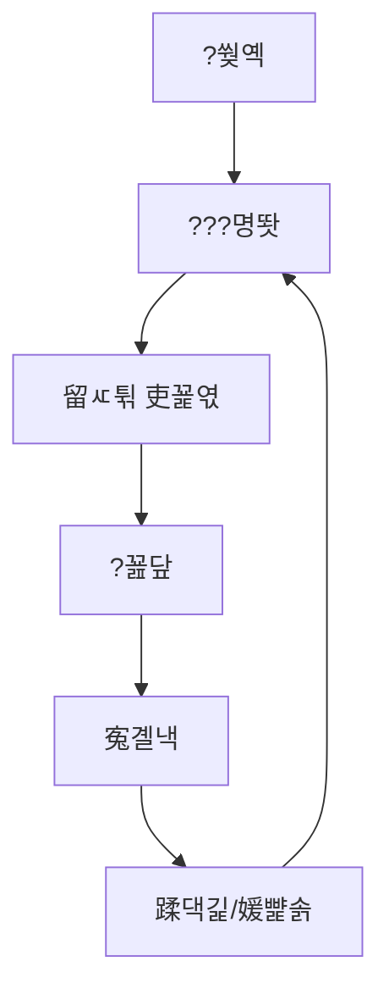

# 寃뚯엫 湲고쉷???쒗뵆由?(?쒓뎅???쒖?)

## ?쒖?
- 臾몄꽌 ?쒕ぉ:
- ?쒖븞 ?좏삎: ?좉퇋 湲고쉷 / ??린??
- ?€??寃뚯엫/踰꾩쟾:
- ?묒꽦??
- ?묒꽦??

## 紐⑹감
- 0. ?쒖?/紐⑹감
- 1. 媛쒖슂(Why)
- 2. 怨듦퀬/吏곷Т 留ㅽ븨
- 3. 蹂몃줎(What/How)
- 4. ?듭떖 ?щ?/硫붾━??
- 5. QA/寃€??
- 6. ?쇱젙/由ъ뒪??
- 遺€濡?A. ?꾪닾 ?쒖뒪???곸꽭
- 遺€濡?B. ?ㅽ궗 ?쒖뒪???곸꽭
- 遺€濡?C. ?ㅽ궗 ?좊땲硫붿씠???곗텧 媛€?대뱶

## 臾몄꽌 硫뷀?
| ??ぉ | ?댁슜 |
|---|---|
| 臾몄꽌紐?|  |
| 踰꾩쟾 |  |
| ?묒꽦??|  |
| ?묒꽦??|  |
| ?€??鍮뚮뱶/釉뚮옖移?|  |
| 愿€???댁뒋/?쒖뒪??|  |
| 李멸퀬 ?덊띁?곗뒪(濡쒖뺄 寃쎈줈) |  |

## 臾몄꽌 ?깃꺽 (怨좎젙/媛€蹂€)
| 援щ텇 | ?댁슜 |
|---|---|
| 臾몄꽌 ?섎룄(Intention) |  |
| 怨좎젙 ?붿냼(Fixed) |  |
| 媛€蹂€ ?붿냼(Variable) |  |
| 蹂€??踰붿쐞(Forecast) |  |

## 1. ?꾨줈?앺듃 媛쒖슂 (Why)
- ?λⅤ:
- ?뚮옯??
- ?€源??좎?:
- ??以?肄붿뼱 猷⑦봽:

| ??ぉ | ?뺤쓽 | 鍮꾧퀬 |
|---|---|---|
| 寃뚯엫 紐⑺몴 |  |  |
| ?몄뀡 湲몄씠 |  |  |
| ?듭떖 寃쏀뿕 |  |  |

| ?쒖븞 諛곌꼍(臾몄젣) | ?먯씤 | 湲곕? ?④낵 |
|---|---|---|
|  |  |  |

## 2. 怨듦퀬/吏곷Т ?붽뎄?ы빆 留ㅽ븨
| 怨듦퀬 ??ぉ | ?붽뎄 ?댁슜 | ?€??湲고쉷 ?뱀뀡 | 利앸튃 |
|---|---|---|---|
| 二쇱슂?낅Т |  |  |  |
| 吏€?먯옄寃?|  |  |  |
| ?곕??ы빆 |  |  |  |

## 3. ?뚮젅??洹쇨굅/?덊띁?곗뒪 愿€李?
| ?뚮젅??愿€李?| 臾몄젣 ?λ㈃ | ?먯씤 媛€??| 媛쒖꽑 媛€??|
|---|---|---|---|
|  |  |  |  |

## 4. ?듭떖 ?щ?/李⑤퀎??
- ?듭떖 ?щ?:
- 李⑤퀎??
- 寃쎌웳???€鍮??ъ???

| 鍮꾧탳 ??ぉ | ?곕━ 寃뚯엫 | ?덊띁?곗뒪 A | ?덊띁?곗뒪 B |
|---|---|---|---|
| ?꾪닾 ?쒗룷 |  |  |  |
| ?섏궗寃곗젙 諛€??|  |  |  |
| 媛€?낆꽦 |  |  |  |

## 5. 寃뚯엫 猷⑦봽/吏꾪뻾 援ъ“


| 猷⑦봽 ?④퀎 | ?낅젰 | 異쒕젰 | 寃€??湲곗? |
|---|---|---|---|
|  |  |  |  |

## 6. ?쒖뒪??湲고쉷 (What/How)
### 4.1 ?꾪닾
| ??ぉ | 洹쒖튃/怨듭떇 | 援ы쁽 寃쎈줈 |
|---|---|---|
|  |  | `scripts/battle/` |

### 4.2 ?깆옣/寃쎌젣
| ??ぉ | 洹쒖튃 | 援ы쁽 寃쎈줈 |
|---|---|---|
|  |  | `resources/cards/` |

## 7. 肄섑뀗痢?紐낆꽭
| 肄섑뀗痢?ID | ?좏삎 | 湲곕뒫 | 諛몃윴???ъ씤??|
|---|---|---|---|
|  |  |  |  |

## 7-1. 留??뚭컻 (?섑뵆-2 ?뺤옣)
### 7-1.1 2D ?됰㈃??
- 留??대?吏€ 寃쎈줈: `images/maps/...`

### 7-1.2 留??곌껐愿€怨?
```mermaid
flowchart LR
Z0[?쒖옉 援ъ뿭] --> Z1[二쇨굅]
Z1 --> Z2[?숆탳]
Z2 --> Z3[?곸뾽]
Z3 --> Z4[?붿썝]
Z4 --> Z5[吏€??
Z4 --> Z6[?곌컙]
```

### 7-1.3 踰붾?/?꾩씠肄?
| ?꾩씠肄?| ?섎? | ?몄텧 議곌굔 |
|---|---|---|
|  |  |  |

### 7-1.4 吏€??怨좊룄 ?ㅻ챸
| 援ъ뿭 | 怨좊룄 | ?대룞 ?쒖씠??| ?쒖빞 |
|---|---|---|---|
|  |  |  |  |

### 7-1.5 留??뚮씪誘명꽣
| ?뚮씪誘명꽣 | 媛?| 踰붿쐞 | 鍮꾧퀬 |
|---|---|---|---|
|  |  |  |  |

### 7-1.6 ?섑뵆-2(v2) ?곸슜 泥댄겕由ъ뒪??
| 泥댄겕 ??ぉ | ?꾨즺 ?щ?(Y/N) | 鍮꾧퀬 |
|---|---|---|
| ?쒕굹由ъ삤 -> 留?-> 吏€??-> ?ㅻ툕?앺듃 -> 踰붾? -> 諛깃렇?쇱슫??-> ?쒕뱶留덊겕 -> UI ?쒖꽌 以€??|  |  |
| 2D ?됰㈃??留?留곹겕/踰붾?瑜?濡쒖뺄 ?대?吏€濡??곌껐 (`docs/plans/images/...`) |  |  |
| 留??곌껐愿€怨??ㅼ씠?닿렇??mermaid) ?ы븿 |  |  |
| 留??뚮씪誘명꽣 CSV ?앹꽦 (`docs/plans/data/map_*.csv`) |  |  |
| 吏€??퀎 ?꾪뿕/蹂댁긽/?곹샇?묒슜 ?ㅻ툕?앺듃 ???묒꽦 |  |  |
| 罹먮┃???좏깮 UI/罹먮┃???앹꽦 UI ?붾㈃ 紐낆꽭 ?꾨즺 |  |  |
| ?몃? ???대?吏€ URL 吏곸젒 留곹겕 0嫄??뺤씤 |  |  |

## 7-2. 吏€???몃? ?뚭컻
| 吏€??ID | 吏€??챸 | 紐⑹쟻 | ?꾪뿕 | 蹂댁긽 | 二쇱슂 ?ㅻ툕?앺듃 |
|---|---|---|---|---|---|
|  |  |  |  |  |  |

## 7-3. 吏€??퀎 諛깃렇?쇱슫???섍꼍 ?ㅼ젙
| 吏€??| ?섍꼍 ?뚮쭏 | ?쒓컙?€ 蹂€??| ?좎뵪 ?곹뼢 | ?ъ슫???ㅼ썙??|
|---|---|---|---|---|
|  |  |  |  |  |

## 7-4. 吏€??퀎 ?쒕뱶留덊겕 ?뚭컻
| ?쒕뱶留덊겕 ID | ?꾩튂 | ?닿툑 議곌굔 | ?대윭?곕툕 ??븷 | UI ?꾩씠肄?|
|---|---|---|---|---|
|  |  |  |  |  |

## 8. UI/UX 湲고쉷
### 6.1 ?붾㈃ 紐⑸줉
| ?붾㈃ ID | ?붾㈃紐?| 吏꾩엯 議곌굔 | ?댄깉 議곌굔 |
|---|---|---|---|
|  |  |  |  |

### 6.2 ?붾㈃ ?뺤쓽
| 而댄룷?뚰듃 ID | ?€??| ?곹깭 | ?대깽??| ?곗씠???뚯뒪 |
|---|---|---|---|---|
|  |  |  |  |  |

### 6.3 ?덉쇅 泥섎━
| ?쒕굹由ъ삤 | 泥섎━ 諛⑹떇 | ?ъ슜???쇰뱶諛?|
|---|---|---|
|  |  |  |

### 6.4 罹먮┃???좏깮/?앹꽦 UI
| ?붾㈃ | 二쇱슂 而댄룷?뚰듃 | ?낅젰 | 寃€??湲곗? |
|---|---|---|---|
| 罹먮┃???좏깮 |  |  |  |
| 罹먮┃???앹꽦 |  |  |  |

## 9. 諛몃윴???섏튂 ?뺤콉
| 吏€??| 紐⑺몴媛?| 痢≪젙 諛⑸쾿 | 議곗젙 洹쒖튃 |
|---|---|---|---|
|  |  |  |  |

## 10. 湲곗닠/援ы쁽 ?붽뎄?ы빆
| ?붽뎄?ы빆 | ?곸꽭 | 愿€??寃쎈줈 |
|---|---|---|
|  |  |  |

## 11. QA/寃€??湲곗?
| 援щ텇 | 泥댄겕 ??ぉ | ?듦낵 湲곗? |
|---|---|---|
| 湲곕뒫 |  |  |
| ?깅뒫 |  |  |
| ?щ? |  |  |
| ?뚭? |  |  |

## 12. ?쇱젙/留덉씪?ㅽ넠/由ъ뒪??
| ?④퀎 | 湲곌컙 | ?곗텧臾?| 由ъ뒪??| ?€??|
|---|---|---|---|---|
|  |  |  |  |  |

## 12-1. BM/?좏넻/媛€寃??꾨왂
| ??ぉ | ?댁슜 |
|---|---|
| BM ?좏삎 |  |
| ?좏깮 ?댁쑀 |  |
| ?좎? 寃쏀뿕 由ъ뒪??|  |
| ?꾪솕 ?꾨왂 |  |
| 媛€寃??뺤콉 |  |

## 12-2. ?덉궛/BEP ?쒕??덉씠??
| ??ぉ | ?€ 媛쒕컻 | 1??媛쒕컻 |
|---|---|---|
| ?멸굔鍮?|  |  |
| ?먯뀑/?몄＜ |  |  |
| ???쇱씠?좎뒪 |  |  |
| 留덉???|  |  |
| ?댁쁺/?좎?鍮?|  |  |
| 珥앸퉬??|  |  |

| 媛€寃??쒕굹由ъ삤 | ?덉긽 援щℓ????| ?덉긽 留ㅼ텧 | BEP 異⑹” ?щ? |
|---|---|---|---|
|  |  |  |  |

## 13. ?듭떖 ?щ?/?좎? 硫붾━???붿빟
| ??ぉ | ?댁슜 |
|---|---|
| ?듭떖 ?щ? ?ъ씤??|  |
| ?좎? 硫붾━??|  |
| 洹몃옒??臾댁뾿???щ씪吏€?붽? |  |

## 13-1. 踰ㅼ튂留덊겕 ?곸슜??
| 李멸퀬??| 李멸퀬 ?쒖뒪??| ?곕━ 寃뚯엫 ?곸슜 諛⑹떇 | 李⑤퀎???ъ씤??|
|---|---|---|---|
|  |  |  |  |

## 14. 蹂€寃??대젰/寃곗젙 湲곕줉 (Decision Log)
| ?좎쭨 | 蹂€寃???ぉ | 蹂€寃??댁쑀 | ?곹뼢 踰붿쐞 | ?뱀씤/?⑹쓽 |
|---|---|---|---|---|
|  |  |  |  |  |

## 遺€濡?A. ?꾪닾 ?쒖뒪???곸꽭 (?꾨줈洹몃옒癒??꾨떖??
| 援щ텇 | ?댁슜 |
|---|---|
| ?쒖뒪??紐⑹쟻 |  |
| ?쒖뒪???뚮줈??|  |
| 援ъ꽦 ?붿냼 |  |
| ?쒖뒪??洹쒖튃 |  |
| ?쒖뒪??蹂€??|  |
| UI ?명꽣?섏씠??|  |
| ?덉쇅 泥섎━ |  |
| 湲곗닠 ?붽뎄?ы빆 |  |

## 遺€濡?B. ?ㅽ궗 ?쒖뒪???곸꽭
| 援щ텇 | ?댁슜 |
|---|---|
| ?ㅽ궗 醫낅쪟/?④낵 |  |
| ?듬뱷/?낃렇?덉씠??|  |
| ?ъ슜 ?낅젰/UI |  |
| ?섏튂(?곕?吏€/荑⑦???踰붿쐞/吏€?? |  |
| 諛쒕룞 議곌굔/?쒗븳 |  |
| 議고빀/?쒕꼫吏€ |  |
| ?뚯뒪??耳€?댁뒪 |  |

## 遺€濡?C. ?ㅽ궗 ?좊땲硫붿씠???곗텧 媛€?대뱶
| ??ぉ | ?댁슜 |
|---|---|
| ?좊땲硫붿씠???대쫫 |  |
| 湲몄씠 |  |
| ?€寃??꾨젅??|  |
| 罹붿뒳 媛€??援ш컙 |  |
| VFX ?몃━嫄?|  |
| SFX ?몃━嫄?|  |
| 援ы쁽 ?대떦 |  |

## 15. 遺€濡?
- ?대?吏€ 寃쎈줈: `docs/plans/images/...`
- ?곗씠??CSV 寃쎈줈: `docs/plans/data/...`
