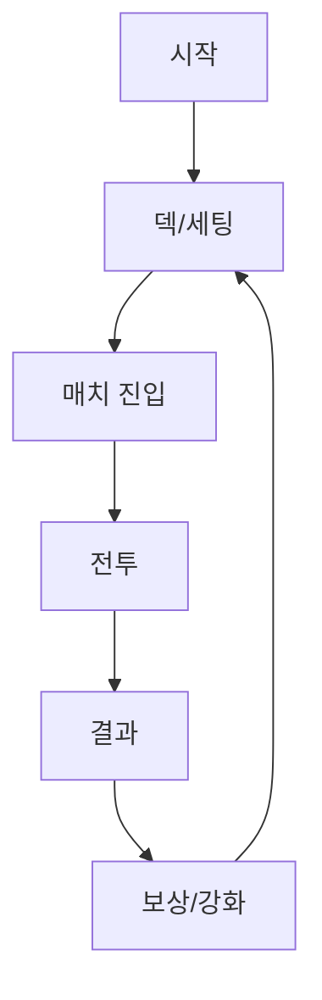
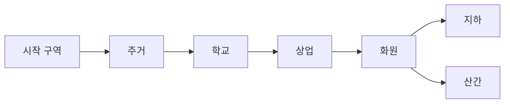

# 게임 기획서 템플릿 (한국어 표준)

## 표지
- 문서 제목:
- 제안 유형: 신규 기획 / 역기획
- 대상 게임/버전:
- 작성자:
- 작성일:

## 목차
- 0. 표지/목차
- 1. 개요(Why)
- 2. 공고/직무 매핑
- 3. 본론(What/How)
- 4. 핵심 재미/메리트
- 5. QA/검수
- 6. 일정/리스크
- 부록 A. 전투 시스템 상세
- 부록 B. 스킬 시스템 상세
- 부록 C. 스킬 애니메이션/연출 가이드

## 문서 메타
| 항목 | 내용 |
|---|---|
| 문서명 |  |
| 버전 |  |
| 작성일 |  |
| 작성자 |  |
| 대상 빌드/브랜치 |  |
| 관련 이슈/태스크 |  |
| 참고 레퍼런스(로컬 경로) |  |

## 문서 성격 (고정/가변)
| 구분 | 내용 |
|---|---|
| 문서 의도(Intention) |  |
| 고정 요소(Fixed) |  |
| 가변 요소(Variable) |  |
| 변동 범위(Forecast) |  |

## 1. 프로젝트 개요 (Why)
- 장르:
- 플랫폼:
- 타깃 유저:
- 한 줄 코어 루프:

| 항목 | 정의 | 비고 |
|---|---|---|
| 게임 목표 |  |  |
| 세션 길이 |  |  |
| 핵심 경험 |  |  |

| 제안 배경(문제) | 원인 | 기대 효과 |
|---|---|---|
|  |  |  |

## 2. 공고/직무 요구사항 매핑
| 공고 항목 | 요구 내용 | 대응 기획 섹션 | 증빙 |
|---|---|---|---|
| 주요업무 |  |  |  |
| 지원자격 |  |  |  |
| 우대사항 |  |  |  |

## 3. 플레이 근거/레퍼런스 관찰
| 플레이 관찰 | 문제 장면 | 원인 가설 | 개선 가설 |
|---|---|---|---|
|  |  |  |  |

## 4. 핵심 재미/차별점
- 핵심 재미:
- 차별점:
- 경쟁작 대비 포지션:

| 비교 항목 | 우리 게임 | 레퍼런스 A | 레퍼런스 B |
|---|---|---|---|
| 전투 템포 |  |  |  |
| 의사결정 밀도 |  |  |  |
| 가독성 |  |  |  |

## 5. 게임 루프/진행 구조

| 루프 단계 | 입력 | 출력 | 검수 기준 |
|---|---|---|---|
|  |  |  |  |

## 6. 시스템 기획 (What/How)
### 4.1 전투
| 항목 | 규칙/공식 | 구현 경로 |
|---|---|---|
|  |  | `scripts/battle/` |

### 4.2 성장/경제
| 항목 | 규칙 | 구현 경로 |
|---|---|---|
|  |  | `resources/cards/` |

## 7. 콘텐츠 명세
| 콘텐츠 ID | 유형 | 기능 | 밸런스 포인트 |
|---|---|---|---|
|  |  |  |  |

## 7-1. 맵 소개 (샘플-2 확장)
### 7-1.1 2D 평면도
- 맵 이미지 경로: `images/maps/...`

### 7-1.2 맵 연결관계

### 7-1.3 범례/아이콘
| 아이콘 | 의미 | 노출 조건 |
|---|---|---|
|  |  |  |

### 7-1.4 지형/고도 설명
| 구역 | 고도 | 이동 난이도 | 시야 |
|---|---|---|---|
|  |  |  |  |

### 7-1.5 맵 파라미터
| 파라미터 | 값 | 범위 | 비고 |
|---|---|---|---|
|  |  |  |  |

## 7-2. 지역 세부 소개
| 지역 ID | 지역명 | 목적 | 위험 | 보상 | 주요 오브젝트 |
|---|---|---|---|---|---|
|  |  |  |  |  |  |

## 7-3. 지역별 백그라운드 환경 설정
| 지역 | 환경 테마 | 시간대 변화 | 날씨 영향 | 사운드 키워드 |
|---|---|---|---|---|
|  |  |  |  |  |

## 7-4. 지역별 랜드마크 소개
| 랜드마크 ID | 위치 | 해금 조건 | 내러티브 역할 | UI 아이콘 |
|---|---|---|---|---|
|  |  |  |  |  |

## 8. UI/UX 기획
### 6.1 화면 목록
| 화면 ID | 화면명 | 진입 조건 | 이탈 조건 |
|---|---|---|---|
|  |  |  |  |

### 6.2 화면 정의
| 컴포넌트 ID | 타입 | 상태 | 이벤트 | 데이터 소스 |
|---|---|---|---|---|
|  |  |  |  |  |

### 6.3 예외 처리
| 시나리오 | 처리 방식 | 사용자 피드백 |
|---|---|---|
|  |  |  |

### 6.4 캐릭터 선택/생성 UI
| 화면 | 주요 컴포넌트 | 입력 | 검수 기준 |
|---|---|---|---|
| 캐릭터 선택 |  |  |  |
| 캐릭터 생성 |  |  |  |

## 9. 밸런스/수치 정책
| 지표 | 목표값 | 측정 방법 | 조정 규칙 |
|---|---|---|---|
|  |  |  |  |

## 10. 기술/구현 요구사항
| 요구사항 | 상세 | 관련 경로 |
|---|---|---|
|  |  |  |

## 11. QA/검수 기준
| 구분 | 체크 항목 | 통과 기준 |
|---|---|---|
| 기능 |  |  |
| 성능 |  |  |
| 재미 |  |  |
| 회귀 |  |  |

## 12. 일정/마일스톤/리스크
| 단계 | 기간 | 산출물 | 리스크 | 대응 |
|---|---|---|---|---|
|  |  |  |  |  |

## 12-1. BM/유통/가격 전략
| 항목 | 내용 |
|---|---|
| BM 유형 |  |
| 선택 이유 |  |
| 유저 경험 리스크 |  |
| 완화 전략 |  |
| 가격 정책 |  |

## 12-2. 예산/BEP 시뮬레이션
| 항목 | 팀 개발 | 1인 개발 |
|---|---|---|
| 인건비 |  |  |
| 에셋/외주 |  |  |
| 툴/라이선스 |  |  |
| 마케팅 |  |  |
| 운영/유지비 |  |  |
| 총비용 |  |  |

| 가격 시나리오 | 예상 구매자 수 | 예상 매출 | BEP 충족 여부 |
|---|---|---|---|
|  |  |  |  |

## 13. 핵심 재미/유저 메리트 요약
| 항목 | 내용 |
|---|---|
| 핵심 재미 포인트 |  |
| 유저 메리트 |  |
| 그래서 무엇이 달라지는가 |  |

## 13-1. 벤치마크 적용표
| 참고작 | 참고 시스템 | 우리 게임 적용 방식 | 차별화 포인트 |
|---|---|---|---|
|  |  |  |  |

## 14. 변경 이력/결정 기록 (Decision Log)
| 날짜 | 변경 항목 | 변경 이유 | 영향 범위 | 승인/합의 |
|---|---|---|---|---|
|  |  |  |  |  |

## 부록 A. 전투 시스템 상세 (프로그래머 전달용)
| 구분 | 내용 |
|---|---|
| 시스템 목적 |  |
| 시스템 플로우 |  |
| 구성 요소 |  |
| 시스템 규칙 |  |
| 시스템 변수 |  |
| UI 인터페이스 |  |
| 예외 처리 |  |
| 기술 요구사항 |  |

## 부록 B. 스킬 시스템 상세
| 구분 | 내용 |
|---|---|
| 스킬 종류/효과 |  |
| 습득/업그레이드 |  |
| 사용 입력/UI |  |
| 수치(데미지/쿨타임/범위/지속) |  |
| 발동 조건/제한 |  |
| 조합/시너지 |  |
| 테스트 케이스 |  |

## 부록 C. 스킬 애니메이션/연출 가이드
| 항목 | 내용 |
|---|---|
| 애니메이션 이름 |  |
| 길이 |  |
| 타격 프레임 |  |
| 캔슬 가능 구간 |  |
| VFX 트리거 |  |
| SFX 트리거 |  |
| 구현 담당 |  |

## 15. 부록
- 이미지 경로: `docs/plans/images/...`
- 데이터 CSV 경로: `docs/plans/data/...`
