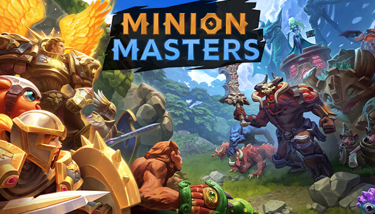
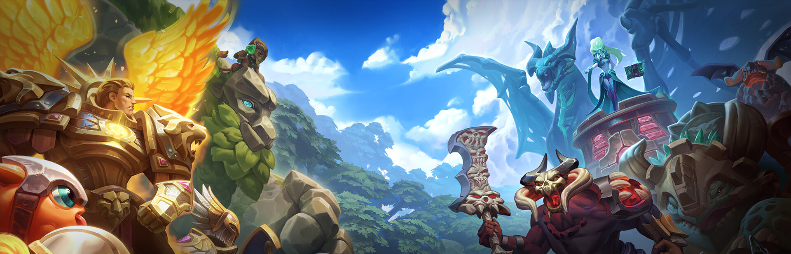
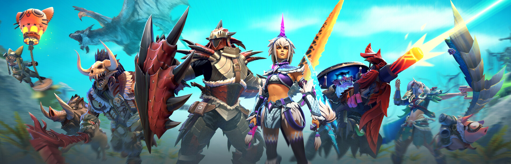

# Web Reference Pack

- GeneratedAt: 2026-02-13 15:02:03
- Rule: 웹에서 레퍼런스 이미지를 수집하고, 로컬 파일로 저장한 뒤 기획서에는 로컬 경로만 링크한다.
- Source map CSV: `docs/plans/data/web_reference_sources.csv`

## 실제 레퍼런스 이미지(로컬 파일)
### Ref 1 - Minion Masters header
- Source URL: https://shared.fastly.steamstatic.com/store_item_assets/steam/apps/489520/header.jpg
- Local File: `docs/plans/images/web_refs/web_ref_01.jpg`

### Ref 2 - Minion Masters capsule
- Source URL: https://shared.fastly.steamstatic.com/store_item_assets/steam/apps/489520/capsule_616x353.jpg
- Local File: `docs/plans/images/web_refs/web_ref_02.jpg`

### Ref 3 - Minion Masters hero
- Source URL: https://shared.fastly.steamstatic.com/store_item_assets/steam/apps/489520/library_hero.jpg
- Local File: `docs/plans/images/web_refs/web_ref_03.jpg`

### Ref 4 - Slay the Spire header
- Source URL: https://shared.fastly.steamstatic.com/store_item_assets/steam/apps/646570/header.jpg
- Local File: `docs/plans/images/web_refs/web_ref_04.jpg`

### Ref 5 - Slay the Spire capsule
- Source URL: https://shared.fastly.steamstatic.com/store_item_assets/steam/apps/646570/capsule_616x353.jpg
- Local File: `docs/plans/images/web_refs/web_ref_05.jpg`

### Ref 6 - Slay the Spire hero
- Source URL: https://shared.fastly.steamstatic.com/store_item_assets/steam/apps/646570/library_hero.jpg
- Local File: `docs/plans/images/web_refs/web_ref_06.jpg`

### Ref 7 - Dota 2 header
- Source URL: https://shared.fastly.steamstatic.com/store_item_assets/steam/apps/570/header.jpg
- Local File: `docs/plans/images/web_refs/web_ref_07.jpg`

### Ref 8 - Dota 2 capsule
- Source URL: https://shared.fastly.steamstatic.com/store_item_assets/steam/apps/570/capsule_616x353.jpg
- Local File: `docs/plans/images/web_refs/web_ref_08.jpg`

### Ref 9 - Dota 2 hero
- Source URL: https://shared.fastly.steamstatic.com/store_item_assets/steam/apps/570/library_hero.jpg
- Local File: `docs/plans/images/web_refs/web_ref_09.jpg`

### Ref 10 - CS2 header
- Source URL: https://shared.fastly.steamstatic.com/store_item_assets/steam/apps/730/header.jpg
- Local File: `docs/plans/images/web_refs/web_ref_10.jpg`

### Ref 11 - CS2 capsule
- Source URL: https://shared.fastly.steamstatic.com/store_item_assets/steam/apps/730/capsule_616x353.jpg
- Local File: `docs/plans/images/web_refs/web_ref_11.jpg`

### Ref 12 - TF2 header
- Source URL: https://shared.fastly.steamstatic.com/store_item_assets/steam/apps/440/header.jpg
- Local File: `docs/plans/images/web_refs/web_ref_12.jpg`

